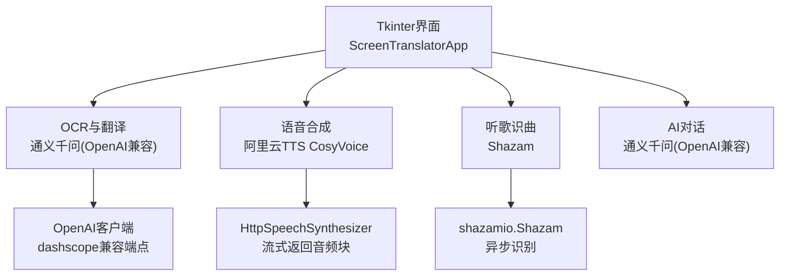
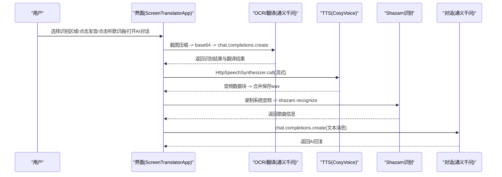
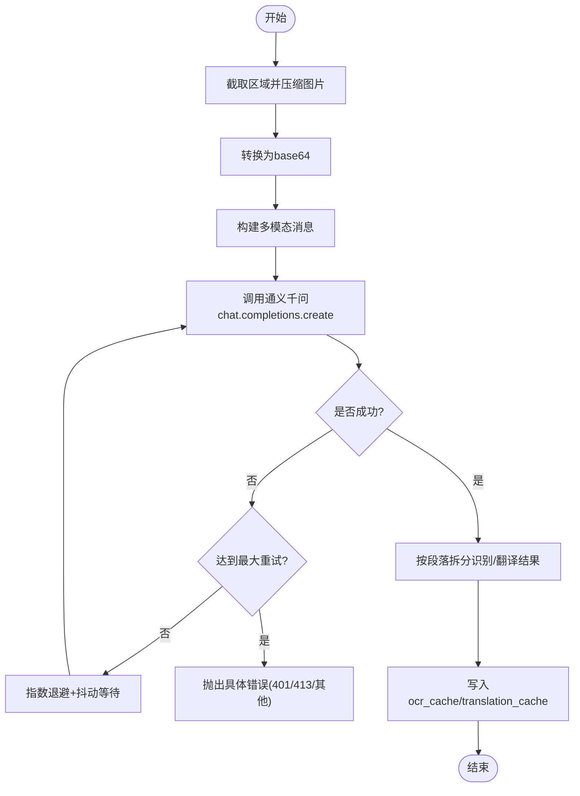
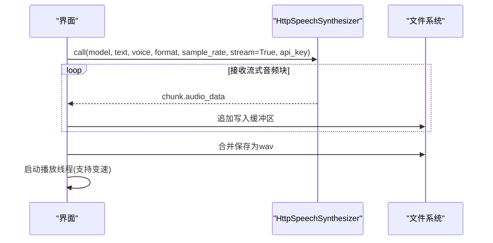
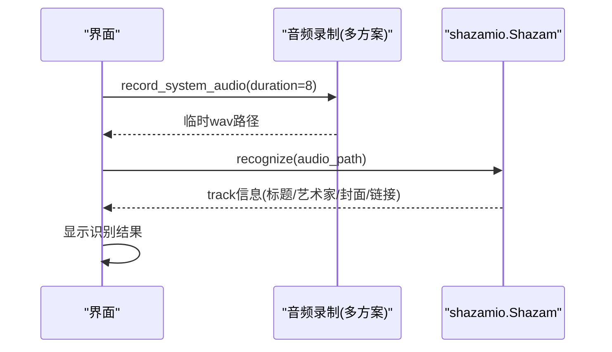
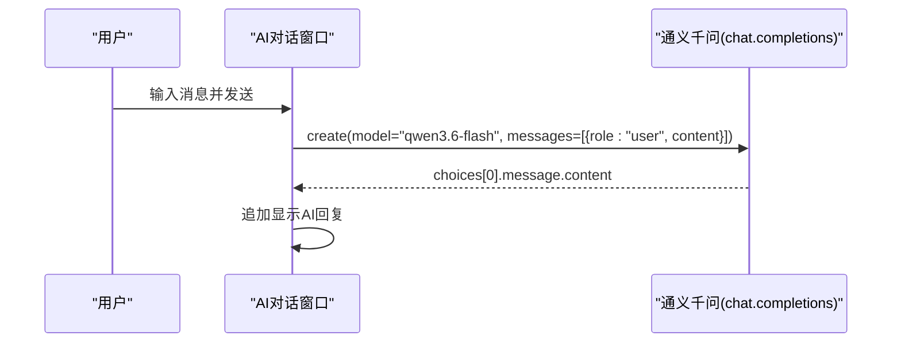
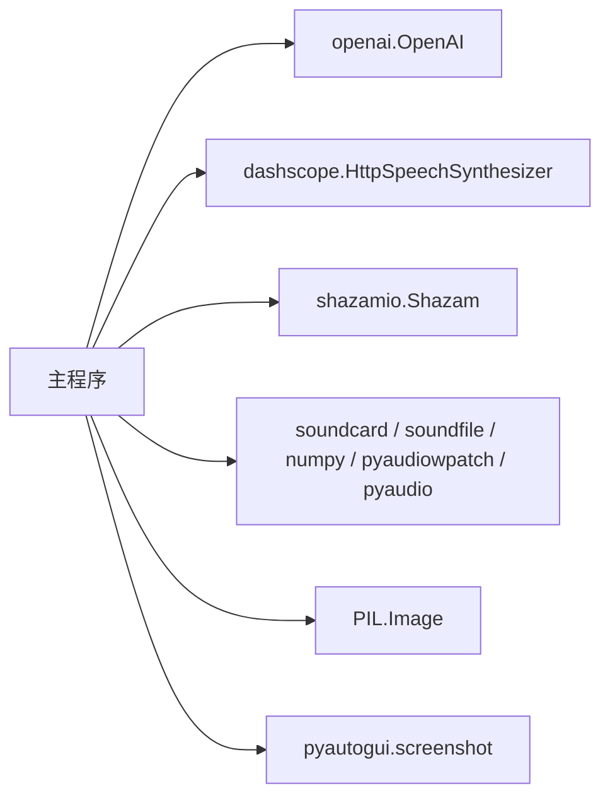

# API集成

<cite>
**本文引用的文件**
- [screen_translator_with_qwen.py](file://screen_translator_with_qwen.py)
- [qwen_ocr.py](file://test/qwen_ocr.py)
- [cosyvoice.py](file://test/cosyvoice.py)
- [shazam_test.py](file://test/shazam_test.py)
- [glm_ocr_example.py](file://test/glm_ocr_example.py)
- [glm_translate_example.py](file://test/glm_translate_example.py)
</cite>

## 目录
1. [简介](#简介)
2. [项目结构](#项目结构)
3. [核心组件](#核心组件)
4. [架构总览](#架构总览)
5. [详细组件分析](#详细组件分析)
6. [依赖关系分析](#依赖关系分析)
7. [性能与稳定性](#性能与稳定性)
8. [故障排查指南](#故障排查指南)
9. [结论](#结论)
10. [附录：API密钥管理与最佳实践](#附录api密钥管理与最佳实践)

## 简介
本文件面向开发者，系统化说明本项目对以下服务的集成方式与使用要点：
- 通义千问（OpenAI兼容）OCR识别、翻译与对话接口
- 阿里云TTS（CosyVoice）语音合成
- Shazam音乐识别
- 智谱GLM的OCR与翻译示例（参考）

文档覆盖客户端初始化、请求参数、错误处理策略、重试与退避机制、音频录制与播放流程、以及密钥管理最佳实践。

## 项目结构
本项目以单文件应用为主，辅以若干测试脚本用于演示各API调用方式。关键入口与模块职责如下：
- 主程序：屏幕截图区域选择、OCR识别、文本翻译、TTS发音、听歌识曲、AI对话窗口等
- 测试脚本：分别演示通义千问OCR、CosyVoice TTS、Shazam识别、GLM OCR/翻译

图表来源
- [screen_translator_with_qwen.py:348-360](file://screen_translator_with_qwen.py#L348-L360)
- [screen_translator_with_qwen.py:1509-1531](file://screen_translator_with_qwen.py#L1509-L1531)
- [screen_translator_with_qwen.py:2233-2270](file://screen_translator_with_qwen.py#L2233-L2270)
- [qwen_ocr.py:1-30](file://test/qwen_ocr.py#L1-L30)
- [cosyvoice.py:1-40](file://test/cosyvoice.py#L1-L40)
- [shazam_test.py:1-66](file://test/shazam_test.py#L1-L66)

章节来源
- [screen_translator_with_qwen.py:1-120](file://screen_translator_with_qwen.py#L1-L120)

## 核心组件
- 通义千问（OpenAI兼容）客户端
  - 通过OpenAI SDK访问dashscope兼容端点，支持图像+文本多模态输入，用于OCR识别与翻译；同时提供纯文本对话能力。
- 阿里云TTS（CosyVoice）
  - 通过HttpSpeechSynthesizer进行流式语音合成，返回音频数据块，本地拼接后保存并播放。
- Shazam音乐识别
  - 通过shazamio库异步识别系统录制的音频片段，解析歌曲信息。
- GLM示例（参考）
  - 展示zai客户端的OCR与翻译调用方式，便于对比不同厂商模型的使用差异。

章节来源
- [screen_translator_with_qwen.py:348-360](file://screen_translator_with_qwen.py#L348-L360)
- [screen_translator_with_qwen.py:1509-1531](file://screen_translator_with_qwen.py#L1509-L1531)
- [screen_translator_with_qwen.py:2233-2270](file://screen_translator_with_qwen.py#L2233-L2270)
- [qwen_ocr.py:1-30](file://test/qwen_ocr.py#L1-L30)
- [cosyvoice.py:1-40](file://test/cosyvoice.py#L1-L40)
- [shazam_test.py:1-66](file://test/shazam_test.py#L1-L66)
- [glm_ocr_example.py:1-33](file://test/glm_ocr_example.py#L1-L33)
- [glm_translate_example.py:1-16](file://test/glm_translate_example.py#L1-L16)

## 架构总览
下图展示了从用户操作到各API服务的关键调用链路与数据流向。

图表来源
- [screen_translator_with_qwen.py:927-1021](file://screen_translator_with_qwen.py#L927-L1021)
- [screen_translator_with_qwen.py:1123-1247](file://screen_translator_with_qwen.py#L1123-L1247)
- [screen_translator_with_qwen.py:1509-1531](file://screen_translator_with_qwen.py#L1509-L1531)
- [screen_translator_with_qwen.py:2233-2270](file://screen_translator_with_qwen.py#L2233-L2270)
- [screen_translator_with_qwen.py:259-288](file://screen_translator_with_qwen.py#L259-L288)

## 详细组件分析

### 通义千问（OpenAI兼容）OCR与翻译
- 客户端初始化
  - 使用OpenAI SDK，base_url指向dashscope兼容端点，读取本地key.txt作为API Key。
- OCR与翻译流程
  - 截取选定区域 -> 增强对比度并灰度化 -> 压缩为JPEG -> 转PNG内存流 -> base64编码 -> 构造多模态消息（image_url + text）-> 调用chat.completions.create -> 解析“识别结果”和“翻译结果”两段文本 -> 写入缓存。
- 错误处理与重试
  - 指数退避+随机抖动，最大重试次数可配置；针对429限频错误特殊处理；401认证失败、413载荷过大等异常给出明确提示。
- 线程与UI更新
  - 所有耗时操作在子线程执行，通过root.after在主线程安全更新UI状态。

图表来源
- [screen_translator_with_qwen.py:1098-1122](file://screen_translator_with_qwen.py#L1098-L1122)
- [screen_translator_with_qwen.py:1123-1247](file://screen_translator_with_qwen.py#L1123-L1247)

章节来源
- [screen_translator_with_qwen.py:338-360](file://screen_translator_with_qwen.py#L338-L360)
- [screen_translator_with_qwen.py:927-1021](file://screen_translator_with_qwen.py#L927-L1021)
- [screen_translator_with_qwen.py:1098-1122](file://screen_translator_with_qwen.py#L1098-L1122)
- [screen_translator_with_qwen.py:1123-1247](file://screen_translator_with_qwen.py#L1123-L1247)
- [qwen_ocr.py:1-30](file://test/qwen_ocr.py#L1-L30)

### 阿里云TTS（CosyVoice）语音合成
- 初始化与调用
  - 使用HttpSpeechSynthesizer.call进行流式合成，指定模型、音色、格式、采样率、stream=True，传入api_key。
- 数据处理
  - 迭代返回的chunk，过滤包含完整URL的末尾chunk，仅收集audio_data，拼接后写入本地wav文件。
- 播放控制
  - 支持停止当前播放、切换速度模式（正常/0.75倍速），基于线性插值实现变速重采样。

图表来源
- [screen_translator_with_qwen.py:1509-1531](file://screen_translator_with_qwen.py#L1509-L1531)
- [cosyvoice.py:1-40](file://test/cosyvoice.py#L1-L40)
- [screen_translator_with_qwen.py:372-472](file://screen_translator_with_qwen.py#L372-L472)

章节来源
- [screen_translator_with_qwen.py:1509-1531](file://screen_translator_with_qwen.py#L1509-L1531)
- [cosyvoice.py:1-40](file://test/cosyvoice.py#L1-L40)
- [screen_translator_with_qwen.py:372-472](file://screen_translator_with_qwen.py#L372-L472)

### Shazam音乐识别
- 依赖检测
  - 运行时检测shazamio、soundcard/soundfile/numpy、pyaudiowpatch可用性，缺失则给出安装提示。
- 音频录制
  - 优先尝试soundcard环形回录；若失败或检测到蓝牙耳机不支持，则尝试pyaudiowpatch WASAPI环回；最后尝试pyaudio立体声混音。
- 识别流程
  - 将录制得到的临时wav文件路径传给shazamio.Shazam().recognize，解析track字段中的title、subtitle、images、share等信息。
- 错误处理
  - 捕获网络/设备/权限等异常，记录日志并在UI中反馈。

图表来源
- [screen_translator_with_qwen.py:1789-1851](file://screen_translator_with_qwen.py#L1789-L1851)
- [screen_translator_with_qwen.py:2233-2270](file://screen_translator_with_qwen.py#L2233-L2270)
- [shazam_test.py:1-66](file://test/shazam_test.py#L1-L66)

章节来源
- [screen_translator_with_qwen.py:314-336](file://screen_translator_with_qwen.py#L314-L336)
- [screen_translator_with_qwen.py:1789-1851](file://screen_translator_with_qwen.py#L1789-L1851)
- [screen_translator_with_qwen.py:2233-2270](file://screen_translator_with_qwen.py#L2233-L2270)
- [shazam_test.py:1-66](file://test/shazam_test.py#L1-L66)

### AI对话接口（通义千问）
- 触发方式
  - 界面按钮打开独立对话窗口，用户在输入框发送消息，后台调用chat.completions.create。
- 错误处理
  - 区分401认证失败、429限频以及其他网络错误，友好提示用户。
- 线程与UI
  - 在新线程中发起请求，完成后回调主线程更新聊天历史。

图表来源
- [screen_translator_with_qwen.py:259-288](file://screen_translator_with_qwen.py#L259-L288)

章节来源
- [screen_translator_with_qwen.py:259-288](file://screen_translator_with_qwen.py#L259-L288)

### GLM示例（参考）
- OCR示例
  - 使用zai.ZhipuAiClient，以image_url类型传递base64图片，附带提示词要求保持原始格式输出。
- 翻译示例
  - 使用相同客户端，发送纯文本翻译请求，关闭thinking以提升响应速度。

章节来源
- [glm_ocr_example.py:1-33](file://test/glm_ocr_example.py#L1-L33)
- [glm_translate_example.py:1-16](file://test/glm_translate_example.py#L1-L16)

## 依赖关系分析
- OpenAI SDK
  - 用于访问dashscope兼容端点，统一调用chat.completions.create。
- dashscope TTS
  - 通过HttpSpeechSynthesizer进行流式语音合成。
- shazamio
  - 异步音乐识别，需要事件循环运行。
- 音频采集与播放
  - soundcard/soundfile/numpy（环形回录）、pyaudiowpatch（WASAPI环回）、pyaudio（立体声混音）。
- 可选依赖
  - keyboard（全局快捷键）、pyautogui（截图）、PIL（图像处理）。

图表来源
- [screen_translator_with_qwen.py:1-20](file://screen_translator_with_qwen.py#L1-L20)
- [screen_translator_with_qwen.py:314-336](file://screen_translator_with_qwen.py#L314-L336)

章节来源
- [screen_translator_with_qwen.py:1-20](file://screen_translator_with_qwen.py#L1-L20)
- [screen_translator_with_qwen.py:314-336](file://screen_translator_with_qwen.py#L314-L336)

## 性能与稳定性
- 图像预处理
  - 提升对比度并灰度化，降低后续OCR难度；压缩质量可调，平衡体积与识别精度。
- 重试与退避
  - 指数退避+随机抖动，避免雪崩效应；对429限频做专门处理。
- 流式TTS
  - 边收边写，减少首包延迟；本地拼接后一次性播放，支持变速。
- 音频录制多方案
  - 自动降级策略，提高在不同硬件环境下的成功率。

[本节为通用指导，不直接分析具体文件]

## 故障排查指南
- 认证失败（401）
  - 检查key.txt内容是否正确、未被截断或包含多余空白字符。
- 请求过于频繁（429）
  - 等待一段时间后再试；适当增大重试间隔或降低调用频率。
- 载荷过大（413）
  - 缩小识别区域或降低图像质量；必要时分块处理。
- 无法录制系统音频
  - 确认已启用立体声混音或安装pyaudiowpatch；蓝牙耳机可能不支持某些环回方式，建议切换至内置扬声器或有线耳机。
- 依赖缺失
  - 根据日志提示安装对应库（如shazamio、soundcard、soundfile、numpy、keyboard等）。

章节来源
- [screen_translator_with_qwen.py:1215-1247](file://screen_translator_with_qwen.py#L1215-L1247)
- [screen_translator_with_qwen.py:1789-1851](file://screen_translator_with_qwen.py#L1789-L1851)
- [screen_translator_with_qwen.py:314-336](file://screen_translator_with_qwen.py#L314-L336)

## 结论
本项目围绕通义千问（OCR/翻译/对话）、阿里云TTS与Shazam三大能力构建了完整的屏幕翻译与辅助工具。通过合理的错误处理、重试退避、流式合成与多方案音频录制，提升了鲁棒性与用户体验。建议在工程化部署时引入更完善的密钥管理与监控告警机制。

[本节为总结性内容，不直接分析具体文件]

## 附录：API密钥管理与最佳实践
- 安全存储
  - 使用只读配置文件（如key.txt）存放密钥，限制文件权限，避免提交到版本库。
- 动态加载
  - 程序启动时读取密钥并初始化客户端；若读取失败，立即记录错误并禁用相关功能。
- 错误恢复
  - 对认证失败、限频、超时等错误进行分类处理，结合重试与退避策略；对不可恢复错误及时提示用户。
- 调试技巧
  - 开启详细日志，记录请求参数与错误堆栈；在UI中提供日志窗口以便快速定位问题。
- 速率限制与配额
  - 合理设置并发与重试上限；在高峰期主动降速或排队处理。
- 敏感信息保护
  - 不在日志中打印完整密钥；对外暴露最小必要信息。

章节来源
- [screen_translator_with_qwen.py:338-360](file://screen_translator_with_qwen.py#L338-L360)
- [screen_translator_with_qwen.py:1215-1247](file://screen_translator_with_qwen.py#L1215-L1247)