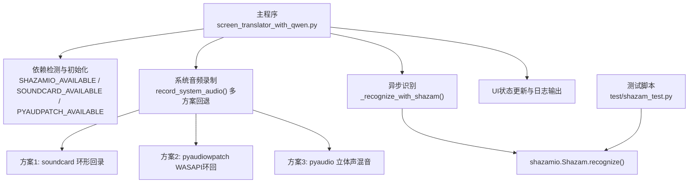
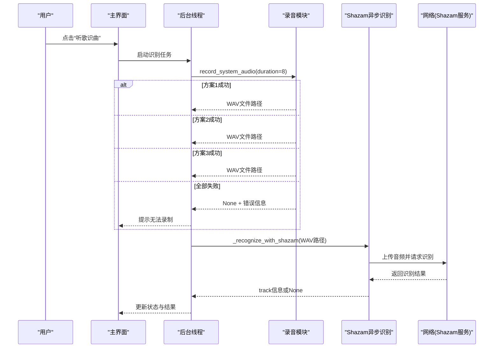
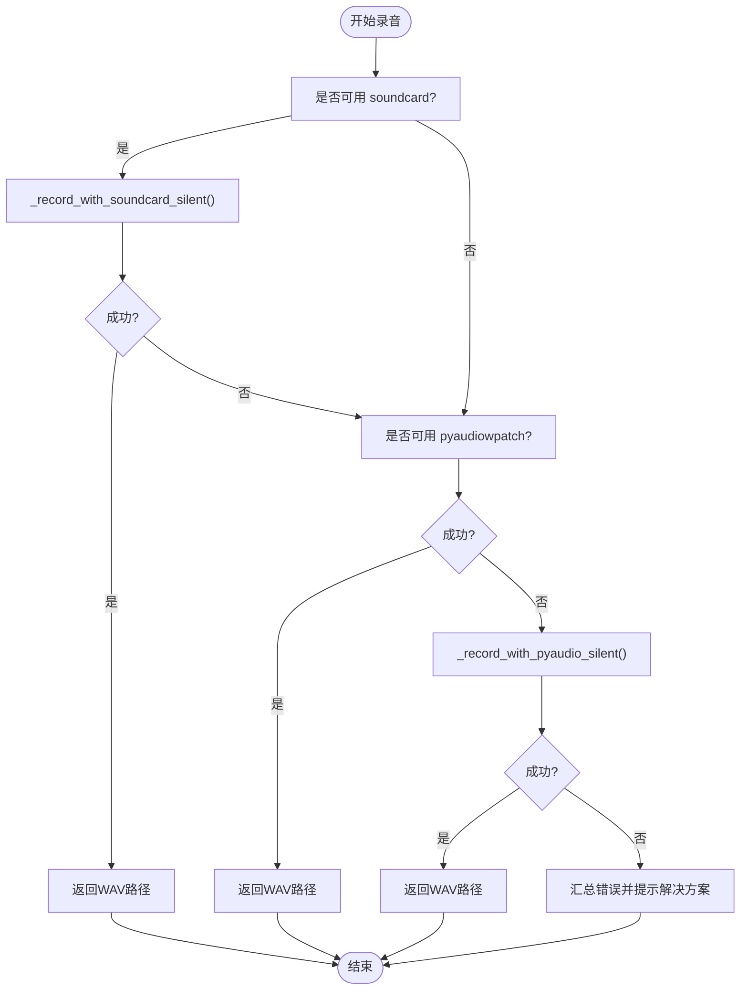
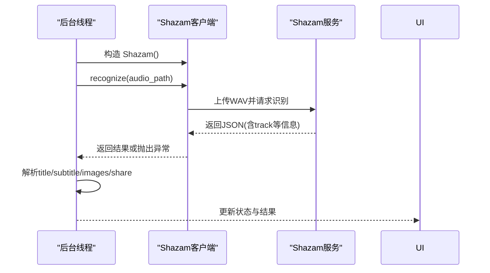
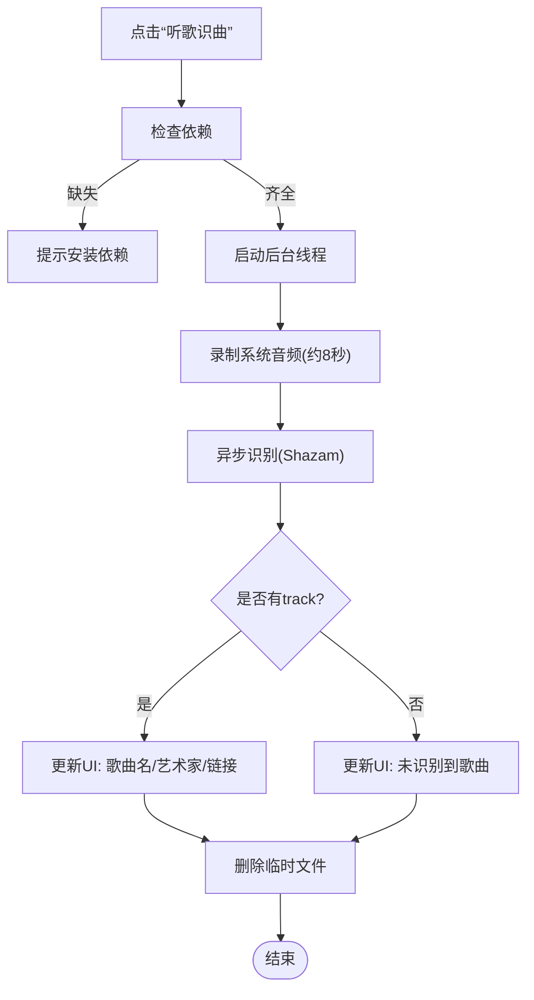
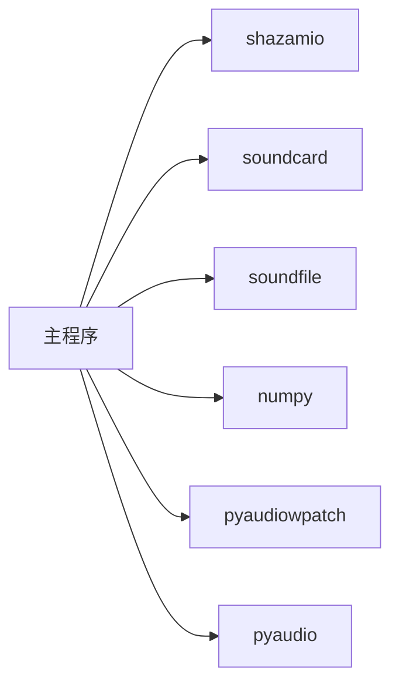

# Shazam音乐识别API集成

<cite>
**本文引用的文件**   
- [screen_translator_with_qwen.py](file://screen_translator_with_qwen.py)
- [shazam_test.py](file://test/shazam_test.py)
- [requirements.txt](file://requirements.txt)
- [OPPO Enco Free4.py](file://test/OPPO Enco Free4.py)
</cite>

## 目录
1. [简介](#简介)
2. [项目结构](#项目结构)
3. [核心组件](#核心组件)
4. [架构总览](#架构总览)
5. [详细组件分析](#详细组件分析)
6. [依赖关系分析](#依赖关系分析)
7. [性能与质量优化](#性能与质量优化)
8. [故障排查指南](#故障排查指南)
9. [结论](#结论)
10. [附录：使用示例与最佳实践](#附录使用示例与最佳实践)

## 简介
本文件面向需要在桌面应用中集成“听歌识曲”能力的开发者，围绕Shazam服务（通过 shazamio）的系统音频录制、特征提取、网络识别与结果展示进行系统化说明。文档覆盖以下要点：
- Shazam对象创建与配置、可选依赖检查与降级处理
- 系统音频录制方案（soundcard、pyaudiowpatch、pyaudio立体声混音）
- 音频采样率、声道数、片段截取与格式转换
- 调用Shazam API上传音频、发送识别请求与解析结果
- 完整工作流：从录音到结果展示的端到端流程
- 错误处理、超时控制与用户体验优化建议
- 服务限制与替代方案（网络异常、离线策略）

## 项目结构
本项目将“听歌识曲”功能嵌入到一个屏幕翻译工具中，相关实现集中在主程序文件中，并提供一个最小可运行的测试脚本用于验证Shazam识别能力。

图表来源
- [screen_translator_with_qwen.py:314-336](file://screen_translator_with_qwen.py#L314-L336)
- [screen_translator_with_qwen.py:1800-1851](file://screen_translator_with_qwen.py#L1800-L1851)
- [screen_translator_with_qwen.py:2233-2271](file://screen_translator_with_qwen.py#L2233-L2271)
- [shazam_test.py:16-30](file://test/shazam_test.py#L16-L30)

章节来源
- [screen_translator_with_qwen.py:314-336](file://screen_translator_with_qwen.py#L314-L336)
- [screen_translator_with_qwen.py:1800-1851](file://screen_translator_with_qwen.py#L1800-L1851)
- [screen_translator_with_qwen.py:2233-2271](file://screen_translator_with_qwen.py#L2233-L2271)
- [shazam_test.py:16-30](file://test/shazam_test.py#L16-L30)

## 核心组件
- 依赖检测与降级
  - 启动时尝试导入 shazamio、soundcard/soundfile/numpy、pyaudiowpatch，设置布尔标志位以启用或禁用相应功能，并在缺失时记录警告信息。
- 系统音频录制
  - 提供三种录制方案并自动回退：
    - 方案1：soundcard 环形回录（优先）
    - 方案2：pyaudiowpatch WASAPI环回（支持蓝牙耳机）
    - 方案3：pyaudio 立体声混音（需系统开启立体声混音）
- 异步识别
  - 使用 shazamio 的异步接口对临时WAV文件进行识别，返回歌曲信息字典。
- UI与线程调度
  - 在主线程中触发识别，在后台线程执行录音与识别，避免阻塞界面；完成后回调更新UI状态。

章节来源
- [screen_translator_with_qwen.py:314-336](file://screen_translator_with_qwen.py#L314-L336)
- [screen_translator_with_qwen.py:1800-1851](file://screen_translator_with_qwen.py#L1800-L1851)
- [screen_translator_with_qwen.py:2233-2271](file://screen_translator_with_qwen.py#L2233-L2271)
- [screen_translator_with_qwen.py:2272-2371](file://screen_translator_with_qwen.py#L2272-L2371)

## 架构总览
下图展示了“听歌识曲”的整体数据流与控制流：用户点击按钮后，应用进入后台线程执行录音，选择最优可用的音频采集路径，生成临时WAV文件，再调用Shazam异步接口完成识别，最终将结果反馈到UI。

图表来源
- [screen_translator_with_qwen.py:2272-2371](file://screen_translator_with_qwen.py#L2272-L2371)
- [screen_translator_with_qwen.py:1800-1851](file://screen_translator_with_qwen.py#L1800-L1851)
- [screen_translator_with_qwen.py:2233-2271](file://screen_translator_with_qwen.py#L2233-L2271)

## 详细组件分析

### 依赖检查与可选功能加载
- 启动阶段尝试导入：
  - shazamio → SHAZAMIO_AVAILABLE
  - soundcard/soundfile/numpy → SOUNDCARD_AVAILABLE
  - pyaudiowpatch → PYAUDPATCH_AVAILABLE
- 若任一依赖缺失，记录警告并在后续逻辑中跳过对应功能，保证主程序仍可运行。

章节来源
- [screen_translator_with_qwen.py:314-336](file://screen_translator_with_qwen.py#L314-L336)

### 系统音频录制方案
- 统一入口：record_system_audio(duration, sample_rate)
  - 按优先级依次尝试三种方案，任一成功即返回临时WAV路径；全部失败则汇总错误并给出排错指引。
- 方案1：soundcard环形回录
  - 获取默认扬声器设备，尝试以 include_loopback=True 打开环形回录麦克风，录制指定时长，转换为int16并保存为PCM_16 WAV。
  - 对蓝牙耳机场景有显式提示，可能不支持环形回录。
- 方案2：pyaudiowpatch WASAPI环回
  - 动态获取设备的默认采样率和最大声道数，按CHUNK循环读取帧，写入WAV头并保存。
  - 适合Windows环境且支持蓝牙耳机的场景。
- 方案3：pyaudio立体声混音
  - 枚举输入设备，定位“立体声混音”，以固定buffer大小循环读取并保存。
  - 需要用户在系统中启用“立体声混音”。

图表来源
- [screen_translator_with_qwen.py:1800-1851](file://screen_translator_with_qwen.py#L1800-L1851)
- [screen_translator_with_qwen.py:1853-1941](file://screen_translator_with_qwen.py#L1853-L1941)
- [screen_translator_with_qwen.py:1943-1998](file://screen_translator_with_qwen.py#L1943-L1998)
- [screen_translator_with_qwen.py:2070-2140](file://screen_translator_with_qwen.py#L2070-L2140)

章节来源
- [screen_translator_with_qwen.py:1800-1851](file://screen_translator_with_qwen.py#L1800-L1851)
- [screen_translator_with_qwen.py:1853-1941](file://screen_translator_with_qwen.py#L1853-L1941)
- [screen_translator_with_qwen.py:1943-1998](file://screen_translator_with_qwen.py#L1943-L1998)
- [screen_translator_with_qwen.py:2070-2140](file://screen_translator_with_qwen.py#L2070-L2140)

### 音频特征提取与参数设置
- 采样率与声道数
  - 方案1：由调用方传入sample_rate，通常与系统默认一致；声道数固定为2。
  - 方案2：从WASAPI设备信息动态获取defaultSampleRate与maxInputChannels。
  - 方案3：由调用方传入sample_rate，根据设备能力确定channels。
- 音频片段截取
  - 统一duration=8秒，计算总帧数为 int(sample_rate * duration)。
- 格式转换与质量优化
  - 方案1：将浮点数组乘以32767并裁剪至[-32768, 32767]，转为int16，保存为PCM_16。
  - 方案2/3：直接以paInt16格式写入WAV，确保头部信息与数据一致。
- 临时文件管理
  - 所有方案均将音频保存到系统临时目录，文件名包含进程ID以避免冲突；识别完成后删除临时文件。

章节来源
- [screen_translator_with_qwen.py:1853-1941](file://screen_translator_with_qwen.py#L1853-L1941)
- [screen_translator_with_qwen.py:1943-1998](file://screen_translator_with_qwen.py#L1943-L1998)
- [screen_translator_with_qwen.py:2070-2140](file://screen_translator_with_qwen.py#L2070-L2140)
- [screen_translator_with_qwen.py:2312-2318](file://screen_translator_with_qwen.py#L2312-L2318)

### Shazam API调用与结果解析
- 对象创建与配置
  - 使用 shazamio.Shazam() 构造客户端实例。
- 识别流程
  - 异步方法 _recognize_with_shazam(audio_path) 调用 shazam.recognize(file_path)，返回结构化响应。
- 结果解析
  - 从返回字典中提取 track.title、track.subtitle、images.coverart、share.href 等字段。
- 错误处理
  - 捕获网络异常、空结果、缺少track信息等情形，记录日志并返回None。

图表来源
- [screen_translator_with_qwen.py:2233-2271](file://screen_translator_with_qwen.py#L2233-L2271)
- [shazam_test.py:24-40](file://test/shazam_test.py#L24-L40)

章节来源
- [screen_translator_with_qwen.py:2233-2271](file://screen_translator_with_qwen.py#L2233-L2271)
- [shazam_test.py:24-40](file://test/shazam_test.py#L24-L40)

### 听歌识曲完整工作流
- 入口：recognize_song()
  - 校验依赖可用性，防止重复点击，在新线程中启动识别。
- 执行：_run_shazam_recognition()
  - 更新UI状态为“识别中”
  - 调用 record_system_audio(duration=8) 录制系统音频
  - 使用 asyncio 事件循环运行异步识别
  - 清理临时文件
  - 解析结果并更新UI状态
- 结果展示
  - 成功：显示歌曲名、艺术家、封面链接、分享链接
  - 未识别：提示“未识别到歌曲”
  - 错误：提示具体错误信息

图表来源
- [screen_translator_with_qwen.py:2373-2395](file://screen_translator_with_qwen.py#L2373-L2395)
- [screen_translator_with_qwen.py:2272-2371](file://screen_translator_with_qwen.py#L2272-L2371)

章节来源
- [screen_translator_with_qwen.py:2373-2395](file://screen_translator_with_qwen.py#L2373-L2395)
- [screen_translator_with_qwen.py:2272-2371](file://screen_translator_with_qwen.py#L2272-L2371)

## 依赖关系分析
- 运行时依赖
  - shazamio>=0.4.0：提供Shazam识别能力
  - soundcard>=0.4.3、soundfile>=0.12.1、numpy>=1.24.0：系统音频录制与格式处理
  - pyaudiowpatch>=0.2.12.8：Windows WASAPI环回（推荐，支持蓝牙耳机）
  - pyaudio>=0.2.14：备用立体声混音录制
- 可选性
  - 各音频库均为可选，缺失时仅禁用对应功能，不影响主程序运行。

图表来源
- [requirements.txt:1-31](file://requirements.txt#L1-L31)
- [screen_translator_with_qwen.py:314-336](file://screen_translator_with_qwen.py#L314-L336)

章节来源
- [requirements.txt:1-31](file://requirements.txt#L1-L31)
- [screen_translator_with_qwen.py:314-336](file://screen_translator_with_qwen.py#L314-L336)

## 性能与质量优化
- 录制时长与文件大小
  - 8秒录制在识别精度与文件大小之间取得平衡；如需更高准确率可适当增加时长，但会增大网络传输开销。
- 采样率与声道数
  - 优先采用设备默认采样率与最大声道数，避免重采样带来的音质损失。
- 缓冲与I/O
  - CHUNK=1024在延迟与CPU占用间折中；可根据设备能力调整。
- 内存与临时文件
  - 使用临时文件而非内存缓存，降低大音频处理的内存压力；识别后立即清理。
- 并发与UI响应
  - 后台线程+异步识别避免阻塞UI，提升用户体验。

[本节为通用指导，不直接分析具体文件]

## 故障排查指南
- 常见错误与原因
  - 未安装依赖：提示安装 shazamio、soundcard、soundfile、numpy、pyaudiowpatch、pyaudio
  - 蓝牙耳机不支持环形回录：改用内置扬声器或有线耳机，或安装 pyaudiowpatch
  - 未找到WASAPI环回设备：确认Windows系统环境，或切换到其他方案
  - 立体声混音未启用：在系统声音控制面板中启用“立体声混音”
  - 网络异常或服务不可用：检查网络连接与Shazam服务状态
- 诊断步骤
  - 查看日志窗口中的错误信息
  - 分别测试三种录制方案，定位具体失败环节
  - 使用测试脚本验证Shazam识别能力（需提供有效音频文件）

章节来源
- [screen_translator_with_qwen.py:1828-1851](file://screen_translator_with_qwen.py#L1828-L1851)
- [screen_translator_with_qwen.py:2268-2271](file://screen_translator_with_qwen.py#L2268-L2271)
- [shazam_test.py:26-30](file://test/shazam_test.py#L26-L30)

## 结论
本集成通过多方案回退机制实现了稳健的系统音频录制，并结合 shazamio 提供了可靠的在线音乐识别能力。整体设计强调可选依赖、降级处理与用户体验，适用于多种硬件与网络环境。建议在部署前确保关键依赖安装正确，并根据实际场景调整录制时长与缓冲参数以获得更佳识别效果。

[本节为总结，不直接分析具体文件]

## 附录：使用示例与最佳实践

### 最小可运行示例（测试脚本）
- 用途：快速验证Shazam识别能力
- 关键点：
  - 依赖检查与退出提示
  - 异步识别与结果解析
  - 错误处理与友好提示

章节来源
- [shazam_test.py:1-66](file://test/shazam_test.py#L1-L66)

### 典型使用场景与代码片段路径
- 依赖检查与降级
  - [screen_translator_with_qwen.py:314-336](file://screen_translator_with_qwen.py#L314-L336)
- 系统音频录制（多方案回退）
  - [screen_translator_with_qwen.py:1800-1851](file://screen_translator_with_qwen.py#L1800-L1851)
  - [screen_translator_with_qwen.py:1853-1941](file://screen_translator_with_qwen.py#L1853-L1941)
  - [screen_translator_with_qwen.py:1943-1998](file://screen_translator_with_qwen.py#L1943-L1998)
  - [screen_translator_with_qwen.py:2070-2140](file://screen_translator_with_qwen.py#L2070-L2140)
- 异步识别与结果解析
  - [screen_translator_with_qwen.py:2233-2271](file://screen_translator_with_qwen.py#L2233-L2271)
- 完整工作流（线程调度与UI更新）
  - [screen_translator_with_qwen.py:2272-2371](file://screen_translator_with_qwen.py#L2272-L2371)
  - [screen_translator_with_qwen.py:2373-2395](file://screen_translator_with_qwen.py#L2373-L2395)

### 错误处理、超时控制与用户体验优化
- 错误处理
  - 依赖缺失：提前提示安装命令
  - 录制失败：汇总错误并给出操作指引（如启用立体声混音、切换设备）
  - 识别失败：记录完整响应以便调试
- 超时控制
  - 当前实现未显式设置网络超时；可在调用 shazam.recognize 处引入超时参数或封装重试逻辑以提升健壮性。
- 用户体验优化
  - 识别过程中禁用按钮并显示“识别中...”
  - 识别完成后恢复按钮状态并清晰展示结果
  - 使用日志窗口实时反馈进度与错误

章节来源
- [screen_translator_with_qwen.py:2272-2371](file://screen_translator_with_qwen.py#L2272-L2371)
- [screen_translator_with_qwen.py:2373-2395](file://screen_translator_with_qwen.py#L2373-L2395)

### 服务限制与替代方案
- 服务限制
  - 依赖在线服务，网络异常会导致识别失败
  - 部分蓝牙耳机不支持系统音频环形回录
- 替代方案
  - 网络异常：本地缓存最近一次成功结果，提示用户稍后重试
  - 离线识别：可考虑接入本地语音指纹模型（如基于chroma特征的匹配），但精度与数据库规模受限

[本节为概念性内容，不直接分析具体文件]