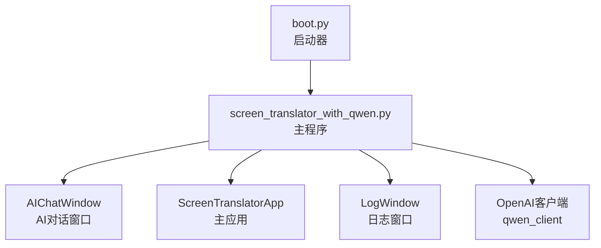
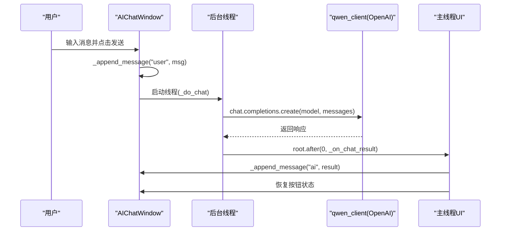
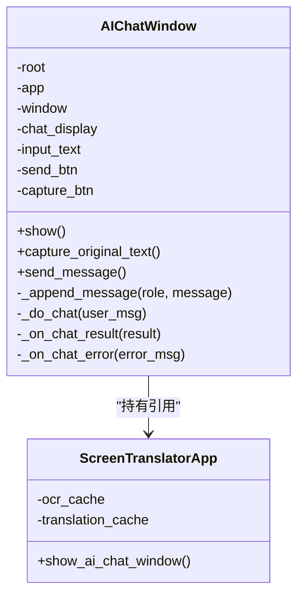
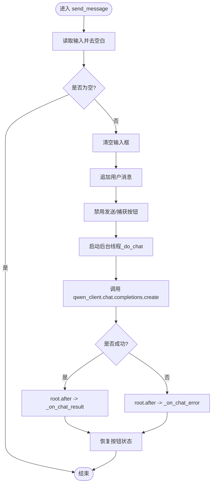
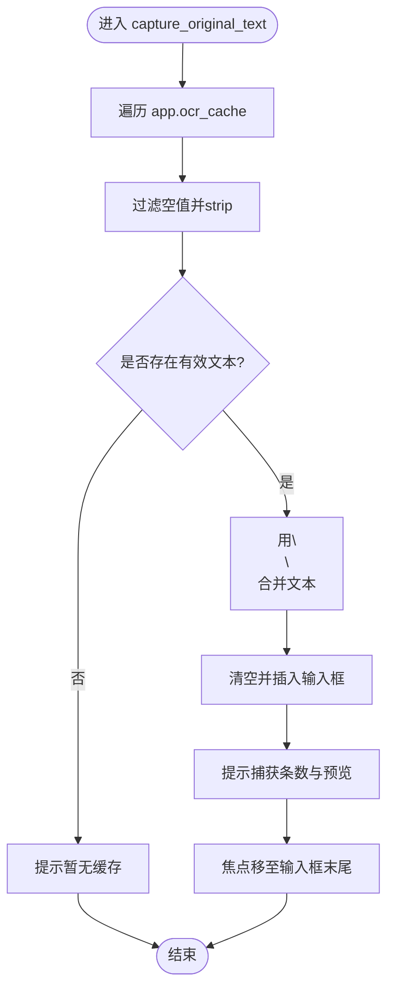
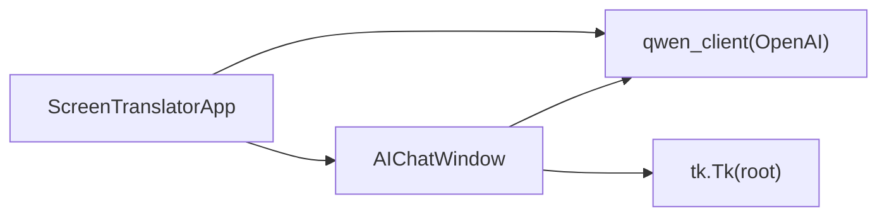

# AI对话接口

<cite>
**本文引用的文件**   
- [screen_translator_with_qwen.py](file://screen_translator_with_qwen.py)
- [boot.py](file://boot.py)
</cite>

## 目录
1. [简介](#简介)
2. [项目结构](#项目结构)
3. [核心组件](#核心组件)
4. [架构总览](#架构总览)
5. [详细组件分析](#详细组件分析)
6. [依赖关系分析](#依赖关系分析)
7. [性能与并发](#性能与并发)
8. [故障排查指南](#故障排查指南)
9. [结论](#结论)
10. [附录：完整使用流程示例](#附录完整使用流程示例)

## 简介
本文件面向“AI对话接口”的文档化说明，聚焦于 AIChatWindow 类的设计与实现，涵盖聊天界面布局、消息显示格式、用户交互逻辑；深入解释对话消息处理流程（发送、接收、历史管理）；说明原文捕获功能（从 ocr_cache 提取文本并合并）；详述错误处理机制（API密钥校验、网络异常、友好提示）；并提供完整的代码级使用流程路径，以及多线程中UI更新与线程安全的实践。

## 项目结构
本项目为单文件主程序 + 启动器模式：
- 主程序 screen_translator_with_qwen.py 包含 UI、OCR/翻译、语音合成、听歌识曲、AI对话等全部能力。
- 启动器 boot.py 负责自动检测目标脚本、维护虚拟环境、后台启动无控制台窗口。

图表来源
- [screen_translator_with_qwen.py:101-196](file://screen_translator_with_qwen.py#L101-L196)
- [screen_translator_with_qwen.py:474-634](file://screen_translator_with_qwen.py#L474-L634)
- [screen_translator_with_qwen.py:338-360](file://screen_translator_with_qwen.py#L338-L360)
- [boot.py:255-279](file://boot.py#L255-L279)

章节来源
- [screen_translator_with_qwen.py:101-196](file://screen_translator_with_qwen.py#L101-L196)
- [screen_translator_with_qwen.py:474-634](file://screen_translator_with_qwen.py#L474-L634)
- [screen_translator_with_qwen.py:338-360](file://screen_translator_with_qwen.py#L338-L360)
- [boot.py:255-279](file://boot.py#L255-L279)

## 核心组件
- AIChatWindow：AI对话子窗口，提供输入框、发送按钮、捕获原文按钮、滚动聊天记录区。
- ScreenTranslatorApp：主应用，持有全局状态、ocr_cache/translation_cache、AI客户端初始化、各功能入口。
- LogWindow：独立日志窗口，通过队列异步消费日志。
- OpenAI客户端 qwen_client：基于 dashscope 兼容模式的通义千问客户端。

章节来源
- [screen_translator_with_qwen.py:101-196](file://screen_translator_with_qwen.py#L101-L196)
- [screen_translator_with_qwen.py:474-634](file://screen_translator_with_qwen.py#L474-L634)
- [screen_translator_with_qwen.py:338-360](file://screen_translator_with_qwen.py#L338-L360)

## 架构总览
AI对话接口的整体调用链如下：
- 用户在 AIChatWindow 输入消息，点击发送或按 Ctrl+Enter。
- 主线程将消息追加到聊天历史，禁用按钮，并在后台线程发起请求。
- 后台线程调用 qwen_client.chat.completions.create，成功后回调主线程显示结果。
- 失败时根据错误码给出友好提示。

图表来源
- [screen_translator_with_qwen.py:223-299](file://screen_translator_with_qwen.py#L223-L299)
- [screen_translator_with_qwen.py:338-360](file://screen_translator_with_qwen.py#L338-L360)

## 详细组件分析

### AIChatWindow 设计与实现
- 界面布局
  - 顶部输入区域：左侧垂直排列“发送”和“捕获原文”两个按钮，右侧为多行输入框。
  - 底部聊天历史：可滚动的文本区域，支持不同角色标签样式（用户/AI/系统）。
  - 快捷键：Ctrl+Enter 触发发送。
- 消息显示格式
  - 每条消息以角色标签开头（如“[你]”、“[AI]”、“[系统]”），随后是内容，采用不同前景色和加粗区分。
- 用户交互逻辑
  - 发送：清空输入框，追加用户消息，禁用按钮，后台线程调用AI，完成后恢复按钮。
  - 捕获原文：遍历 app.ocr_cache，过滤空值并按换行合并，填充输入框并提示已捕获条数与预览。
- 线程安全
  - 所有UI更新均通过 root.after(0, ...) 在主线程执行，避免跨线程直接操作Tkinter控件。

图表来源
- [screen_translator_with_qwen.py:101-196](file://screen_translator_with_qwen.py#L101-L196)
- [screen_translator_with_qwen.py:223-299](file://screen_translator_with_qwen.py#L223-L299)
- [screen_translator_with_qwen.py:2397-2401](file://screen_translator_with_qwen.py#L2397-L2401)

章节来源
- [screen_translator_with_qwen.py:101-196](file://screen_translator_with_qwen.py#L101-L196)
- [screen_translator_with_qwen.py:223-299](file://screen_translator_with_qwen.py#L223-L299)
- [screen_translator_with_qwen.py:2397-2401](file://screen_translator_with_qwen.py#L2397-L2401)

### 对话消息处理流程
- 发送消息
  - 读取输入框内容，若为空则忽略。
  - 立即清空输入框并追加用户消息。
  - 禁用发送与捕获按钮，防止重复提交。
  - 在新线程中执行 _do_chat。
- 接收AI响应
  - 成功：通过 root.after(0, ...) 回调 _on_chat_result，追加AI消息并恢复按钮。
  - 失败：根据错误信息分类提示（未初始化、401/429等），统一走 _on_chat_error。
- 消息历史管理
  - 当前会话内通过 ScrolledText 追加显示，不持久化存储。

图表来源
- [screen_translator_with_qwen.py:223-299](file://screen_translator_with_qwen.py#L223-L299)

章节来源
- [screen_translator_with_qwen.py:223-299](file://screen_translator_with_qwen.py#L223-L299)

### 原文捕获功能（从 ocr_cache 提取与智能合并）
- 数据来源
  - ScreenTranslatorApp.ocr_cache 字典，键为图像前缀标识，值为识别出的原文文本。
- 提取策略
  - 遍历缓存项，过滤空字符串，收集有效文本列表。
- 合并策略
  - 使用双换行符连接多条文本，形成连续段落。
  - 在输入框中清空后插入合并后的文本，并提示捕获条数与前200字符预览。
- 交互反馈
  - 若无缓存，提示先进行截图识别。
  - 捕获后将焦点移回输入框末尾，便于继续编辑。

图表来源
- [screen_translator_with_qwen.py:198-222](file://screen_translator_with_qwen.py#L198-L222)
- [screen_translator_with_qwen.py:1207-1213](file://screen_translator_with_qwen.py#L1207-L1213)

章节来源
- [screen_translator_with_qwen.py:198-222](file://screen_translator_with_qwen.py#L198-L222)
- [screen_translator_with_qwen.py:1207-1213](file://screen_translator_with_qwen.py#L1207-L1213)

### 错误处理机制
- API密钥验证
  - 启动时读取 key.txt，若缺失或读取失败记录错误日志。
  - 若 qwen_client 未初始化，对话时立即提示检查 key.txt。
- 网络异常与限流
  - 401/Unauthorized：提示密钥无效或过期。
  - 429/Too Many Requests：提示请求过于频繁，稍后再试。
  - 其他异常：封装为通用错误提示。
- 用户友好提示
  - 所有错误通过 _on_chat_error 以系统消息形式展示，同时恢复按钮状态，保证可重试。

章节来源
- [screen_translator_with_qwen.py:338-360](file://screen_translator_with_qwen.py#L338-L360)
- [screen_translator_with_qwen.py:259-299](file://screen_translator_with_qwen.py#L259-L299)

### 多线程处理中的UI更新与线程安全
- 线程模型
  - 发送消息后，在 daemon 线程中执行网络请求，避免阻塞UI。
- 线程安全实践
  - 所有对 Tkinter 控件的修改都通过 root.after(0, ...) 调度到主线程执行。
  - 在后台线程中仅做数据获取与错误判断，不直接操作UI。
- 典型用法
  - 成功回调：_on_chat_result 由主线程执行，追加AI消息并恢复按钮。
  - 错误回调：_on_chat_error 由主线程执行，显示错误并恢复按钮。

章节来源
- [screen_translator_with_qwen.py:223-299](file://screen_translator_with_qwen.py#L223-L299)

## 依赖关系分析
- 外部库
  - openai：用于通义千问兼容模式API调用。
  - tkinter/scrolledtext：GUI与滚动文本。
  - pyautogui/PIL：截图与图像处理（主要用于OCR/翻译流程，非AI对话必需）。
- 内部依赖
  - AIChatWindow 依赖 ScreenTranslatorApp 提供的 ocr_cache 与根窗口 root。
  - 全局 qwen_client 由主程序初始化，供对话与OCR/翻译共享。

图表来源
- [screen_translator_with_qwen.py:101-196](file://screen_translator_with_qwen.py#L101-L196)
- [screen_translator_with_qwen.py:338-360](file://screen_translator_with_qwen.py#L338-L360)

章节来源
- [screen_translator_with_qwen.py:101-196](file://screen_translator_with_qwen.py#L101-L196)
- [screen_translator_with_qwen.py:338-360](file://screen_translator_with_qwen.py#L338-L360)

## 性能与并发
- 网络请求
  - 单次对话请求轻量，但应避免高频重复发送（已禁用按钮防抖）。
- UI渲染
  - 使用 ScrolledText 追加消息，注意大量消息时的滚动性能；当前实现每次追加后 see(END)，适合一般对话场景。
- 线程开销
  - 每个发送动作创建一个daemon线程，生命周期短，资源占用低。

## 故障排查指南
- 无法发送消息
  - 检查 key.txt 是否存在且包含有效的API密钥。
  - 查看系统日志窗口，确认是否有“AI客户端未初始化”或“API密钥无效或已过期”的错误提示。
- 频繁请求被限流
  - 出现“请求过于频繁”提示时，等待一段时间再试。
- 捕获原文无内容
  - 确保已完成截图识别流程，使 ocr_cache 中存在有效条目。
- 线程相关异常
  - 若出现跨线程访问UI异常，请确认所有UI更新均通过 root.after(0, ...) 调度。

章节来源
- [screen_translator_with_qwen.py:338-360](file://screen_translator_with_qwen.py#L338-L360)
- [screen_translator_with_qwen.py:259-299](file://screen_translator_with_qwen.py#L259-L299)
- [screen_translator_with_qwen.py:198-222](file://screen_translator_with_qwen.py#L198-L222)

## 结论
AIChatWindow 提供了简洁直观的对话界面，结合后台线程与 root.after 的线程安全实践，实现了稳定的消息收发体验。原文捕获功能复用 OCR 缓存，简化了上下文构建。完善的错误处理与友好的提示信息提升了可用性。整体设计清晰、耦合度低，易于扩展与维护。

## 附录：完整使用流程示例
以下为“AI对话”的端到端使用步骤（以代码片段路径代替具体代码）：
- 启动应用
  - 通过启动器运行主程序：[boot.py:255-279](file://boot.py#L255-L279)
- 初始化AI客户端
  - 读取API密钥并创建客户端：[screen_translator_with_qwen.py:338-360](file://screen_translator_with_qwen.py#L338-L360)
- 打开AI对话窗口
  - 主应用入口：[screen_translator_with_qwen.py:2397-2401](file://screen_translator_with_qwen.py#L2397-L2401)
  - 窗口显示与布局：[screen_translator_with_qwen.py:110-196](file://screen_translator_with_qwen.py#L110-L196)
- 捕获原文（可选）
  - 从 ocr_cache 提取并合并：[screen_translator_with_qwen.py:198-222](file://screen_translator_with_qwen.py#L198-L222)
  - 缓存写入位置（OCR/翻译流程）：[screen_translator_with_qwen.py:1207-1213](file://screen_translator_with_qwen.py#L1207-L1213)
- 发送消息
  - 用户输入与发送：[screen_translator_with_qwen.py:223-241](file://screen_translator_with_qwen.py#L223-L241)
  - 后台线程调用API：[screen_translator_with_qwen.py:259-299](file://screen_translator_with_qwen.py#L259-L299)
- 结果展示与状态管理
  - 成功回调与UI恢复：[screen_translator_with_qwen.py:289-299](file://screen_translator_with_qwen.py#L289-L299)
  - 错误回调与提示：[screen_translator_with_qwen.py:295-299](file://screen_translator_with_qwen.py#L295-L299)

章节来源
- [boot.py:255-279](file://boot.py#L255-L279)
- [screen_translator_with_qwen.py:338-360](file://screen_translator_with_qwen.py#L338-L360)
- [screen_translator_with_qwen.py:2397-2401](file://screen_translator_with_qwen.py#L2397-L2401)
- [screen_translator_with_qwen.py:110-196](file://screen_translator_with_qwen.py#L110-L196)
- [screen_translator_with_qwen.py:198-222](file://screen_translator_with_qwen.py#L198-L222)
- [screen_translator_with_qwen.py:1207-1213](file://screen_translator_with_qwen.py#L1207-L1213)
- [screen_translator_with_qwen.py:223-241](file://screen_translator_with_qwen.py#L223-L241)
- [screen_translator_with_qwen.py:259-299](file://screen_translator_with_qwen.py#L259-L299)
- [screen_translator_with_qwen.py:289-299](file://screen_translator_with_qwen.py#L289-L299)