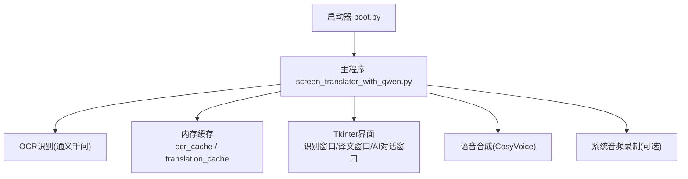
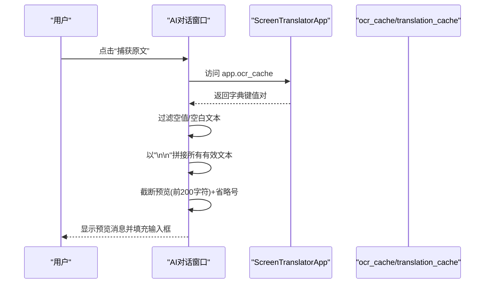
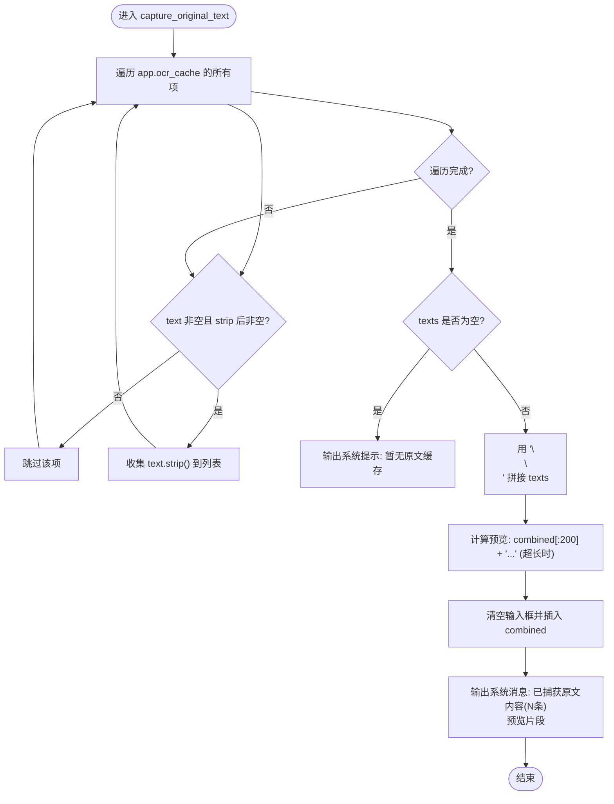
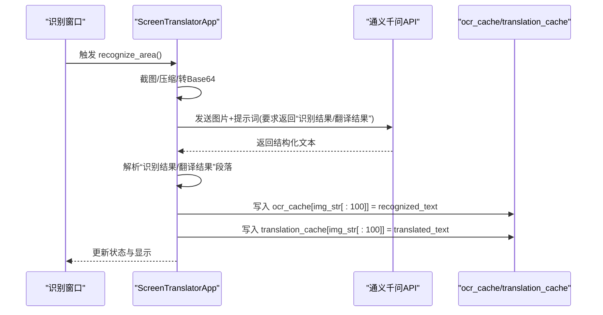
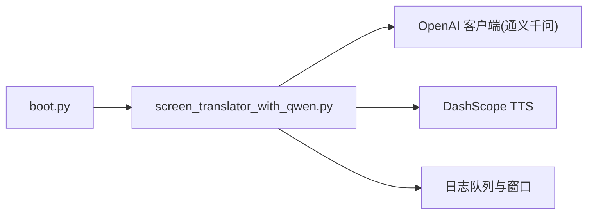

# 原文捕获功能

<cite>
**本文引用的文件**
- [screen_translator_with_qwen.py](file://screen_translator_with_qwen.py)
- [boot.py](file://boot.py)
</cite>

## 目录
1. [简介](#简介)
2. [项目结构](#项目结构)
3. [核心组件](#核心组件)
4. [架构总览](#架构总览)
5. [详细组件分析](#详细组件分析)
6. [依赖关系分析](#依赖关系分析)
7. [性能考虑](#性能考虑)
8. [故障排查指南](#故障排查指南)
9. [结论](#结论)
10. [附录：使用流程与边界处理示例](#附录使用流程与边界处理示例)

## 简介
本文档聚焦“AI对话原文捕获”能力，围绕从OCR识别结果缓存中抽取、过滤、合并并展示原文的完整链路展开。内容涵盖：
- 缓存数据结构访问与空值/空白文本过滤
- 多段OCR结果的智能拼接策略（分隔符、长度限制）
- 预览显示、截断与用户反馈提示
- 与OCR识别模块的集成方式（数据共享接口与缓存同步）
- 端到端使用流程与常见边界情况处理

## 项目结构
本项目为单进程桌面应用，主程序入口位于根目录脚本，启动器负责虚拟环境管理与后台运行；核心业务逻辑集中在主脚本中，包含截图区域选择、OCR识别、翻译、语音合成、日志窗口以及AI对话窗口等。

图表来源
- [boot.py:256-279](file://boot.py#L256-L279)
- [screen_translator_with_qwen.py:474-634](file://screen_translator_with_qwen.py#L474-L634)

章节来源
- [boot.py:256-279](file://boot.py#L256-L279)
- [screen_translator_with_qwen.py:474-634](file://screen_translator_with_qwen.py#L474-L634)

## 核心组件
- AI对话窗口：提供“捕获原文”按钮，触发从OCR缓存读取并填充到输入框，同时给出预览与提示。
- 屏幕翻译应用：维护OCR与翻译结果缓存，负责截图、压缩、调用OCR服务、解析返回、写入缓存、更新UI。
- 日志窗口：异步消费日志队列，便于定位问题。
- 语音合成与播放：将原文部分合成为音频并支持变速播放（与原文捕获无直接耦合，但共享同一文本源）。

章节来源
- [screen_translator_with_qwen.py:101-300](file://screen_translator_with_qwen.py#L101-L300)
- [screen_translator_with_qwen.py:474-634](file://screen_translator_with_qwen.py#L474-L634)

## 架构总览
下图展示了“原文捕获”在整体系统中的位置与交互路径：用户在AI对话窗口点击“捕获原文”，该操作遍历应用实例的OCR缓存，过滤空值后按双换行拼接，填入输入框并输出预览摘要。

图表来源
- [screen_translator_with_qwen.py:198-222](file://screen_translator_with_qwen.py#L198-L222)
- [screen_translator_with_qwen.py:1207-1213](file://screen_translator_with_qwen.py#L1207-L1213)

## 详细组件分析

### 组件A：AI对话窗口中的“捕获原文”
- 数据来源：通过引用父应用实例的ocr_cache字典进行读取。
- 过滤规则：仅保留非None且去除首尾空白后仍非空的条目。
- 拼接策略：使用两个换行符作为段落分隔符，保持各次识别结果的段落感。
- 预览与截断：若合并后文本超过200字符，则截取前200字符并在末尾追加省略号，用于快速预览。
- 用户反馈：当缓存为空时，输出系统消息提示先进行截图识别；成功捕获时输出条数与预览片段。

图表来源
- [screen_translator_with_qwen.py:198-222](file://screen_translator_with_qwen.py#L198-L222)

章节来源
- [screen_translator_with_qwen.py:198-222](file://screen_translator_with_qwen.py#L198-L222)

### 组件B：OCR识别与缓存写入
- 识别流程：截图→图像增强与灰度化→压缩→Base64编码→调用通义千问模型进行OCR+翻译→解析结构化返回→写入缓存。
- 缓存键策略：取图像Base64的前100个字符作为键，保证唯一性与较短键长。
- 缓存结构：
  - ocr_cache[cache_key] = recognized_text
  - translation_cache[cache_key] = translated_text
- 错误与重试：针对429限流采用指数退避+随机抖动；其他错误根据状态码或信息分类抛出明确异常。

图表来源
- [screen_translator_with_qwen.py:927-1021](file://screen_translator_with_qwen.py#L927-L1021)
- [screen_translator_with_qwen.py:1123-1248](file://screen_translator_with_qwen.py#L1123-L1248)

章节来源
- [screen_translator_with_qwen.py:927-1021](file://screen_translator_with_qwen.py#L927-L1021)
- [screen_translator_with_qwen.py:1123-1248](file://screen_translator_with_qwen.py#L1123-L1248)

### 组件C：翻译结果缓存读取
- 读取策略：遍历ocr_cache，查找与待翻译文本完全匹配的条目，再从translation_cache中取出对应翻译结果。
- 未命中处理：若未找到匹配项，记录警告并返回空字符串，避免重复请求。

章节来源
- [screen_translator_with_qwen.py:1249-1266](file://screen_translator_with_qwen.py#L1249-L1266)

### 组件D：预览显示与用户反馈
- 预览显示：在AI对话窗口的聊天历史中以系统消息形式输出，包含捕获条数与最多200字符的预览片段。
- 截断处理：当合并后的文本长度大于200时，附加省略号提示存在更多内容。
- 用户反馈：
  - 无缓存：提示“暂无原文缓存内容，请先进行截图识别”。
  - 有缓存：提示“已捕获原文内容 (N 条)”并附带预览。

章节来源
- [screen_translator_with_qwen.py:198-222](file://screen_translator_with_qwen.py#L198-L222)

## 依赖关系分析
- 启动器与主程序：boot.py自动检测同目录下唯一Python脚本并以后台方式启动，屏蔽控制台窗口。
- 主程序内部：
  - OCR识别依赖OpenAI兼容客户端与通义千问服务。
  - 语音合成依赖DashScope HTTP TTS。
  - 日志系统基于logging与自定义LogWindowHandler，通过队列在主线程刷新UI。

图表来源
- [boot.py:256-279](file://boot.py#L256-L279)
- [screen_translator_with_qwen.py:338-360](file://screen_translator_with_qwen.py#L338-L360)
- [screen_translator_with_qwen.py:21-33](file://screen_translator_with_qwen.py#L21-L33)

章节来源
- [boot.py:256-279](file://boot.py#L256-L279)
- [screen_translator_with_qwen.py:338-360](file://screen_translator_with_qwen.py#L338-L360)
- [screen_translator_with_qwen.py:21-33](file://screen_translator_with_qwen.py#L21-L33)

## 性能考虑
- 缓存键长度：使用Base64前100字符作为键，兼顾唯一性与内存占用。
- 文本拼接开销：多次strip与join在常规识别次数下开销可忽略；若缓存规模较大，建议引入有序集合或索引以提升检索效率。
- 预览截断：固定200字符预览，避免过长文本渲染影响UI响应。
- 网络重试：429限流采用指数退避+随机抖动，降低瞬时拥塞导致的失败率。

## 故障排查指南
- 无缓存内容：确认是否已完成一次成功的OCR识别；检查识别窗口状态与日志。
- API密钥无效：出现401相关错误时，检查key.txt内容与权限。
- 请求过于频繁：出现429错误时，等待一段时间后再试；必要时缩小识别区域以降低请求体大小。
- 请求体过大：出现413错误时，减小识别区域或提升图像压缩质量参数。

章节来源
- [screen_translator_with_qwen.py:1215-1248](file://screen_translator_with_qwen.py#L1215-L1248)

## 结论
“原文捕获”功能通过统一的OCR缓存接口，实现了跨会话的原文复用与便捷提问。其实现简洁可靠：以字典为缓存载体，结合严格的空值过滤与稳定的段落拼接策略，配合友好的预览与反馈机制，既保证了可用性，也易于扩展与维护。

## 附录：使用流程与边界处理示例
以下为端到端使用步骤与边界情况的说明性示例（不直接粘贴代码，仅提供路径参考）：

- 正常流程
  - 选择识别区域并完成一次OCR识别，确保ocr_cache中有至少一条有效记录。
  - 打开AI对话窗口，点击“捕获原文”，系统将自动填充输入框并显示预览。
  - 在输入框编辑或补充问题后发送，获得AI回复。
  
  参考路径
  - [screen_translator_with_qwen.py:927-1021](file://screen_translator_with_qwen.py#L927-L1021)
  - [screen_translator_with_qwen.py:198-222](file://screen_translator_with_qwen.py#L198-L222)

- 边界情况
  - 缓存为空：捕获时输出系统提示，引导用户先进行识别。
  - 多条OCR结果：以双换行分隔拼接，保持段落可读性。
  - 超长文本：预览仅显示前200字符并附加省略号，避免阻塞UI。
  - 空值与空白文本：自动过滤，确保输入框内容干净可用。
  
  参考路径
  - [screen_translator_with_qwen.py:198-222](file://screen_translator_with_qwen.py#L198-L222)
  - [screen_translator_with_qwen.py:1207-1213](file://screen_translator_with_qwen.py#L1207-L1213)

- 与OCR模块集成要点
  - 数据共享接口：ocr_cache与translation_cache由主应用维护，AI对话窗口通过引用父应用实例访问。
  - 缓存同步机制：每次OCR成功后立即写入缓存，键为图像Base64前缀，保证后续读取一致性。
  
  参考路径
  - [screen_translator_with_qwen.py:1123-1248](file://screen_translator_with_qwen.py#L1123-L1248)
  - [screen_translator_with_qwen.py:1249-1266](file://screen_translator_with_qwen.py#L1249-L1266)