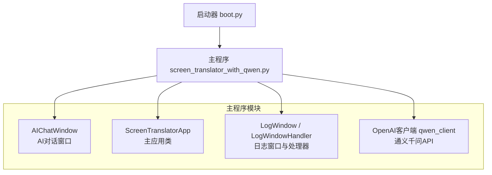
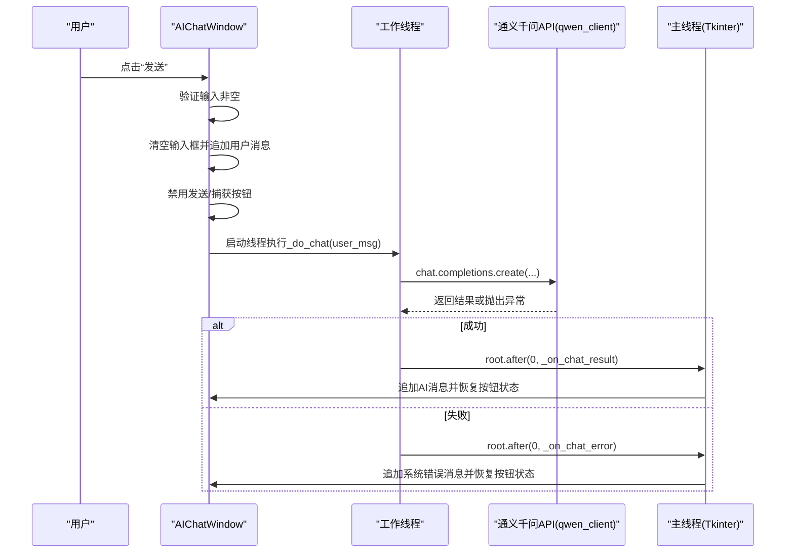
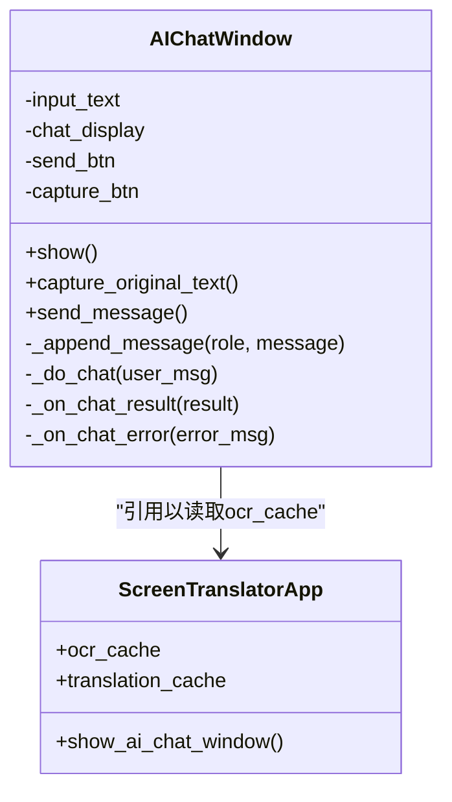
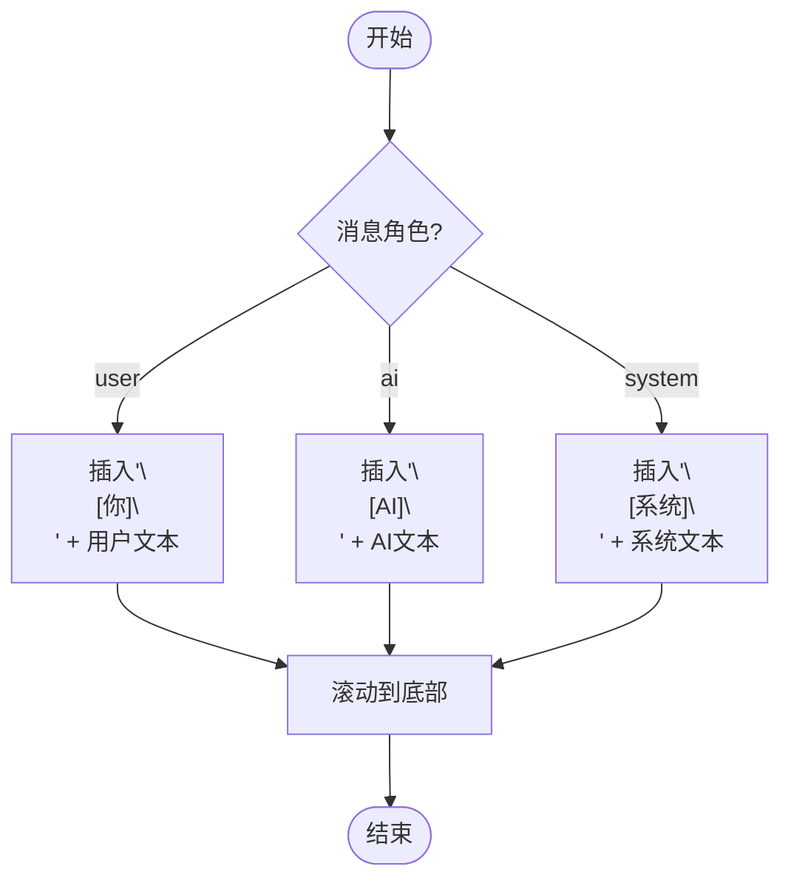
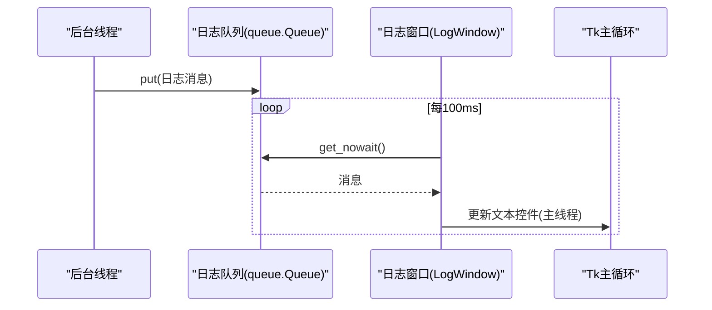
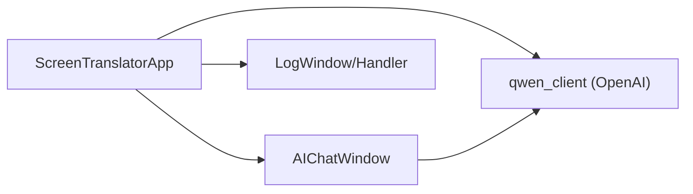

# 消息处理机制

<cite>
**本文引用的文件**   
- [screen_translator_with_qwen.py](file://screen_translator_with_qwen.py)
- [boot.py](file://boot.py)
</cite>

## 目录
1. [简介](#简介)
2. [项目结构](#项目结构)
3. [核心组件](#核心组件)
4. [架构总览](#架构总览)
5. [详细组件分析](#详细组件分析)
6. [依赖关系分析](#依赖关系分析)
7. [性能与并发特性](#性能与并发特性)
8. [故障排查指南](#故障排查指南)
9. [结论](#结论)
10. [附录：关键流程示例路径](#附录关键流程示例路径)

## 简介
本文件聚焦于“AI对话消息处理机制”，围绕用户输入验证、消息格式化与发送按钮状态管理；AI响应接收与处理（异步线程调用、结果回调、错误消息格式化）；消息历史管理与显示格式（用户/AI/系统三类消息）；多线程环境下的UI更新机制（线程安全与主线程回调）进行系统化说明，并给出完整流程与异常处理策略的参考路径。

## 项目结构
本项目为桌面端屏幕翻译工具，包含一个主程序入口与启动器：
- 主程序：实现OCR识别、翻译、语音合成、听歌识曲以及AI对话窗口等核心功能。
- 启动器：负责虚拟环境校验与依赖安装，并以无控制台方式启动目标程序。

图表来源
- [screen_translator_with_qwen.py:101-300](file://screen_translator_with_qwen.py#L101-L300)
- [screen_translator_with_qwen.py:474-634](file://screen_translator_with_qwen.py#L474-L634)
- [screen_translator_with_qwen.py:338-360](file://screen_translator_with_qwen.py#L338-L360)
- [boot.py:256-279](file://boot.py#L256-L279)

章节来源
- [screen_translator_with_qwen.py:101-300](file://screen_translator_with_qwen.py#L101-L300)
- [screen_translator_with_qwen.py:474-634](file://screen_translator_with_qwen.py#L474-L634)
- [screen_translator_with_qwen.py:338-360](file://screen_translator_with_qwen.py#L338-L360)
- [boot.py:256-279](file://boot.py#L256-L279)

## 核心组件
- AI对话窗口（AIChatWindow）
  - 负责用户输入收集、消息格式化、发送按钮状态控制、聊天历史追加显示、在线程中发起AI请求并通过主线程回调更新UI。
- 主应用（ScreenTranslatorApp）
  - 提供全局状态、缓存（ocr_cache/translation_cache）、快捷键、区域选择、翻译窗口、语音合成与播放等能力，并与AI对话窗口协作。
- 日志子系统（LogWindow + LogWindowHandler）
  - 基于队列将后台日志安全投递到日志窗口，避免跨线程直接操作UI。
- OpenAI客户端（qwen_client）
  - 通过环境变量或配置文件初始化，用于调用通义千问模型完成文本对话与多模态识别翻译。

章节来源
- [screen_translator_with_qwen.py:101-300](file://screen_translator_with_qwen.py#L101-L300)
- [screen_translator_with_qwen.py:302-312](file://screen_translator_with_qwen.py#L302-L312)
- [screen_translator_with_qwen.py:338-360](file://screen_translator_with_qwen.py#L338-L360)
- [screen_translator_with_qwen.py:474-634](file://screen_translator_with_qwen.py#L474-L634)

## 架构总览
下图展示了从用户点击“发送”到AI返回结果并更新界面的端到端流程，包括线程切换与主线程回调。

图表来源
- [screen_translator_with_qwen.py:223-300](file://screen_translator_with_qwen.py#L223-L300)

## 详细组件分析

### 组件A：AI对话窗口（AIChatWindow）
职责
- 构建对话界面（输入区、发送按钮、捕获原文按钮、聊天历史显示）。
- 用户输入验证与消息格式化。
- 发送按钮状态管理（发送中/正常）。
- 在线程中调用AI接口，并通过主线程回调更新UI。
- 错误消息格式化与提示。

关键方法与数据流
- show(): 创建窗口、布局、标签样式、欢迎消息。
- capture_original_text(): 从主应用的ocr_cache读取已识别原文，合并后填入输入框，并追加系统提示。
- send_message(): 获取并校验输入，清空输入框，追加用户消息，禁用按钮，启动工作线程。
- _append_message(role, message): 根据角色（user/ai/system）插入带样式的消息块，滚动到底部。
- _do_chat(user_msg): 检查客户端是否可用，调用API，使用root.after(0,...)在主线程回调结果或错误。
- _on_chat_result(result)/_on_chat_error(error_msg): 分别追加AI回复或系统错误，并恢复按钮状态。

线程与UI安全
- 所有对Tkinter控件的修改均通过root.after(0, ...)调度至主线程，避免跨线程访问导致的崩溃。
- 工作线程为守护线程，确保进程退出时自动回收。

图表来源
- [screen_translator_with_qwen.py:101-300](file://screen_translator_with_qwen.py#L101-L300)
- [screen_translator_with_qwen.py:474-634](file://screen_translator_with_qwen.py#L474-L634)

章节来源
- [screen_translator_with_qwen.py:101-300](file://screen_translator_with_qwen.py#L101-L300)

### 组件B：消息历史管理与显示格式
- 消息类型分类
  - user：用户消息，带“[你]”标题与用户文本样式。
  - ai：AI回复，带“[AI]”标题与AI文本样式。
  - system：系统提示/错误，带“[系统]”标题与系统文本样式。
- 存储与展示
  - 当前实现采用在ScrolledText中按时间顺序追加的方式作为“会话历史”。
  - 如需持久化，可在现有_append_message基础上增加序列化逻辑（例如写入JSON文件），并在窗口初始化时加载历史。

图表来源
- [screen_translator_with_qwen.py:242-258](file://screen_translator_with_qwen.py#L242-L258)

章节来源
- [screen_translator_with_qwen.py:242-258](file://screen_translator_with_qwen.py#L242-L258)

### 组件C：多线程UI更新机制
- 线程模型
  - 发送消息：在工作线程中调用API，完成后通过root.after(0, callback)回到主线程更新UI。
  - 日志输出：后台线程通过queue.Queue投递日志，日志窗口在主线程轮询消费并渲染。
- 线程安全要点
  - 禁止在非主线程直接操作Tkinter控件。
  - 使用after(0, ...)或事件循环调度保证UI更新在主线程执行。
  - 使用queue.Queue进行线程间通信，避免共享状态竞争。

图表来源
- [screen_translator_with_qwen.py:302-312](file://screen_translator_with_qwen.py#L302-L312)
- [screen_translator_with_qwen.py:76-87](file://screen_translator_with_qwen.py#L76-L87)

章节来源
- [screen_translator_with_qwen.py:76-87](file://screen_translator_with_qwen.py#L76-L87)
- [screen_translator_with_qwen.py:302-312](file://screen_translator_with_qwen.py#L302-L312)

### 组件D：AI响应接收与错误处理
- 成功路径
  - 解析response.choices[0].message.content，回调_on_chat_result追加AI消息。
- 错误路径
  - 针对401/Unauthorized：提示密钥无效或过期。
  - 针对429/Too Many Requests：提示请求过于频繁。
  - 其他异常：统一包装为“请求失败: ...”的系统消息。
- 健壮性建议
  - 可增加重试与退避策略（参考同项目中OCR+翻译流程的重试逻辑）。
  - 可引入超时控制与取消标志，支持中断长时间请求。

章节来源
- [screen_translator_with_qwen.py:259-300](file://screen_translator_with_qwen.py#L259-L300)

## 依赖关系分析
- 外部依赖
  - openai：用于调用通义千问兼容API。
  - tkinter/scrolledtext：GUI与富文本显示。
  - queue/logging：日志线程安全传输。
- 内部耦合
  - AIChatWindow依赖ScreenTranslatorApp提供的ocr_cache用于“捕获原文”。
  - 主程序负责qwen_client初始化与生命周期管理。

图表来源
- [screen_translator_with_qwen.py:101-300](file://screen_translator_with_qwen.py#L101-L300)
- [screen_translator_with_qwen.py:338-360](file://screen_translator_with_qwen.py#L338-L360)
- [screen_translator_with_qwen.py:302-312](file://screen_translator_with_qwen.py#L302-L312)

章节来源
- [screen_translator_with_qwen.py:101-300](file://screen_translator_with_qwen.py#L101-L300)
- [screen_translator_with_qwen.py:338-360](file://screen_translator_with_qwen.py#L338-L360)
- [screen_translator_with_qwen.py:302-312](file://screen_translator_with_qwen.py#L302-L312)

## 性能与并发特性
- 并发模型
  - 每个“发送”动作创建一个守护线程，避免阻塞主循环。
  - 日志采用队列+定时轮询，降低UI卡顿风险。
- 潜在优化点
  - 对重复快速点击的防抖：当前已通过禁用按钮防止重复提交，可进一步加入短时防抖锁。
  - 大文本输入限制：可对用户输入长度做上限控制，减少网络负载。
  - 结果流式处理：若API支持流式返回，可实现增量显示，提升交互体验。
  - 连接池与重试：结合OCR流程中的指数退避策略，增强稳定性。

[本节为通用指导，不直接分析具体文件]

## 故障排查指南
- 常见问题
  - 未初始化AI客户端：检查key.txt是否存在且有效，确认qwen_client初始化成功。
  - 401/Unauthorized：密钥无效或过期，需重新配置。
  - 429/Too Many Requests：触发限频，等待后重试。
  - 网络异常/超时：统一包装为“请求失败: ...”，建议增加重试与超时参数。
- 定位方法
  - 打开日志窗口查看实时日志，关注“请求失败”、“API密钥无效或已过期”等关键字。
  - 检查线程是否仍在运行，必要时中止并重试。

章节来源
- [screen_translator_with_qwen.py:259-300](file://screen_translator_with_qwen.py#L259-L300)
- [screen_translator_with_qwen.py:338-360](file://screen_translator_with_qwen.py#L338-L360)

## 结论
该消息处理机制通过“工作线程+主线程回调”的模式实现了稳定的AI对话交互，具备清晰的输入验证、消息格式化与按钮状态管理，同时利用队列与after机制保障多线程UI安全。建议在后续迭代中补充持久化历史、重试与超时控制、流式显示等能力，进一步提升用户体验与鲁棒性。

[本节为总结性内容，不直接分析具体文件]

## 附录：关键流程示例路径
- 用户输入验证与发送
  - [screen_translator_with_qwen.py:223-241](file://screen_translator_with_qwen.py#L223-L241)
- 消息追加与样式
  - [screen_translator_with_qwen.py:242-258](file://screen_translator_with_qwen.py#L242-L258)
- 线程内调用AI与主线程回调
  - [screen_translator_with_qwen.py:259-300](file://screen_translator_with_qwen.py#L259-L300)
- 日志队列与日志窗口轮询
  - [screen_translator_with_qwen.py:302-312](file://screen_translator_with_qwen.py#L302-L312)
  - [screen_translator_with_qwen.py:76-87](file://screen_translator_with_qwen.py#L76-L87)
- 启动器与主程序启动
  - [boot.py:256-279](file://boot.py#L256-L279)