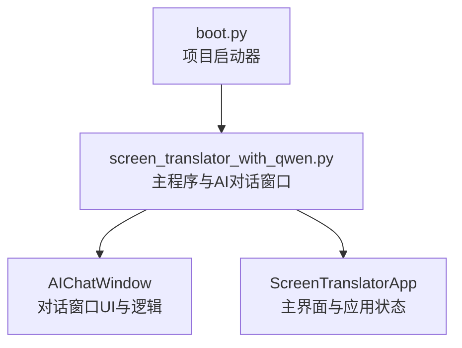
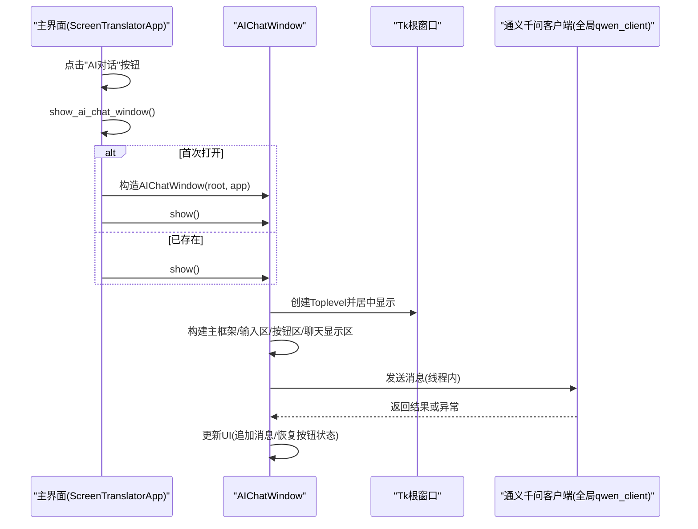
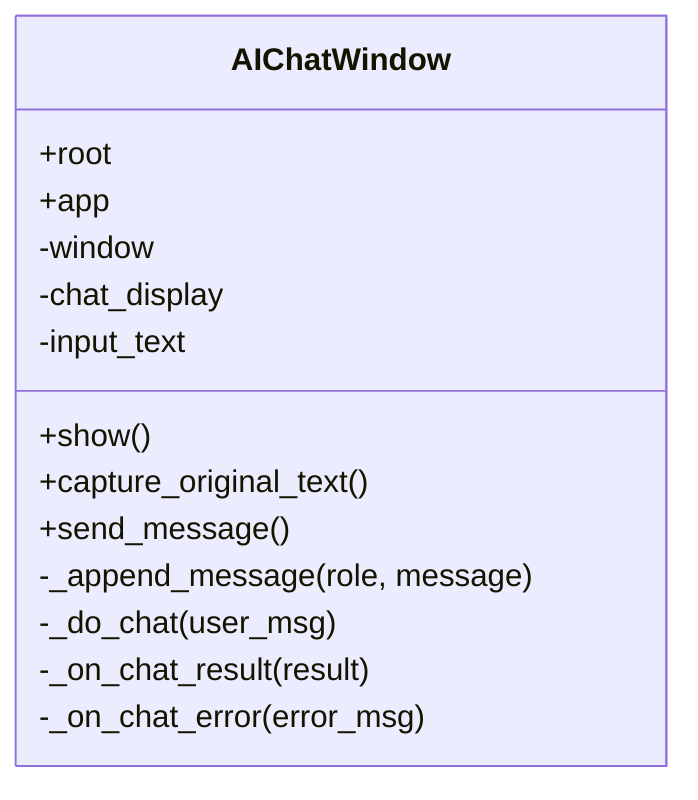
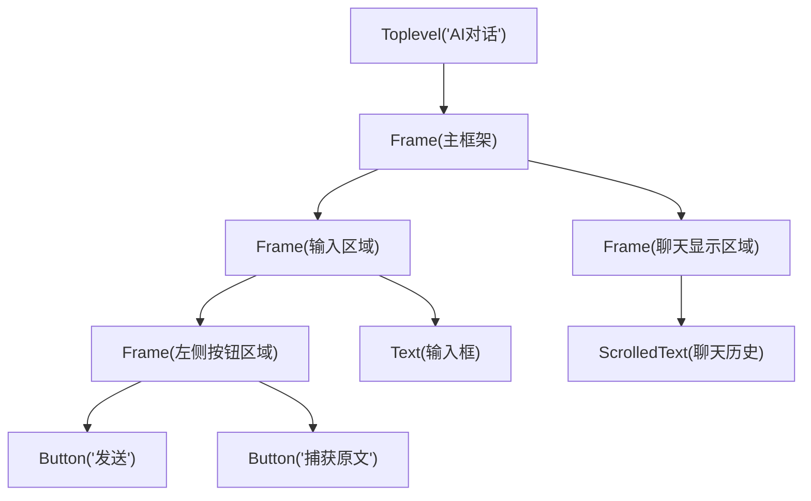
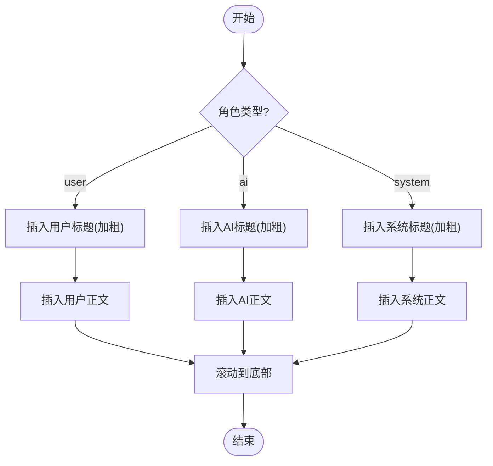
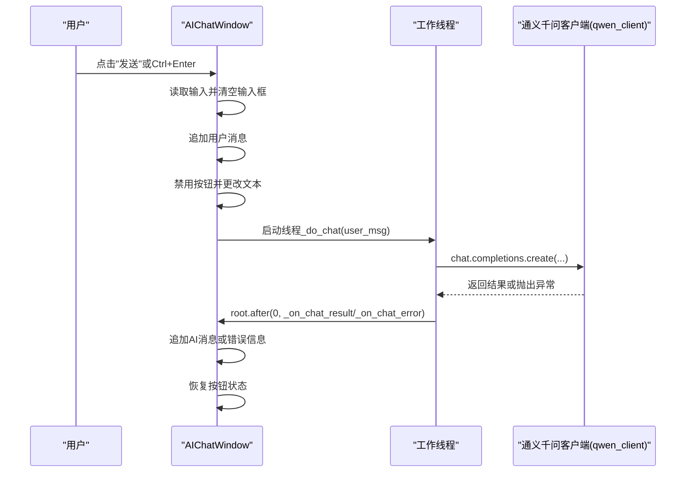
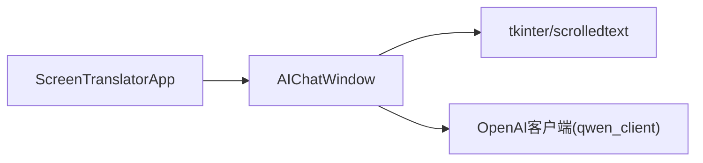

# 聊天界面设计

<cite>
**本文引用的文件**   
- [screen_translator_with_qwen.py](file://screen_translator_with_qwen.py)
- [boot.py](file://boot.py)
</cite>

## 目录
1. [简介](#简介)
2. [项目结构](#项目结构)
3. [核心组件](#核心组件)
4. [架构总览](#架构总览)
5. [详细组件分析](#详细组件分析)
6. [依赖关系分析](#依赖关系分析)
7. [性能考虑](#性能考虑)
8. [故障排查指南](#故障排查指南)
9. [结论](#结论)
10. [附录：初始化与自定义样式示例路径](#附录初始化与自定义样式示例路径)

## 简介
本文件聚焦于 AI 对话窗口界面的设计与实现，围绕 AIChatWindow 类展开，详细说明其 UI 布局结构、样式配置（含深色主题）、标签样式与交互反馈、窗口管理（居中显示、最小尺寸、生命周期与多实例控制），以及输入区域的状态管理。文档同时提供代码级图示与“示例路径”以便快速定位实现位置。

## 项目结构
本项目为单文件应用，主程序入口位于根目录的 Python 脚本中；另有一个通用启动器 boot.py 用于自动检测并运行目标脚本。AI 对话窗口作为主应用的一个子功能模块，通过主应用按钮触发创建和展示。

图表来源
- [boot.py:256-279](file://boot.py#L256-L279)
- [screen_translator_with_qwen.py:2413-2417](file://screen_translator_with_qwen.py#L2413-L2417)

章节来源
- [boot.py:256-279](file://boot.py#L256-L279)
- [screen_translator_with_qwen.py:2413-2417](file://screen_translator_with_qwen.py#L2413-L2417)

## 核心组件
- AIChatWindow：负责 AI 对话窗口的创建、布局、样式、消息追加、发送流程与错误处理。
- ScreenTranslatorApp：主界面应用，持有 AI 对话窗口实例并提供 show_ai_chat_window 方法以统一创建/展示。
- LogWindow：日志窗口（辅助组件，非本次重点）。

章节来源
- [screen_translator_with_qwen.py:101-300](file://screen_translator_with_qwen.py#L101-L300)
- [screen_translator_with_qwen.py:2397-2402](file://screen_translator_with_qwen.py#L2397-L2402)

## 架构总览
下图展示了从主界面到 AI 对话窗口的调用链路与关键对象关系。

图表来源
- [screen_translator_with_qwen.py:2397-2402](file://screen_translator_with_qwen.py#L2397-L2402)
- [screen_translator_with_qwen.py:110-196](file://screen_translator_with_qwen.py#L110-L196)
- [screen_translator_with_qwen.py:259-299](file://screen_translator_with_qwen.py#L259-L299)

## 详细组件分析

### AIChatWindow 类概览
- 职责：
  - 窗口生命周期管理：创建、居中、最小尺寸、重复显示控制。
  - UI 布局：主框架、输入区域、左侧按钮区域、滚动聊天显示区域。
  - 样式配置：字体、颜色主题（深色模式）、标签样式。
  - 用户交互：发送消息、捕获原文、快捷键绑定、焦点控制。
  - 状态管理：按钮禁用/启用、文本框清空与焦点、消息追加。
  - 异步通信：在新线程中调用 AI 接口，回调更新 UI。

图表来源
- [screen_translator_with_qwen.py:101-300](file://screen_translator_with_qwen.py#L101-L300)

#### UI 布局结构与组件层次
- 顶层容器：tk.Toplevel（AI对话窗口）
- 主框架：Frame（填充整个窗口）
  - 输入区域 Frame（顶部横向）
    - 左侧按钮区域 Frame（垂直排列）
      - 发送按钮 Button
      - 捕获原文按钮 Button
    - 输入文本框 Text（高度固定，可换行）
  - 聊天显示区域 Frame（占据剩余空间）
    - 滚动文本 ScrolledText（深色背景、浅色前景）

图表来源
- [screen_translator_with_qwen.py:110-196](file://screen_translator_with_qwen.py#L110-L196)

章节来源
- [screen_translator_with_qwen.py:110-196](file://screen_translator_with_qwen.py#L110-L196)

#### 样式配置与深色主题
- 字体设置：
  - 输入框与聊天显示使用微软雅黑字体，字号适中，保证中文可读性。
  - 按钮使用 Arial 加粗等样式，突出操作项。
- 颜色主题（深色模式）：
  - 聊天显示区域背景为深灰，前景为浅灰，插入光标颜色一致，降低视觉疲劳。
  - 发送按钮采用蓝色系，捕获原文按钮采用绿色系，语义清晰。
- 标签样式（角色区分）：
  - 用户、AI、系统三类消息分别配置不同前景色与加粗标题，便于快速识别。
  - 正文文本使用较柔和的前景色，提升阅读体验。

章节来源
- [screen_translator_with_qwen.py:176-196](file://screen_translator_with_qwen.py#L176-L196)

#### 窗口管理功能
- 居中显示：
  - 在创建后获取屏幕宽高，计算窗口左上角坐标并设置 geometry。
- 最小尺寸限制：
  - 设置 minsize 防止窗口过小影响可用性。
- 窗口生命周期与多实例控制：
  - 若窗口已存在且可见，则直接 deiconify 并 lift，避免重复创建。
  - 主应用侧维护 ai_chat_window 实例引用，确保单例式管理。

章节来源
- [screen_translator_with_qwen.py:110-128](file://screen_translator_with_qwen.py#L110-L128)
- [screen_translator_with_qwen.py:2397-2402](file://screen_translator_with_qwen.py#L2397-L2402)

#### 用户界面元素状态管理
- 按钮状态切换：
  - 发送消息前禁用发送与捕获按钮，并将发送按钮文本改为“发送中...”，防止重复提交。
  - 收到结果或错误后恢复按钮状态与文本。
- 输入框焦点控制：
  - 窗口显示时默认将焦点置于输入框。
  - 捕获原文后将焦点移回输入框末尾，方便继续编辑。
- 禁用/启用逻辑：
  - 发送过程中禁用相关控件，完成后恢复。
  - 空消息不触发发送，避免无效请求。

章节来源
- [screen_translator_with_qwen.py:223-241](file://screen_translator_with_qwen.py#L223-L241)
- [screen_translator_with_qwen.py:289-299](file://screen_translator_with_qwen.py#L289-L299)
- [screen_translator_with_qwen.py:198-222](file://screen_translator_with_qwen.py#L198-L222)

#### 消息追加与标签渲染流程

图表来源
- [screen_translator_with_qwen.py:242-258](file://screen_translator_with_qwen.py#L242-L258)

章节来源
- [screen_translator_with_qwen.py:242-258](file://screen_translator_with_qwen.py#L242-L258)

#### 发送消息与异步调用时序

图表来源
- [screen_translator_with_qwen.py:223-241](file://screen_translator_with_qwen.py#L223-L241)
- [screen_translator_with_qwen.py:259-299](file://screen_translator_with_qwen.py#L259-L299)

章节来源
- [screen_translator_with_qwen.py:223-241](file://screen_translator_with_qwen.py#L223-L241)
- [screen_translator_with_qwen.py:259-299](file://screen_translator_with_qwen.py#L259-L299)

#### 捕获原文逻辑
- 从主应用的 OCR 缓存中聚合文本，合并后填入输入框。
- 若无缓存内容，提示用户先进行截图识别。
- 追加系统消息说明捕获到的条数与预览内容。

章节来源
- [screen_translator_with_qwen.py:198-222](file://screen_translator_with_qwen.py#L198-L222)

## 依赖关系分析
- 外部依赖：
  - tkinter 与 scrolledtext：构建桌面 UI。
  - openai 客户端：对接通义千问兼容 API。
  - 其他可选依赖（音频、OCR 等）与本窗口无直接耦合。
- 内部依赖：
  - 主应用 ScreenTranslatorApp 持有 AIChatWindow 实例，并通过 show_ai_chat_window 暴露入口。
  - 全局 qwen_client 由主程序初始化，AIChatWindow 在线程中安全调用。

图表来源
- [screen_translator_with_qwen.py:2397-2402](file://screen_translator_with_qwen.py#L2397-L2402)
- [screen_translator_with_qwen.py:259-299](file://screen_translator_with_qwen.py#L259-L299)

章节来源
- [screen_translator_with_qwen.py:2397-2402](file://screen_translator_with_qwen.py#L2397-L2402)
- [screen_translator_with_qwen.py:259-299](file://screen_translator_with_qwen.py#L259-L299)

## 性能考虑
- UI 更新线程安全：所有 UI 修改均通过 root.after(0, ...) 在主线程执行，避免跨线程访问导致的崩溃。
- 网络请求重试与错误分类：对常见错误码进行分类提示，减少用户困惑。
- 输入与输出缓冲：聊天显示使用 ScrolledText，支持大量历史消息滚动浏览。
- 建议优化点：
  - 对超长消息进行分页或折叠显示，减少单次渲染开销。
  - 对频繁追加的消息采用增量更新策略，避免全量重绘。

[本节为通用指导，无需具体文件分析]

## 故障排查指南
- 常见问题：
  - API 密钥无效或过期：错误信息会明确提示检查 key.txt。
  - 请求过于频繁：提示稍后再试，避免短时间内重复触发。
  - 未初始化客户端：提示检查 key.txt 是否存在及格式是否正确。
- 定位方法：
  - 查看聊天显示区域的系统消息，通常包含错误原因。
  - 结合主界面日志窗口（LogWindow）查看更详细的运行日志。

章节来源
- [screen_translator_with_qwen.py:259-299](file://screen_translator_with_qwen.py#L259-L299)

## 结论
AIChatWindow 提供了完整的 AI 对话窗口能力：清晰的 UI 布局、深色主题与标签样式、健壮的窗口管理与多实例控制、完善的用户交互与状态管理，以及与通义千问客户端的异步集成。整体实现遵循线程安全的 UI 更新原则，具备较好的可用性与可维护性。

[本节为总结，无需具体文件分析]

## 附录：初始化与自定义样式示例路径
- 窗口初始化与居中显示
  - [screen_translator_with_qwen.py:110-128](file://screen_translator_with_qwen.py#L110-L128)
- 主框架与组件层次构建
  - [screen_translator_with_qwen.py:129-196](file://screen_translator_with_qwen.py#L129-L196)
- 深色主题与标签样式配置
  - [screen_translator_with_qwen.py:176-196](file://screen_translator_with_qwen.py#L176-L196)
- 发送消息与按钮状态切换
  - [screen_translator_with_qwen.py:223-241](file://screen_translator_with_qwen.py#L223-L241)
  - [screen_translator_with_qwen.py:289-299](file://screen_translator_with_qwen.py#L289-L299)
- 捕获原文与输入框焦点控制
  - [screen_translator_with_qwen.py:198-222](file://screen_translator_with_qwen.py#L198-L222)
- 主应用入口与多实例控制
  - [screen_translator_with_qwen.py:2397-2402](file://screen_translator_with_qwen.py#L2397-L2402)
- 项目启动器（boot.py）
  - [boot.py:256-279](file://boot.py#L256-L279)