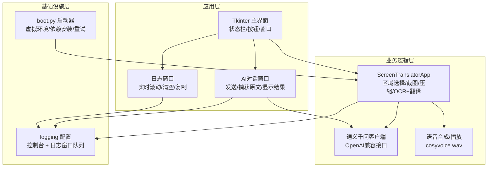
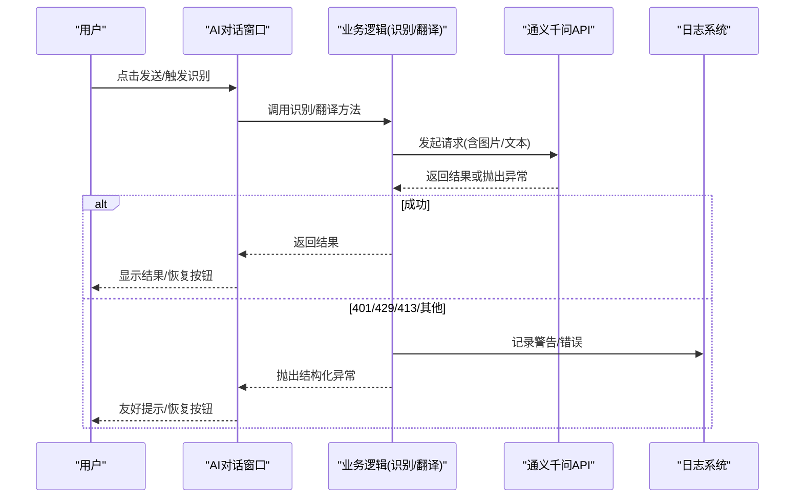
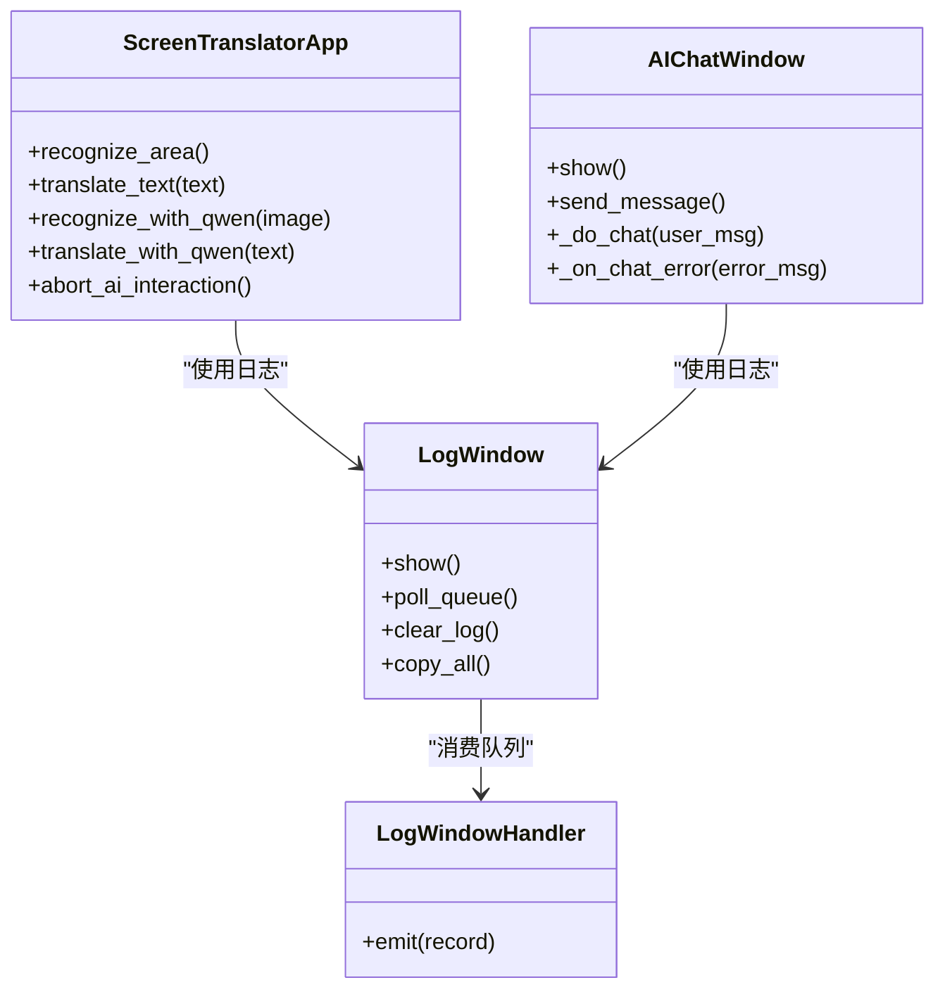

# 错误处理机制

<cite>
**本文引用的文件**   
- [screen_translator_with_qwen.py](file://screen_translator_with_qwen.py)
- [boot.py](file://boot.py)
</cite>

## 目录
1. [简介](#简介)
2. [项目结构](#项目结构)
3. [核心组件](#核心组件)
4. [架构总览](#架构总览)
5. [详细组件分析](#详细组件分析)
6. [依赖关系分析](#依赖关系分析)
7. [性能与稳定性考量](#性能与稳定性考量)
8. [故障排查指南](#故障排查指南)
9. [结论](#结论)

## 简介
本文件聚焦于“AI对话错误处理机制”，围绕以下目标展开：
- API密钥验证错误的检测与用户友好提示（如401未授权）
- 网络异常处理策略（超时、连接失败、请求频率限制识别与应对）
- 用户界面错误反馈机制（错误消息格式化、状态栏更新、操作恢复）
- 异常捕获与日志记录策略（错误信息收集、调试输出、问题诊断支持）
- 提供完整的代码示例路径，展示不同错误场景的处理方法与用户体验优化技巧

## 项目结构
本项目为桌面端屏幕翻译工具，包含主程序与启动器。错误处理贯穿UI交互、网络请求、日志系统等多个层面。

图表来源
- [screen_translator_with_qwen.py:1-120](file://screen_translator_with_qwen.py#L1-L120)
- [screen_translator_with_qwen.py:302-312](file://screen_translator_with_qwen.py#L302-L312)
- [boot.py:255-279](file://boot.py#L255-L279)

章节来源
- [screen_translator_with_qwen.py:1-120](file://screen_translator_with_qwen.py#L1-L120)
- [boot.py:255-279](file://boot.py#L255-L279)

## 核心组件
- 日志系统与日志窗口：集中式日志采集，线程安全写入，UI可实时查看、清空、复制。
- AI对话窗口：封装对话流程，统一错误分类与用户提示，按钮状态管理。
- 主界面与识别/翻译流程：多线程执行耗时任务，状态栏与子窗口同步更新，异常回退到UI提示。
- 启动器：依赖安装与虚拟环境维护，带重试与超时控制，保障运行环境稳定。

章节来源
- [screen_translator_with_qwen.py:21-100](file://screen_translator_with_qwen.py#L21-L100)
- [screen_translator_with_qwen.py:302-312](file://screen_translator_with_qwen.py#L302-L312)
- [screen_translator_with_qwen.py:101-300](file://screen_translator_with_qwen.py#L101-L300)
- [screen_translator_with_qwen.py:474-1096](file://screen_translator_with_qwen.py#L474-L1096)
- [boot.py:115-139](file://boot.py#L115-L139)

## 架构总览
错误处理采用“分层拦截 + 统一上报”的架构：
- 调用层：在API调用处捕获异常，按错误码/关键字分类（401、429、413等）。
- 业务层：根据错误类型决定重试策略（指数退避+随机抖动）、中止标志检查、降级或终止。
- 表现层：通过root.after将错误信息以用户友好的方式更新到状态栏/聊天窗口/按钮状态。
- 日志层：所有关键路径均记录INFO/WARNING/ERROR级别日志，并推送到日志窗口队列。

图表来源
- [screen_translator_with_qwen.py:259-299](file://screen_translator_with_qwen.py#L259-L299)
- [screen_translator_with_qwen.py:1123-1248](file://screen_translator_with_qwen.py#L1123-L1248)

## 详细组件分析

### API密钥验证错误（401未授权）
- 检测方式：在异常字符串中匹配“401”或“Unauthorized”。
- 处理策略：
  - 立即停止重试，直接向上抛出明确的用户提示异常。
  - 在AI对话窗口中，使用系统消息提示“API密钥无效或已过期，请检查key.txt文件”。
  - 在主界面识别/翻译流程中，状态栏显示错误原因，并恢复按钮状态。
- 用户体验优化：
  - 避免无意义的重试，减少等待时间。
  - 给出明确的修复指引（检查key.txt），降低用户困惑。

章节来源
- [screen_translator_with_qwen.py:280-287](file://screen_translator_with_qwen.py#L280-L287)
- [screen_translator_with_qwen.py:1241-1247](file://screen_translator_with_qwen.py#L1241-L1247)

### 请求频率限制（429 Too Many Requests）
- 检测方式：匹配“429”或“Too Many Requests”。
- 处理策略：
  - 启用指数退避+随机抖动重试，最大重试次数为5次。
  - 每次重试前计算延迟：base_delay * (2^attempt) + random.uniform(0,1)。
  - 达到最大重试次数后，抛出“请求过于频繁，请等待几分钟后再试”的异常。
- 用户体验优化：
  - 在日志中记录等待时长与重试次数，便于诊断。
  - 在UI上保持按钮禁用状态，直到最终结果或错误出现。

章节来源
- [screen_translator_with_qwen.py:1224-1234](file://screen_translator_with_qwen.py#L1224-L1234)

### 请求体过大（413 Payload Too Large）
- 检测方式：匹配“413”或“Payload Too Large”。
- 处理策略：
  - 不重试，直接抛出“请求体过大，请选择更小的识别区域”的异常。
  - 建议用户缩小识别区域或降低图像质量。
- 用户体验优化：
  - 明确告知问题原因与解决方向，避免反复尝试。

章节来源
- [screen_translator_with_qwen.py:1244-1245](file://screen_translator_with_qwen.py#L1244-L1245)

### 网络异常与超时
- 当前实现中，AI客户端调用未显式设置超时参数；异常由SDK或底层网络库抛出。
- 通用异常处理：
  - 非401/429/413的错误，在非最后一次尝试时进行固定延迟重试。
  - 最后一次尝试失败时，抛出“通义千问AI请求失败: {error_str}”的异常。
- 建议增强：
  - 为HTTP请求增加connect_timeout与read_timeout参数，提升对网络异常的敏感度。
  - 区分连接错误、DNS解析失败、SSL握手失败等，提供更精准的错误提示。

章节来源
- [screen_translator_with_qwen.py:1236-1247](file://screen_translator_with_qwen.py#L1236-L1247)

### 用户界面错误反馈机制
- 错误消息格式化：
  - 统一以“错误: {message}”或“请求失败: {message}”格式呈现，确保一致性。
- 状态栏更新：
  - 使用root.after在主线程中更新状态标签，避免跨线程UI访问问题。
  - 识别/翻译过程中，状态栏显示“正在识别...”、“翻译中...”、“翻译完成”等状态。
- 用户操作恢复：
  - 无论成功或失败，都会恢复按钮状态（发送/捕获原文/重新识别等）。
  - 对于AI对话窗口，错误后自动恢复发送按钮与捕获按钮。

章节来源
- [screen_translator_with_qwen.py:295-299](file://screen_translator_with_qwen.py#L295-L299)
- [screen_translator_with_qwen.py:994-1012](file://screen_translator_with_qwen.py#L994-L1012)
- [screen_translator_with_qwen.py:1076-1091](file://screen_translator_with_qwen.py#L1076-L1091)

### 异常捕获与日志记录策略
- 日志配置：
  - 同时输出到控制台与自定义LogWindowHandler，后者通过队列异步写入日志窗口。
  - 日志格式包含时间戳、模块名、级别与消息。
- 错误信息收集：
  - 所有关键路径（识别、翻译、语音合成、听歌识曲）均记录INFO/WARNING/ERROR级别日志。
  - 异常发生时记录完整错误字符串，便于定位问题。
- 调试信息输出：
  - 在重试循环中记录尝试次数、错误类型与等待时长。
  - 在设备探测与音频录制路径中记录详细步骤，辅助诊断。

章节来源
- [screen_translator_with_qwen.py:21-100](file://screen_translator_with_qwen.py#L21-L100)
- [screen_translator_with_qwen.py:302-312](file://screen_translator_with_qwen.py#L302-L312)
- [screen_translator_with_qwen.py:1215-1247](file://screen_translator_with_qwen.py#L1215-L1247)

### 启动器错误处理（依赖安装与环境校验）
- 依赖安装重试：
  - pip install带重试机制，失败后间隔递增重试，最多3次。
  - 遇到超时或进程错误，记录警告并在最后抛出异常。
- 虚拟环境校验：
  - 检查sys.prefix指向是否正确，若无效则重建。
  - 比较requirements.txt哈希，不一致则增量更新或重建。
- 日志与清理：
  - 启动器自身日志写入boot.log，超过阈值自动清空。
  - 安装失败时清理半成品虚拟环境，避免污染。

章节来源
- [boot.py:115-139](file://boot.py#L115-L139)
- [boot.py:209-225](file://boot.py#L209-L225)
- [boot.py:255-279](file://boot.py#L255-L279)

## 依赖关系分析
- 模块耦合：
  - AI对话窗口与主界面共享日志系统，松耦合。
  - 识别/翻译流程依赖通义千问客户端，错误分类集中在调用层。
- 外部依赖：
  - OpenAI兼容SDK、DashScope TTS、pyautogui、PIL、pyaudio等。
  - 可选依赖（shazamio、soundcard、numpy、keyboard）具备缺失时的降级处理。

图表来源
- [screen_translator_with_qwen.py:101-300](file://screen_translator_with_qwen.py#L101-L300)
- [screen_translator_with_qwen.py:21-100](file://screen_translator_with_qwen.py#L21-L100)
- [screen_translator_with_qwen.py:474-1096](file://screen_translator_with_qwen.py#L474-L1096)

章节来源
- [screen_translator_with_qwen.py:101-300](file://screen_translator_with_qwen.py#L101-L300)
- [screen_translator_with_qwen.py:474-1096](file://screen_translator_with_qwen.py#L474-L1096)

## 性能与稳定性考量
- 重试策略：
  - 429错误采用指数退避+随机抖动，避免雪崩效应。
  - 其他错误采用固定延迟重试，平衡成功率与响应时间。
- 资源占用：
  - 图像压缩与灰度化减少请求体大小，降低413风险。
  - 日志窗口使用队列异步写入，避免阻塞UI。
- 线程安全：
  - 所有UI更新通过root.after调度，防止跨线程访问导致崩溃。
- 建议优化：
  - 为网络请求设置合理的超时参数，提高对网络异常的敏感度。
  - 引入熔断器或速率限制器，保护后端服务与用户体验。

[本节为通用指导，无需具体文件引用]

## 故障排查指南
- 常见问题与定位：
  - 401未授权：检查key.txt中的API密钥是否有效且未被吊销。
  - 429频率限制：观察日志中的重试等待时间，适当延长重试间隔或降低请求频率。
  - 413请求体过大：缩小识别区域或降低图像质量。
  - 网络超时/连接失败：检查网络连通性、代理设置、防火墙规则。
- 日志查看：
  - 打开“日志”窗口，查看实时日志流。
  - 使用“清空日志”和“复制全部”功能，便于分享与归档。
- 启动器问题：
  - 检查boot.log，确认依赖安装是否成功。
  - 若虚拟环境损坏，启动器会自动重建。

章节来源
- [screen_translator_with_qwen.py:21-100](file://screen_translator_with_qwen.py#L21-L100)
- [screen_translator_with_qwen.py:302-312](file://screen_translator_with_qwen.py#L302-L312)
- [boot.py:40-52](file://boot.py#L40-L52)

## 结论
本项目的错误处理机制通过分层拦截、统一上报与用户友好的反馈，实现了较高的鲁棒性与可维护性。针对API密钥验证、请求频率限制、请求体大小等典型错误场景，提供了明确的检测与处理策略。结合完善的日志系统与启动器环境管理，能够有效支撑复杂网络环境与多依赖场景下的稳定运行。建议在后续迭代中进一步增强网络超时控制与错误分类粒度，以提升用户体验与问题诊断效率。