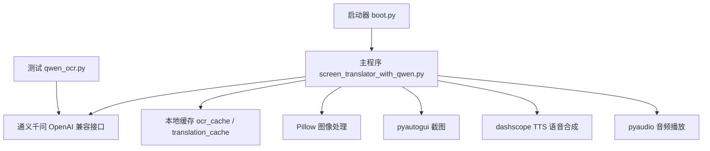
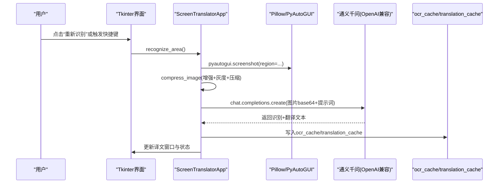
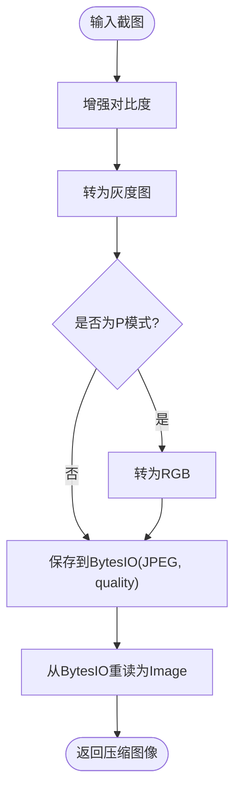
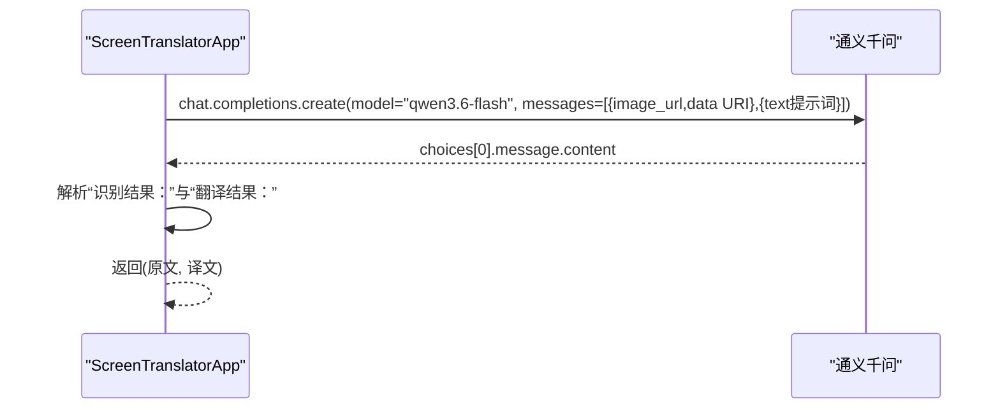
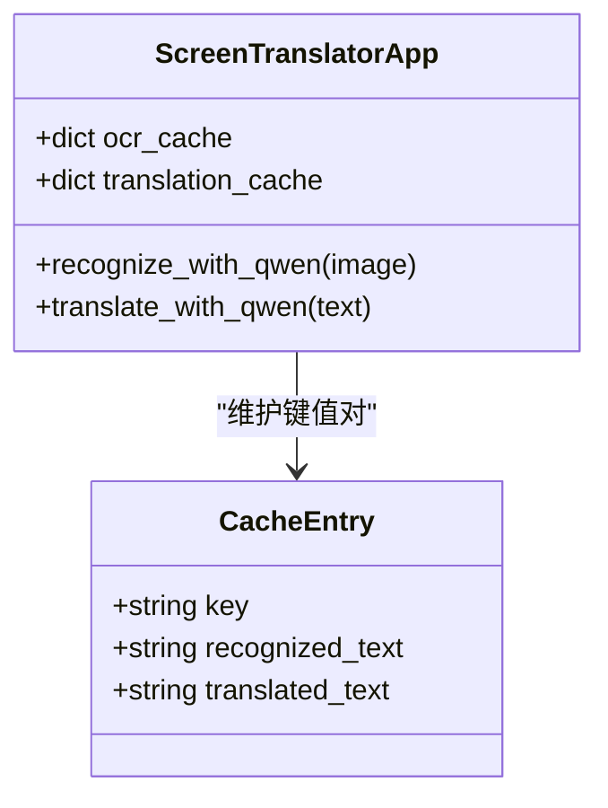
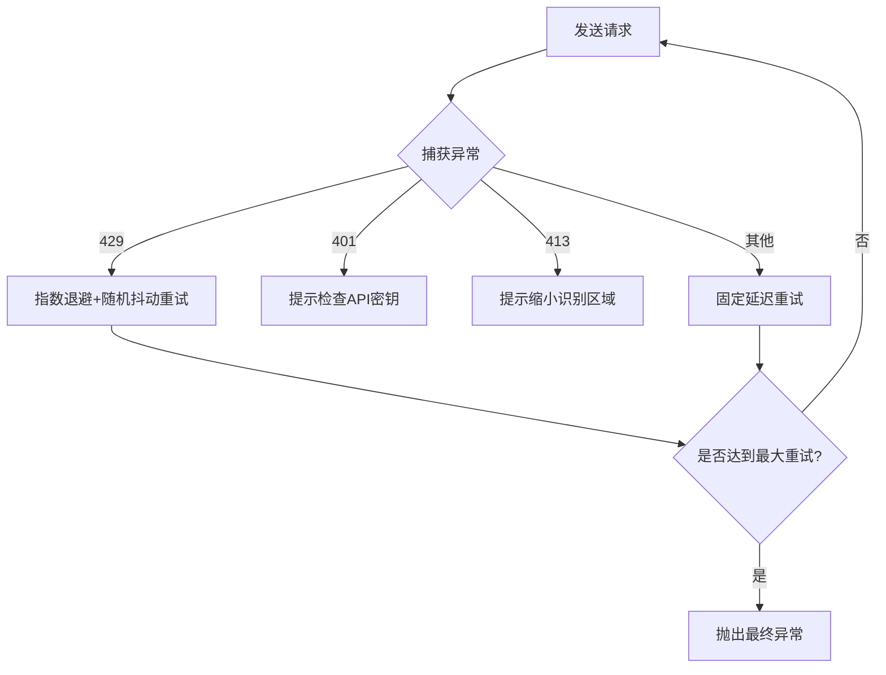
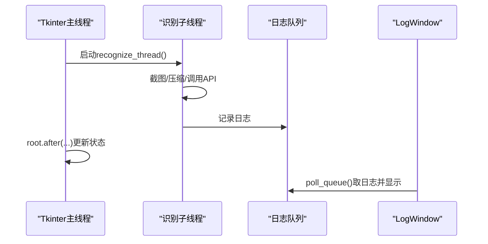
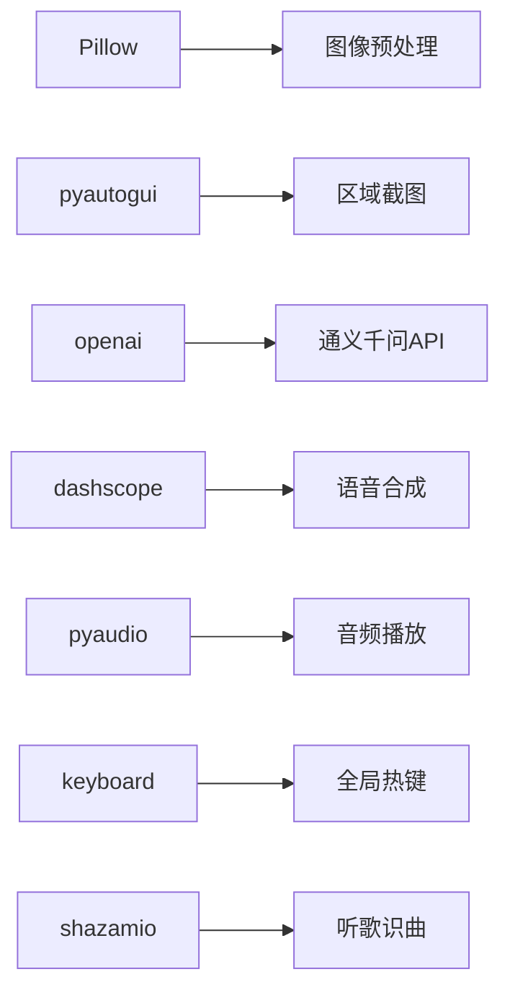

# OCR文字识别服务

<cite>
**本文引用的文件**   
- [screen_translator_with_qwen.py](file://screen_translator_with_qwen.py)
- [qwen_ocr.py](file://test/qwen_ocr.py)
- [boot.py](file://boot.py)
- [requirements.txt](file://requirements.txt)
</cite>

## 目录
1. [简介](#简介)
2. [项目结构](#项目结构)
3. [核心组件](#核心组件)
4. [架构总览](#架构总览)
5. [详细组件分析](#详细组件分析)
6. [依赖关系分析](#依赖关系分析)
7. [性能与并发](#性能与并发)
8. [故障排查指南](#故障排查指南)
9. [结论](#结论)
10. [附录：端到端流程示例](#附录端到端流程示例)

## 简介
本仓库实现了一个桌面OCR文字识别与翻译服务，基于通义千问多模态模型进行图像文本识别与翻译。系统提供屏幕区域选择、截图预处理（对比度增强、灰度化、压缩）、Base64编码、API请求构造与重试、结果解析与缓存、以及UI交互和语音合成等能力。文档将围绕以下目标展开：
- 图像预处理流程（Pillow）：增强、格式转换、Base64编码
- 通义千问OCR API调用：消息构造、图像数据格式、模型参数、响应解析
- OCR结果缓存机制 ocr_cache：键生成、过期策略、内存管理
- 错误处理策略：网络异常、API限流、图像质量问题的处理
- 完整流程示例：从屏幕截图到文本提取
- 多线程与线程安全、性能优化技巧

## 项目结构
- 主程序入口与业务逻辑集中在一个GUI应用中，包含OCR识别、翻译、缓存、音频播放、听歌识曲等功能
- 启动器负责虚拟环境管理与后台启动目标程序
- 测试用例展示了通义千问的图文对话调用方式
- 依赖清单列出了图像处理、OpenAI客户端、DashScope SDK、键盘监听、音频录制/播放等库

图表来源
- [boot.py:256-279](file://boot.py#L256-L279)
- [screen_translator_with_qwen.py:474-634](file://screen_translator_with_qwen.py#L474-L634)
- [qwen_ocr.py:1-30](file://test/qwen_ocr.py#L1-L30)

章节来源
- [boot.py:1-279](file://boot.py#L1-L279)
- [screen_translator_with_qwen.py:1-2417](file://screen_translator_with_qwen.py#L1-L2417)
- [qwen_ocr.py:1-30](file://test/qwen_ocr.py#L1-L30)
- [requirements.txt:1-31](file://requirements.txt#L1-L31)

## 核心组件
- ScreenTranslatorApp：主应用类，封装了区域选择、截图、OCR识别、翻译、缓存、窗口拖拽/缩放、快捷键、语音合成与播放、听歌识曲等
- AIChatWindow：独立AI对话窗口，复用同一OpenAI客户端
- LogWindow：日志窗口，异步消费日志队列并渲染
- 全局OpenAI客户端：通过OpenAI兼容模式访问通义千问
- 缓存字典：ocr_cache 与 translation_cache 用于保存识别原文与翻译结果

章节来源
- [screen_translator_with_qwen.py:474-634](file://screen_translator_with_qwen.py#L474-L634)
- [screen_translator_with_qwen.py:101-300](file://screen_translator_with_qwen.py#L101-L300)
- [screen_translator_with_qwen.py:21-100](file://screen_translator_with_qwen.py#L21-L100)

## 架构总览
整体采用“GUI + 多线程 + 外部API”的架构：
- GUI层：Tkinter界面，负责用户交互与状态展示
- 业务层：ScreenTranslatorApp，协调截图、预处理、OCR、翻译、缓存、TTS
- 外部服务：通义千问（OpenAI兼容接口），阿里云TTS（CosyVoice）
- 工具层：Pillow图像处理、pyautogui截图、pyaudio播放、keyboard全局热键

图表来源
- [screen_translator_with_qwen.py:927-1021](file://screen_translator_with_qwen.py#L927-L1021)
- [screen_translator_with_qwen.py:1098-1122](file://screen_translator_with_qwen.py#L1098-L1122)
- [screen_translator_with_qwen.py:1123-1248](file://screen_translator_with_qwen.py#L1123-L1248)

## 详细组件分析

### 图像预处理流程（Pillow）
- 对比度增强：使用ImageEnhance.Contrast提升对比度，提高OCR鲁棒性
- 灰度化：转换为灰度图，减少颜色干扰，利于后续压缩
- 格式转换与压缩：JPEG不支持P模式，需先转RGB；以指定质量保存到BytesIO，再回读为Image对象
- 输出：返回压缩后的Image对象，便于后续PNG编码与Base64传输

图表来源
- [screen_translator_with_qwen.py:1098-1122](file://screen_translator_with_qwen.py#L1098-L1122)

章节来源
- [screen_translator_with_qwen.py:1098-1122](file://screen_translator_with_qwen.py#L1098-L1122)

### 通义千问OCR API调用
- 客户端初始化：通过OpenAI兼容模式设置base_url与api_key
- 请求构造：messages数组中包含image_url（data URI base64）与text提示词
- 模型参数：model="qwen3.6-flash"
- 响应解析：按行解析“识别结果：”与“翻译结果：”两段内容，合并多行文本
- 重试策略：指数退避+随机抖动，针对429限流做特殊处理；其他错误固定延迟重试

图表来源
- [screen_translator_with_qwen.py:1123-1248](file://screen_translator_with_qwen.py#L1123-L1248)
- [qwen_ocr.py:1-30](file://test/qwen_ocr.py#L1-L30)

章节来源
- [screen_translator_with_qwen.py:338-360](file://screen_translator_with_qwen.py#L338-L360)
- [screen_translator_with_qwen.py:1123-1248](file://screen_translator_with_qwen.py#L1123-L1248)
- [qwen_ocr.py:1-30](file://test/qwen_ocr.py#L1-L30)

### OCR结果缓存机制 ocr_cache
- 缓存键生成：使用图像Base64字符串的前100个字符作为键，避免重复计算相同图像
- 存储结构：ocr_cache保存原文，translation_cache保存对应译文，二者共享同一键
- 读取策略：translate_with_qwen遍历ocr_cache匹配原文，命中则返回对应译文
- 过期策略：当前未实现显式过期清理，存在内存增长风险
- 内存管理：建议增加LRU或时间戳过期策略，限制最大条目数

图表来源
- [screen_translator_with_qwen.py:1207-1213](file://screen_translator_with_qwen.py#L1207-L1213)
- [screen_translator_with_qwen.py:1249-1266](file://screen_translator_with_qwen.py#L1249-L1266)

章节来源
- [screen_translator_with_qwen.py:1207-1213](file://screen_translator_with_qwen.py#L1207-L1213)
- [screen_translator_with_qwen.py:1249-1266](file://screen_translator_with_qwen.py#L1249-L1266)

### 错误处理策略
- 网络异常与限流：捕获HTTP错误码，429限流采用指数退避+随机抖动重试；超过最大重试次数抛出明确异常
- 认证失败：401 Unauthorized提示检查API密钥
- 负载过大：413 Payload Too Large提示缩小识别区域
- 中止控制：在关键步骤检查ai_interaction_active/translating标志，支持用户主动中止
- UI反馈：所有异常均通过root.after在主线程更新UI状态，保证线程安全

图表来源
- [screen_translator_with_qwen.py:1144-1248](file://screen_translator_with_qwen.py#L1144-L1248)

章节来源
- [screen_translator_with_qwen.py:1144-1248](file://screen_translator_with_qwen.py#L1144-L1248)

### 多线程与线程安全
- 识别流程：在子线程中执行截图、压缩、API调用，避免阻塞UI
- UI更新：使用root.after将UI更新调度到主线程，确保线程安全
- 中止机制：通过布尔标志位控制任务中止，防止重复点击与资源竞争
- 日志队列：LogWindowHandler将日志放入queue.Queue，LogWindow轮询消费，解耦日志生产与消费

图表来源
- [screen_translator_with_qwen.py:939-1021](file://screen_translator_with_qwen.py#L939-L1021)
- [screen_translator_with_qwen.py:21-100](file://screen_translator_with_qwen.py#L21-L100)

章节来源
- [screen_translator_with_qwen.py:939-1021](file://screen_translator_with_qwen.py#L939-L1021)
- [screen_translator_with_qwen.py:21-100](file://screen_translator_with_qwen.py#L21-L100)

## 依赖关系分析
- 图像处理：Pillow（对比度增强、灰度化、格式转换）
- 截图：pyautogui（区域截图）
- API客户端：openai（通义千问兼容接口）
- 语音合成：dashscope（CosyVoice）
- 音频播放：pyaudio
- 全局热键：keyboard
- 听歌识曲：shazamio、soundcard、soundfile、numpy、pyaudiowpatch

图表来源
- [requirements.txt:1-31](file://requirements.txt#L1-L31)
- [screen_translator_with_qwen.py:1-20](file://screen_translator_with_qwen.py#L1-L20)

章节来源
- [requirements.txt:1-31](file://requirements.txt#L1-L31)
- [screen_translator_with_qwen.py:1-20](file://screen_translator_with_qwen.py#L1-L20)

## 性能与并发
- 图像压缩：降低分辨率与质量可减少网络传输与处理时间，但可能影响OCR精度；建议根据场景调整quality参数
- Base64开销：大图像会产生较大Base64字符串，注意payload大小限制（413错误）
- 重试与退避：合理设置最大重试次数与基础延迟，避免雪崩效应
- 缓存命中率：若频繁识别相同区域，可考虑更稳定的缓存键（如图像哈希）以提升命中率
- 线程安全：避免在非主线程直接操作Tkinter控件，统一通过root.after调度

[本节为通用指导，不直接分析具体文件]

## 故障排查指南
- 无法识别：确认已选择识别区域且区域足够大；检查网络连接与API密钥
- 429限流：等待一段时间后重试，或降低请求频率
- 413过大：缩小识别区域或降低图像质量
- 401认证失败：检查key.txt中的API密钥是否正确
- 无译文：确认ocr_cache中存在对应原文；必要时重新识别
- 语音播放失败：检查cosyvoice.wav是否存在与音频设备是否正常

章节来源
- [screen_translator_with_qwen.py:1144-1248](file://screen_translator_with_qwen.py#L1144-L1248)
- [screen_translator_with_qwen.py:1249-1266](file://screen_translator_with_qwen.py#L1249-L1266)

## 结论
该OCR服务将屏幕截图、图像预处理、通义千问多模态识别与翻译、结果缓存与UI展示整合在一个桌面应用中。其优势在于易用性与功能丰富，但在缓存过期与内存管理方面仍有改进空间。建议在后续版本引入LRU缓存、图像哈希键、自适应压缩策略与更完善的错误恢复机制。

[本节为总结，不直接分析具体文件]

## 附录：端到端流程示例
以下为从屏幕截图到文本提取的完整流程说明（不含代码片段，仅路径引用）：
- 选择识别区域：参见 [select_area:781-857](file://screen_translator_with_qwen.py#L781-L857)、[on_mouse_up:825-857](file://screen_translator_with_qwen.py#L825-L857)
- 创建边框与控制按钮：参见 [create_border_window:859-926](file://screen_translator_with_qwen.py#L859-L926)
- 触发识别：参见 [recognize_area:927-1021](file://screen_translator_with_qwen.py#L927-L1021)
- 截图与预处理：参见 [compress_image:1098-1122](file://screen_translator_with_qwen.py#L1098-L1122)
- 构建请求与调用API：参见 [recognize_with_qwen:1123-1248](file://screen_translator_with_qwen.py#L1123-L1248)
- 解析与缓存：参见 [recognize_with_qwen 解析与缓存部分:1180-1213](file://screen_translator_with_qwen.py#L1180-L1213)
- 更新UI与状态：参见 [recognize_area UI更新:994-1011](file://screen_translator_with_qwen.py#L994-L1011)
- 从缓存读取译文：参见 [translate_with_qwen:1249-1266](file://screen_translator_with_qwen.py#L1249-L1266)

章节来源
- [screen_translator_with_qwen.py:781-857](file://screen_translator_with_qwen.py#L781-L857)
- [screen_translator_with_qwen.py:859-926](file://screen_translator_with_qwen.py#L859-L926)
- [screen_translator_with_qwen.py:927-1021](file://screen_translator_with_qwen.py#L927-L1021)
- [screen_translator_with_qwen.py:1098-1122](file://screen_translator_with_qwen.py#L1098-L1122)
- [screen_translator_with_qwen.py:1123-1248](file://screen_translator_with_qwen.py#L1123-L1248)
- [screen_translator_with_qwen.py:1249-1266](file://screen_translator_with_qwen.py#L1249-L1266)