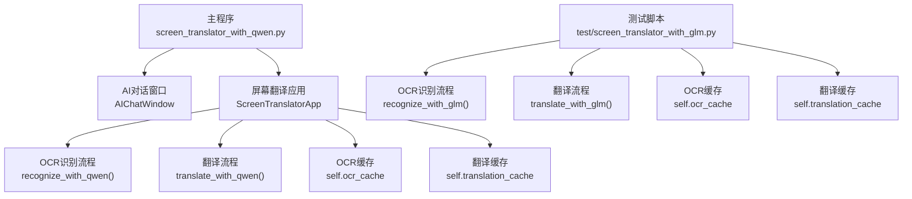
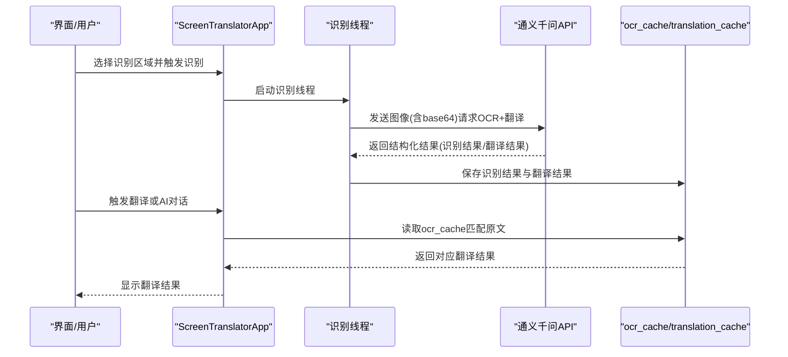
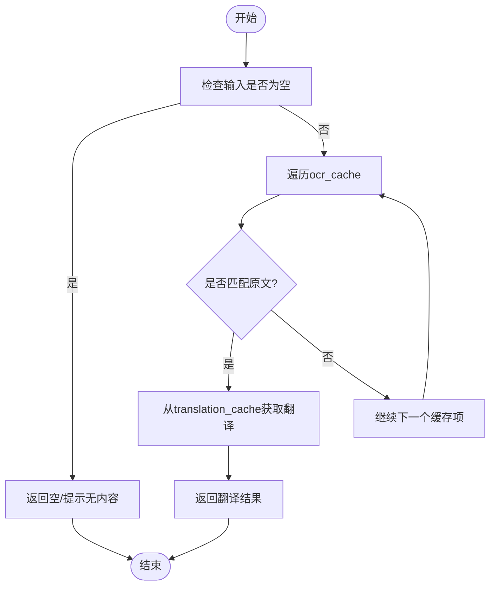
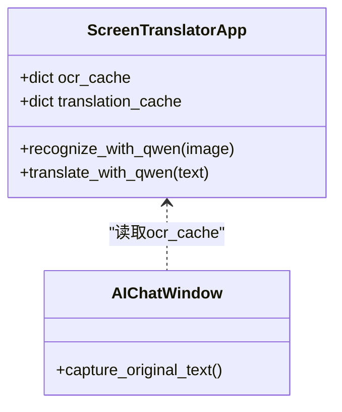

# OCR结果缓存机制

<cite>
**本文引用的文件**   
- [screen_translator_with_qwen.py](file://screen_translator_with_qwen.py)
- [screen_translator_with_glm.py](file://test/screen_translator_with_glm.py)
</cite>

## 目录
1. [简介](#简介)
2. [项目结构](#项目结构)
3. [核心组件](#核心组件)
4. [架构总览](#架构总览)
5. [详细组件分析](#详细组件分析)
6. [依赖关系分析](#依赖关系分析)
7. [性能考量](#性能考量)
8. [故障排查指南](#故障排查指南)
9. [结论](#结论)
10. [附录](#附录)

## 简介
本文件聚焦于OCR结果缓存机制，围绕ocr_cache字典的数据结构设计、键值对存储方式、区域坐标作为键的生成策略与文本内容格式进行说明；并阐述缓存更新策略（覆盖逻辑、重复区域检测）、内存占用控制、清理策略（过期时间管理、内存压力检测、自动清理触发条件）；同时解释多线程环境下的访问安全（线程锁使用与并发访问控制），并提供缓存性能监控与优化建议。

## 项目结构
本项目包含多个脚本，其中与OCR识别和翻译相关的缓存实现主要位于主程序与测试脚本中：
- 主程序：screen_translator_with_qwen.py
- 测试脚本：test/screen_translator_with_glm.py

图表来源
- [screen_translator_with_qwen.py:474-634](file://screen_translator_with_qwen.py#L474-L634)
- [screen_translator_with_qwen.py:1123-1213](file://screen_translator_with_qwen.py#L1123-L1213)
- [screen_translator_with_qwen.py:1249-1266](file://screen_translator_with_qwen.py#L1249-L1266)
- [screen_translator_with_glm.py:120-132](file://test/screen_translator_with_glm.py#L120-L132)
- [screen_translator_with_glm.py:689-705](file://test/screen_translator_with_glm.py#L689-L705)
- [screen_translator_with_glm.py:741-758](file://test/screen_translator_with_glm.py#L741-L758)

章节来源
- [screen_translator_with_qwen.py:474-634](file://screen_translator_with_qwen.py#L474-L634)
- [screen_translator_with_qwen.py:1123-1213](file://screen_translator_with_qwen.py#L1123-L1213)
- [screen_translator_with_qwen.py:1249-1266](file://screen_translator_with_qwen.py#L1249-L1266)
- [screen_translator_with_glm.py:120-132](file://test/screen_translator_with_glm.py#L120-L132)
- [screen_translator_with_glm.py:689-705](file://test/screen_translator_with_glm.py#L689-L705)
- [screen_translator_with_glm.py:741-758](file://test/screen_translator_with_glm.py#L741-L758)

## 核心组件
- ScreenTranslatorApp：主应用类，维护ocr_cache与translation_cache两个字典，负责OCR识别、翻译以及UI交互。
- AIChatWindow：AI对话窗口，提供“捕获原文”功能，从ocr_cache读取已识别的原文并合并展示。
- 识别与翻译流程：在多线程中调用外部AI服务，解析返回结果后写入缓存。

章节来源
- [screen_translator_with_qwen.py:474-634](file://screen_translator_with_qwen.py#L474-L634)
- [screen_translator_with_qwen.py:198-221](file://screen_translator_with_qwen.py#L198-L221)
- [screen_translator_with_qwen.py:1017-1020](file://screen_translator_with_qwen.py#L1017-L1020)
- [screen_translator_with_qwen.py:1093-1096](file://screen_translator_with_qwen.py#L1093-L1096)

## 架构总览
下图展示了OCR识别到缓存写入、再到翻译读取的整体流程，包括多线程执行路径与缓存读写位置。

图表来源
- [screen_translator_with_qwen.py:1017-1020](file://screen_translator_with_qwen.py#L1017-L1020)
- [screen_translator_with_qwen.py:1123-1213](file://screen_translator_with_qwen.py#L1123-L1213)
- [screen_translator_with_qwen.py:1249-1266](file://screen_translator_with_qwen.py#L1249-L1266)
- [screen_translator_with_qwen.py:198-221](file://screen_translator_with_qwen.py#L198-L221)

## 详细组件分析

### 数据结构设计：ocr_cache与translation_cache
- 存储类型：Python内置dict
- 键（Key）：当前实现使用图像数据的前若干字符作为缓存键（例如base64编码字符串的前100个字符）。该键用于唯一标识一次识别输入，从而关联对应的识别结果与翻译结果。
- 值（Value）：
  - ocr_cache[key]：识别出的原文文本（字符串）
  - translation_cache[key]：对应的翻译结果文本（字符串）
- 文本内容格式：由AI返回的结构化文本经解析后提取“识别结果：”和“翻译结果：”后的内容，去除首尾空白后存入缓存。

章节来源
- [screen_translator_with_qwen.py:631-633](file://screen_translator_with_qwen.py#L631-L633)
- [screen_translator_with_qwen.py:1135-1138](file://screen_translator_with_qwen.py#L1135-L1138)
- [screen_translator_with_qwen.py:1185-1205](file://screen_translator_with_qwen.py#L1185-L1205)
- [screen_translator_with_qwen.py:1207-1211](file://screen_translator_with_qwen.py#L1207-L1211)
- [screen_translator_with_glm.py:689-705](file://test/screen_translator_with_glm.py#L689-L705)

### 键生成策略：基于图像前缀的哈希式键
- 生成方式：将图像转换为base64编码字符串，取前N个字符作为缓存键。
- 优点：无需额外计算哈希，避免大对象引用带来的内存开销；键长度固定，便于日志记录与调试。
- 风险：仅使用前缀可能导致不同图像产生相同键的概率增加，引发误命中。若需更强区分度，可改用完整哈希（如SHA-256）或结合区域坐标等元信息。

章节来源
- [screen_translator_with_qwen.py:1135-1138](file://screen_translator_with_qwen.py#L1135-L1138)
- [screen_translator_with_qwen.py:1207-1211](file://screen_translator_with_qwen.py#L1207-L1211)
- [screen_translator_with_glm.py:689-705](file://test/screen_translator_with_glm.py#L689-L705)

### 文本内容存储格式
- 识别结果：从AI响应中定位“识别结果：”行，提取冒号后的内容并strip处理。
- 翻译结果：从AI响应中定位“翻译结果：”行，提取冒号后的内容并strip处理。
- 存储：分别写入ocr_cache与translation_cache，保持键一致以便后续按原文查找翻译。

章节来源
- [screen_translator_with_qwen.py:1185-1205](file://screen_translator_with_qwen.py#L1185-L1205)
- [screen_translator_with_qwen.py:1207-1211](file://screen_translator_with_qwen.py#L1207-L1211)
- [screen_translator_with_glm.py:689-705](file://test/screen_translator_with_glm.py#L689-L705)

### 缓存更新策略
- 覆盖逻辑：每次成功识别后，以生成的缓存键直接赋值写入ocr_cache与translation_cache，若键已存在则覆盖旧值。
- 重复区域检测：当前未实现基于区域坐标的重复检测；若同一区域多次识别，会按新结果覆盖旧缓存项。
- 一致性保证：ocr_cache与translation_cache通过相同键保持一致性，确保按原文能准确找到对应翻译。

章节来源
- [screen_translator_with_qwen.py:1207-1211](file://screen_translator_with_qwen.py#L1207-L1211)
- [screen_translator_with_qwen.py:1249-1266](file://screen_translator_with_qwen.py#L1249-L1266)

### 缓存清理策略
- 过期时间管理：当前未实现基于时间的过期策略。
- 内存压力检测：未检测到系统内存压力指标，也未据此触发清理。
- 自动清理触发条件：未发现定时任务或阈值触发的自动清理逻辑。
- 建议：可引入LRU或TTL策略，并结合内存使用阈值进行自动清理。

章节来源
- [screen_translator_with_qwen.py:631-633](file://screen_translator_with_qwen.py#L631-L633)
- [screen_translator_with_qwen.py:1207-1211](file://screen_translator_with_qwen.py#L1207-L1211)

### 多线程环境下的缓存访问安全
- 线程模型：识别与翻译流程均在新线程中执行，UI在主线程运行。
- 并发访问：ocr_cache与translation_cache为普通dict，当前代码未显式加锁保护。由于Python的GIL与CPython dict实现的特性，基本读写通常不会导致崩溃，但语义上仍可能存在竞态（如遍历与写入同时进行）。
- 现有同步点：
  - 使用ai_interaction_active与translating标志位控制流程中止与状态切换。
  - 使用threading.Thread创建子线程，daemon=True，避免阻塞进程退出。
- 建议：
  - 为ocr_cache与translation_cache添加互斥锁（如threading.Lock或RLock），在读写时加锁，确保原子性与可见性。
  - 在遍历缓存（如AI对话窗口的“捕获原文”）时也应加锁，避免迭代期间被修改。

章节来源
- [screen_translator_with_qwen.py:1017-1020](file://screen_translator_with_qwen.py#L1017-L1020)
- [screen_translator_with_qwen.py:1093-1096](file://screen_translator_with_qwen.py#L1093-L1096)
- [screen_translator_with_qwen.py:198-221](file://screen_translator_with_qwen.py#L198-L221)
- [screen_translator_with_qwen.py:631-633](file://screen_translator_with_qwen.py#L631-L633)

### 缓存读取与匹配流程
- 翻译读取：translate_with_qwen方法遍历ocr_cache，寻找与传入text完全匹配的条目，若命中则返回对应translation_cache中的翻译结果。
- 捕获原文：AIChatWindow.capture_original_text遍历ocr_cache，收集非空文本并合并展示。

图表来源
- [screen_translator_with_qwen.py:1249-1266](file://screen_translator_with_qwen.py#L1249-L1266)
- [screen_translator_with_qwen.py:198-221](file://screen_translator_with_qwen.py#L198-L221)

章节来源
- [screen_translator_with_qwen.py:1249-1266](file://screen_translator_with_qwen.py#L1249-L1266)
- [screen_translator_with_qwen.py:198-221](file://screen_translator_with_qwen.py#L198-L221)

## 依赖关系分析
- 模块内依赖：
  - ScreenTranslatorApp持有ocr_cache与translation_cache，并在识别完成后写入，在翻译时读取。
  - AIChatWindow依赖ScreenTranslatorApp的ocr_cache进行“捕获原文”。
- 外部依赖：
  - 通义千问API客户端用于OCR与翻译请求。
  - 多线程用于异步处理识别与翻译，避免阻塞UI。

图表来源
- [screen_translator_with_qwen.py:474-634](file://screen_translator_with_qwen.py#L474-L634)
- [screen_translator_with_qwen.py:198-221](file://screen_translator_with_qwen.py#L198-L221)
- [screen_translator_with_qwen.py:1123-1213](file://screen_translator_with_qwen.py#L1123-L1213)
- [screen_translator_with_qwen.py:1249-1266](file://screen_translator_with_qwen.py#L1249-L1266)

章节来源
- [screen_translator_with_qwen.py:474-634](file://screen_translator_with_qwen.py#L474-L634)
- [screen_translator_with_qwen.py:198-221](file://screen_translator_with_qwen.py#L198-L221)
- [screen_translator_with_qwen.py:1123-1213](file://screen_translator_with_qwen.py#L1123-L1213)
- [screen_translator_with_qwen.py:1249-1266](file://screen_translator_with_qwen.py#L1249-L1266)

## 性能考量
- 键生成成本：当前使用base64前缀，成本低但区分度有限。若改为完整哈希，会增加CPU开销，但可降低碰撞概率。
- 缓存大小增长：无上限控制，长期运行可能累积大量条目，影响内存占用与遍历性能。
- 遍历匹配复杂度：translate_with_qwen采用线性扫描匹配原文，时间复杂度O(n)，n为缓存项数量。当缓存较大时，匹配耗时显著上升。
- 多线程竞争：缺少锁保护，在高并发场景下可能出现竞态，导致不一致或异常。
- 建议优化：
  - 引入LRU/TTL策略限制缓存规模。
  - 使用更稳定的键（如SHA-256）或组合键（图像指纹+区域坐标）。
  - 为ocr_cache与translation_cache添加互斥锁，确保并发安全。
  - 对翻译读取采用索引结构（如原文到键的映射）降低匹配复杂度。
  - 定期统计缓存大小与命中率，设置告警与自动清理阈值。

[本节为通用性能讨论，不直接分析具体文件]

## 故障排查指南
- 常见问题
  - 未找到缓存的翻译结果：可能是原文不完全匹配或缓存已被覆盖。
  - 请求体过大：AI服务返回错误码，需缩小识别区域或压缩图像。
  - 请求过于频繁：遇到限流错误，应退避重试或降低频率。
- 定位步骤
  - 查看日志输出，确认缓存键与匹配过程。
  - 检查ai_interaction_active与translating标志位是否正确重置。
  - 验证ocr_cache与translation_cache的一致性（相同键是否存在）。
- 相关代码路径
  - 识别与缓存写入：[screen_translator_with_qwen.py:1123-1213](file://screen_translator_with_qwen.py#L1123-L1213)
  - 翻译读取与缓存匹配：[screen_translator_with_qwen.py:1249-1266](file://screen_translator_with_qwen.py#L1249-L1266)
  - 错误处理与重试：[screen_translator_with_qwen.py:1215-1247](file://screen_translator_with_qwen.py#L1215-L1247)

章节来源
- [screen_translator_with_qwen.py:1123-1213](file://screen_translator_with_qwen.py#L1123-L1213)
- [screen_translator_with_qwen.py:1249-1266](file://screen_translator_with_qwen.py#L1249-L1266)
- [screen_translator_with_qwen.py:1215-1247](file://screen_translator_with_qwen.py#L1215-L1247)

## 结论
当前OCR结果缓存机制采用简单的字典结构，以图像前缀作为键，存储识别与翻译结果。其优点是实现简洁、易于理解；缺点是缺乏过期与容量控制、并发安全未显式保障、匹配效率随缓存规模线性增长。建议在后续版本中引入锁机制、LRU/TTL策略、更稳健的键生成方案与索引结构，以提升稳定性与性能。

[本节为总结性内容，不直接分析具体文件]

## 附录
- 术语说明
  - OCR：光学字符识别，将图像中的文字转换为可编辑文本。
  - 缓存键：用于唯一标识缓存条目的字符串或哈希值。
  - LRU：最近最少使用淘汰策略。
  - TTL：生存时间，超过时间后自动失效。

[本节为概念性说明，不直接分析具体文件]