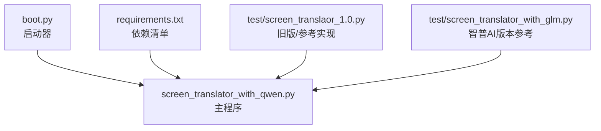
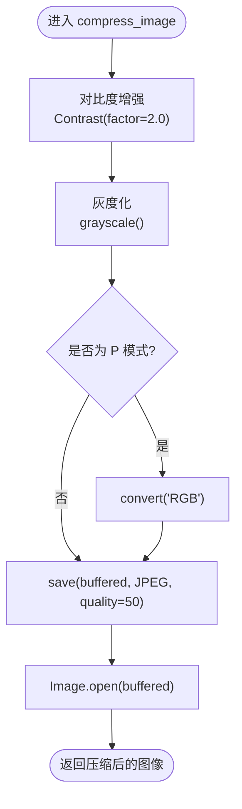
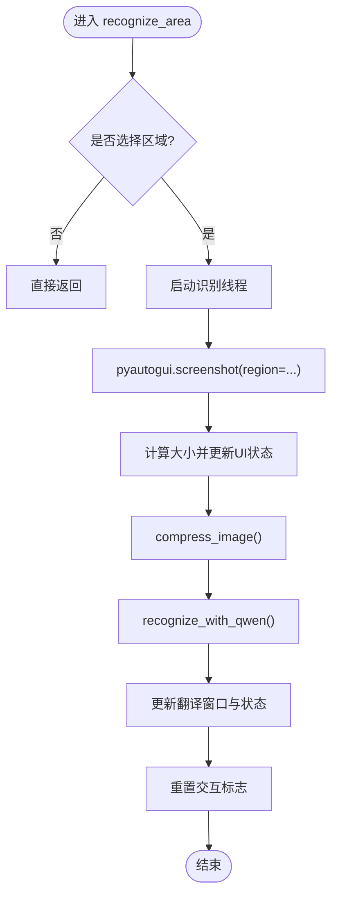
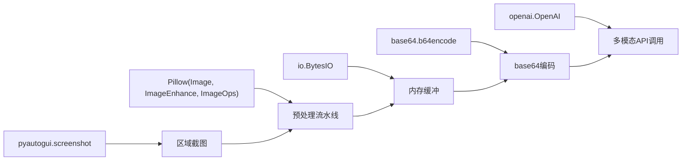

# 图像预处理流程

<cite>
**本文引用的文件**   
- [screen_translator_with_qwen.py](file://screen_translator_with_qwen.py)
- [requirements.txt](file://requirements.txt)
- [boot.py](file://boot.py)
- [test/screen_translaor_1.0.py](file://test/screen_translaor_1.0.py)
- [test/screen_translator_with_glm.py](file://test/screen_translator_with_glm.py)
</cite>

## 目录
1. [简介](#简介)
2. [项目结构](#项目结构)
3. [核心组件](#核心组件)
4. [架构总览](#架构总览)
5. [详细组件分析](#详细组件分析)
6. [依赖关系分析](#依赖关系分析)
7. [性能考虑](#性能考虑)
8. [故障排查指南](#故障排查指南)
9. [结论](#结论)
10. [附录：代码示例路径与参数配置](#附录代码示例路径与参数配置)

## 简介
本文件聚焦于“屏幕翻译工具”的图像预处理流程，系统性说明从屏幕截图到API请求的完整处理链。内容涵盖：
- Pillow库使用：Image.open()、ImageEnhance对比度增强、亮度调整、灰度转换等
- base64编码过程：字节数组转换、编码格式选择、数据传输优化
- 图像格式转换：从截图到PNG/JPEG再到API数据URL的链路
- 图像质量优化策略：分辨率调整、噪声减少、边缘增强（结合现有实现与通用实践）
- 具体步骤的代码示例路径与参数配置说明

## 项目结构
本项目主程序位于根目录，测试与历史版本脚本位于test子目录。启动器boot.py负责虚拟环境管理与后台启动目标程序；requirements.txt声明了Pillow、pyautogui、openai等关键依赖。



图表来源
- [boot.py:256-279](file://boot.py#L256-L279)
- [requirements.txt:1-31](file://requirements.txt#L1-L31)
- [screen_translator_with_qwen.py:1-20](file://screen_translator_with_qwen.py#L1-L20)

章节来源
- [boot.py:256-279](file://boot.py#L256-L279)
- [requirements.txt:1-31](file://requirements.txt#L1-L31)

## 核心组件
- 截图与区域选择：基于pyautogui.screenshot按用户选择的矩形区域截取屏幕
- 图像预处理：对比度增强、灰度化、内存压缩（JPEG），必要时转换为RGB以兼容保存
- 编码与传输：将处理后图像保存为PNG，进行base64编码并拼接为data URL，通过OpenAI兼容接口发送
- 结果解析与展示：解析多模态返回文本，提取识别与翻译结果，更新UI

章节来源
- [screen_translator_with_qwen.py:927-1021](file://screen_translator_with_qwen.py#L927-L1021)
- [screen_translator_with_qwen.py:1098-1121](file://screen_translator_with_qwen.py#L1098-L1121)
- [screen_translator_with_qwen.py:1123-1200](file://screen_translator_with_qwen.py#L1123-L1200)

## 架构总览
下图展示了从用户触发识别到AI返回结果的端到端流程，重点标注图像处理与编码环节。

```mermaid
sequenceDiagram
participant UI as "界面"
participant App as "ScreenTranslatorApp"
participant OS as "操作系统/驱动"
participant PIL as "Pillow(图像处理)"
participant IO as "内存缓冲(BytesIO)"
participant API as "通义千问API"
UI->>App : 点击“重新识别”
App->>OS : pyautogui.screenshot(region=...)
OS-->>App : 原始截图对象
App->>PIL : compress_image()<br/>对比度增强/灰度化/压缩
PIL->>IO : save(buffered, JPEG)
App->>PIL : Image.open(buffered)
App->>PIL : image.save(buffered, PNG)
App->>App : base64.b64encode(...)
App->>API : chat.completions.create(image_url=data : image/png;base64,...)
API-->>App : 识别+翻译文本
App->>UI : 更新显示
```

图表来源
- [screen_translator_with_qwen.py:927-1021](file://screen_translator_with_qwen.py#L927-L1021)
- [screen_translator_with_qwen.py:1098-1121](file://screen_translator_with_qwen.py#L1098-L1121)
- [screen_translator_with_qwen.py:1123-1200](file://screen_translator_with_qwen.py#L1123-L1200)

## 详细组件分析

### 组件A：图像压缩与增强（compress_image）
该函数是预处理的核心，包含以下关键步骤：
- 对比度增强：使用ImageEnhance.Contrast提升对比度，提高文字清晰度
- 灰度化：使用ImageOps.grayscale转为单通道，降低后续处理的复杂度
- 模式兼容：若为P模式则转换为RGB，确保JPEG保存成功
- 内存压缩：写入BytesIO并以JPEG保存，控制quality参数平衡体积与可读性
- 回读对象：用Image.open从缓冲中重建图像对象供后续使用



图表来源
- [screen_translator_with_qwen.py:1098-1121](file://screen_translator_with_qwen.py#L1098-L1121)

章节来源
- [screen_translator_with_qwen.py:1098-1121](file://screen_translator_with_qwen.py#L1098-L1121)

### 组件B：OCR与翻译（recognize_with_qwen）
该函数完成图像到API请求的转换与调用：
- 将图像保存为PNG，便于无损传输给多模态模型
- 使用base64.b64encode对PNG字节流进行编码，解码为UTF-8字符串
- 构造data URL（data:image/png;base64,...）作为image_url参数
- 调用OpenAI兼容接口的chat.completions.create，附带提示词要求输出“识别结果”和“翻译结果”
- 解析返回文本，提取两段内容并缓存

```mermaid
sequenceDiagram
participant App as "ScreenTranslatorApp"
participant PIL as "Pillow"
participant Base64 as "base64"
participant API as "OpenAI兼容接口"
App->>PIL : image.save(buffered, PNG)
App->>Base64 : b64encode(buffered.getvalue())
Base64-->>App : img_str (UTF-8)
App->>API : create(model="qwen3.6-flash", messages=[{image_url : data : image/png;base64,...}, {text : 提示词}])
API-->>App : 返回结构化文本
App->>App : 解析“识别结果”和“翻译结果”
```

图表来源
- [screen_translator_with_qwen.py:1123-1200](file://screen_translator_with_qwen.py#L1123-L1200)

章节来源
- [screen_translator_with_qwen.py:1123-1200](file://screen_translator_with_qwen.py#L1123-L1200)

### 组件C：识别入口与线程调度（recognize_area）
- 校验当前区域是否已选择
- 在独立线程中执行识别，避免阻塞UI
- 先计算原始截图大小用于UI反馈
- 调用compress_image进行预处理
- 调用recognize_with_qwen完成OCR与翻译
- 异常处理与状态重置



图表来源
- [screen_translator_with_qwen.py:927-1021](file://screen_translator_with_qwen.py#L927-L1021)

章节来源
- [screen_translator_with_qwen.py:927-1021](file://screen_translator_with_qwen.py#L927-L1021)

### 组件D：旧版/参考实现中的增强与压缩
在历史版本中，还实现了更完整的增强流程（包括亮度调整）与可选的过程图保存，可作为扩展参考：
- 对比度增强：Contrast(factor=2.0)
- 亮度调整：Brightness(factor=1.2)
- 灰度化：grayscale()
- 可选保存中间图：enhanced/compressed图片到screenshots目录
- 压缩：JPEG quality=50，必要时convert('RGB')

章节来源
- [test/screen_translaor_1.0.py:684-746](file://test/screen_translaor_1.0.py#L684-L746)

### 组件E：智普AI版本的压缩与编码
智普版本同样采用对比度增强+灰度化+JPEG压缩，并在调用前将图像保存为PNG后base64编码，注意其image_url字段直接使用字符串而非data URL形式。

章节来源
- [test/screen_translator_with_glm.py:595-637](file://test/screen_translator_with_glm.py#L595-L637)

## 依赖关系分析
- Pillow：提供Image、ImageEnhance、ImageOps等能力，用于对比度增强、灰度化、格式转换与压缩
- pyautogui：用于按区域截取屏幕
- openai：提供OpenAI兼容客户端，用于调用多模态大模型
- base64、io：用于图像字节流与base64编码
- tkinter：用于GUI展示与交互



图表来源
- [requirements.txt:1-31](file://requirements.txt#L1-L31)
- [screen_translator_with_qwen.py:1-20](file://screen_translator_with_qwen.py#L1-L20)

章节来源
- [requirements.txt:1-31](file://requirements.txt#L1-L31)

## 性能考虑
- 对比度增强与灰度化可显著提升OCR准确率，但会增加CPU开销；建议仅在需要时启用
- JPEG压缩quality参数需在体积与可读性之间权衡；默认50适合大多数场景
- 传输格式选择PNG可减少二次压缩损失，利于多模态模型识别；但体积更大
- 内存缓冲（BytesIO）避免磁盘I/O，提升整体吞吐
- 多线程执行识别任务，避免阻塞UI线程

[本节为通用指导，不直接分析具体文件]

## 故障排查指南
- 未选择区域：检查current_region是否正确设置
- 重复识别被忽略：确认ai_interaction_active标志未被占用
- 图像模式错误（P模式无法保存为JPEG）：确保在保存前convert('RGB')
- API密钥无效或过期：检查key.txt与OpenAI兼容接口初始化
- 请求体过大：减小识别区域或降低图像质量
- 网络超时或限频：利用内置重试机制与指数退避

章节来源
- [screen_translator_with_qwen.py:927-1021](file://screen_translator_with_qwen.py#L927-L1021)
- [screen_translator_with_qwen.py:1123-1200](file://screen_translator_with_qwen.py#L1123-L1200)

## 结论
本项目的图像预处理流程围绕“增强—压缩—编码—传输”展开，充分利用Pillow提供的增强与格式处理能力，并通过base64编码适配多模态API的数据URL格式。通过合理的参数配置与内存缓冲策略，在保证识别质量的同时兼顾传输效率与用户体验。

[本节为总结性内容，不直接分析具体文件]

## 附录：代码示例路径与参数配置
以下为各预处理步骤的具体实现位置与关键参数，便于快速定位与调优：

- 对比度增强
  - 示例路径：[screen_translator_with_qwen.py:1098-1121](file://screen_translator_with_qwen.py#L1098-L1121)
  - 关键参数：contrast factor=2.0

- 亮度调整（参考旧版）
  - 示例路径：[test/screen_translaor_1.0.py:684-694](file://test/screen_translaor_1.0.py#L684-L694)
  - 关键参数：brightness factor=1.2

- 灰度化
  - 示例路径：[screen_translator_with_qwen.py:1105-1109](file://screen_translator_with_qwen.py#L1105-L1109)

- JPEG压缩与模式兼容
  - 示例路径：[screen_translator_with_qwen.py:1112-1121](file://screen_translator_with_qwen.py#L1112-L1121)
  - 关键参数：quality=50；必要时convert('RGB')

- PNG保存与base64编码
  - 示例路径：[screen_translator_with_qwen.py:1135-1138](file://screen_translator_with_qwen.py#L1135-L1138)
  - 关键参数：format="PNG"；base64.b64encode(...).decode('utf-8')

- data URL拼接与API调用
  - 示例路径：[screen_translator_with_qwen.py:1152-1171](file://screen_translator_with_qwen.py#L1152-L1171)
  - 关键参数：model="qwen3.6-flash"；image_url=data:image/png;base64,...

- 结果解析与缓存
  - 示例路径：[screen_translator_with_qwen.py:1180-1200](file://screen_translator_with_qwen.py#L1180-L1200)

- 旧版增强与过程图保存（可选）
  - 示例路径：[test/screen_translaor_1.0.py:709-746](file://test/screen_translaor_1.0.py#L709-L746)

- 智普版本压缩与编码差异
  - 示例路径：[test/screen_translator_with_glm.py:595-637](file://test/screen_translator_with_glm.py#L595-L637)