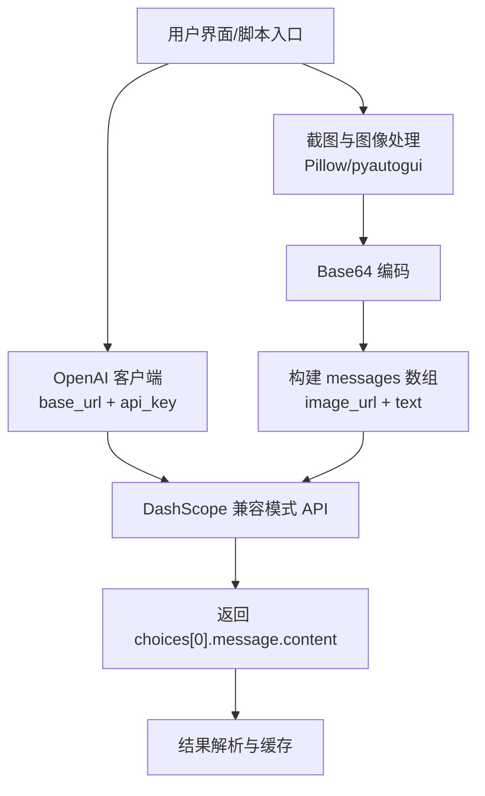
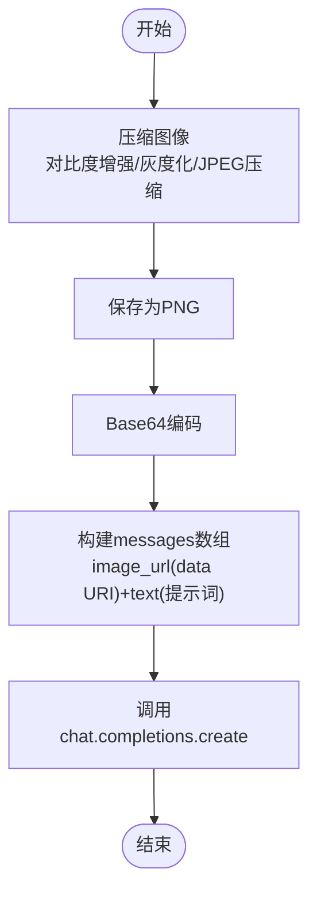
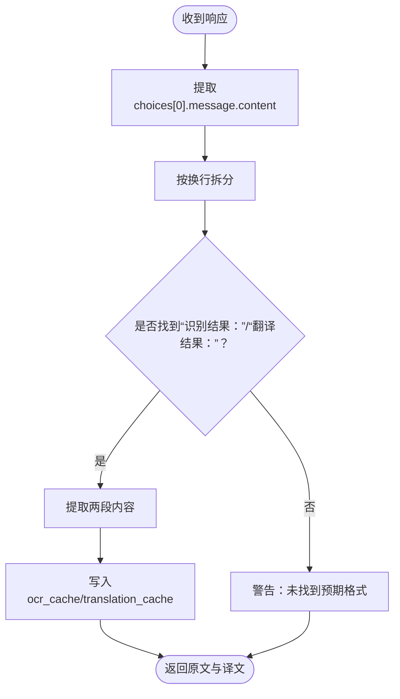
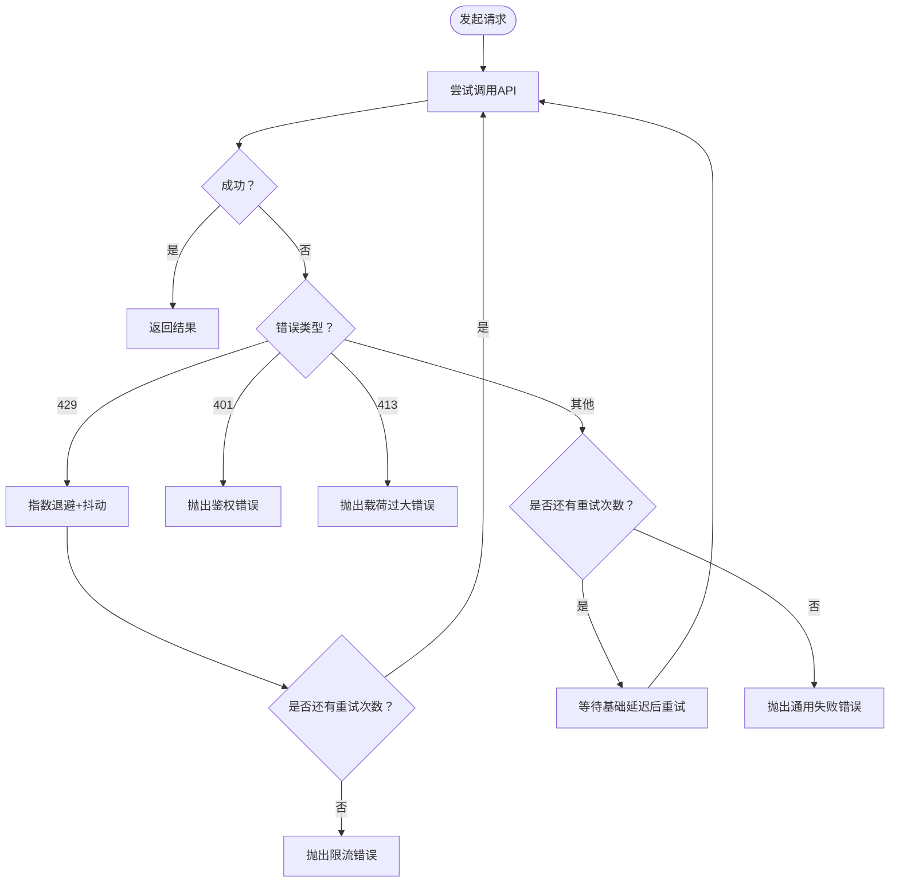
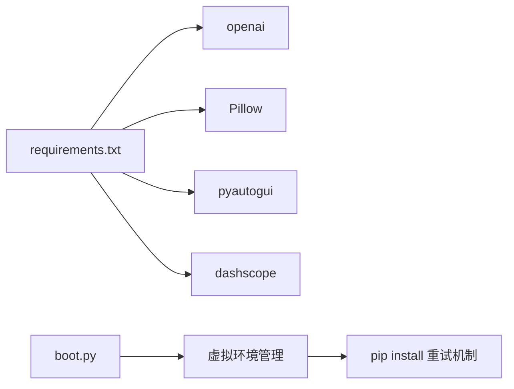

# 通义千问OCR API调用

<cite>
**本文引用的文件列表**
- [test/qwen_ocr.py](file://test/qwen_ocr.py)
- [screen_translator_with_qwen.py](file://screen_translator_with_qwen.py)
- [requirements.txt](file://requirements.txt)
- [boot.py](file://boot.py)
</cite>

## 目录
1. [简介](#简介)
2. [项目结构](#项目结构)
3. [核心组件](#核心组件)
4. [架构总览](#架构总览)
5. [详细组件分析](#详细组件分析)
6. [依赖关系分析](#依赖关系分析)
7. [性能与连接池](#性能与连接池)
8. [故障排查指南](#故障排查指南)
9. [结论](#结论)
10. [附录：最佳实践与示例路径](#附录最佳实践与示例路径)

## 简介
本文件面向使用 OpenAI 兼容客户端调用阿里云 DashScope（通义千问）进行 OCR 识别与翻译的开发者，系统梳理以下要点：
- OpenAI 客户端配置：base_url、API Key、连接池管理
- OCR 请求消息构造：model 选择、messages 数组格式、图像数据嵌入方式、提示词设计
- 响应解析：choices 遍历、content 提取、错误信息处理
- 限流与重试策略：指数退避、抖动、最大重试次数
- 完整调用流程与最佳实践建议

## 项目结构
仓库中与通义千问 OCR 相关的关键文件如下：
- test/qwen_ocr.py：最小可运行的 OCR 示例，演示 OpenAI 客户端初始化与多模态消息构造
- screen_translator_with_qwen.py：主程序，包含截图、压缩、Base64 编码、OCR+翻译一体化流程、重试与错误处理、UI 交互等
- requirements.txt：声明 openai 等依赖版本
- boot.py：项目启动器，负责虚拟环境管理与依赖安装（含重试机制）



图表来源
- [test/qwen_ocr.py:4-10](file://test/qwen_ocr.py#L4-L10)
- [screen_translator_with_qwen.py:1123-1171](file://screen_translator_with_qwen.py#L1123-L1171)
- [screen_translator_with_qwen.py:1177-1213](file://screen_translator_with_qwen.py#L1177-L1213)

章节来源
- [test/qwen_ocr.py:1-30](file://test/qwen_ocr.py#L1-L30)
- [screen_translator_with_qwen.py:1123-1213](file://screen_translator_with_qwen.py#L1123-L1213)
- [requirements.txt:12-16](file://requirements.txt#L12-L16)

## 核心组件
- OpenAI 客户端初始化
  - base_url 指向 DashScope 兼容模式端点
  - api_key 从本地 key.txt 读取或示例中直接传入
- OCR 请求构造
  - model 参数：示例中使用 qwen3.6-flash；可按需更换为其他支持视觉的模型
  - messages 数组：包含 image_url 类型（data URI Base64）和 text 类型（提示词）
- 响应解析
  - 取 response.choices[0].message.content
  - 按固定格式“识别结果：”“翻译结果：”分割并提取内容
- 重试与限流
  - 指数退避 + 随机抖动
  - 针对 429 限流错误特殊处理
  - 对 401/413 等错误给出明确提示
- 图像预处理
  - 对比度增强、灰度化、JPEG 压缩，降低传输体积
  - 转为 PNG 后 Base64 编码，以 data:image/png;base64, 前缀嵌入

章节来源
- [screen_translator_with_qwen.py:349-360](file://screen_translator_with_qwen.py#L349-L360)
- [screen_translator_with_qwen.py:1123-1171](file://screen_translator_with_qwen.py#L1123-L1171)
- [screen_translator_with_qwen.py:1177-1213](file://screen_translator_with_qwen.py#L1177-L1213)
- [screen_translator_with_qwen.py:1098-1122](file://screen_translator_with_qwen.py#L1098-L1122)
- [test/qwen_ocr.py:4-10](file://test/qwen_ocr.py#L4-L10)

## 架构总览
下图展示了从 UI 触发到 OCR 识别、翻译、结果展示的端到端流程。

```mermaid
sequenceDiagram
participant U as "用户"
participant UI as "主程序界面"
participant IMG as "截图与压缩模块"
participant ENC as "Base64 编码"
participant CLI as "OpenAI 客户端"
participant API as "DashScope 兼容模式API"
participant PARSE as "结果解析与缓存"
U->>UI : 点击“重新识别”
UI->>IMG : 截取区域并压缩
IMG-->>UI : 压缩后的图像对象
UI->>ENC : 保存为PNG并Base64编码
ENC-->>UI : data : image/png;base64,...
UI->>CLI : chat.completions.create(model,messages)
CLI->>API : 发送请求
API-->>CLI : 返回choices[0].message.content
CLI-->>UI : 原始文本
UI->>PARSE : 按“识别结果：/翻译结果：”解析
PARSE-->>UI : 原文与译文
UI-->>U : 显示翻译结果与原文
```

图表来源
- [screen_translator_with_qwen.py:927-1021](file://screen_translator_with_qwen.py#L927-L1021)
- [screen_translator_with_qwen.py:1123-1171](file://screen_translator_with_qwen.py#L1123-L1171)
- [screen_translator_with_qwen.py:1177-1213](file://screen_translator_with_qwen.py#L1177-L1213)

## 详细组件分析

### OpenAI 客户端配置与认证
- base_url 设置
  - 示例与主程序均将 base_url 设置为 DashScope 兼容模式端点，确保 OpenAI SDK 能正确路由到通义千问服务
- API Key 认证
  - 主程序从 key.txt 读取密钥并注入 OpenAI 客户端
  - 示例脚本可直接在初始化时传入 api_key
- 连接池管理
  - 当前代码未显式配置 OpenAI 底层 HTTP 连接池参数
  - 如需优化并发与复用，可在应用层通过会话级参数或第三方库进行扩展（见“性能与连接池”章节）

章节来源
- [screen_translator_with_qwen.py:349-360](file://screen_translator_with_qwen.py#L349-L360)
- [test/qwen_ocr.py:4-10](file://test/qwen_ocr.py#L4-L10)

### OCR 请求消息构造
- model 参数
  - 示例与主程序使用 qwen3.6-flash；可根据需求替换为其他支持视觉的模型
- messages 数组格式
  - 元素 role 为 user
  - content 为数组，包含：
    - type=image_url，image_url.url 为 data URI（data:image/png;base64,...）
    - type=text，text 为提示词，指导模型输出“识别结果：”“翻译结果：”两段内容
- 图像数据嵌入方式
  - 先压缩图像（对比度增强、灰度化、JPEG 压缩），再保存为 PNG 并 Base64 编码，拼接 data URI 前缀
- 系统提示词设计
  - 采用用户消息中的 text 字段作为提示词，要求保持原始格式顺序，并按指定格式返回识别与翻译结果



图表来源
- [screen_translator_with_qwen.py:1098-1122](file://screen_translator_with_qwen.py#L1098-L1122)
- [screen_translator_with_qwen.py:1123-1171](file://screen_translator_with_qwen.py#L1123-L1171)

章节来源
- [screen_translator_with_qwen.py:1098-1171](file://screen_translator_with_qwen.py#L1098-L1171)
- [test/qwen_ocr.py:12-28](file://test/qwen_ocr.py#L12-L28)

### 响应数据结构解析
- 成功路径
  - 取 response.choices[0].message.content
  - 按行拆分，定位“识别结果：”“翻译结果：”标记，提取对应段落内容
  - 将原文与译文写入缓存，便于后续翻译查询
- 错误处理
  - 捕获异常并记录日志
  - 根据错误字符串判断 401/413/429 等状态码语义，抛出带明确提示的异常



图表来源
- [screen_translator_with_qwen.py:1177-1213](file://screen_translator_with_qwen.py#L1177-L1213)

章节来源
- [screen_translator_with_qwen.py:1177-1213](file://screen_translator_with_qwen.py#L1177-L1213)

### 限流与重试机制
- 重试策略
  - 最大重试次数：5 次
  - 基础延迟：3 秒
  - 指数退避 + 随机抖动：delay = base_delay * (2 ** attempt) + random.uniform(0, 1)
- 限流处理
  - 检测到 429/Too Many Requests 时，执行指数退避并重试；达到上限则抛出明确错误
- 其他错误
  - 401 Unauthorized：提示检查 API Key
  - 413 Payload Too Large：提示缩小识别区域
  - 其他错误：统一包装为通用失败提示



图表来源
- [screen_translator_with_qwen.py:1144-1247](file://screen_translator_with_qwen.py#L1144-L1247)

章节来源
- [screen_translator_with_qwen.py:1144-1247](file://screen_translator_with_qwen.py#L1144-L1247)

### 完整调用示例与路径
- 最小示例
  - 参考示例脚本，展示 OpenAI 客户端初始化、多模态消息构造与结果打印
  - 路径：[test/qwen_ocr.py](file://test/qwen_ocr.py)
- 主程序集成
  - 截图→压缩→Base64→构建 messages→调用 API→解析结果→缓存→UI 展示
  - 关键路径：
    - 客户端初始化：[screen_translator_with_qwen.py:349-360](file://screen_translator_with_qwen.py#L349-L360)
    - 图像压缩与编码：[screen_translator_with_qwen.py:1098-1122](file://screen_translator_with_qwen.py#L1098-L1122)
    - 请求构造与发送：[screen_translator_with_qwen.py:1123-1171](file://screen_translator_with_qwen.py#L1123-L1171)
    - 结果解析与缓存：[screen_translator_with_qwen.py:1177-1213](file://screen_translator_with_qwen.py#L1177-L1213)
    - 重试与错误处理：[screen_translator_with_qwen.py:1144-1247](file://screen_translator_with_qwen.py#L1144-L1247)

章节来源
- [test/qwen_ocr.py:1-30](file://test/qwen_ocr.py#L1-L30)
- [screen_translator_with_qwen.py:349-360](file://screen_translator_with_qwen.py#L349-L360)
- [screen_translator_with_qwen.py:1098-1247](file://screen_translator_with_qwen.py#L1098-L1247)

## 依赖关系分析
- 运行时依赖
  - openai：用于与 DashScope 兼容模式通信
  - Pillow/pyautogui：用于截图与图像处理
  - dashscope：语音合成等能力（本项目主要使用 OpenAI 兼容接口）
- 启动器依赖管理
  - boot.py 负责自动创建/更新虚拟环境、安装依赖，并提供重试机制



图表来源
- [requirements.txt:12-16](file://requirements.txt#L12-L16)
- [boot.py:115-139](file://boot.py#L115-L139)

章节来源
- [requirements.txt:1-31](file://requirements.txt#L1-L31)
- [boot.py:115-139](file://boot.py#L115-L139)

## 性能与连接池
- 当前实现
  - 未显式配置 OpenAI 客户端的连接池参数
  - 通过图像压缩与灰度化减少 payload 大小，有助于降低网络开销
- 可扩展方向
  - 若需要更高并发与连接复用，可在应用层引入会话级连接池配置（例如基于 httpx/requests.Session 的封装），或在 OpenAI 客户端初始化时传入底层 HTTP 配置（取决于具体 SDK 版本支持）
  - 注意：当前仓库未提供此类配置，属于可选优化项

章节来源
- [screen_translator_with_qwen.py:1098-1122](file://screen_translator_with_qwen.py#L1098-L1122)

## 故障排查指南
- 常见问题与定位
  - 401 Unauthorized：检查 key.txt 中的 API Key 是否正确且有效
  - 413 Payload Too Large：识别区域过大导致请求体超限，请缩小区域或进一步压缩图像
  - 429 Too Many Requests：触发限流，已内置指数退避与抖动重试；仍失败则稍后再试
  - 客户端未初始化：确认 key.txt 存在且可读，客户端初始化成功
- 日志与调试
  - 主程序使用 logging 输出详细过程，包括截图、压缩、编码、请求、解析与错误信息
  - 可通过日志窗口查看实时日志，辅助定位问题

章节来源
- [screen_translator_with_qwen.py:1215-1247](file://screen_translator_with_qwen.py#L1215-L1247)
- [screen_translator_with_qwen.py:304-312](file://screen_translator_with_qwen.py#L304-L312)

## 结论
本项目基于 OpenAI 兼容客户端对接 DashScope（通义千问），实现了完整的 OCR 识别与翻译流程。其特点包括：
- 清晰的客户端配置与认证方式
- 规范的 messages 数组构造与 Base64 图像嵌入
- 稳健的重试与限流处理
- 完善的错误提示与日志记录
建议在后续迭代中按需引入连接池优化与更细粒度的超时控制，以提升高并发场景下的稳定性与吞吐。

## 附录：最佳实践与示例路径
- 客户端配置
  - 始终从安全位置（如 key.txt）读取 API Key，避免硬编码
  - 使用 DashScope 兼容模式 base_url，确保 SDK 正确路由
- 请求构造
  - 优先使用 data URI 嵌入 Base64 图像，避免外部 URL 依赖
  - 提示词应明确输出格式，便于后端稳定解析
- 图像预处理
  - 压缩与灰度化能有效减小 payload，提升成功率与速度
- 重试与限流
  - 使用指数退避 + 抖动，避免雪崩效应
  - 对 429/401/413 等错误给出明确的用户提示
- 示例路径
  - 最小示例：[test/qwen_ocr.py](file://test/qwen_ocr.py)
  - 主程序集成：[screen_translator_with_qwen.py](file://screen_translator_with_qwen.py)