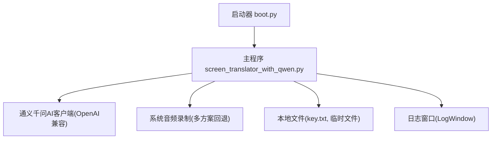
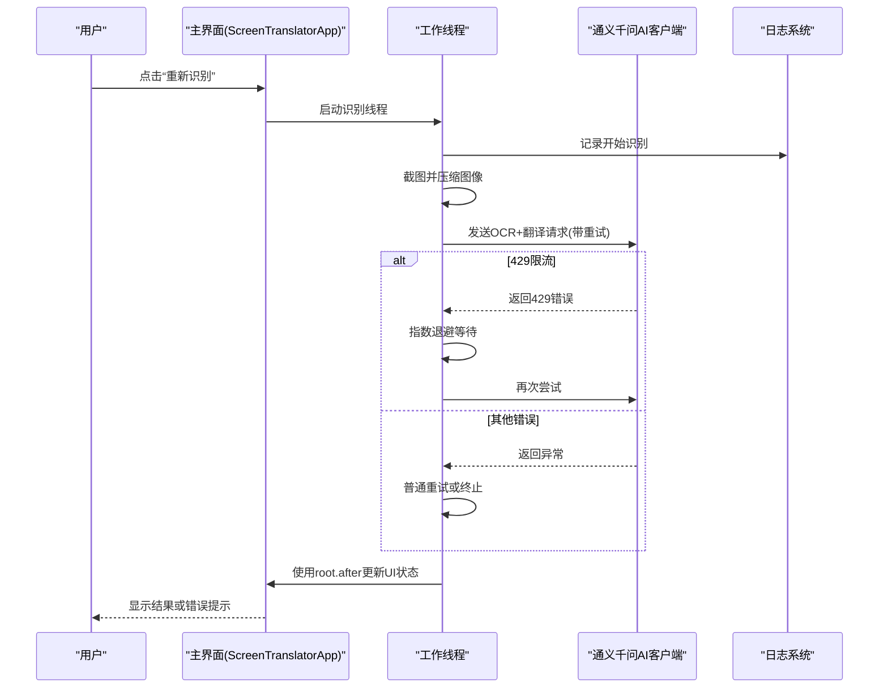
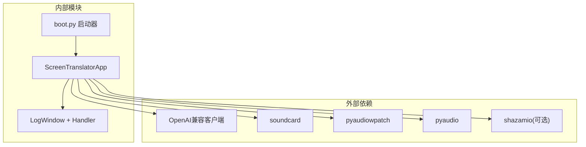
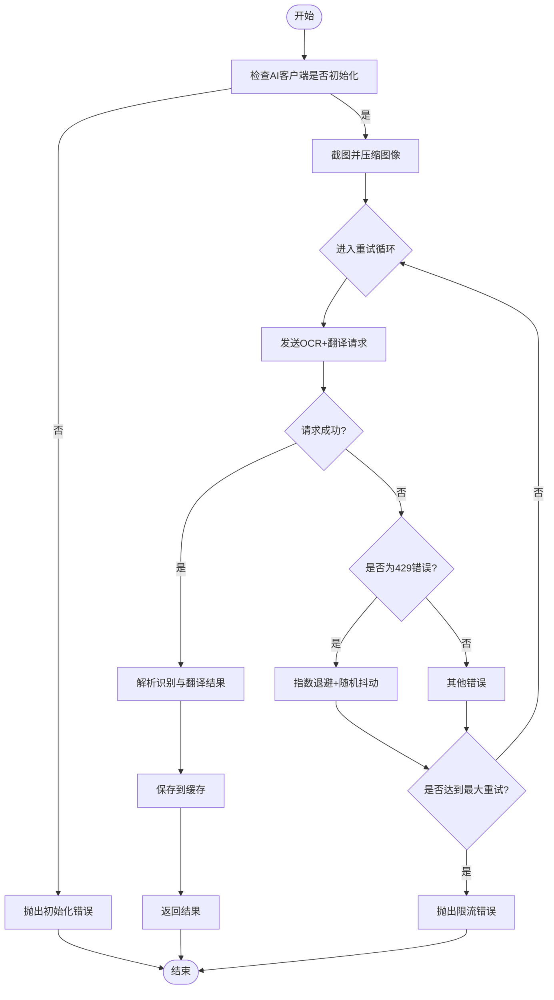

# 错误处理与异常恢复

<cite>
**本文引用的文件**   
- [screen_translator_with_qwen.py](file://screen_translator_with_qwen.py)
- [boot.py](file://boot.py)
</cite>

## 目录
1. [简介](#简介)
2. [项目结构](#项目结构)
3. [核心组件](#核心组件)
4. [架构总览](#架构总览)
5. [详细组件分析](#详细组件分析)
6. [依赖关系分析](#依赖关系分析)
7. [性能考量](#性能考量)
8. [故障排查指南](#故障排查指南)
9. [结论](#结论)
10. [附录](#附录)

## 简介
本文件聚焦于OCR识别流程中的错误处理与异常恢复策略，覆盖以下方面：
- 网络异常处理：连接超时、DNS解析失败、网络中断的捕获与重试机制
- API限制处理：429 Too Many Requests的错误码识别、指数退避算法实现与请求队列管理
- 图像质量问题处理：空图像检测、低质量图像警告与用户反馈机制
- 本地文件操作异常：key.txt读取失败、临时文件创建失败的处理策略
- 用户界面状态同步：按钮禁用、进度显示与错误提示的统一处理
- 完整的异常日志记录与调试信息收集方案

## 项目结构
本项目包含主程序与启动器两个关键入口：
- 主程序 screen_translator_with_qwen.py：负责屏幕截图、OCR识别、翻译、语音合成、听歌识曲等核心功能，并内置完善的错误处理与UI状态同步。
- 启动器 boot.py：负责虚拟环境校验、依赖安装（带重试）、日志轮转与后台启动目标程序。

图表来源
- [boot.py:255-279](file://boot.py#L255-L279)
- [screen_translator_with_qwen.py:339-360](file://screen_translator_with_qwen.py#L339-L360)

章节来源
- [boot.py:1-279](file://boot.py#L1-L279)
- [screen_translator_with_qwen.py:1-120](file://screen_translator_with_qwen.py#L1-L120)

## 核心组件
- 日志子系统：基于logging与自定义LogWindowHandler，将日志推送到线程安全的Queue并在独立窗口中滚动显示。
- OCR/翻译调用：对通义千问API进行图片+文本的多模态请求，内置最大重试次数与指数退避。
- UI状态同步：通过root.after在主线程更新UI，避免跨线程直接操作控件导致崩溃。
- 音频录制与播放：提供多种录音方案与播放控制，失败时给出清晰的诊断信息与解决建议。
- 启动器：自动检查/重建虚拟环境，pip安装带重试与增量更新，日志大小阈值清理。

章节来源
- [screen_translator_with_qwen.py:21-100](file://screen_translator_with_qwen.py#L21-L100)
- [screen_translator_with_qwen.py:302-312](file://screen_translator_with_qwen.py#L302-L312)
- [screen_translator_with_qwen.py:1123-1248](file://screen_translator_with_qwen.py#L1123-L1248)
- [screen_translator_with_qwen.py:1704-1723](file://screen_translator_with_qwen.py#L1704-L1723)
- [boot.py:115-139](file://boot.py#L115-L139)

## 架构总览
下图展示了从用户触发到最终结果返回的关键路径，以及错误处理与重试点的位置。

图表来源
- [screen_translator_with_qwen.py:927-1021](file://screen_translator_with_qwen.py#L927-L1021)
- [screen_translator_with_qwen.py:1123-1248](file://screen_translator_with_qwen.py#L1123-L1248)

## 详细组件分析

### 网络异常处理（连接超时、DNS解析失败、网络中断）
- 现状与能力
  - 当前代码未显式设置HTTP层超时参数；异常由底层库抛出并被统一捕获。
  - 在通用异常分支中执行固定间隔重试，适用于瞬时网络抖动。
- 改进建议
  - 为HTTP请求增加明确的connect_timeout与read_timeout，区分连接阶段与响应阶段异常。
  - 针对DNS解析失败与网络中断，可在外层捕获特定异常类型，采用更短的基础延迟与更少的重试次数，避免长时间阻塞。
  - 在重试前加入网络可达性快速探测（如ping或轻量HEAD请求），减少无效重试。
- 相关位置
  - 通用异常捕获与重试逻辑位于OCR/翻译请求循环中。

章节来源
- [screen_translator_with_qwen.py:1148-1248](file://screen_translator_with_qwen.py#L1148-L1248)

### API限制处理（429 Too Many Requests、指数退避、请求队列）
- 现状与能力
  - 明确识别429错误字符串，采用指数退避（基础延迟乘以2的幂次）并叠加随机抖动，避免雪崩效应。
  - 最大重试次数可配置，超过上限后抛出友好错误消息。
- 改进建议
  - 引入请求队列与令牌桶/漏桶限流器，按全局速率限制并发请求，降低429概率。
  - 支持服务端Retry-After头解析，优先遵循服务端的退避建议。
  - 为不同业务（OCR、翻译、对话）建立独立队列与优先级，避免相互影响。
- 相关位置
  - 429识别与指数退避实现位于OCR/翻译请求循环内。

章节来源
- [screen_translator_with_qwen.py:1224-1234](file://screen_translator_with_qwen.py#L1224-L1234)

### 图像质量问题处理（空图像检测、低质量图像警告、用户反馈）
- 现状与能力
  - 截图后进行对比度增强与灰度化，提升OCR鲁棒性。
  - 选择区域过小的情况下会提示用户重新选择，避免无意义请求。
- 改进建议
  - 增加空图像检测（尺寸为零或像素全黑/全白），提前中止并提示用户调整区域或光照。
  - 计算图像清晰度指标（如拉普拉斯方差），低于阈值时发出低质量警告，并提供“增强并重试”选项。
  - 在UI上以非阻塞方式展示质量评分与建议，提高用户体验。
- 相关位置
  - 图像增强与压缩逻辑、区域最小尺寸校验。

章节来源
- [screen_translator_with_qwen.py:1098-1122](file://screen_translator_with_qwen.py#L1098-L1122)
- [screen_translator_with_qwen.py:844-847](file://screen_translator_with_qwen.py#L844-L847)

### 本地文件操作异常（key.txt读取失败、临时文件创建失败）
- 现状与能力
  - key.txt读取失败时记录错误并返回空值，后续AI客户端初始化失败会被捕获并记录。
  - 临时文件写入失败会在相应模块中记录错误，部分场景提供回退方案（如多套录音方案）。
- 改进建议
  - 对key.txt提供交互式修复引导（打开编辑器或模板文件），并支持热重载密钥。
  - 临时文件写入失败时，自动切换到备用目录（如用户文档目录），并记录完整路径便于定位。
  - 对关键IO操作增加存在性与权限检查，提前发现潜在问题。
- 相关位置
  - key.txt读取与AI客户端初始化。
  - 临时文件写入与清理逻辑。

章节来源
- [screen_translator_with_qwen.py:339-360](file://screen_translator_with_qwen.py#L339-L360)
- [screen_translator_with_qwen.py:1923-1930](file://screen_translator_with_qwen.py#L1923-L1930)

### 用户界面状态同步（按钮禁用、进度显示、错误提示）
- 现状与能力
  - 所有耗时操作均在工作线程中执行，并通过root.after在主线程安全更新UI。
  - 识别/翻译进行中会禁用相关按钮、更新状态标签与译文窗口内容，确保一致的用户体验。
  - 提供中止交互标志位，允许用户在过程中取消任务。
- 改进建议
  - 引入统一的进度条与错误弹窗组件，集中管理状态切换与提示样式。
  - 对频繁UI更新进行节流，避免卡顿。
- 相关位置
  - 识别/翻译线程与UI更新回调。
  - 中止交互逻辑。

章节来源
- [screen_translator_with_qwen.py:939-1021](file://screen_translator_with_qwen.py#L939-L1021)
- [screen_translator_with_qwen.py:1034-1096](file://screen_translator_with_qwen.py#L1034-L1096)
- [screen_translator_with_qwen.py:1704-1723](file://screen_translator_with_qwen.py#L1704-L1723)

### 完整的异常日志记录与调试信息收集
- 现状与能力
  - 应用级日志通过logging.basicConfig输出到控制台与自定义LogWindowHandler，实时滚动显示。
  - 启动器boot.py将自身运行日志写入boot.log，并具备大小阈值清理能力。
  - 关键步骤均有INFO/DEBUG级别日志，错误路径记录ERROR/WARNING级别。
- 改进建议
  - 增加结构化日志字段（如请求ID、区域坐标、图像尺寸、重试次数），便于追踪与聚合分析。
  - 启用日志分级与采样策略，避免高频DEBUG造成I/O压力。
  - 提供一键导出日志与最近N条错误堆栈，辅助远程排障。
- 相关位置
  - 日志初始化与窗口处理器。
  - 启动器日志配置与轮转。

章节来源
- [screen_translator_with_qwen.py:302-312](file://screen_translator_with_qwen.py#L302-L312)
- [screen_translator_with_qwen.py:21-100](file://screen_translator_with_qwen.py#L21-L100)
- [boot.py:27-36](file://boot.py#L27-L36)
- [boot.py:40-52](file://boot.py#L40-L52)

## 依赖关系分析
- 外部依赖
  - OpenAI兼容客户端用于通义千问API调用。
  - 音频库（soundcard、pyaudiowpatch、pyaudio）用于系统音频录制，提供多方案回退。
  - 可选依赖（shazamio）用于听歌识曲，缺失时优雅降级。
- 内部耦合
  - 主程序与日志子系统松耦合，通过Queue传递日志消息。
  - UI与业务逻辑通过线程与事件循环解耦，避免阻塞主线程。

图表来源
- [screen_translator_with_qwen.py:314-336](file://screen_translator_with_qwen.py#L314-L336)
- [screen_translator_with_qwen.py:339-360](file://screen_translator_with_qwen.py#L339-L360)
- [boot.py:255-279](file://boot.py#L255-L279)

章节来源
- [screen_translator_with_qwen.py:314-336](file://screen_translator_with_qwen.py#L314-L336)
- [screen_translator_with_qwen.py:339-360](file://screen_translator_with_qwen.py#L339-L360)
- [boot.py:255-279](file://boot.py#L255-L279)

## 性能考量
- 图像预处理（对比度增强、灰度化、JPEG压缩）有助于减小传输体积，但会增加CPU开销。建议根据设备性能动态调整质量参数。
- 指数退避与随机抖动能有效缓解限流，但需平衡用户体验与成功率。可根据历史成功率动态调整基础延迟与最大重试次数。
- 日志输出频率过高会影响性能，建议在生产环境降低DEBUG级别或启用异步日志写入。

[本节为通用指导，不直接分析具体文件]

## 故障排查指南
- 无法识别或翻译
  - 检查key.txt是否存在且格式正确，确认AI客户端初始化是否成功。
  - 查看日志窗口中的错误信息，关注429、401、413等错误码。
  - 若频繁出现429，适当延长重试间隔或降低并发。
- 音频录制失败
  - 优先尝试pyaudiowpatch（支持蓝牙耳机），其次soundcard环形回录，最后pyaudio立体声混音。
  - 若所有方案失败，参考日志中提供的解决方案（启用立体声混音、更换扬声器设备等）。
- 临时文件写入失败
  - 检查临时目录权限与可用空间，必要时切换到用户文档目录。
- 启动器问题
  - 查看boot.log，确认虚拟环境是否有效、依赖是否安装成功。
  - 若requirements变更，启动器会自动增量更新或重建环境。

章节来源
- [screen_translator_with_qwen.py:339-360](file://screen_translator_with_qwen.py#L339-L360)
- [screen_translator_with_qwen.py:1798-1851](file://screen_translator_with_qwen.py#L1798-L1851)
- [boot.py:40-52](file://boot.py#L40-L52)
- [boot.py:210-225](file://boot.py#L210-L225)

## 结论
本项目在错误处理与异常恢复方面已具备良好基础：
- 实现了429限流的指数退避与随机抖动，提升了稳定性。
- 通过多线程与root.after保证了UI状态的一致性与响应性。
- 提供了多方案音频录制回退与详细的错误提示，便于用户自助排障。
- 日志系统完善，支持实时查看与文件持久化。

为进一步增强健壮性，建议补充网络层超时配置、请求队列与令牌桶限流、图像质量评估与用户引导、以及结构化日志与一键导出能力。

[本节为总结，不直接分析具体文件]

## 附录

### 关键流程图：OCR/翻译请求重试与退避

图表来源
- [screen_translator_with_qwen.py:1123-1248](file://screen_translator_with_qwen.py#L1123-L1248)