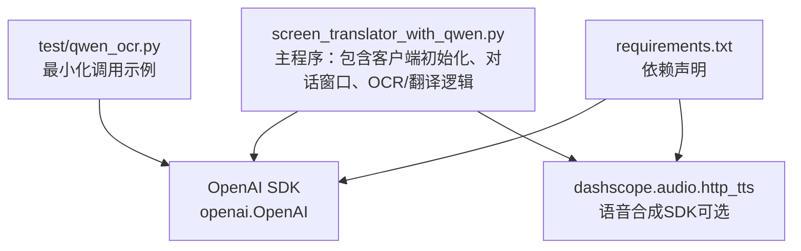
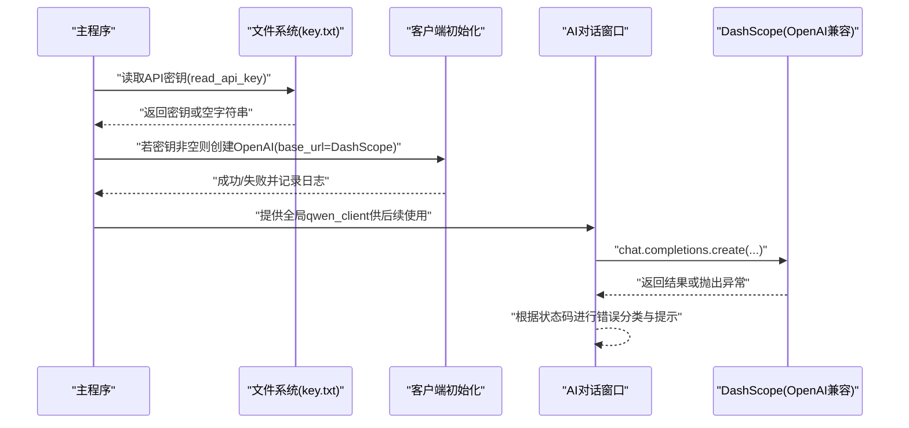
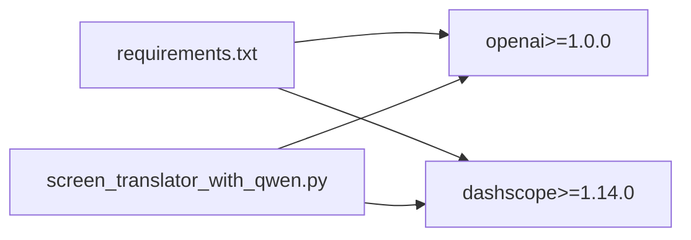

# 客户端配置与初始化

<cite>
**本文引用的文件**   
- [screen_translator_with_qwen.py](file://screen_translator_with_qwen.py)
- [requirements.txt](file://requirements.txt)
- [qwen_ocr.py](file://test/qwen_ocr.py)
</cite>

## 目录
1. [简介](#简介)
2. [项目结构](#项目结构)
3. [核心组件](#核心组件)
4. [架构总览](#架构总览)
5. [详细组件分析](#详细组件分析)
6. [依赖关系分析](#依赖关系分析)
7. [性能考虑](#性能考虑)
8. [故障排查指南](#故障排查指南)
9. [结论](#结论)
10. [附录](#附录)

## 简介
本文件聚焦于通义千问（DashScope）客户端的配置与初始化，围绕以下目标展开：
- OpenAI 客户端的初始化流程与关键参数说明
- API 密钥读取函数 read_api_key() 的实现原理、key.txt 文件格式要求与读写行为
- base_url 配置为阿里云 DashScope 兼容模式
- 连接超时与重试机制现状与建议
- 初始化失败的错误处理策略（异常捕获、日志记录、用户提示）
- 完整的使用示例路径与环境变量/配置文件管理建议与安全最佳实践
- 全局变量 qwen_client 的作用域管理与生命周期控制

## 项目结构
本项目采用单入口主程序 + 启动器的组织方式。与通义千问客户端相关的主要代码位于主程序中，测试用例中提供了最小化的调用示例。

图表来源
- [screen_translator_with_qwen.py:1-20](file://screen_translator_with_qwen.py#L1-L20)
- [requirements.txt:12-16](file://requirements.txt#L12-L16)
- [qwen_ocr.py:1-10](file://test/qwen_ocr.py#L1-L10)

章节来源
- [screen_translator_with_qwen.py:1-20](file://screen_translator_with_qwen.py#L1-L20)
- [requirements.txt:12-16](file://requirements.txt#L12-L16)

## 核心组件
- API 密钥读取：read_api_key()
- 客户端初始化：基于 openai.OpenAI 创建 qwen_client
- 全局变量：qwen_client 作为模块级共享实例
- 错误处理：初始化失败与运行时异常的捕获、日志与用户提示
- 依赖：openai、dashscope（语音合成）

章节来源
- [screen_translator_with_qwen.py:338-360](file://screen_translator_with_qwen.py#L338-L360)
- [screen_translator_with_qwen.py:302-312](file://screen_translator_with_qwen.py#L302-L312)
- [requirements.txt:12-16](file://requirements.txt#L12-L16)

## 架构总览
下图展示了从程序启动到客户端可用、再到对话请求的关键路径。

图表来源
- [screen_translator_with_qwen.py:338-360](file://screen_translator_with_qwen.py#L338-L360)
- [screen_translator_with_qwen.py:259-288](file://screen_translator_with_qwen.py#L259-L288)

## 详细组件分析

### API 密钥读取函数 read_api_key()
- 实现要点
  - 打开当前工作目录下的 key.txt，以 UTF-8 编码读取内容并去除首尾空白后返回
  - 若文件不存在或读取异常，记录错误日志并返回空字符串
- key.txt 格式要求
  - 纯文本，仅包含一行有效的 API Key（无多余空格或换行）
  - 编码应为 UTF-8
- 安全建议
  - 不要将 key.txt 提交到版本库
  - 在部署环境中通过环境变量注入密钥，并在应用层优先读取环境变量，再回退到 key.txt

章节来源
- [screen_translator_with_qwen.py:338-346](file://screen_translator_with_qwen.py#L338-L346)

### OpenAI 客户端初始化与配置
- 初始化流程
  - 先调用 read_api_key() 获取密钥
  - 若密钥存在，则使用 openai.OpenAI 构造客户端实例，设置：
    - api_key：来自 key.txt
    - base_url：设置为 DashScope 兼容端点
  - 初始化成功记录信息日志；失败记录错误日志
- 关键参数说明
  - api_key：用于鉴权
  - base_url：指向 DashScope 的 OpenAI 兼容接口
  - 其他参数（如连接超时、重试等）在当前初始化处未显式设置
- 参考示例
  - 测试脚本中给出了最小化初始化示例，便于理解参数组合

章节来源
- [screen_translator_with_qwen.py:348-360](file://screen_translator_with_qwen.py#L348-L360)
- [qwen_ocr.py:4-10](file://test/qwen_ocr.py#L4-L10)

### 全局变量 qwen_client 的作用域与生命周期
- 作用域
  - qwen_client 定义在模块顶层，属于模块级全局变量
  - AI 对话线程中使用 global 声明访问该全局变量
- 生命周期
  - 程序启动时尝试初始化；若失败则为 None
  - 对话前会检查是否为 None，避免空引用
  - 进程退出时由 Python 自动回收，无需显式关闭
- 线程安全
  - 读操作是只读的，通常安全
  - 如需动态切换密钥或重建客户端，应在外部加锁保护

章节来源
- [screen_translator_with_qwen.py:348-360](file://screen_translator_with_qwen.py#L348-L360)
- [screen_translator_with_qwen.py:259-264](file://screen_translator_with_qwen.py#L259-L264)

### 错误处理策略
- 初始化阶段
  - 捕获异常并记录错误日志，不中断程序启动
- 运行阶段（对话）
  - 捕获网络/鉴权异常，按错误码分类：
    - 401/Unauthorized：提示密钥无效或过期
    - 429/Too Many Requests：提示请求过于频繁
    - 其他错误：透传具体错误信息
  - 所有错误均通过 UI 消息反馈给用户，同时写入日志

章节来源
- [screen_translator_with_qwen.py:348-360](file://screen_translator_with_qwen.py#L348-L360)
- [screen_translator_with_qwen.py:280-288](file://screen_translator_with_qwen.py#L280-L288)

### 连接超时与重试机制
- 现状
  - 当前初始化未显式设置连接超时与重试参数
  - 对话调用也未显式设置超时
- 建议
  - 在 OpenAI 客户端构造时传入合理的超时参数（例如 connect/read 超时）
  - 对关键调用增加指数退避重试（针对 429 等可重试错误），并结合随机抖动降低雪崩风险
  - 注意：重试需幂等且避免重复计费

章节来源
- [screen_translator_with_qwen.py:348-360](file://screen_translator_with_qwen.py#L348-L360)
- [screen_translator_with_qwen.py:259-288](file://screen_translator_with_qwen.py#L259-L288)

### 完整使用示例与最佳实践
- 最小化示例路径
  - test/qwen_ocr.py：展示如何以 OpenAI 兼容模式调用 DashScope
- 环境变量与配置文件管理
  - 推荐优先级：环境变量 > 本地配置文件（如 key.txt）
  - 若使用环境变量，请在应用层优先读取，再回退到 key.txt
  - 生产环境建议使用密钥管理服务或容器密钥注入
- 安全最佳实践
  - 将 key.txt 加入 .gitignore
  - 不在日志中打印敏感信息
  - 限制文件权限，避免被其他用户读取

章节来源
- [qwen_ocr.py:1-10](file://test/qwen_ocr.py#L1-L10)
- [screen_translator_with_qwen.py:338-360](file://screen_translator_with_qwen.py#L338-L360)

## 依赖关系分析
- 运行时依赖
  - openai：用于构建 OpenAI 兼容客户端
  - dashscope：用于语音合成（可选功能）
- 依赖安装
  - requirements.txt 已声明版本范围，可通过 pip 安装

图表来源
- [requirements.txt:12-16](file://requirements.txt#L12-L16)
- [screen_translator_with_qwen.py:18-19](file://screen_translator_with_qwen.py#L18-L19)

章节来源
- [requirements.txt:12-16](file://requirements.txt#L12-L16)
- [screen_translator_with_qwen.py:18-19](file://screen_translator_with_qwen.py#L18-L19)

## 性能考虑
- 客户端复用：模块级 qwen_client 已在进程内复用，避免重复创建开销
- 网络优化：建议合理设置连接/读取超时，减少阻塞时间
- 重试策略：对限流类错误实施指数退避+随机抖动，避免瞬时拥塞
- 资源清理：音频相关文件在退出时清理，避免磁盘占用

[本节为通用指导，不涉及具体文件分析]

## 故障排查指南
- 常见问题
  - 未找到 key.txt 或内容为空：确认文件位置与编码，确保仅包含一行有效密钥
  - 401 Unauthorized：检查密钥是否有效、是否过期
  - 429 Too Many Requests：降低请求频率或等待一段时间后再试
  - 初始化失败：查看日志输出，确认网络连通性与 base_url 是否正确
- 定位方法
  - 查看控制台与日志窗口输出的错误信息
  - 核对 requirements.txt 中的 openai/dashscope 版本是否满足要求

章节来源
- [screen_translator_with_qwen.py:338-360](file://screen_translator_with_qwen.py#L338-L360)
- [screen_translator_with_qwen.py:280-288](file://screen_translator_with_qwen.py#L280-L288)
- [requirements.txt:12-16](file://requirements.txt#L12-L16)

## 结论
- 本项目通过 read_api_key() 从 key.txt 读取密钥，并使用 openai.OpenAI 以 DashScope 兼容模式初始化 qwen_client
- 初始化失败会被捕获并记录日志，不影响主程序继续运行
- 当前未显式配置连接超时与重试，建议在后续迭代中补充以提升稳定性
- 建议引入环境变量优先的密钥加载策略，并遵循安全最佳实践

[本节为总结性内容，不涉及具体文件分析]

## 附录
- 关键代码片段路径
  - API 密钥读取：[read_api_key:338-346](file://screen_translator_with_qwen.py#L338-L346)
  - 客户端初始化：[OpenAI 构造与日志:348-360](file://screen_translator_with_qwen.py#L348-L360)
  - 对话调用与错误处理：[对话线程与异常分支:259-288](file://screen_translator_with_qwen.py#L259-L288)
  - 最小化示例：[test/qwen_ocr.py:1-10](file://test/qwen_ocr.py#L1-L10)
  - 依赖清单：[requirements.txt:12-16](file://requirements.txt#L12-L16)