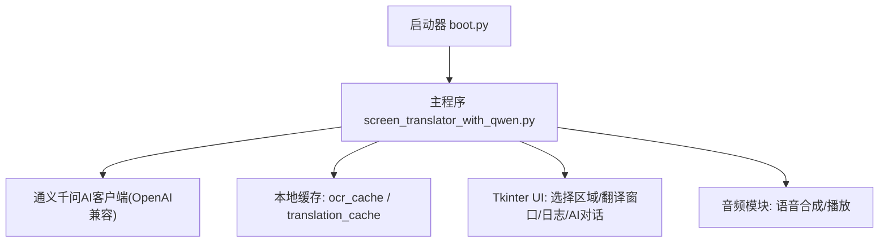
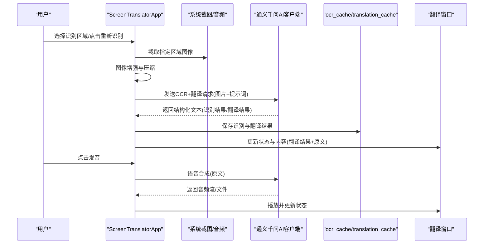
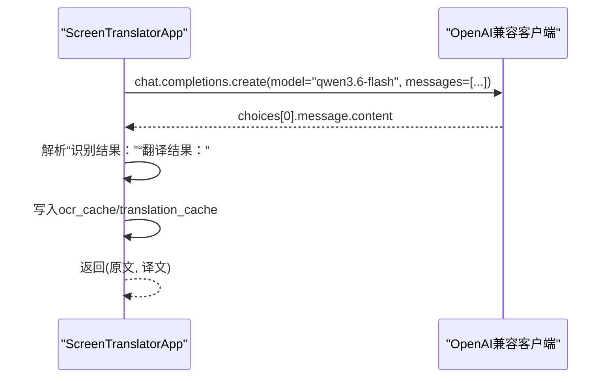
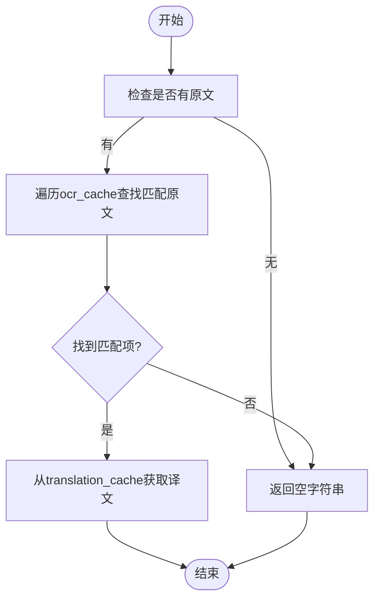
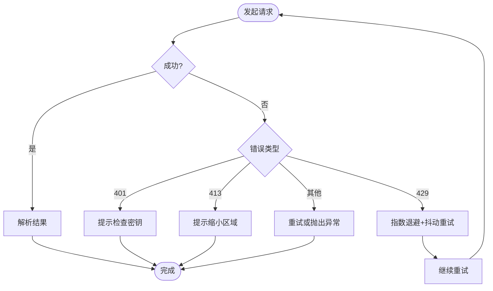
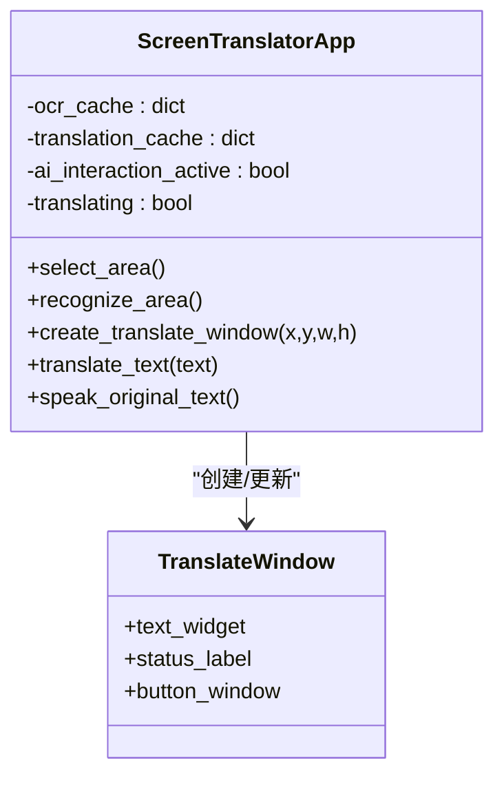
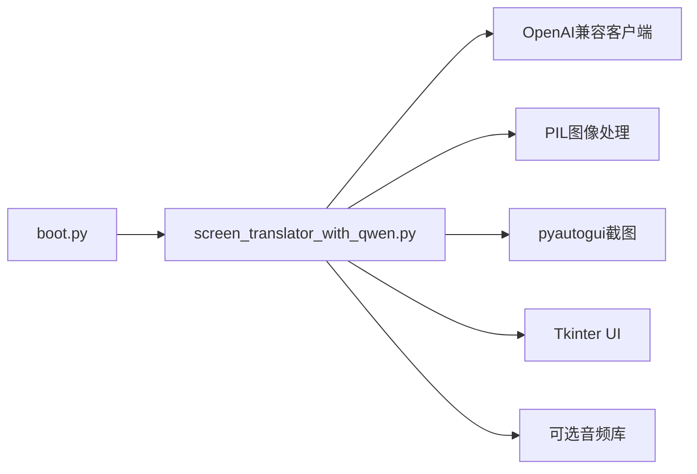

# 翻译服务接口

<cite>
**本文引用的文件**
- [screen_translator_with_qwen.py](file://screen_translator_with_qwen.py)
- [boot.py](file://boot.py)
</cite>

## 目录
1. [简介](#简介)
2. [项目结构](#项目结构)
3. [核心组件](#核心组件)
4. [架构总览](#架构总览)
5. [详细组件分析](#详细组件分析)
6. [依赖关系分析](#依赖关系分析)
7. [性能与内存优化](#性能与内存优化)
8. [故障排查指南](#故障排查指南)
9. [结论](#结论)
10. [附录：集成示例路径](#附录集成示例路径)

## 简介
本文件面向“屏幕翻译工具”的翻译服务接口，聚焦以下目标：
- 说明翻译API调用方法（文本格式化、语言检测、参数配置、响应处理）
- 深入解释翻译结果缓存机制 translation_cache 的设计（策略、键值映射、内存优化）
- 说明多语言支持的语言代码映射与自动语言检测逻辑
- 详细描述错误处理策略（网络超时、API限流、翻译质量问题）
- 提供完整代码示例路径，覆盖批量翻译、实时翻译、翻译历史记录
- 解释与OCR识别结果的关联处理和翻译窗口的显示逻辑

## 项目结构
本项目为桌面端屏幕翻译应用，主程序入口位于根目录，启动器负责虚拟环境管理与后台启动。核心功能集中在单文件应用中，包含OCR+翻译一体化流程、UI窗口管理、语音合成与播放等。

图表来源
- [boot.py:256-279](file://boot.py#L256-L279)
- [screen_translator_with_qwen.py:338-360](file://screen_translator_with_qwen.py#L338-L360)

章节来源
- [boot.py:1-279](file://boot.py#L1-L279)
- [screen_translator_with_qwen.py:1-120](file://screen_translator_with_qwen.py#L1-L120)

## 核心组件
- 启动器 boot.py
  - 自动检测唯一 .py 作为目标程序
  - 校验并维护虚拟环境，按需重建或增量更新依赖
  - 以无控制台方式后台启动目标程序
- 主程序 ScreenTranslatorApp
  - OCR+翻译一体化：截图→压缩→AI请求→解析→缓存→展示
  - 翻译窗口：可拖拽/缩放，显示翻译结果与原文
  - 全局快捷键：触发重新识别
  - AI对话窗口：基于同一AI客户端进行问答
  - 语音合成与播放：将原文转语音并支持变速

章节来源
- [boot.py:256-279](file://boot.py#L256-L279)
- [screen_translator_with_qwen.py:474-634](file://screen_translator_with_qwen.py#L474-L634)

## 架构总览
整体数据流：用户选择区域 → 截图与预处理 → 调用通义千问模型进行OCR与翻译 → 解析结构化输出 → 写入缓存 → 在翻译窗口中展示；同时支持独立文本翻译与语音合成。

图表来源
- [screen_translator_with_qwen.py:927-1021](file://screen_translator_with_qwen.py#L927-L1021)
- [screen_translator_with_qwen.py:1123-1248](file://screen_translator_with_qwen.py#L1123-L1248)
- [screen_translator_with_qwen.py:1442-1556](file://screen_translator_with_qwen.py#L1442-L1556)

## 详细组件分析

### 翻译API调用方法
- 文本格式化
  - OCR+翻译一体化：通过统一提示词要求模型按固定格式返回“识别结果：”和“翻译结果：”，便于后续解析。
  - 独立文本翻译：直接传入待翻译文本，由模型输出中文译文。
- 语言检测
  - 未显式实现语言检测步骤，采用“默认译为中文”的策略，由模型内部完成语言理解与转换。
- 翻译参数配置
  - 模型：qwen3.6-flash
  - 消息结构：包含图片URL与文本指令，或纯文本指令
  - 重试与退避：指数退避+随机抖动，最大重试次数5次
- 响应数据处理
  - 解析规则：按行扫描，定位“识别结果：”“翻译结果：”标记，提取其后内容并拼接多行
  - 异常分支：根据错误信息区分鉴权失败、请求体过大、频率限制等

章节来源
- [screen_translator_with_qwen.py:1123-1248](file://screen_translator_with_qwen.py#L1123-L1248)
- [screen_translator_with_qwen.py:1249-1266](file://screen_translator_with_qwen.py#L1249-L1266)

#### API调用时序图

图表来源
- [screen_translator_with_qwen.py:1152-1171](file://screen_translator_with_qwen.py#L1152-L1171)
- [screen_translator_with_qwen.py:1180-1213](file://screen_translator_with_qwen.py#L1180-L1213)

### 翻译结果缓存机制 translation_cache
- 设计目标
  - 避免重复翻译相同原文，提升响应速度并降低API调用成本
- 缓存策略
  - 双字典并行存储：ocr_cache 保存原文，translation_cache 保存对应译文
  - 键值映射：使用图像base64前100字符作为缓存键，保证键空间稳定且短小
  - 命中逻辑：当再次遇到相同原文时，从ocr_cache匹配到键后，直接从translation_cache取译文
- 内存优化
  - 键长度截断：仅使用前100字符，减少键大小
  - 进程内缓存：随应用生命周期存在，无需持久化
  - 建议扩展：可按需引入LRU淘汰或容量上限控制，防止长期运行导致内存增长

图表来源
- [screen_translator_with_qwen.py:1249-1266](file://screen_translator_with_qwen.py#L1249-L1266)
- [screen_translator_with_qwen.py:1207-1213](file://screen_translator_with_qwen.py#L1207-L1213)

章节来源
- [screen_translator_with_qwen.py:631-634](file://screen_translator_with_qwen.py#L631-L634)
- [screen_translator_with_qwen.py:1207-1213](file://screen_translator_with_qwen.py#L1207-L1213)
- [screen_translator_with_qwen.py:1249-1266](file://screen_translator_with_qwen.py#L1249-L1266)

### 多语言支持与自动语言检测
- 当前实现
  - 未显式实现语言检测与语言代码映射
  - 统一以“翻译为中文”为目标，利用模型能力自动理解源语言
- 可扩展方向
  - 增加语言检测步骤，返回语言代码（如 zh/en/ja），并在提示词中动态注入目标语言
  - 建立语言代码映射表，用于界面下拉选择与国际化展示

章节来源
- [screen_translator_with_qwen.py:1152-1171](file://screen_translator_with_qwen.py#L1152-L1171)

### 错误处理策略
- 网络与API错误
  - 鉴权失败（401/Unauthorized）：提示检查API密钥
  - 请求体过大（413/Payload Too Large）：提示缩小识别区域
  - 频率限制（429/Too Many Requests）：指数退避+随机抖动，达到最大重试后给出友好提示
  - 其他错误：记录日志并抛出明确异常信息
- 中止机制
  - 通过 ai_interaction_active 与 translating 标志位控制任务中断，避免长时间阻塞
- UI反馈
  - 状态标签实时更新，错误信息在翻译窗口与主界面同步显示

图表来源
- [screen_translator_with_qwen.py:1215-1248](file://screen_translator_with_qwen.py#L1215-L1248)
- [screen_translator_with_qwen.py:1704-1722](file://screen_translator_with_qwen.py#L1704-L1722)

章节来源
- [screen_translator_with_qwen.py:1215-1248](file://screen_translator_with_qwen.py#L1215-L1248)
- [screen_translator_with_qwen.py:1704-1722](file://screen_translator_with_qwen.py#L1704-L1722)

### 与OCR识别结果的关联处理与翻译窗口显示
- OCR与翻译一体化
  - 一次请求同时完成OCR与翻译，返回结构化文本，分别提取原文与译文
  - 原文与译文均写入缓存，供后续快速访问
- 翻译窗口显示逻辑
  - 窗口创建：根据用户选择的区域尺寸与位置生成无边框置顶窗口
  - 内容布局：第一行显示译文，第二行显示原文（以“原文: ”分隔）
  - 交互能力：支持拖拽、缩放、按钮悬浮（发音按钮）
  - 状态更新：识别中/翻译中/完成/失败等状态在窗口底部标签显示

图表来源
- [screen_translator_with_qwen.py:714-780](file://screen_translator_with_qwen.py#L714-L780)
- [screen_translator_with_qwen.py:994-1001](file://screen_translator_with_qwen.py#L994-L1001)
- [screen_translator_with_qwen.py:1063-1075](file://screen_translator_with_qwen.py#L1063-L1075)

章节来源
- [screen_translator_with_qwen.py:714-780](file://screen_translator_with_qwen.py#L714-L780)
- [screen_translator_with_qwen.py:994-1001](file://screen_translator_with_qwen.py#L994-L1001)
- [screen_translator_with_qwen.py:1063-1075](file://screen_translator_with_qwen.py#L1063-L1075)

### 批量翻译、实时翻译与翻译历史记录
- 批量翻译
  - 当前未提供专门的批量翻译入口。可通过循环调用 translate_text 或 recognize_with_qwen 实现，注意控制并发与重试策略
- 实时翻译
  - 结合全局快捷键与区域选择，可实现“按下快捷键即重新识别并翻译”的实时体验
- 翻译历史记录
  - 当前未实现持久化历史。可在翻译完成后将条目追加至列表或文件，并提供查看与回放功能

章节来源
- [screen_translator_with_qwen.py:1753-1788](file://screen_translator_with_qwen.py#L1753-L1788)
- [screen_translator_with_qwen.py:1022-1096](file://screen_translator_with_qwen.py#L1022-L1096)

## 依赖关系分析
- 外部依赖
  - OpenAI兼容客户端：用于通义千问API调用
  - Tkinter：GUI框架
  - PIL：图像处理（对比度增强、灰度转换、压缩）
  - pyautogui：屏幕截图
  - 可选：shazamio、soundcard、numpy、pyaudiowpatch、pyaudio（听歌识曲与音频录制）
- 内部耦合
  - ScreenTranslatorApp 集中管理OCR、翻译、缓存、UI与音频
  - 启动器 boot.py 与主程序解耦，仅负责环境与启动

图表来源
- [boot.py:256-279](file://boot.py#L256-L279)
- [screen_translator_with_qwen.py:1-20](file://screen_translator_with_qwen.py#L1-L20)
- [screen_translator_with_qwen.py:338-360](file://screen_translator_with_qwen.py#L338-L360)

章节来源
- [boot.py:1-279](file://boot.py#L1-L279)
- [screen_translator_with_qwen.py:1-20](file://screen_translator_with_qwen.py#L1-L20)

## 性能与内存优化
- 图像预处理
  - 增强对比度与灰度化有助于提高OCR准确率
  - JPEG压缩降低传输体积，但需平衡质量与延迟
- 缓存命中率
  - 使用图像前缀作为键可减少碰撞概率，但仍可能因分辨率变化导致键不同
  - 建议引入更稳定的指纹（如哈希）或规范化图像后再计算键
- 并发与线程
  - 识别与翻译均在子线程执行，避免阻塞UI
  - 建议增加队列与限流，避免短时间内大量请求触发限流
- 内存管理
  - 当前为进程内字典缓存，建议增加容量上限与LRU淘汰策略
  - 清理临时文件（如cosyvoice.wav）已在退出时注册清理函数

章节来源
- [screen_translator_with_qwen.py:1098-1122](file://screen_translator_with_qwen.py#L1098-L1122)
- [screen_translator_with_qwen.py:363-371](file://screen_translator_with_qwen.py#L363-L371)

## 故障排查指南
- 常见问题
  - API密钥无效或过期：检查 key.txt 中的密钥是否正确
  - 请求体过大：缩小识别区域或降低图像质量
  - 请求过于频繁：等待数分钟后重试，或调整重试间隔
  - 无法录音（听歌识曲）：确认设备与驱动，启用立体声混音或安装 pyaudiowpatch
- 定位方法
  - 打开日志窗口查看详细日志
  - 关注状态标签的错误提示
  - 检查翻译窗口内容与状态

章节来源
- [screen_translator_with_qwen.py:1215-1248](file://screen_translator_with_qwen.py#L1215-L1248)
- [screen_translator_with_qwen.py:2403-2411](file://screen_translator_with_qwen.py#L2403-L2411)

## 结论
该翻译服务接口以“OCR+翻译一体化”为核心，结合缓存机制与健壮的错误处理，提供了高效的屏幕翻译体验。未来可在语言检测、批量翻译、历史记录与缓存淘汰等方面进一步增强，以满足更复杂的使用场景。

## 附录：集成示例路径
- 启动器与依赖管理
  - [boot.py:256-279](file://boot.py#L256-L279)
- 主程序初始化与AI客户端
  - [screen_translator_with_qwen.py:338-360](file://screen_translator_with_qwen.py#L338-L360)
- OCR与翻译一体化流程
  - [screen_translator_with_qwen.py:927-1021](file://screen_translator_with_qwen.py#L927-L1021)
  - [screen_translator_with_qwen.py:1123-1248](file://screen_translator_with_qwen.py#L1123-L1248)
- 翻译窗口创建与显示
  - [screen_translator_with_qwen.py:714-780](file://screen_translator_with_qwen.py#L714-L780)
  - [screen_translator_with_qwen.py:994-1001](file://screen_translator_with_qwen.py#L994-L1001)
  - [screen_translator_with_qwen.py:1063-1075](file://screen_translator_with_qwen.py#L1063-L1075)
- 缓存机制
  - [screen_translator_with_qwen.py:631-634](file://screen_translator_with_qwen.py#L631-L634)
  - [screen_translator_with_qwen.py:1207-1213](file://screen_translator_with_qwen.py#L1207-L1213)
  - [screen_translator_with_qwen.py:1249-1266](file://screen_translator_with_qwen.py#L1249-L1266)
- 错误处理与中止
  - [screen_translator_with_qwen.py:1215-1248](file://screen_translator_with_qwen.py#L1215-L1248)
  - [screen_translator_with_qwen.py:1704-1722](file://screen_translator_with_qwen.py#L1704-L1722)
- 全局快捷键与实时体验
  - [screen_translator_with_qwen.py:1753-1788](file://screen_translator_with_qwen.py#L1753-L1788)
- 语音合成与播放
  - [screen_translator_with_qwen.py:1442-1556](file://screen_translator_with_qwen.py#L1442-L1556)