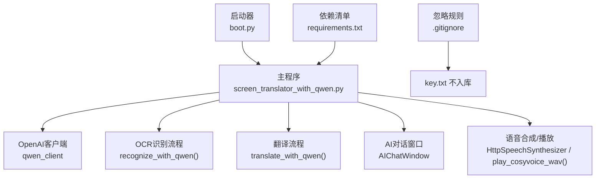
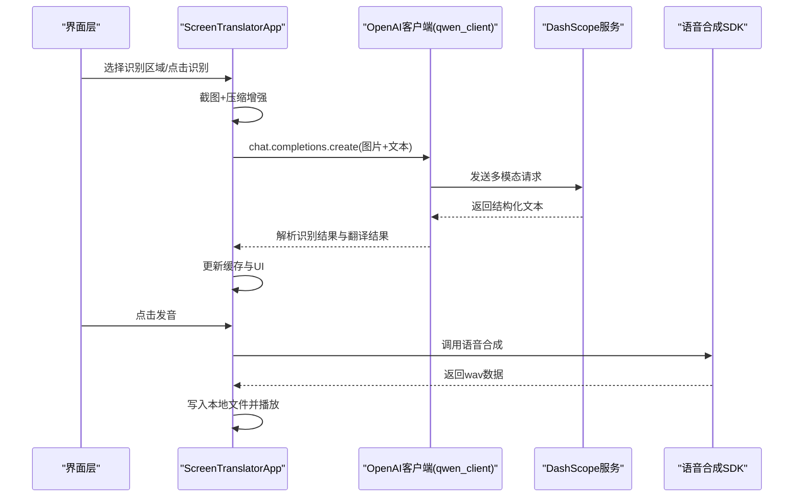
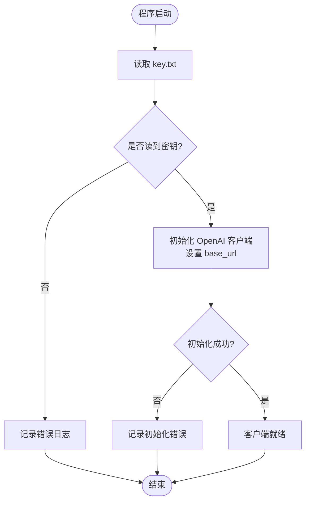
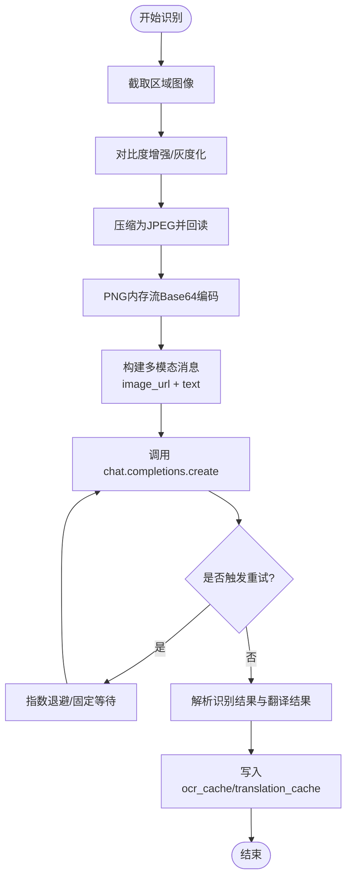
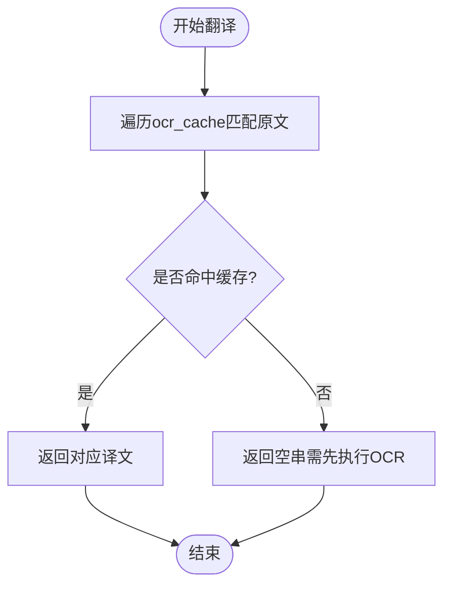
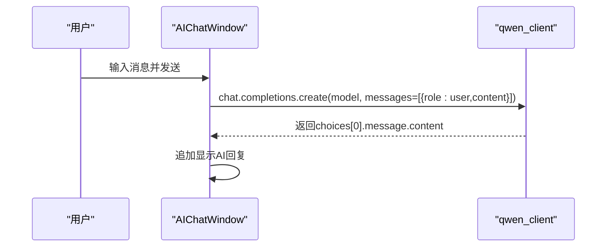
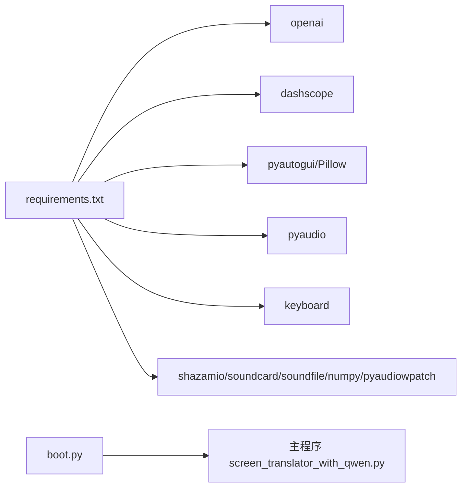

# 通义千问API集成

<cite>
**本文引用的文件**   
- [screen_translator_with_qwen.py](file://screen_translator_with_qwen.py)
- [test/qwen_ocr.py](file://test/qwen_ocr.py)
- [boot.py](file://boot.py)
- [requirements.txt](file://requirements.txt)
- [.gitignore](file://.gitignore)
</cite>

## 目录
1. [简介](#简介)
2. [项目结构](#项目结构)
3. [核心组件](#核心组件)
4. [架构总览](#架构总览)
5. [详细组件分析](#详细组件分析)
6. [依赖关系分析](#依赖关系分析)
7. [性能与优化建议](#性能与优化建议)
8. [故障排查指南](#故障排查指南)
9. [结论](#结论)
10. [附录：使用示例与最佳实践](#附录使用示例与最佳实践)

## 简介
本项目是一个基于桌面GUI的屏幕翻译工具，集成了通义千问（DashScope兼容OpenAI接口）的OCR识别、文本翻译与对话能力，并支持语音合成与播放。文档聚焦于以下方面：
- OpenAI客户端初始化配置（API密钥读取、base_url设置、连接参数）
- OCR识别流程（图像预处理、base64编码、请求构造、响应解析）
- 翻译服务调用（文本格式化、语言检测思路、结果缓存机制）
- AI对话接口（消息历史管理、上下文维护、错误处理）
- 完整调用场景示例路径（异常处理、重试机制、性能优化）
- API密钥安全存储与管理（key.txt读写与权限控制建议）

## 项目结构
- 主程序入口与核心逻辑集中在单文件中，包含UI、OCR、翻译、对话、音频等模块。
- 启动器负责虚拟环境管理与后台运行目标脚本。
- 测试用例提供最小化的OCR/对话示例。
- 依赖清单明确第三方库版本要求。
- .gitignore排除敏感文件（如key.txt）。

图表来源
- [screen_translator_with_qwen.py:338-360](file://screen_translator_with_qwen.py#L338-L360)
- [screen_translator_with_qwen.py:1123-1248](file://screen_translator_with_qwen.py#L1123-L1248)
- [screen_translator_with_qwen.py:1249-1266](file://screen_translator_with_qwen.py#L1249-L1266)
- [screen_translator_with_qwen.py:101-300](file://screen_translator_with_qwen.py#L101-L300)
- [boot.py:255-279](file://boot.py#L255-L279)
- [requirements.txt:12-16](file://requirements.txt#L12-L16)
- [.gitignore:6-9](file://.gitignore#L6-L9)

章节来源
- [screen_translator_with_qwen.py:1-120](file://screen_translator_with_qwen.py#L1-L120)
- [boot.py:1-40](file://boot.py#L1-L40)
- [requirements.txt:1-31](file://requirements.txt#L1-L31)
- [.gitignore:1-44](file://.gitignore#L1-L44)

## 核心组件
- OpenAI客户端初始化
  - 从本地 key.txt 读取API密钥，构造OpenAI实例，base_url指向DashScope兼容模式。
  - 若未找到密钥或初始化失败，记录日志并置空客户端，后续功能将提示用户检查密钥。
- OCR识别与翻译一体化
  - 截图区域后压缩增强，转PNG内存流，base64编码为data URI，通过多模态消息发送给模型。
  - 返回结构化文本，按“识别结果：”和“翻译结果：”分段解析，分别保存至ocr_cache与translation_cache。
- 翻译服务调用
  - 当前实现优先从缓存中匹配原文获取翻译结果；如需独立翻译可复用同一请求构造方法。
- AI对话接口
  - 独立的对话窗口类，发送user消息，接收model回复，显示在聊天区；具备基础错误分类提示。
- 语音合成与播放
  - 调用DashScope语音合成SDK生成wav，本地播放并可变速。

章节来源
- [screen_translator_with_qwen.py:338-360](file://screen_translator_with_qwen.py#L338-L360)
- [screen_translator_with_qwen.py:1098-1122](file://screen_translator_with_qwen.py#L1098-L1122)
- [screen_translator_with_qwen.py:1123-1248](file://screen_translator_with_qwen.py#L1123-L1248)
- [screen_translator_with_qwen.py:1249-1266](file://screen_translator_with_qwen.py#L1249-L1266)
- [screen_translator_with_qwen.py:101-300](file://screen_translator_with_qwen.py#L101-L300)
- [screen_translator_with_qwen.py:1442-1556](file://screen_translator_with_qwen.py#L1442-L1556)

## 架构总览
系统采用“前端GUI + 后端AI服务”的架构。GUI负责交互、截图、状态展示；AI服务通过OpenAI兼容接口提供OCR、翻译与对话能力；语音合成由DashScope SDK完成。

图表来源
- [screen_translator_with_qwen.py:927-1021](file://screen_translator_with_qwen.py#L927-L1021)
- [screen_translator_with_qwen.py:1123-1248](file://screen_translator_with_qwen.py#L1123-L1248)
- [screen_translator_with_qwen.py:1442-1556](file://screen_translator_with_qwen.py#L1442-L1556)

## 详细组件分析

### OpenAI客户端初始化与配置
- 密钥读取
  - 从工作目录下的 key.txt 读取字符串，去除首尾空白。
  - 若读取失败，记录错误日志并返回空串。
- 客户端创建
  - 使用 openai.OpenAI，传入 api_key 与 base_url（DashScope兼容模式）。
  - 成功则记录日志，失败则记录错误并保留客户端为空。
- 关键位置参考
  - 密钥读取与客户端初始化：[screen_translator_with_qwen.py:338-360](file://screen_translator_with_qwen.py#L338-L360)
  - 最小化示例（test）：[test/qwen_ocr.py:1-30](file://test/qwen_ocr.py#L1-L30)

图表来源
- [screen_translator_with_qwen.py:338-360](file://screen_translator_with_qwen.py#L338-L360)

章节来源
- [screen_translator_with_qwen.py:338-360](file://screen_translator_with_qwen.py#L338-L360)
- [test/qwen_ocr.py:1-30](file://test/qwen_ocr.py#L1-L30)

### OCR识别功能实现
- 图像预处理
  - 对比度增强、灰度转换、JPEG压缩（质量可调），再回读为PIL Image，减少传输体积。
- Base64编码与请求构造
  - 将PNG内存流进行base64编码，拼接为 data:image/png;base64,... 的URL格式，放入多模态消息体。
- 请求与重试
  - 最大重试次数与基础延迟可配置；对429错误采用指数退避加随机抖动；其他错误固定间隔重试。
- 响应解析
  - 按“识别结果：”和“翻译结果：”两个段落分割，提取对应内容，合并多行文本。
- 缓存策略
  - 以图像前若干字符作为键，分别保存原文与译文到ocr_cache与translation_cache。
- 关键位置参考
  - 压缩与预处理：[screen_translator_with_qwen.py:1098-1122](file://screen_translator_with_qwen.py#L1098-L1122)
  - OCR与翻译一体化调用与解析：[screen_translator_with_qwen.py:1123-1248](file://screen_translator_with_qwen.py#L1123-L1248)

图表来源
- [screen_translator_with_qwen.py:1098-1122](file://screen_translator_with_qwen.py#L1098-L1122)
- [screen_translator_with_qwen.py:1123-1248](file://screen_translator_with_qwen.py#L1123-L1248)

章节来源
- [screen_translator_with_qwen.py:1098-1122](file://screen_translator_with_qwen.py#L1098-L1122)
- [screen_translator_with_qwen.py:1123-1248](file://screen_translator_with_qwen.py#L1123-L1248)

### 翻译服务调用方法
- 当前实现
  - translate_with_qwen 优先从缓存中查找匹配的原文，返回对应译文；若无缓存则返回空串。
- 语言检测思路
  - 当前未显式调用语言检测API；可在prompt中指示模型输出源语言，或在本地做简单启发式判断后再组织prompt。
- 结果缓存机制
  - 以图像前若干字符作为键，同时保存原文与译文，确保一致性与快速命中。
- 关键位置参考
  - 缓存读取：[screen_translator_with_qwen.py:1249-1266](file://screen_translator_with_qwen.py#L1249-L1266)
  - 缓存写入（OCR流程内）：[screen_translator_with_qwen.py:1207-1213](file://screen_translator_with_qwen.py#L1207-L1213)

图表来源
- [screen_translator_with_qwen.py:1249-1266](file://screen_translator_with_qwen.py#L1249-L1266)
- [screen_translator_with_qwen.py:1207-1213](file://screen_translator_with_qwen.py#L1207-L1213)

章节来源
- [screen_translator_with_qwen.py:1249-1266](file://screen_translator_with_qwen.py#L1249-L1266)
- [screen_translator_with_qwen.py:1207-1213](file://screen_translator_with_qwen.py#L1207-L1213)

### AI对话接口使用
- 消息历史与上下文
  - 当前对话窗口每次仅发送一条user消息；可扩展为维护messages列表，追加system/user/assistant角色以实现上下文对话。
- 错误处理策略
  - 捕获401/429等常见错误码，转换为友好提示；其他错误统一包装并提示。
- 关键位置参考
  - 对话窗口类与发送逻辑：[screen_translator_with_qwen.py:101-300](file://screen_translator_with_qwen.py#L101-L300)

图表来源
- [screen_translator_with_qwen.py:259-299](file://screen_translator_with_qwen.py#L259-L299)

章节来源
- [screen_translator_with_qwen.py:101-300](file://screen_translator_with_qwen.py#L101-L300)

### 语音合成与播放
- 语音合成
  - 调用DashScope HttpSpeechSynthesizer，指定模型、音色、采样率与流式返回，收集音频块并落盘为wav。
- 本地播放
  - 使用pyaudio打开设备，分块写入流；支持变速播放（线性插值重采样）。
- 关键位置参考
  - 合成与播放：[screen_translator_with_qwen.py:1442-1556](file://screen_translator_with_qwen.py#L1442-L1556)
  - 播放函数：[screen_translator_with_qwen.py:372-473](file://screen_translator_with_qwen.py#L372-L473)

章节来源
- [screen_translator_with_qwen.py:1442-1556](file://screen_translator_with_qwen.py#L1442-L1556)
- [screen_translator_with_qwen.py:372-473](file://screen_translator_with_qwen.py#L372-L473)

## 依赖关系分析
- 运行时依赖
  - openai：用于通义千问兼容接口访问。
  - dashscope：语音合成SDK。
  - pyautogui/Pillow：截图与图像处理。
  - pyaudio：音频播放。
  - keyboard：全局快捷键。
  - shazamio/soundcard/soundfile/numpy/pyaudiowpatch：听歌识曲与系统音频录制（可选）。
- 启动器
  - boot.py自动检测唯一主脚本、管理venv、增量更新依赖、后台启动无控制台窗口。

图表来源
- [requirements.txt:12-31](file://requirements.txt#L12-L31)
- [boot.py:255-279](file://boot.py#L255-L279)

章节来源
- [requirements.txt:1-31](file://requirements.txt#L1-L31)
- [boot.py:1-40](file://boot.py#L1-L40)

## 性能与优化建议
- 图像尺寸与质量
  - 适当降低quality与分辨率可减少网络传输与解析时间；当前已做对比度增强与灰度化，有助于提升识别效率。
- 重试与退避
  - 对429错误采用指数退避+抖动，避免雪崩；可根据业务容忍度调整max_retries与base_delay。
- 缓存命中率
  - 使用图像前若干字符作为缓存键存在碰撞风险，建议改用更稳定的指纹（如SHA256前缀）以提升命中率与一致性。
- 并发与线程
  - 识别/翻译/对话均在新线程执行，避免阻塞UI；注意线程间共享状态（如ai_interaction_active）的原子性。
- 网络与超时
  - 建议在OpenAI客户端层面设置connect/read超时，防止长时间挂起。

[本节为通用指导，无需源码引用]

## 故障排查指南
- 无法读取API密钥
  - 确认工作目录下存在 key.txt，且内容为有效密钥；查看日志中的读取错误信息。
- 客户端初始化失败
  - 检查网络连接与base_url是否正确；查看初始化错误日志。
- 401 未授权
  - 密钥无效或过期，请更换有效的DashScope API密钥。
- 429 请求过于频繁
  - 等待一段时间后重试；可适当增大重试间隔或降低调用频率。
- 413 请求体过大
  - 缩小识别区域或降低图像质量，以减少payload大小。
- 语音合成失败
  - 检查DashScope SDK安装与网络；确认文本长度限制与音色可用性。

章节来源
- [screen_translator_with_qwen.py:338-360](file://screen_translator_with_qwen.py#L338-L360)
- [screen_translator_with_qwen.py:1215-1248](file://screen_translator_with_qwen.py#L1215-L1248)
- [screen_translator_with_qwen.py:280-299](file://screen_translator_with_qwen.py#L280-L299)
- [screen_translator_with_qwen.py:1442-1556](file://screen_translator_with_qwen.py#L1442-L1556)

## 结论
本集成方案通过DashScope兼容OpenAI接口，实现了屏幕区域的OCR识别、翻译与对话能力，并在GUI层提供了良好的交互体验。通过合理的图像预处理、重试与缓存策略，系统在稳定性与性能之间取得平衡。后续可进一步扩展上下文对话、语言检测与更健壮的缓存键策略。

[本节为总结，无需源码引用]

## 附录：使用示例与最佳实践

### 代码示例路径
- 最小化OCR/对话示例（含OpenAI客户端初始化与多模态请求）
  - [test/qwen_ocr.py:1-30](file://test/qwen_ocr.py#L1-L30)
- 主程序中OCR与翻译一体化调用
  - [screen_translator_with_qwen.py:1123-1248](file://screen_translator_with_qwen.py#L1123-L1248)
- 主程序中翻译缓存读取
  - [screen_translator_with_qwen.py:1249-1266](file://screen_translator_with_qwen.py#L1249-L1266)
- 主程序中AI对话调用
  - [screen_translator_with_qwen.py:259-299](file://screen_translator_with_qwen.py#L259-L299)
- 语音合成与播放
  - [screen_translator_with_qwen.py:1442-1556](file://screen_translator_with_qwen.py#L1442-L1556)
  - [screen_translator_with_qwen.py:372-473](file://screen_translator_with_qwen.py#L372-L473)

### 异常处理与重试机制
- 401/429/413等错误码的分类处理与提示
  - [screen_translator_with_qwen.py:1215-1248](file://screen_translator_with_qwen.py#L1215-L1248)
- 对话窗口的错误提示
  - [screen_translator_with_qwen.py:280-299](file://screen_translator_with_qwen.py#L280-L299)

### 性能优化技巧
- 图像预处理与压缩
  - [screen_translator_with_qwen.py:1098-1122](file://screen_translator_with_qwen.py#L1098-L1122)
- 线程化非阻塞调用
  - [screen_translator_with_qwen.py:927-1021](file://screen_translator_with_qwen.py#L927-L1021)

### API密钥的安全存储与管理
- 读取方式
  - 从工作目录下的 key.txt 读取，去除空白后作为api_key传入OpenAI客户端。
  - 参考：[screen_translator_with_qwen.py:338-360](file://screen_translator_with_qwen.py#L338-L360)
- 安全建议
  - 将 key.txt 加入版本控制忽略列表，避免泄露。
  - 参考：[.gitignore:6-9](file://.gitignore#L6-L9)
  - 生产环境建议使用环境变量或密钥管理服务，而非明文文件。
  - 对key.txt设置文件系统级权限（例如仅当前用户可读写）。
  - 定期轮换密钥，并在日志中避免打印敏感信息。

章节来源
- [screen_translator_with_qwen.py:338-360](file://screen_translator_with_qwen.py#L338-L360)
- [.gitignore:6-9](file://.gitignore#L6-L9)