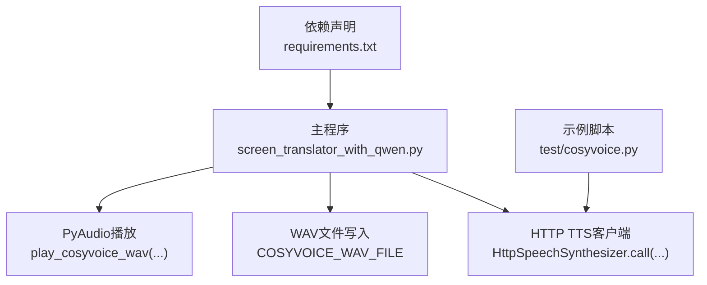
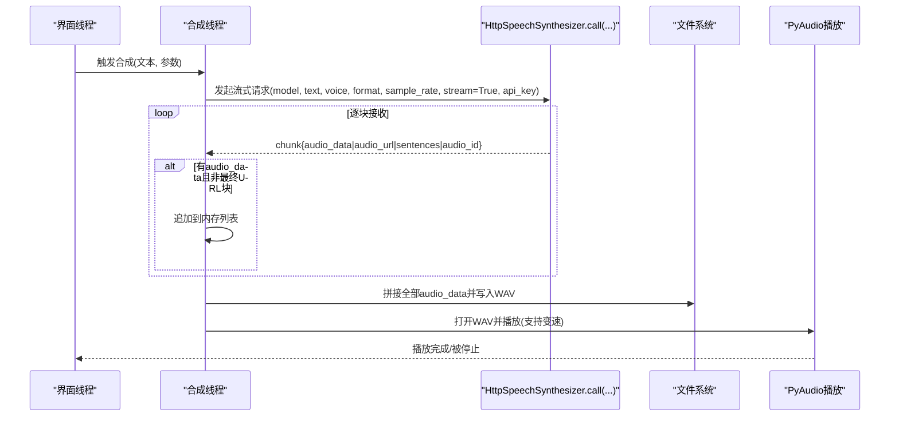
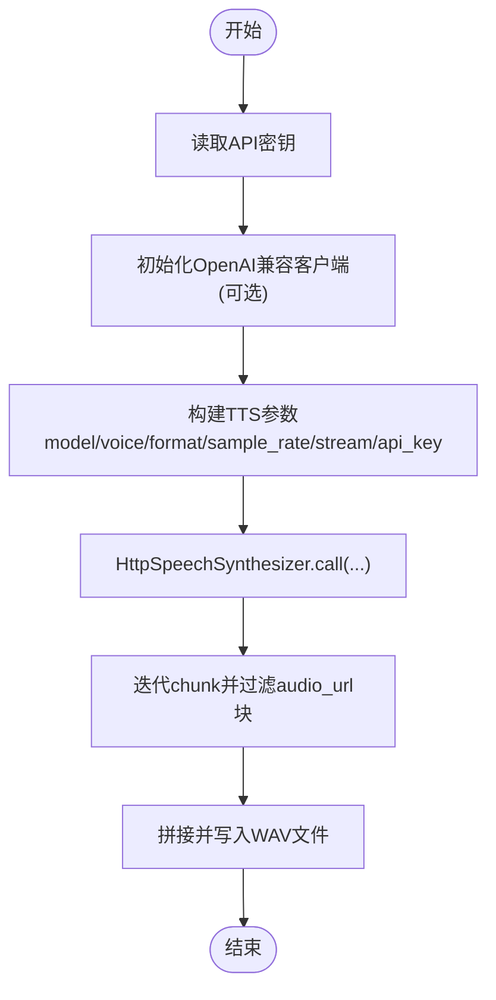
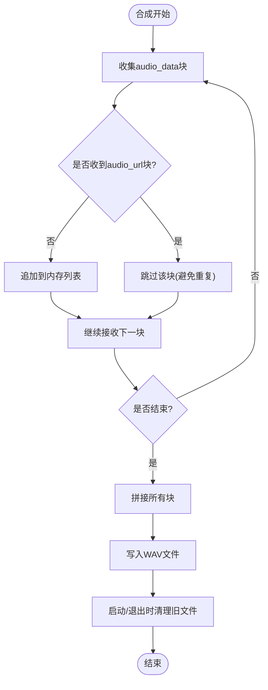
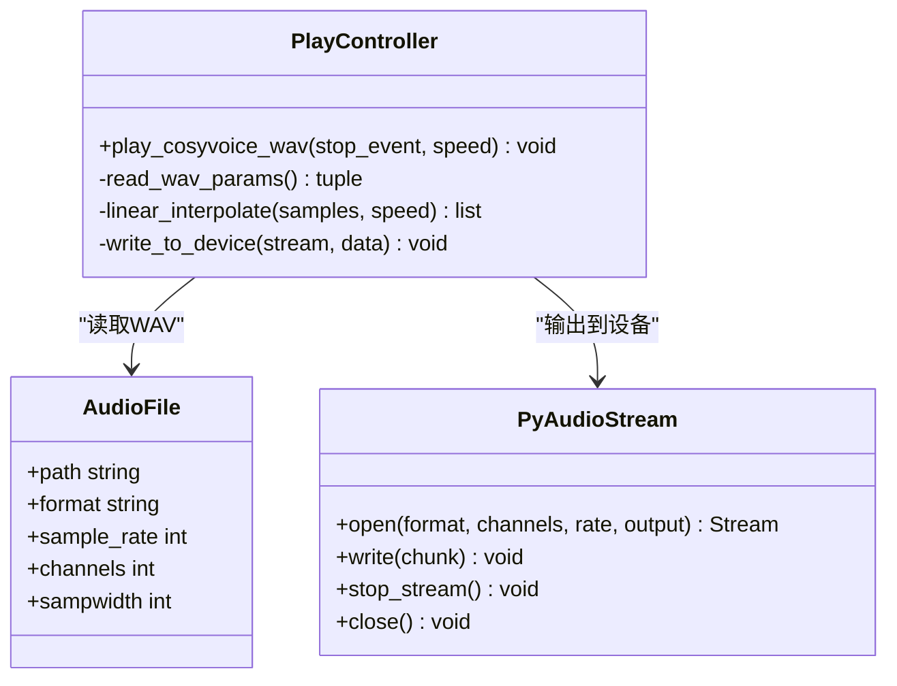
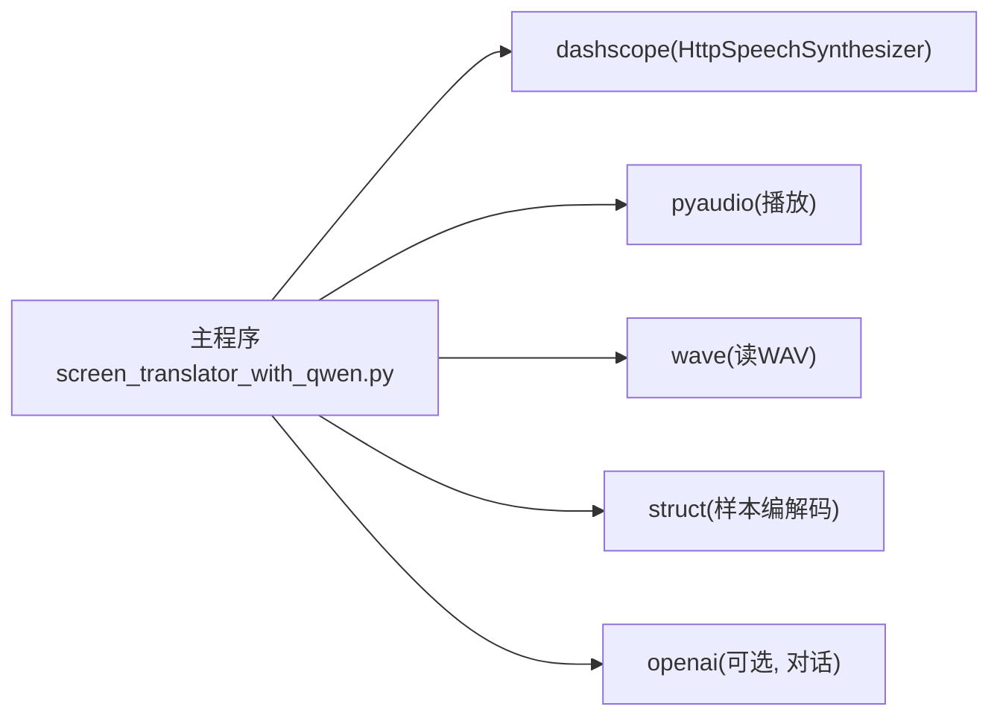

# 阿里云TTS API集成

<cite>
**本文引用的文件**   
- [screen_translator_with_qwen.py](file://screen_translator_with_qwen.py)
- [cosyvoice.py](file://test/cosyvoice.py)
- [requirements.txt](file://requirements.txt)
</cite>

## 目录
1. [简介](#简介)
2. [项目结构](#项目结构)
3. [核心组件](#核心组件)
4. [架构总览](#架构总览)
5. [详细组件分析](#详细组件分析)
6. [依赖关系分析](#依赖关系分析)
7. [性能与优化](#性能与优化)
8. [故障排查指南](#故障排查指南)
9. [结论](#结论)
10. [附录：使用示例与最佳实践](#附录使用示例与最佳实践)

## 简介
本文件面向在项目中集成阿里云TTS（通义语音）的开发者，围绕HttpSpeechSynthesizer的初始化配置、请求处理流程、音频生成与管理、播放控制（含变速）、错误恢复机制以及服务限制与最佳实践进行系统化说明。文档基于仓库中实际代码进行分析与总结，并提供可落地的流程图与时序图，帮助读者快速理解并扩展功能。

## 项目结构
本项目将TTS能力以“流式合成 + 本地WAV写入 + PyAudio播放”的方式实现，主要涉及以下文件：
- screen_translator_with_qwen.py：主程序，包含TTS调用、音频保存与播放、UI状态管理、资源清理等逻辑
- test/cosyvoice.py：最小化示例，演示HttpSpeechSynthesizer的流式调用与数据合并保存
- requirements.txt：声明依赖，包括dashscope、pyaudio、openai等

图表来源 
- [screen_translator_with_qwen.py:361-472](file://screen_translator_with_qwen.py#L361-L472)
- [screen_translator_with_qwen.py:1509-1556](file://screen_translator_with_qwen.py#L1509-L1556)
- [cosyvoice.py:1-40](file://test/cosyvoice.py#L1-L40)
- [requirements.txt:1-31](file://requirements.txt#L1-L31)

章节来源
- [screen_translator_with_qwen.py:361-472](file://screen_translator_with_qwen.py#L361-L472)
- [screen_translator_with_qwen.py:1509-1556](file://screen_translator_with_qwen.py#L1509-L1556)
- [cosyvoice.py:1-40](file://test/cosyvoice.py#L1-L40)
- [requirements.txt:1-31](file://requirements.txt#L1-L31)

## 核心组件
- HttpSpeechSynthesizer调用入口：通过静态方法发起流式请求，返回可迭代的分块结果
- 文本预处理与参数调优：文本长度截断、模型/音色/格式/采样率选择
- 音频生成与管理：按块收集、拼接、写入WAV文件；启动时与退出时清理旧文件
- 播放控制：读取WAV、可选变速重采样、分块输出到系统音频设备，支持停止事件
- 错误处理与重试：捕获异常并更新UI状态；对网络/鉴权/限频等错误进行分类提示

章节来源
- [screen_translator_with_qwen.py:1509-1556](file://screen_translator_with_qwen.py#L1509-L1556)
- [screen_translator_with_qwen.py:361-472](file://screen_translator_with_qwen.py#L361-L472)
- [cosyvoice.py:1-40](file://test/cosyvoice.py#L1-L40)

## 架构总览
下图展示了从用户触发翻译到语音合成的端到端流程，包括线程调度、流式接收、文件落盘与播放。

图表来源 
- [screen_translator_with_qwen.py:1509-1556](file://screen_translator_with_qwen.py#L1509-L1556)
- [screen_translator_with_qwen.py:361-472](file://screen_translator_with_qwen.py#L361-L472)

## 详细组件分析

### 组件A：HttpSpeechSynthesizer初始化与调用
- 认证设置
  - 通过api_key参数传入，用于鉴权访问DashScope服务
  - 主程序中从本地key.txt读取API密钥并注入到OpenAI兼容模式客户端与TTS调用
- 服务端点选择
  - OpenAI兼容模式base_url指向DashScope兼容端点
  - TTS调用由SDK内部决定具体服务地址，无需显式配置
- 音频参数配置
  - model：当前使用cosyvoice-v3-flash
  - voice：longanhuan（适用于v3系列）
  - format：wav
  - sample_rate：24000
  - stream：True，启用流式返回
- 文本预处理
  - 对输入文本进行长度限制（例如截取前若干字符），避免超长文本导致失败或超时

图表来源 
- [screen_translator_with_qwen.py:339-360](file://screen_translator_with_qwen.py#L339-L360)
- [screen_translator_with_qwen.py:1509-1556](file://screen_translator_with_qwen.py#L1509-L1556)
- [cosyvoice.py:1-40](file://test/cosyvoice.py#L1-L40)

章节来源
- [screen_translator_with_qwen.py:339-360](file://screen_translator_with_qwen.py#L339-L360)
- [screen_translator_with_qwen.py:1509-1556](file://screen_translator_with_qwen.py#L1509-L1556)
- [cosyvoice.py:1-40](file://test/cosyvoice.py#L1-L40)

### 组件B：音频文件的生成与管理
- 生成策略
  - 流式接收：遍历返回的chunk，仅保留audio_data，忽略最后一个包含完整audio_url的chunk以避免重复
  - 拼接策略：将所有audio_data字节序列拼接为完整音频
- 文件写入
  - 固定文件名COSYVOICE_WAV_FILE，以二进制写模式写入
- 临时文件清理
  - 应用启动时清理旧WAV文件
  - 注册atexit钩子，确保进程退出时自动清理
  - 提供独立清理函数供外部调用

图表来源 
- [screen_translator_with_qwen.py:1509-1556](file://screen_translator_with_qwen.py#L1509-L1556)
- [screen_translator_with_qwen.py:361-371](file://screen_translator_with_qwen.py#L361-L371)
- [cosyvoice.py:19-40](file://test/cosyvoice.py#L19-L40)

章节来源
- [screen_translator_with_qwen.py:1509-1556](file://screen_translator_with_qwen.py#L1509-L1556)
- [screen_translator_with_qwen.py:361-371](file://screen_translator_with_qwen.py#L361-L371)
- [cosyvoice.py:19-40](file://test/cosyvoice.py#L19-L40)

### 组件C：播放控制与变速算法
- 播放流程
  - 使用wave模块读取WAV文件，获取采样宽度、声道数、采样率
  - 使用pyaudio打开输出流，分块写入系统音频设备
- 变速算法
  - 当speed!=1.0时，采用线性插值重采样：根据目标样本位置在原样本数组中计算插值，得到新样本序列
  - 对16位和8位样本分别做范围裁剪，防止溢出
- 播放状态监控
  - 通过stop_event控制中断播放
  - 播放完成后重置UI状态，标记playing=false

图表来源 
- [screen_translator_with_qwen.py:372-472](file://screen_translator_with_qwen.py#L372-L472)

章节来源
- [screen_translator_with_qwen.py:372-472](file://screen_translator_with_qwen.py#L372-L472)

### 组件D：错误处理与恢复
- 合成阶段
  - 捕获异常并记录日志，同时更新UI状态为失败信息
- 播放阶段
  - 捕获异常并记录日志，保证资源释放（关闭流、终止pyaudio实例、关闭文件句柄）
- 常见错误分类
  - 鉴权失败（如401）：提示检查API密钥
  - 频率限制（如429）：提示稍后重试
  - 其他网络或服务异常：统一提示失败原因

章节来源
- [screen_translator_with_qwen.py:1548-1556](file://screen_translator_with_qwen.py#L1548-L1556)
- [screen_translator_with_qwen.py:471-472](file://screen_translator_with_qwen.py#L471-L472)

## 依赖关系分析
- dashscope：提供HttpSpeechSynthesizer及TTS相关能力
- pyaudio：负责音频输出与流式播放
- openai：用于通义千问兼容模式的对话接口（与本TTS流程解耦）
- wave：标准库，用于读取WAV文件头与帧数据
- struct：标准库，用于样本数据的打包/解包以实现变速重采样

图表来源 
- [requirements.txt:1-31](file://requirements.txt#L1-L31)
- [screen_translator_with_qwen.py:1-20](file://screen_translator_with_qwen.py#L1-L20)

章节来源
- [requirements.txt:1-31](file://requirements.txt#L1-L31)
- [screen_translator_with_qwen.py:1-20](file://screen_translator_with_qwen.py#L1-L20)

## 性能与优化
- 流式合成
  - 使用stream=True减少首包延迟，边收边存，提升交互体验
- 文本长度控制
  - 对输入文本进行截断，降低单次合成耗时与失败概率
- 播放优化
  - 分块写入音频设备，避免一次性加载过大缓冲
  - 变速采用轻量级线性插值，适合实时性要求不高的场景
- 资源管理
  - 启动与退出时清理旧WAV文件，避免磁盘占用与历史干扰
  - 播放结束后及时关闭流与设备，释放系统资源

[本节为通用指导，不直接分析具体文件]

## 故障排查指南
- 无法合成
  - 检查API密钥是否正确且未过期
  - 确认网络连接与DashScope服务可用性
  - 查看日志中的错误信息，定位具体异常类型
- 播放无声或卡顿
  - 确认系统音频设备可用，pyaudio能正确打开输出流
  - 检查WAV文件是否成功写入且大小合理
  - 若开启变速，确认插值逻辑未引入严重失真
- 频繁报错429
  - 降低请求频率，增加退避时间
  - 考虑批量合并文本或缓存已合成结果

章节来源
- [screen_translator_with_qwen.py:1548-1556](file://screen_translator_with_qwen.py#L1548-L1556)
- [screen_translator_with_qwen.py:471-472](file://screen_translator_with_qwen.py#L471-L472)

## 结论
本项目通过HttpSpeechSynthesizer的流式调用实现了稳定高效的TTS集成，结合本地WAV管理与PyAudio播放，提供了完整的“合成—存储—播放—变速—清理”闭环。在实际使用中，建议关注文本长度控制、错误分类与资源释放，以获得更稳定的用户体验。

[本节为总结性内容，不直接分析具体文件]

## 附录：使用示例与最佳实践

### 示例一：基础流式合成与保存
- 参考路径
  - [test/cosyvoice.py:1-40](file://test/cosyvoice.py#L1-L40)
- 要点
  - 设置model、voice、format、sample_rate、stream、api_key
  - 遍历chunk，过滤audio_url块，收集audio_data
  - 拼接并写入output.wav

章节来源
- [cosyvoice.py:1-40](file://test/cosyvoice.py#L1-L40)

### 示例二：在主程序中触发合成与播放
- 参考路径
  - [screen_translator_with_qwen.py:1509-1556](file://screen_translator_with_qwen.py#L1509-L1556)
- 要点
  - 在合成线程中调用HttpSpeechSynthesizer.call(...)
  - 收集audio_data并写入COSYVOICE_WAV_FILE
  - 启动播放线程，默认正常速度播放

章节来源
- [screen_translator_with_qwen.py:1509-1556](file://screen_translator_with_qwen.py#L1509-L1556)

### 示例三：变速播放
- 参考路径
  - [screen_translator_with_qwen.py:372-472](file://screen_translator_with_qwen.py#L372-L472)
- 要点
  - 读取WAV参数，解析样本
  - 使用线性插值进行变速重采样
  - 分块写入音频设备，支持stop_event中断

章节来源
- [screen_translator_with_qwen.py:372-472](file://screen_translator_with_qwen.py#L372-L472)

### 示例四：资源清理与生命周期管理
- 参考路径
  - [screen_translator_with_qwen.py:361-371](file://screen_translator_with_qwen.py#L361-L371)
- 要点
  - 启动时清理旧WAV文件
  - 注册atexit钩子，进程退出时自动清理

章节来源
- [screen_translator_with_qwen.py:361-371](file://screen_translator_with_qwen.py#L361-L371)

### 最佳实践清单
- 请求频率控制
  - 合理设置重试次数与退避时间，避免触发429
- 音频质量优化
  - 选择合适的sample_rate与voice，平衡音质与体积
- 用户体验提升
  - 合成与播放分离线程，保持UI响应
  - 明确的状态反馈（合成中、播放中、失败原因）
- 安全与健壮性
  - 严格校验API密钥与网络状态
  - 完善的异常捕获与日志记录

[本节为通用指导，不直接分析具体文件]