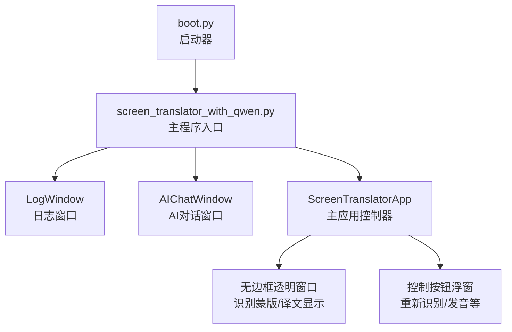
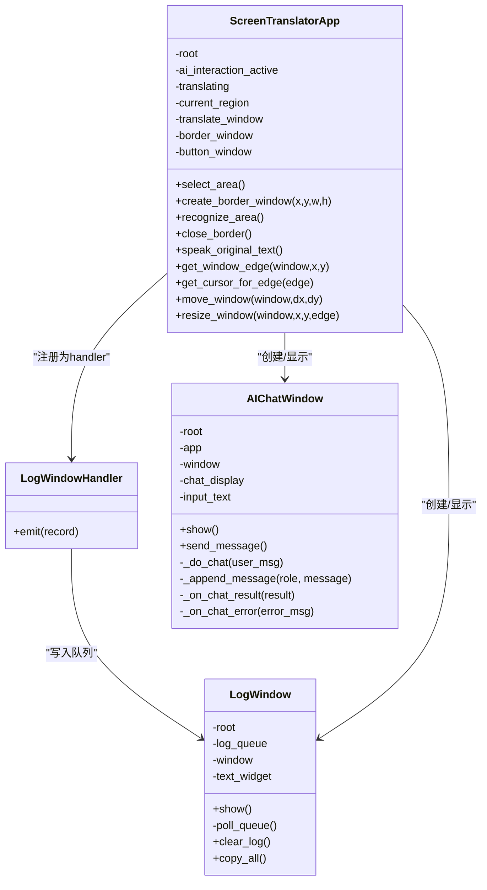
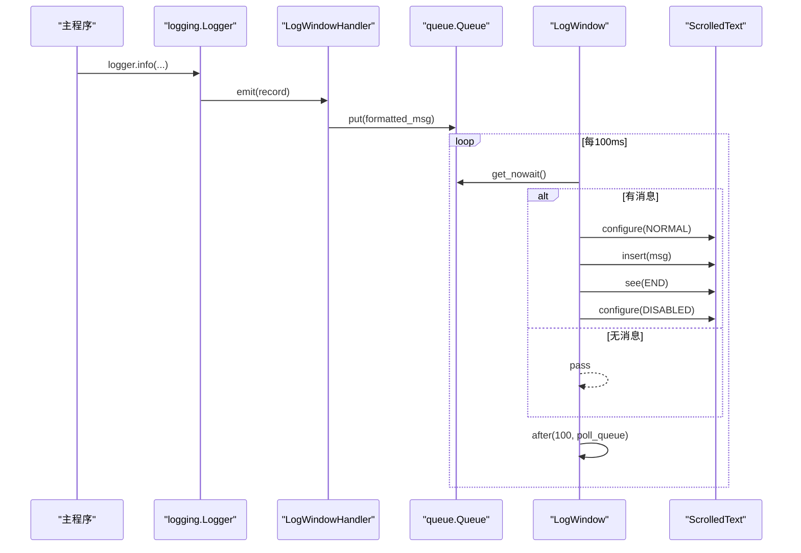
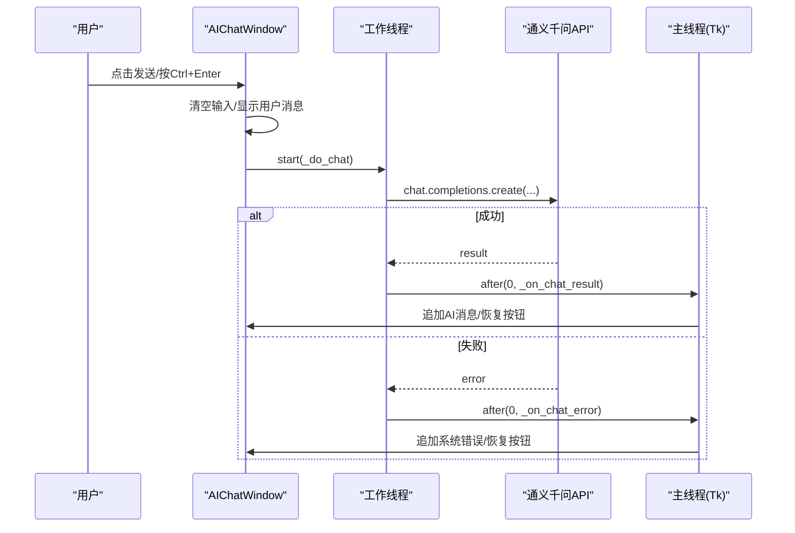
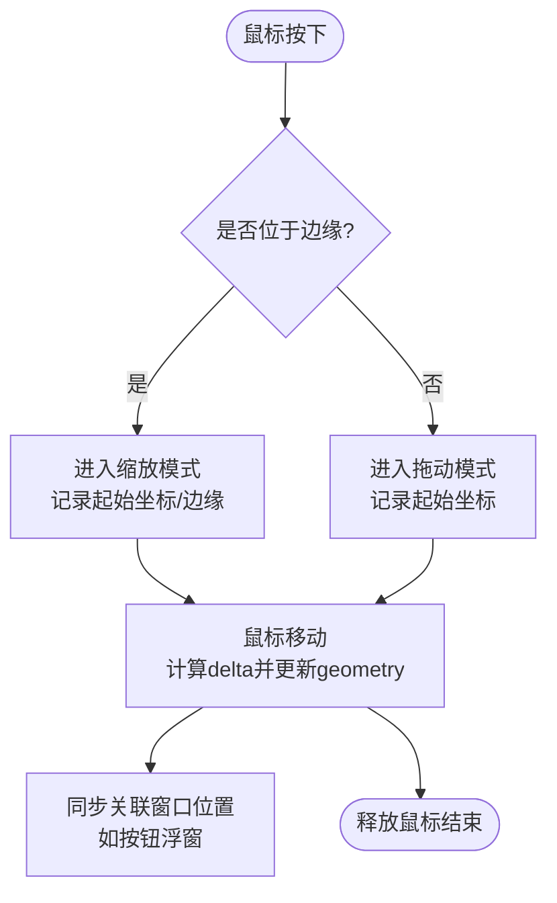
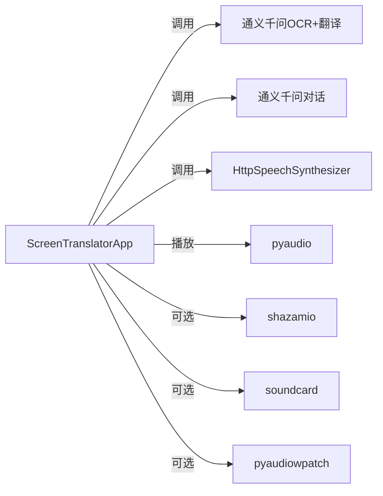

# UI组件架构

<cite>
**本文引用的文件**   
- [screen_translator_with_qwen.py](file://screen_translator_with_qwen.py)
- [boot.py](file://boot.py)
</cite>

## 目录
1. [简介](#简介)
2. [项目结构](#项目结构)
3. [核心组件](#核心组件)
4. [架构总览](#架构总览)
5. [详细组件分析](#详细组件分析)
6. [依赖关系分析](#依赖关系分析)
7. [性能与线程模型](#性能与线程模型)
8. [故障排查指南](#故障排查指南)
9. [结论](#结论)
10. [附录：扩展指南与最佳实践](#附录扩展指南与最佳实践)

## 简介
本文件聚焦于屏幕翻译工具的UI组件架构，重点解析以下方面：
- LogWindow日志管理类的实现原理：队列机制、异步更新与UI线程同步。
- AIChatWindow对话框类的设计模式：消息处理、用户交互与线程安全。
- 透明窗口效果、拖拽调整功能与多窗口协调机制。
- Tkinter GUI组件的自定义样式与主题配置。
- 组件层次结构图、事件传播机制与用户交互流程图。
- UI组件扩展指南与最佳实践建议。

## 项目结构
本项目采用单文件主程序组织方式，所有UI逻辑集中在一个文件中，便于快速迭代与演示。启动器脚本负责虚拟环境管理与后台启动目标程序。

图表来源
- [screen_translator_with_qwen.py:1-2417](file://screen_translator_with_qwen.py#L1-L2417)
- [boot.py:1-279](file://boot.py#L1-L279)

章节来源
- [screen_translator_with_qwen.py:1-2417](file://screen_translator_with_qwen.py#L1-L2417)
- [boot.py:1-279](file://boot.py#L1-L279)

## 核心组件
- LogWindowHandler：将Python logging输出转发到内存队列，供UI消费。
- LogWindow：独立日志窗口，周期性轮询队列并追加文本，支持清空与复制。
- AIChatWindow：独立的AI对话Toplevel窗口，封装输入、历史展示、发送流程与错误提示。
- ScreenTranslatorApp：主窗口控制器，负责区域选择、透明蒙版、无边框拖动/缩放、多窗口联动、全局快捷键、语音合成与播放、听歌识曲等。

章节来源
- [screen_translator_with_qwen.py:21-100](file://screen_translator_with_qwen.py#L21-L100)
- [screen_translator_with_qwen.py:101-300](file://screen_translator_with_qwen.py#L101-L300)
- [screen_translator_with_qwen.py:474-634](file://screen_translator_with_qwen.py#L474-L634)

## 架构总览
整体采用“主控制器 + 子窗口”的松耦合设计：
- 主控制器（ScreenTranslatorApp）持有多个子窗口实例（日志、AI对话、识别蒙版、译文显示、控制按钮）。
- 日志通过logging.Handler -> queue.Queue -> LogWindow.poll_queue() 形成异步流水线。
- AI对话在独立线程中调用API，使用root.after(0, ...)回调回主线程更新UI，保证线程安全。
- 透明蒙版与无边框窗口通过overrideredirect和alpha属性实现；拖拽/缩放通过鼠标事件与几何计算完成。

图表来源
- [screen_translator_with_qwen.py:21-100](file://screen_translator_with_qwen.py#L21-L100)
- [screen_translator_with_qwen.py:101-300](file://screen_translator_with_qwen.py#L101-L300)
- [screen_translator_with_qwen.py:474-634](file://screen_translator_with_qwen.py#L474-L634)

## 详细组件分析

### LogWindow 日志管理类
- 队列机制
  - 通过自定义LogWindowHandler将日志格式化后放入queue.Queue。
  - LogWindow.show()初始化后调用poll_queue()，使用after(100ms)循环非阻塞读取队列。
- 异步更新与UI线程同步
  - poll_queue在主线程运行，避免跨线程直接操作Tkinter控件。
  - 文本框以DISABLED状态保护，插入前临时切换NORMAL，插入后恢复DISABLED，减少重绘开销。
- 功能点
  - 清空日志、复制全部、自动滚动到底部。

图表来源
- [screen_translator_with_qwen.py:21-100](file://screen_translator_with_qwen.py#L21-L100)
- [screen_translator_with_qwen.py:302-312](file://screen_translator_with_qwen.py#L302-L312)

章节来源
- [screen_translator_with_qwen.py:21-100](file://screen_translator_with_qwen.py#L21-L100)
- [screen_translator_with_qwen.py:302-312](file://screen_translator_with_qwen.py#L302-L312)

### AIChatWindow 对话框类
- 设计模式
  - 独立Toplevel窗口，内部维护输入区、聊天历史区、标签样式。
  - 发送消息时禁用按钮防止重复提交，完成后恢复。
- 消息处理与线程安全
  - send_message()在新线程中执行_do_chat()，避免阻塞UI。
  - 结果与错误通过root.after(0, lambda: ...)回调到主线程更新UI。
- 用户交互
  - Ctrl+Enter快捷发送，捕获原文从ocr_cache合并填入输入框。
  - 系统消息用于提示状态与错误信息。

图表来源
- [screen_translator_with_qwen.py:101-300](file://screen_translator_with_qwen.py#L101-L300)

章节来源
- [screen_translator_with_qwen.py:101-300](file://screen_translator_with_qwen.py#L101-L300)

### 透明窗口、拖拽调整与多窗口协调
- 透明与置顶
  - 使用overrideredirect(True)隐藏标题栏，attributes('-topmost', True)置顶，attributes('-alpha', 0.1~0.9)设置透明度。
- 拖拽与缩放
  - 通过get_window_edge检测边缘，根据边缘类型决定光标与缩放方向。
  - move_window/update geometry实现移动；resize_window按比例限制最小宽高并同步更新相关控件布局。
- 多窗口协调
  - 识别蒙版(border_window)与控制按钮(button_window)联动：拖动/缩放蒙版时同步更新按钮位置。
  - 译文显示窗口(translate_window)与发音按钮窗口(translate_button_window)同样保持相对位置。
  - close_border统一关闭识别蒙版、按钮、译文显示与发音按钮，并重置状态。

图表来源
- [screen_translator_with_qwen.py:1268-1409](file://screen_translator_with_qwen.py#L1268-L1409)
- [screen_translator_with_qwen.py:1611-1703](file://screen_translator_with_qwen.py#L1611-L1703)

章节来源
- [screen_translator_with_qwen.py:859-926](file://screen_translator_with_qwen.py#L859-L926)
- [screen_translator_with_qwen.py:1268-1409](file://screen_translator_with_qwen.py#L1268-L1409)
- [screen_translator_with_qwen.py:1611-1703](file://screen_translator_with_qwen.py#L1611-L1703)

### Tkinter 自定义样式与主题配置
- 深色主题
  - 背景色使用深灰(#1e1e1e)，前景色浅灰(#d4d4d4)，插入符颜色一致，提升可读性。
- 字体与标签样式
  - 使用Microsoft YaHei作为默认字体，不同角色（用户/AI/系统）通过tag_configure配置不同前景色与加粗。
- 控件配色
  - 按钮使用高对比度配色（如蓝色、绿色、橙色），确保可访问性与视觉层级清晰。

章节来源
- [screen_translator_with_qwen.py:54-74](file://screen_translator_with_qwen.py#L54-L74)
- [screen_translator_with_qwen.py:176-193](file://screen_translator_with_qwen.py#L176-L193)
- [screen_translator_with_qwen.py:142-160](file://screen_translator_with_qwen.py#L142-L160)

## 依赖关系分析
- 模块内依赖
  - LogWindowHandler依赖queue.Queue；LogWindow依赖tkinter与queue。
  - AIChatWindow依赖threading与OpenAI客户端（由外部初始化）。
  - ScreenTranslatorApp依赖pyautogui、PIL、wave/pyaudio、dashscope TTS等。
- 外部集成点
  - 通义千问API：OCR+翻译、对话。
  - 语音合成：HttpSpeechSynthesizer流式返回音频数据。
  - 音频播放：pyaudio分块播放，支持变速插值。
  - 听歌识曲：可选shazamio，结合soundcard/pyaudiowpatch/pyaudio进行系统音频录制。

图表来源
- [screen_translator_with_qwen.py:348-360](file://screen_translator_with_qwen.py#L348-L360)
- [screen_translator_with_qwen.py:1123-1248](file://screen_translator_with_qwen.py#L1123-L1248)
- [screen_translator_with_qwen.py:1498-1556](file://screen_translator_with_qwen.py#L1498-L1556)
- [screen_translator_with_qwen.py:2233-2271](file://screen_translator_with_qwen.py#L2233-L2271)

章节来源
- [screen_translator_with_qwen.py:348-360](file://screen_translator_with_qwen.py#L348-L360)
- [screen_translator_with_qwen.py:1123-1248](file://screen_translator_with_qwen.py#L1123-L1248)
- [screen_translator_with_qwen.py:1498-1556](file://screen_translator_with_qwen.py#L1498-L1556)
- [screen_translator_with_qwen.py:2233-2271](file://screen_translator_with_qwen.py#L2233-L2271)

## 性能与线程模型
- 日志渲染
  - 使用after轮询而非阻塞等待，降低CPU占用；批量get_nowait减少频繁IO。
- 图像预处理
  - 压缩图片质量可调，先增强对比度再转灰度，减少网络传输体积。
- 请求重试与退避
  - 对429等错误采用指数退避+随机抖动，提高稳定性。
- 线程安全
  - 所有UI更新均通过root.after(0, ...)调度到主线程，避免跨线程修改Tkinter对象。
- 音频播放
  - 分块写入pyaudio流，支持停止事件中断；线性插值实现变速播放。

章节来源
- [screen_translator_with_qwen.py:76-87](file://screen_translator_with_qwen.py#L76-L87)
- [screen_translator_with_qwen.py:1098-1122](file://screen_translator_with_qwen.py#L1098-L1122)
- [screen_translator_with_qwen.py:1144-1248](file://screen_translator_with_qwen.py#L1144-L1248)
- [screen_translator_with_qwen.py:372-473](file://screen_translator_with_qwen.py#L372-L473)

## 故障排查指南
- 日志不显示
  - 检查LogWindowHandler是否正确注册到logging.basicConfig；确认log_queue存在且未被GC回收。
- AI对话报错
  - 401：检查key.txt中的API密钥是否有效。
  - 429：请求过于频繁，稍后再试或增加退避时间。
  - 413：请求体过大，缩小识别区域或降低图片质量。
- 无法录音
  - soundcard：蓝牙耳机可能不支持环回，尝试内置扬声器或有线耳机。
  - pyaudiowpatch：需Windows WASAPI环回设备可用。
  - pyaudio：需在系统中启用立体声混音。
- 窗口拖拽/缩放异常
  - 确认边缘阈值与最小尺寸限制合理；检查关联窗口位置同步逻辑。

章节来源
- [screen_translator_with_qwen.py:302-312](file://screen_translator_with_qwen.py#L302-L312)
- [screen_translator_with_qwen.py:260-300](file://screen_translator_with_qwen.py#L260-L300)
- [screen_translator_with_qwen.py:1144-1248](file://screen_translator_with_qwen.py#L1144-L1248)
- [screen_translator_with_qwen.py:1789-1851](file://screen_translator_with_qwen.py#L1789-L1851)
- [screen_translator_with_qwen.py:1611-1703](file://screen_translator_with_qwen.py#L1611-L1703)

## 结论
该UI架构以轻量级、易扩展为目标，通过队列与回调机制实现了日志与AI响应的异步更新；利用透明与无边框窗口提供沉浸式体验；通过统一的拖拽/缩放与多窗口协调策略，提升了交互一致性。整体代码遵循“主线程更新UI、工作线程处理耗时任务”的原则，具备较好的可维护性与可扩展性。

## 附录：扩展指南与最佳实践
- 新增日志面板
  - 复用LogWindowHandler与queue.Queue模式，创建新的消费者窗口，使用after轮询消费队列。
- 新增对话窗口
  - 参考AIChatWindow，封装输入、历史、发送流程；所有UI更新使用root.after(0, ...)。
- 新增透明浮动窗口
  - 使用overrideredirect与alpha；绑定鼠标事件实现拖拽/缩放；注意最小尺寸与边界检查。
- 主题与样式
  - 集中定义颜色与字体常量，使用tag_configure统一管理富文本样式。
- 线程与并发
  - 严格区分UI线程与工作线程；避免共享可变状态，必要时使用锁或不可变数据结构。
- 资源清理
  - 在关闭窗口或退出时，统一清理临时文件、停止音频播放、取消快捷键注册。

章节来源
- [screen_translator_with_qwen.py:21-100](file://screen_translator_with_qwen.py#L21-L100)
- [screen_translator_with_qwen.py:101-300](file://screen_translator_with_qwen.py#L101-L300)
- [screen_translator_with_qwen.py:859-926](file://screen_translator_with_qwen.py#L859-L926)
- [screen_translator_with_qwen.py:1611-1703](file://screen_translator_with_qwen.py#L1611-L1703)