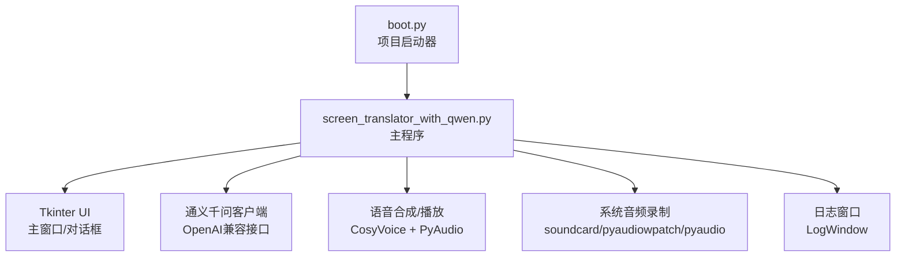
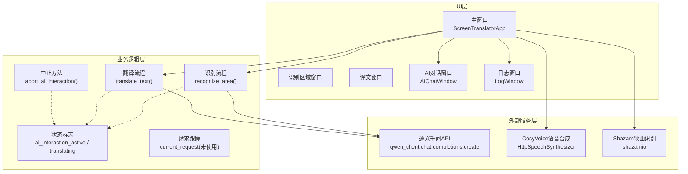
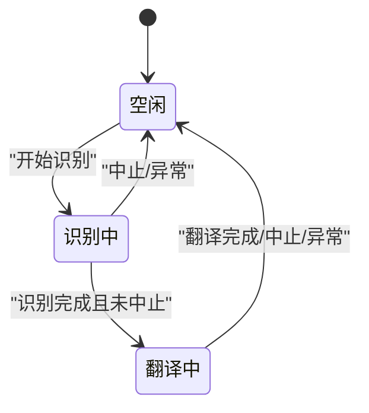
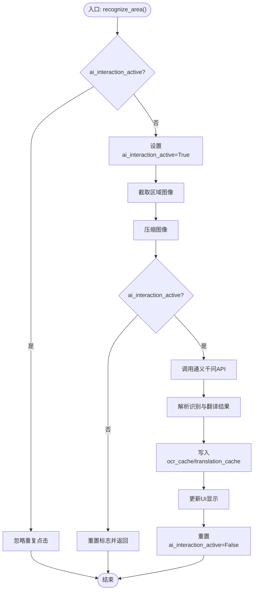
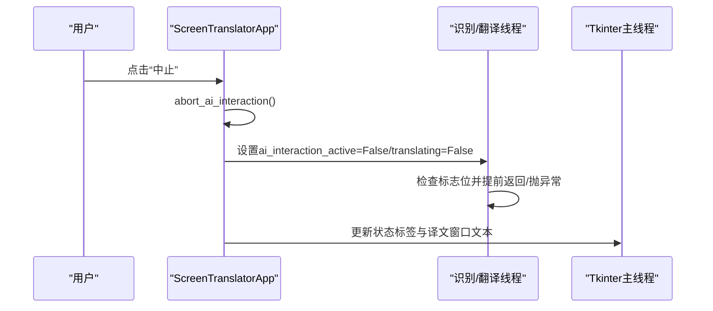

# AI交互控制系统

<cite>
**本文引用的文件**   
- [screen_translator_with_qwen.py](file://screen_translator_with_qwen.py)
- [boot.py](file://boot.py)
</cite>

## 目录
1. [简介](#简介)
2. [项目结构](#项目结构)
3. [核心组件](#核心组件)
4. [架构总览](#架构总览)
5. [详细组件分析](#详细组件分析)
6. [依赖关系分析](#依赖关系分析)
7. [性能与并发特性](#性能与并发特性)
8. [故障排查指南](#故障排查指南)
9. [结论](#结论)
10. [附录：状态机与流程图](#附录状态机与流程图)

## 简介
本技术文档聚焦于AI交互控制系统的实现，围绕以下目标展开：
- 深入解释AI交互状态管理机制，包括ai_interaction_active标志位的作用和状态转换逻辑。
- 详细说明current_request对象的管理（请求跟踪、取消机制、并发控制）。
- 解释abort_ai_interaction()方法的实现原理，包括线程安全的中断机制和资源清理。
- 描述与通义千问API的集成模式，包括异步请求处理、错误重试机制、超时控制。
- 详细说明AI对话窗口的集成，包括消息传递、状态同步、用户界面反馈。
- 提供AI交互的状态机图和请求处理流程图，并给出异常处理和恢复策略的实际代码示例路径。

## 项目结构
本项目采用单文件主程序组织方式，核心功能集中在一个主模块中，包含UI、AI交互、音频录制/播放、日志窗口等能力；另有一个通用启动器用于自动管理虚拟环境与后台启动。

图表来源
- [boot.py:256-279](file://boot.py#L256-L279)
- [screen_translator_with_qwen.py:474-634](file://screen_translator_with_qwen.py#L474-L634)

章节来源
- [boot.py:256-279](file://boot.py#L256-L279)
- [screen_translator_with_qwen.py:474-634](file://screen_translator_with_qwen.py#L474-L634)

## 核心组件
- ScreenTranslatorApp：应用主类，负责UI初始化、区域选择、识别/翻译流程、全局快捷键、中止控制、音频播放/合成、听歌识曲等。
- AIChatWindow：独立AI对话窗口，支持发送消息、捕获原文、显示历史消息与错误提示。
- LogWindow：日志输出窗口，通过队列从logging接收日志并在UI中滚动显示。
- 通义千问客户端：基于OpenAI兼容接口的qwen_client，用于OCR+翻译与文本对话。
- 音频子系统：语音合成（HttpSpeechSynthesizer）与本地播放（PyAudio），以及多方案系统音频录制。

章节来源
- [screen_translator_with_qwen.py:101-300](file://screen_translator_with_qwen.py#L101-L300)
- [screen_translator_with_qwen.py:474-634](file://screen_translator_with_qwen.py#L474-L634)
- [screen_translator_with_qwen.py:338-360](file://screen_translator_with_qwen.py#L338-L360)

## 架构总览
整体架构由“UI层 + 业务逻辑层 + 外部服务层”构成：
- UI层：Tkinter主窗口、识别区域边框窗口、译文窗口、AI对话窗口、日志窗口。
- 业务逻辑层：ScreenTranslatorApp中的识别/翻译流程、状态标志、线程调度、缓存管理、快捷键注册。
- 外部服务层：通义千问API（OCR+翻译）、CosyVoice语音合成、Shazam歌曲识别。

图表来源
- [screen_translator_with_qwen.py:927-1021](file://screen_translator_with_qwen.py#L927-L1021)
- [screen_translator_with_qwen.py:1022-1097](file://screen_translator_with_qwen.py#L1022-L1097)
- [screen_translator_with_qwen.py:1704-1723](file://screen_translator_with_qwen.py#L1704-L1723)
- [screen_translator_with_qwen.py:1123-1248](file://screen_translator_with_qwen.py#L1123-L1248)
- [screen_translator_with_qwen.py:1498-1556](file://screen_translator_with_qwen.py#L1498-L1556)
- [screen_translator_with_qwen.py:2272-2396](file://screen_translator_with_qwen.py#L2272-L2396)

## 详细组件分析

### AI交互状态管理与标志位
- ai_interaction_active：标识“识别交互”是否进行中。在识别流程开始设置，结束或异常时重置。多处检查该标志以决定是否继续执行后续步骤或抛出中止异常。
- translating：标识“翻译交互”是否进行中。用于翻译流程的并行控制与中止判断。
- current_request：声明为实例属性，但在当前实现中未被实际赋值或使用，因此不具备请求跟踪与取消能力。

状态转换要点：
- 进入识别：设置ai_interaction_active = True，随后进行截图、压缩、调用API、解析结果、更新UI，最终在finally块中重置为False。
- 进入翻译：设置translating = True，完成后或在异常分支中重置为False。
- 中止：abort_ai_interaction()将两个标志置为False，并更新UI状态。

线程安全说明：
- 标志位在多线程环境下被读写，但当前未加锁保护。由于Python GIL对布尔写操作具备原子性，简单标志位的读取/写入通常不会导致崩溃，但不保证跨线程可见性与顺序语义。建议在高并发场景引入threading.Lock或threading.Event提升健壮性。

章节来源
- [screen_translator_with_qwen.py:599-604](file://screen_translator_with_qwen.py#L599-L604)
- [screen_translator_with_qwen.py:934-1021](file://screen_translator_with_qwen.py#L934-L1021)
- [screen_translator_with_qwen.py:1034-1097](file://screen_translator_with_qwen.py#L1034-L1097)
- [screen_translator_with_qwen.py:1704-1723](file://screen_translator_with_qwen.py#L1704-L1723)

### 请求跟踪与并发控制（current_request）
- 现状：current_request作为实例变量存在，但未在任何地方赋值或参与流程控制，因此无法用于请求跟踪、取消或并发限制。
- 影响：当前并发控制仅依赖ai_interaction_active与translating标志，防止重复触发识别/翻译。若需更精细的请求级控制（如并发上限、请求ID、可中断的网络请求），需要扩展current_request的实现。

改进建议（概念性）：
- 使用threading.Lock保护关键状态变更。
- 使用queue.Queue或asyncio.Queue维护待处理请求。
- 使用concurrent.futures.ThreadPoolExecutor限制并发数。
- 对于网络请求，使用支持超时的HTTP客户端，并结合Event实现可中断等待。

章节来源
- [screen_translator_with_qwen.py:599-604](file://screen_translator_with_qwen.py#L599-L604)

### abort_ai_interaction()方法与线程安全中断
- 功能：将ai_interaction_active与translating置为False，并更新UI状态，提示“AI交互已中止”。
- 中断机制：识别与翻译流程在多个关键点检查标志位，若发现已中止则提前返回或抛出异常，从而终止后续处理。
- 资源清理：该方法本身不直接释放网络连接或文件句柄，但通过标志位促使各流程退出后，在finally块中完成必要的状态复位与UI更新。

线程安全注意事项：
- 标志位修改与读取未加锁，建议在关键路径增加互斥访问，避免竞态条件。
- 若未来引入可中断的网络请求，建议使用Event或CancellationToken配合。

章节来源
- [screen_translator_with_qwen.py:1704-1723](file://screen_translator_with_qwen.py#L1704-L1723)
- [screen_translator_with_qwen.py:972-1016](file://screen_translator_with_qwen.py#L972-L1016)
- [screen_translator_with_qwen.py:1058-1092](file://screen_translator_with_qwen.py#L1058-L1092)

### 与通义千问API的集成模式
- 客户端初始化：从key.txt读取API密钥，构造OpenAI兼容客户端qwen_client，base_url指向阿里云DashScope兼容端点。
- OCR+翻译：
  - 将截图转换为PNG字节流，再编码为base64，构建包含image_url与text的多模态消息。
  - 使用qwen_client.chat.completions.create发起请求，模型为qwen3.6-flash。
  - 响应体包含识别结果与翻译结果，按固定格式解析并缓存到ocr_cache与translation_cache。
- 文本对话：
  - AIChatWindow在新线程中调用qwen_client.chat.completions.create，模型同样为qwen3.6-flash。
  - 根据错误信息分类提示（401未授权、429频率限制等），并通过root.after在主线程更新UI。

错误重试与退避：
- 针对429错误，采用指数退避+随机抖动策略，最大重试次数为5次。
- 其他错误在达到最大重试次数后抛出明确异常，便于上层捕获与展示。

超时控制：
- 当前代码未在chat.completions.create显式传入timeout参数，默认使用SDK内部超时。如需严格超时控制，应在调用处添加timeout参数。

章节来源
- [screen_translator_with_qwen.py:338-360](file://screen_translator_with_qwen.py#L338-L360)
- [screen_translator_with_qwen.py:1123-1248](file://screen_translator_with_qwen.py#L1123-L1248)
- [screen_translator_with_qwen.py:267-288](file://screen_translator_with_qwen.py#L267-L288)

### AI对话窗口集成（消息传递、状态同步、UI反馈）
- 消息发送：用户在输入框输入内容，点击发送或Ctrl+Enter触发send_message。
- 线程调用：在新线程中执行_do_chat，避免阻塞UI。
- 结果回调：通过root.after在主线程更新聊天显示区域，区分用户/AI/系统消息样式。
- 错误处理：捕获网络错误并分类提示，恢复按钮状态。

章节来源
- [screen_translator_with_qwen.py:223-300](file://screen_translator_with_qwen.py#L223-L300)

### 语音合成与播放（辅助能力）
- 语音合成：使用HttpSpeechSynthesizer.call生成wav流，保存到cosyvoice.wav。
- 播放控制：支持变速播放，使用stop_event控制停止，播放完成后恢复UI状态。
- 资源清理：程序关闭时清理临时wav文件。

章节来源
- [screen_translator_with_qwen.py:1498-1556](file://screen_translator_with_qwen.py#L1498-L1556)
- [screen_translator_with_qwen.py:363-473](file://screen_translator_with_qwen.py#L363-L473)

## 依赖关系分析
- 外部库：tkinter、pyautogui、Pillow、openai、dashscope.audio.http_tts、pyaudio、soundcard、numpy、shazamio、keyboard等。
- 运行时依赖：
  - key.txt：存放通义千问API密钥。
  - requirements.txt：定义项目依赖，由boot.py自动检测与安装。
- 启动流程：boot.py自动创建/校验虚拟环境，找到唯一主程序并后台启动，无控制台窗口。

章节来源
- [screen_translator_with_qwen.py:1-20](file://screen_translator_with_qwen.py#L1-L20)
- [boot.py:19-36](file://boot.py#L19-L36)
- [boot.py:256-279](file://boot.py#L256-L279)

## 性能与并发特性
- 并发模型：识别与翻译分别在新线程中执行，避免阻塞UI。
- 图片预处理：增强对比度、灰度化、JPEG压缩，减少传输体积。
- 重试策略：指数退避+随机抖动，降低瞬时拥塞导致的失败率。
- 潜在优化点：
  - 为网络请求添加显式timeout，避免长时间挂起。
  - 引入请求级并发限制（如信号量或线程池），避免过多并发请求导致服务端限流。
  - 使用threading.Lock保护共享状态，提高线程安全性。

[本节为通用指导，无需具体文件引用]

## 故障排查指南
- API密钥无效或过期（401）：检查key.txt内容与权限。
- 请求过于频繁（429）：等待一段时间后再试，系统已内置退避重试。
- 请求体过大（413）：缩小识别区域或降低图像质量。
- 语音合成失败：检查网络与API可用性，确认cosyvoice.wav写入权限。
- 系统音频录制失败：参考多方案失败提示，尝试切换设备或启用立体声混音。

章节来源
- [screen_translator_with_qwen.py:1215-1248](file://screen_translator_with_qwen.py#L1215-L1248)
- [screen_translator_with_qwen.py:1829-1851](file://screen_translator_with_qwen.py#L1829-L1851)

## 结论
该系统实现了较为完整的屏幕识别与翻译工作流，结合通义千问多模态能力与CosyVoice语音合成，提供了良好的用户体验。状态管理通过标志位实现，具备基本的中止能力；但请求级跟踪与并发控制尚不完善，建议在未来版本中引入更严格的线程安全与请求生命周期管理。

[本节为总结，无需具体文件引用]

## 附录：状态机与流程图

### AI交互状态机图

图表来源
- [screen_translator_with_qwen.py:934-1021](file://screen_translator_with_qwen.py#L934-L1021)
- [screen_translator_with_qwen.py:1034-1097](file://screen_translator_with_qwen.py#L1034-L1097)
- [screen_translator_with_qwen.py:1704-1723](file://screen_translator_with_qwen.py#L1704-L1723)

### 识别与翻译请求处理流程图

图表来源
- [screen_translator_with_qwen.py:927-1021](file://screen_translator_with_qwen.py#L927-L1021)
- [screen_translator_with_qwen.py:1123-1248](file://screen_translator_with_qwen.py#L1123-L1248)

### 中止流程时序图

图表来源
- [screen_translator_with_qwen.py:1704-1723](file://screen_translator_with_qwen.py#L1704-L1723)
- [screen_translator_with_qwen.py:972-1016](file://screen_translator_with_qwen.py#L972-L1016)
- [screen_translator_with_qwen.py:1058-1092](file://screen_translator_with_qwen.py#L1058-L1092)