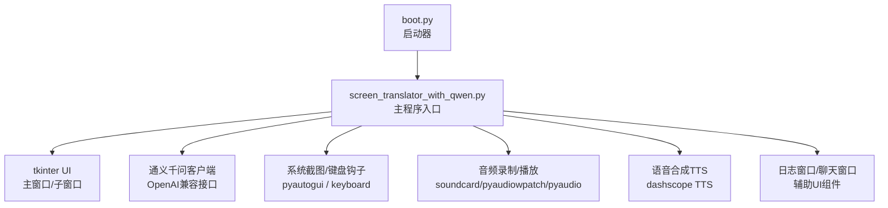
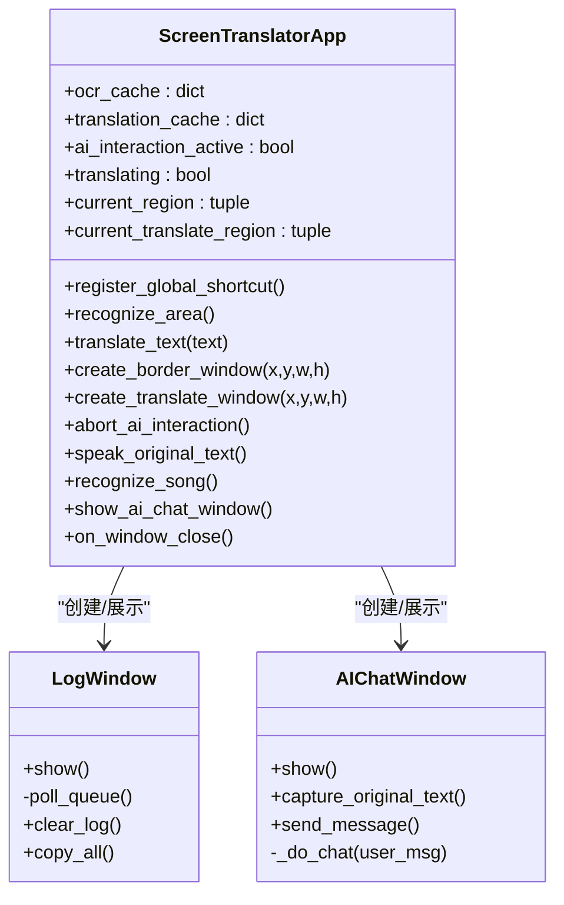
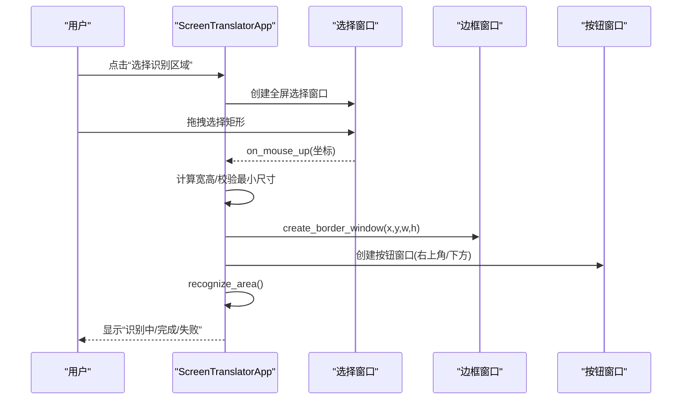
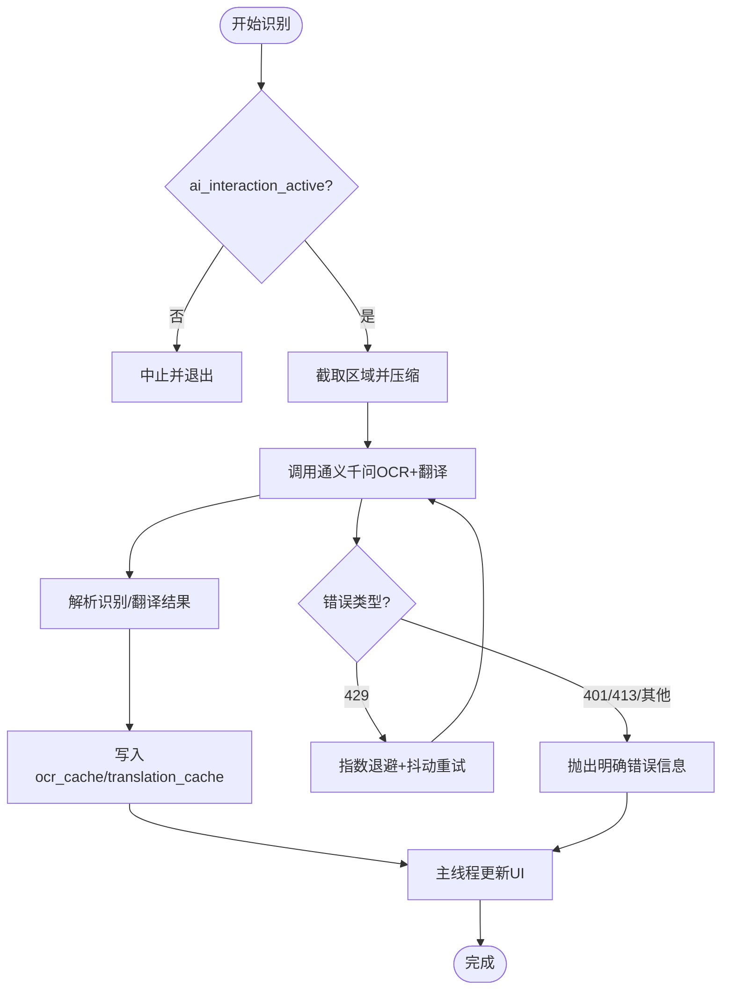
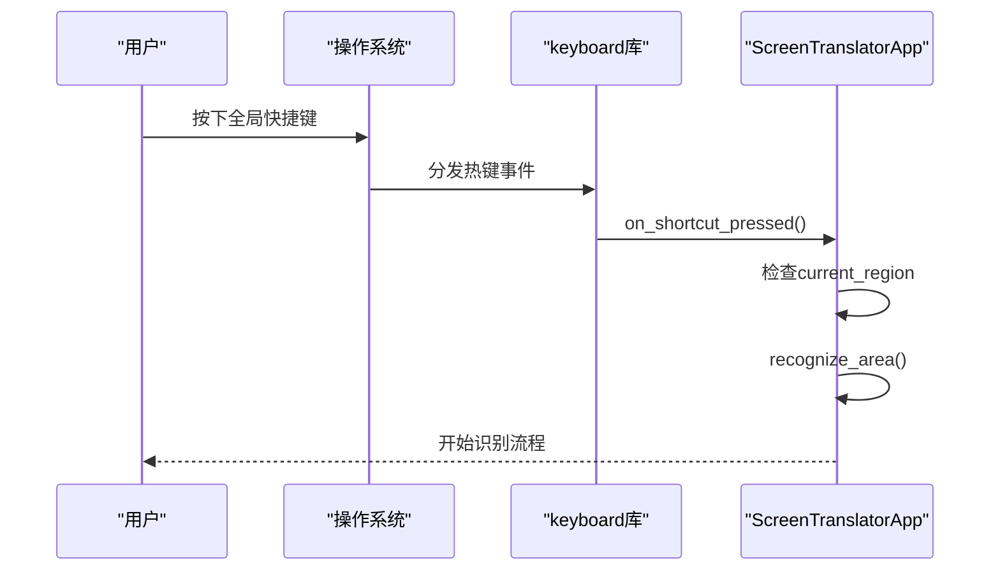
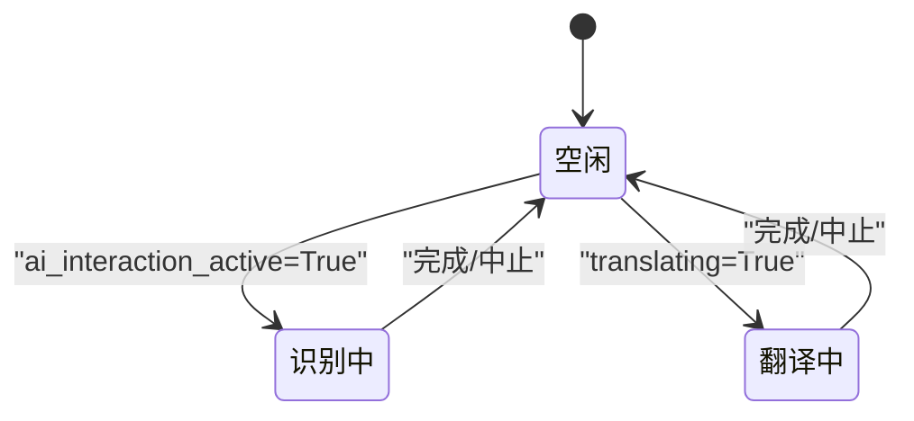
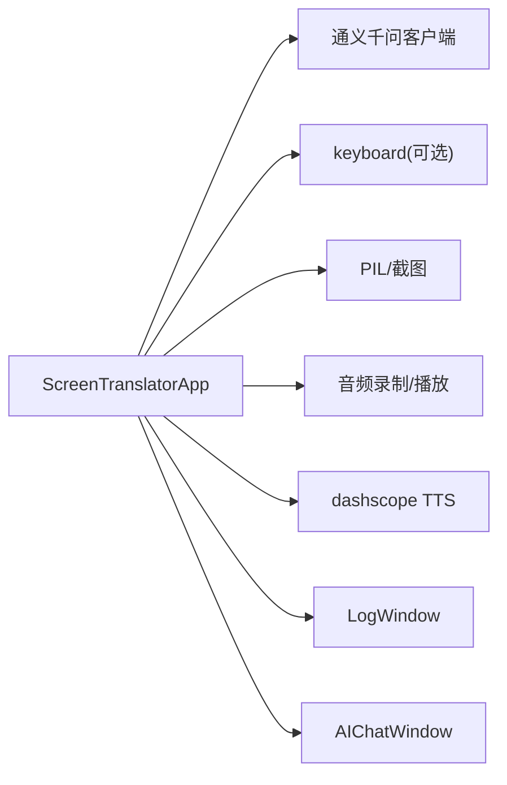
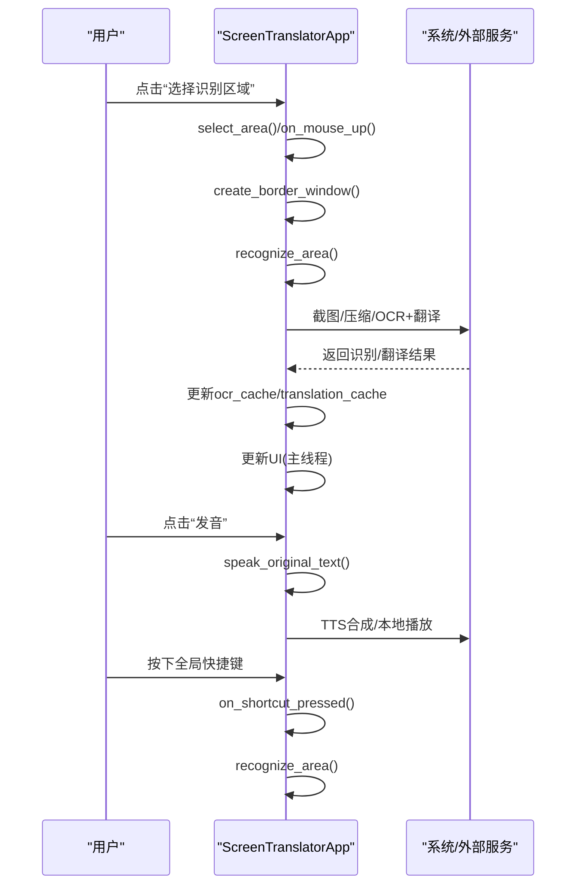

# ScreenTranslatorApp主类架构

<cite>
**本文引用的文件**   
- [screen_translator_with_qwen.py](file://screen_translator_with_qwen.py)
- [boot.py](file://boot.py)
</cite>

## 目录
1. [简介](#简介)
2. [项目结构](#项目结构)
3. [核心组件](#核心组件)
4. [架构总览](#架构总览)
5. [详细组件分析](#详细组件分析)
6. [依赖关系分析](#依赖关系分析)
7. [性能与线程安全](#性能与线程安全)
8. [故障排查指南](#故障排查指南)
9. [结论](#结论)
10. [附录：关键方法调用关系图](#附录关键方法调用关系图)

## 简介
本文件围绕 ScreenTranslatorApp 主类进行深度架构文档化，聚焦其作为“屏幕翻译工具”的核心控制器职责。内容涵盖：
- 状态管理：ocr_cache、translation_cache、AI交互控制变量（ai_interaction_active、translating）等
- 事件处理机制：鼠标选择区域、窗口拖拽/拉伸、全局快捷键触发识别
- 线程安全设计：后台线程执行OCR/翻译/语音合成/听歌识曲，UI更新通过主线程调度
- 窗口管理：识别区域边框窗口、按钮窗口、译文显示窗口及其生命周期管理
- AI交互控制：请求中止、重试退避、错误分类提示
- 系统集成：全局快捷键注册、系统音频录制、TTS播放、日志窗口、AI对话窗口

## 项目结构
本项目采用单文件应用组织方式，ScreenTranslatorApp 位于主模块中，配合启动器 boot.py 负责虚拟环境管理与无控制台启动。

图表来源
- [screen_translator_with_qwen.py:474-634](file://screen_translator_with_qwen.py#L474-L634)
- [boot.py:257-279](file://boot.py#L257-L279)

章节来源
- [screen_translator_with_qwen.py:474-634](file://screen_translator_with_qwen.py#L474-L634)
- [boot.py:257-279](file://boot.py#L257-L279)

## 核心组件
- ScreenTranslatorApp：主控制器，负责UI初始化、区域选择、OCR/翻译流程编排、窗口管理、全局快捷键、音频与TTS集成、AI对话窗口。
- LogWindow：日志输出窗口，基于队列异步消费日志消息。
- AIChatWindow：AI对话窗口，支持捕获原文缓存并发起对话。

章节来源
- [screen_translator_with_qwen.py:21-100](file://screen_translator_with_qwen.py#L21-L100)
- [screen_translator_with_qwen.py:101-300](file://screen_translator_with_qwen.py#L101-L300)
- [screen_translator_with_qwen.py:474-634](file://screen_translator_with_qwen.py#L474-L634)

## 架构总览
ScreenTranslatorApp 作为中心控制器，协调以下子系统：
- 输入层：鼠标选择区域、全局快捷键
- 处理层：截图压缩、OCR+翻译（通义千问）、文本翻译（从缓存读取）
- 输出层：译文显示窗口、发音按钮、日志窗口、AI对话窗口
- 系统层：音频录制（多方案回退）、TTS合成与播放、全局快捷键注入

图表来源
- [screen_translator_with_qwen.py:474-634](file://screen_translator_with_qwen.py#L474-L634)
- [screen_translator_with_qwen.py:21-100](file://screen_translator_with_qwen.py#L21-L100)
- [screen_translator_with_qwen.py:101-300](file://screen_translator_with_qwen.py#L101-L300)

## 详细组件分析

### 1) 状态管理与线程安全
- 状态字段
  - ocr_cache、translation_cache：以图像前缀为键的识别结果与翻译结果缓存
  - ai_interaction_active：标识是否正在进行OCR/翻译AI交互
  - translating：标识是否正在执行翻译任务
  - current_region、current_translate_region：当前识别/译文区域坐标
  - 播放与合成状态：synthesizing、playing、play_stop_event、speed_mode、is_new_audio
- 线程安全策略
  - 所有耗时操作（截图、压缩、网络请求、TTS、音频播放、Shazam识别）均在后台线程执行
  - UI更新统一通过 root.after(0, ...) 在主线程回调中执行，避免跨线程访问Tkinter控件
  - 使用标志位（ai_interaction_active、translating）在关键路径检查是否已中止，实现可中断的请求流程
  - 播放线程通过 Event 停止事件控制播放终止

章节来源
- [screen_translator_with_qwen.py:474-634](file://screen_translator_with_qwen.py#L474-L634)
- [screen_translator_with_qwen.py:927-1021](file://screen_translator_with_qwen.py#L927-L1021)
- [screen_translator_with_qwen.py:1022-1097](file://screen_translator_with_qwen.py#L1022-L1097)
- [screen_translator_with_qwen.py:1442-1569](file://screen_translator_with_qwen.py#L1442-L1569)
- [screen_translator_with_qwen.py:1704-1723](file://screen_translator_with_qwen.py#L1704-L1723)

### 2) 区域选择与窗口管理
- 识别区域选择
  - 全屏半透明覆盖层用于绘制选择框，记录起始/结束坐标，计算宽高后保存 current_region
  - 创建无边框置顶蒙版窗口（border_window）和独立按钮窗口（button_window），按钮包含“重新识别”
  - 支持拖动与边缘拉伸，实时更新位置与大小，同步更新按钮窗口位置
- 译文区域选择与显示
  - 类似流程创建 translate_select_window，完成后生成 translate_window 与 translate_button_window
  - 支持拖动/拉伸，动态调整 wraplength 与滚动区域
- 生命周期管理
  - close_border 统一关闭识别/译文相关窗口，重置状态，禁用相关按钮
  - ESC 取消选择，销毁选择窗口

图表来源
- [screen_translator_with_qwen.py:781-858](file://screen_translator_with_qwen.py#L781-L858)
- [screen_translator_with_qwen.py:859-926](file://screen_translator_with_qwen.py#L859-L926)
- [screen_translator_with_qwen.py:927-1021](file://screen_translator_with_qwen.py#L927-L1021)

章节来源
- [screen_translator_with_qwen.py:781-926](file://screen_translator_with_qwen.py#L781-L926)
- [screen_translator_with_qwen.py:1268-1409](file://screen_translator_with_qwen.py#L1268-L1409)
- [screen_translator_with_qwen.py:1410-1441](file://screen_translator_with_qwen.py#L1410-L1441)

### 3) OCR与翻译流程（通义千问）
- 流程要点
  - 设置 ai_interaction_active=True，截图并压缩，调用 qwen_client.chat.completions.create
  - 解析返回文本，提取“识别结果”和“翻译结果”，写入 ocr_cache/translation_cache
  - 使用指数退避+随机抖动处理429限流；对401/413等错误给出明确提示
  - 翻译时优先从缓存匹配原文，命中则直接返回翻译结果
- 线程与UI
  - 识别/翻译均在新线程执行，UI更新通过 after(0,...) 提交到主循环
  - 中途可通过 abort_ai_interaction 置位标志，后续检查点抛出中止异常或提前返回

图表来源
- [screen_translator_with_qwen.py:927-1021](file://screen_translator_with_qwen.py#L927-L1021)
- [screen_translator_with_qwen.py:1123-1248](file://screen_translator_with_qwen.py#L1123-L1248)
- [screen_translator_with_qwen.py:1249-1267](file://screen_translator_with_qwen.py#L1249-L1267)

章节来源
- [screen_translator_with_qwen.py:927-1021](file://screen_translator_with_qwen.py#L927-L1021)
- [screen_translator_with_qwen.py:1123-1248](file://screen_translator_with_qwen.py#L1123-L1248)
- [screen_translator_with_qwen.py:1249-1267](file://screen_translator_with_qwen.py#L1249-L1267)

### 4) 全局快捷键与系统集成
- 快捷键注册
  - 使用 keyboard.add_hotkey 注册全局热键，默认F1，可在界面输入新键值后动态切换
  - 注册/注销分别由 register_global_shortcut/unregister_global_shortcut 管理句柄
  - 按下快捷键时若存在 current_region，则触发 recognize_area
- 系统集成
  - 系统音频录制：提供三种方案（soundcard环回、pyaudiowpatch WASAPI环回、pyaudio立体声混音），按可用性依次尝试
  - TTS播放：调用 dashscope TTS 合成cosyvoice.wav，本地播放支持变速与停止
  - 日志/AI对话：LogWindow/AIChatWindow 作为辅助窗口按需展示

图表来源
- [screen_translator_with_qwen.py:1753-1788](file://screen_translator_with_qwen.py#L1753-L1788)
- [screen_translator_with_qwen.py:927-1021](file://screen_translator_with_qwen.py#L927-L1021)

章节来源
- [screen_translator_with_qwen.py:1734-1788](file://screen_translator_with_qwen.py#L1734-L1788)
- [screen_translator_with_qwen.py:1789-1851](file://screen_translator_with_qwen.py#L1789-L1851)
- [screen_translator_with_qwen.py:1442-1569](file://screen_translator_with_qwen.py#L1442-L1569)

### 5) AI交互控制变量与状态转换
- ai_interaction_active：控制识别/翻译AI交互的生命周期，多处检查点据此决定是否继续或中止
- current_request：在代码中未实际使用，但语义上可用于标记当前请求上下文（建议未来扩展）
- translating：控制纯文本翻译流程的中止
- 状态转换
  - 空闲 -> 进行中：进入识别/翻译流程时置位
  - 进行中 -> 空闲：finally块或显式中止时复位
  - 中止：abort_ai_interaction 置位并刷新UI

图表来源
- [screen_translator_with_qwen.py:927-1021](file://screen_translator_with_qwen.py#L927-L1021)
- [screen_translator_with_qwen.py:1022-1097](file://screen_translator_with_qwen.py#L1022-L1097)
- [screen_translator_with_qwen.py:1704-1723](file://screen_translator_with_qwen.py#L1704-L1723)

章节来源
- [screen_translator_with_qwen.py:927-1021](file://screen_translator_with_qwen.py#L927-L1021)
- [screen_translator_with_qwen.py:1022-1097](file://screen_translator_with_qwen.py#L1022-L1097)
- [screen_translator_with_qwen.py:1704-1723](file://screen_translator_with_qwen.py#L1704-L1723)

### 6) 窗口管理功能详解
- 识别区域
  - create_border_window：创建无边框置顶蒙版窗口与按钮窗口，绑定拖拽/拉伸事件，自动定位按钮窗口
  - move_border_window/resize_border_window：移动/缩放识别窗口，同步更新按钮窗口位置与 current_region
- 译文区域
  - create_translate_window：创建无边框置顶译文窗口与发音按钮窗口，绑定拖拽/拉伸事件
  - move_window/resize_window：通用移动/缩放逻辑，动态调整文本 wraplength 与滚动区域
- 生命周期
  - close_border：统一清理识别/译文相关窗口与状态，禁用相关按钮
  - on_escape：取消选择并销毁选择窗口

章节来源
- [screen_translator_with_qwen.py:859-926](file://screen_translator_with_qwen.py#L859-L926)
- [screen_translator_with_qwen.py:1268-1409](file://screen_translator_with_qwen.py#L1268-L1409)
- [screen_translator_with_qwen.py:1410-1441](file://screen_translator_with_qwen.py#L1410-L1441)
- [screen_translator_with_qwen.py:1570-1703](file://screen_translator_with_qwen.py#L1570-L1703)
- [screen_translator_with_qwen.py:1724-1733](file://screen_translator_with_qwen.py#L1724-L1733)

### 7) 语音合成与播放
- speak_original_text：从译文窗口文本中提取“原文”部分，若已有WAV则直接播放并切换速度模式；否则调用TTS合成并播放
- _play_audio：封装播放逻辑，支持停止事件与速度参数，播放完成后恢复UI状态

章节来源
- [screen_translator_with_qwen.py:1442-1569](file://screen_translator_with_qwen.py#L1442-L1569)

### 8) 听歌识曲（可选）
- recognize_song：检查依赖，防止重复点击，在新线程执行录音与识别
- record_system_audio：多方案回退（soundcard/pyaudiowpatch/pyaudio），失败时输出详细帮助信息
- _recognize_with_shazam：异步调用shazamio识别歌曲，返回标题/艺术家/链接等信息

章节来源
- [screen_translator_with_qwen.py:2373-2396](file://screen_translator_with_qwen.py#L2373-L2396)
- [screen_translator_with_qwen.py:1789-1851](file://screen_translator_with_qwen.py#L1789-L1851)
- [screen_translator_with_qwen.py:2233-2271](file://screen_translator_with_qwen.py#L2233-L2271)

### 9) 日志与AI对话窗口
- LogWindow：基于队列轮询消费日志，支持清空/复制全部
- AIChatWindow：支持发送消息、捕获原文缓存、在线程中调用通义千问对话，错误分类提示

章节来源
- [screen_translator_with_qwen.py:21-100](file://screen_translator_with_qwen.py#L21-L100)
- [screen_translator_with_qwen.py:101-300](file://screen_translator_with_qwen.py#L101-L300)
- [screen_translator_with_qwen.py:2397-2406](file://screen_translator_with_qwen.py#L2397-L2406)

## 依赖关系分析
- 外部依赖
  - OpenAI兼容客户端：通义千问OCR+翻译、AI对话
  - 截图：pyautogui
  - 全局快捷键：keyboard（可选）
  - 音频录制：soundcard、pyaudiowpatch、pyaudio（按可用性回退）
  - 语音合成：dashscope TTS
  - 图片处理：PIL
- 内部耦合
  - ScreenTranslatorApp 聚合多个子窗口与功能模块，承担编排与状态管理职责
  - 通过根窗口 root.after 保证UI线程安全
  - 通过标志位与Event实现可中断的长耗时任务

图表来源
- [screen_translator_with_qwen.py:474-634](file://screen_translator_with_qwen.py#L474-L634)
- [screen_translator_with_qwen.py:1753-1788](file://screen_translator_with_qwen.py#L1753-L1788)
- [screen_translator_with_qwen.py:1789-1851](file://screen_translator_with_qwen.py#L1789-L1851)
- [screen_translator_with_qwen.py:1442-1569](file://screen_translator_with_qwen.py#L1442-L1569)

章节来源
- [screen_translator_with_qwen.py:474-634](file://screen_translator_with_qwen.py#L474-L634)
- [screen_translator_with_qwen.py:1753-1788](file://screen_translator_with_qwen.py#L1753-L1788)
- [screen_translator_with_qwen.py:1789-1851](file://screen_translator_with_qwen.py#L1789-L1851)
- [screen_translator_with_qwen.py:1442-1569](file://screen_translator_with_qwen.py#L1442-L1569)

## 性能与线程安全
- 性能优化
  - 图像预处理：对比度增强、灰度化、JPEG压缩，降低网络传输体积
  - 智能重试：指数退避+随机抖动应对429限流
  - 缓存复用：相同原文直接返回翻译结果，减少重复请求
- 线程安全
  - 所有耗时任务在后台线程执行，UI更新通过 after(0,...) 提交至主线程
  - 使用标志位与Event实现可中断的任务，避免阻塞与资源泄漏
  - 播放线程支持停止事件，确保及时释放音频资源

章节来源
- [screen_translator_with_qwen.py:1098-1122](file://screen_translator_with_qwen.py#L1098-L1122)
- [screen_translator_with_qwen.py:1123-1248](file://screen_translator_with_qwen.py#L1123-L1248)
- [screen_translator_with_qwen.py:1249-1267](file://screen_translator_with_qwen.py#L1249-L1267)
- [screen_translator_with_qwen.py:1442-1569](file://screen_translator_with_qwen.py#L1442-L1569)

## 故障排查指南
- 全局快捷键无效
  - 确认已安装 keyboard 库；查看状态栏警告提示
  - 检查是否成功注册/注销旧快捷键
- API密钥无效或过期
  - 检查 key.txt 是否存在且有效；错误信息会明确提示401
- 请求过于频繁
  - 遇到429将自动退避重试；仍失败需等待后再试
- 无法录制系统音频
  - 根据错误提示选择合适方案：启用立体声混音、切换到内置扬声器/有线耳机、安装 pyaudiowpatch
- 语音合成失败
  - 检查TTS服务可用性与网络；查看日志窗口中的错误详情

章节来源
- [screen_translator_with_qwen.py:1753-1788](file://screen_translator_with_qwen.py#L1753-L1788)
- [screen_translator_with_qwen.py:1123-1248](file://screen_translator_with_qwen.py#L1123-L1248)
- [screen_translator_with_qwen.py:1789-1851](file://screen_translator_with_qwen.py#L1789-L1851)
- [screen_translator_with_qwen.py:1442-1569](file://screen_translator_with_qwen.py#L1442-L1569)

## 结论
ScreenTranslatorApp 作为核心控制器，采用清晰的状态机与线程模型，结合灵活的窗口管理与系统集成能力，实现了屏幕OCR+翻译、TTS播放、听歌识曲与AI对话的一体化体验。其设计强调可中断性、可观测性与用户体验，具备较好的可扩展性与健壮性。

## 附录：关键方法调用关系图

图表来源
- [screen_translator_with_qwen.py:781-926](file://screen_translator_with_qwen.py#L781-L926)
- [screen_translator_with_qwen.py:927-1021](file://screen_translator_with_qwen.py#L927-L1021)
- [screen_translator_with_qwen.py:1442-1569](file://screen_translator_with_qwen.py#L1442-L1569)
- [screen_translator_with_qwen.py:1753-1788](file://screen_translator_with_qwen.py#L1753-L1788)