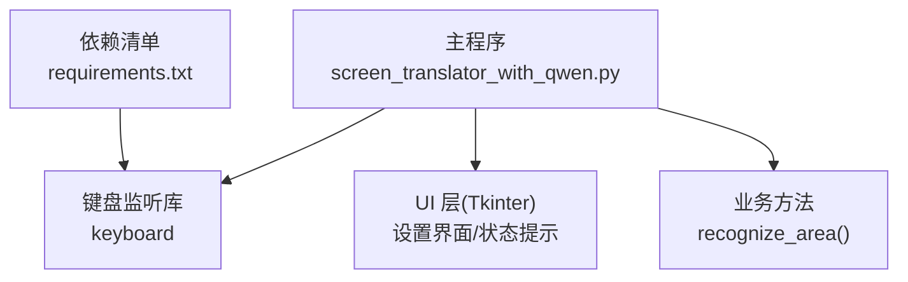
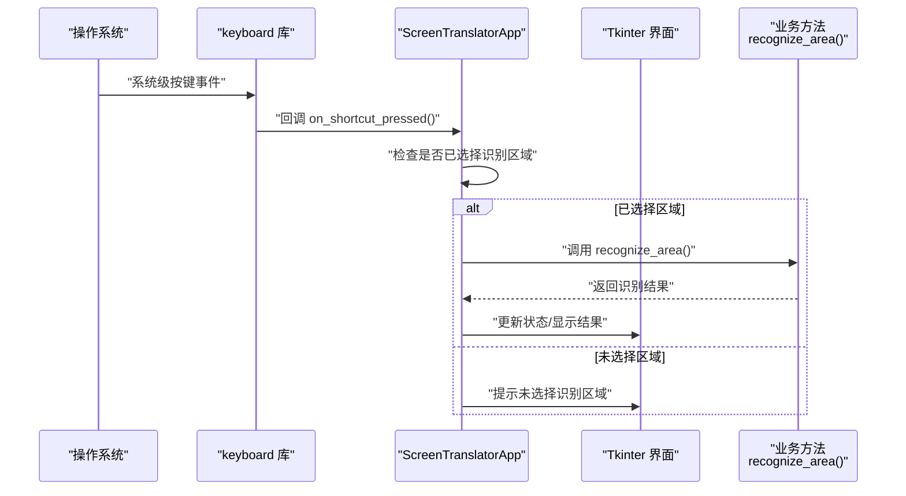
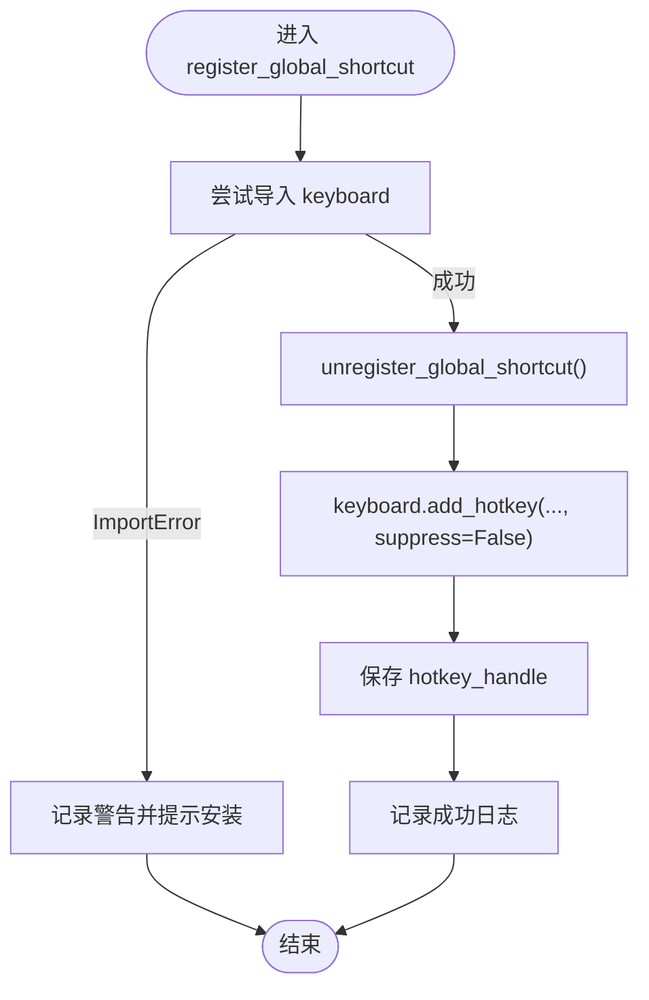
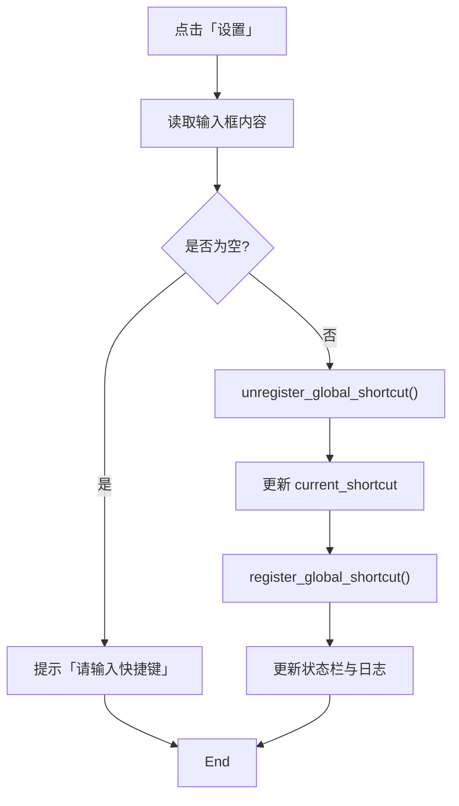
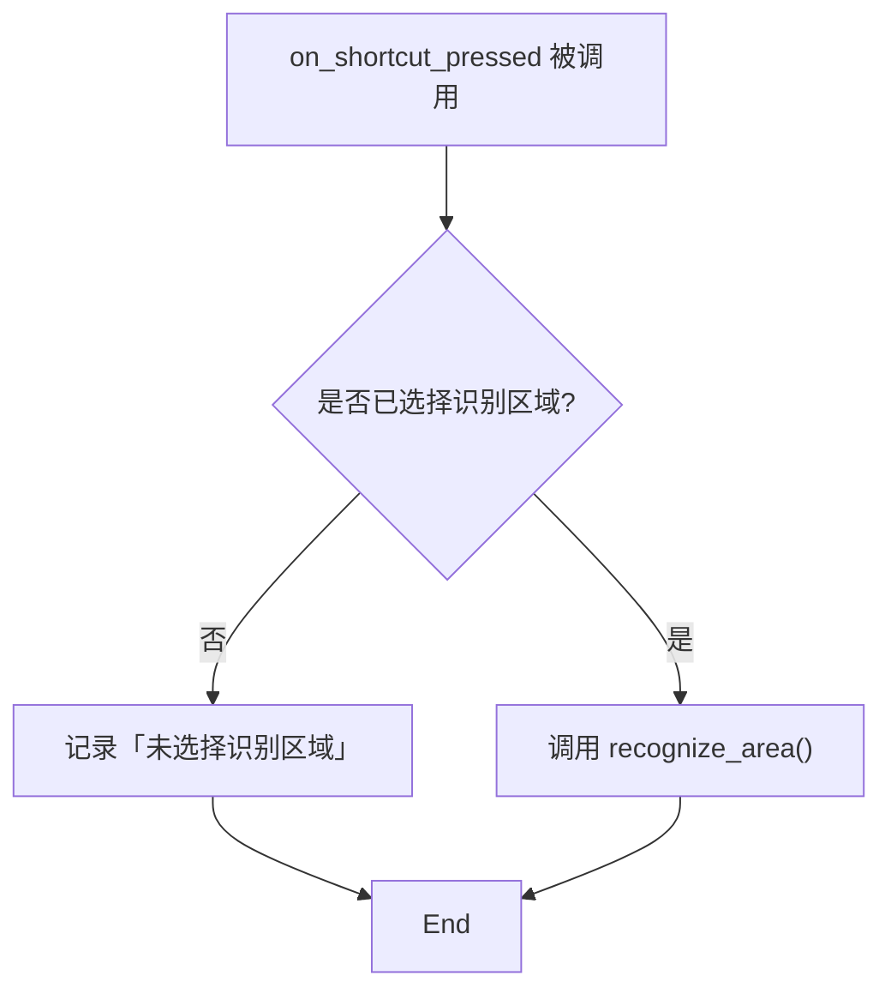
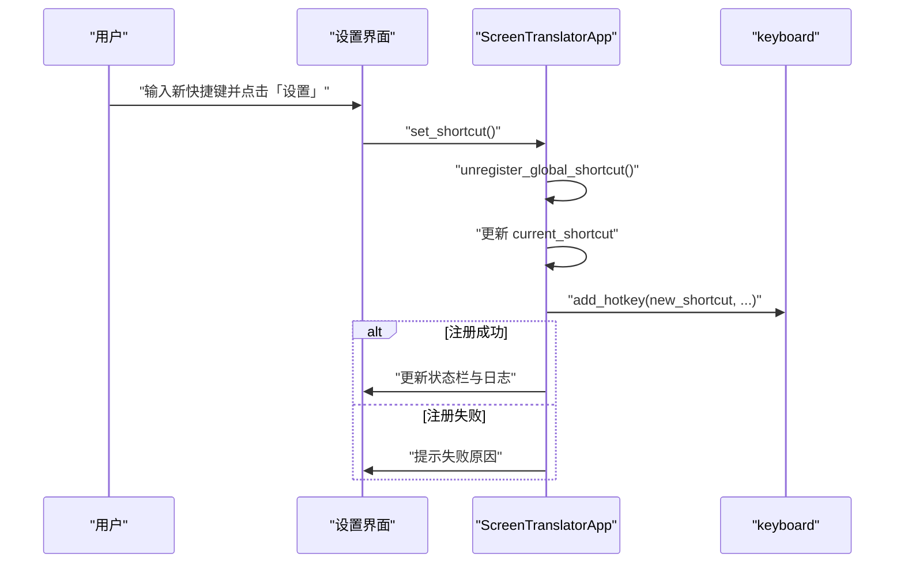
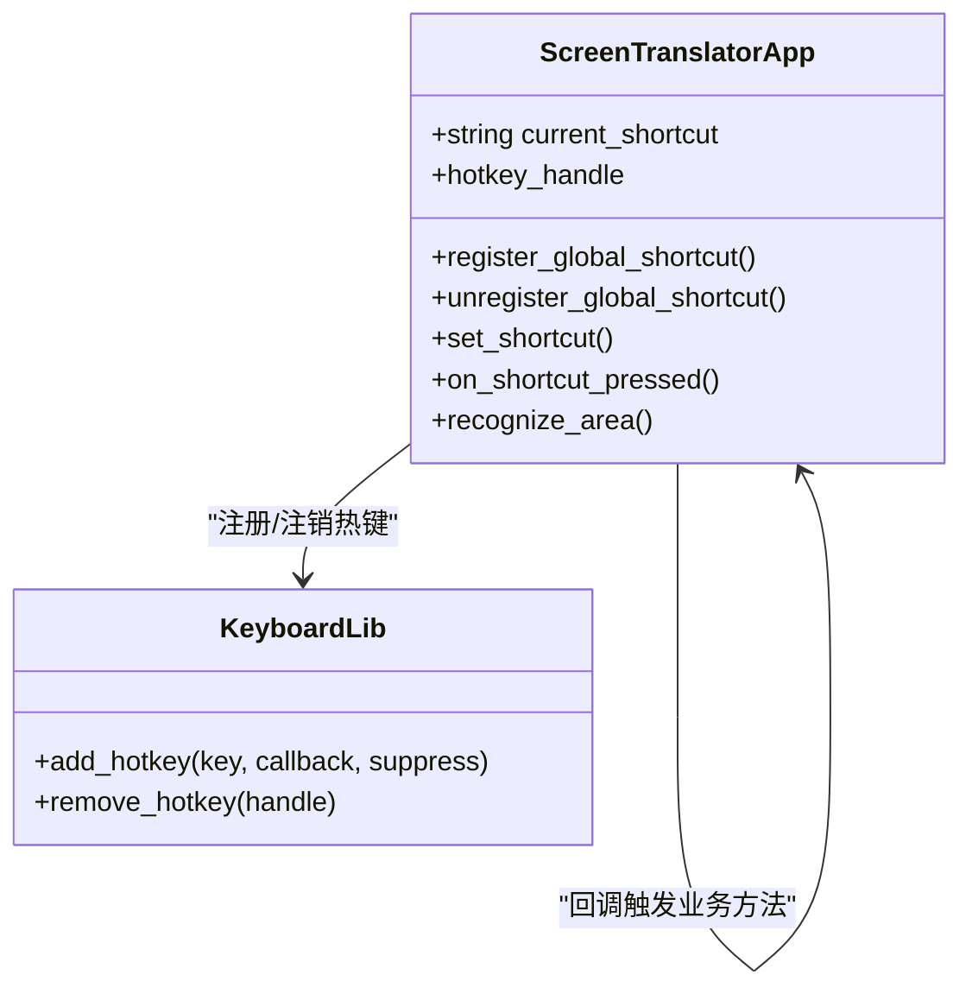

# 全局快捷键系统

<cite>
**本文引用的文件**   
- [screen_translator_with_qwen.py](file://screen_translator_with_qwen.py)
- [requirements.txt](file://requirements.txt)
</cite>

## 目录
1. [简介](#简介)
2. [项目结构](#项目结构)
3. [核心组件](#核心组件)
4. [架构总览](#架构总览)
5. [详细组件分析](#详细组件分析)
6. [依赖关系分析](#依赖关系分析)
7. [性能与稳定性考虑](#性能与稳定性考虑)
8. [故障排查指南](#故障排查指南)
9. [结论](#结论)
10. [附录：扩展开发指南与最佳实践](#附录扩展开发指南与最佳实践)

## 简介
本技术文档聚焦于“全局快捷键系统”，围绕 register_global_shortcut() 方法的实现原理、keyboard 库的使用与事件监听机制、快捷键配置界面（输入框绑定、验证逻辑、持久化存储）、事件捕获与处理流程（过滤、冲突检测、优先级管理）、跨平台兼容性、动态修改机制（热重载、即时生效、错误恢复）等方面进行系统化说明，并提供架构图与事件流程图以及扩展开发指南。

## 项目结构
本项目为单文件主程序 + 启动器 + 依赖清单的结构。全局快捷键功能集中在主程序的 UI 与业务类中，通过第三方库 keyboard 注册系统级热键，并在用户按下时触发应用内识别流程。

图表来源
- [screen_translator_with_qwen.py:547-573](file://screen_translator_with_qwen.py#L547-L573)
- [screen_translator_with_qwen.py:1734-1788](file://screen_translator_with_qwen.py#L1734-L1788)
- [requirements.txt:18-19](file://requirements.txt#L18-L19)

章节来源
- [screen_translator_with_qwen.py:547-573](file://screen_translator_with_qwen.py#L547-L573)
- [requirements.txt:18-19](file://requirements.txt#L18-L19)

## 核心组件
- 快捷键注册与注销
  - register_global_shortcut(): 使用 keyboard.add_hotkey 注册全局热键，保存句柄以便后续移除；若未安装 keyboard 库则给出友好提示。
  - unregister_global_shortcut(): 根据已保存的句柄调用 keyboard.remove_hotkey 安全注销。
- 快捷键设置入口
  - set_shortcut(): 从输入框读取新快捷键，先注销旧注册，再更新并重新注册。
- 快捷键回调
  - on_shortcut_pressed(): 当快捷键被按下时执行“重新识别”逻辑，若未选择识别区域则记录日志提示无效。
- UI 与状态
  - 快捷键设置区包含标签、输入框、设置按钮与提示文本；状态栏用于显示成功/失败信息。
- 资源清理
  - 窗口关闭时进行基础清理（如临时音频文件），但当前未显式在关闭路径中注销全局快捷键。

章节来源
- [screen_translator_with_qwen.py:547-573](file://screen_translator_with_qwen.py#L547-L573)
- [screen_translator_with_qwen.py:1734-1788](file://screen_translator_with_qwen.py#L1734-L1788)
- [screen_translator_with_qwen.py:2407-2412](file://screen_translator_with_qwen.py#L2407-L2412)

## 架构总览
下图展示了全局快捷键从系统到应用的端到端流程：操作系统将按键事件交由 keyboard 驱动层，再由 keyboard 回调应用注册的处理器，最终进入业务方法。

图表来源
- [screen_translator_with_qwen.py:1753-1788](file://screen_translator_with_qwen.py#L1753-L1788)

## 详细组件分析

### register_global_shortcut() 实现原理
- 关键步骤
  - 尝试导入 keyboard；若 ImportError，记录警告并提示用户安装。
  - 先调用 unregister_global_shortcut() 确保无残留注册。
  - 使用 keyboard.add_hotkey(current_shortcut, on_shortcut_pressed, suppress=False) 注册全局热键，suppress=False 表示不拦截该按键在其他应用中的行为。
  - 保存返回的 hotkey_handle，便于后续 remove_hotkey。
  - 异常捕获：对注册过程中的异常进行日志记录与 UI 提示。
- 设计要点
  - 幂等性：每次注册前先注销旧句柄，避免重复注册导致冲突或泄漏。
  - 可观测性：成功/失败均记录日志，并通过状态栏反馈给用户。
  - 非侵入式：suppress=False 保证与其他应用共享按键体验。

图表来源
- [screen_translator_with_qwen.py:1753-1768](file://screen_translator_with_qwen.py#L1753-L1768)

章节来源
- [screen_translator_with_qwen.py:1753-1768](file://screen_translator_with_qwen.py#L1753-L1768)

### 快捷键配置界面（输入框绑定、验证逻辑、持久化存储）
- 输入框绑定
  - 界面提供 Label、Entry、Button 三要素，默认值 F1，点击“设置”触发 set_shortcut。
- 验证逻辑
  - 读取 Entry 内容并去除空白；为空时提示“请输入快捷键”。
  - 未做更严格的格式校验（如组合键语法），具体合法性由 keyboard 库在 add_hotkey 时判定。
- 持久化存储
  - 当前实现未在运行时持久化 current_shortcut 到磁盘；重启后恢复为默认值。如需持久化，可在设置成功后写入配置文件，并在初始化时加载。

图表来源
- [screen_translator_with_qwen.py:547-563](file://screen_translator_with_qwen.py#L547-L563)
- [screen_translator_with_qwen.py:1734-1751](file://screen_translator_with_qwen.py#L1734-L1751)

章节来源
- [screen_translator_with_qwen.py:547-563](file://screen_translator_with_qwen.py#L547-L563)
- [screen_translator_with_qwen.py:1734-1751](file://screen_translator_with_qwen.py#L1734-L1751)

### 快捷键事件的捕获与处理流程（过滤、冲突检测、优先级管理）
- 事件捕获
  - keyboard 在系统层监听按键，匹配到 registered hotkey 即回调 on_shortcut_pressed。
- 事件过滤
  - 当前仅判断是否已选择识别区域；若无区域则直接忽略并记录日志。
- 冲突检测
  - 未实现显式的冲突检测；若与其他应用或系统快捷键冲突，取决于 keyboard 的行为与 suppress 参数。当前 suppress=False，不会抢占其他应用对该按键的处理。
- 优先级管理
  - 未实现多快捷键优先级队列；单一 hotkey 对应单一回调。

图表来源
- [screen_translator_with_qwen.py:1780-1788](file://screen_translator_with_qwen.py#L1780-L1788)

章节来源
- [screen_translator_with_qwen.py:1780-1788](file://screen_translator_with_qwen.py#L1780-L1788)

### 跨平台兼容性考虑
- 依赖声明
  - requirements.txt 明确引入 keyboard>=0.13.5，表明期望在 Windows/Linux/macOS 上均可工作。
- 行为差异
  - keyboard 在不同平台下底层实现不同（例如 Windows 使用低级钩子，Linux 可能需要 root 权限）。
  - 某些系统或环境可能限制全局热键注册（权限不足、沙箱环境、虚拟机等）。
- 适配方案
  - 在 ImportError 分支给出明确提示，引导用户安装依赖。
  - 建议在生产环境中增加权限检测与降级策略（如禁用全局热键并提示改用应用内快捷键）。

章节来源
- [requirements.txt:18-19](file://requirements.txt#L18-L19)
- [screen_translator_with_qwen.py:1763-1768](file://screen_translator_with_qwen.py#L1763-L1768)

### 动态修改机制（热重载、即时生效、错误恢复）
- 热重载与即时生效
  - set_shortcut 会先注销旧快捷键，再注册新快捷键，从而实现“即时生效”。
- 错误恢复
  - 注册失败时记录错误并更新状态栏；但未自动回滚到上一个可用快捷键。
  - 建议在失败时保留上一次有效的 current_shortcut 并提示用户重试。

图表来源
- [screen_translator_with_qwen.py:1734-1768](file://screen_translator_with_qwen.py#L1734-L1768)

章节来源
- [screen_translator_with_qwen.py:1734-1768](file://screen_translator_with_qwen.py#L1734-L1768)

## 依赖关系分析
- 外部依赖
  - keyboard：负责系统级键盘事件监听与热键注册。
- 内部耦合
  - ScreenTranslatorApp 持有 hotkey_handle 与 current_shortcut，集中管理生命周期。
  - 回调 on_shortcut_pressed 直接调用业务方法 recognize_area()，形成“UI -> 快捷键 -> 业务”的直连链路。

图表来源
- [screen_translator_with_qwen.py:1753-1788](file://screen_translator_with_qwen.py#L1753-L1788)

章节来源
- [screen_translator_with_qwen.py:1753-1788](file://screen_translator_with_qwen.py#L1753-L1788)

## 性能与稳定性考虑
- 事件分发
  - keyboard 回调在主线程中触发；若业务方法耗时较长，应避免阻塞 UI 响应。建议将耗时操作放入后台线程，并通过 Tkinter 的 after 机制更新 UI。
- 资源释放
  - 当前窗口关闭路径未显式注销全局快捷键，可能导致进程退出后仍残留系统级监听。建议在 on_window_close 中调用 unregister_global_shortcut。
- 异常隔离
  - 在 on_shortcut_pressed 中对业务方法调用增加 try/except，防止异常冒泡影响后续热键可用性。

[本节为通用指导，无需特定文件引用]

## 故障排查指南
- 常见问题
  - 未安装 keyboard 库：运行时报 ImportError。解决：按提示安装依赖。
  - 注册失败：可能是权限不足或快捷键已被占用。解决：以管理员权限运行或更换快捷键。
  - 快捷键无效：未选择识别区域。解决：先选择识别区域后再触发快捷键。
- 定位手段
  - 查看状态栏提示信息与日志输出，确认注册/注销与回调执行情况。
  - 检查 requirements.txt 是否正确引入 keyboard。

章节来源
- [screen_translator_with_qwen.py:1763-1768](file://screen_translator_with_qwen.py#L1763-L1768)
- [screen_translator_with_qwen.py:1780-1788](file://screen_translator_with_qwen.py#L1780-L1788)
- [requirements.txt:18-19](file://requirements.txt#L18-L19)

## 结论
该项目的全局快捷键系统基于 keyboard 库实现，具备“设置-注册-回调-业务”的清晰链路，支持运行时动态修改并即时生效。当前实现简洁实用，但在持久化、冲突检测、错误恢复与资源清理方面仍有改进空间。建议补充配置持久化、增强异常处理与关闭时的资源回收，以提升鲁棒性与用户体验。

[本节为总结性内容，无需特定文件引用]

## 附录：扩展开发指南与最佳实践
- 新增快捷键类型
  - 在现有 single-hotkey 基础上，可扩展组合键（如 Ctrl+Alt+F1）或多键序列，注意在 set_shortcut 中增加输入校验与冲突提示。
- 持久化配置
  - 在 set_shortcut 成功后将 current_shortcut 写入本地配置文件（如 JSON/YAML），并在应用启动时加载，实现跨会话保持。
- 冲突检测与优先级
  - 维护一个快捷键注册表，注册前检测是否与已有快捷键冲突；必要时引入优先级字段，决定回调顺序。
- 错误恢复
  - 注册失败时回滚到上一有效快捷键，并提示用户；在 on_window_close 中统一注销所有热键。
- 跨平台适配
  - 针对不同平台进行能力探测（如权限、是否支持全局监听），在不满足条件时优雅降级为应用内快捷键。
- 性能优化
  - 将耗时任务异步化，避免阻塞 UI；对频繁触发的热键增加防抖/节流策略。

[本节为概念性指导，无需特定文件引用]