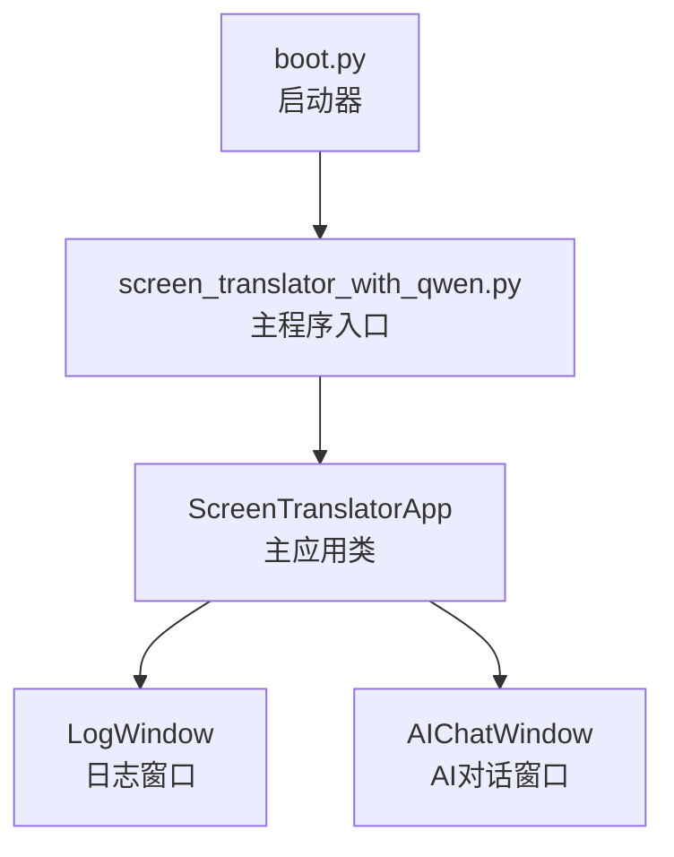
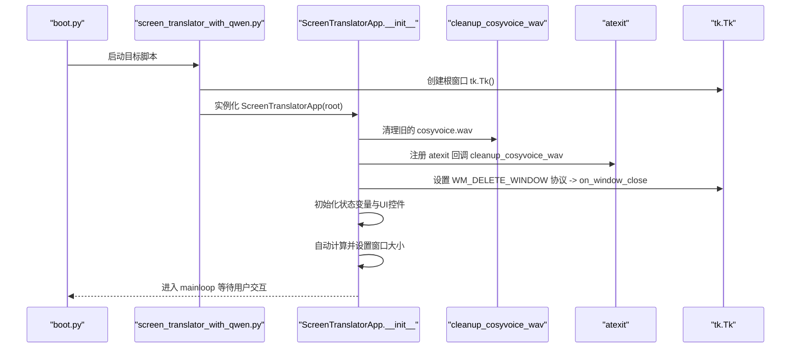
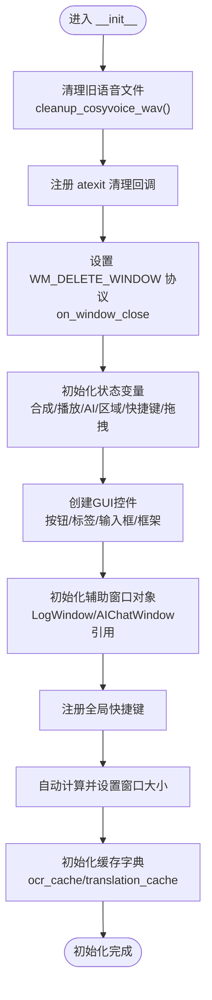
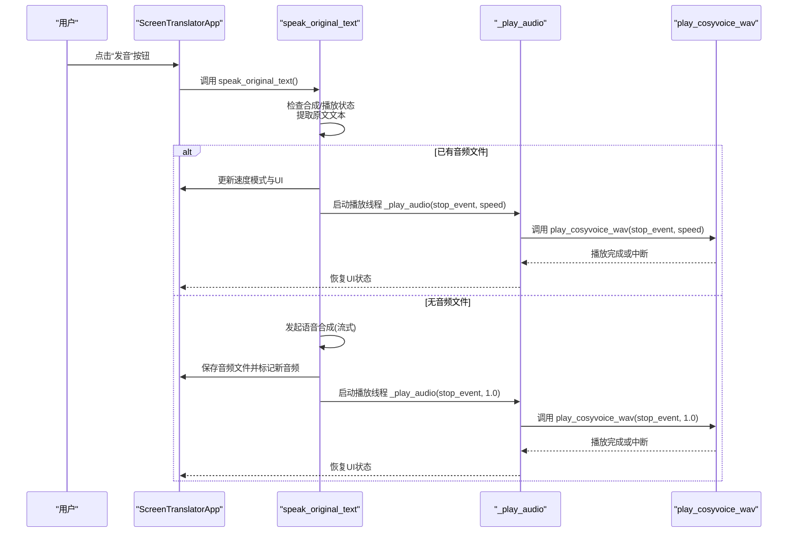
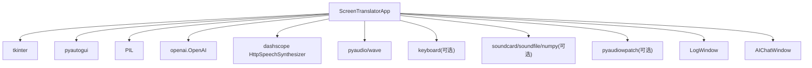

# 初始化与生命周期管理

<cite>
**本文引用的文件**
- [screen_translator_with_qwen.py](file://screen_translator_with_qwen.py)
- [boot.py](file://boot.py)
</cite>

## 目录
1. [简介](#简介)
2. [项目结构](#项目结构)
3. [核心组件](#核心组件)
4. [架构总览](#架构总览)
5. [详细组件分析](#详细组件分析)
6. [依赖关系分析](#依赖关系分析)
7. [性能考虑](#性能考虑)
8. [故障排查指南](#故障排查指南)
9. [结论](#结论)

## 简介
本文件聚焦于 ScreenTranslatorApp 类的初始化与生命周期管理，系统性解析 __init__ 的完整流程、GUI 组件创建、状态变量设计、事件绑定机制，以及程序启动时的清理工作（cleanup_cosyvoice_wav）、atexit 注册、窗口关闭协议设置。同时解释语音合成状态、播放速度控制、AI 交互控制、窗口拖动/拉伸相关变量的作用与设计目的，并提供初始化流程图与关键方法调用关系图，帮助读者快速理解并正确扩展该应用的生命周期行为。

## 项目结构
本项目采用单文件主应用 + 辅助窗口的组织方式：
- 主应用类 ScreenTranslatorApp 负责界面布局、区域选择、翻译显示、语音合成与播放、全局快捷键等核心逻辑。
- 辅助窗口 LogWindow 提供日志查看能力；AIChatWindow 提供 AI 对话窗口。
- boot.py 为通用启动器，负责虚拟环境校验与目标脚本后台启动（无控制台）。

图表来源
- [boot.py:256-279](file://boot.py#L256-L279)
- [screen_translator_with_qwen.py:2413-2417](file://screen_translator_with_qwen.py#L2413-L2417)

章节来源
- [boot.py:256-279](file://boot.py#L256-L279)
- [screen_translator_with_qwen.py:2413-2417](file://screen_translator_with_qwen.py#L2413-L2417)

## 核心组件
- ScreenTranslatorApp：主应用类，封装了 GUI 初始化、区域选择、翻译显示、语音合成与播放、全局快捷键、窗口拖拽/拉伸等。
- LogWindow：独立日志窗口，通过队列异步消费日志消息。
- AIChatWindow：独立 AI 对话窗口，支持发送消息、捕获原文、错误提示等。

章节来源
- [screen_translator_with_qwen.py:34-100](file://screen_translator_with_qwen.py#L34-L100)
- [screen_translator_with_qwen.py:101-300](file://screen_translator_with_qwen.py#L101-L300)
- [screen_translator_with_qwen.py:475-634](file://screen_translator_with_qwen.py#L475-L634)

## 架构总览
下图展示了应用启动到主窗口初始化的关键路径，包括清理旧音频文件、注册退出清理、设置窗口关闭协议、创建 UI 控件、自动调整窗口尺寸、缓存初始化等步骤。

图表来源
- [boot.py:256-279](file://boot.py#L256-L279)
- [screen_translator_with_qwen.py:363-371](file://screen_translator_with_qwen.py#L363-L371)
- [screen_translator_with_qwen.py:475-634](file://screen_translator_with_qwen.py#L475-L634)
- [screen_translator_with_qwen.py:2407-2412](file://screen_translator_with_qwen.py#L2407-L2412)

## 详细组件分析

### ScreenTranslatorApp 初始化流程详解
- 清理与退出保护
  - 启动时立即清理旧的语音文件，避免历史残留影响新任务。
  - 使用 atexit.register 注册清理函数，确保进程正常退出时也能删除临时文件。
  - 设置窗口关闭协议 WM_DELETE_WINDOW，将关闭动作指向自定义清理方法，保证资源释放顺序可控。
- GUI 组件创建
  - 标题、按钮、标签、输入框等控件按功能分组创建并 pack 布局。
  - 初始化日志窗口对象，便于后续展示运行日志。
  - 初始化 AI 对话窗口引用，延迟创建实际窗口实例。
- 状态变量初始化
  - 语音合成与播放：synthesizing、playing、play_stop_event、play_thread、speed_mode、is_new_audio。
  - AI 交互控制：ai_interaction_active、current_request、translating。
  - 区域选择与翻译显示：识别区域与译文区域的坐标、选择状态、窗口句柄等。
  - 快捷键：当前快捷键字符串、注册句柄。
  - 窗口拖动/拉伸：主窗口与无边框窗口的拖拽/缩放标志、起始坐标、边缘方向等。
- 事件绑定与快捷键
  - 在初始化阶段注册全局快捷键（如 F1），用于触发重新识别。
  - 绑定窗口关闭协议，统一处理关闭时的清理逻辑。
- 窗口尺寸自适应
  - 先让控件自然布局，再读取实际宽高，增加边距后设置最终窗口几何尺寸，提升首次渲染体验。
- 缓存初始化
  - 初始化 OCR 与翻译结果缓存字典，减少重复请求或提高一致性。

图表来源
- [screen_translator_with_qwen.py:363-371](file://screen_translator_with_qwen.py#L363-L371)
- [screen_translator_with_qwen.py:475-634](file://screen_translator_with_qwen.py#L475-L634)
- [screen_translator_with_qwen.py:2407-2412](file://screen_translator_with_qwen.py#L2407-L2412)

章节来源
- [screen_translator_with_qwen.py:363-371](file://screen_translator_with_qwen.py#L363-L371)
- [screen_translator_with_qwen.py:475-634](file://screen_translator_with_qwen.py#L475-L634)
- [screen_translator_with_qwen.py:2407-2412](file://screen_translator_with_qwen.py#L2407-L2412)

### 状态变量设计与作用
- 语音合成与播放
  - synthesizing：标记是否正在合成语音，防止重复触发。
  - playing：标记是否正在播放音频，用于停止/切换播放。
  - play_stop_event：线程间通信的事件对象，用于安全中断播放。
  - play_thread：播放线程引用，便于 join 或检测存活。
  - speed_mode：播放速度模式（0=正常速度，1=0.75倍速），点击发音按钮循环切换。
  - is_new_audio：标记是否为“新音频”，用于重置速度模式与状态。
- 播放速度控制
  - 通过 speed_mode 与 is_new_audio 配合，在新音频生成后默认以正常速度播放，并在后续点击中切换速度。
- AI 交互控制
  - ai_interaction_active：标识识别/翻译交互是否活跃，用于中止操作。
  - current_request：保存当前请求上下文（若需要取消网络请求可在此扩展）。
  - translating：标识翻译流程是否进行中，用于中止与UI更新。
- 窗口拖动与拉伸
  - dragging/resizing/drag_start_x/y/resize_start_x/y/resize_edge：主窗口拖拽/缩放状态与参数。
  - border_window_dragging/border_window_resizing/border_drag_start_x/y/border_resize_start_x/y/border_resize_edge：无边框窗口（识别/翻译窗口）的拖拽/缩放状态与参数。
  - 这些变量配合 get_window_edge、get_cursor_for_edge、move_window、resize_window 等方法实现流畅的拖拽与缩放体验。

章节来源
- [screen_translator_with_qwen.py:475-634](file://screen_translator_with_qwen.py#L475-L634)
- [screen_translator_with_qwen.py:1558-1569](file://screen_translator_with_qwen.py#L1558-L1569)
- [screen_translator_with_qwen.py:1570-1608](file://screen_translator_with_qwen.py#L1570-L1608)
- [screen_translator_with_qwen.py:1610-1703](file://screen_translator_with_qwen.py#L1610-L1703)

### 关键方法调用关系图
以下序列图展示了从点击“发音”到合成与播放的关键调用链，体现状态变量与线程协作。

图表来源
- [screen_translator_with_qwen.py:1442-1557](file://screen_translator_with_qwen.py#L1442-L1557)
- [screen_translator_with_qwen.py:1558-1569](file://screen_translator_with_qwen.py#L1558-L1569)
- [screen_translator_with_qwen.py:372-473](file://screen_translator_with_qwen.py#L372-L473)

章节来源
- [screen_translator_with_qwen.py:1442-1557](file://screen_translator_with_qwen.py#L1442-L1557)
- [screen_translator_with_qwen.py:1558-1569](file://screen_translator_with_qwen.py#L1558-L1569)
- [screen_translator_with_qwen.py:372-473](file://screen_translator_with_qwen.py#L372-L473)

### 初始化模式示例（代码片段路径）
- 清理与退出保护
  - [清理旧语音文件:363-371](file://screen_translator_with_qwen.py#L363-L371)
  - [注册 atexit 清理回调:483-484](file://screen_translator_with_qwen.py#L483-L484)
  - [设置窗口关闭协议:485-485](file://screen_translator_with_qwen.py#L485-L485)
- GUI 控件创建
  - [标题与按钮创建:502-542](file://screen_translator_with_qwen.py#L502-L542)
  - [快捷键区域与状态标签:548-567](file://screen_translator_with_qwen.py#L548-L567)
- 状态变量初始化
  - [语音合成与播放状态:487-495](file://screen_translator_with_qwen.py#L487-L495)
  - [AI 交互控制变量:599-603](file://screen_translator_with_qwen.py#L599-L603)
  - [窗口拖动/拉伸变量:608-622](file://screen_translator_with_qwen.py#L608-L622)
- 事件绑定与快捷键
  - [注册全局快捷键:572-573](file://screen_translator_with_qwen.py#L572-L573)
  - [设置窗口关闭协议:485-485](file://screen_translator_with_qwen.py#L485-L485)
- 窗口尺寸自适应
  - [自动调整窗口大小:624-629](file://screen_translator_with_qwen.py#L624-L629)
- 缓存初始化
  - [OCR与翻译缓存:631-633](file://screen_translator_with_qwen.py#L631-L633)

## 依赖关系分析
- 外部库与可选依赖
  - tkinter：GUI 框架。
  - pyautogui：屏幕截图。
  - PIL：图像处理。
  - openai：通义千问客户端。
  - dashscope.audio.http_tts：语音合成服务。
  - pyaudio/wave：音频播放。
  - keyboard：全局快捷键（可选）。
  - soundcard/soundfile/numpy/pyaudiowpatch：系统音频录制（可选）。
- 模块内依赖
  - ScreenTranslatorApp 依赖 LogWindow 与 AIChatWindow 作为辅助窗口。
  - 语音合成与播放链路依赖 play_cosyvoice_wav 与 _play_audio。
  - 快捷键注册依赖 keyboard 库，失败时降级提示。

图表来源
- [screen_translator_with_qwen.py:1-20](file://screen_translator_with_qwen.py#L1-L20)
- [screen_translator_with_qwen.py:314-336](file://screen_translator_with_qwen.py#L314-L336)
- [screen_translator_with_qwen.py:348-360](file://screen_translator_with_qwen.py#L348-L360)
- [screen_translator_with_qwen.py:475-634](file://screen_translator_with_qwen.py#L475-L634)

章节来源
- [screen_translator_with_qwen.py:1-20](file://screen_translator_with_qwen.py#L1-L20)
- [screen_translator_with_qwen.py:314-336](file://screen_translator_with_qwen.py#L314-L336)
- [screen_translator_with_qwen.py:348-360](file://screen_translator_with_qwen.py#L348-L360)
- [screen_translator_with_qwen.py:475-634](file://screen_translator_with_qwen.py#L475-L634)

## 性能考虑
- 音频播放线程化：播放与合成均使用独立线程，避免阻塞主事件循环，提升响应性。
- 变速重采样：在播放前进行线性插值重采样，兼顾速度与音质平衡。
- 最小化UI刷新：仅在关键节点（开始/结束/错误）更新状态标签，降低频繁重绘开销。
- 快捷键与事件：全局快捷键注册失败时降级提示，不影响主流程。

[本节为通用指导，不直接分析具体文件]

## 故障排查指南
- 无法录制系统音频
  - 可能原因：缺少依赖、蓝牙耳机不支持环回、未启用立体声混音。
  - 建议方案：安装 pyaudiowpatch、切换到内置扬声器或有线耳机、启用 Windows 立体声混音。
- 全局快捷键无效
  - 可能原因：keyboard 库未安装或注册失败。
  - 建议方案：安装 keyboard 库，检查权限与冲突键位。
- 语音合成失败
  - 可能原因：API密钥无效、网络异常、文本过长。
  - 建议方案：检查 key.txt 配置、重试网络、限制文本长度。
- 窗口关闭后资源未释放
  - 可能原因：未正确触发 on_window_close 或 atexit 清理。
  - 建议方案：确认 WM_DELETE_WINDOW 协议已设置，检查清理函数执行。

章节来源
- [screen_translator_with_qwen.py:1789-1851](file://screen_translator_with_qwen.py#L1789-L1851)
- [screen_translator_with_qwen.py:1753-1778](file://screen_translator_with_qwen.py#L1753-L1778)
- [screen_translator_with_qwen.py:1498-1556](file://screen_translator_with_qwen.py#L1498-L1556)
- [screen_translator_with_qwen.py:2407-2412](file://screen_translator_with_qwen.py#L2407-L2412)

## 结论
ScreenTranslatorApp 的初始化流程清晰且健壮：通过启动时清理、退出保护、协议绑定、控件创建、状态初始化、事件绑定与窗口自适应，构建了稳定的应用骨架。状态变量设计覆盖了语音合成/播放、AI 交互、区域选择与窗口交互等关键维度，配合线程化与事件驱动，保证了良好的用户体验与可扩展性。建议在后续迭代中继续完善错误处理与资源回收策略，进一步提升稳定性与可维护性。