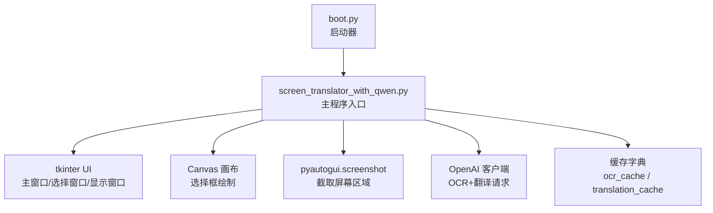
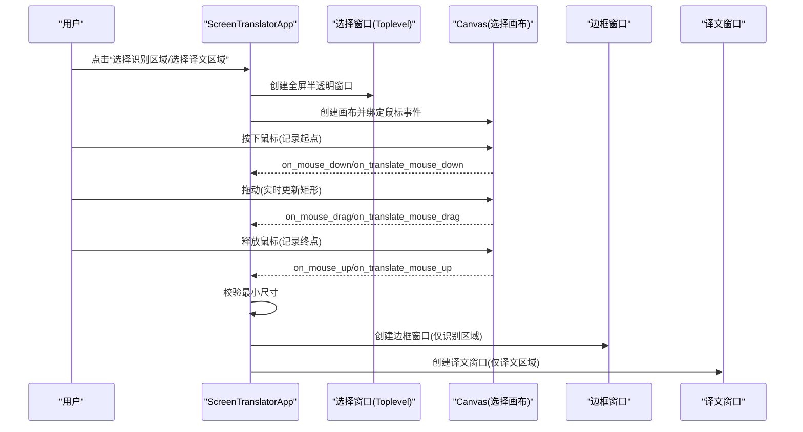
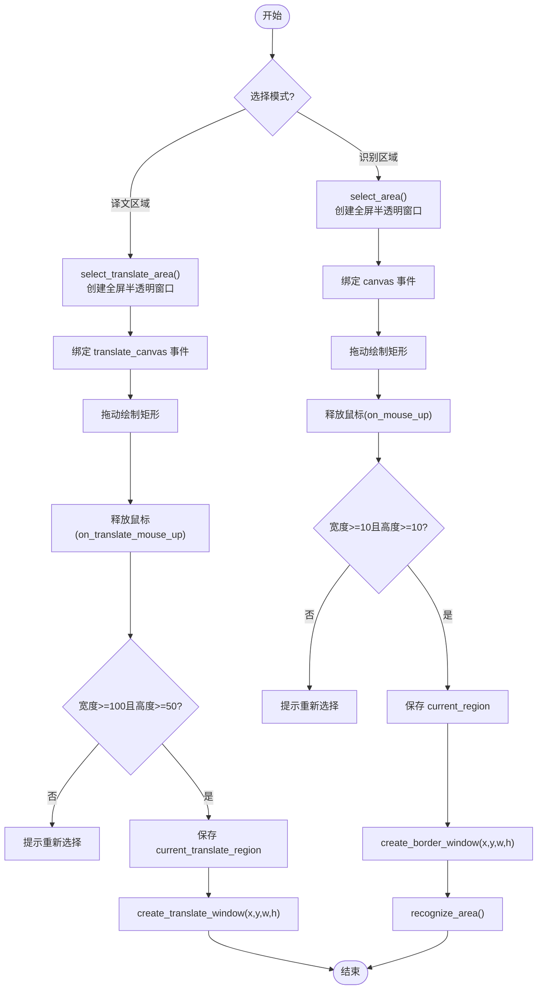
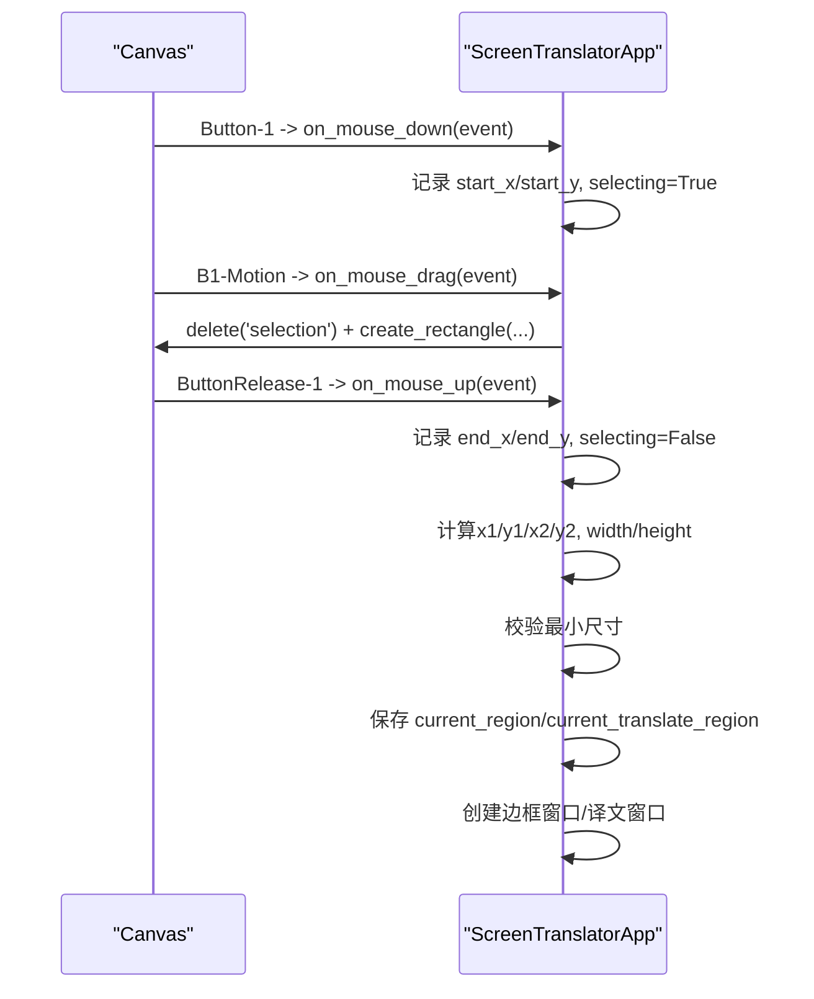
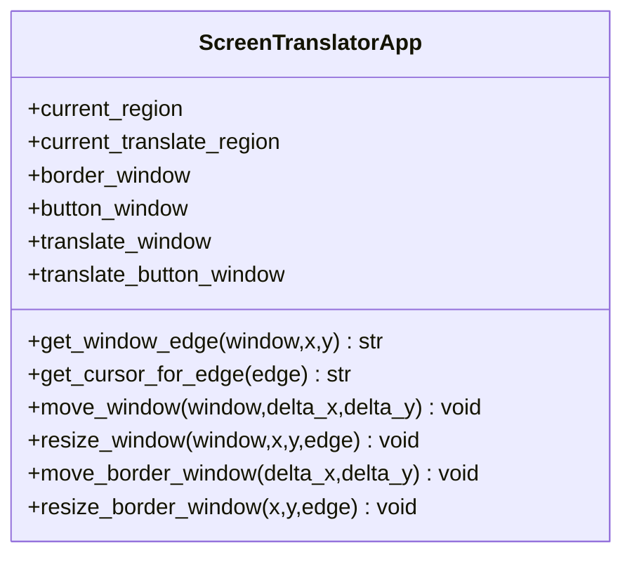
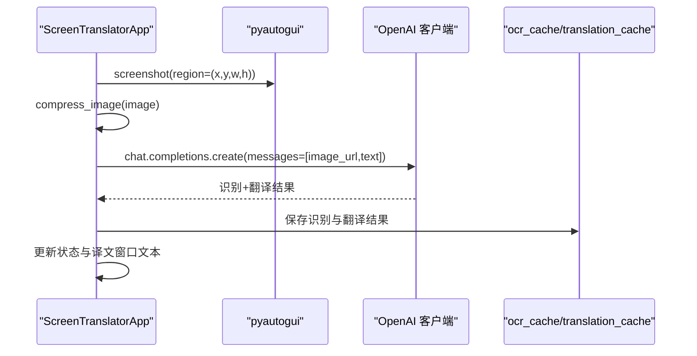
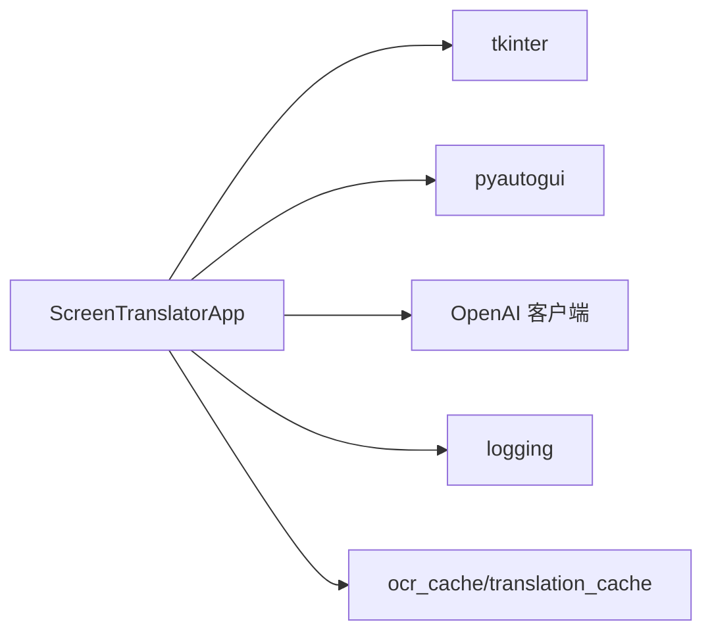

# 区域选择系统

<cite>
**本文引用的文件**   
- [screen_translator_with_qwen.py](file://screen_translator_with_qwen.py)
- [boot.py](file://boot.py)
</cite>

## 目录
1. [简介](#简介)
2. [项目结构](#项目结构)
3. [核心组件](#核心组件)
4. [架构总览](#架构总览)
5. [详细组件分析](#详细组件分析)
6. [依赖关系分析](#依赖关系分析)
7. [性能与可用性考量](#性能与可用性考量)
8. [故障排查指南](#故障排查指南)
9. [结论](#结论)

## 简介
本技术文档聚焦于“区域选择系统”，深入解释识别区域与翻译区域的双重选择机制，包括 select_area() 与 select_translate_area() 的实现原理；详细说明全屏半透明选择窗口的创建过程、Canvas 画布的事件绑定（鼠标按下、拖动、释放）；阐述坐标计算逻辑（起始点/结束点确定、矩形绘制与验证）、区域有效性检查（最小尺寸限制）与错误处理机制；并提供完整的流程图、鼠标事件时序图以及与其他组件的交互关系。最后给出实际代码示例路径，帮助读者快速定位实现细节。

## 项目结构
本项目采用单文件主程序组织方式，核心功能集中在一个类中，通过 tkinter 构建 UI，结合 pyautogui 进行截图，使用通义千问 API 完成 OCR 与翻译。启动器 boot.py 负责自动管理虚拟环境与依赖安装，并以无控制台窗口方式启动目标程序。

图表来源
- [boot.py:256-279](file://boot.py#L256-L279)
- [screen_translator_with_qwen.py:474-630](file://screen_translator_with_qwen.py#L474-L630)

章节来源
- [boot.py:256-279](file://boot.py#L256-L279)
- [screen_translator_with_qwen.py:474-630](file://screen_translator_with_qwen.py#L474-L630)

## 核心组件
- ScreenTranslatorApp：主应用类，封装所有区域选择、窗口管理、识别与翻译流程。
- 选择窗口：全屏半透明 Toplevel + Canvas，用于用户拖拽选择矩形区域。
- 边框窗口：覆盖识别区域的半透明蒙版 + 红色边框 + 控制按钮（重新识别）。
- 译文窗口：显示翻译结果与原文，支持拖拽与缩放，附带发音按钮窗口。
- 事件处理器：鼠标按下/移动/释放、ESC 取消、边缘检测与光标切换。
- 状态与标志：ai_interaction_active、translating、selecting 等，用于并发与中止控制。
- 缓存：ocr_cache 与 translation_cache，避免重复调用 API。

章节来源
- [screen_translator_with_qwen.py:474-630](file://screen_translator_with_qwen.py#L474-L630)
- [screen_translator_with_qwen.py:635-713](file://screen_translator_with_qwen.py#L635-L713)
- [screen_translator_with_qwen.py:781-858](file://screen_translator_with_qwen.py#L781-L858)
- [screen_translator_with_qwen.py:859-926](file://screen_translator_with_qwen.py#L859-L926)
- [screen_translator_with_qwen.py:1268-1409](file://screen_translator_with_qwen.py#L1268-L1409)
- [screen_translator_with_qwen.py:1611-1703](file://screen_translator_with_qwen.py#L1611-L1703)
- [screen_translator_with_qwen.py:1704-1733](file://screen_translator_with_qwen.py#L1704-L1733)
- [screen_translator_with_qwen.py:1207-1213](file://screen_translator_with_qwen.py#L1207-L1213)

## 架构总览
区域选择系统由“选择阶段”和“展示阶段”组成：
- 选择阶段：用户在全屏半透明窗口上拖拽选择矩形区域，Canvas 实时绘制白色矩形框；释放后校验最小尺寸并保存区域坐标。
- 展示阶段：根据选择区域创建无边框、置顶、半透明的显示窗口（或边框蒙版），并在其上方放置控制按钮窗口。

图表来源
- [screen_translator_with_qwen.py:635-713](file://screen_translator_with_qwen.py#L635-L713)
- [screen_translator_with_qwen.py:781-858](file://screen_translator_with_qwen.py#L781-L858)
- [screen_translator_with_qwen.py:859-926](file://screen_translator_with_qwen.py#L859-L926)

## 详细组件分析

### 双重选择机制：识别区域 vs 译文区域
- 译文区域选择：select_translate_area() 创建全屏半透明窗口 translate_select_window，绑定 translate_canvas 的鼠标事件，最终保存 current_translate_region 并创建译文窗口 create_translate_window()。
- 识别区域选择：select_area() 创建全屏半透明窗口 select_window，绑定 canvas 的鼠标事件，最终保存 current_region 并创建边框窗口 create_border_window()，随后触发 recognize_area()。

图表来源
- [screen_translator_with_qwen.py:635-713](file://screen_translator_with_qwen.py#L635-L713)
- [screen_translator_with_qwen.py:781-858](file://screen_translator_with_qwen.py#L781-L858)
- [screen_translator_with_qwen.py:859-926](file://screen_translator_with_qwen.py#L859-L926)

章节来源
- [screen_translator_with_qwen.py:635-713](file://screen_translator_with_qwen.py#L635-L713)
- [screen_translator_with_qwen.py:781-858](file://screen_translator_with_qwen.py#L781-L858)
- [screen_translator_with_qwen.py:859-926](file://screen_translator_with_qwen.py#L859-L926)

### 全屏半透明选择窗口创建
- 创建 Toplevel 子窗口，设置 -fullscreen、-alpha=0.3、-topmost=True，背景黑色。
- 在子窗口内创建 Canvas，设置十字光标，填充整个窗口。
- 绑定鼠标事件：<Button-1>、<B1-Motion>、<ButtonRelease-1>，以及 <Escape> 取消。

章节来源
- [screen_translator_with_qwen.py:635-663](file://screen_translator_with_qwen.py#L635-L663)
- [screen_translator_with_qwen.py:781-809](file://screen_translator_with_qwen.py#L781-L809)

### Canvas 画布事件绑定机制
- 按下事件：记录起始坐标 (start_x, start_y)，设置 selecting = True。
- 拖动事件：若正在选择，删除旧矩形，用 create_rectangle 绘制新矩形（标签 selection）。
- 释放事件：记录结束坐标 (end_x, end_y)，设置 selecting = False；计算 x1/y1/x2/y2 并求宽高；关闭选择窗口；校验最小尺寸；保存区域；创建对应显示窗口。

图表来源
- [screen_translator_with_qwen.py:810-858](file://screen_translator_with_qwen.py#L810-L858)
- [screen_translator_with_qwen.py:664-713](file://screen_translator_with_qwen.py#L664-L713)

章节来源
- [screen_translator_with_qwen.py:810-858](file://screen_translator_with_qwen.py#L810-L858)
- [screen_translator_with_qwen.py:664-713](file://screen_translator_with_qwen.py#L664-L713)

### 坐标计算与矩形绘制验证
- 坐标顺序校正：x1=min(start,end), y1=min(start,end), x2=max(start,end), y2=max(start,end)。
- 宽高计算：width=x2-x1, height=y2-y1。
- 最小尺寸限制：
  - 识别区域：width<10 或 height<10 视为太小。
  - 译文区域：width<100 或 height<50 视为太小。
- 失败分支：提示“选择区域太小，请重新选择”。

章节来源
- [screen_translator_with_qwen.py:825-858](file://screen_translator_with_qwen.py#L825-L858)
- [screen_translator_with_qwen.py:679-713](file://screen_translator_with_qwen.py#L679-L713)

### 区域有效性检查与错误处理
- 选择阶段：最小尺寸校验；异常捕获并更新状态标签。
- 识别阶段：线程内执行，使用 ai_interaction_active 标志防止重复与中止；UI 更新通过 root.after 安全调度；异常时更新状态与日志。
- 翻译阶段：从缓存读取翻译结果；若未命中则返回空字符串；异常时更新状态与日志。
- ESC 取消：销毁选择窗口并重置状态。

章节来源
- [screen_translator_with_qwen.py:927-1021](file://screen_translator_with_qwen.py#L927-L1021)
- [screen_translator_with_qwen.py:1022-1097](file://screen_translator_with_qwen.py#L1022-L1097)
- [screen_translator_with_qwen.py:1724-1733](file://screen_translator_with_qwen.py#L1724-L1733)

### 窗口交互：拖拽与缩放
- 边缘检测：get_window_edge(window,x,y) 基于阈值判断八个方向（nw/sw/ne/se/w/e/n/s）。
- 光标映射：get_cursor_for_edge(edge) 返回对应 resize 光标。
- 拖拽：move_window/move_border_window 更新几何位置，并联动按钮窗口位置。
- 缩放：resize_window/resize_border_window 按边缘调整宽高与位置，带灵敏度系数与最小尺寸限制。

图表来源
- [screen_translator_with_qwen.py:1611-1703](file://screen_translator_with_qwen.py#L1611-L1703)
- [screen_translator_with_qwen.py:1311-1409](file://screen_translator_with_qwen.py#L1311-L1409)

章节来源
- [screen_translator_with_qwen.py:1611-1703](file://screen_translator_with_qwen.py#L1611-L1703)
- [screen_translator_with_qwen.py:1311-1409](file://screen_translator_with_qwen.py#L1311-L1409)

### 与识别/翻译组件的交互
- 识别流程：recognize_area() 截屏 -> 压缩图像 -> 调用 recognize_with_qwen(image) -> 解析结果 -> 写入缓存 -> 更新 UI。
- 翻译流程：translate_text(text) -> translate_with_qwen(text) 从缓存读取 -> 更新译文窗口文本。
- 中止控制：abort_ai_interaction() 设置 ai_interaction_active/translating 为 False，并更新 UI。

图表来源
- [screen_translator_with_qwen.py:927-1021](file://screen_translator_with_qwen.py#L927-L1021)
- [screen_translator_with_qwen.py:1098-1248](file://screen_translator_with_qwen.py#L1098-L1248)
- [screen_translator_with_qwen.py:1249-1267](file://screen_translator_with_qwen.py#L1249-L1267)

章节来源
- [screen_translator_with_qwen.py:927-1021](file://screen_translator_with_qwen.py#L927-L1021)
- [screen_translator_with_qwen.py:1098-1248](file://screen_translator_with_qwen.py#L1098-L1248)
- [screen_translator_with_qwen.py:1249-1267](file://screen_translator_with_qwen.py#L1249-L1267)

### 实际代码示例路径（不直接粘贴代码）
- 译文区域选择入口与事件绑定：[select_translate_area:635-663](file://screen_translator_with_qwen.py#L635-L663)、[on_translate_mouse_down:664-669](file://screen_translator_with_qwen.py#L664-L669)、[on_translate_mouse_drag:670-678](file://screen_translator_with_qwen.py#L670-L678)、[on_translate_mouse_up:679-713](file://screen_translator_with_qwen.py#L679-L713)
- 识别区域选择入口与事件绑定：[select_area:781-809](file://screen_translator_with_qwen.py#L781-L809)、[on_mouse_down:810-815](file://screen_translator_with_qwen.py#L810-L815)、[on_mouse_drag:816-824](file://screen_translator_with_qwen.py#L816-L824)、[on_mouse_up:825-858](file://screen_translator_with_qwen.py#L825-L858)
- 边框窗口与控制按钮：[create_border_window:859-926](file://screen_translator_with_qwen.py#L859-L926)
- 识别流程与错误处理：[recognize_area:927-1021](file://screen_translator_with_qwen.py#L927-L1021)、[recognize_with_qwen:1123-1248](file://screen_translator_with_qwen.py#L1123-L1248)
- 翻译流程与缓存读取：[translate_text:1022-1097](file://screen_translator_with_qwen.py#L1022-L1097)、[translate_with_qwen:1249-1267](file://screen_translator_with_qwen.py#L1249-L1267)
- 窗口拖拽与缩放：[get_window_edge:1611-1633](file://screen_translator_with_qwen.py#L1611-L1633)、[get_cursor_for_edge:1635-1647](file://screen_translator_with_qwen.py#L1635-L1647)、[move_window:1649-1654](file://screen_translator_with_qwen.py#L1649-L1654)、[resize_window:1655-1703](file://screen_translator_with_qwen.py#L1655-L1703)、[move_border_window:1311-1348](file://screen_translator_with_qwen.py#L1311-L1348)、[resize_border_window:1349-1409](file://screen_translator_with_qwen.py#L1349-L1409)
- ESC 取消与中止：[on_escape:1724-1733](file://screen_translator_with_qwen.py#L1724-L1733)、[abort_ai_interaction:1704-1723](file://screen_translator_with_qwen.py#L1704-L1723)

## 依赖关系分析
- 外部库：
  - tkinter：UI 框架（窗口、画布、控件）。
  - pyautogui：屏幕截图。
  - OpenAI 客户端：调用通义千问 API 进行 OCR 与翻译。
  - logging：日志输出。
- 内部模块关系：
  - ScreenTranslatorApp 组合了选择窗口、边框窗口、译文窗口及其事件处理器。
  - 识别与翻译流程通过线程执行，避免阻塞 UI。
  - 缓存字典减少重复 API 调用。

图表来源
- [screen_translator_with_qwen.py:474-630](file://screen_translator_with_qwen.py#L474-L630)
- [screen_translator_with_qwen.py:927-1021](file://screen_translator_with_qwen.py#L927-L1021)
- [screen_translator_with_qwen.py:1123-1248](file://screen_translator_with_qwen.py#L1123-L1248)

章节来源
- [screen_translator_with_qwen.py:474-630](file://screen_translator_with_qwen.py#L474-L630)
- [screen_translator_with_qwen.py:927-1021](file://screen_translator_with_qwen.py#L927-L1021)
- [screen_translator_with_qwen.py:1123-1248](file://screen_translator_with_qwen.py#L1123-L1248)

## 性能与可用性考量
- 选择阶段：
  - 全屏半透明窗口降低视觉干扰，提升选择精度。
  - Canvas 实时绘制矩形，响应流畅。
- 识别阶段：
  - 图像压缩（对比度增强、灰度化、JPEG 质量压缩）减小传输体积。
  - 指数退避重试与随机抖动应对 429 限流。
  - 线程执行避免阻塞 UI，root.after 保证线程安全更新。
- 翻译阶段：
  - 优先从缓存读取，避免重复请求。
- 窗口交互：
  - 边缘检测阈值与缩放灵敏度平衡易用性与稳定性。
  - 按钮窗口智能布局，避免超出屏幕边界。

[本节为通用指导，无需具体文件引用]

## 故障排查指南
- 选择区域太小：
  - 识别区域：宽<10 或高<10。
  - 译文区域：宽<100 或高<50。
  - 现象：状态栏提示“选择区域太小，请重新选择”。
- API 密钥无效或过期：
  - 错误信息包含 401/Unauthorized。
  - 解决：检查 key.txt 中的 API 密钥。
- 请求体过大：
  - 错误信息包含 413/Payload Too Large。
  - 解决：缩小识别区域。
- 请求过于频繁：
  - 错误信息包含 429/Too Many Requests。
  - 解决：等待数分钟后重试（已内置指数退避）。
- 全局快捷键不可用：
  - 未安装 keyboard 库。
  - 解决：安装 keyboard 库。
- 系统音频录制失败：
  - 蓝牙耳机不支持环回或立体声混音未启用。
  - 解决：切换到内置扬声器或有线耳机，或启用立体声混音。

章节来源
- [screen_translator_with_qwen.py:844-858](file://screen_translator_with_qwen.py#L844-L858)
- [screen_translator_with_qwen.py:698-713](file://screen_translator_with_qwen.py#L698-L713)
- [screen_translator_with_qwen.py:1242-1248](file://screen_translator_with_qwen.py#L1242-L1248)
- [screen_translator_with_qwen.py:1753-1769](file://screen_translator_with_qwen.py#L1753-L1769)
- [screen_translator_with_qwen.py:1789-1851](file://screen_translator_with_qwen.py#L1789-L1851)

## 结论
区域选择系统通过全屏半透明窗口与 Canvas 事件驱动实现了直观的矩形选择体验；严格的坐标计算与最小尺寸校验保障了后续识别与翻译的有效性；多线程与缓存策略提升了整体性能与用户体验；完善的错误处理与中止机制增强了系统的健壮性。该设计可复用于其他需要屏幕区域选择的场景，具备良好的扩展性与维护性。

[本节为总结性内容，无需具体文件引用]