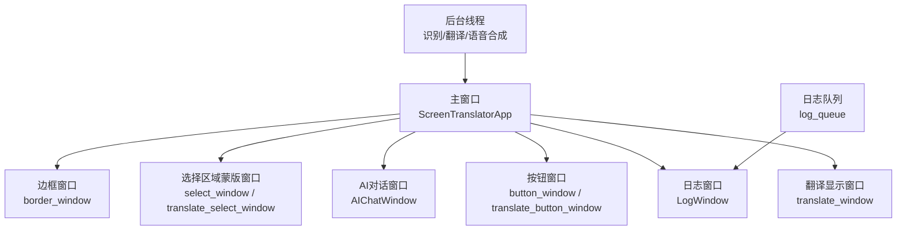
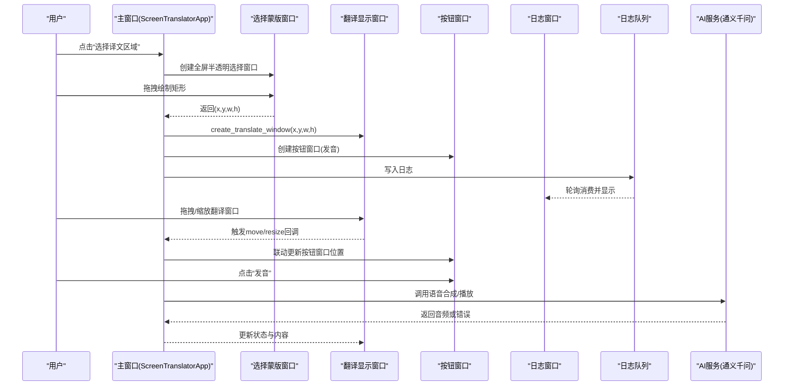
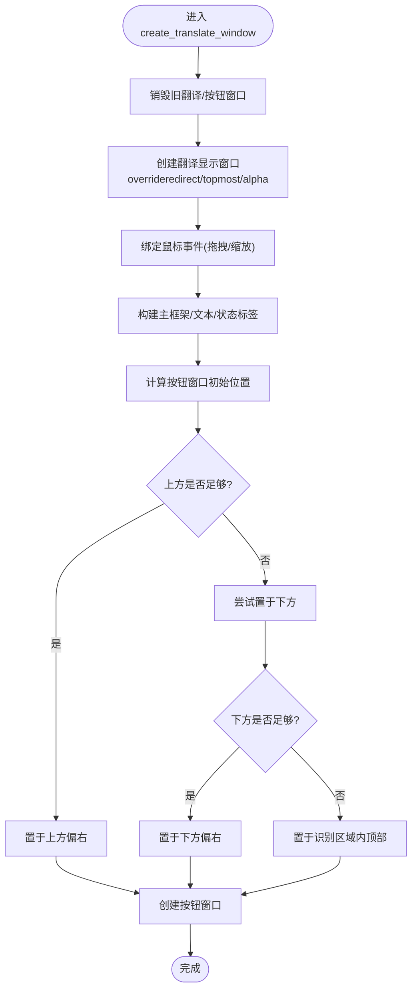
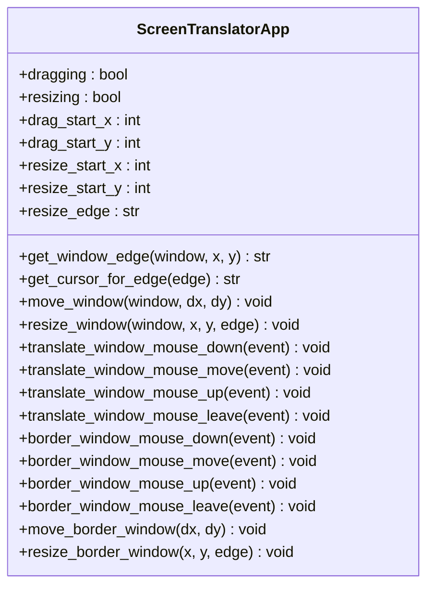
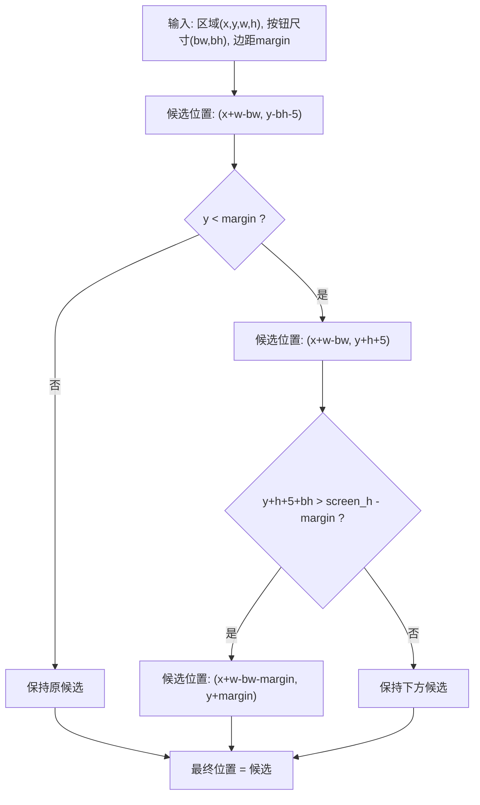
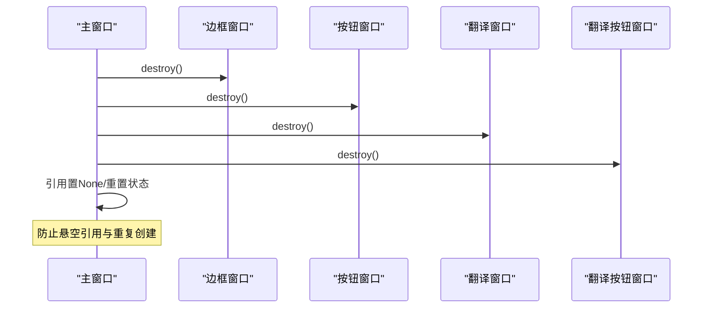
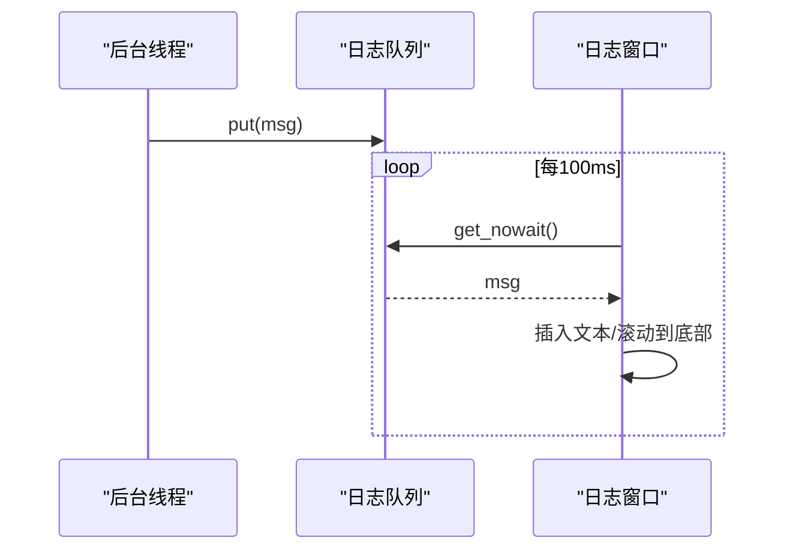
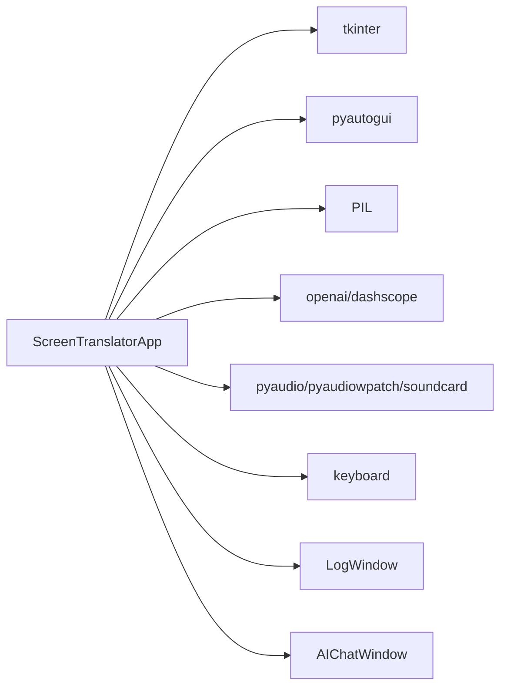

# 窗口管理系统

<cite>
**本文引用的文件**   
- [screen_translator_with_qwen.py](file://screen_translator_with_qwen.py)
- [boot.py](file://boot.py)
</cite>

## 目录
1. [简介](#简介)
2. [项目结构](#项目结构)
3. [核心组件](#核心组件)
4. [架构总览](#架构总览)
5. [详细组件分析](#详细组件分析)
6. [依赖关系分析](#依赖关系分析)
7. [性能与资源管理](#性能与资源管理)
8. [故障排查指南](#故障排查指南)
9. [结论](#结论)

## 简介
本技术文档聚焦于屏幕翻译工具的“窗口管理系统”，围绕多窗口架构设计、窗口生命周期、拖拽与缩放、自适应布局、内存泄漏防护以及窗口间通信机制进行深入解析。重点覆盖以下能力：
- 主窗口、翻译显示窗口、按钮窗口、日志窗口、AI对话窗口的管理与协调
- create_translate_window() 的窗口属性设置（overrideredirect、topmost、alpha透明度）、位置计算和布局管理
- 窗口拖拽实现机制（鼠标事件处理、边界检测、位置更新）
- 窗口自适应布局算法（按钮窗口位置的智能计算与屏幕边界检测）
- 窗口生命周期管理策略、内存泄漏防护措施
- 窗口间通信机制（状态同步、结果回写、队列驱动日志）

## 项目结构
本项目采用单进程多窗口架构，基于 tkinter 构建 UI，使用线程执行耗时任务（OCR/翻译/语音合成），通过队列将后台日志输出到独立的日志窗口。启动器 boot.py 负责虚拟环境校验与目标程序无控制台启动。

图表来源
- [screen_translator_with_qwen.py:474-630](file://screen_translator_with_qwen.py#L474-L630)
- [screen_translator_with_qwen.py:34-100](file://screen_translator_with_qwen.py#L34-L100)
- [screen_translator_with_qwen.py:101-300](file://screen_translator_with_qwen.py#L101-L300)
- [screen_translator_with_qwen.py:714-780](file://screen_translator_with_qwen.py#L714-L780)
- [screen_translator_with_qwen.py:859-926](file://screen_translator_with_qwen.py#L859-L926)

章节来源
- [screen_translator_with_qwen.py:474-630](file://screen_translator_with_qwen.py#L474-L630)
- [boot.py:255-279](file://boot.py#L255-L279)

## 核心组件
- 主应用类 ScreenTranslatorApp：负责所有窗口的创建、销毁、事件绑定、布局计算、状态同步与线程调度
- 日志窗口 LogWindow：基于队列异步消费日志并渲染至滚动文本框
- AI对话窗口 AIChatWindow：独立对话框，支持捕获原文、发送消息、错误提示
- 辅助窗口：选择区域蒙版窗口、边框窗口、按钮窗口、翻译显示窗口

章节来源
- [screen_translator_with_qwen.py:474-630](file://screen_translator_with_qwen.py#L474-L630)
- [screen_translator_with_qwen.py:34-100](file://screen_translator_with_qwen.py#L34-L100)
- [screen_translator_with_qwen.py:101-300](file://screen_translator_with_qwen.py#L101-L300)

## 架构总览
下图展示了窗口间的层次与交互关系，包括创建顺序、父子关系、事件流向与数据回写路径。

图表来源
- [screen_translator_with_qwen.py:635-713](file://screen_translator_with_qwen.py#L635-L713)
- [screen_translator_with_qwen.py:714-780](file://screen_translator_with_qwen.py#L714-L780)
- [screen_translator_with_qwen.py:76-87](file://screen_translator_with_qwen.py#L76-L87)
- [screen_translator_with_qwen.py:1442-1569](file://screen_translator_with_qwen.py#L1442-L1569)

## 详细组件分析

### 翻译显示窗口与按钮窗口：create_translate_window()
该方法负责创建翻译显示窗口及其附属按钮窗口，包含以下关键点：
- 窗口属性设置
  - overrideredirect(True)：隐藏系统标题栏，便于自定义拖拽与缩放
  - attributes('-topmost', True)：置顶显示，避免被其他窗口遮挡
  - attributes('-alpha', 0.9)：设置整体透明度，提升叠加体验
- 位置与尺寸
  - geometry(f"{width}x{height}+{x}+{y}")：直接以用户选择的区域坐标定位
- 布局与内容
  - 主框架填充整个窗口
  - 文本标签使用 wraplength 控制换行宽度，anchor=tk.NW 对齐左上角
  - 底部状态标签用于显示当前状态
- 按钮窗口自适应布局
  - 默认放置在翻译窗口右上角外侧
  - 若上方空间不足，则尝试放置于下方；若仍超出屏幕下边界，则退回到识别区域内顶部
  - 使用 margin 常量进行边距保护，确保按钮始终可见且不贴边

图表来源
- [screen_translator_with_qwen.py:714-780](file://screen_translator_with_qwen.py#L714-L780)

章节来源
- [screen_translator_with_qwen.py:714-780](file://screen_translator_with_qwen.py#L714-L780)

### 拖拽与缩放：事件处理与边界检测
翻译窗口与边框窗口均实现了统一的拖拽与缩放逻辑：
- 边缘检测 get_window_edge()
  - 根据鼠标相对坐标判断处于哪个边缘（nw/sw/ne/se/n/s/e/w）
  - 阈值 edge_threshold=10 像素判定边缘区域
- 光标映射 get_cursor_for_edge()
  - 不同边缘对应不同的 resize 光标，提升交互体验
- 移动 move_window()
  - 基于 delta_x/delta_y 更新窗口绝对位置
- 缩放 resize_window()
  - 对 e/s/w/n 四个方向分别调整宽高与位置
  - 限制最小尺寸（如宽度≥100，高度≥50）
  - 降低灵敏度 sensitivity=0.1，避免抖动
- 联动更新
  - 翻译窗口拖动时，同时移动其附属按钮窗口
  - 边框窗口拖动/缩放时，同步更新按钮窗口位置与 current_region

图表来源
- [screen_translator_with_qwen.py:1570-1703](file://screen_translator_with_qwen.py#L1570-L1703)
- [screen_translator_with_qwen.py:1268-1409](file://screen_translator_with_qwen.py#L1268-L1409)

章节来源
- [screen_translator_with_qwen.py:1570-1703](file://screen_translator_with_qwen.py#L1570-L1703)
- [screen_translator_with_qwen.py:1268-1409](file://screen_translator_with_qwen.py#L1268-L1409)

### 自适应布局算法：按钮窗口位置智能计算
按钮窗口的位置计算遵循“优先上→次选下→兜底内”的策略，并考虑屏幕边界：
- 默认位置：识别/翻译区域的右上角外侧上方
- 边界检查：
  - 若 button_y < margin（上方空间不足），尝试放在下方
  - 若 button_y + button_height > screen_height - margin（下方空间不足），退回到区域内顶部
- 联动更新：
  - 在 move_border_window() 与 resize_border_window() 中，每次区域变化都重新计算按钮窗口位置
  - 保证按钮窗口始终可见且不会遮挡主要内容

图表来源
- [screen_translator_with_qwen.py:887-926](file://screen_translator_with_qwen.py#L887-L926)
- [screen_translator_with_qwen.py:1324-1405](file://screen_translator_with_qwen.py#L1324-L1405)

章节来源
- [screen_translator_with_qwen.py:887-926](file://screen_translator_with_qwen.py#L887-L926)
- [screen_translator_with_qwen.py:1324-1405](file://screen_translator_with_qwen.py#L1324-L1405)

### 窗口生命周期管理与内存泄漏防护
- 显式销毁与引用清理
  - close_border() 统一关闭边框窗口、按钮窗口、翻译窗口及附属按钮窗口，并将相关引用置为 None，防止悬空引用导致内存泄漏
  - create_*_window() 在创建新窗口前，先销毁旧窗口实例，避免重复创建
- 线程安全与状态标志
  - ai_interaction_active、translating 等标志位用于中止长时间任务，避免线程结束后继续更新UI
  - 使用 root.after(0, ...) 在主线程中安全更新UI
- 资源清理
  - atexit.register(cleanup_cosyvoice_wav) 与 on_window_close() 确保退出时删除临时音频文件
  - 播放线程使用 stop_event 控制停止，避免僵尸线程

图表来源
- [screen_translator_with_qwen.py:1410-1441](file://screen_translator_with_qwen.py#L1410-L1441)
- [screen_translator_with_qwen.py:714-721](file://screen_translator_with_qwen.py#L714-L721)
- [screen_translator_with_qwen.py:484-485](file://screen_translator_with_qwen.py#L484-L485)

章节来源
- [screen_translator_with_qwen.py:1410-1441](file://screen_translator_with_qwen.py#L1410-L1441)
- [screen_translator_with_qwen.py:714-721](file://screen_translator_with_qwen.py#L714-L721)
- [screen_translator_with_qwen.py:484-485](file://screen_translator_with_qwen.py#L484-L485)

### 窗口间通信机制
- 日志窗口通信
  - 使用 queue.Queue 作为线程安全的日志通道
  - LogWindowHandler.emit() 将日志消息入队，LogWindow.poll_queue() 周期性出队并追加到文本控件
- 翻译结果回写
  - 识别与翻译完成后，通过 root.after(0, ...) 在主线程更新翻译窗口文本与状态标签
- AI对话窗口
  - AIChatWindow 持有 app 引用，可访问 ocr_cache 获取原文缓存，并在聊天区追加消息

图表来源
- [screen_translator_with_qwen.py:21-33](file://screen_translator_with_qwen.py#L21-L33)
- [screen_translator_with_qwen.py:76-87](file://screen_translator_with_qwen.py#L76-L87)

章节来源
- [screen_translator_with_qwen.py:21-33](file://screen_translator_with_qwen.py#L21-L33)
- [screen_translator_with_qwen.py:76-87](file://screen_translator_with_qwen.py#L76-L87)

## 依赖关系分析
- 外部库
  - tkinter：UI框架
  - pyautogui：截图
  - PIL：图像处理
  - openai/dashscope：AI客户端与语音合成
  - pyaudio/pyaudiowpatch/soundcard：系统音频录制
  - keyboard：全局快捷键
- 内部模块
  - LogWindow/AIChatWindow：独立窗口类
  - ScreenTranslatorApp：核心控制器

图表来源
- [screen_translator_with_qwen.py:1-20](file://screen_translator_with_qwen.py#L1-L20)
- [screen_translator_with_qwen.py:474-630](file://screen_translator_with_qwen.py#L474-L630)

章节来源
- [screen_translator_with_qwen.py:1-20](file://screen_translator_with_qwen.py#L1-L20)
- [screen_translator_with_qwen.py:474-630](file://screen_translator_with_qwen.py#L474-L630)

## 性能与资源管理
- 图像压缩与灰度化
  - 增强对比度后转灰度图，再保存为 JPEG/PNG，减少网络传输体积
- 指数退避重试
  - 针对 429 Too Many Requests 错误，采用 base_delay * 2^attempt + random jitter 的重试策略
- 线程模型
  - 识别、翻译、语音合成分别在独立线程执行，避免阻塞 UI
  - 使用 daemon=True 确保子线程随主进程退出而终止
- 滚动区域优化
  - 翻译窗口使用 Canvas + inner_frame 承载长文本，动态更新 scrollregion，避免重绘开销过大

章节来源
- [screen_translator_with_qwen.py:1098-1121](file://screen_translator_with_qwen.py#L1098-L1121)
- [screen_translator_with_qwen.py:1144-1247](file://screen_translator_with_qwen.py#L1144-L1247)
- [screen_translator_with_qwen.py:1017-1021](file://screen_translator_with_qwen.py#L1017-L1021)

## 故障排查指南
- 无法录制系统音频
  - 可能原因：蓝牙耳机不支持环回、未启用立体声混音、缺少依赖库
  - 解决方案：安装 pyaudiowpatch、切换到内置扬声器/有线耳机、启用 Windows 立体声混音
- API 密钥无效或请求频繁
  - 现象：401 Unauthorized、429 Too Many Requests
  - 解决：检查 key.txt、等待重试间隔或使用指数退避后的再次尝试
- 窗口不可见或重叠异常
  - 检查 topmost/alpha 设置是否正确，确认按钮窗口位置计算是否越界
- 日志不显示
  - 检查 log_queue 是否正常消费，确认 LogWindow.poll_queue() 是否在运行

章节来源
- [screen_translator_with_qwen.py:1789-1851](file://screen_translator_with_qwen.py#L1789-L1851)
- [screen_translator_with_qwen.py:1215-1247](file://screen_translator_with_qwen.py#L1215-L1247)
- [screen_translator_with_qwen.py:76-87](file://screen_translator_with_qwen.py#L76-L87)

## 结论
该窗口管理系统通过清晰的多窗口分层与事件驱动模型，实现了灵活的拖拽/缩放、智能的按钮布局、可靠的线程通信与完善的资源清理策略。create_translate_window() 在保证用户体验的同时兼顾了跨屏适配与边界检测；LogWindow 与 AIChatWindow 提供了良好的扩展点。整体架构具备较高的可维护性与可扩展性，适合进一步集成更多功能窗口与服务。