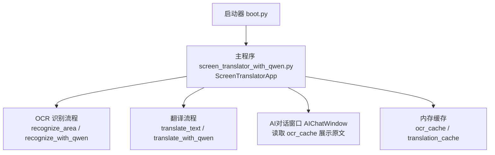
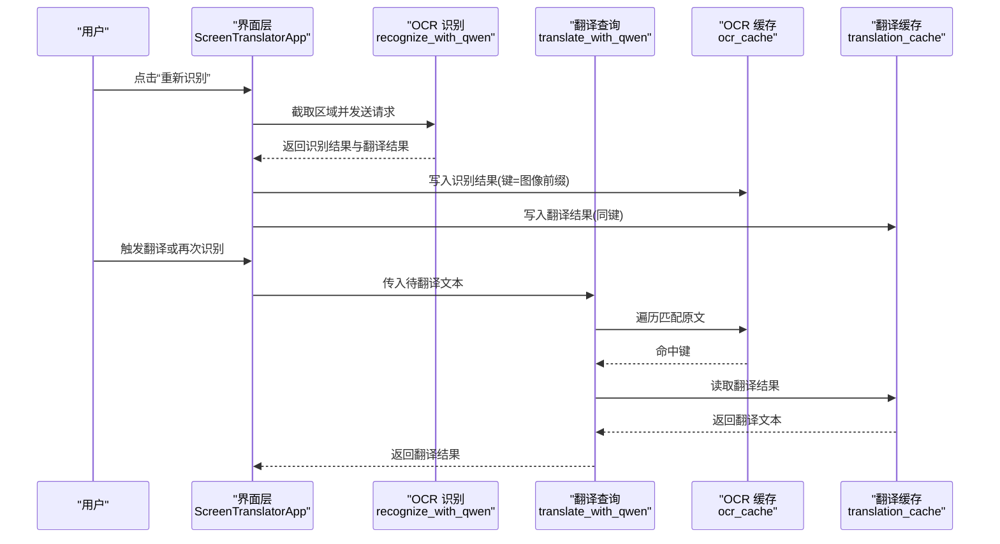
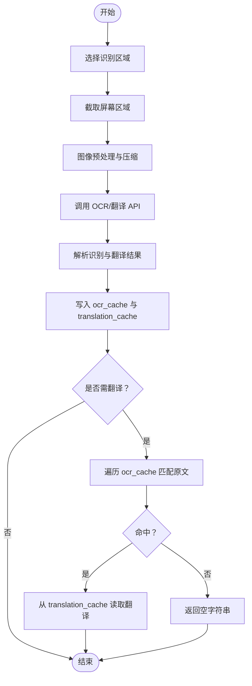
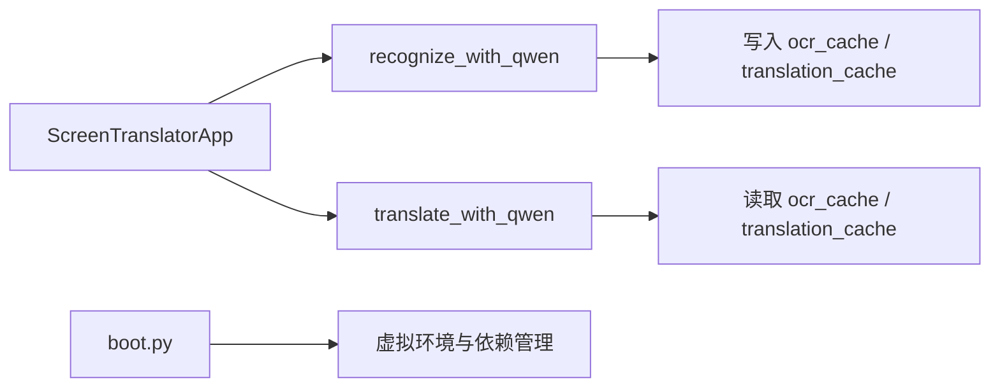

# 缓存管理系统

<cite>
**本文引用的文件**   
- [screen_translator_with_qwen.py](file://screen_translator_with_qwen.py)
- [boot.py](file://boot.py)
</cite>

## 目录
1. [引言](#引言)
2. [项目结构](#项目结构)
3. [核心组件](#核心组件)
4. [架构总览](#架构总览)
5. [详细组件分析](#详细组件分析)
6. [依赖关系分析](#依赖关系分析)
7. [性能考量](#性能考量)
8. [故障排查指南](#故障排查指南)
9. [结论](#结论)
10. [附录](#附录)

## 引言
本技术文档聚焦于屏幕翻译应用中的缓存子系统，围绕 ocr_cache 与 translation_cache 的设计、数据流、生命周期管理、一致性保证、性能优化以及序列化/持久化策略展开。通过对源码的系统性梳理，给出可落地的架构图、流程图与调优建议，帮助读者快速理解并扩展该缓存系统。

## 项目结构
本项目为单进程桌面应用，主程序位于 screen_translator_with_qwen.py，启动器 boot.py 负责虚拟环境管理与后台启动目标程序。缓存逻辑集中在主程序的 ScreenTranslatorApp 类中，ocr_cache 与 translation_cache 作为实例级字典存储识别结果与翻译结果。

图表来源
- [screen_translator_with_qwen.py:474-634](file://screen_translator_with_qwen.py#L474-L634)
- [screen_translator_with_qwen.py:927-1021](file://screen_translator_with_qwen.py#L927-L1021)
- [screen_translator_with_qwen.py:1123-1213](file://screen_translator_with_qwen.py#L1123-L1213)
- [screen_translator_with_qwen.py:1249-1266](file://screen_translator_with_qwen.py#L1249-L1266)
- [screen_translator_with_qwen.py:101-222](file://screen_translator_with_qwen.py#L101-L222)
- [boot.py:256-279](file://boot.py#L256-L279)

章节来源
- [screen_translator_with_qwen.py:474-634](file://screen_translator_with_qwen.py#L474-L634)
- [boot.py:256-279](file://boot.py#L256-L279)

## 核心组件
- OCR 缓存：ocr_cache，键为图像前缀（base64 前若干字符），值为识别出的原文文本。
- 翻译缓存：translation_cache，键与 ocr_cache 一致，值为对应翻译结果。
- 写入路径：在 OCR 识别成功后，将识别结果与翻译结果按相同键写入两个缓存。
- 读取路径：翻译时先遍历 ocr_cache 匹配原文，命中则从 translation_cache 取回翻译结果；否则返回空字符串。
- 展示路径：AI 对话窗口可从 ocr_cache 聚合所有原文内容用于提问。

章节来源
- [screen_translator_with_qwen.py:631-633](file://screen_translator_with_qwen.py#L631-L633)
- [screen_translator_with_qwen.py:1207-1211](file://screen_translator_with_qwen.py#L1207-L1211)
- [screen_translator_with_qwen.py:1249-1266](file://screen_translator_with_qwen.py#L1249-L1266)
- [screen_translator_with_qwen.py:198-222](file://screen_translator_with_qwen.py#L198-L222)

## 架构总览
下图展示了从用户选择区域到识别、翻译、缓存写入与读取的完整数据流。

图表来源
- [screen_translator_with_qwen.py:927-1021](file://screen_translator_with_qwen.py#L927-L1021)
- [screen_translator_with_qwen.py:1123-1213](file://screen_translator_with_qwen.py#L1123-L1213)
- [screen_translator_with_qwen.py:1249-1266](file://screen_translator_with_qwen.py#L1249-L1266)

## 详细组件分析

### 数据结构与键值组织策略
- 数据结构：Python 内置 dict，键为字符串，值为文本。
- 键生成策略：使用图像 base64 编码的前若干字符作为缓存键，确保同一图像片段映射到唯一键。
- 双缓存关联：ocr_cache 与 translation_cache 共享同一键空间，便于通过原文反查翻译结果。

复杂度分析
- 写入：O(1)。
- 查找：translate_with_qwen 采用线性扫描匹配原文，时间复杂度 O(n)，n 为缓存项数量。当缓存规模较大时可能成为瓶颈。

章节来源
- [screen_translator_with_qwen.py:1207-1211](file://screen_translator_with_qwen.py#L1207-L1211)
- [screen_translator_with_qwen.py:1249-1266](file://screen_translator_with_qwen.py#L1249-L1266)

### 生命周期管理
- 创建：OCR 识别完成后，立即写入 ocr_cache 与 translation_cache。
- 更新：若再次识别相同区域，会覆盖已有键对应的值。
- 过期清理：当前未实现自动过期或 LRU 淘汰机制；仅在关闭语音文件等场景进行资源清理，未对缓存做主动清理。
- 重启恢复：未实现持久化，重启后内存缓存丢失。

章节来源
- [screen_translator_with_qwen.py:1207-1211](file://screen_translator_with_qwen.py#L1207-L1211)
- [screen_translator_with_qwen.py:2407-2412](file://screen_translator_with_qwen.py#L2407-L2412)

### 一致性与多线程安全
- 线程模型：识别与翻译均在新线程执行，但仅通过布尔标志控制中止，并未引入锁或队列保护缓存访问。
- 一致性风险：由于 Python GIL 的存在，dict 的读写具备一定原子性，但在复杂业务逻辑下仍可能出现竞态条件（例如并发写入/读取时的迭代）。当前代码中翻译读取为遍历 ocr_cache，存在潜在并发安全问题。
- 同步策略：当前无显式同步机制；如需强一致，应引入 threading.Lock 或使用线程安全的容器。

章节来源
- [screen_translator_with_qwen.py:1017-1021](file://screen_translator_with_qwen.py#L1017-L1021)
- [screen_translator_with_qwen.py:1093-1096](file://screen_translator_with_qwen.py#L1093-L1096)
- [screen_translator_with_qwen.py:1249-1266](file://screen_translator_with_qwen.py#L1249-L1266)

### 性能优化措施
- 图像压缩：识别前对截图进行对比度增强、灰度转换与 JPEG 压缩，降低网络传输体积，间接减少缓存键长度与整体开销。
- 内存监控：未实现内存占用统计与告警。
- LRU 淘汰：未实现。
- 压缩存储：缓存值以纯文本形式保存，未启用额外压缩。

章节来源
- [screen_translator_with_qwen.py:1098-1121](file://screen_translator_with_qwen.py#L1098-L1121)

### 序列化和持久化机制
- 当前未实现缓存数据的序列化与持久化，也未提供版本兼容性处理。
- 应用退出时仅清理临时音频文件，不保存缓存状态。

章节来源
- [screen_translator_with_qwen.py:2407-2412](file://screen_translator_with_qwen.py#L2407-L2412)

### 关键流程时序图（OCR→翻译→缓存）

图表来源
- [screen_translator_with_qwen.py:927-1021](file://screen_translator_with_qwen.py#L927-L1021)
- [screen_translator_with_qwen.py:1123-1213](file://screen_translator_with_qwen.py#L1123-L1213)
- [screen_translator_with_qwen.py:1249-1266](file://screen_translator_with_qwen.py#L1249-L1266)

## 依赖关系分析
- 模块内依赖：ScreenTranslatorApp 内部方法相互调用，ocr_cache 与 translation_cache 贯穿识别与翻译流程。
- 外部依赖：OpenAI 客户端用于 OCR/翻译请求；Pillow 用于图像处理；tkinter 用于 UI。
- 启动器依赖：boot.py 负责虚拟环境校验与依赖安装，不影响运行时缓存逻辑。

图表来源
- [screen_translator_with_qwen.py:1123-1213](file://screen_translator_with_qwen.py#L1123-L1213)
- [screen_translator_with_qwen.py:1249-1266](file://screen_translator_with_qwen.py#L1249-L1266)
- [boot.py:256-279](file://boot.py#L256-L279)

章节来源
- [screen_translator_with_qwen.py:1123-1213](file://screen_translator_with_qwen.py#L1123-L1213)
- [screen_translator_with_qwen.py:1249-1266](file://screen_translator_with_qwen.py#L1249-L1266)
- [boot.py:256-279](file://boot.py#L256-L279)

## 性能考量
- 查找复杂度：当前翻译查询为线性扫描，建议在高频场景下引入反向索引（如基于文本哈希或分词指纹的倒排表），将查找复杂度降至近似 O(1)。
- 并发安全：在高并发场景下，建议引入互斥锁保护缓存读写的临界区，避免迭代过程中被修改导致的异常。
- 内存增长：缺少淘汰策略可能导致内存持续增长，建议结合 LRU 或 TTL 机制限制缓存规模。
- I/O 与网络：图像压缩已降低传输体积，进一步可考虑缓存键去重与增量更新策略。

[本节为通用指导，无需具体文件引用]

## 故障排查指南
- 未找到缓存的翻译结果：检查 OCR 识别是否成功写入缓存，确认原文完全匹配。
- 频繁 429 错误：API 限流导致重试退避，适当延长间隔或缩小识别区域。
- 请求体过大：提示选择更小的识别区域以降低图片大小。
- 语音播放问题：与缓存无关，主要涉及音频文件与播放线程。

章节来源
- [screen_translator_with_qwen.py:1249-1266](file://screen_translator_with_qwen.py#L1249-L1266)
- [screen_translator_with_qwen.py:1215-1247](file://screen_translator_with_qwen.py#L1215-L1247)

## 结论
当前缓存系统以简单字典为核心，实现了基础的识别与翻译结果缓存与复用，满足小规模的即时需求。但在大规模使用场景下，存在查找效率、并发安全、内存增长与持久化方面的不足。建议后续引入反向索引、锁保护、LRU/TTL 淘汰与 JSON/SQLite 持久化方案，以提升稳定性与可扩展性。

[本节为总结性内容，无需具体文件引用]

## 附录

### 配置与调优示例（概念性说明）
- 反向索引构建：维护一个从“文本指纹”到“缓存键”的映射，加速翻译查询。
- 并发保护：在读写缓存前后加锁，确保线程安全。
- 淘汰策略：设置最大条目数与访问时间戳，定期清理最久未使用的条目。
- 持久化：在应用退出时将缓存序列化为 JSON 或写入 SQLite，并在启动时加载，同时增加版本号字段以兼容未来结构变更。

[本节为概念性内容，无需具体文件引用]