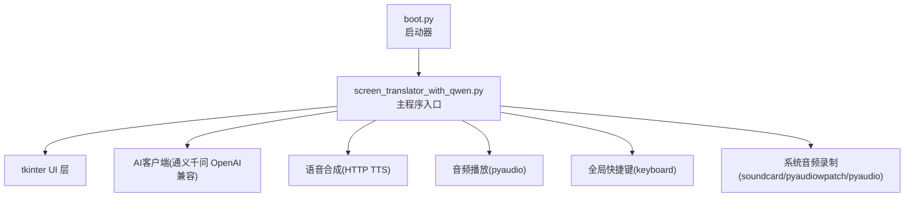
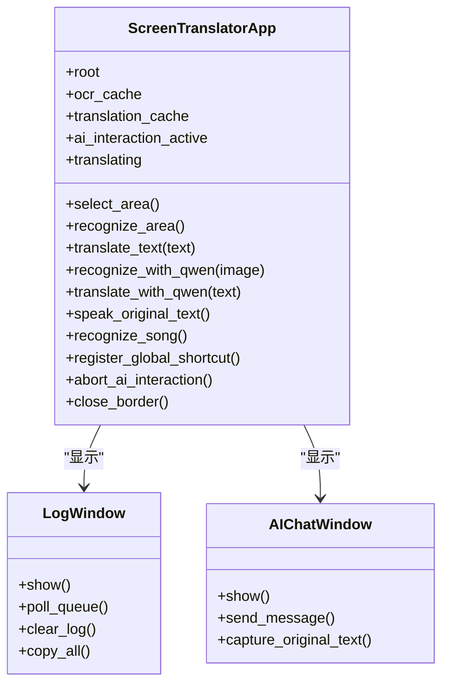
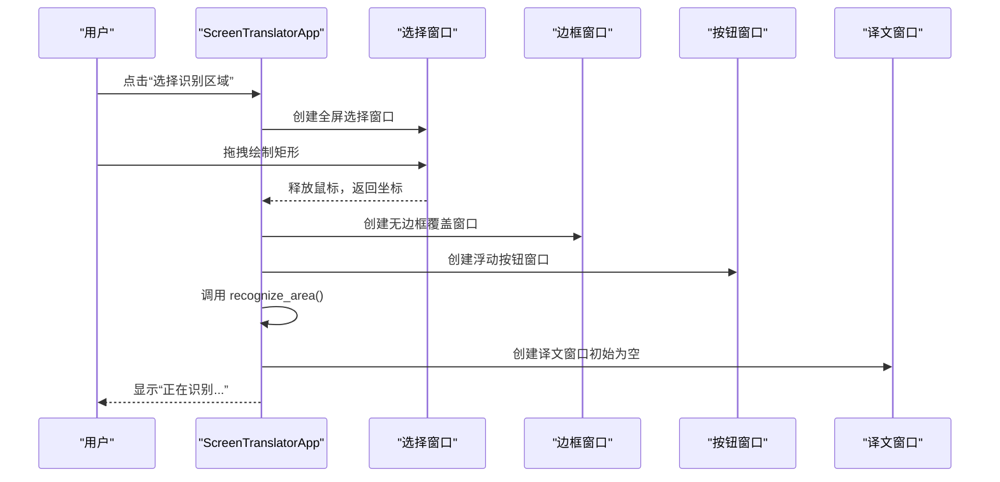
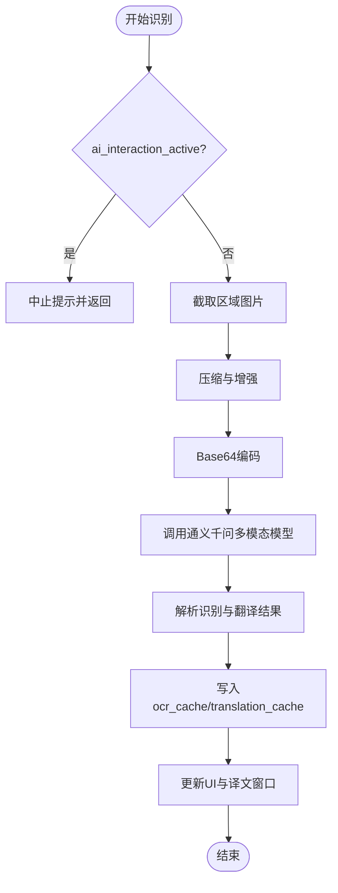
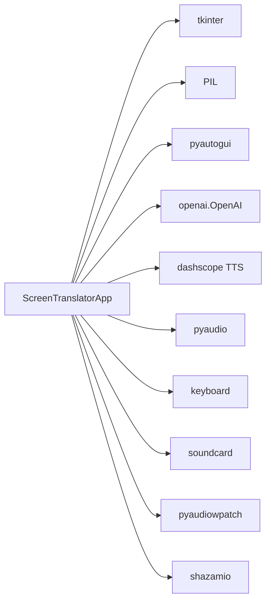
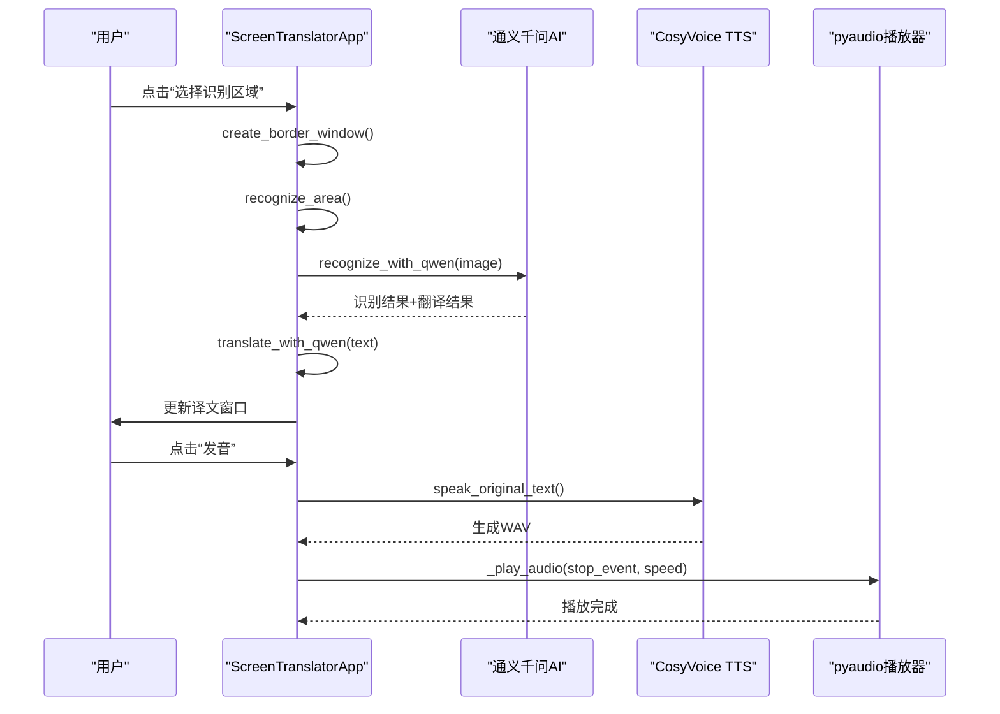

# 主应用程序类设计

<cite>
**本文引用的文件**   
- [screen_translator_with_qwen.py](file://screen_translator_with_qwen.py)
- [boot.py](file://boot.py)
</cite>

## 目录
1. [简介](#简介)
2. [项目结构](#项目结构)
3. [核心组件](#核心组件)
4. [架构总览](#架构总览)
5. [详细组件分析](#详细组件分析)
6. [依赖关系分析](#依赖关系分析)
7. [性能与线程安全](#性能与线程安全)
8. [故障排查指南](#故障排查指南)
9. [结论](#结论)
10. [附录：关键方法调用关系图](#附录关键方法调用关系图)

## 简介
本文件围绕 ScreenTranslatorApp 主类进行深度架构文档化，聚焦其作为“屏幕翻译工具”的核心控制器职责。内容涵盖：
- 状态管理：ocr_cache、translation_cache 的设计与使用
- 事件处理机制：鼠标选择区域、窗口拖拽/拉伸、全局快捷键触发
- 线程安全设计：UI更新通过主线程调度、AI交互标志位控制
- 窗口管理：识别区域边框窗口、按钮窗口、译文显示窗口的创建与生命周期
- AI交互控制变量：ai_interaction_active、current_request 的作用与状态转换
- 全局快捷键注册与系统集成：keyboard库集成、系统音频录制与播放
- 初始化流程、关键方法调用关系图、与其他组件的依赖关系
- 实际代码示例路径（以源码行号标注）

## 项目结构
本项目采用单文件应用组织方式，ScreenTranslatorApp 位于主脚本中，配合启动器 boot.py 负责虚拟环境管理与后台启动目标程序。

图表来源
- [boot.py:256-279](file://boot.py#L256-L279)
- [screen_translator_with_qwen.py:474-634](file://screen_translator_with_qwen.py#L474-L634)

章节来源
- [boot.py:256-279](file://boot.py#L256-L279)
- [screen_translator_with_qwen.py:474-634](file://screen_translator_with_qwen.py#L474-L634)

## 核心组件
- ScreenTranslatorApp：主控制器，负责UI布局、区域选择、OCR+翻译流程、TTS发音、听歌识曲、全局快捷键、日志窗口等。
- LogWindow：独立日志窗口，基于队列异步消费日志消息。
- AIChatWindow：AI对话窗口，支持捕获原文缓存并发起对话请求。
- 外部服务：
  - 通义千问AI客户端（OpenAI兼容接口）
  - HTTP语音合成（DashScope CosyVoice）
  - 音频播放（pyaudio）
  - 全局快捷键（keyboard）
  - 系统音频录制（soundcard / pyaudiowpatch / pyaudio）

章节来源
- [screen_translator_with_qwen.py:21-100](file://screen_translator_with_qwen.py#L21-L100)
- [screen_translator_with_qwen.py:101-300](file://screen_translator_with_qwen.py#L101-L300)
- [screen_translator_with_qwen.py:474-634](file://screen_translator_with_qwen.py#L474-L634)

## 架构总览
ScreenTranslatorApp 作为中心控制器，协调以下子系统：
- UI层：Tkinter主窗口、无边框覆盖窗口、按钮浮动窗口、日志窗口、AI对话窗口
- OCR+翻译：截图→压缩→Base64→通义千问多模态模型→解析结果→写入缓存→展示
- 文本翻译：从缓存读取对应翻译结果
- 语音合成与播放：将原文部分合成为WAV并播放，支持变速
- 听歌识曲：录制系统音频→Shazam识别→结果展示
- 全局快捷键：键盘监听→触发重新识别
- 资源清理：退出时删除临时WAV文件

图表来源
- [screen_translator_with_qwen.py:474-634](file://screen_translator_with_qwen.py#L474-L634)
- [screen_translator_with_qwen.py:21-100](file://screen_translator_with_qwen.py#L21-L100)
- [screen_translator_with_qwen.py:101-300](file://screen_translator_with_qwen.py#L101-L300)

## 详细组件分析

### 类初始化流程与状态管理
- 初始化阶段完成：
  - 清理旧语音文件、注册关闭钩子
  - 构建主界面控件（标题、按钮、状态标签、快捷键设置区）
  - 初始化日志窗口实例
  - 初始化区域选择相关坐标与窗口句柄
  - 初始化AI交互控制变量（ai_interaction_active、translating）
  - 初始化缓存字典（ocr_cache、translation_cache）
  - 自动调整窗口大小并居中
- 关键点：
  - ocr_cache 与 translation_cache 以图像前缀为键，保存识别原文与翻译结果，避免重复请求
  - ai_interaction_active 用于标识识别流程是否进行中，防止并发重复任务
  - translating 用于标识翻译流程是否进行中

章节来源
- [screen_translator_with_qwen.py:474-634](file://screen_translator_with_qwen.py#L474-L634)

### 区域选择与窗口管理
- 识别区域选择：
  - 全屏半透明选择窗口，绘制矩形选择框
  - 确认选择后创建无边框覆盖窗口（带红色边框）和浮动按钮窗口（包含“重新识别”）
  - 支持拖动与边缘拉伸，实时更新当前区域坐标
- 译文显示区域：
  - 创建无边框译文窗口，显示翻译结果与原文
  - 上方或下方浮动按钮窗口提供“发音”功能
  - 支持拖动与边缘拉伸，动态调整文本换行宽度
- 生命周期管理：
  - close_border 统一销毁识别窗口、按钮窗口、译文窗口及按钮窗口，重置状态
  - ESC取消选择，on_escape 销毁选择窗口

图表来源
- [screen_translator_with_qwen.py:781-926](file://screen_translator_with_qwen.py#L781-L926)
- [screen_translator_with_qwen.py:859-926](file://screen_translator_with_qwen.py#L859-L926)
- [screen_translator_with_qwen.py:927-1021](file://screen_translator_with_qwen.py#L927-L1021)
- [screen_translator_with_qwen.py:1410-1441](file://screen_translator_with_qwen.py#L1410-L1441)

章节来源
- [screen_translator_with_qwen.py:781-926](file://screen_translator_with_qwen.py#L781-L926)
- [screen_translator_with_qwen.py:927-1021](file://screen_translator_with_qwen.py#L927-L1021)
- [screen_translator_with_qwen.py:1410-1441](file://screen_translator_with_qwen.py#L1410-L1441)

### OCR与翻译流程（AI交互）
- 识别流程：
  - 检查 ai_interaction_active 防止重复
  - 截取选定区域图片，压缩增强对比度并转灰度
  - Base64编码发送至通义千问多模态模型，智能重试（含429退避）
  - 解析返回的“识别结果”和“翻译结果”，写入缓存
  - 更新UI状态与译文窗口内容
- 翻译流程：
  - 根据传入文本在 ocr_cache 中查找匹配项，返回对应翻译结果
  - 若未命中则返回空字符串

图表来源
- [screen_translator_with_qwen.py:927-1021](file://screen_translator_with_qwen.py#L927-L1021)
- [screen_translator_with_qwen.py:1098-1248](file://screen_translator_with_qwen.py#L1098-L1248)
- [screen_translator_with_qwen.py:1249-1266](file://screen_translator_with_qwen.py#L1249-L1266)

章节来源
- [screen_translator_with_qwen.py:927-1021](file://screen_translator_with_qwen.py#L927-L1021)
- [screen_translator_with_qwen.py:1098-1248](file://screen_translator_with_qwen.py#L1098-L1248)
- [screen_translator_with_qwen.py:1249-1266](file://screen_translator_with_qwen.py#L1249-L1266)

### 语音合成与播放
- 触发条件：点击译文窗口上方按钮“发音”
- 流程：
  - 若已有WAV文件存在，直接播放；否则先调用HTTP TTS生成WAV
  - 支持正常速度与0.75倍速循环切换
  - 播放线程可被停止事件中断
- 注意：
  - 播放完成后恢复UI状态
  - 新音频生成会重置速度模式

章节来源
- [screen_translator_with_qwen.py:1442-1569](file://screen_translator_with_qwen.py#L1442-L1569)

### 听歌识曲功能
- 依赖检测：shazamio、soundcard/soundfile/numpy、pyaudiowpatch
- 流程：
  - 优先尝试 soundcard 环形回录
  - 其次尝试 pyaudiowpatch WASAPI环回（支持蓝牙耳机）
  - 最后尝试 pyaudio 立体声混音
  - 录制完成后调用 Shazam 异步识别，输出歌曲信息与链接
- 错误处理：
  - 详细记录失败原因并提供解决方案提示

章节来源
- [screen_translator_with_qwen.py:2272-2396](file://screen_translator_with_qwen.py#L2272-L2396)

### 全局快捷键注册机制
- 使用 keyboard 库注册全局热键
- 支持动态修改快捷键，自动注销旧绑定并注册新绑定
- 快捷键触发时执行重新识别逻辑（需已选择识别区域）

章节来源
- [screen_translator_with_qwen.py:1734-1788](file://screen_translator_with_qwen.py#L1734-L1788)

### AI对话窗口
- 功能：
  - 显示聊天历史，支持用户/AI/系统消息样式
  - “捕获原文”按钮从 ocr_cache 合并最近识别原文到输入框
  - 发送消息后在线程中调用通义千问对话模型，结果回调更新UI
- 错误处理：
  - 针对401/429等错误给出友好提示

章节来源
- [screen_translator_with_qwen.py:101-300](file://screen_translator_with_qwen.py#L101-L300)

## 依赖关系分析
- 内部依赖：
  - tkinter、PIL、pyautogui、base64、threading、logging、queue、pathlib、openai、dashscope TTS、pyaudio、asyncio、tempfile、wave
- 可选依赖：
  - shazamio（听歌识曲）、soundcard/soundfile/numpy（系统音频录制）、pyaudiowpatch（WASAPI环回）、keyboard（全局快捷键）
- 外部服务：
  - 通义千问AI（OpenAI兼容端点）
  - DashScope CosyVoice（HTTP语音合成）

图表来源
- [screen_translator_with_qwen.py:1-20](file://screen_translator_with_qwen.py#L1-L20)
- [screen_translator_with_qwen.py:314-336](file://screen_translator_with_qwen.py#L314-L336)
- [screen_translator_with_qwen.py:338-360](file://screen_translator_with_qwen.py#L338-L360)

章节来源
- [screen_translator_with_qwen.py:1-20](file://screen_translator_with_qwen.py#L1-L20)
- [screen_translator_with_qwen.py:314-336](file://screen_translator_with_qwen.py#L314-L336)
- [screen_translator_with_qwen.py:338-360](file://screen_translator_with_qwen.py#L338-L360)

## 性能与线程安全
- 线程安全设计：
  - UI更新一律通过 root.after(0, ...) 在主线程调度，避免跨线程访问Tkinter对象
  - 识别与翻译流程在新线程中执行，使用 ai_interaction_active 与 translating 标志位控制中止
  - 语音播放与合成在独立线程中进行，支持停止事件中断
- 性能优化：
  - 图像压缩与灰度化减少网络传输体积
  - 智能重试与指数退避应对429限流
  - 缓存机制避免重复OCR与翻译请求
- 注意事项：
  - current_request 变量在类中未显式赋值与使用，建议后续用于跟踪具体请求ID以便更精确的中止与追踪

章节来源
- [screen_translator_with_qwen.py:927-1021](file://screen_translator_with_qwen.py#L927-L1021)
- [screen_translator_with_qwen.py:1022-1097](file://screen_translator_with_qwen.py#L1022-L1097)
- [screen_translator_with_qwen.py:1098-1248](file://screen_translator_with_qwen.py#L1098-L1248)
- [screen_translator_with_qwen.py:1442-1569](file://screen_translator_with_qwen.py#L1442-L1569)

## 故障排查指南
- API密钥无效或过期：
  - 现象：401 Unauthorized
  - 处理：检查 key.txt 中的API密钥是否正确
- 请求过于频繁：
  - 现象：429 Too Many Requests
  - 处理：等待数分钟后重试，或降低请求频率
- 请求体过大：
  - 现象：413 Payload Too Large
  - 处理：缩小识别区域或降低图像质量
- 全局快捷键不可用：
  - 现象：未安装 keyboard 库
  - 处理：安装 keyboard 库并重启程序
- 系统音频录制失败：
  - 现象：无法找到立体声混音或WASAPI环回设备
  - 处理：启用Windows立体声混音或安装 pyaudiowpatch，确保音频从内置扬声器或有线耳机播放

章节来源
- [screen_translator_with_qwen.py:1123-1248](file://screen_translator_with_qwen.py#L1123-L1248)
- [screen_translator_with_qwen.py:1753-1788](file://screen_translator_with_qwen.py#L1753-L1788)
- [screen_translator_with_qwen.py:1789-1851](file://screen_translator_with_qwen.py#L1789-L1851)

## 结论
ScreenTranslatorApp 作为核心控制器，整合了区域选择、OCR+翻译、TTS发音、听歌识曲、全局快捷键与日志窗口等功能。其线程安全设计与缓存策略有效提升了用户体验与系统稳定性。建议在后续版本中完善 current_request 的使用，以实现更细粒度的请求管理与中止能力。

## 附录：关键方法调用关系图

图表来源
- [screen_translator_with_qwen.py:927-1021](file://screen_translator_with_qwen.py#L927-L1021)
- [screen_translator_with_qwen.py:1098-1248](file://screen_translator_with_qwen.py#L1098-L1248)
- [screen_translator_with_qwen.py:1249-1266](file://screen_translator_with_qwen.py#L1249-L1266)
- [screen_translator_with_qwen.py:1442-1569](file://screen_translator_with_qwen.py#L1442-L1569)