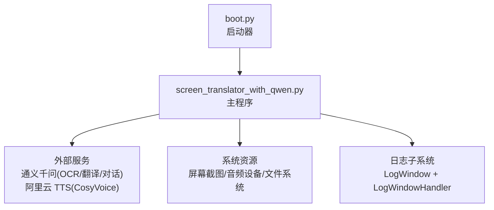
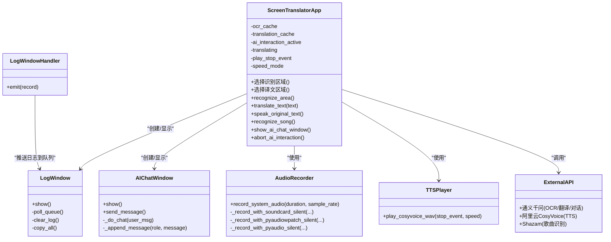
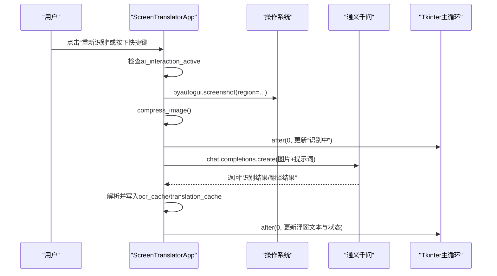
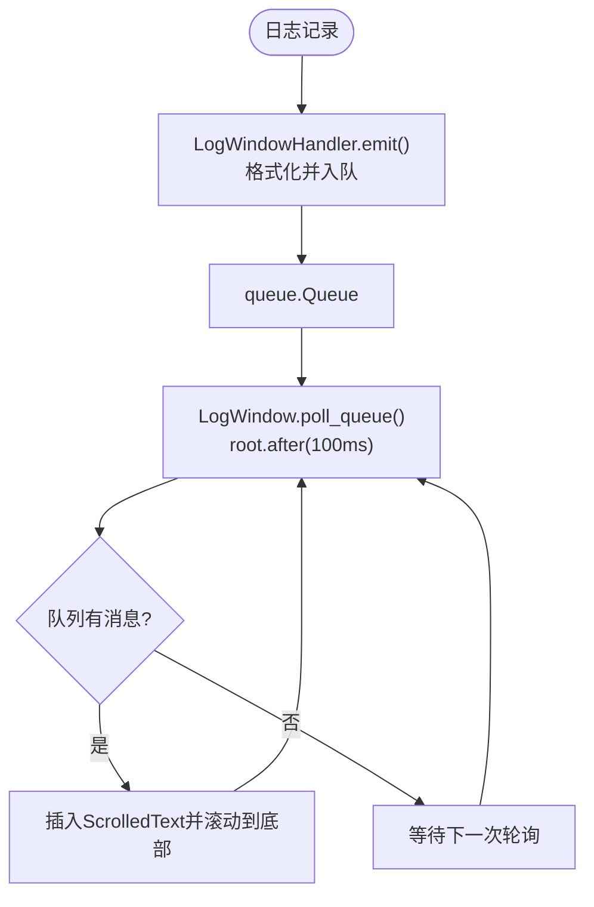
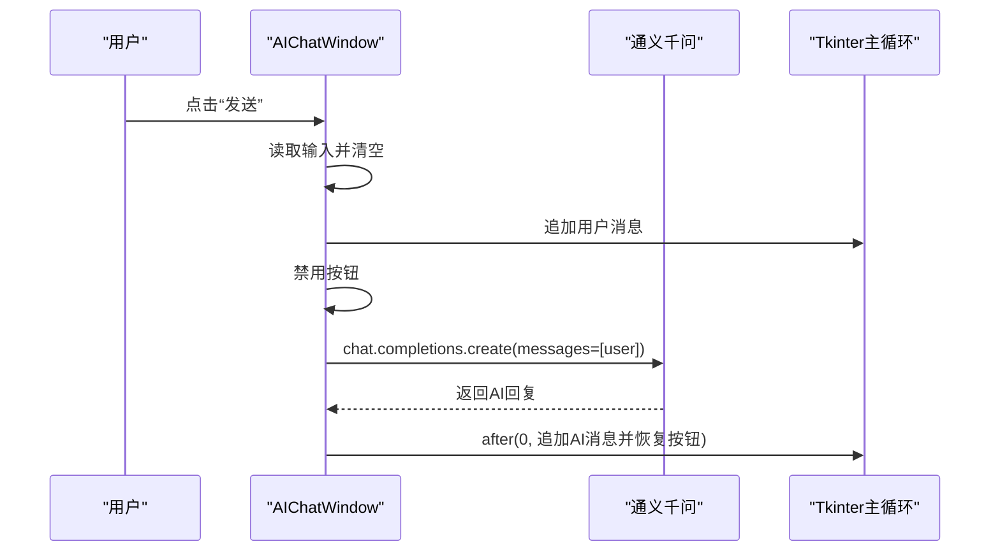
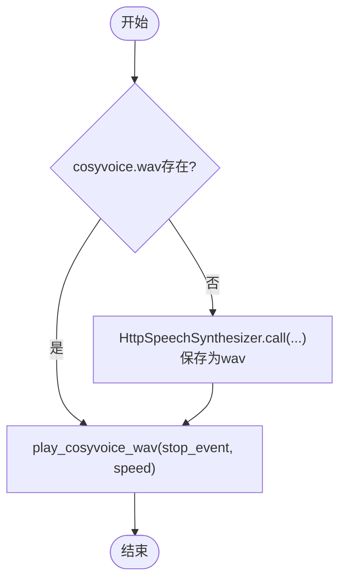
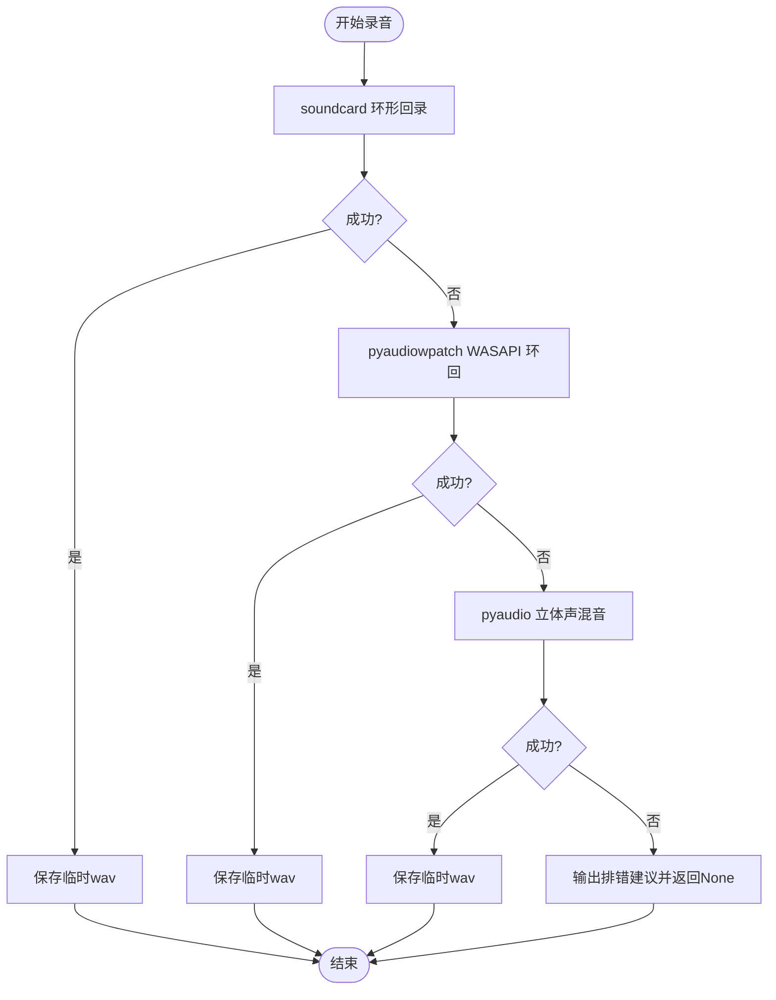
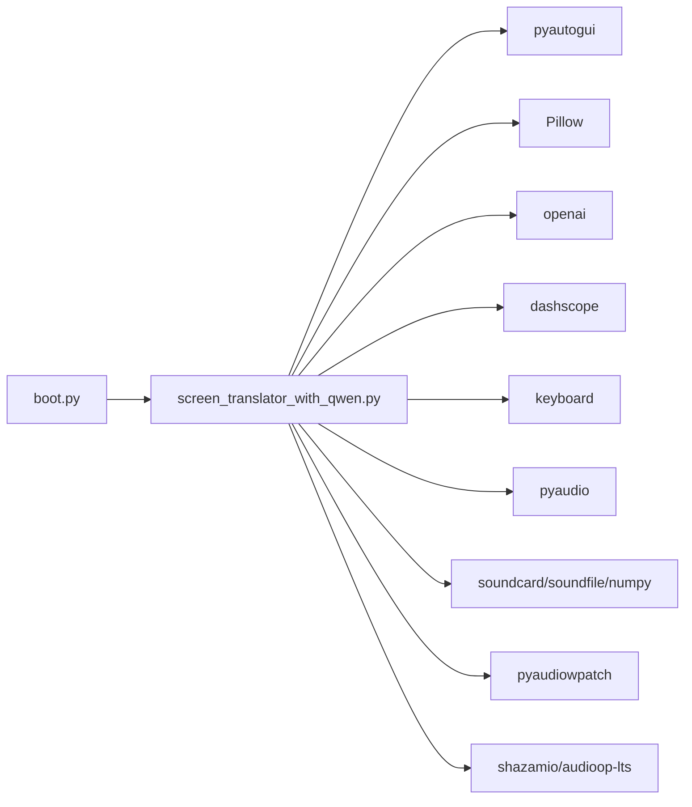

# 代码结构说明

<cite>
**本文引用的文件**
- [screen_translator_with_qwen.py](file://screen_translator_with_qwen.py)
- [boot.py](file://boot.py)
- [requirements.txt](file://requirements.txt)
</cite>

## 目录
1. [简介](#简介)
2. [项目结构](#项目结构)
3. [核心组件](#核心组件)
4. [架构总览](#架构总览)
5. [详细组件分析](#详细组件分析)
6. [依赖关系分析](#依赖关系分析)
7. [性能与并发特性](#性能与并发特性)
8. [故障排查指南](#故障排查指南)
9. [结论](#结论)
10. [附录：关键设计模式落地](#附录关键设计模式落地)

## 简介
本项目是一个基于 Tkinter 的桌面端“屏幕翻译工具”，具备以下能力：
- 区域截图与 OCR 识别，并调用通义千问进行文本识别与中文翻译
- 可拖拽、可缩放的译文浮窗，支持一键发音（TTS）
- 全局快捷键触发重新识别
- 听歌识曲（系统音频录制 + Shazam 识别）
- AI 对话窗口（通义千问聊天）
- 日志窗口异步滚动显示

整体采用单进程多线程模型：UI 线程负责交互，后台线程处理网络请求、音频录制/播放等耗时任务。

## 项目结构
仓库根目录包含启动器、主程序与依赖清单：
- boot.py：通用 Python 项目启动器，自动检测唯一 .py 目标脚本、管理虚拟环境、无控制台启动目标程序
- screen_translator_with_qwen.py：应用主逻辑，包含 UI、OCR/翻译、TTS、音频录制、AI 对话、日志窗口等
- requirements.txt：第三方依赖声明

图表来源
- [boot.py:256-279](file://boot.py#L256-L279)
- [screen_translator_with_qwen.py:474-500](file://screen_translator_with_qwen.py#L474-L500)

章节来源
- [boot.py:1-279](file://boot.py#L1-L279)
- [screen_translator_with_qwen.py:1-50](file://screen_translator_with_qwen.py#L1-L50)
- [requirements.txt:1-31](file://requirements.txt#L1-L31)

## 核心组件
- ScreenTranslatorApp：应用主控制器，组织 UI、状态、事件、子窗口、后台任务调度
- LogWindow / LogWindowHandler：日志收集与异步展示
- AIChatWindow：AI 对话对话框，封装消息渲染与网络调用
- 辅助模块：图像压缩、OCR+翻译、TTS 合成与播放、系统音频录制、Shazam 识别、全局快捷键

章节来源
- [screen_translator_with_qwen.py:474-634](file://screen_translator_with_qwen.py#L474-L634)
- [screen_translator_with_qwen.py:34-100](file://screen_translator_with_qwen.py#L34-L100)
- [screen_translator_with_qwen.py:101-300](file://screen_translator_with_qwen.py#L101-L300)

## 架构总览
下图展示了主类与关键子系统的交互关系及数据流向。

图表来源
- [screen_translator_with_qwen.py:474-634](file://screen_translator_with_qwen.py#L474-L634)
- [screen_translator_with_qwen.py:34-100](file://screen_translator_with_qwen.py#L34-L100)
- [screen_translator_with_qwen.py:101-300](file://screen_translator_with_qwen.py#L101-L300)
- [screen_translator_with_qwen.py:1789-1851](file://screen_translator_with_qwen.py#L1789-L1851)
- [screen_translator_with_qwen.py:372-473](file://screen_translator_with_qwen.py#L372-L473)

## 详细组件分析

### ScreenTranslatorApp 主类（核心控制器）
职责概览
- 生命周期与初始化：注册清理函数、设置窗口属性、构建 UI、初始化缓存与状态
- 区域选择与浮窗管理：创建无边框覆盖层、绘制选择框、生成可拖拽/缩放的边框与按钮浮窗
- 识别与翻译流程：截图→压缩→OCR+翻译→结果缓存→更新浮窗
- 语音合成与播放：调用 TTS 生成 wav→按速度播放→支持停止与切换速度
- 听歌识曲：多方案系统音频录制→异步 Shazam 识别→结果反馈
- 全局快捷键：注册/注销 keyboard 热键，触发重新识别
- 中止控制：通过标志位中断正在进行的识别/翻译任务

关键状态字段
- ai_interaction_active：标识是否正在进行 OCR/翻译
- translating：标识是否正在进行独立翻译任务
- ocr_cache / translation_cache：原文与翻译结果缓存
- play_stop_event / playing / speed_mode：控制音频播放与变速

线程与 UI 同步
- 所有耗时操作在 daemon 线程执行，通过 root.after(0, ...) 将 UI 更新回调投递到主循环
- 错误路径统一通过 after 回调更新状态标签与浮窗文本

异常与重试
- OCR/翻译请求带指数退避与抖动重试，针对 429 限流做特殊处理
- 对 401/413 等错误给出明确提示

章节来源
- [screen_translator_with_qwen.py:474-634](file://screen_translator_with_qwen.py#L474-L634)
- [screen_translator_with_qwen.py:927-1021](file://screen_translator_with_qwen.py#L927-L1021)
- [screen_translator_with_qwen.py:1022-1097](file://screen_translator_with_qwen.py#L1022-L1097)
- [screen_translator_with_qwen.py:1098-1122](file://screen_translator_with_qwen.py#L1098-L1122)
- [screen_translator_with_qwen.py:1123-1248](file://screen_translator_with_qwen.py#L1123-L1248)
- [screen_translator_with_qwen.py:1249-1267](file://screen_translator_with_qwen.py#L1249-L1267)
- [screen_translator_with_qwen.py:1704-1723](file://screen_translator_with_qwen.py#L1704-L1723)
- [screen_translator_with_qwen.py:1734-1788](file://screen_translator_with_qwen.py#L1734-L1788)

#### 识别与翻译时序图

图表来源
- [screen_translator_with_qwen.py:927-1021](file://screen_translator_with_qwen.py#L927-L1021)
- [screen_translator_with_qwen.py:1123-1248](file://screen_translator_with_qwen.py#L1123-L1248)

### LogWindow 与 LogWindowHandler（日志管理）
实现要点
- 自定义 logging.Handler 将日志条目放入 queue.Queue
- LogWindow 在主线程周期性轮询队列，追加到禁用态 ScrolledText，避免阻塞
- 提供清空与复制全部功能

线程安全
- Handler.emit 仅入队；UI 更新由 after 调度，保证只在主线程访问控件

图表来源
- [screen_translator_with_qwen.py:21-33](file://screen_translator_with_qwen.py#L21-L33)
- [screen_translator_with_qwen.py:34-100](file://screen_translator_with_qwen.py#L34-L100)
- [screen_translator_with_qwen.py:302-312](file://screen_translator_with_qwen.py#L302-L312)

章节来源
- [screen_translator_with_qwen.py:21-33](file://screen_translator_with_qwen.py#L21-L33)
- [screen_translator_with_qwen.py:34-100](file://screen_translator_with_qwen.py#L34-L100)
- [screen_translator_with_qwen.py:302-312](file://screen_translator_with_qwen.py#L302-L312)

### AIChatWindow（AI 对话对话框）
设计要点
- 独立 Toplevel 窗口，顶部输入区+左侧发送/捕获原文按钮，下方聊天历史
- 发送消息在新线程调用通义千问，完成后通过 after 回调更新 UI
- 支持从 app.ocr_cache 抓取最近识别的原文作为上下文

线程安全
- 网络请求在 daemon 线程执行，UI 更新一律走 root.after(0, ...)

图表来源
- [screen_translator_with_qwen.py:101-300](file://screen_translator_with_qwen.py#L101-L300)

章节来源
- [screen_translator_with_qwen.py:101-300](file://screen_translator_with_qwen.py#L101-L300)

### 音频处理管道（TTS 合成与播放）
流程概述
- 合成：HttpSpeechSynthesizer.call 流式获取音频块，拼接后写入 cosyvoice.wav
- 播放：读取 wav，支持线性插值变速，分块写入 PyAudio 输出流
- 控制：Event 停止事件，支持中途停止与切换速度

图表来源
- [screen_translator_with_qwen.py:1442-1556](file://screen_translator_with_qwen.py#L1442-L1556)
- [screen_translator_with_qwen.py:372-473](file://screen_translator_with_qwen.py#L372-L473)

章节来源
- [screen_translator_with_qwen.py:1442-1556](file://screen_translator_with_qwen.py#L1442-L1556)
- [screen_translator_with_qwen.py:372-473](file://screen_translator_with_qwen.py#L372-L473)

### 系统音频录制与听歌识曲
策略与降级
- 优先尝试 soundcard 环形回录
- 其次尝试 pyaudiowpatch WASAPI 环回（支持蓝牙耳机）
- 最后尝试 pyaudio 立体声混音
- 失败时输出详细排错信息

图表来源
- [screen_translator_with_qwen.py:1789-1851](file://screen_translator_with_qwen.py#L1789-L1851)
- [screen_translator_with_qwen.py:1853-1892](file://screen_translator_with_qwen.py#L1853-L1892)
- [screen_translator_with_qwen.py:1943-1998](file://screen_translator_with_qwen.py#L1943-L1998)
- [screen_translator_with_qwen.py:2070-2145](file://screen_translator_with_qwen.py#L2070-L2145)

章节来源
- [screen_translator_with_qwen.py:1789-1851](file://screen_translator_with_qwen.py#L1789-L1851)
- [screen_translator_with_qwen.py:2272-2395](file://screen_translator_with_qwen.py#L2272-L2395)

## 依赖关系分析
- 启动器 boot.py 负责：
  - 扫描同目录下唯一 .py 作为目标程序
  - 校验/重建虚拟环境，增量更新依赖
  - 以无控制台方式启动目标程序
- 主程序依赖：
  - 屏幕截图：pyautogui
  - 图像处理：Pillow
  - 音频：pyaudio、soundcard、soundfile、numpy、pyaudiowpatch
  - LLM/TTS：openai、dashscope
  - 全局快捷键：keyboard
  - 听歌识曲：shazamio、audioop-lts

图表来源
- [boot.py:256-279](file://boot.py#L256-L279)
- [requirements.txt:1-31](file://requirements.txt#L1-L31)

章节来源
- [boot.py:1-279](file://boot.py#L1-L279)
- [requirements.txt:1-31](file://requirements.txt#L1-L31)

## 性能与并发特性
- 线程模型：UI 主线程 + 多个 daemon 线程（识别、翻译、TTS 播放、听歌识曲），避免阻塞界面
- I/O 优化：
  - 图像预处理（对比度增强、灰度化、JPEG 压缩）降低传输体积
  - OCR/翻译请求带指数退避与随机抖动的重试机制
- 音频播放：内存预读 + 分块写入，支持变速线性插值
- 日志异步：队列 + after 轮询，减少 UI 卡顿

[本节为通用指导，不直接分析具体文件]

## 故障排查指南
常见问题与建议
- 未安装可选依赖导致功能不可用
  - 现象：听歌识曲/系统音频录制/全局快捷键不可用
  - 解决：根据提示安装对应库（见 requirements.txt）
- API 密钥无效或过期
  - 现象：401 Unauthorized
  - 解决：检查 key.txt 中的 API 密钥
- 请求过于频繁
  - 现象：429 Too Many Requests
  - 解决：等待数分钟后重试，或降低频率
- 请求体过大
  - 现象：413 Payload Too Large
  - 解决：缩小识别区域或降低图像质量
- 无法录制系统音频
  - 现象：三种方案均失败
  - 解决：参考程序输出的排错步骤，启用立体声混音或改用有线耳机

章节来源
- [screen_translator_with_qwen.py:314-336](file://screen_translator_with_qwen.py#L314-L336)
- [screen_translator_with_qwen.py:1215-1248](file://screen_translator_with_qwen.py#L1215-L1248)
- [screen_translator_with_qwen.py:1789-1851](file://screen_translator_with_qwen.py#L1789-L1851)

## 结论
该应用以 ScreenTranslatorApp 为核心控制器，围绕“区域识别→翻译→展示→发音”的主链路，辅以 AI 对话与听歌识曲扩展能力。通过队列与 after 机制实现日志异步刷新，通过线程与标志位实现非阻塞与可中止的任务控制。整体结构清晰、职责分明，便于后续扩展新的识别源或语音后端。

[本节为总结性内容，不直接分析具体文件]

## 附录：关键设计模式落地
- 观察者模式
  - 日志子系统：LogWindowHandler 作为观察者向 LogWindow 推送新日志，LogWindow 订阅队列并在 UI 线程消费
  - 适用点：解耦日志产生与展示，避免阻塞业务线程
- 工厂模式
  - 音频录制策略：record_system_audio 内部根据可用库与环境动态选择 soundcard/pyaudiowpatch/pyaudio 三种实现之一
  - 适用点：屏蔽底层差异，对外暴露统一接口
- 策略模式
  - 重试策略：针对 429 限流采用指数退避+随机抖动；其他错误采用固定延迟重试
  - 适用点：将不同错误场景的重试行为抽象为可替换策略
- 命令模式（轻量）
  - UI 更新回调：通过 root.after(0, lambda: ...) 将“更新状态/文本”的命令投递到主循环
  - 适用点：跨线程安全地调度 UI 变更

章节来源
- [screen_translator_with_qwen.py:21-33](file://screen_translator_with_qwen.py#L21-L33)
- [screen_translator_with_qwen.py:34-100](file://screen_translator_with_qwen.py#L34-L100)
- [screen_translator_with_qwen.py:1789-1851](file://screen_translator_with_qwen.py#L1789-L1851)
- [screen_translator_with_qwen.py:1215-1248](file://screen_translator_with_qwen.py#L1215-L1248)
- [screen_translator_with_qwen.py:927-1021](file://screen_translator_with_qwen.py#L927-L1021)