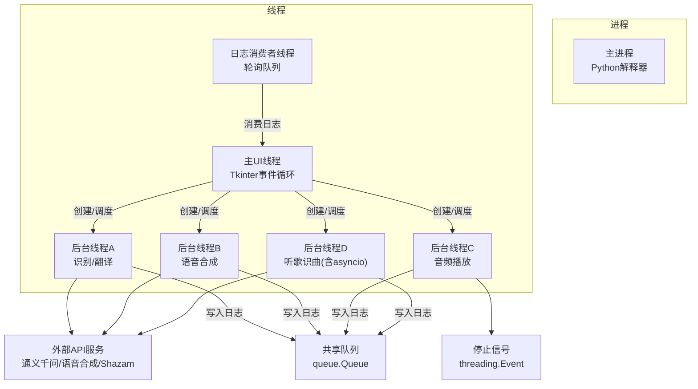
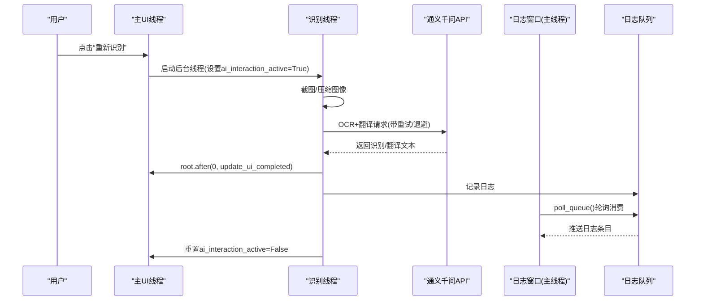
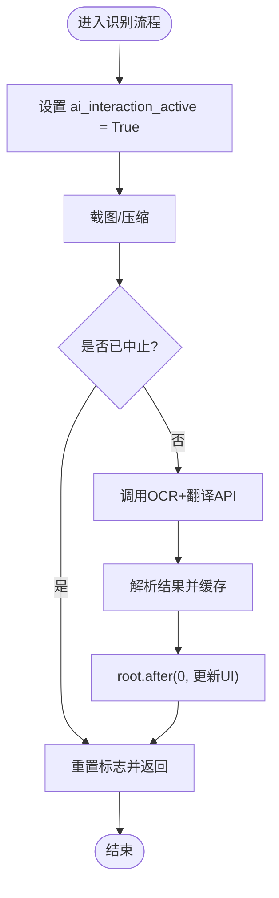
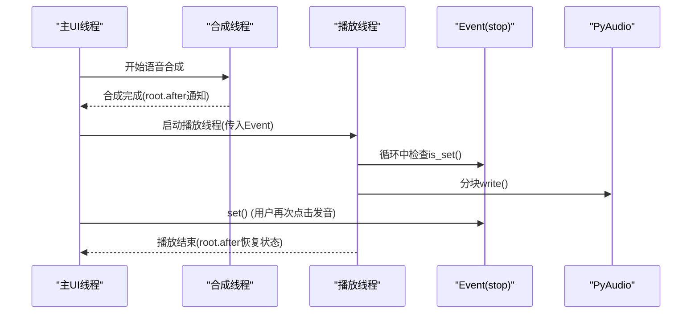
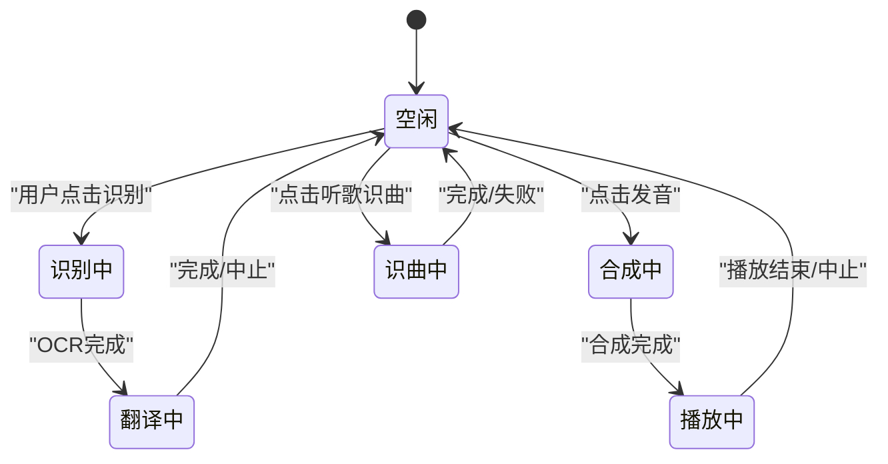
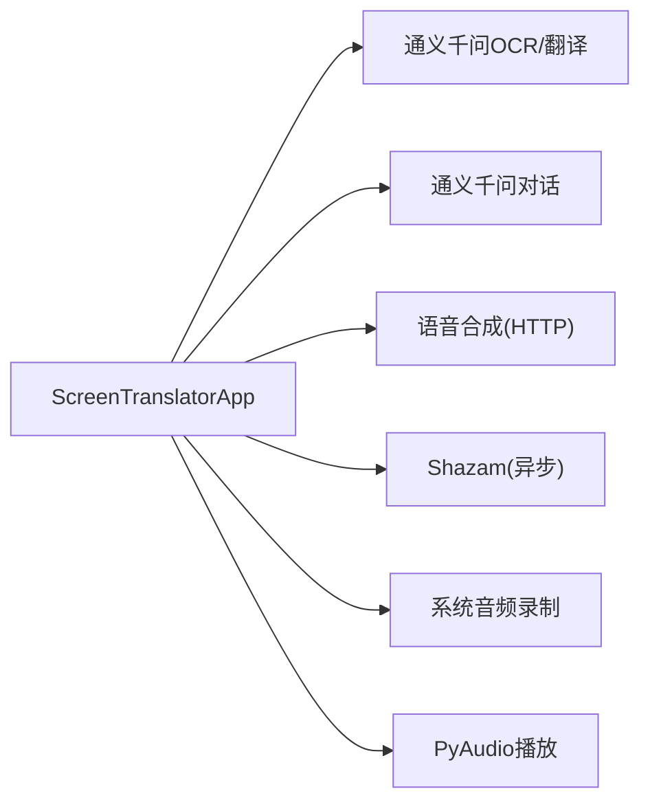

# 多线程与并发设计

<cite>
**本文引用的文件**   
- [screen_translator_with_qwen.py](file://screen_translator_with_qwen.py)
- [boot.py](file://boot.py)
</cite>

## 目录
1. [引言](#引言)
2. [项目结构](#项目结构)
3. [核心组件](#核心组件)
4. [架构总览](#架构总览)
5. [详细组件分析](#详细组件分析)
6. [依赖关系分析](#依赖关系分析)
7. [性能考量](#性能考量)
8. [故障排查指南](#故障排查指南)
9. [结论](#结论)
10. [附录](#附录)

## 引言
本文件聚焦于应用中的多线程与并发设计，围绕主UI线程、后台任务线程和音频播放线程的职责分离展开，系统阐述线程间通信机制（queue.Queue、threading.Event）、异步任务处理模式（AI对话、音频播放、API调用），以及线程池管理与资源清理策略（atexit注册、异常处理）。文档同时提供线程状态图、死锁预防策略与性能监控方法，并总结并发编程最佳实践与常见陷阱。

## 项目结构
本项目采用单进程多任务的桌面应用架构：
- 主进程运行Tkinter GUI，作为主UI线程负责事件循环与界面更新。
- 后台任务通过threading.Thread创建，执行耗时操作（截图、OCR/翻译、语音合成、音频播放、听歌识曲等）。
- 日志输出通过queue.Queue跨线程安全传递到UI侧的日志窗口。
- 启动器boot.py负责虚拟环境校验与目标程序无控制台启动，不直接参与运行时并发逻辑。

图表来源
- [screen_translator_with_qwen.py:302-312](file://screen_translator_with_qwen.py#L302-L312)
- [screen_translator_with_qwen.py:1017-1020](file://screen_translator_with_qwen.py#L1017-L1020)
- [screen_translator_with_qwen.py:1490-1494](file://screen_translator_with_qwen.py#L1490-L1494)
- [screen_translator_with_qwen.py:2393-2395](file://screen_translator_with_qwen.py#L2393-L2395)

章节来源
- [screen_translator_with_qwen.py:1-120](file://screen_translator_with_qwen.py#L1-L120)
- [boot.py:256-279](file://boot.py#L256-L279)

## 核心组件
- 主UI线程（ScreenTranslatorApp）
  - 职责：维护界面状态、响应交互、调度后台任务、在UI线程中更新界面。
  - 关键状态：ai_interaction_active、translating、synthesizing、playing、play_stop_event、play_thread、shazam_recognizing。
- 后台任务线程
  - 识别/翻译线程：截图、压缩、OCR+翻译、结果缓存、UI更新。
  - 语音合成线程：调用HTTP TTS流式接口，落盘WAV，触发播放。
  - 音频播放线程：读取WAV、可选变速重采样、分块写入PyAudio输出流，支持Event中断。
  - 听歌识曲线程：录制系统音频（多种方案），使用asyncio驱动Shazam识别，清理临时文件。
- 日志子系统
  - queue.Queue承载跨线程日志消息；LogWindowHandler将日志入队；LogWindow.poll_queue在主线程轮询消费。
- 启动器（boot.py）
  - 负责虚拟环境校验、依赖安装/增量更新、以无控制台方式启动目标脚本。

章节来源
- [screen_translator_with_qwen.py:474-634](file://screen_translator_with_qwen.py#L474-L634)
- [screen_translator_with_qwen.py:927-1021](file://screen_translator_with_qwen.py#L927-L1021)
- [screen_translator_with_qwen.py:1022-1097](file://screen_translator_with_qwen.py#L1022-L1097)
- [screen_translator_with_qwen.py:1442-1569](file://screen_translator_with_qwen.py#L1442-L1569)
- [screen_translator_with_qwen.py:2272-2396](file://screen_translator_with_qwen.py#L2272-L2396)
- [screen_translator_with_qwen.py:302-312](file://screen_translator_with_qwen.py#L302-L312)
- [boot.py:256-279](file://boot.py#L256-L279)

## 架构总览
下图展示了从用户点击“重新识别”到最终显示结果的完整并发流程，包括线程创建、状态标志控制、UI回调与错误处理。

图表来源
- [screen_translator_with_qwen.py:927-1021](file://screen_translator_with_qwen.py#L927-L1021)
- [screen_translator_with_qwen.py:1123-1248](file://screen_translator_with_qwen.py#L1123-L1248)
- [screen_translator_with_qwen.py:302-312](file://screen_translator_with_qwen.py#L302-L312)

## 详细组件分析

### 线程模型与职责分离
- 主UI线程
  - 仅做轻量UI更新与调度，避免阻塞。
  - 所有对Tkinter控件的修改必须回到主线程（root.after或after_idle）。
- 后台任务线程
  - 识别/翻译：I/O密集（网络请求），使用daemon线程，防止阻塞退出。
  - 语音合成：I/O密集（流式TTS），完成后触发播放。
  - 音频播放：CPU/IO混合（解码、插值、写设备），支持Event中断。
  - 听歌识曲：包含录制与异步识别，使用独立事件循环。
- 日志消费者
  - 在主线程周期轮询队列，避免跨线程直接操作UI。

章节来源
- [screen_translator_with_qwen.py:1017-1020](file://screen_translator_with_qwen.py#L1017-L1020)
- [screen_translator_with_qwen.py:1490-1494](file://screen_translator_with_qwen.py#L1490-L1494)
- [screen_translator_with_qwen.py:2393-2395](file://screen_translator_with_qwen.py#L2393-L2395)
- [screen_translator_with_qwen.py:76-87](file://screen_translator_with_qwen.py#L76-L87)

### 线程间通信机制
- 日志通道：queue.Queue + LogWindowHandler + LogWindow.poll_queue
  - 生产者：各后台线程通过logging写入，由自定义Handler入队。
  - 消费者：主线程定时轮询，非阻塞get_nowait，避免阻塞UI。
- 任务中止与同步：
  - 布尔标志：ai_interaction_active、translating、synthesizing、shazam_recognizing用于快速检查是否应中止。
  - Event对象：play_stop_event用于中断音频播放循环。
- UI回调：
  - 所有UI更新通过root.after(0, ...)提交到主线程事件循环，保证线程安全。

图表来源
- [screen_translator_with_qwen.py:927-1021](file://screen_translator_with_qwen.py#L927-L1021)
- [screen_translator_with_qwen.py:1123-1248](file://screen_translator_with_qwen.py#L1123-L1248)

章节来源
- [screen_translator_with_qwen.py:302-312](file://screen_translator_with_qwen.py#L302-L312)
- [screen_translator_with_qwen.py:76-87](file://screen_translator_with_qwen.py#L76-L87)
- [screen_translator_with_qwen.py:1704-1722](file://screen_translator_with_qwen.py#L1704-L1722)

### 异步任务处理模式
- AI对话（聊天窗口）
  - 在新线程中发起请求，成功后通过root.after回调更新UI。
- 音频播放
  - 合成完成后，创建播放线程，传入Event用于中断；播放函数内部按块写入并检查Event。
- 听歌识曲
  - 录制阶段为同步I/O；识别阶段使用asyncio.new_event_loop并在该线程内run_until_complete，避免与主事件循环冲突。

图表来源
- [screen_translator_with_qwen.py:1490-1494](file://screen_translator_with_qwen.py#L1490-L1494)
- [screen_translator_with_qwen.py:1558-1569](file://screen_translator_with_qwen.py#L1558-L1569)
- [screen_translator_with_qwen.py:371-473](file://screen_translator_with_qwen.py#L371-L473)

章节来源
- [screen_translator_with_qwen.py:239-299](file://screen_translator_with_qwen.py#L239-L299)
- [screen_translator_with_qwen.py:1490-1494](file://screen_translator_with_qwen.py#L1490-L1494)
- [screen_translator_with_qwen.py:2302-2311](file://screen_translator_with_qwen.py#L2302-L2311)

### 线程池管理与资源清理
- 线程生命周期
  - 全部后台线程均设置为daemon=True，确保主进程退出时不会阻塞。
- 资源清理
  - atexit.register(cleanup_cosyvoice_wav)：进程退出时删除临时WAV文件。
  - 窗口关闭协议：on_window_close可结合atexit进行额外清理。
  - 播放线程：join(timeout=0.5)尝试优雅终止后再继续。
- 异常处理
  - 识别/翻译/合成/播放均在try/except包裹，并通过root.after回传错误信息到UI。

章节来源
- [screen_translator_with_qwen.py:483-485](file://screen_translator_with_qwen.py#L483-L485)
- [screen_translator_with_qwen.py:363-371](file://screen_translator_with_qwen.py#L363-L371)
- [screen_translator_with_qwen.py:1458-1463](file://screen_translator_with_qwen.py#L1458-L1463)
- [screen_translator_with_qwen.py:1002-1016](file://screen_translator_with_qwen.py#L1002-L1016)
- [screen_translator_with_qwen.py:1548-1556](file://screen_translator_with_qwen.py#L1548-L1556)

### 线程状态图

图表来源
- [screen_translator_with_qwen.py:927-1021](file://screen_translator_with_qwen.py#L927-L1021)
- [screen_translator_with_qwen.py:1442-1569](file://screen_translator_with_qwen.py#L1442-L1569)
- [screen_translator_with_qwen.py:2272-2396](file://screen_translator_with_qwen.py#L2272-L2396)

### 死锁预防策略
- 禁止在后台线程直接操作Tkinter控件，统一通过root.after提交到主线程。
- 使用Event而非复杂锁来中断长时间运行的I/O循环，降低锁竞争与死锁风险。
- 避免在UI线程中进行阻塞I/O（如网络请求、音频录制），全部下沉至后台线程。
- 使用daemon线程，避免主线程等待子线程导致的退出阻塞。

章节来源
- [screen_translator_with_qwen.py:960-966](file://screen_translator_with_qwen.py#L960-L966)
- [screen_translator_with_qwen.py:1490-1494](file://screen_translator_with_qwen.py#L1490-L1494)
- [screen_translator_with_qwen.py:1017-1020](file://screen_translator_with_qwen.py#L1017-L1020)

### 性能监控方法
- 日志粒度
  - 在关键路径（截图、压缩、API请求、合成、播放）记录耗时与大小信息，便于定位瓶颈。
- 指标建议
  - 识别/翻译延迟、合成时长、播放首包延迟、队列积压长度（可在poll_queue中统计）。
- 工具建议
  - 使用time.perf_counter测量关键段耗时；必要时引入简单的计数器/直方图存储于内存并按需导出。

[本节为通用指导，无需具体文件引用]

## 依赖关系分析
- 模块耦合
  - ScreenTranslatorApp集中管理线程与状态，对外暴露按钮回调；内部依赖pyautogui、OpenAI SDK、dashscope TTS、pyaudio、asyncio等。
- 外部集成点
  - 通义千问API（OCR+翻译、对话）
  - 语音合成HTTP接口（cosyvoice）
  - Shazam识别（异步）
  - 系统音频录制（soundcard/pyaudiowpatch/pyaudio）
- 潜在循环依赖
  - 当前代码未出现显式循环导入；注意未来扩展时保持UI层与业务层解耦。

图表来源
- [screen_translator_with_qwen.py:1123-1248](file://screen_translator_with_qwen.py#L1123-L1248)
- [screen_translator_with_qwen.py:239-299](file://screen_translator_with_qwen.py#L239-L299)
- [screen_translator_with_qwen.py:1490-1494](file://screen_translator_with_qwen.py#L1490-L1494)
- [screen_translator_with_qwen.py:2233-2271](file://screen_translator_with_qwen.py#L2233-L2271)
- [screen_translator_with_qwen.py:1789-1851](file://screen_translator_with_qwen.py#L1789-L1851)

章节来源
- [screen_translator_with_qwen.py:1-120](file://screen_translator_with_qwen.py#L1-L120)
- [screen_translator_with_qwen.py:2233-2271](file://screen_translator_with_qwen.py#L2233-L2271)

## 性能考量
- I/O与CPU分离
  - 网络请求与音频I/O放后台线程；CPU密集型（如音频插值）尽量限制数据规模与采样率。
- 重试与退避
  - 对429等限流错误采用指数退避+随机抖动，避免雪崩。
- 资源复用
  - 复用OpenAI客户端实例；音频播放前清理旧WAV，减少磁盘碎片。
- 队列消费频率
  - 日志轮询间隔不宜过短，避免抢占UI时间片；100ms左右较为平衡。

[本节为通用指导，无需具体文件引用]

## 故障排查指南
- 常见问题
  - 界面卡顿：确认是否在UI线程执行了阻塞操作。
  - 无法录音：检查系统混音/WASAPI环回设备可用性与权限。
  - 播放中断：确认Event是否正确set，以及播放线程是否仍在运行。
  - 日志缺失：检查LogWindow是否可见且poll_queue是否正常轮询。
- 定位步骤
  - 查看日志窗口，关注“识别失败/合成失败/播放失败”等关键字。
  - 检查临时文件是否存在（cosyvoice.wav、临时录音文件）。
  - 验证API密钥与网络连通性。

章节来源
- [screen_translator_with_qwen.py:1002-1016](file://screen_translator_with_qwen.py#L1002-L1016)
- [screen_translator_with_qwen.py:1548-1556](file://screen_translator_with_qwen.py#L1548-L1556)
- [screen_translator_with_qwen.py:1789-1851](file://screen_translator_with_qwen.py#L1789-L1851)
- [screen_translator_with_qwen.py:302-312](file://screen_translator_with_qwen.py#L302-L312)

## 结论
本项目采用清晰的主UI线程+多后台线程模型，借助queue.Queue与threading.Event实现安全的跨线程通信与任务中断，配合atexit与异常处理保障资源释放与健壮性。通过合理的重试与退避策略、严格的UI线程隔离与daemon线程策略，整体并发设计具备较好的稳定性与可维护性。后续可考虑引入线程池统一管理任务、增加更完善的性能埋点与可视化监控。

[本节为总结性内容，无需具体文件引用]

## 附录
- 并发编程最佳实践
  - 永远不在后台线程操作GUI。
  - 优先使用Event/条件变量协调简单中断，避免复杂锁。
  - 对I/O操作使用超时与重试，区分瞬时错误与永久错误。
  - 使用daemon线程简化退出流程，但需谨慎处理关键资源清理。
- 常见陷阱
  - 忘记root.after导致崩溃或竞态。
  - 在UI线程阻塞导致界面假死。
  - 忽略Event导致播放无法及时停止。
  - 未清理临时文件或音频句柄造成资源泄漏。

[本节为通用指导，无需具体文件引用]