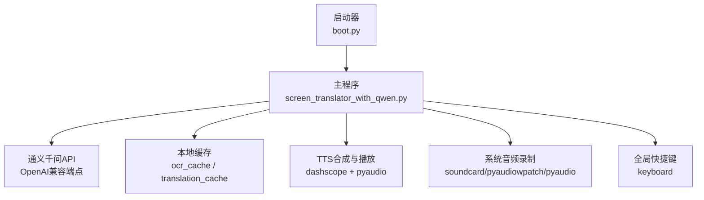
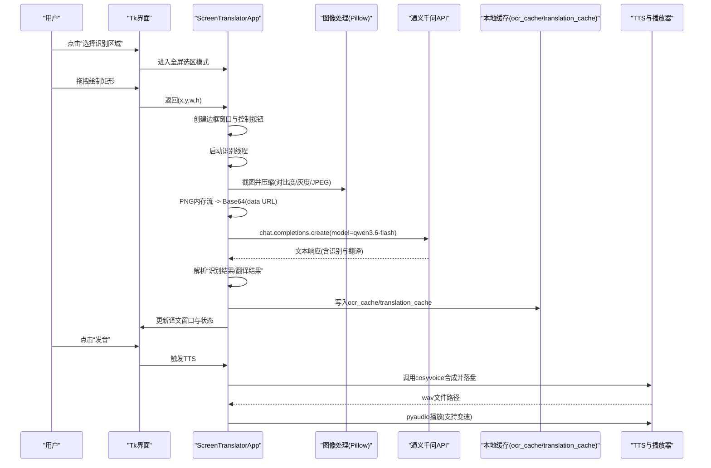
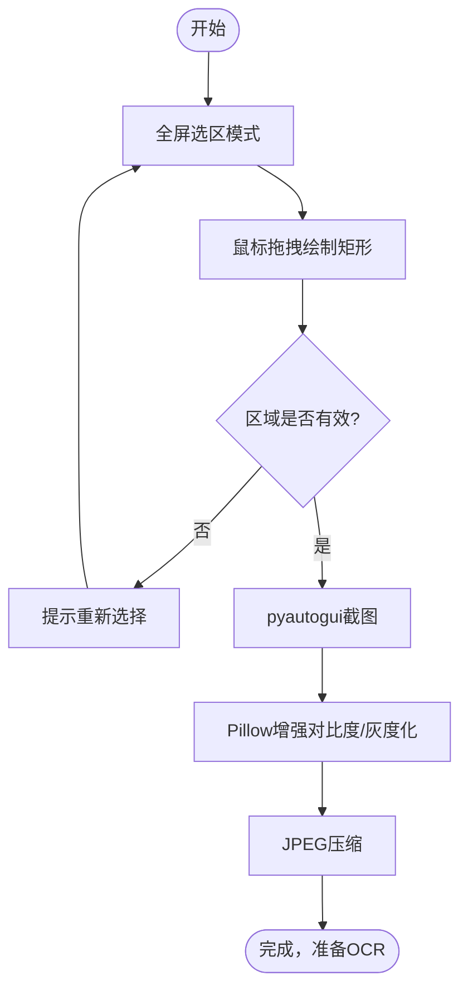
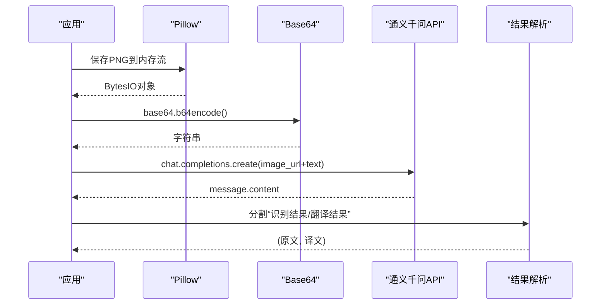
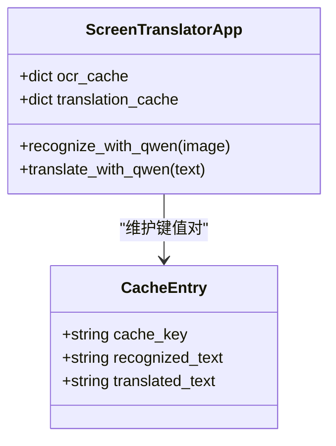
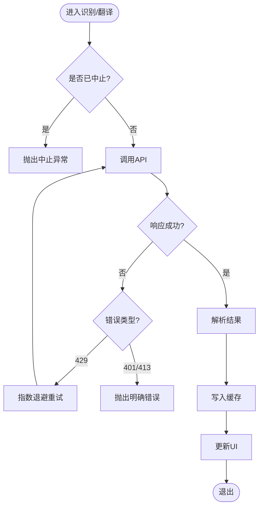
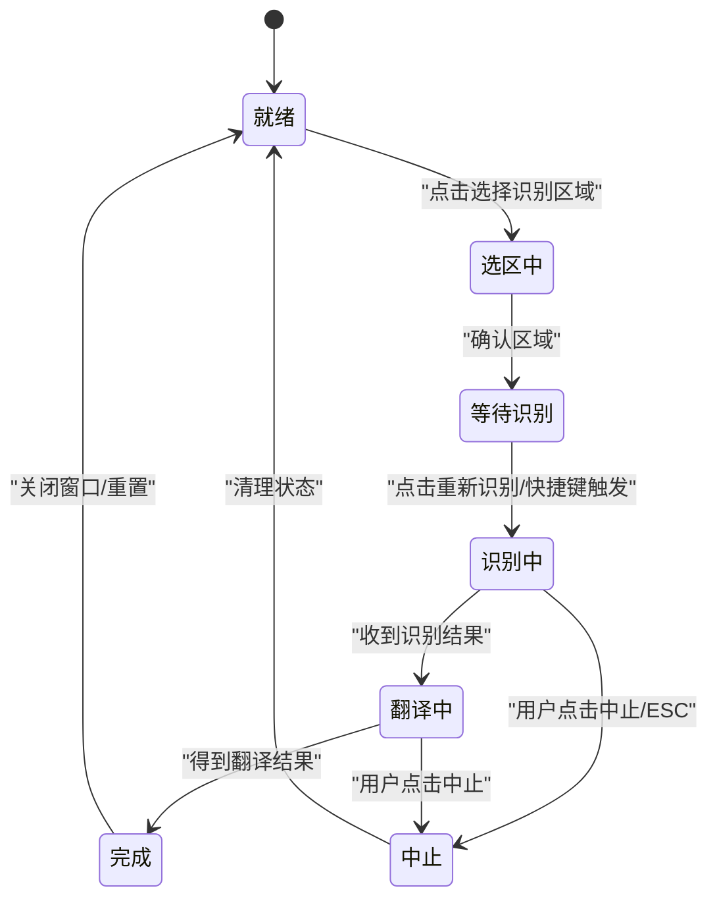
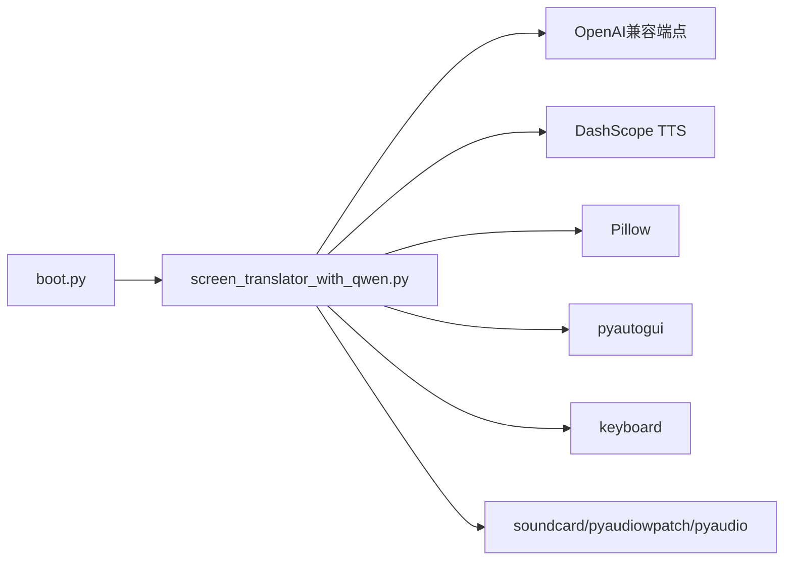

# OCR识别数据流

<cite>
**本文引用的文件**
- [screen_translator_with_qwen.py](file://screen_translator_with_qwen.py)
- [boot.py](file://boot.py)
- [requirements.txt](file://requirements.txt)
- [qwen_ocr.py](file://test/qwen_ocr.py)
</cite>

## 目录
1. [简介](#简介)
2. [项目结构](#项目结构)
3. [核心组件](#核心组件)
4. [架构总览](#架构总览)
5. [详细组件分析](#详细组件分析)
6. [依赖关系分析](#依赖关系分析)
7. [性能考虑](#性能考虑)
8. [故障排查指南](#故障排查指南)
9. [结论](#结论)
10. [附录](#附录)

## 简介
本文件面向“屏幕翻译工具（v2.0）”的OCR识别数据流，系统化梳理从用户选择区域、图像捕获、预处理、Base64编码、调用通义千问多模态模型进行OCR与翻译、结果解析与缓存、到UI展示与语音合成的完整链路。文档同时给出数据结构设计说明（ocr_cache）、异常处理流程、状态转换图、以及性能优化与调试建议，帮助读者快速理解并高效使用该系统。

## 项目结构
- 启动器 boot.py：自动检测主程序、管理虚拟环境、后台无控制台启动目标脚本。
- 主程序 screen_translator_with_qwen.py：Tkinter GUI + OCR/翻译数据流 + 音频播放 + 快捷键 + 日志窗口等。
- 示例 qwen_ocr.py：演示通过 OpenAI 兼容接口调用通义千问多模态模型。
- requirements.txt：列出关键依赖（截图、图像处理、OpenAI客户端、DashScope TTS、键盘监听、系统音频录制等）。

图表来源
- [boot.py:256-279](file://boot.py#L256-L279)
- [screen_translator_with_qwen.py:339-360](file://screen_translator_with_qwen.py#L339-L360)
- [screen_translator_with_qwen.py:1123-1247](file://screen_translator_with_qwen.py#L1123-L1247)
- [screen_translator_with_qwen.py:1442-1556](file://screen_translator_with_qwen.py#L1442-L1556)
- [screen_translator_with_qwen.py:1780-1788](file://screen_translator_with_qwen.py#L1780-L1788)

章节来源
- [boot.py:256-279](file://boot.py#L256-L279)
- [requirements.txt:1-31](file://requirements.txt#L1-L31)

## 核心组件
- 界面与交互
  - 区域选择：全屏半透明覆盖层，鼠标拖拽绘制矩形框，记录(x, y, w, h)。
  - 边框与按钮：在选定区域上叠加半透明蒙版+红色边框，右上角浮动控制按钮（重新识别、关闭等）。
  - 译文显示：独立无边框可拖动/拉伸窗口，支持发音按钮。
- OCR与翻译
  - 截图压缩：Pillow增强对比度、灰度化、JPEG压缩。
  - Base64编码：PNG内存流转base64 data URL。
  - API调用：OpenAI兼容接口，model为“qwen3.6-flash”，消息体包含image_url与text指令。
  - 结果解析：按“识别结果：/翻译结果：”分段提取。
  - 缓存：ocr_cache与translation_cache以图片前缀作为键，保存原文与译文。
- 语音能力
  - TTS：DashScope cosyvoice-v3-flash流式合成，落盘wav后由pyaudio播放，支持变速。
- 辅助功能
  - 全局快捷键：keyboard库注册热键触发重新识别。
  - 听歌识曲：系统音频录制 + Shazam识别（非OCR主线，但同属主程序模块）。
  - 日志窗口：线程安全队列驱动，实时滚动显示。

章节来源
- [screen_translator_with_qwen.py:635-713](file://screen_translator_with_qwen.py#L635-L713)
- [screen_translator_with_qwen.py:781-857](file://screen_translator_with_qwen.py#L781-L857)
- [screen_translator_with_qwen.py:859-926](file://screen_translator_with_qwen.py#L859-L926)
- [screen_translator_with_qwen.py:927-1021](file://screen_translator_with_qwen.py#L927-L1021)
- [screen_translator_with_qwen.py:1098-1122](file://screen_translator_with_qwen.py#L1098-L1122)
- [screen_translator_with_qwen.py:1123-1247](file://screen_translator_with_qwen.py#L1123-L1247)
- [screen_translator_with_qwen.py:1249-1266](file://screen_translator_with_qwen.py#L1249-L1266)
- [screen_translator_with_qwen.py:1442-1556](file://screen_translator_with_qwen.py#L1442-L1556)
- [screen_translator_with_qwen.py:1753-1788](file://screen_translator_with_qwen.py#L1753-L1788)

## 架构总览
下图展示了从用户操作到最终结果展示的端到端数据流，包括UI事件、图像处理、网络请求、结果解析与缓存、以及可选的TTS播放。

图表来源
- [screen_translator_with_qwen.py:781-857](file://screen_translator_with_qwen.py#L781-L857)
- [screen_translator_with_qwen.py:927-1021](file://screen_translator_with_qwen.py#L927-L1021)
- [screen_translator_with_qwen.py:1098-1122](file://screen_translator_with_qwen.py#L1098-L1122)
- [screen_translator_with_qwen.py:1123-1247](file://screen_translator_with_qwen.py#L1123-L1247)
- [screen_translator_with_qwen.py:1442-1556](file://screen_translator_with_qwen.py#L1442-L1556)

## 详细组件分析

### 区域选择与图像捕获
- 选区流程
  - 全屏半透明覆盖层，Canvas绘制矩形；记录起始/结束坐标，计算宽高。
  - 最小尺寸校验，避免过小区域导致识别失败或请求过大。
- 截图与压缩
  - 使用pyautogui.screenshot(region=(x,y,w,h))截取指定区域。
  - Pillow增强对比度、灰度化、JPEG压缩，降低传输体积。
- 线程与UI更新
  - 识别过程在新线程执行，通过root.after在主线程更新UI，避免阻塞。

图表来源
- [screen_translator_with_qwen.py:781-857](file://screen_translator_with_qwen.py#L781-L857)
- [screen_translator_with_qwen.py:927-987](file://screen_translator_with_qwen.py#L927-L987)
- [screen_translator_with_qwen.py:1098-1122](file://screen_translator_with_qwen.py#L1098-L1122)

章节来源
- [screen_translator_with_qwen.py:781-857](file://screen_translator_with_qwen.py#L781-L857)
- [screen_translator_with_qwen.py:927-987](file://screen_translator_with_qwen.py#L927-L987)
- [screen_translator_with_qwen.py:1098-1122](file://screen_translator_with_qwen.py#L1098-L1122)

### Base64编码与API调用
- Base64编码
  - 将PNG内存流转为base64字符串，拼接为data:image/png;base64,...格式。
- 请求构建
  - 使用OpenAI兼容客户端，model="qwen3.6-flash"，messages包含image_url与text指令。
  - text指令要求输出固定格式：“识别结果：... / 翻译结果：...”。
- 重试与退避
  - 最多重试5次，基础延迟3秒；遇到429错误采用指数退避+随机抖动。
- 响应解析
  - 按行扫描，定位“识别结果：/翻译结果：”标记，合并后续非空行为对应段落内容。

图表来源
- [screen_translator_with_qwen.py:1123-1247](file://screen_translator_with_qwen.py#L1123-L1247)
- [qwen_ocr.py:1-30](file://test/qwen_ocr.py#L1-L30)

章节来源
- [screen_translator_with_qwen.py:1123-1247](file://screen_translator_with_qwen.py#L1123-L1247)
- [qwen_ocr.py:1-30](file://test/qwen_ocr.py#L1-L30)

### 结果缓存与读取
- 数据结构
  - ocr_cache: dict[cache_key, recognized_text]
  - translation_cache: dict[cache_key, translated_text]
  - cache_key: 取Base64字符串的前100个字符作为标识。
- 写入时机
  - 成功解析出“识别结果/翻译结果”后，立即写入两个缓存字典。
- 读取策略
  - translate_with_qwen遍历ocr_cache，匹配传入的原文，返回对应译文。
- 过期策略与内存管理
  - 当前实现未内置过期时间或LRU淘汰；缓存随进程生命周期存在。
  - 若需长期运行且频繁识别，建议引入基于时间的过期或容量上限策略（见“性能考虑”）。

图表来源
- [screen_translator_with_qwen.py:1207-1213](file://screen_translator_with_qwen.py#L1207-L1213)
- [screen_translator_with_qwen.py:1249-1266](file://screen_translator_with_qwen.py#L1249-L1266)

章节来源
- [screen_translator_with_qwen.py:1207-1213](file://screen_translator_with_qwen.py#L1207-L1213)
- [screen_translator_with_qwen.py:1249-1266](file://screen_translator_with_qwen.py#L1249-L1266)

### 异常处理与中止机制
- 中止标志
  - ai_interaction_active：控制识别流程的中止检查点。
  - translating：控制翻译流程的中止检查点。
- 常见错误
  - 401 Unauthorized：API密钥无效或过期。
  - 413 Payload Too Large：请求体过大，需缩小识别区域。
  - 429 Too Many Requests：限频，指数退避重试。
- UI反馈
  - 所有异常均通过root.after在主线程更新状态标签与译文窗口文本，保证UI一致性。

图表来源
- [screen_translator_with_qwen.py:934-1021](file://screen_translator_with_qwen.py#L934-L1021)
- [screen_translator_with_qwen.py:1123-1247](file://screen_translator_with_qwen.py#L1123-L1247)
- [screen_translator_with_qwen.py:1704-1722](file://screen_translator_with_qwen.py#L1704-L1722)

章节来源
- [screen_translator_with_qwen.py:934-1021](file://screen_translator_with_qwen.py#L934-L1021)
- [screen_translator_with_qwen.py:1123-1247](file://screen_translator_with_qwen.py#L1123-L1247)
- [screen_translator_with_qwen.py:1704-1722](file://screen_translator_with_qwen.py#L1704-L1722)

### 状态转换图（识别流程）

图表来源
- [screen_translator_with_qwen.py:927-1021](file://screen_translator_with_qwen.py#L927-L1021)
- [screen_translator_with_qwen.py:1022-1096](file://screen_translator_with_qwen.py#L1022-L1096)
- [screen_translator_with_qwen.py:1704-1722](file://screen_translator_with_qwen.py#L1704-L1722)

### 快捷键与并发控制
- 全局快捷键
  - keyboard.add_hotkey注册热键，按下时直接调用recognize_area。
- 防重复
  - ai_interaction_active/translating标志防止同一时刻多次发起请求。
- 线程安全
  - UI更新统一通过root.after调度，避免跨线程访问Tk控件。

章节来源
- [screen_translator_with_qwen.py:1753-1788](file://screen_translator_with_qwen.py#L1753-L1788)
- [screen_translator_with_qwen.py:934-1021](file://screen_translator_with_qwen.py#L934-L1021)

### 语音合成与播放（可选）
- 合成
  - DashScope HttpSpeechSynthesizer.stream=True流式合成，落盘cosyvoice.wav。
- 播放
  - pyaudio打开WAV，支持变速（线性插值重采样），播放完成后恢复UI状态。

章节来源
- [screen_translator_with_qwen.py:1442-1556](file://screen_translator_with_qwen.py#L1442-L1556)

## 依赖关系分析
- 启动器与主程序
  - boot.py负责发现唯一主程序、确保venv可用、后台启动。
- 主程序对外部服务的依赖
  - OpenAI兼容端点（通义千问）用于OCR与翻译。
  - DashScope用于TTS。
  - Pillow、pyautogui用于图像处理与截图。
  - keyboard用于全局快捷键。
  - soundcard/pyaudiowpatch/pyaudio用于系统音频录制（听歌识曲）。

图表来源
- [boot.py:256-279](file://boot.py#L256-L279)
- [requirements.txt:1-31](file://requirements.txt#L1-L31)

章节来源
- [boot.py:256-279](file://boot.py#L256-L279)
- [requirements.txt:1-31](file://requirements.txt#L1-L31)

## 性能考虑
- 图像预处理
  - 对比度增强与灰度化有助于提升OCR准确率；JPEG质量参数可调，平衡体积与识别效果。
- 请求体积控制
  - 限制识别区域大小，避免413错误；必要时进一步降低JPEG质量或分辨率。
- 重试与退避
  - 指数退避+随机抖动缓解429限频；合理设置最大重试次数与基础延迟。
- 缓存策略
  - 当前缓存无过期与容量限制，长时间运行可能占用较多内存。建议：
    - 引入基于时间的过期（如最近N分钟内的条目保留）。
    - 限制最大条目数，超出则淘汰最久未使用的项。
    - 使用更稳定的哈希键（如SHA256前缀）减少碰撞概率。
- 并发与UI
  - 识别/翻译均在子线程执行，UI更新通过after调度，避免卡顿。
- 音频播放
  - 大文件一次性加载到内存再分块播放，注意内存峰值；可在长音频场景下改为流式解码播放。

[本节为通用指导，不直接分析具体文件]

## 故障排查指南
- 无法初始化AI客户端
  - 现象：提示“AI客户端未初始化，请检查key.txt文件中的API密钥”。
  - 排查：确认key.txt存在且包含有效的API Key；检查网络连通性。
- 401 Unauthorized
  - 现象：请求失败，提示密钥无效或过期。
  - 处理：更新key.txt中的API Key。
- 413 Payload Too Large
  - 现象：请求体过大。
  - 处理：缩小识别区域或降低图像质量。
- 429 Too Many Requests
  - 现象：限频错误。
  - 处理：等待指数退避后的重试；降低请求频率。
- 无法录制系统音频
  - 现象：听歌识曲失败。
  - 处理：根据提示安装pyaudiowpatch或启用立体声混音；蓝牙耳机设备可能不支持环回。
- 快捷键无效
  - 现象：按下热键无反应。
  - 处理：确认keyboard库已安装；检查是否被其他程序占用；重新设置快捷键。

章节来源
- [screen_translator_with_qwen.py:339-360](file://screen_translator_with_qwen.py#L339-L360)
- [screen_translator_with_qwen.py:1123-1247](file://screen_translator_with_qwen.py#L1123-L1247)
- [screen_translator_with_qwen.py:1789-1851](file://screen_translator_with_qwen.py#L1789-L1851)
- [screen_translator_with_qwen.py:1753-1788](file://screen_translator_with_qwen.py#L1753-L1788)

## 结论
该OCR识别数据流以“区域选择→截图→预处理→Base64→API调用→解析→缓存→UI/TTS”为主线，具备完善的异常处理与中止机制，并通过多线程与UI调度保障流畅体验。建议在长期运行的生产环境中引入缓存过期与容量控制，并根据实际网络与硬件条件调优图像质量与重试策略。

[本节为总结，不直接分析具体文件]

## 附录

### 关键函数与路径索引
- 区域选择与识别入口
  - [select_area:781-857](file://screen_translator_with_qwen.py#L781-L857)
  - [recognize_area:927-1021](file://screen_translator_with_qwen.py#L927-L1021)
- 图像处理
  - [compress_image:1098-1122](file://screen_translator_with_qwen.py#L1098-L1122)
- OCR与翻译
  - [recognize_with_qwen:1123-1247](file://screen_translator_with_qwen.py#L1123-L1247)
  - [translate_with_qwen:1249-1266](file://screen_translator_with_qwen.py#L1249-L1266)
- 缓存读写
  - [缓存写入位置:1207-1213](file://screen_translator_with_qwen.py#L1207-L1213)
  - [缓存读取位置:1249-1266](file://screen_translator_with_qwen.py#L1249-L1266)
- 语音合成与播放
  - [speak_original_text:1442-1556](file://screen_translator_with_qwen.py#L1442-L1556)
- 快捷键
  - [register_global_shortcut:1753-1788](file://screen_translator_with_qwen.py#L1753-L1788)
  - [on_shortcut_pressed:1780-1788](file://screen_translator_with_qwen.py#L1780-L1788)
- 启动器
  - [main:256-279](file://boot.py#L256-L279)
- 示例调用
  - [qwen_ocr.py:1-30](file://test/qwen_ocr.py#L1-L30)