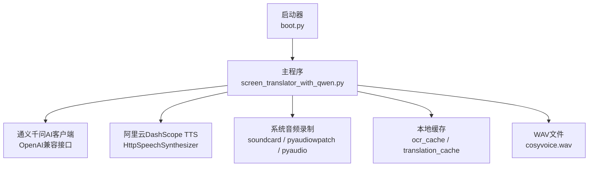
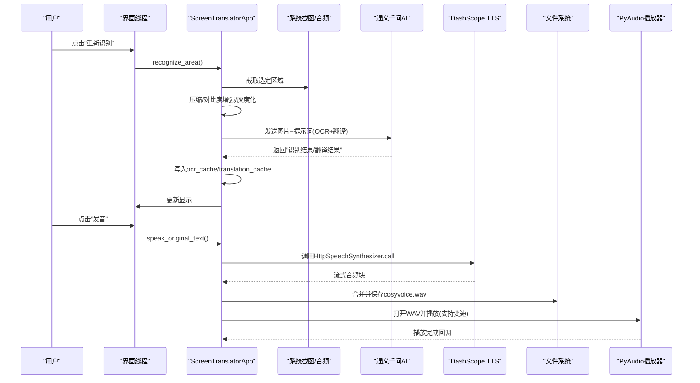
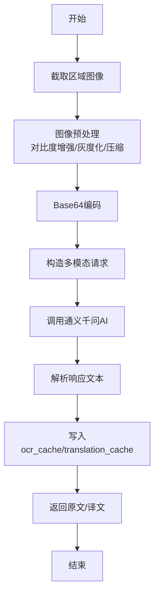
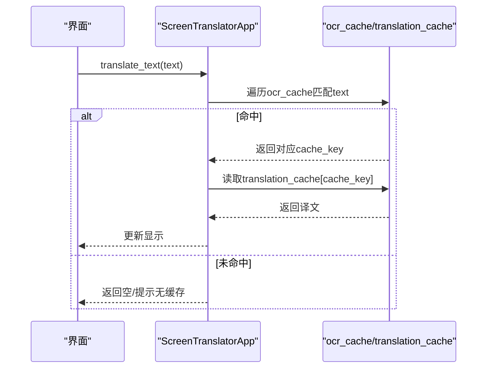
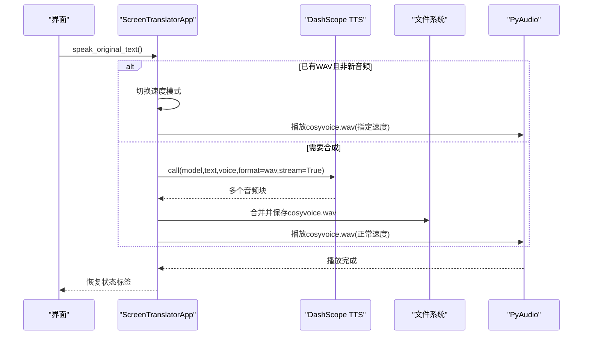
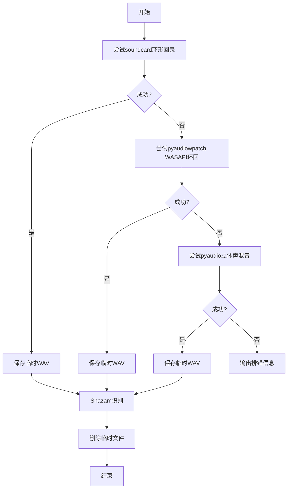
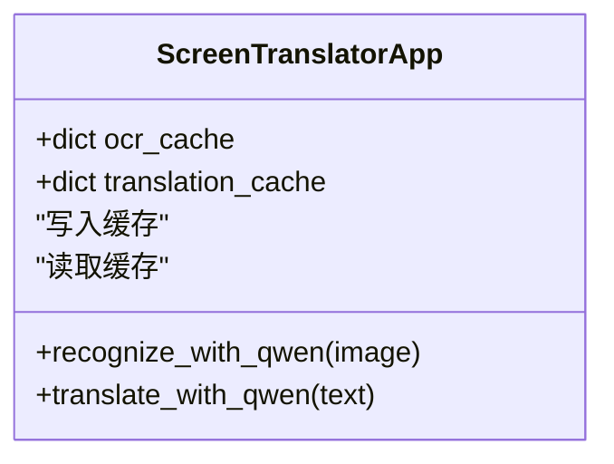
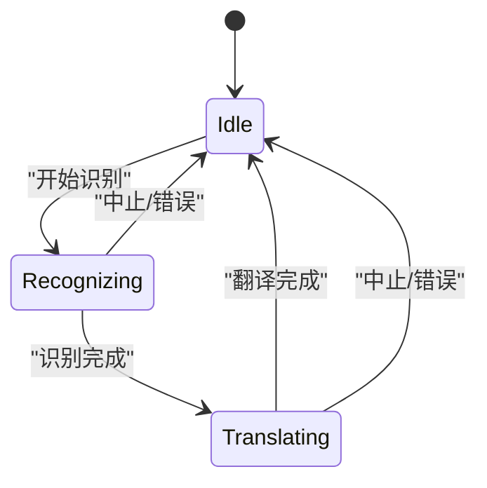
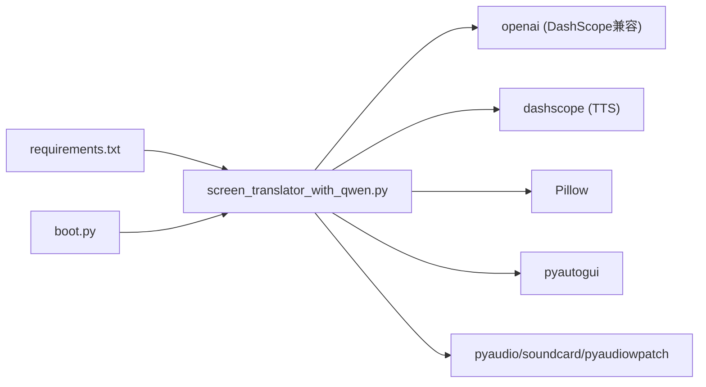

# 数据流架构

<cite>
**本文引用的文件**   
- [screen_translator_with_qwen.py](file://screen_translator_with_qwen.py)
- [boot.py](file://boot.py)
- [requirements.txt](file://requirements.txt)
- [glm_ocr_example.py](file://test/glm_ocr_example.py)
- [qwen_ocr.py](file://test/qwen_ocr.py)
</cite>

## 目录
1. [引言](#引言)
2. [项目结构](#项目结构)
3. [核心组件](#核心组件)
4. [架构总览](#架构总览)
5. [详细组件分析](#详细组件分析)
6. [依赖关系分析](#依赖关系分析)
7. [性能考量](#性能考量)
8. [故障排查指南](#故障排查指南)
9. [结论](#结论)
10. [附录](#附录)

## 引言
本文件聚焦于屏幕翻译工具的数据流架构，围绕以下链路展开：
- OCR识别流程：从屏幕截图到图像预处理再到AI识别的完整数据流向。
- 翻译服务调用：请求构建、API调用、结果缓存与错误处理。
- 音频处理管道：语音合成、文件管理与播放控制。
- 缓存机制：ocr_cache与translation_cache的数据结构与更新策略。
- 配套图示：数据流图、状态转换图、异常处理流程图。
- 优化建议与调试技巧。

## 项目结构
仓库包含启动器、主程序与测试示例：
- boot.py：通用启动器，负责虚拟环境校验/重建、依赖安装与后台运行目标程序。
- screen_translator_with_qwen.py：主程序，实现OCR+翻译+TTS+播放+听歌识曲等能力。
- requirements.txt：依赖清单（截图、图像处理、OpenAI/DashScope SDK、音频库等）。
- test/*：若干示例脚本，演示OCR与系统音频录制等用法。

图表来源
- [boot.py:256-279](file://boot.py#L256-L279)
- [screen_translator_with_qwen.py:338-360](file://screen_translator_with_qwen.py#L338-L360)
- [screen_translator_with_qwen.py:1510-1531](file://screen_translator_with_qwen.py#L1510-L1531)
- [screen_translator_with_qwen.py:1789-1851](file://screen_translator_with_qwen.py#L1789-L1851)
- [screen_translator_with_qwen.py:1207-1211](file://screen_translator_with_qwen.py#L1207-L1211)

章节来源
- [boot.py:256-279](file://boot.py#L256-L279)
- [requirements.txt:1-31](file://requirements.txt#L1-L31)

## 核心组件
- 启动器（boot.py）
  - 自动检测唯一Python主程序，确保虚拟环境有效或重建，增量更新依赖，后台无控制台启动目标程序。
- 主应用（ScreenTranslatorApp）
  - 区域选择与UI交互、OCR识别、翻译、TTS合成与播放、听歌识曲、全局快捷键、日志窗口。
- AI客户端（OpenAI兼容）
  - 通过DashScope兼容端点调用多模态模型进行OCR与翻译。
- 语音合成（DashScope TTS）
  - 使用HttpSpeechSynthesizer将文本合成为WAV并落盘，随后由PyAudio播放。
- 系统音频录制
  - 提供三种方案：soundcard环形回录、pyaudiowpatch WASAPI环回、pyaudio立体声混音，按可用性依次尝试。
- 缓存层
  - ocr_cache与translation_cache为内存字典，键基于图像前缀，值分别为原文与译文。

章节来源
- [boot.py:209-253](file://boot.py#L209-L253)
- [screen_translator_with_qwen.py:474-634](file://screen_translator_with_qwen.py#L474-L634)
- [screen_translator_with_qwen.py:338-360](file://screen_translator_with_qwen.py#L338-L360)
- [screen_translator_with_qwen.py:1510-1531](file://screen_translator_with_qwen.py#L1510-L1531)
- [screen_translator_with_qwen.py:1789-1851](file://screen_translator_with_qwen.py#L1789-L1851)
- [screen_translator_with_qwen.py:1207-1211](file://screen_translator_with_qwen.py#L1207-L1211)

## 架构总览
整体数据流分为三条主线：
- OCR识别线：截图→压缩增强→Base64编码→多模态模型→解析返回→写入缓存→展示。
- 翻译查询线：根据原文在缓存中查找对应译文；若不存在则返回空（当前设计不触发二次翻译请求）。
- 音频播放线：TTS合成→WAV落盘→PyAudio读取→可选变速重采样→播放。

图表来源
- [screen_translator_with_qwen.py:927-1021](file://screen_translator_with_qwen.py#L927-L1021)
- [screen_translator_with_qwen.py:1098-1121](file://screen_translator_with_qwen.py#L1098-L1121)
- [screen_translator_with_qwen.py:1123-1247](file://screen_translator_with_qwen.py#L1123-L1247)
- [screen_translator_with_qwen.py:1442-1556](file://screen_translator_with_qwen.py#L1442-L1556)
- [screen_translator_with_qwen.py:372-472](file://screen_translator_with_qwen.py#L372-L472)

## 详细组件分析

### OCR识别数据流
- 输入：用户选择的矩形区域坐标。
- 处理：
  - 截图：pyautogui.screenshot(region=(x,y,w,h))。
  - 预处理：提高对比度、灰度化、JPEG压缩后转PNG内存流。
  - 编码：PNG字节转Base64。
  - 推理：OpenAI兼容接口调用qwen3.6-flash，附带提示词要求同时输出“识别结果”和“翻译结果”。
  - 解析：按行分割，提取“识别结果：”和“翻译结果：”两段内容。
  - 缓存：以图像Base64前100字符作为键，分别存入ocr_cache与translation_cache。
- 输出：原文与译文字符串，用于UI展示与后续发音。

图表来源
- [screen_translator_with_qwen.py:927-1021](file://screen_translator_with_qwen.py#L927-L1021)
- [screen_translator_with_qwen.py:1098-1121](file://screen_translator_with_qwen.py#L1098-L1121)
- [screen_translator_with_qwen.py:1123-1247](file://screen_translator_with_qwen.py#L1123-L1247)

章节来源
- [screen_translator_with_qwen.py:927-1021](file://screen_translator_with_qwen.py#L927-L1021)
- [screen_translator_with_qwen.py:1098-1121](file://screen_translator_with_qwen.py#L1098-L1121)
- [screen_translator_with_qwen.py:1123-1247](file://screen_translator_with_qwen.py#L1123-L1247)

### 翻译服务调用数据管道
- 入口：translate_text(text)。
- 逻辑：
  - 遍历ocr_cache，寻找与text完全匹配的条目。
  - 命中则从translation_cache取对应译文返回。
  - 未命中则返回空字符串（当前实现不发起额外翻译请求）。
- 并发：在新线程中执行，避免阻塞UI。
- 错误处理：捕获异常并更新UI状态。

图表来源
- [screen_translator_with_qwen.py:1022-1096](file://screen_translator_with_qwen.py#L1022-L1096)
- [screen_translator_with_qwen.py:1249-1266](file://screen_translator_with_qwen.py#L1249-L1266)

章节来源
- [screen_translator_with_qwen.py:1022-1096](file://screen_translator_with_qwen.py#L1022-L1096)
- [screen_translator_with_qwen.py:1249-1266](file://screen_translator_with_qwen.py#L1249-L1266)

### 音频处理管道（TTS + 播放）
- 触发：speak_original_text()。
- 步骤：
  - 若存在cosyvoice.wav且为新音频，重置速度模式并按新速度播放。
  - 否则调用DashScope HttpSpeechSynthesizer.call，stream=True获取音频块，合并后写入cosyvoice.wav。
  - 播放：play_cosyvoice_wav(stop_event, speed)，支持线性插值变速。
- 文件管理：
  - 启动时清理旧cosyvoice.wav，退出时再次清理。
  - 播放完成后恢复UI状态。

图表来源
- [screen_translator_with_qwen.py:1442-1556](file://screen_translator_with_qwen.py#L1442-L1556)
- [screen_translator_with_qwen.py:372-472](file://screen_translator_with_qwen.py#L372-L472)
- [screen_translator_with_qwen.py:363-371](file://screen_translator_with_qwen.py#L363-L371)

章节来源
- [screen_translator_with_qwen.py:1442-1556](file://screen_translator_with_qwen.py#L1442-L1556)
- [screen_translator_with_qwen.py:372-472](file://screen_translator_with_qwen.py#L372-L472)
- [screen_translator_with_qwen.py:363-371](file://screen_translator_with_qwen.py#L363-L371)

### 系统音频录制（听歌识曲）
- 入口：recognize_song() → _run_shazam_recognition() → record_system_audio()。
- 策略：按优先级依次尝试三种方案，任一成功即返回临时WAV路径；全部失败则给出排错指引。
  - 方案1：soundcard环形回录（默认扬声器loopback）。
  - 方案2：pyaudiowpatch WASAPI环回（支持蓝牙耳机）。
  - 方案3：pyaudio立体声混音（需系统启用Stereo Mix）。
- 识别：shazamio异步识别，成功后清理临时文件并展示结果。

图表来源
- [screen_translator_with_qwen.py:1789-1851](file://screen_translator_with_qwen.py#L1789-L1851)
- [screen_translator_with_qwen.py:1853-1941](file://screen_translator_with_qwen.py#L1853-L1941)
- [screen_translator_with_qwen.py:1943-1998](file://screen_translator_with_qwen.py#L1943-L1998)
- [screen_translator_with_qwen.py:2070-2145](file://screen_translator_with_qwen.py#L2070-L2145)
- [screen_translator_with_qwen.py:2233-2270](file://screen_translator_with_qwen.py#L2233-L2270)

章节来源
- [screen_translator_with_qwen.py:1789-1851](file://screen_translator_with_qwen.py#L1789-L1851)
- [screen_translator_with_qwen.py:1853-1941](file://screen_translator_with_qwen.py#L1853-L1941)
- [screen_translator_with_qwen.py:1943-1998](file://screen_translator_with_qwen.py#L1943-L1998)
- [screen_translator_with_qwen.py:2070-2145](file://screen_translator_with_qwen.py#L2070-L2145)
- [screen_translator_with_qwen.py:2233-2270](file://screen_translator_with_qwen.py#L2233-L2270)

### 缓存机制设计与更新策略
- 数据结构：
  - ocr_cache: dict[str, str]，键为图像Base64前100字符，值为识别到的原文。
  - translation_cache: dict[str, str]，键同上，值为对应的中文译文。
- 更新时机：
  - 每次OCR+翻译成功后，立即写入两个缓存表。
- 读取策略：
  - translate_with_qwen(text)遍历ocr_cache，精确匹配原文后取对应译文。
- 特点：
  - 纯内存缓存，进程内有效，无持久化。
  - 键空间受限于Base64前缀，存在碰撞风险；适合短会话内的去重。

图表来源
- [screen_translator_with_qwen.py:1207-1211](file://screen_translator_with_qwen.py#L1207-L1211)
- [screen_translator_with_qwen.py:1249-1266](file://screen_translator_with_qwen.py#L1249-L1266)

章节来源
- [screen_translator_with_qwen.py:1207-1211](file://screen_translator_with_qwen.py#L1207-L1211)
- [screen_translator_with_qwen.py:1249-1266](file://screen_translator_with_qwen.py#L1249-L1266)

### 状态转换图（关键任务状态）

图表来源
- [screen_translator_with_qwen.py:927-1021](file://screen_translator_with_qwen.py#L927-L1021)
- [screen_translator_with_qwen.py:1022-1096](file://screen_translator_with_qwen.py#L1022-L1096)
- [screen_translator_with_qwen.py:1704-1722](file://screen_translator_with_qwen.py#L1704-L1722)

## 依赖关系分析
- 外部依赖
  - OpenAI兼容SDK：用于通义千问多模态调用。
  - DashScope SDK：语音合成。
  - 截图与图像处理：pyautogui、Pillow。
  - 音频：pyaudio、soundcard、soundfile、numpy、pyaudiowpatch。
  - 键盘监听：keyboard（全局快捷键）。
- 模块耦合
  - 主程序集中管理UI、业务逻辑与外部服务调用，耦合度较高但职责清晰。
  - 缓存为简单内存字典，无跨进程共享。
- 潜在循环依赖
  - 未发现循环导入；各功能以方法形式组织在主类中。

图表来源
- [requirements.txt:1-31](file://requirements.txt#L1-L31)
- [screen_translator_with_qwen.py:1-20](file://screen_translator_with_qwen.py#L1-L20)
- [boot.py:209-253](file://boot.py#L209-L253)

章节来源
- [requirements.txt:1-31](file://requirements.txt#L1-L31)
- [screen_translator_with_qwen.py:1-20](file://screen_translator_with_qwen.py#L1-L20)
- [boot.py:209-253](file://boot.py#L209-L253)

## 性能考量
- 图像预处理
  - 对比度增强与灰度化有助于提升OCR准确率，但会增加CPU开销；可考虑按需开启或降低增强强度。
- 网络请求重试
  - OCR请求采用指数退避+随机抖动重试，对429限频友好；建议结合超时与熔断策略。
- 音频播放
  - 全量读入内存再分块播放，大文件可能占用较多内存；可改为流式解码播放以降低峰值内存。
- 缓存键冲突
  - 使用Base64前100字符作为键，存在碰撞概率；建议改用SHA256哈希或引入对象版本字段。
- I/O与UI线程
  - 所有耗时操作均在新线程执行并通过after调度UI更新，避免卡顿；注意线程安全与资源释放。

[本节为通用指导，无需特定文件引用]

## 故障排查指南
- 无法识别系统音频
  - 检查是否安装pyaudiowpatch（推荐，支持蓝牙耳机），或启用Windows立体声混音。
  - 参考错误输出中的排错指引，确认设备可用性与权限。
- TTS合成失败
  - 检查API密钥与网络连通性；确认文本长度限制与格式参数。
- OCR请求频繁被限流
  - 观察重试日志，适当延长等待时间或减少并发。
- 缓存未命中
  - 确认原文是否完全一致（包括换行与空格）；必要时扩大匹配策略或增加规范化步骤。

章节来源
- [screen_translator_with_qwen.py:1789-1851](file://screen_translator_with_qwen.py#L1789-L1851)
- [screen_translator_with_qwen.py:1510-1556](file://screen_translator_with_qwen.py#L1510-L1556)
- [screen_translator_with_qwen.py:1144-1247](file://screen_translator_with_qwen.py#L1144-L1247)
- [screen_translator_with_qwen.py:1249-1266](file://screen_translator_with_qwen.py#L1249-L1266)

## 结论
该项目的数据流围绕“截图→预处理→AI识别→缓存→展示→TTS→播放”的主路径构建，辅以系统音频录制与听歌识曲扩展能力。整体架构简洁直观，线程化与UI解耦良好，具备较好的可扩展性。建议在缓存键策略、流式播放与请求熔断方面进一步优化，以提升稳定性与用户体验。

[本节为总结，无需特定文件引用]

## 附录
- 相关示例
  - 通义千问OCR示例：[qwen_ocr.py](file://test/qwen_ocr.py)
  - GLM视觉示例：[glm_ocr_example.py](file://test/glm_ocr_example.py)
- 启动方式
  - 直接运行boot.py，自动发现并后台启动主程序。

章节来源
- [qwen_ocr.py:1-30](file://test/qwen_ocr.py#L1-L30)
- [glm_ocr_example.py:1-33](file://test/glm_ocr_example.py#L1-L33)
- [boot.py:256-279](file://boot.py#L256-L279)