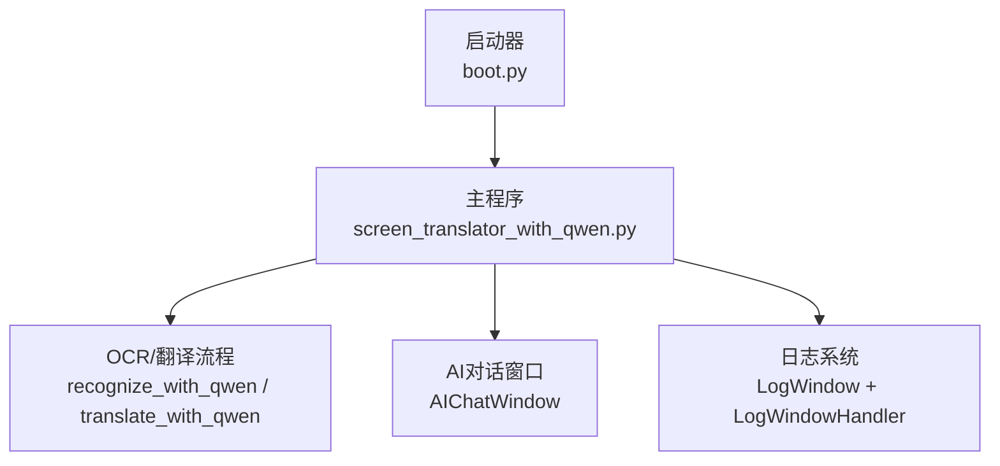
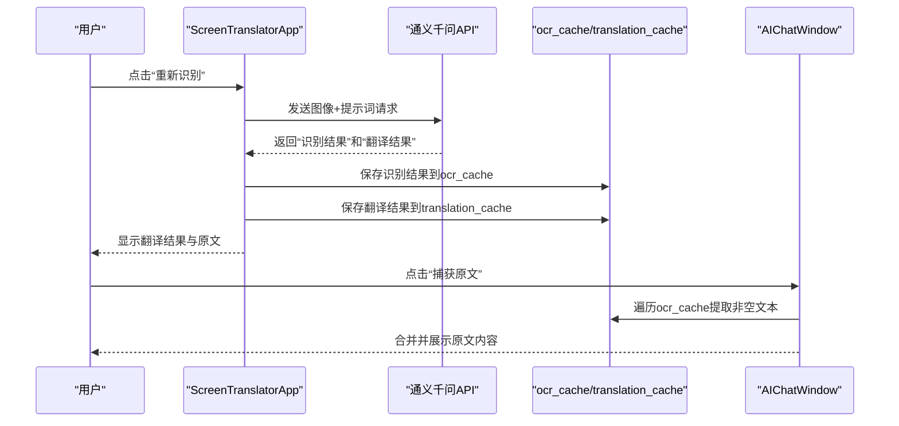
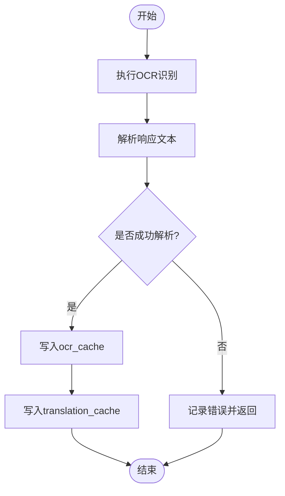
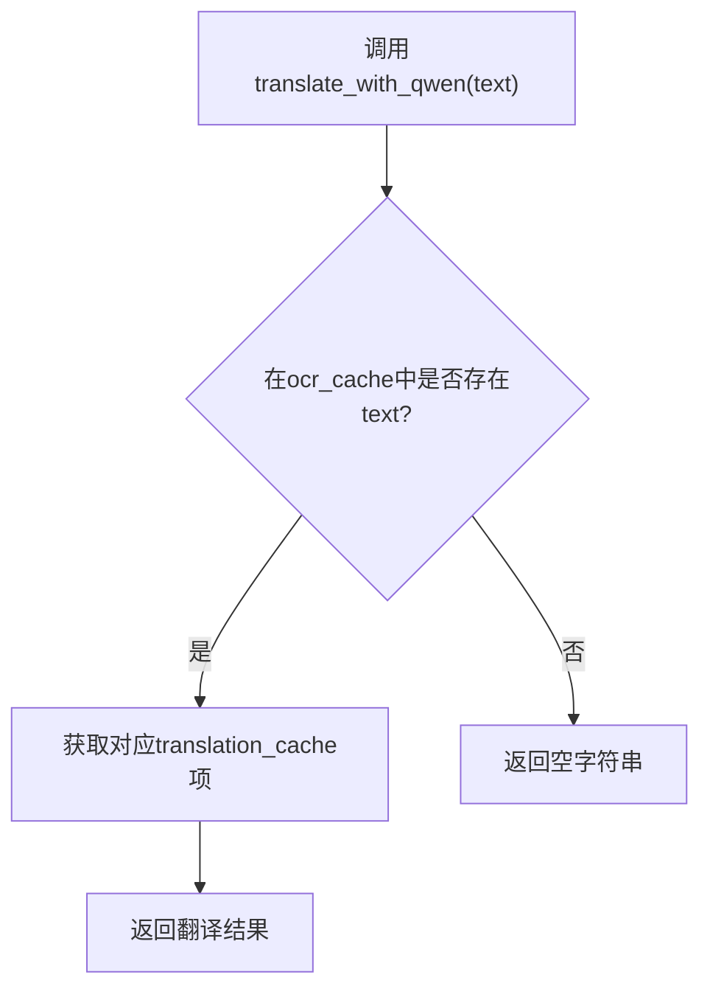
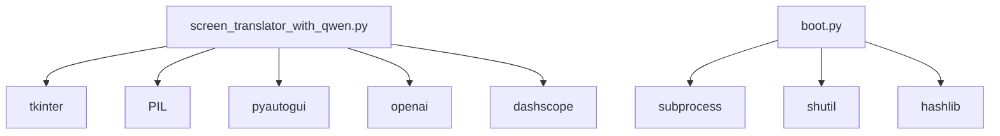

# 缓存管理机制

<cite>
**本文引用的文件**   
- [screen_translator_with_qwen.py](file://screen_translator_with_qwen.py)
- [boot.py](file://boot.py)
</cite>

## 目录
1. [简介](#简介)
2. [项目结构](#项目结构)
3. [核心组件](#核心组件)
4. [架构总览](#架构总览)
5. [详细组件分析](#详细组件分析)
6. [依赖关系分析](#依赖关系分析)
7. [性能考量](#性能考量)
8. [故障排查指南](#故障排查指南)
9. [结论](#结论)
10. [附录](#附录)

## 简介
本文件聚焦于屏幕翻译应用中的缓存管理机制，围绕 ocr_cache 与 translation_cache 的设计原理、数据结构、键值策略、内存管理、生命周期（创建、访问更新、过期清理、回收）、一致性保证（并发访问控制、数据同步、冲突解决）、性能优化（LRU、容量限制、淘汰策略）以及操作流程图、内存监控与调试工具进行系统化说明。同时提供配置调优与故障恢复建议，帮助读者在现有实现基础上进行扩展与优化。

## 项目结构
本项目为单进程桌面应用，主程序入口位于 screen_translator_with_qwen.py；启动器 boot.py 负责虚拟环境管理与后台启动目标程序。缓存逻辑集中在主程序的 ScreenTranslatorApp 类中，ocr_cache 与 translation_cache 作为实例级字典用于存储识别结果与翻译结果。

图表来源
- [screen_translator_with_qwen.py:474-634](file://screen_translator_with_qwen.py#L474-L634)
- [screen_translator_with_qwen.py:1123-1266](file://screen_translator_with_qwen.py#L1123-L1266)
- [screen_translator_with_qwen.py:101-222](file://screen_translator_with_qwen.py#L101-L222)
- [boot.py:256-279](file://boot.py#L256-L279)

章节来源
- [screen_translator_with_qwen.py:474-634](file://screen_translator_with_qwen.py#L474-L634)
- [boot.py:256-279](file://boot.py#L256-L279)

## 核心组件
- 应用主类：ScreenTranslatorApp，维护 OCR 与翻译的 UI、区域选择、线程控制与缓存。
- AI 对话窗口：AIChatWindow，提供从 ocr_cache 读取原文并展示的功能。
- 日志子系统：LogWindow 与 LogWindowHandler，通过队列异步输出日志。
- 启动器：boot.py，自动检测目标脚本、管理虚拟环境与依赖、后台启动主程序。

章节来源
- [screen_translator_with_qwen.py:474-634](file://screen_translator_with_qwen.py#L474-L634)
- [screen_translator_with_qwen.py:101-222](file://screen_translator_with_qwen.py#L101-L222)
- [screen_translator_with_qwen.py:21-100](file://screen_translator_with_qwen.py#L21-L100)
- [boot.py:256-279](file://boot.py#L256-L279)

## 架构总览
下图展示了 OCR 识别与翻译流程中缓存的写入与读取路径，以及 AI 对话窗口对原文缓存的读取。

图表来源
- [screen_translator_with_qwen.py:1123-1266](file://screen_translator_with_qwen.py#L1123-L1266)
- [screen_translator_with_qwen.py:198-222](file://screen_translator_with_qwen.py#L198-L222)

## 详细组件分析

### 数据结构定义与键值策略
- 数据结构
  - ocr_cache：字典，键为字符串，值为识别出的原文文本。
  - translation_cache：字典，键为字符串，值为对应的翻译结果文本。
- 键值策略
  - 键由图像 base64 编码的前若干字符构成，用于唯一标识一次识别输入。
  - 同一键在两个缓存中保持一一对应，确保原文与译文的一致性。
- 复杂度
  - 插入与查找均为 O(1) 平均时间复杂度（基于哈希表）。
  - 遍历查找匹配原文时，最坏情况为 O(n)，n 为缓存条目数。

章节来源
- [screen_translator_with_qwen.py:1207-1211](file://screen_translator_with_qwen.py#L1207-L1211)
- [screen_translator_with_qwen.py:1249-1266](file://screen_translator_with_qwen.py#L1249-L1266)
- [screen_translator_with_qwen.py:198-222](file://screen_translator_with_qwen.py#L198-L222)

### 生命周期管理
- 条目创建
  - 当 OCR 识别成功且解析出“识别结果”和“翻译结果”后，将两者分别写入 ocr_cache 与 translation_cache。
- 访问更新
  - 当前实现未显式更新访问时间戳或移动位置，属于静态字典访问。
  - AI 对话窗口会遍历 ocr_cache 收集非空原文并合并展示。
- 过期清理
  - 当前实现未包含定时清理或基于时间的过期策略。
- 内存回收
  - 应用关闭时仅清理语音文件，未显式清空缓存；Python 垃圾回收会在对象不可达时释放内存。

图表来源
- [screen_translator_with_qwen.py:1123-1266](file://screen_translator_with_qwen.py#L1123-L1266)

章节来源
- [screen_translator_with_qwen.py:1123-1266](file://screen_translator_with_qwen.py#L1123-L1266)
- [screen_translator_with_qwen.py:2407-2412](file://screen_translator_with_qwen.py#L2407-L2412)

### 一致性保证机制
- 并发访问控制
  - 识别与翻译均在新线程中执行，使用 ai_interaction_active 与 translating 标志位控制中止与状态。
  - 缓存读写在主线程与子线程间发生，但 Python GIL 保证了基本原子性；对于复杂复合操作，建议使用锁保护。
- 数据同步
  - 同一请求产生的原文与译文共享同一键，避免不一致。
  - 若后续需要跨线程安全更新，可引入 threading.Lock 或 queue 传递结果。
- 冲突解决
  - 当前无并发写冲突场景；若未来支持多任务并行识别，需考虑键空间隔离或版本号策略。

章节来源
- [screen_translator_with_qwen.py:927-1021](file://screen_translator_with_qwen.py#L927-L1021)
- [screen_translator_with_qwen.py:1022-1096](file://screen_translator_with_qwen.py#L1022-L1096)
- [screen_translator_with_qwen.py:1704-1723](file://screen_translator_with_qwen.py#L1704-L1723)

### 性能优化策略
- LRU 算法实现
  - 当前未实现 LRU；如需提升热点命中率，可替换为有序字典或自定义 LRU 容器。
- 容量限制
  - 当前无最大条目数限制；建议增加上限并在达到阈值时触发淘汰。
- 淘汰策略
  - 建议采用 LRU 或 LFU 淘汰策略，结合键粒度（如按图像指纹）进行淘汰。
- 访问更新
  - 建议在每次命中时更新时间戳或移动至头部，以支持 LRU。
- 批量清理
  - 可定期扫描并按最近使用时间或引用计数清理冷数据。

[本节为通用指导，不直接分析具体文件]

### 缓存操作流程图

图表来源
- [screen_translator_with_qwen.py:1249-1266](file://screen_translator_with_qwen.py#L1249-L1266)

章节来源
- [screen_translator_with_qwen.py:1249-1266](file://screen_translator_with_qwen.py#L1249-L1266)

### 内存使用监控与调试工具
- 日志系统
  - 通过 LogWindow 与 LogWindowHandler 将日志推送到 UI 文本框，便于观察缓存写入与读取行为。
- 关键日志点
  - 缓存写入：记录缓存键与长度信息。
  - 缓存读取：记录命中或未命中的情况。
- 调试建议
  - 在缓存写入与读取处增加更详细的日志（如键前缀、文本长度），以便定位问题。
  - 使用 Python 内置模块（如 gc、tracemalloc）进行内存快照与分析。

章节来源
- [screen_translator_with_qwen.py:21-100](file://screen_translator_with_qwen.py#L21-L100)
- [screen_translator_with_qwen.py:1207-1211](file://screen_translator_with_qwen.py#L1207-L1211)
- [screen_translator_with_qwen.py:1249-1266](file://screen_translator_with_qwen.py#L1249-L1266)

### 配置调优与故障恢复建议
- 配置调优
  - 键长度：适当调整键前缀长度，平衡唯一性与碰撞概率。
  - 容量上限：设置最大条目数，防止无限增长导致内存压力。
  - 清理周期：周期性清理长时间未访问的条目。
- 故障恢复
  - API 失败重试：已实现指数退避与抖动，遇到 429 等错误时自动重试。
  - 资源清理：应用退出时清理临时音频文件，避免磁盘占用。
  - 异常处理：识别与翻译过程均有 try/except 包裹，并更新 UI 状态。

章节来源
- [screen_translator_with_qwen.py:1144-1247](file://screen_translator_with_qwen.py#L1144-L1247)
- [screen_translator_with_qwen.py:2407-2412](file://screen_translator_with_qwen.py#L2407-L2412)

## 依赖关系分析
- 主程序依赖
  - tkinter：UI 交互。
  - pyautogui：截图。
  - PIL：图像处理与压缩。
  - openai：通义千问客户端。
  - dashscope：语音合成。
  - logging：日志输出。
- 启动器依赖
  - subprocess、shutil、hashlib：虚拟环境管理与依赖安装。

图表来源
- [screen_translator_with_qwen.py:1-20](file://screen_translator_with_qwen.py#L1-L20)
- [boot.py:10-36](file://boot.py#L10-L36)

章节来源
- [screen_translator_with_qwen.py:1-20](file://screen_translator_with_qwen.py#L1-L20)
- [boot.py:10-36](file://boot.py#L10-L36)

## 性能考量
- 当前缓存为简单字典，适合小规模数据；随着条目增多，线性查找成本上升。
- 建议引入有序字典或第三方 LRU 库（如 functools.lru_cache 或 cachetools）以提升命中率与可控性。
- 针对大文本与频繁访问场景，可增加索引结构（如按文本哈希建立反向索引）以减少遍历开销。
- 合理设置键前缀长度与容量上限，避免内存膨胀与碰撞导致的误命中。

[本节为通用指导，不直接分析具体文件]

## 故障排查指南
- 常见问题
  - 缓存未命中：检查键生成逻辑与文本比对是否一致。
  - 内存持续增长：确认是否有定时清理或容量限制。
  - 并发冲突：在多任务场景下引入锁或队列保护复合操作。
- 日志定位
  - 查看“缓存写入”与“缓存读取”相关日志，确认键与值是否正确。
  - 关注 API 错误码（如 401、429、413）及重试策略执行情况。
- 恢复步骤
  - 重启应用以清空内存缓存。
  - 清理临时文件（如语音文件）以避免磁盘占用。
  - 检查 key.txt 与网络连通性，确保 API 可用。

章节来源
- [screen_translator_with_qwen.py:1144-1247](file://screen_translator_with_qwen.py#L1144-L1247)
- [screen_translator_with_qwen.py:2407-2412](file://screen_translator_with_qwen.py#L2407-L2412)

## 结论
当前项目的缓存机制以简单的字典实现，具备基本的写入与读取能力，并通过日志系统进行观测。为保证在高负载与长期运行下的稳定性与性能，建议引入 LRU 淘汰、容量限制、访问更新与并发保护，并结合内存监控与调试工具持续优化。

[本节为总结，不直接分析具体文件]

## 附录
- 术语
  - LRU：最近最少使用淘汰策略。
  - 键前缀：用于生成缓存键的字符串片段。
  - 并发控制：通过锁或队列等手段保证多线程安全。
- 参考实现位置
  - 缓存写入：[screen_translator_with_qwen.py:1207-1211](file://screen_translator_with_qwen.py#L1207-L1211)
  - 缓存读取：[screen_translator_with_qwen.py:1249-1266](file://screen_translator_with_qwen.py#L1249-L1266)
  - 原文捕获：[screen_translator_with_qwen.py:198-222](file://screen_translator_with_qwen.py#L198-L222)
  - 日志系统：[screen_translator_with_qwen.py:21-100](file://screen_translator_with_qwen.py#L21-L100)
  - 启动器：[boot.py:256-279](file://boot.py#L256-L279)