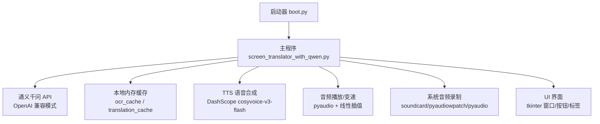
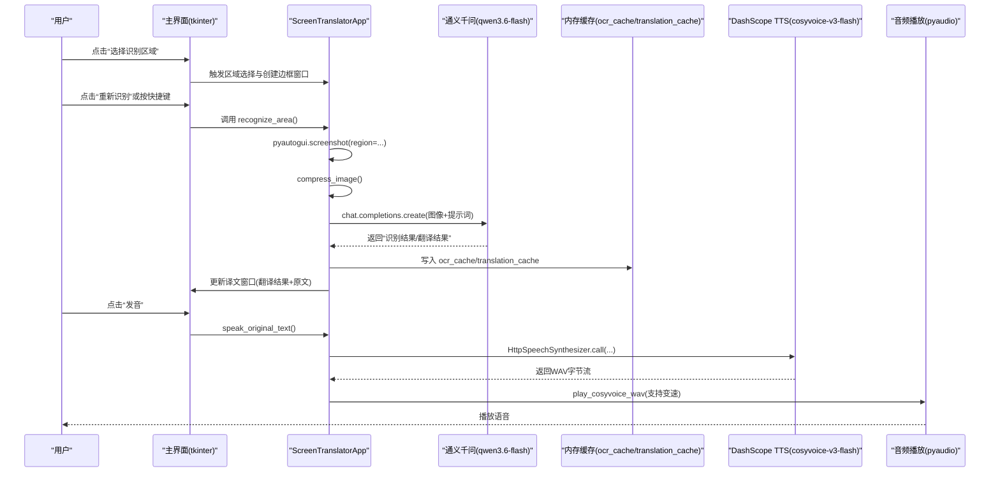
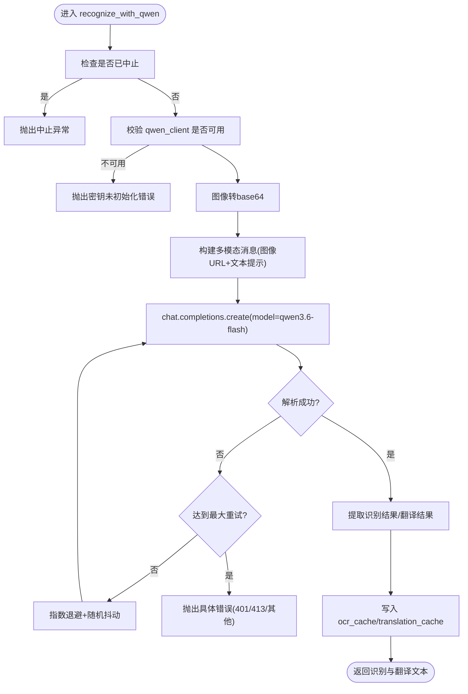
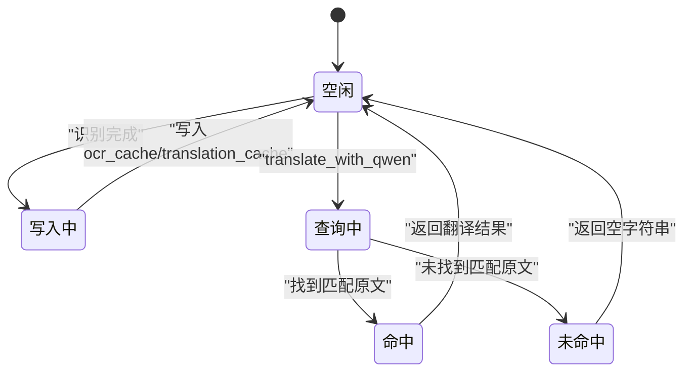
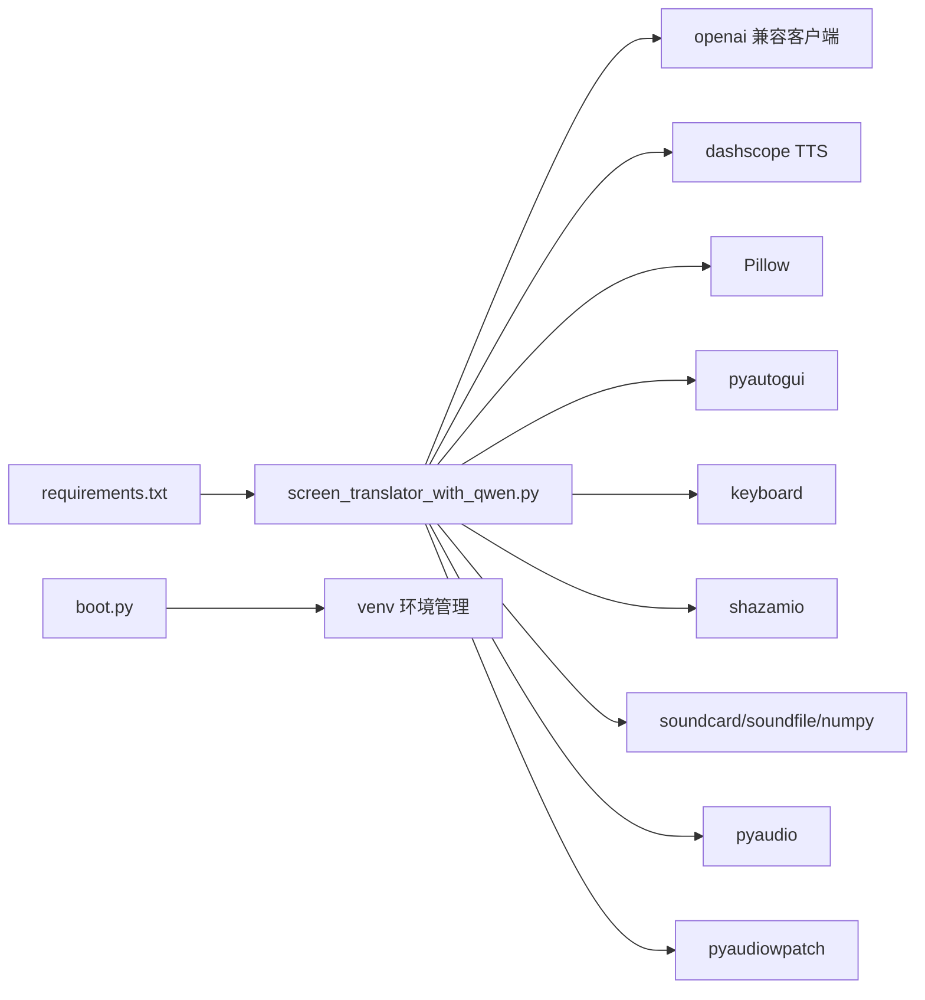

# 翻译服务数据流

<cite>
**本文引用的文件**
- [screen_translator_with_qwen.py](file://screen_translator_with_qwen.py)
- [boot.py](file://boot.py)
- [requirements.txt](file://requirements.txt)
- [qwen_ocr.py](file://test/qwen_ocr.py)
</cite>

## 目录
1. [简介](#简介)
2. [项目结构](#项目结构)
3. [核心组件](#核心组件)
4. [架构总览](#架构总览)
5. [详细组件分析](#详细组件分析)
6. [依赖关系分析](#依赖关系分析)
7. [性能与质量优化建议](#性能与质量优化建议)
8. [故障排查指南](#故障排查指南)
9. [结论](#结论)

## 简介
本文件围绕“屏幕翻译工具”的翻译服务数据流进行系统化说明，覆盖从原文获取、OCR识别、翻译API调用、结果处理与缓存存储到展示与交互的全链路。重点解释：
- 通义千问多模态模型在OCR+翻译一体化流程中的集成方式（请求格式、响应解析、错误恢复）
- 内存缓存的设计与更新策略（键生成、失效机制、内存控制）
- 翻译结果的展示逻辑（文本格式化、窗口显示、用户交互）
- 数据流图、缓存状态图与错误恢复机制
- 面向生产可用的质量优化与性能调优建议

## 项目结构
- 启动器 boot.py：自动检测并运行主程序，管理虚拟环境与依赖安装，后台启动无控制台窗口
- 主程序 screen_translator_with_qwen.py：实现截图区域选择、OCR+翻译、语音合成播放、AI对话、听歌识曲等能力
- 依赖 requirements.txt：列出关键第三方库（OpenAI兼容客户端、DashScope TTS、PyAudio、Pillow、pyautogui、keyboard、shazamio、soundcard/soundfile/numpy、pyaudiowpatch）
- 测试示例 test/qwen_ocr.py：演示通过 OpenAI 兼容接口调用通义千问多模态模型

图表来源
- [boot.py:256-279](file://boot.py#L256-L279)
- [screen_translator_with_qwen.py:474-634](file://screen_translator_with_qwen.py#L474-L634)
- [screen_translator_with_qwen.py:1123-1248](file://screen_translator_with_qwen.py#L1123-L1248)
- [screen_translator_with_qwen.py:1442-1556](file://screen_translator_with_qwen.py#L1442-L1556)
- [screen_translator_with_qwen.py:1789-1851](file://screen_translator_with_qwen.py#L1789-L1851)

章节来源
- [boot.py:1-279](file://boot.py#L1-L279)
- [screen_translator_with_qwen.py:1-2417](file://screen_translator_with_qwen.py#L1-L2417)
- [requirements.txt:1-31](file://requirements.txt#L1-L31)

## 核心组件
- 应用主类 ScreenTranslatorApp：封装所有业务逻辑与UI事件，维护 OCR 与翻译缓存、区域选择、窗口拖拽/缩放、快捷键、中止标志等
- AI 客户端初始化：基于 OpenAI 兼容接口连接 DashScope，使用 qwen3.6-flash 模型进行图像理解与文本翻译
- 语音合成与播放：调用 DashScope cosyvoice-v3-flash 将原文合成 WAV，支持本地播放与变速
- 系统音频录制：提供三种方案（soundcard 环回、pyaudiowpatch WASAPI 环回、pyaudio 立体声混音），用于听歌识曲
- UI 组件：识别区域边框窗口、译文显示窗口、日志窗口、AI对话窗口

章节来源
- [screen_translator_with_qwen.py:474-634](file://screen_translator_with_qwen.py#L474-L634)
- [screen_translator_with_qwen.py:339-360](file://screen_translator_with_qwen.py#L339-L360)
- [screen_translator_with_qwen.py:1442-1556](file://screen_translator_with_qwen.py#L1442-L1556)
- [screen_translator_with_qwen.py:1789-1851](file://screen_translator_with_qwen.py#L1789-L1851)

## 架构总览
下图展示了从用户操作到最终展示的端到端数据流，包括 OCR+翻译、缓存、TTS 与播放路径。

图表来源
- [screen_translator_with_qwen.py:927-1021](file://screen_translator_with_qwen.py#L927-L1021)
- [screen_translator_with_qwen.py:1098-1122](file://screen_translator_with_qwen.py#L1098-L1122)
- [screen_translator_with_qwen.py:1123-1248](file://screen_translator_with_qwen.py#L1123-L1248)
- [screen_translator_with_qwen.py:1442-1556](file://screen_translator_with_qwen.py#L1442-L1556)
- [screen_translator_with_qwen.py:372-473](file://screen_translator_with_qwen.py#L372-L473)

## 详细组件分析

### 1) 原文获取与预处理
- 区域选择：全屏半透明遮罩，鼠标拖拽确定矩形区域，记录坐标与宽高
- 截图与压缩：使用 pyautogui.screenshot 截取指定区域；增强对比度后转灰度，JPEG 压缩降低体积，便于后续上传
- 线程安全：识别过程在新线程执行，避免阻塞 UI；通过 ai_interaction_active 标志支持中途中止

章节来源
- [screen_translator_with_qwen.py:781-858](file://screen_translator_with_qwen.py#L781-L858)
- [screen_translator_with_qwen.py:927-1021](file://screen_translator_with_qwen.py#L927-L1021)
- [screen_translator_with_qwen.py:1098-1122](file://screen_translator_with_qwen.py#L1098-L1122)

### 2) 通义千问翻译API集成（OCR+翻译一体化）
- 客户端初始化：读取 key.txt，使用 OpenAI 兼容 base_url 指向 DashScope
- 请求构造：以 image_url(base64) + text 提示词组合发送，要求模型输出“识别结果/翻译结果”两段文本
- 响应解析：按行扫描，提取“识别结果：”和“翻译结果：”后的内容，合并多行段落
- 重试与退避：最大重试次数与指数退避+随机抖动，针对 429 Too Many Requests 特殊处理
- 错误分类：401 密钥无效、413 请求体过大、其他网络/服务端异常统一抛出友好提示

图表来源
- [screen_translator_with_qwen.py:1123-1248](file://screen_translator_with_qwen.py#L1123-L1248)

章节来源
- [screen_translator_with_qwen.py:339-360](file://screen_translator_with_qwen.py#L339-L360)
- [screen_translator_with_qwen.py:1123-1248](file://screen_translator_with_qwen.py#L1123-L1248)
- [test/qwen_ocr.py:1-30](file://test/qwen_ocr.py#L1-L30)

### 3) 缓存设计与更新策略（ocr_cache / translation_cache）
- 数据结构
  - ocr_cache: dict[缓存键, 原文]
  - translation_cache: dict[缓存键, 翻译结果]
  - 键生成：取图像 base64 前若干字符作为键（固定长度片段），保证相同输入命中同一缓存项
- 更新策略
  - 每次成功识别与翻译后，将原文与翻译结果按相同键写入两个缓存字典
  - 翻译查询 translate_with_qwen 时，遍历 ocr_cache 匹配原文，命中则直接返回对应翻译
- 失效机制
  - 当前为进程内内存缓存，无显式过期时间或LRU淘汰；随进程退出而释放
  - 若需持久化或共享，可考虑引入 TTL/LRU 或外部缓存（如 Redis）
- 内存控制
  - 当前未限制缓存大小，存在无限增长风险；建议增加上限与淘汰策略（如 LRU）
  - 对键空间做去重与清理（例如定期清理空值或重复条目）

图表来源
- [screen_translator_with_qwen.py:1207-1213](file://screen_translator_with_qwen.py#L1207-L1213)
- [screen_translator_with_qwen.py:1249-1266](file://screen_translator_with_qwen.py#L1249-L1266)

章节来源
- [screen_translator_with_qwen.py:1207-1213](file://screen_translator_with_qwen.py#L1207-L1213)
- [screen_translator_with_qwen.py:1249-1266](file://screen_translator_with_qwen.py#L1249-L1266)

### 4) 翻译结果展示与用户交互
- 译文窗口
  - 位置与尺寸：根据用户选择的译文区域创建无边框置顶窗口，支持拖拽与边缘拉伸
  - 文本布局：第一行显示翻译结果，第二行显示原文，自动换行与滚动
  - 状态栏：显示“识别中/翻译中/翻译完成/失败原因”等状态
- 发音按钮
  - 位于译文窗口上方或下方（根据屏幕边界自适应）
  - 点击后优先复用已有 WAV 文件，否则调用 TTS 合成并保存，再播放
- 快捷键与中止
  - 全局快捷键触发“重新识别”，无需窗口聚焦
  - 中止按钮设置 ai_interaction_active/translating 标志，中断进行中任务

章节来源
- [screen_translator_with_qwen.py:714-780](file://screen_translator_with_qwen.py#L714-L780)
- [screen_translator_with_qwen.py:1022-1097](file://screen_translator_with_qwen.py#L1022-L1097)
- [screen_translator_with_qwen.py:1442-1556](file://screen_translator_with_qwen.py#L1442-L1556)
- [screen_translator_with_qwen.py:1704-1723](file://screen_translator_with_qwen.py#L1704-L1723)
- [screen_translator_with_qwen.py:1753-1788](file://screen_translator_with_qwen.py#L1753-L1788)

### 5) 语音合成与播放（TTS）
- 合成：调用 DashScope cosyvoice-v3-flash，流式返回音频数据，拼接后写入本地 WAV
- 播放：使用 pyaudio 打开设备分块播放，支持速度切换（正常/0.75x），采用线性插值重采样
- 资源清理：程序关闭与每次识别完成后清理旧 WAV 文件，避免累积占用磁盘

章节来源
- [screen_translator_with_qwen.py:1442-1556](file://screen_translator_with_qwen.py#L1442-L1556)
- [screen_translator_with_qwen.py:372-473](file://screen_translator_with_qwen.py#L372-L473)
- [screen_translator_with_qwen.py:363-371](file://screen_translator_with_qwen.py#L363-L371)

### 6) 系统音频录制（听歌识曲）
- 三套方案依次尝试：soundcard 环形回录、pyaudiowpatch WASAPI 环回、pyaudio 立体声混音
- 失败时给出明确引导（启用立体声混音、更换扬声器、安装特定库）
- 临时文件保存在系统临时目录，识别后自动清理

章节来源
- [screen_translator_with_qwen.py:1789-1851](file://screen_translator_with_qwen.py#L1789-L1851)
- [screen_translator_with_qwen.py:1853-1941](file://screen_translator_with_qwen.py#L1853-L1941)
- [screen_translator_with_qwen.py:1943-1998](file://screen_translator_with_qwen.py#L1943-L1998)
- [screen_translator_with_qwen.py:2070-2145](file://screen_translator_with_qwen.py#L2070-L2145)

## 依赖关系分析
- 运行时依赖
  - OpenAI 兼容客户端：用于调用 DashScope 多模态模型
  - DashScope SDK：语音合成
  - Pillow/pyautogui：图像处理与截图
  - pyaudio：音频播放
  - keyboard：全局快捷键
  - shazamio：歌曲识别
  - soundcard/soundfile/numpy：系统音频录制
  - pyaudiowpatch：Windows WASAPI 环回（蓝牙耳机支持）
- 启动器依赖
  - 自动检测唯一 .py 主程序，确保 venv 有效且依赖一致，必要时重建环境

图表来源
- [requirements.txt:1-31](file://requirements.txt#L1-L31)
- [boot.py:209-225](file://boot.py#L209-L225)
- [screen_translator_with_qwen.py:1-20](file://screen_translator_with_qwen.py#L1-L20)

章节来源
- [requirements.txt:1-31](file://requirements.txt#L1-L31)
- [boot.py:1-279](file://boot.py#L1-L279)

## 性能与质量优化建议
- 图片预处理
  - 对比度增强与灰度转换有助于提升OCR准确率；可根据场景调整增强强度
  - JPEG 质量参数可在体积与识别精度间权衡，建议动态评估
- 请求与重试
  - 指数退避+随机抖动可有效缓解限流；建议结合服务端返回码细化策略
  - 对大请求体（413）应提前裁剪区域或进一步压缩
- 缓存策略
  - 引入 LRU/TTL 控制内存占用，避免长期运行导致内存膨胀
  - 对键空间进行去重与定期清理，减少无效条目
- 并发与UI
  - 识别/翻译/播放均使用独立线程，避免阻塞主循环；注意线程安全与状态标志
  - UI 更新统一通过 root.after 调度，防止跨线程访问控件
- 语音播放
  - 线性插值变速简单高效，如需更高质量可采用重采样算法
  - 合理设置缓冲块大小，平衡延迟与CPU占用
- 音频录制
  - 优先使用 WASAPI 环回（支持蓝牙耳机），其次 soundcard，最后 pyaudio 立体声混音
  - 提供清晰的错误信息与配置指引，降低用户排障成本

[本节为通用指导，不直接分析具体文件]

## 故障排查指南
- 无法识别或翻译
  - 检查 key.txt 是否存在且有效；确认 OpenAI 兼容 base_url 正确
  - 观察日志窗口中的错误信息（401/429/413 等）
  - 缩小识别区域或降低图片质量，避免请求体过大
- 语音合成失败
  - 确认 DashScope 可用性与网络连通
  - 检查本地 WAV 文件权限与磁盘空间
- 无法录制系统音频
  - Windows 下启用“立体声混音”或使用 WASAPI 环回
  - 蓝牙耳机可能不支持某些环回方案，建议切换内置扬声器或有线耳机
- 快捷键无效
  - 确认已安装 keyboard 库，且未被其他程序占用
- 窗口异常
  - 拖动/缩放时注意最小尺寸限制；必要时重启应用重置状态

章节来源
- [screen_translator_with_qwen.py:1123-1248](file://screen_translator_with_qwen.py#L1123-L1248)
- [screen_translator_with_qwen.py:1442-1556](file://screen_translator_with_qwen.py#L1442-L1556)
- [screen_translator_with_qwen.py:1789-1851](file://screen_translator_with_qwen.py#L1789-L1851)

## 结论
该翻译服务以“截图→OCR+翻译→缓存→展示→TTS播放”为主线，结合稳健的重试与错误处理、灵活的UI交互与多种音频录制方案，形成一套完整的桌面端翻译体验。建议在后续迭代中完善缓存淘汰策略、精细化错误分类与监控指标，进一步提升稳定性与用户体验。