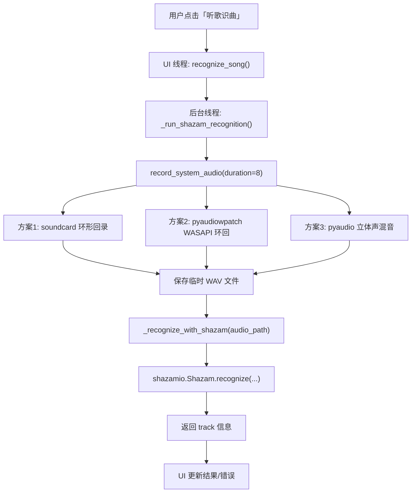
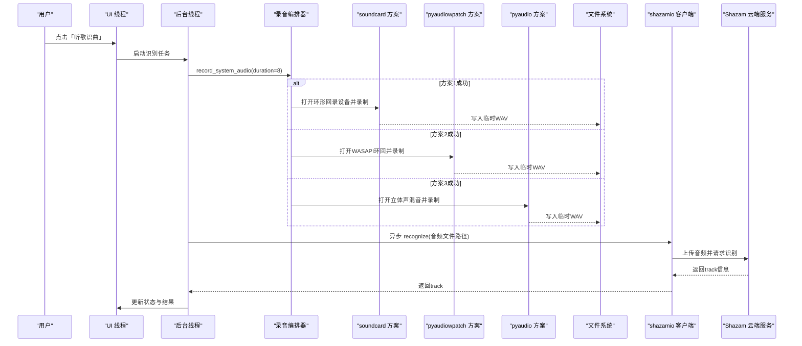
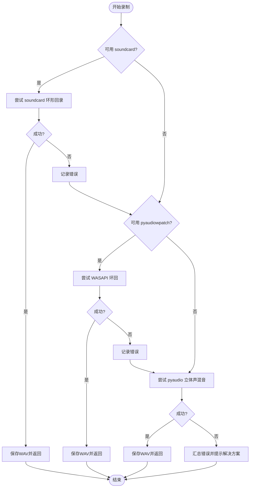
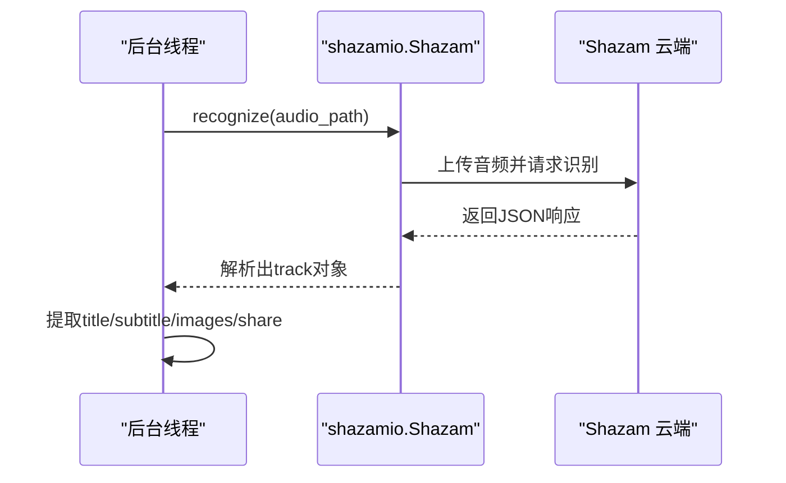
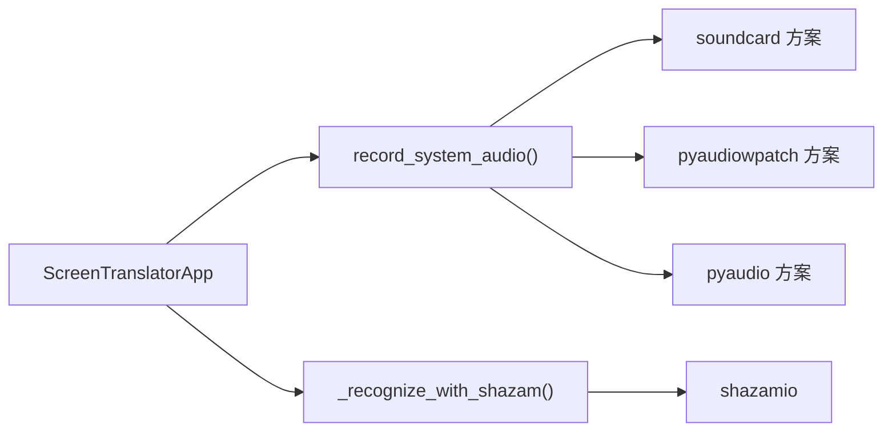

# 音乐识别数据流

<cite>
**本文引用的文件**
- [screen_translator_with_qwen.py](file://screen_translator_with_qwen.py)
- [requirements.txt](file://requirements.txt)
- [shazam_test.py](file://test/shazam_test.py)
</cite>

## 目录
1. [简介](#简介)
2. [项目结构](#项目结构)
3. [核心组件](#核心组件)
4. [架构总览](#架构总览)
5. [详细组件分析](#详细组件分析)
6. [依赖关系分析](#依赖关系分析)
7. [性能与优化建议](#性能与优化建议)
8. [故障排查指南](#故障排查指南)
9. [结论](#结论)

## 简介
本文件面向“听歌识曲”功能的数据流与实现细节，系统性梳理从系统音频录制、格式转换与缓冲管理，到特征提取（由外部服务完成）、Shazam API 调用与结果解析的完整链路。文档同时对比三种音频录制方案（soundcard、pyaudiowpatch、pyaudio）的选择策略，给出实时处理流程、错误处理机制以及优化建议，帮助读者快速理解并稳定集成该能力。

## 项目结构
本项目为屏幕翻译工具，其中包含“听歌识曲”子功能。与音乐识别相关的关键位置如下：
- 主程序入口与 UI 线程调度：[screen_translator_with_qwen.py](file://screen_translator_with_qwen.py)
- 可选依赖声明（含 shazamio、soundcard、pyaudiowpatch、pyaudio 等）：[requirements.txt](file://requirements.txt)
- Shazam 识别测试脚本（异步调用示例）：[test/shazam_test.py](file://test/shazam_test.py)

图表来源
- [screen_translator_with_qwen.py:2373-2396](file://screen_translator_with_qwen.py#L2373-L2396)
- [screen_translator_with_qwen.py:2272-2372](file://screen_translator_with_qwen.py#L2272-L2372)
- [screen_translator_with_qwen.py:1789-1851](file://screen_translator_with_qwen.py#L1789-L1851)
- [screen_translator_with_qwen.py:1853-1942](file://screen_translator_with_qwen.py#L1853-L1942)
- [screen_translator_with_qwen.py:1943-1998](file://screen_translator_with_qwen.py#L1943-L1998)
- [screen_translator_with_qwen.py:2070-2145](file://screen_translator_with_qwen.py#L2070-L2145)
- [screen_translator_with_qwen.py:2233-2270](file://screen_translator_with_qwen.py#L2233-L2270)
- [test/shazam_test.py:16-65](file://test/shazam_test.py#L16-L65)

章节来源
- [screen_translator_with_qwen.py:314-336](file://screen_translator_with_qwen.py#L314-L336)
- [requirements.txt:10-31](file://requirements.txt#L10-L31)

## 核心组件
- 音频录制编排器
  - 负责按优先级尝试多种录制方案，统一输出为临时 WAV 文件路径，失败时记录错误原因并提示解决方案。
- 音频录制实现
  - 方案1：基于 soundcard 的环形回录（默认扬声器作为输入源）。
  - 方案2：基于 pyaudiowpatch 的 WASAPI 环回（支持蓝牙耳机）。
  - 方案3：基于 pyaudio 的立体声混音（需系统启用 Stereo Mix）。
- Shazam 识别客户端
  - 使用 shazamio 异步接口上传音频并请求识别，解析返回的 track 信息。
- UI 与线程协调
  - 在 UI 线程中触发识别，在后台线程执行耗时操作，完成后回调更新 UI。

章节来源
- [screen_translator_with_qwen.py:1789-1851](file://screen_translator_with_qwen.py#L1789-L1851)
- [screen_translator_with_qwen.py:1853-1942](file://screen_translator_with_qwen.py#L1853-L1942)
- [screen_translator_with_qwen.py:1943-1998](file://screen_translator_with_qwen.py#L1943-L1998)
- [screen_translator_with_qwen.py:2070-2145](file://screen_translator_with_qwen.py#L2070-L2145)
- [screen_translator_with_qwen.py:2233-2270](file://screen_translator_with_qwen.py#L2233-L2270)
- [screen_translator_with_qwen.py:2373-2396](file://screen_translator_with_qwen.py#L2373-L2396)

## 架构总览
下图展示了“听歌识曲”端到端的数据流与交互时序，包括录制、保存、识别与结果展示。

图表来源
- [screen_translator_with_qwen.py:2373-2396](file://screen_translator_with_qwen.py#L2373-L2396)
- [screen_translator_with_qwen.py:2272-2372](file://screen_translator_with_qwen.py#L2272-L2372)
- [screen_translator_with_qwen.py:1789-1851](file://screen_translator_with_qwen.py#L1789-L1851)
- [screen_translator_with_qwen.py:1853-1942](file://screen_translator_with_qwen.py#L1853-L1942)
- [screen_translator_with_qwen.py:1943-1998](file://screen_translator_with_qwen.py#L1943-L1998)
- [screen_translator_with_qwen.py:2070-2145](file://screen_translator_with_qwen.py#L2070-L2145)
- [screen_translator_with_qwen.py:2233-2270](file://screen_translator_with_qwen.py#L2233-L2270)

## 详细组件分析

### 音频录制编排器
- 职责
  - 按顺序尝试三种录制方案，优先选择兼容性更好的方案。
  - 统一返回临时 WAV 文件路径；任一方案成功即短路返回。
  - 全部失败时输出详细的排错指引。
- 关键参数
  - duration：默认 8 秒，用于控制采样帧数与文件大小。
  - sample_rate：默认 44100 Hz，部分方案会动态获取设备采样率。
- 选择策略
  - 方案1（soundcard）：通过默认扬声器创建环形回录麦克风，适合有线或内置扬声器场景。
  - 方案2（pyaudiowpatch）：使用 WASAPI 环回，兼容蓝牙耳机，推荐在 Windows 环境优先使用。
  - 方案3（pyaudio）：扫描系统设备寻找“立体声混音”，需要用户在系统中启用该设备。
- 错误收集与提示
  - 记录各方案失败原因，并在最后汇总输出安装与环境配置建议。

图表来源
- [screen_translator_with_qwen.py:1789-1851](file://screen_translator_with_qwen.py#L1789-L1851)

章节来源
- [screen_translator_with_qwen.py:1789-1851](file://screen_translator_with_qwen.py#L1789-L1851)

### 方案1：soundcard 环形回录
- 设备发现
  - 获取默认扬声器名称，构造环形回录麦克风。
  - 若检测到蓝牙耳机，可能不支持，提前返回错误。
- 录制与格式
  - 以指定采样率和双声道录制固定时长，得到浮点数组。
  - 将浮点数据缩放并裁剪为 int16，再写入 PCM_16 的 WAV。
- 典型错误
  - 访问被拒绝（常见于蓝牙耳机或权限问题）。
  - 音频格式不支持。

章节来源
- [screen_translator_with_qwen.py:1853-1942](file://screen_translator_with_qwen.py#L1853-L1942)

### 方案2：pyaudiowpatch WASAPI 环回
- 设备发现
  - 通过 get_default_wasapi_loopback 获取默认环回设备及其采样率、声道数。
- 录制与缓冲
  - 以 CHUNK=1024 分块读取，累计 frames 列表。
  - 根据采样率计算总读取次数，确保时长准确。
- 写入与清理
  - 使用 wave 模块写入多声道 PCM_16 文件。
  - 成功后返回临时文件路径，供后续识别使用。

章节来源
- [screen_translator_with_qwen.py:1943-1998](file://screen_translator_with_qwen.py#L1943-L1998)
- [screen_translator_with_qwen.py:2000-2068](file://screen_translator_with_qwen.py#L2000-L2068)

### 方案3：pyaudio 立体声混音
- 设备发现
  - 遍历所有输入设备，匹配名称中包含“立体声混音/Stereo Mix”的设备。
- 录制与缓冲
  - 以 1024 帧每块读取，设置 exception_on_overflow=False 避免溢出异常中断。
- 写入与清理
  - 使用 wave 写入 PCM_16 文件，关闭流与 PyAudio 实例。

章节来源
- [screen_translator_with_qwen.py:2070-2145](file://screen_translator_with_qwen.py#L2070-L2145)
- [screen_translator_with_qwen.py:2147-2231](file://screen_translator_with_qwen.py#L2147-L2231)

### Shazam 识别客户端
- 初始化与可用性检查
  - 运行时检测是否已安装 shazamio，未安装则直接返回不可用。
- 异步识别流程
  - 传入本地 WAV 文件路径，调用 Shazam().recognize(...) 进行识别。
  - 解析返回 JSON，提取 track.title、track.subtitle、images.coverart、share.href 等字段。
- 错误处理
  - 捕获网络/IO/解析异常，记录日志并返回 None。

图表来源
- [screen_translator_with_qwen.py:2233-2270](file://screen_translator_with_qwen.py#L2233-L2270)
- [test/shazam_test.py:16-65](file://test/shazam_test.py#L16-L65)

章节来源
- [screen_translator_with_qwen.py:2233-2270](file://screen_translator_with_qwen.py#L2233-L2270)
- [test/shazam_test.py:16-65](file://test/shazam_test.py#L16-L65)

### UI 与线程协调
- 触发入口
  - UI 按钮点击后，先校验依赖是否就绪，防止重复点击。
- 后台执行
  - 在新线程中执行识别流程，避免阻塞界面。
- 结果回调
  - 成功：显示歌曲名、艺术家、封面链接等。
  - 失败：显示“未识别到歌曲”或具体错误信息。
- 资源清理
  - 识别完成后删除临时 WAV 文件，释放磁盘空间。

章节来源
- [screen_translator_with_qwen.py:2373-2396](file://screen_translator_with_qwen.py#L2373-L2396)
- [screen_translator_with_qwen.py:2272-2372](file://screen_translator_with_qwen.py#L2272-L2372)

## 依赖关系分析
- 运行时依赖
  - shazamio：提供异步识别接口。
  - soundcard/soundfile/numpy：用于 soundcard 方案的环形回录与数据写入。
  - pyaudiowpatch：Windows WASAPI 环回，支持蓝牙耳机。
  - pyaudio：通用音频 I/O，用于立体声混音方案。
- 依赖探测
  - 程序启动时 try/except 导入，设置 SHAZAMIO_AVAILABLE、SOUNDCARD_AVAILABLE、PYAUDPATCH_AVAILABLE 标志位，用于条件启用功能。

图表来源
- [screen_translator_with_qwen.py:314-336](file://screen_translator_with_qwen.py#L314-L336)
- [screen_translator_with_qwen.py:1789-1851](file://screen_translator_with_qwen.py#L1789-L1851)
- [screen_translator_with_qwen.py:2233-2270](file://screen_translator_with_qwen.py#L2233-L2270)

章节来源
- [requirements.txt:10-31](file://requirements.txt#L10-L31)
- [screen_translator_with_qwen.py:314-336](file://screen_translator_with_qwen.py#L314-L336)

## 性能与优化建议
- 录制时长与质量平衡
  - 当前默认 8 秒，兼顾识别准确率与用户体验。可根据实际场景调整至 6–10 秒。
- 采样率与声道
  - 优先采用设备原生采样率（如 44100/48000），减少重采样带来的失真。
  - 双声道有助于保留立体声信息，但会增加数据量；若带宽受限可考虑单声道。
- 缓冲区大小
  - CHUNK=1024 在延迟与吞吐之间取得平衡。对低延迟需求可适当减小，对吞吐优先可适当增大。
- 降噪与预处理
  - 可在写入前做简单的静音段裁剪、峰值归一化，提升信噪比。
  - 针对背景噪声较大的环境，可增加短时能量阈值检测，剔除纯静默片段。
- 识别成功率
  - 尽量在安静环境下录制，避免语音叠加。
  - 优先使用 pyaudiowpatch 的 WASAPI 环回，兼容性更好。
  - 若多次失败，切换播放设备（内置扬声器/有线耳机）以提升环形回录稳定性。

[本节为通用指导，不直接分析具体文件]

## 故障排查指南
- 无法录制系统音频
  - 现象：三种方案均失败，输出详细错误与建议。
  - 排查要点：
    - 确认已安装对应库（见 requirements.txt）。
    - 蓝牙耳机：优先使用 pyaudiowpatch；soundcard 可能不支持。
    - 立体声混音：需在系统声音控制面板中启用“立体声混音”。
- 访问被拒绝/格式不支持
  - 现象：soundcard 报权限或格式错误。
  - 排查要点：
    - 切换到内置扬声器或有线耳机。
    - 检查系统音频驱动与权限。
- 未识别到歌曲
  - 现象：Shazam 返回空或无 track。
  - 排查要点：
    - 提高录制音量，减少背景噪音。
    - 延长录制时长或重试。
    - 检查网络连接与 shazamio 版本。
- 临时文件残留
  - 现象：识别结束后临时 WAV 未被删除。
  - 排查要点：
    - 查看日志中的删除步骤是否执行。
    - 手动清理临时目录下的 shazam_record_*.wav。

章节来源
- [screen_translator_with_qwen.py:1828-1851](file://screen_translator_with_qwen.py#L1828-L1851)
- [screen_translator_with_qwen.py:2312-2318](file://screen_translator_with_qwen.py#L2312-L2318)
- [screen_translator_with_qwen.py:2352-2368](file://screen_translator_with_qwen.py#L2352-L2368)

## 结论
本实现通过多方案音频录制与统一的编排逻辑，有效提升了在不同硬件与驱动环境下的鲁棒性；结合 shazamio 的异步识别接口，形成完整的“录制—保存—识别—解析—展示”数据流。建议在 Windows 环境优先使用 pyaudiowpatch 的 WASAPI 环回，配合合理的录制时长与降噪预处理，以获得更高的识别准确率与更稳定的体验。