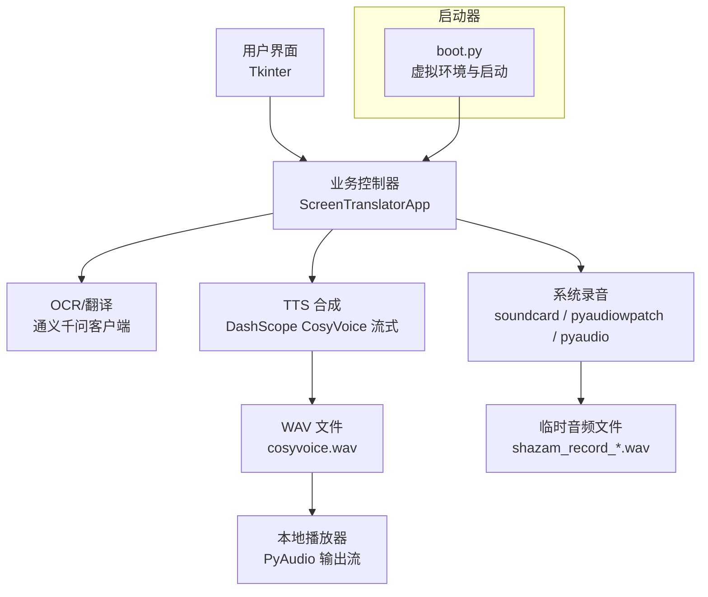
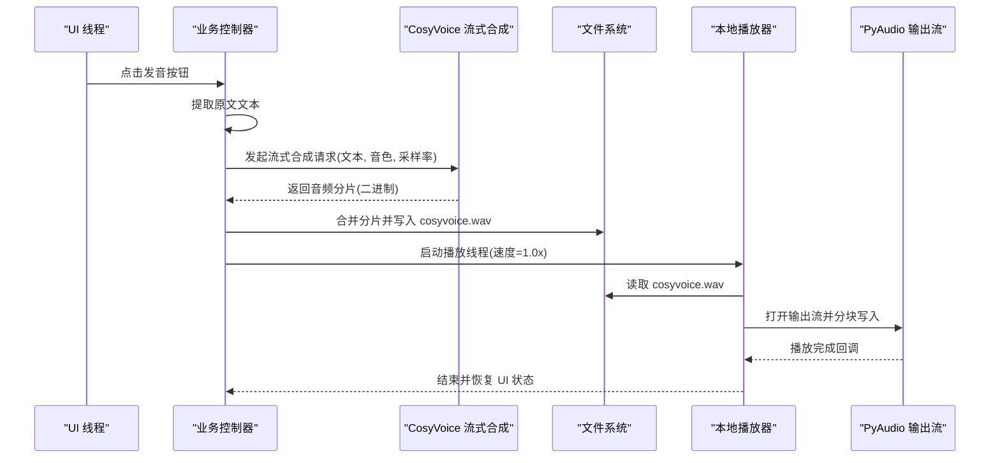
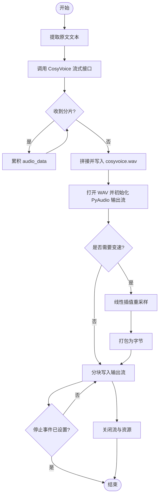
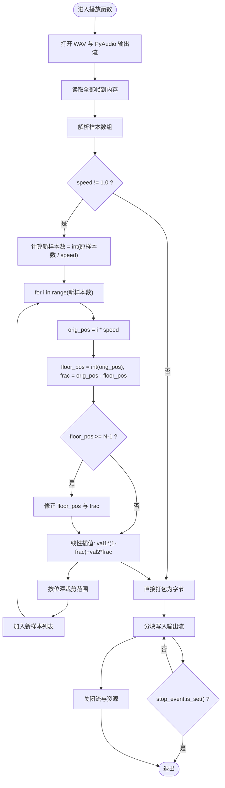
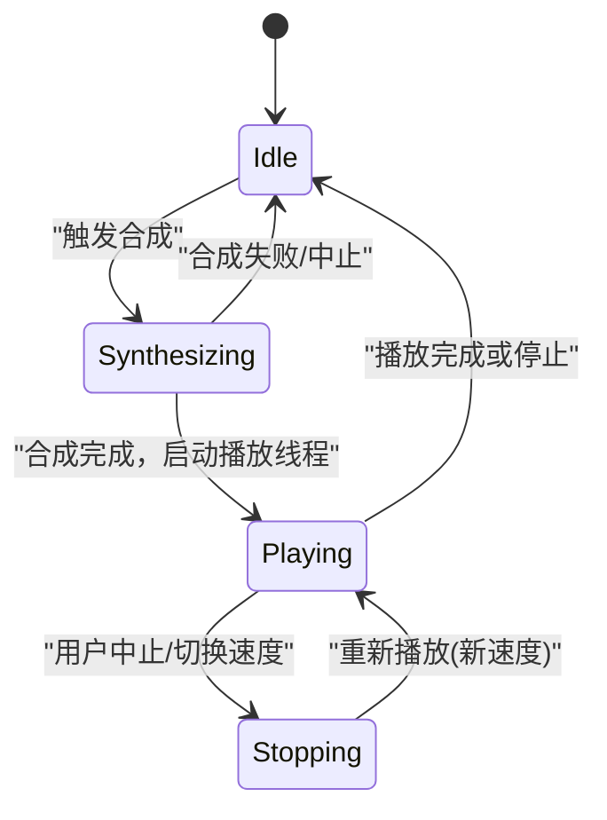
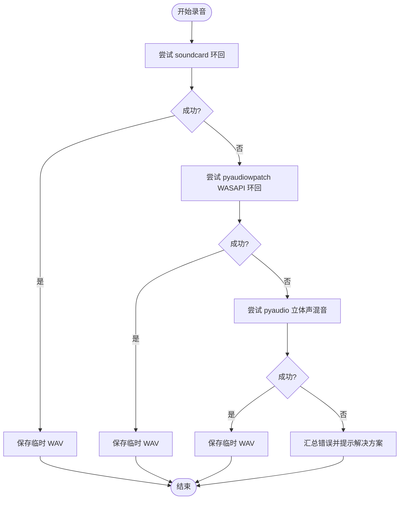
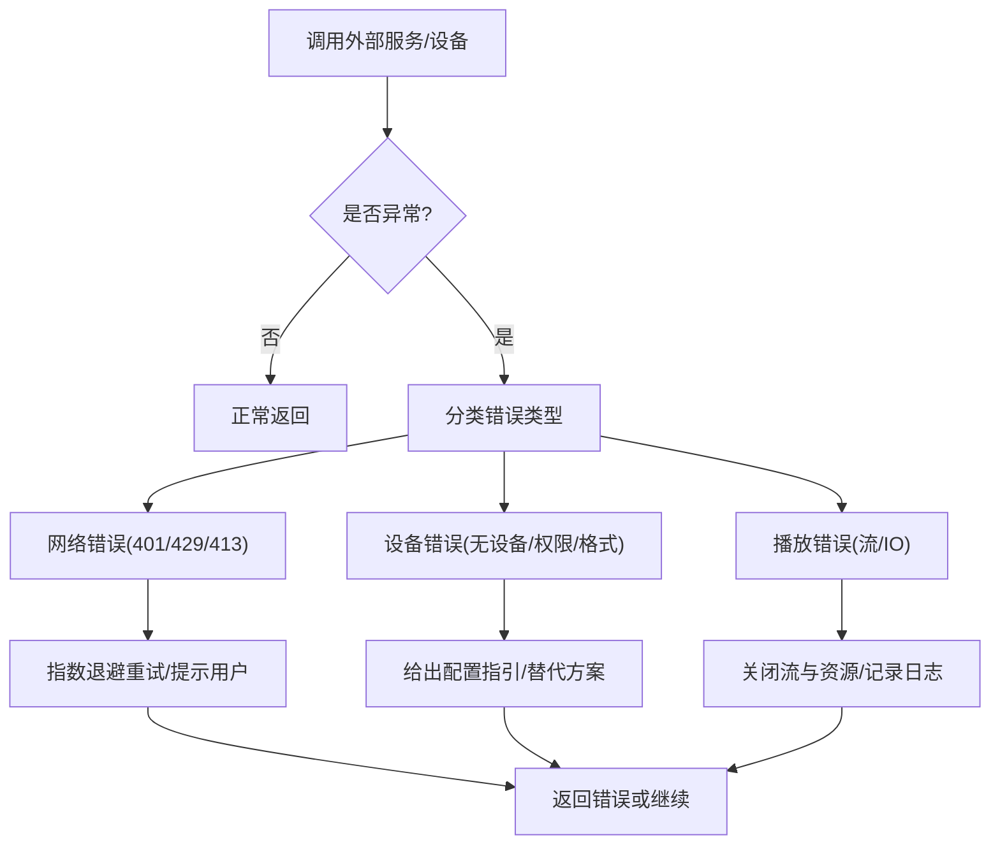
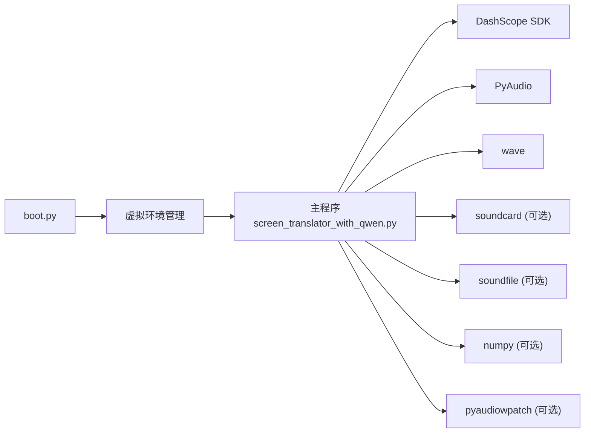

# 音频处理数据流

<cite>
**本文引用的文件**
- [screen_translator_with_qwen.py](file://screen_translator_with_qwen.py)
- [boot.py](file://boot.py)
- [requirements.txt](file://requirements.txt)
</cite>

## 目录
1. [简介](#简介)
2. [项目结构](#项目结构)
3. [核心组件](#核心组件)
4. [架构总览](#架构总览)
5. [详细组件分析](#详细组件分析)
6. [依赖关系分析](#依赖关系分析)
7. [性能与内存优化建议](#性能与内存优化建议)
8. [故障排查指南](#故障排查指南)
9. [结论](#结论)

## 简介
本文件面向“屏幕翻译工具”的音频处理子系统，聚焦语音合成（TTS）到播放的完整数据管道：文本输入、阿里云 TTS API 调用、WAV 文件生成与本地播放控制。文档深入解释音频文件生命周期管理（创建、清理、资源释放）、变速播放实现原理（重采样/插值算法与速度控制）、多线程音频处理架构（播放线程、停止事件、资源同步），并给出数据流图、线程状态图与异常处理流程，最后提供音频质量优化与内存管理建议。

## 项目结构
本项目为单进程桌面应用，主程序负责 OCR 识别、翻译、TTS 合成与播放；启动器负责虚拟环境管理与后台启动目标程序。与音频相关的关键逻辑集中在主程序中，包含：
- 语音合成：基于阿里云 DashScope CosyVoice 流式接口，将文本转为 WAV 字节流并落盘
- 本地播放：使用 PyAudio 打开输出流，支持线性插值变速播放
- 系统录音：多方案回录系统音频（soundcard/pyaudiowpatch/pyaudio），用于听歌识曲等场景
- 线程模型：UI 线程 + 合成/播放/识别子线程，通过事件标志和队列进行同步

图表来源
- [screen_translator_with_qwen.py:353-360](file://screen_translator_with_qwen.py#L353-L360)
- [screen_translator_with_qwen.py:1510-1531](file://screen_translator_with_qwen.py#L1510-L1531)
- [screen_translator_with_qwen.py:372-473](file://screen_translator_with_qwen.py#L372-L473)
- [screen_translator_with_qwen.py:1789-1851](file://screen_translator_with_qwen.py#L1789-L1851)
- [boot.py:257-279](file://boot.py#L257-L279)

章节来源
- [screen_translator_with_qwen.py:353-360](file://screen_translator_with_qwen.py#L353-L360)
- [boot.py:257-279](file://boot.py#L257-L279)

## 核心组件
- 语音合成入口：从 UI 触发，提取原文文本，调用 DashScope CosyVoice 流式接口，合并分片写入本地 WAV 文件，随后进入播放阶段
- 本地播放器：读取 WAV 文件，解析参数，按块写入 PyAudio 输出流；若指定速度，则对样本进行线性插值重采样后播放
- 系统录音模块：提供三种回录方案（soundcard 环回、pyaudiowpatch WASAPI 环回、pyaudio 立体声混音），失败时给出排障提示
- 线程与同步：合成与播放分别运行在独立线程，通过 Event 控制停止；UI 更新通过 after 调度，避免跨线程直接操作控件

章节来源
- [screen_translator_with_qwen.py:1442-1556](file://screen_translator_with_qwen.py#L1442-L1556)
- [screen_translator_with_qwen.py:372-473](file://screen_translator_with_qwen.py#L372-L473)
- [screen_translator_with_qwen.py:1789-1851](file://screen_translator_with_qwen.py#L1789-L1851)

## 架构总览
下图展示从文本到声音的端到端数据流，以及关键的外部依赖与中间产物。

图表来源
- [screen_translator_with_qwen.py:1442-1556](file://screen_translator_with_qwen.py#L1442-L1556)
- [screen_translator_with_qwen.py:372-473](file://screen_translator_with_qwen.py#L372-L473)

## 详细组件分析

### 语音合成与播放数据流
- 文本来源：翻译结果窗口中的“原文”部分
- 合成参数：模型、音色、格式、采样率、是否流式、API Key
- 流式接收：迭代返回的分片，过滤掉仅含 URL 的尾部分片，收集 audio_data
- 落盘策略：将所有分片拼接后以二进制写模式保存到固定文件名
- 播放策略：打开 WAV，解析采样宽度、声道数、采样率，打开 PyAudio 输出流，按块写入；若需要变速，先对样本数组做线性插值重采样再打包写入

图表来源
- [screen_translator_with_qwen.py:1510-1531](file://screen_translator_with_qwen.py#L1510-L1531)
- [screen_translator_with_qwen.py:372-473](file://screen_translator_with_qwen.py#L372-L473)

章节来源
- [screen_translator_with_qwen.py:1442-1556](file://screen_translator_with_qwen.py#L1442-L1556)
- [screen_translator_with_qwen.py:372-473](file://screen_translator_with_qwen.py#L372-L473)

### 变速播放实现原理
- 重采样思路：根据目标速度计算新样本数量，遍历新位置映射到原样本浮点索引，采用相邻样本线性插值得到新样本值
- 边界保护：当索引越界时回退到倒数第二个样本，保证安全访问
- 动态范围限制：根据采样宽度（16bit/8bit）对样本值进行裁剪，防止溢出
- 播放循环：按固定块大小写入输出流，并在每次写入前检查停止事件，支持即时中断

图表来源
- [screen_translator_with_qwen.py:372-473](file://screen_translator_with_qwen.py#L372-L473)

章节来源
- [screen_translator_with_qwen.py:372-473](file://screen_translator_with_qwen.py#L372-L473)

### 多线程音频处理架构
- 线程划分
  - UI 线程：Tkinter 主循环，响应交互与更新状态
  - 合成线程：执行 TTS 流式请求、落盘、触发播放
  - 播放线程：读取 WAV、可选重采样、写入 PyAudio 输出流
- 同步机制
  - 停止事件：threading.Event 用于在播放循环中快速退出
  - 状态标志：synthesizing、playing、is_new_audio、speed_mode 等用于 UI 状态与行为控制
  - UI 更新：通过 root.after 在主线程安全更新控件
- 资源管理
  - 播放结束后统一关闭流、终止 PyAudio、关闭 WAV 句柄
  - 旧文件清理：启动时与关闭窗口时清理历史合成文件，避免冲突

图表来源
- [screen_translator_with_qwen.py:1442-1556](file://screen_translator_with_qwen.py#L1442-L1556)
- [screen_translator_with_qwen.py:372-473](file://screen_translator_with_qwen.py#L372-L473)

章节来源
- [screen_translator_with_qwen.py:1442-1556](file://screen_translator_with_qwen.py#L1442-L1556)
- [screen_translator_with_qwen.py:372-473](file://screen_translator_with_qwen.py#L372-L473)

### 系统录音与临时文件生命周期
- 录音方案优先级：soundcard 环回 → pyaudiowpatch WASAPI 环回 → pyaudio 立体声混音
- 临时文件：保存在系统临时目录，命名包含进程 ID，避免并发冲突
- 清理策略：识别完成后删除临时文件；若失败，记录错误并提供排障信息

图表来源
- [screen_translator_with_qwen.py:1789-1851](file://screen_translator_with_qwen.py#L1789-L1851)
- [screen_translator_with_qwen.py:1853-1941](file://screen_translator_with_qwen.py#L1853-L1941)
- [screen_translator_with_qwen.py:1943-2068](file://screen_translator_with_qwen.py#L1943-L2068)
- [screen_translator_with_qwen.py:2070-2231](file://screen_translator_with_qwen.py#L2070-L2231)

章节来源
- [screen_translator_with_qwen.py:1789-1851](file://screen_translator_with_qwen.py#L1789-L1851)
- [screen_translator_with_qwen.py:1853-1941](file://screen_translator_with_qwen.py#L1853-L1941)
- [screen_translator_with_qwen.py:1943-2068](file://screen_translator_with_qwen.py#L1943-L2068)
- [screen_translator_with_qwen.py:2070-2231](file://screen_translator_with_qwen.py#L2070-L2231)

### 异常处理流程
- 网络与 API 错误：针对 401/429/413 等状态码进行分类处理，指数退避重试，最终抛出明确错误消息
- 音频设备错误：不同录音方案捕获具体错误码并给出针对性提示（如蓝牙耳机不支持环回、未启用立体声混音）
- 播放异常：捕获并记录错误，确保流与资源正确关闭，避免泄漏

图表来源
- [screen_translator_with_qwen.py:1148-1247](file://screen_translator_with_qwen.py#L1148-L1247)
- [screen_translator_with_qwen.py:1853-1941](file://screen_translator_with_qwen.py#L1853-L1941)
- [screen_translator_with_qwen.py:1943-2068](file://screen_translator_with_qwen.py#L1943-L2068)
- [screen_translator_with_qwen.py:2070-2231](file://screen_translator_with_qwen.py#L2070-L2231)
- [screen_translator_with_qwen.py:372-473](file://screen_translator_with_qwen.py#L372-L473)

章节来源
- [screen_translator_with_qwen.py:1148-1247](file://screen_translator_with_qwen.py#L1148-L1247)
- [screen_translator_with_qwen.py:1853-1941](file://screen_translator_with_qwen.py#L1853-L1941)
- [screen_translator_with_qwen.py:1943-2068](file://screen_translator_with_qwen.py#L1943-L2068)
- [screen_translator_with_qwen.py:2070-2231](file://screen_translator_with_qwen.py#L2070-L2231)
- [screen_translator_with_qwen.py:372-473](file://screen_translator_with_qwen.py#L372-L473)

## 依赖关系分析
- 运行时依赖
  - DashScope SDK：用于 CosyVoice 流式合成
  - PyAudio：本地音频输出
  - wave：WAV 读写
  - soundcard/soundfile/numpy：系统音频录制（可选）
  - pyaudiowpatch：WASAPI 环回（Windows，可选）
- 启动器依赖
  - boot.py：自动检测唯一 .py 主程序、维护虚拟环境、后台启动目标程序

图表来源
- [screen_translator_with_qwen.py:315-336](file://screen_translator_with_qwen.py#L315-L336)
- [screen_translator_with_qwen.py:353-360](file://screen_translator_with_qwen.py#L353-L360)
- [boot.py:257-279](file://boot.py#L257-L279)

章节来源
- [screen_translator_with_qwen.py:315-336](file://screen_translator_with_qwen.py#L315-L336)
- [screen_translator_with_qwen.py:353-360](file://screen_translator_with_qwen.py#L353-L360)
- [boot.py:257-279](file://boot.py#L257-L279)

## 性能与内存优化建议
- 减少全量加载
  - 当前播放路径会将整个 WAV 读入内存并进行样本级重采样，对于长音频可能带来较大内存占用。建议改为流式解码与流式重采样，边读边写，降低峰值内存
- 提升插值质量
  - 线性插值简单高效但音质一般，可考虑 sinc 插值或带限重采样以提升高保真度，代价是 CPU 开销增加
- 合理块大小
  - 播放块大小需平衡延迟与稳定性，过小会增加系统调用开销，过大可能导致卡顿；可根据系统缓冲能力调优
- 并发与锁
  - 当前播放线程与 UI 线程通过 Event 与 after 通信，避免共享可变状态；若引入更多并发处理（如实时转写），建议使用队列与互斥锁保护共享资源
- 文件生命周期
  - 合成完成后立即落盘，播放结束后及时关闭句柄；建议在合成失败时也清理半成品文件，避免磁盘碎片与重复读取
- 设备选择
  - 优先使用 WASAPI 环回（支持蓝牙耳机），其次 soundcard 环回，最后 pyaudio 立体声混音；遇到权限或格式问题，按错误提示调整系统设置

[本节为通用指导，不直接分析具体文件]

## 故障排查指南
- 无法合成语音
  - 检查 API Key 是否正确、网络连通性；关注 401/429/413 错误提示并按建议重试或缩小文本长度
- 无法播放或无声
  - 确认系统默认输出设备可用；检查 PyAudio 是否能打开输出流；查看是否有异常日志
- 变速播放出现爆音或失真
  - 检查采样宽度与数据类型转换是否正确；确认插值后的数值范围被正确裁剪
- 系统录音失败
  - 蓝牙耳机不支持环回：切换到内置扬声器或有线耳机
  - 未启用立体声混音：按提示在 Windows 声音控制面板中启用
  - 权限不足：以管理员身份运行或调整音频设备权限

章节来源
- [screen_translator_with_qwen.py:1148-1247](file://screen_translator_with_qwen.py#L1148-L1247)
- [screen_translator_with_qwen.py:1853-1941](file://screen_translator_with_qwen.py#L1853-L1941)
- [screen_translator_with_qwen.py:1943-2068](file://screen_translator_with_qwen.py#L1943-L2068)
- [screen_translator_with_qwen.py:2070-2231](file://screen_translator_with_qwen.py#L2070-L2231)
- [screen_translator_with_qwen.py:372-473](file://screen_translator_with_qwen.py#L372-L473)

## 结论
该项目的音频处理数据流围绕“文本→TTS 流式合成→WAV 落盘→本地播放”的主路径展开，并通过多线程与事件机制实现可控的播放体验。变速播放采用线性插值重采样，兼顾实现复杂度与效果。系统录音提供多套方案以适应不同硬件环境。整体架构清晰、职责分明，具备较好的可扩展性与容错能力。后续可在流式重采样、插值算法与资源管理方面进一步优化，以获得更低的内存占用与更高的音质表现。