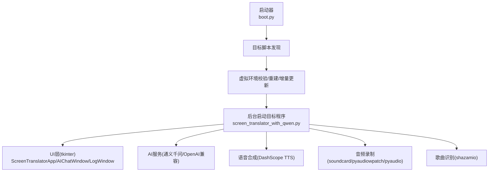
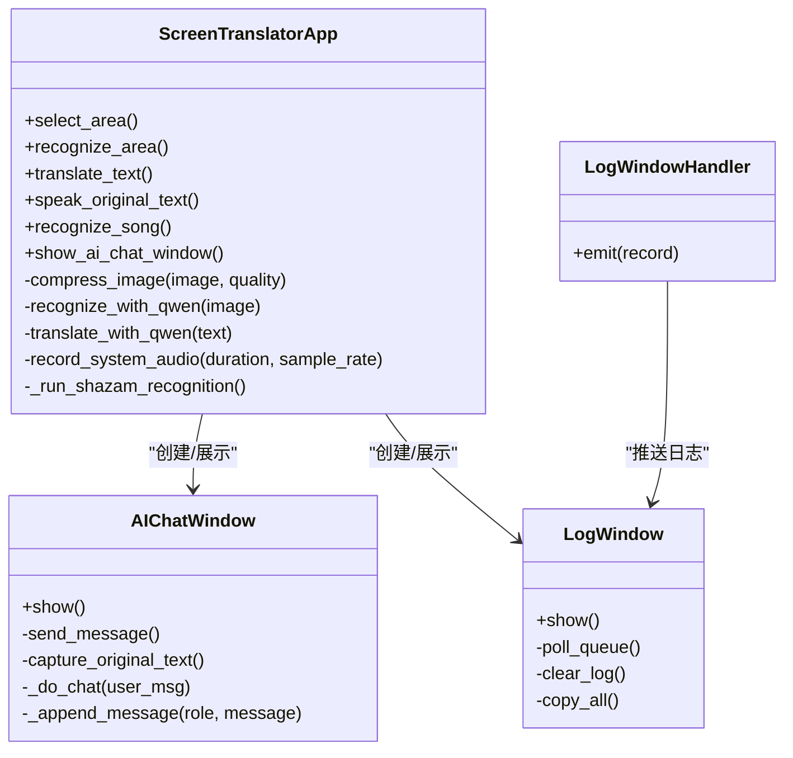
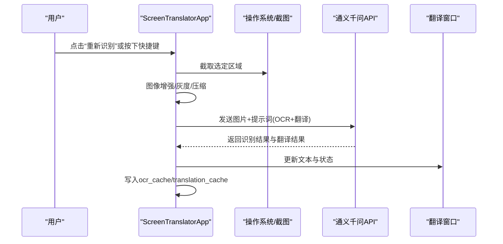
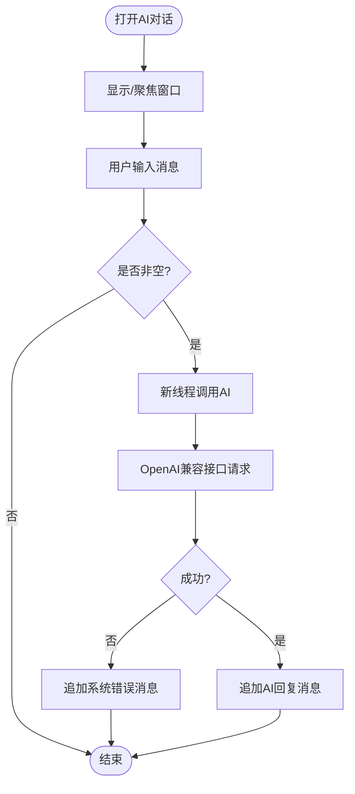
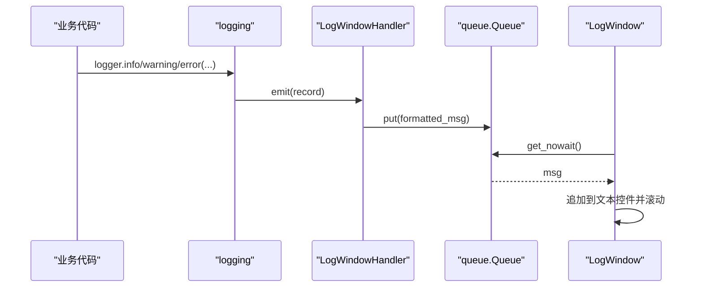
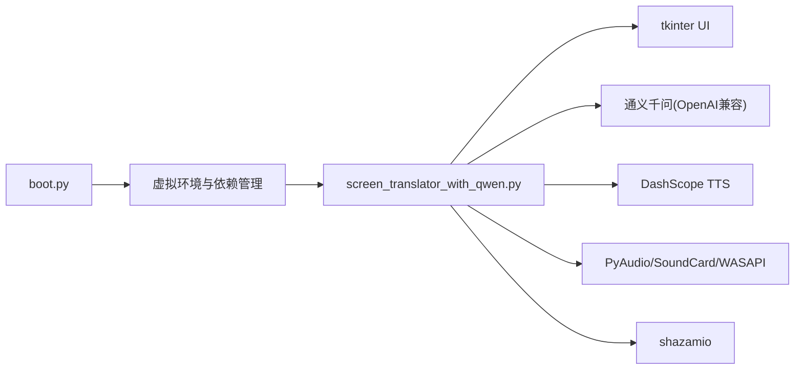

# 开发指南

<cite>
**本文引用的文件列表**
- [boot.py](file://boot.py)
- [screen_translator_with_qwen.py](file://screen_translator_with_qwen.py)
- [requirements.txt](file://requirements.txt)
- [test/screen_translator_with_glm.py](file://test/screen_translator_with_glm.py)
</cite>

## 目录
1. [简介](#简介)
2. [项目结构](#项目结构)
3. [核心组件](#核心组件)
4. [架构总览](#架构总览)
5. [详细组件分析](#详细组件分析)
6. [依赖关系分析](#依赖关系分析)
7. [性能与并发](#性能与并发)
8. [测试与调试](#测试与调试)
9. [版本演进（1.0 → 2.0）](#版本演进10--20)
10. [扩展与插件化指南](#扩展与插件化指南)
11. [贡献规范与环境搭建](#贡献规范与环境搭建)
12. [故障排查](#故障排查)
13. [结论](#结论)

## 简介
本指南面向开发者，系统梳理屏幕翻译工具 v2.0 的代码结构与模块划分原则，重点解析主应用类、AI对话窗口、日志窗口等核心组件的职责与协作关系；阐述面向对象设计模式、事件驱动架构与多线程处理机制；提供新功能扩展（含插件化思路）、第三方服务集成方法与最佳实践；并给出测试与调试方法、性能分析技巧、从 1.0 到 2.0 的演进说明以及贡献规范与环境搭建指导。

## 项目结构
仓库采用“单入口 + 功能脚本”的组织方式：
- 启动器 boot.py：自动发现同目录下唯一 .py 作为目标程序，管理虚拟环境、依赖安装与后台启动。
- 主程序 screen_translator_with_qwen.py：基于 tkinter 的桌面应用，实现区域截图识别、OCR+翻译、语音合成播放、听歌识曲、AI对话、全局快捷键等功能。
- requirements.txt：声明运行期依赖。
- test/：包含多个示例与测试脚本，用于验证不同能力（如 GLM 版本、全屏覆盖、透明标签等）。

图表来源
- [boot.py:256-279](file://boot.py#L256-L279)
- [screen_translator_with_qwen.py:474-548](file://screen_translator_with_qwen.py#L474-L548)

章节来源
- [boot.py:1-279](file://boot.py#L1-L279)
- [screen_translator_with_qwen.py:1-200](file://screen_translator_with_qwen.py#L1-L200)
- [requirements.txt:1-31](file://requirements.txt#L1-L31)

## 核心组件
- ScreenTranslatorApp：主应用控制器，负责 UI 初始化、区域选择、截图压缩、OCR+翻译流程编排、结果缓存、窗口拖拽/缩放、全局快捷键、语音合成与播放、听歌识曲流程调度等。
- AIChatWindow：独立对话框，支持用户输入、捕获原文、调用 AI 进行对话，并在聊天区按角色着色显示。
- LogWindow：独立日志窗口，通过队列异步消费 logging 输出，支持清空与复制。
- 辅助类与函数：LogWindowHandler（自定义日志处理器）、音频播放与变速、系统音频录制多方案、Shazam 异步识别等。

章节来源
- [screen_translator_with_qwen.py:34-100](file://screen_translator_with_qwen.py#L34-L100)
- [screen_translator_with_qwen.py:101-300](file://screen_translator_with_qwen.py#L101-L300)
- [screen_translator_with_qwen.py:474-634](file://screen_translator_with_qwen.py#L474-L634)

## 架构总览
整体为“事件驱动 + 多线程 + 外部服务”的桌面应用架构：
- 事件驱动：tkinter 事件循环驱动 UI 交互；键盘钩子触发全局快捷键；日志队列驱动日志窗口刷新。
- 多线程：识别、翻译、语音合成、播放、听歌识曲均在后台线程执行，避免阻塞 UI。
- 外部服务：通义千问（OpenAI 兼容接口）用于 OCR+翻译与对话；DashScope TTS 用于语音合成；shazamio 用于歌曲识别；多种音频采集后端适配 Windows 设备差异。

图表来源
- [screen_translator_with_qwen.py:34-100](file://screen_translator_with_qwen.py#L34-L100)
- [screen_translator_with_qwen.py:101-300](file://screen_translator_with_qwen.py#L101-L300)
- [screen_translator_with_qwen.py:474-634](file://screen_translator_with_qwen.py#L474-L634)

## 详细组件分析

### ScreenTranslatorApp 主类
职责边界
- UI 生命周期与布局：主窗口、按钮、状态栏、快捷键设置区。
- 区域选择与可视化：全屏半透明选择窗口、边框蒙版、控制按钮窗口的创建与销毁。
- 识别与翻译流水线：截图→压缩→OCR+翻译→结果缓存→翻译窗口更新。
- 语音合成与播放：调用 DashScope TTS 生成 wav，本地 pyaudio 播放，支持变速。
- 听歌识曲：系统音频录制（多后端）→ shazamio 异步识别 → 结果展示。
- 全局快捷键：keyboard 库注册热键，统一触发重新识别。
- 中止与关闭：标志位控制中断长耗时任务，清理窗口与资源。

关键流程（识别与翻译）

图表来源
- [screen_translator_with_qwen.py:927-1021](file://screen_translator_with_qwen.py#L927-L1021)
- [screen_translator_with_qwen.py:1123-1248](file://screen_translator_with_qwen.py#L1123-L1248)

章节来源
- [screen_translator_with_qwen.py:474-634](file://screen_translator_with_qwen.py#L474-L634)
- [screen_translator_with_qwen.py:927-1021](file://screen_translator_with_qwen.py#L927-L1021)
- [screen_translator_with_qwen.py:1098-1122](file://screen_translator_with_qwen.py#L1098-L1122)
- [screen_translator_with_qwen.py:1123-1248](file://screen_translator_with_qwen.py#L1123-L1248)
- [screen_translator_with_qwen.py:1249-1266](file://screen_translator_with_qwen.py#L1249-L1266)
- [screen_translator_with_qwen.py:1704-1723](file://screen_translator_with_qwen.py#L1704-L1723)
- [screen_translator_with_qwen.py:1734-1788](file://screen_translator_with_qwen.py#L1734-L1788)

### AIChatWindow 对话框
职责边界
- 独立 Toplevel 窗口，居中显示，最小尺寸限制。
- 输入区与发送按钮，支持 Ctrl+Enter 快捷发送。
- “捕获原文”将 ocr_cache 中内容合并填入输入框。
- 在线程中调用 AI 客户端，使用 root.after 安全更新 UI。
- 错误分类提示（未初始化、鉴权失败、限流等）。

图表来源
- [screen_translator_with_qwen.py:101-300](file://screen_translator_with_qwen.py#L101-L300)

章节来源
- [screen_translator_with_qwen.py:101-300](file://screen_translator_with_qwen.py#L101-L300)

### LogWindow 日志窗口
职责边界
- 独立日志窗口，滚动文本控件，禁用编辑。
- 通过 queue.Queue 接收自定义 Handler 输出的日志消息。
- 定时轮询队列，非阻塞追加日志并自动滚动到底部。
- 提供清空与复制全部功能。

图表来源
- [screen_translator_with_qwen.py:21-100](file://screen_translator_with_qwen.py#L21-L100)

章节来源
- [screen_translator_with_qwen.py:21-100](file://screen_translator_with_qwen.py#L21-L100)

### 语音合成与播放
- 语音合成：DashScope TTS 流式返回音频数据，拼接后保存为 wav。
- 播放：pyaudio 读取 wav，支持线性插值变速；播放完成后恢复 UI 状态。
- 资源清理：程序退出时删除临时 wav 文件。

章节来源
- [screen_translator_with_qwen.py:1442-1569](file://screen_translator_with_qwen.py#L1442-L1569)
- [screen_translator_with_qwen.py:363-473](file://screen_translator_with_qwen.py#L363-L473)

### 听歌识曲
- 系统音频录制：优先 soundcard 环形回录，其次 pyaudiowpatch WASAPI 环回，最后 pyaudio 立体声混音。
- 识别：shazamio 异步识别，封装在 asyncio 事件循环中执行。
- 结果：标题、艺术家、链接、封面信息提取与展示。

章节来源
- [screen_translator_with_qwen.py:1789-1851](file://screen_translator_with_qwen.py#L1789-L1851)
- [screen_translator_with_qwen.py:1853-1942](file://screen_translator_with_qwen.py#L1853-L1942)
- [screen_translator_with_qwen.py:1943-2068](file://screen_translator_with_qwen.py#L1943-L2068)
- [screen_translator_with_qwen.py:2070-2231](file://screen_translator_with_qwen.py#L2070-L2231)
- [screen_translator_with_qwen.py:2233-2270](file://screen_translator_with_qwen.py#L2233-L2270)
- [screen_translator_with_qwen.py:2272-2371](file://screen_translator_with_qwen.py#L2272-L2371)

## 依赖关系分析
- 启动器与主程序解耦：boot.py 仅负责环境准备与进程拉起，不耦合业务逻辑。
- 主程序内部高内聚低耦合：UI、AI 调用、音频、识别各自模块化，通过类与方法组织。
- 可选依赖优雅降级：对 shazamio、soundcard、pyaudiowpatch 等采用 try/except 检测可用性，缺失时给出明确提示。

图表来源
- [boot.py:209-253](file://boot.py#L209-L253)
- [screen_translator_with_qwen.py:314-336](file://screen_translator_with_qwen.py#L314-L336)
- [requirements.txt:1-31](file://requirements.txt#L1-L31)

章节来源
- [boot.py:1-279](file://boot.py#L1-L279)
- [screen_translator_with_qwen.py:314-336](file://screen_translator_with_qwen.py#L314-L336)
- [requirements.txt:1-31](file://requirements.txt#L1-L31)

## 性能与并发
- 图像处理：先增强对比度再转灰度，内存中 JPEG 压缩，减少网络传输体积。
- 网络请求：带指数退避与随机抖动的重试策略，针对 429 限流做特殊处理。
- 线程模型：所有耗时操作均在新线程执行，UI 更新通过 root.after 回到主线程，避免竞态与卡顿。
- 音频播放：分块写入 pyaudio 流，支持停止事件中断；变速采用线性插值，兼顾质量与性能。

优化建议
- 对大文本 TTS 可考虑分段合成与流式播放，降低首字节延迟。
- OCR 请求前可增加图像尺寸上限与 DPI 自适应策略，避免 413 错误。
- 引入连接池与超时配置，提升稳定性与响应速度。

[本节为通用性能讨论，无需特定文件引用]

## 测试与调试
- 单元测试：针对 compress_image、translate_with_qwen 的缓存命中路径、错误分支编写用例；模拟 OpenAI/DashScope/shazamio 返回。
- 集成测试：端到端流程（选择区域→识别→翻译→TTS→播放），在 CI 中使用 mock 替换外部服务。
- 调试技巧：
  - 使用 LogWindow 实时查看日志，定位异常堆栈。
  - 通过 status_label 与 translate_status_label 观察各阶段状态。
  - 利用 atexit 清理临时文件，避免磁盘污染。
- 性能分析：
  - 使用 cProfile 对 recognize_with_qwen、_play_audio 热点函数进行分析。
  - 监控网络请求耗时与重试次数，评估重试策略有效性。

章节来源
- [screen_translator_with_qwen.py:1098-1122](file://screen_translator_with_qwen.py#L1098-L1122)
- [screen_translator_with_qwen.py:1123-1248](file://screen_translator_with_qwen.py#L1123-L1248)
- [screen_translator_with_qwen.py:1442-1569](file://screen_translator_with_qwen.py#L1442-L1569)
- [screen_translator_with_qwen.py:363-473](file://screen_translator_with_qwen.py#L363-L473)

## 版本演进（1.0 → 2.0）
- 1.0（GLM 版本）：基于 zai SDK 的智普 AI 客户端，具备基础 OCR+翻译与 UI 交互。
- 2.0（Qwen 版本）：迁移至通义千问（OpenAI 兼容接口），新增以下能力：
  - AI 对话窗口（AIChatWindow）
  - 日志窗口（LogWindow）与自定义 Handler
  - 语音合成与播放（DashScope TTS + PyAudio）
  - 听歌识曲（多后端系统音频录制 + shazamio）
  - 全局快捷键（keyboard 库）
  - 更完善的错误处理与重试策略
  - 启动器 boot.py 自动化环境管理

章节来源
- [test/screen_translator_with_glm.py:1-800](file://test/screen_translator_with_glm.py#L1-L800)
- [screen_translator_with_qwen.py:1-200](file://screen_translator_with_qwen.py#L1-L200)
- [screen_translator_with_qwen.py:474-634](file://screen_translator_with_qwen.py#L474-L634)

## 扩展与插件化指南
- 插件化思路
  - 定义统一的“识别/翻译/对话/语音”插件接口（抽象基类或协议），通过工厂根据配置加载具体实现。
  - 将外部服务调用（OpenAI/DashScope/shazamio）封装为可替换的服务适配器。
  - 使用配置文件或环境变量切换服务提供者与参数。
- 第三方服务集成
  - 新增 LLM：参照 qwen_client 初始化方式，增加新的客户端实例与重试策略。
  - 新增 TTS：参考 HttpSpeechSynthesizer 用法，统一音频输出格式与播放接口。
  - 新增音频源：遵循 record_system_audio 的多方案回退模式，新增后端并注册到调度器。
- 最佳实践
  - 所有外部 I/O 必须可取消与可重试，避免阻塞 UI。
  - 对外部错误进行分类映射，向用户提供清晰提示。
  - 保持 UI 与业务逻辑分离，便于测试与替换。

[本节为概念性指导，无需特定文件引用]

## 贡献规范与环境搭建
- 环境搭建
  - 直接双击运行 boot.py，自动完成虚拟环境创建与依赖安装。
  - 如需手动管理：python -m venv venv && pip install -r requirements.txt。
- 代码规范
  - 命名：类名 PascalCase，方法/变量 snake_case。
  - 日志：使用 logger 记录关键路径与异常，避免 print。
  - 线程：仅在后台线程执行耗时操作，UI 更新使用 root.after。
  - 错误处理：区分鉴权、限流、网络、IO 等错误类型，给出用户友好提示。
- 提交与审查
  - 提交信息包含功能点与影响范围。
  - 新增功能需附带最小可用测试用例或演示脚本。
  - 变更依赖需同步更新 requirements.txt 并验证安装。

章节来源
- [boot.py:256-279](file://boot.py#L256-L279)
- [requirements.txt:1-31](file://requirements.txt#L1-L31)

## 故障排查
- 无法识别系统音频
  - 现象：听歌识曲失败，提示未找到设备或访问被拒绝。
  - 排查：确认已安装 pyaudiowpatch；若使用蓝牙耳机，切换到内置扬声器或有线耳机；启用 Windows 立体声混音。
- 语音合成失败
  - 现象：TTS 报错或无声音。
  - 排查：检查 key.txt 中的 API 密钥；确认网络连通；查看日志中错误码。
- OCR/翻译失败
  - 现象：401/429/413 错误。
  - 排查：401 检查密钥；429 等待限流解除；413 缩小识别区域或降低图像质量。
- 日志窗口无输出
  - 现象：LogWindow 空白。
  - 排查：确认 LogWindowHandler 已注册且 log_queue 存在；检查窗口是否被隐藏。

章节来源
- [screen_translator_with_qwen.py:1789-1851](file://screen_translator_with_qwen.py#L1789-L1851)
- [screen_translator_with_qwen.py:1442-1569](file://screen_translator_with_qwen.py#L1442-L1569)
- [screen_translator_with_qwen.py:1123-1248](file://screen_translator_with_qwen.py#L1123-L1248)
- [screen_translator_with_qwen.py:21-100](file://screen_translator_with_qwen.py#L21-L100)

## 结论
v2.0 在 v1.0 的基础上显著增强了用户体验与能力边界：引入 AI 对话、日志窗口、语音合成与播放、听歌识曲、全局快捷键等特性，并通过启动器简化了部署与依赖管理。代码采用清晰的类分层与事件驱动架构，结合多线程与健壮的错误处理，具备良好的可扩展性与可维护性。建议后续继续推进插件化与服务抽象，完善测试覆盖与性能基准，以支撑更多场景与更高可靠性。