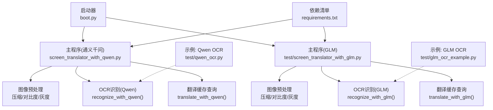
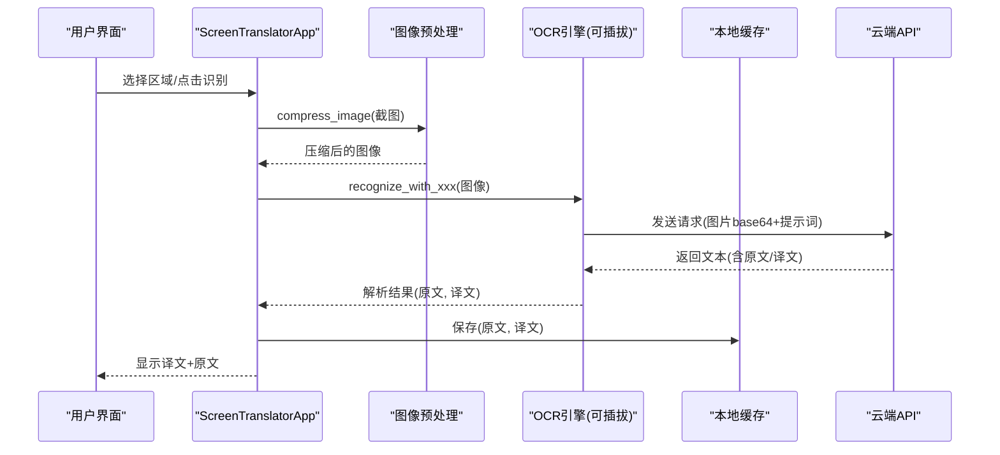
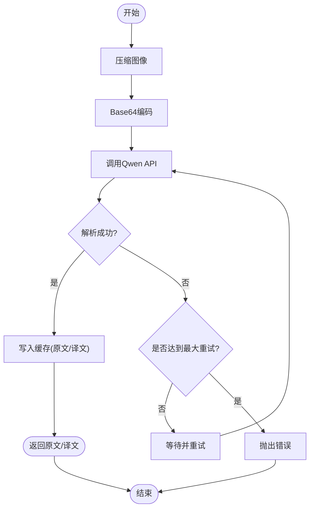
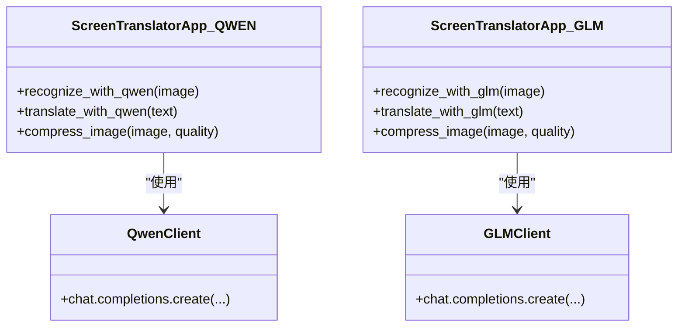
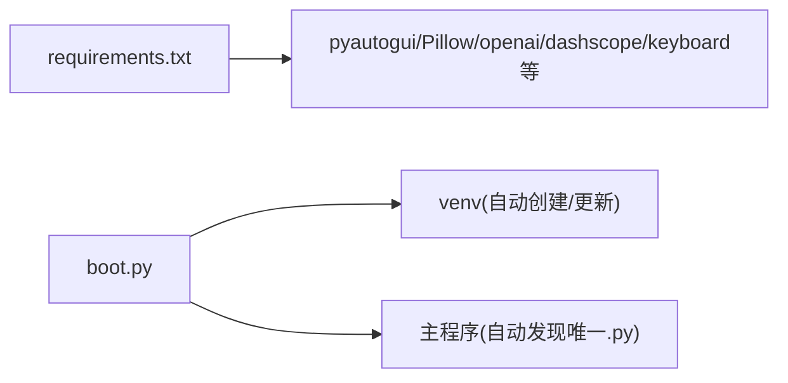

# OCR引擎扩展

<cite>
**本文引用的文件**   
- [screen_translator_with_qwen.py](file://screen_translator_with_qwen.py)
- [test/screen_translator_with_glm.py](file://test/screen_translator_with_glm.py)
- [test/qwen_ocr.py](file://test/qwen_ocr.py)
- [test/glm_ocr_example.py](file://test/glm_ocr_example.py)
- [boot.py](file://boot.py)
- [requirements.txt](file://requirements.txt)
</cite>

## 目录
1. [简介](#简介)
2. [项目结构](#项目结构)
3. [核心组件](#核心组件)
4. [架构总览](#架构总览)
5. [详细组件分析](#详细组件分析)
6. [依赖关系分析](#依赖关系分析)
7. [性能与优化建议](#性能与优化建议)
8. [故障排查指南](#故障排查指南)
9. [结论](#结论)
10. [附录：实现自定义OCR引擎的步骤](#附录实现自定义ocr引擎的步骤)

## 简介
本指南面向希望为屏幕翻译工具添加新OCR后端的开发者。文档基于仓库中现有的通义千问（Qwen）与智谱GLM两种视觉大模型OCR实现，系统梳理了图像预处理、API调用、结果解析、缓存机制与配置管理，并给出可操作的扩展步骤与最佳实践。读者将了解如何在不侵入主流程的前提下，新增一个“自定义OCR引擎”，并通过统一接口接入现有UI与业务流程。

## 项目结构
仓库包含两个主要应用入口：
- 通义千问版：[screen_translator_with_qwen.py](file://screen_translator_with_qwen.py)
- 智谱GLM版：[test/screen_translator_with_glm.py](file://test/screen_translator_with_glm.py)

此外提供示例脚本与启动器：
- Qwen OCR示例：[test/qwen_ocr.py](file://test/qwen_ocr.py)
- GLM OCR示例：[test/glm_ocr_example.py](file://test/glm_ocr_example.py)
- 通用启动器：[boot.py](file://boot.py)
- 依赖清单：[requirements.txt](file://requirements.txt)

图表来源
- [screen_translator_with_qwen.py:927-1248](file://screen_translator_with_qwen.py#L927-L1248)
- [test/screen_translator_with_glm.py:429-758](file://test/screen_translator_with_glm.py#L429-L758)
- [test/qwen_ocr.py:1-30](file://test/qwen_ocr.py#L1-L30)
- [test/glm_ocr_example.py:1-33](file://test/glm_ocr_example.py#L1-L33)
- [boot.py:255-279](file://boot.py#L255-L279)
- [requirements.txt:1-31](file://requirements.txt#L1-L31)

章节来源
- [screen_translator_with_qwen.py:1-120](file://screen_translator_with_qwen.py#L1-L120)
- [test/screen_translator_with_glm.py:1-133](file://test/screen_translator_with_glm.py#L1-L133)
- [boot.py:1-120](file://boot.py#L1-L120)
- [requirements.txt:1-31](file://requirements.txt#L1-L31)

## 核心组件
- 图像预处理模块
  - 功能：增强对比度、转灰度、内存压缩，降低网络传输体积，提升识别稳定性。
  - 关键方法路径：
    - 通义千问版：[compress_image:1098-1121](file://screen_translator_with_qwen.py#L1098-L1121)
    - GLM版：[compress_image:595-618](file://test/screen_translator_with_glm.py#L595-L618)
- OCR识别模块
  - 通义千问：[recognize_with_qwen:1123-1248](file://screen_translator_with_qwen.py#L1123-L1248)
  - GLM：[recognize_with_glm:620-740](file://test/screen_translator_with_glm.py#L620-L740)
- 翻译缓存模块
  - 通义千问：[translate_with_qwen:1249-1266](file://screen_translator_with_qwen.py#L1249-L1266)
  - GLM：[translate_with_glm:741-758](file://test/screen_translator_with_glm.py#L741-L758)
- 配置与密钥管理
  - API密钥读取：[read_api_key:339-346](file://screen_translator_with_qwen.py#L339-L346)、[read_api_key:23-30](file://test/screen_translator_with_glm.py#L23-L30)
  - 客户端初始化：
    - Qwen OpenAI兼容客户端：[初始化:348-360](file://screen_translator_with_qwen.py#L348-L360)
    - GLM Zhipu客户端：[初始化:32-40](file://test/screen_translator_with_glm.py#L32-L40)
- 线程与UI更新
  - 识别/翻译均在新线程执行，通过事件循环安全更新UI状态。
  - 参考路径：
    - 通义千问版识别线程：[recognize_area:927-1021](file://screen_translator_with_qwen.py#L927-L1021)
    - GLM版识别线程：[recognize_area:429-517](file://test/screen_translator_with_glm.py#L429-L517)

章节来源
- [screen_translator_with_qwen.py:1098-1266](file://screen_translator_with_qwen.py#L1098-L1266)
- [test/screen_translator_with_glm.py:595-758](file://test/screen_translator_with_glm.py#L595-L758)
- [screen_translator_with_qwen.py:339-360](file://screen_translator_with_qwen.py#L339-L360)
- [test/screen_translator_with_glm.py:23-40](file://test/screen_translator_with_glm.py#L23-L40)

## 架构总览
整体流程围绕“截图→预处理→OCR→结果解析→缓存→展示”展开。不同后端（Qwen/GLM）在“OCR识别”环节替换，其余流程保持一致。

图表来源
- [screen_translator_with_qwen.py:927-1248](file://screen_translator_with_qwen.py#L927-L1248)
- [test/screen_translator_with_glm.py:429-740](file://test/screen_translator_with_glm.py#L429-L740)

## 详细组件分析

### 通义千问OCR实现（Qwen）
- 图像预处理
  - 增强对比度、灰度化、JPEG压缩，避免P模式导致的编码问题。
  - 参考路径：[compress_image:1098-1121](file://screen_translator_with_qwen.py#L1098-L1121)
- API调用
  - 使用OpenAI兼容接口，base_url指向阿里云DashScope。
  - 请求体包含image_url（data URL base64）与结构化提示词，要求返回“识别结果/翻译结果”。
  - 参考路径：[recognize_with_qwen:1123-1248](file://screen_translator_with_qwen.py#L1123-L1248)
- 结果解析
  - 按行扫描，定位“识别结果：/翻译结果：”标记，提取对应内容。
  - 参考路径：[结果解析片段:1180-1206](file://screen_translator_with_qwen.py#L1180-L1206)
- 错误处理与重试
  - 指数退避+随机抖动，针对429限流；对401/413等错误进行明确提示。
  - 参考路径：[错误处理与重试:1215-1248](file://screen_translator_with_qwen.py#L1215-L1248)
- 缓存机制
  - 以图像前缀作为键，分别存储原文与译文，后续翻译直接命中缓存。
  - 参考路径：[缓存写入:1207-1211](file://screen_translator_with_qwen.py#L1207-L1211)、[缓存读取:1249-1266](file://screen_translator_with_qwen.py#L1249-L1266)

图表来源
- [screen_translator_with_qwen.py:1098-1248](file://screen_translator_with_qwen.py#L1098-L1248)

章节来源
- [screen_translator_with_qwen.py:1098-1266](file://screen_translator_with_qwen.py#L1098-L1266)

### 智谱GLM OCR实现（GLM）
- 图像预处理
  - 与Qwen一致：对比度增强、灰度化、JPEG压缩。
  - 参考路径：[compress_image:595-618](file://test/screen_translator_with_glm.py#L595-L618)
- API调用
  - 使用ZhipuAiClient，model为glm-4.6v-flash，支持thinking参数关闭。
  - 请求体结构与Qwen类似，但SDK不同。
  - 参考路径：[recognize_with_glm:620-740](file://test/screen_translator_with_glm.py#L620-L740)
- 结果解析
  - 同样按“识别结果：/翻译结果：”标记解析。
  - 参考路径：[结果解析片段:682-698](file://test/screen_translator_with_glm.py#L682-L698)
- 错误处理与重试
  - 与Qwen一致的指数退避策略与错误分类。
  - 参考路径：[错误处理与重试:707-740](file://test/screen_translator_with_glm.py#L707-L740)
- 缓存机制
  - 与Qwen相同：以图像前缀为键，分别保存原文与译文。
  - 参考路径：[缓存写入:699-703](file://test/screen_translator_with_glm.py#L699-L703)、[缓存读取:741-758](file://test/screen_translator_with_glm.py#L741-L758)

图表来源
- [screen_translator_with_qwen.py:1123-1266](file://screen_translator_with_qwen.py#L1123-L1266)
- [test/screen_translator_with_glm.py:620-758](file://test/screen_translator_with_glm.py#L620-L758)

章节来源
- [test/screen_translator_with_glm.py:595-758](file://test/screen_translator_with_glm.py#L595-L758)

### 差异对比（Qwen vs GLM）
- SDK与端点
  - Qwen：OpenAI兼容客户端，base_url指向DashScope。
  - GLM：ZhipuAiClient，原生SDK。
- 模型名称
  - Qwen：qwen3.6-flash
  - GLM：glm-4.6v-flash
- 请求体差异
  - Qwen：image_url使用data URL格式（data:image/png;base64,...）。
  - GLM：image_url直接使用base64字符串，且支持thinking参数控制推理开关。
- 错误码处理
  - 两者均处理429/401/413，但具体异常类型由各自SDK决定。
- 性能特征
  - GLM示例显式禁用thinking，可能减少延迟；Qwen未设置该参数。
- 缓存策略
  - 两者完全一致：以图像前缀为键，分别缓存原文与译文。

章节来源
- [screen_translator_with_qwen.py:1123-1248](file://screen_translator_with_qwen.py#L1123-L1248)
- [test/screen_translator_with_glm.py:620-740](file://test/screen_translator_with_glm.py#L620-L740)
- [test/qwen_ocr.py:1-30](file://test/qwen_ocr.py#L1-L30)
- [test/glm_ocr_example.py:1-33](file://test/glm_ocr_example.py#L1-L33)

## 依赖关系分析
- 运行期依赖
  - 截图：pyautogui
  - 图像处理：Pillow
  - 语音合成：dashscope（可选）
  - 键盘监听：keyboard（可选）
  - 音频录制：soundcard/soundfile/numpy/pyaudiowpatch（可选）
  - AI客户端：openai（Qwen）、zai（GLM）
- 启动器
  - boot.py负责自动检测目标脚本、创建/校验虚拟环境、增量安装依赖、后台启动无控制台窗口。

图表来源
- [requirements.txt:1-31](file://requirements.txt#L1-L31)
- [boot.py:209-279](file://boot.py#L209-L279)

章节来源
- [requirements.txt:1-31](file://requirements.txt#L1-L31)
- [boot.py:1-120](file://boot.py#L1-L120)

## 性能与优化建议
- 图像预处理
  - 合理调整quality与对比度增强系数，平衡清晰度与体积。
  - 若目标模型对彩色敏感，可保留RGB并仅做压缩。
- 网络与重试
  - 指数退避+随机抖动可有效缓解限流；建议根据业务峰值调参。
- 缓存命中率
  - 当前以图像前缀为键，命中率取决于重复截图概率；可考虑引入更稳定的指纹（如哈希）。
- 并发与UI
  - 识别/翻译均在子线程执行，避免阻塞UI；注意线程安全更新UI。
- 资源清理
  - 语音合成临时文件在退出时清理；建议在异常路径也确保清理。

[本节为通用指导，不直接分析具体文件]

## 故障排查指南
- 常见错误与处理
  - 401 Unauthorized：检查key.txt中的API密钥是否正确。
    - 参考路径：[错误分支:1242-1247](file://screen_translator_with_qwen.py#L1242-L1247)、[GLM错误分支:734-739](file://test/screen_translator_with_glm.py#L734-L739)
  - 429 Too Many Requests：触发指数退避重试；若仍失败，提示稍后再试。
    - 参考路径：[Qwen重试:1223-1234](file://screen_translator_with_qwen.py#L1223-L1234)、[GLM重试:715-726](file://test/screen_translator_with_glm.py#L715-L726)
  - 413 Payload Too Large：选择更小识别区域或降低图像质量。
    - 参考路径：[Qwen错误分支:1244-1247](file://screen_translator_with_qwen.py#L1244-L1247)、[GLM错误分支:736-739](file://test/screen_translator_with_glm.py#L736-L739)
- 日志与调试
  - 程序内置日志输出到控制台与文件，便于定位问题。
  - 参考路径：[Qwen日志配置:304-312](file://screen_translator_with_qwen.py#L304-L312)、[GLM日志配置](file://test/screen_translator_with_glm.py:12-L20)

章节来源
- [screen_translator_with_qwen.py:1215-1248](file://screen_translator_with_qwen.py#L1215-L1248)
- [test/screen_translator_with_glm.py:707-740](file://test/screen_translator_with_glm.py#L707-L740)
- [screen_translator_with_qwen.py:304-312](file://screen_translator_with_qwen.py#L304-L312)
- [test/screen_translator_with_glm.py:12-20](file://test/screen_translator_with_glm.py#L12-L20)

## 结论
本项目已具备清晰的OCR扩展基础：统一的图像预处理、线程化调用、错误重试与缓存机制。通过替换“OCR识别”模块即可接入新的后端（如其他厂商的视觉大模型），无需改动UI与业务流程。建议在正式扩展时抽象出统一的OCR接口类，集中管理客户端初始化、请求构造、结果解析与错误处理，进一步提升可维护性与可扩展性。

[本节为总结，不直接分析具体文件]

## 附录：实现自定义OCR引擎的步骤
以下以“新增一个自定义OCR引擎”为目标，给出最小可行方案。请遵循现有代码风格与约定，确保与UI和缓存无缝集成。

- 步骤一：准备客户端与密钥
  - 从key.txt读取API密钥，初始化客户端对象（全局变量或单例）。
  - 参考路径：
    - [读取密钥:339-346](file://screen_translator_with_qwen.py#L339-L346)
    - [Qwen客户端初始化:348-360](file://screen_translator_with_qwen.py#L348-L360)
    - [GLM客户端初始化:32-40](file://test/screen_translator_with_glm.py#L32-L40)

- 步骤二：实现图像预处理
  - 复用现有compress_image逻辑，或按需调整对比度/压缩参数。
  - 参考路径：
    - [Qwen预处理:1098-1121](file://screen_translator_with_qwen.py#L1098-L1121)
    - [GLM预处理:595-618](file://test/screen_translator_with_glm.py#L595-L618)

- 步骤三：实现OCR识别方法
  - 定义recognize_with_xxx(image)，完成：
    - Base64编码（或按SDK要求的格式）
    - 构造消息体（image_url + 提示词）
    - 调用API并获取响应
    - 解析“识别结果/翻译结果”
    - 写入ocr_cache与translation_cache
    - 错误处理与重试（指数退避）
  - 参考路径：
    - [Qwen识别:1123-1248](file://screen_translator_with_qwen.py#L1123-L1248)
    - [GLM识别:620-740](file://test/screen_translator_with_glm.py#L620-L740)

- 步骤四：实现翻译缓存查询
  - 定义translate_with_xxx(text)，遍历ocr_cache匹配原文，返回对应译文。
  - 参考路径：
    - [Qwen缓存查询:1249-1266](file://screen_translator_with_qwen.py#L1249-L1266)
    - [GLM缓存查询:741-758](file://test/screen_translator_with_glm.py#L741-L758)

- 步骤五：在主流程中接入
  - 在识别流程中调用recognize_with_xxx，并在完成后更新UI。
  - 参考路径：
    - [Qwen识别流程:927-1021](file://screen_translator_with_qwen.py#L927-L1021)
    - [GLM识别流程:429-517](file://test/screen_translator_with_glm.py#L429-L517)

- 步骤六：测试与验证
  - 使用示例脚本快速验证：
    - [Qwen示例:1-30](file://test/qwen_ocr.py#L1-L30)
    - [GLM示例:1-33](file://test/glm_ocr_example.py#L1-L33)
  - 观察日志输出，确认错误分支与重试行为符合预期。

- 步骤七：打包与发布
  - 如需新增第三方库，更新requirements.txt。
  - 使用boot.py启动，自动管理虚拟环境与依赖。
  - 参考路径：
    - [requirements.txt:1-31](file://requirements.txt#L1-L31)
    - [boot.py主流程:255-279](file://boot.py#L255-L279)

章节来源
- [screen_translator_with_qwen.py:339-360](file://screen_translator_with_qwen.py#L339-L360)
- [test/screen_translator_with_glm.py:32-40](file://test/screen_translator_with_glm.py#L32-L40)
- [screen_translator_with_qwen.py:1098-1266](file://screen_translator_with_qwen.py#L1098-L1266)
- [test/screen_translator_with_glm.py:595-758](file://test/screen_translator_with_glm.py#L595-L758)
- [screen_translator_with_qwen.py:927-1021](file://screen_translator_with_qwen.py#L927-L1021)
- [test/screen_translator_with_glm.py:429-517](file://test/screen_translator_with_glm.py#L429-L517)
- [test/qwen_ocr.py:1-30](file://test/qwen_ocr.py#L1-L30)
- [test/glm_ocr_example.py:1-33](file://test/glm_ocr_example.py#L1-L33)
- [requirements.txt:1-31](file://requirements.txt#L1-L31)
- [boot.py:255-279](file://boot.py#L255-L279)