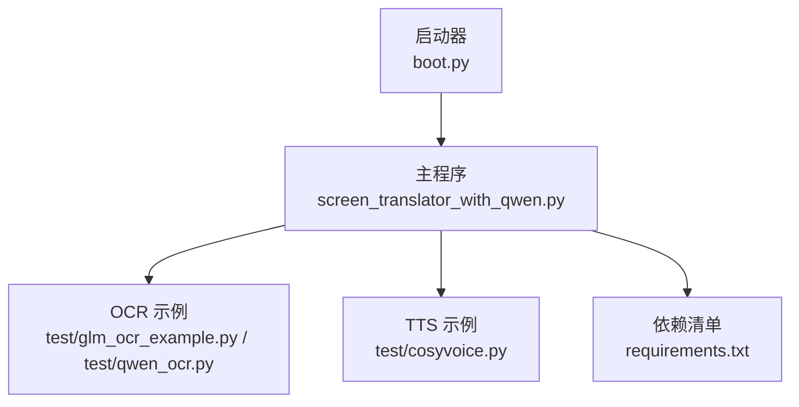
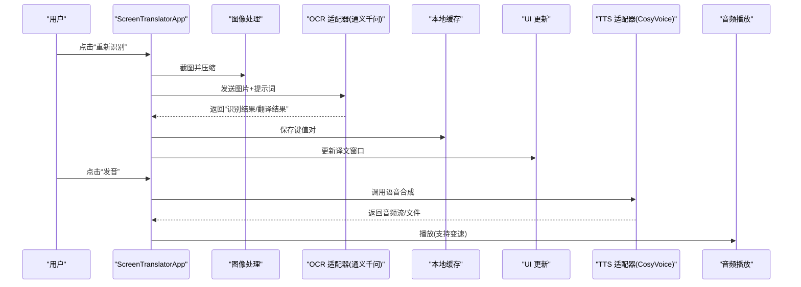
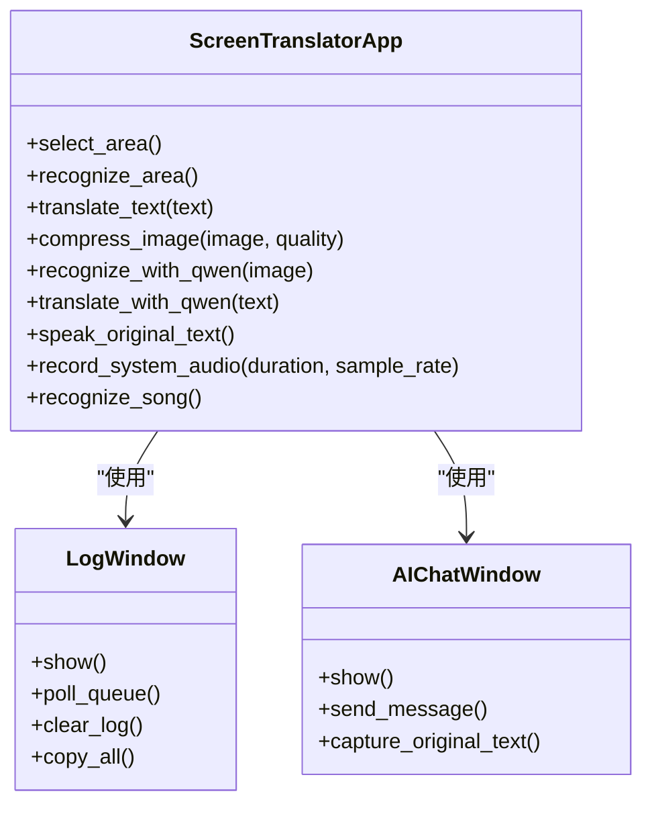
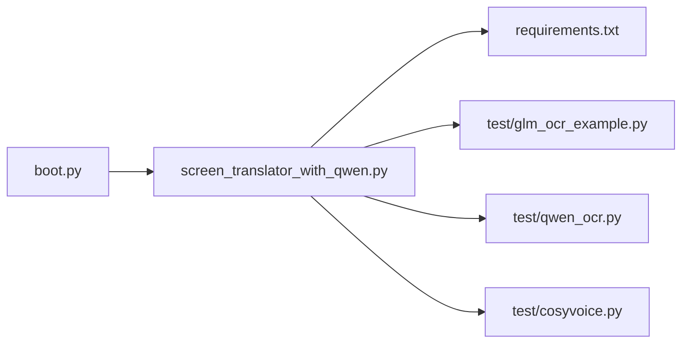

# 扩展开发指南

<cite>
**本文引用的文件**   
- [boot.py](file://boot.py)
- [screen_translator_with_qwen.py](file://screen_translator_with_qwen.py)
- [requirements.txt](file://requirements.txt)
- [glm_ocr_example.py](file://test/glm_ocr_example.py)
- [qwen_ocr.py](file://test/qwen_ocr.py)
- [cosyvoice.py](file://test/cosyvoice.py)
</cite>

## 目录
1. [简介](#简介)
2. [项目结构](#项目结构)
3. [核心组件](#核心组件)
4. [架构总览](#架构总览)
5. [详细组件分析](#详细组件分析)
6. [依赖关系分析](#依赖关系分析)
7. [性能与可靠性](#性能与可靠性)
8. [故障排查指南](#故障排查指南)
9. [结论](#结论)
10. [附录：扩展模板与规范](#附录扩展模板与规范)

## 简介
本指南面向希望为屏幕翻译工具添加新能力的开发者，重点覆盖以下目标：
- 如何新增 OCR 引擎支持（接口定义、实现要求、集成步骤）
- 翻译服务的可扩展性设计（多语言支持、API 适配器、错误处理）
- 第三方服务集成最佳实践（认证管理、请求重试、缓存策略、性能优化）
- 插件系统的设计原理（动态加载、配置管理、版本兼容性）
- 具体扩展示例（语音合成服务、AI 模型接入、自定义功能模块）
- 代码模板与开发规范（确保一致性与可维护性）

## 项目结构
仓库采用“单入口 + 测试样例”的轻量组织方式：
- 启动器 boot.py：负责虚拟环境校验/更新、自动发现并后台运行主程序
- 主程序 screen_translator_with_qwen.py：包含 UI、OCR/翻译流程、TTS 播放、听歌识曲等
- requirements.txt：声明运行时依赖
- test 目录：提供多种能力示例（GLM/Qwen OCR、CosyVoice TTS、全屏悬浮窗口等）

图表来源
- [boot.py:1-279](file://boot.py#L1-L279)
- [screen_translator_with_qwen.py:1-2417](file://screen_translator_with_qwen.py#L1-L2417)
- [requirements.txt:1-31](file://requirements.txt#L1-L31)

章节来源
- [boot.py:1-279](file://boot.py#L1-L279)
- [screen_translator_with_qwen.py:1-2417](file://screen_translator_with_qwen.py#L1-L2417)
- [requirements.txt:1-31](file://requirements.txt#L1-L31)

## 核心组件
- 启动器与运行期保障
  - 自动检测唯一 .py 作为目标程序
  - 虚拟环境有效性检查、增量更新与重建
  - 日志轮转与大小控制
- 主应用 ScreenTranslatorApp
  - 区域选择与截图、图像预处理
  - OCR 识别与翻译（当前默认使用通义千问）
  - 译文展示与拖动/缩放交互
  - 语音合成与播放（CosyVoice），支持变速
  - 全局快捷键、日志窗口、AI 对话窗口
  - 听歌识曲（Shazamio）与系统音频录制（soundcard/pyaudiowpatch/pyaudio）

章节来源
- [boot.py:1-279](file://boot.py#L1-L279)
- [screen_translator_with_qwen.py:474-1723](file://screen_translator_with_qwen.py#L474-L1723)

## 架构总览
整体数据流从“用户选择区域”开始，经过“截图与压缩”，进入“OCR+翻译”管线，结果写入缓存并显示；可选地触发“语音合成→播放”。

图表来源
- [screen_translator_with_qwen.py:926-1247](file://screen_translator_with_qwen.py#L926-L1247)
- [screen_translator_with_qwen.py:1442-1569](file://screen_translator_with_qwen.py#L1442-L1569)

## 详细组件分析

### 启动器与运行期保障（boot.py）
- 关键职责
  - 自动发现目标脚本并后台启动
  - 虚拟环境生命周期管理（创建、校验、增量更新、重建）
  - 日志文件大小控制与清理
- 扩展点建议
  - 将“目标脚本发现逻辑”抽象为可插拔策略，便于未来支持多入口
  - 将“依赖安装策略”封装为可替换后端（如 pip/poetry）

章节来源
- [boot.py:53-70](file://boot.py#L53-L70)
- [boot.py:105-166](file://boot.py#L105-L166)
- [boot.py:168-207](file://boot.py#L168-L207)
- [boot.py:209-253](file://boot.py#L209-L253)

### 主应用与 OCR/翻译管线（screen_translator_with_qwen.py）
- 区域选择与截图
  - 全屏半透明选择框、鼠标事件绑定、坐标计算
  - 创建无边框浮动窗口用于显示结果与控制按钮
- 图像预处理
  - 对比度增强、灰度化、JPEG 压缩，降低网络传输体积
- OCR 与翻译
  - 通过 OpenAI 兼容接口调用通义千问，统一输入格式（base64 图片 + 文本指令）
  - 解析结构化输出（识别结果/翻译结果），写入内存缓存
- 翻译读取
  - 根据原文匹配缓存中的翻译结果
- 语音合成与播放
  - 基于 DashScope CosyVoice 流式合成，落盘 WAV，pyaudio 播放，支持变速
- 听歌识曲
  - 三种系统音频录制方案（soundcard/pyaudiowpatch/pyaudio），失败时给出排障指引
  - 异步调用 Shazamio 进行识别

图表来源
- [screen_translator_with_qwen.py:474-1723](file://screen_translator_with_qwen.py#L474-L1723)
- [screen_translator_with_qwen.py:21-100](file://screen_translator_with_qwen.py#L21-L100)
- [screen_translator_with_qwen.py:101-300](file://screen_translator_with_qwen.py#L101-L300)

章节来源
- [screen_translator_with_qwen.py:926-1247](file://screen_translator_with_qwen.py#L926-L1247)
- [screen_translator_with_qwen.py:1098-1122](file://screen_translator_with_qwen.py#L1098-L1122)
- [screen_translator_with_qwen.py:1248-1266](file://screen_translator_with_qwen.py#L1248-L1266)
- [screen_translator_with_qwen.py:1442-1569](file://screen_translator_with_qwen.py#L1442-L1569)
- [screen_translator_with_qwen.py:1789-2399](file://screen_translator_with_qwen.py#L1789-L2399)

### OCR 引擎扩展（接口与实现）
- 现状
  - 当前默认使用通义千问（OpenAI 兼容接口）完成 OCR+翻译一体化
  - 旧版示例中可见 Tesseract 与 Ollama 的使用路径（位于测试目录）
- 推荐接口设计
  - 定义统一的 OCR 适配器接口：接收 PIL.Image，返回结构化文本（含原文与可选翻译）
  - 定义统一的翻译适配器接口：接收文本，返回目标语言文本
  - 工厂/注册表模式：按配置或运行时参数选择具体实现
- 实现要求
  - 异常分类与重试策略（网络、限流、鉴权失败等）
  - 输入尺寸与质量约束（分辨率、压缩率、超时）
  - 结果解析容错（不同厂商返回格式差异）
- 集成步骤
  - 在适配层新增实现类，注册到工厂
  - 在主流程中通过配置切换引擎
  - 补充单元测试与端到端用例

章节来源
- [screen_translator_with_qwen.py:1123-1247](file://screen_translator_with_qwen.py#L1123-L1247)
- [test/screen_translaor_1.0.py:418-632](file://test/screen_translaor_1.0.py#L418-L632)

### 翻译服务扩展（多语言与 API 适配器）
- 现状
  - 当前翻译结果由同一大模型在一次调用中产出，并通过缓存复用
- 扩展建议
  - 将“翻译”解耦为独立适配器，支持多语言目标与不同供应商
  - 增加语言映射与提示词模板库
  - 引入翻译缓存键策略（哈希原文+目标语言+模型名）

章节来源
- [screen_translator_with_qwen.py:1248-1266](file://screen_translator_with_qwen.py#L1248-L1266)

### 语音合成与播放（CosyVoice）
- 现状
  - 使用 DashScope CosyVoice 流式合成，落盘 WAV，pyaudio 播放，支持变速
- 扩展建议
  - 抽象 TTS 适配器接口（文本→音频流/文件），支持多供应商与多音色
  - 播放后端可插拔（pyaudio/系统播放器）
  - 缓存已合成音频，避免重复请求

章节来源
- [screen_translator_with_qwen.py:1442-1569](file://screen_translator_with_qwen.py#L1442-L1569)
- [test/cosyvoice.py:1-40](file://test/cosyvoice.py#L1-L40)

### 听歌识曲与系统音频录制
- 现状
  - 三套录音方案并行尝试，失败时输出详细排障信息
  - 异步调用 Shazamio 识别
- 扩展建议
  - 将录音策略抽象为可插拔后端（WASAPI/立体声混音/其他平台）
  - 增加音频质量评估与重试策略

章节来源
- [screen_translator_with_qwen.py:1789-2399](file://screen_translator_with_qwen.py#L1789-L2399)

## 依赖关系分析
- 启动器与主程序解耦：boot.py 仅负责环境与进程管理
- 主程序依赖外部 SDK：OpenAI 兼容客户端、DashScope TTS、PyAudio、Pillow、键盘监听等
- 测试样例独立于主程序，便于验证各能力

图表来源
- [boot.py:1-279](file://boot.py#L1-L279)
- [screen_translator_with_qwen.py:1-2417](file://screen_translator_with_qwen.py#L1-L2417)
- [requirements.txt:1-31](file://requirements.txt#L1-L31)
- [glm_ocr_example.py:1-33](file://test/glm_ocr_example.py#L1-L33)
- [qwen_ocr.py:1-30](file://test/qwen_ocr.py#L1-L30)
- [cosyvoice.py:1-40](file://test/cosyvoice.py#L1-L40)

章节来源
- [requirements.txt:1-31](file://requirements.txt#L1-L31)

## 性能与可靠性
- 图像压缩与预处理
  - 对比度增强、灰度化、JPEG 压缩，减少带宽与延迟
- 请求重试与退避
  - 针对 429 限流错误采用指数退避+随机抖动
- 缓存策略
  - 以图像前缀为键缓存识别与翻译结果，避免重复调用
- 并发与线程安全
  - 识别/翻译/播放均在新线程执行，避免阻塞 UI
- 资源清理
  - 退出时清理临时音频文件，防止磁盘占用

章节来源
- [screen_translator_with_qwen.py:1098-1122](file://screen_translator_with_qwen.py#L1098-L1122)
- [screen_translator_with_qwen.py:1215-1247](file://screen_translator_with_qwen.py#L1215-L1247)
- [screen_translator_with_qwen.py:1207-1213](file://screen_translator_with_qwen.py#L1207-L1213)
- [screen_translator_with_qwen.py:480-485](file://screen_translator_with_qwen.py#L480-L485)

## 故障排查指南
- 启动阶段
  - 虚拟环境无效或依赖不匹配：查看 boot.log，确认是否触发重建或增量更新
  - 目标脚本未找到：保持根目录仅保留一个主程序 .py
- OCR/翻译阶段
  - 401 鉴权失败：检查 key.txt 中的 API Key 是否正确
  - 413 请求体过大：缩小识别区域或降低图像质量
  - 429 限流：等待后重试，或降低频率
- 语音合成与播放
  - 无声音：检查 pyaudio 设备权限与默认输出设备
  - 合成失败：确认 DashScope API Key 与服务可用性
- 听歌识曲
  - 无法录制系统音频：优先安装 pyaudiowpatch；若使用蓝牙耳机，切换到内置扬声器或有线耳机；或在 Windows 启用“立体声混音”

章节来源
- [boot.py:168-207](file://boot.py#L168-L207)
- [screen_translator_with_qwen.py:1242-1247](file://screen_translator_with_qwen.py#L1242-L1247)
- [screen_translator_with_qwen.py:1789-1851](file://screen_translator_with_qwen.py#L1789-L1851)

## 结论
本项目提供了清晰的启动器与主程序边界，具备 OCR/翻译/TTS/听歌识曲等多能力。通过引入适配器与工厂模式，可将 OCR、翻译、TTS 等能力解耦为可插拔组件，配合完善的重试、缓存与日志机制，形成高可用、易扩展的系统。

## 附录：扩展模板与规范

### 新增 OCR 引擎（步骤与要点）
- 定义接口
  - 输入：PIL.Image
  - 输出：结构化对象（包含原文与可选翻译）
- 实现适配器
  - 处理鉴权、超时、重试、错误分类
  - 标准化返回格式
- 注册与选择
  - 在工厂中注册新实现
  - 通过配置项选择引擎
- 集成与测试
  - 在主流程中注入适配器
  - 编写端到端用例（含失败场景）

章节来源
- [screen_translator_with_qwen.py:1123-1247](file://screen_translator_with_qwen.py#L1123-L1247)

### 新增翻译服务（多语言与适配器）
- 定义翻译接口
  - 输入：源文本、目标语言
  - 输出：目标语言文本
- 实现适配器
  - 支持多供应商与多语言
  - 统一错误码与重试策略
- 缓存键策略
  - 结合原文哈希、目标语言、模型标识生成缓存键
- 集成
  - 在翻译流程中替换为适配器调用

章节来源
- [screen_translator_with_qwen.py:1248-1266](file://screen_translator_with_qwen.py#L1248-L1266)

### 新增语音合成服务（TTS）
- 定义 TTS 接口
  - 输入：文本、音色、采样率、格式
  - 输出：音频流或文件路径
- 实现适配器
  - 对接多家 TTS 服务
  - 支持流式与落盘两种模式
- 播放后端
  - 抽象播放接口，支持 pyaudio/系统播放器
- 缓存
  - 对相同输入进行音频缓存，避免重复请求

章节来源
- [screen_translator_with_qwen.py:1442-1569](file://screen_translator_with_qwen.py#L1442-L1569)
- [test/cosyvoice.py:1-40](file://test/cosyvoice.py#L1-L40)

### 集成其他 AI 模型（示例参考）
- GLM 视觉模型示例：见测试样例
- Qwen 视觉模型示例：见测试样例

章节来源
- [glm_ocr_example.py:1-33](file://test/glm_ocr_example.py#L1-L33)
- [qwen_ocr.py:1-30](file://test/qwen_ocr.py#L1-L30)

### 插件系统与动态加载（设计建议）
- 动态加载
  - 使用 importlib 扫描指定目录下的插件模块
  - 通过约定命名空间与元数据（版本号、能力标签）进行注册
- 配置管理
  - 集中化配置文件（JSON/YAML），区分环境（dev/test/prod）
  - 启动时校验必填字段与类型
- 版本兼容性
  - 插件声明最小/最大兼容版本
  - 启动时进行能力探测与降级策略

[本节为概念性设计说明，无需源码引用]

### 第三方服务集成最佳实践
- 认证管理
  - 统一从安全位置读取密钥（如环境变量或加密文件）
  - 禁止硬编码密钥
- 请求重试
  - 指数退避+随机抖动
  - 区分可重试与不可重试错误
- 缓存策略
  - 多级缓存（内存+磁盘）
  - 合理设置过期时间与失效策略
- 性能优化
  - 连接池、并发限制、超时控制
  - 图像/音频预处理与压缩

[本节为通用指导，无需源码引用]

### 代码模板与开发规范
- 命名与结构
  - 适配器类以 XxxAdapter 命名
  - 工厂类以 XxxFactory 命名
- 错误处理
  - 定义统一异常体系（认证、限流、超时、格式解析）
- 日志与可观测性
  - 关键路径埋点（耗时、状态码、错误码）
- 测试
  - 单元测试覆盖核心逻辑
  - 集成测试模拟第三方响应

[本节为通用规范，无需源码引用]