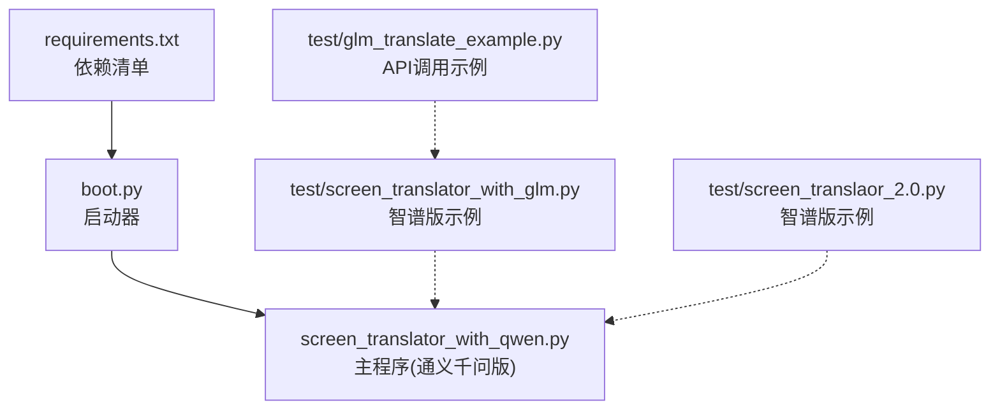
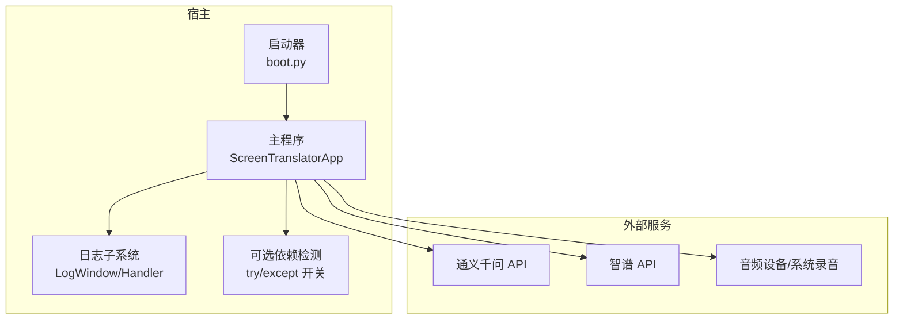
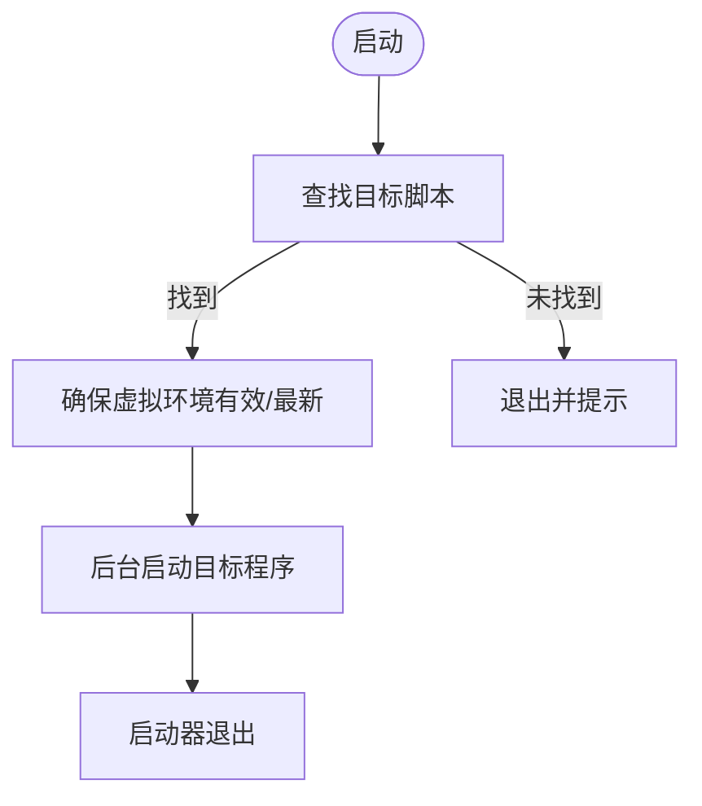
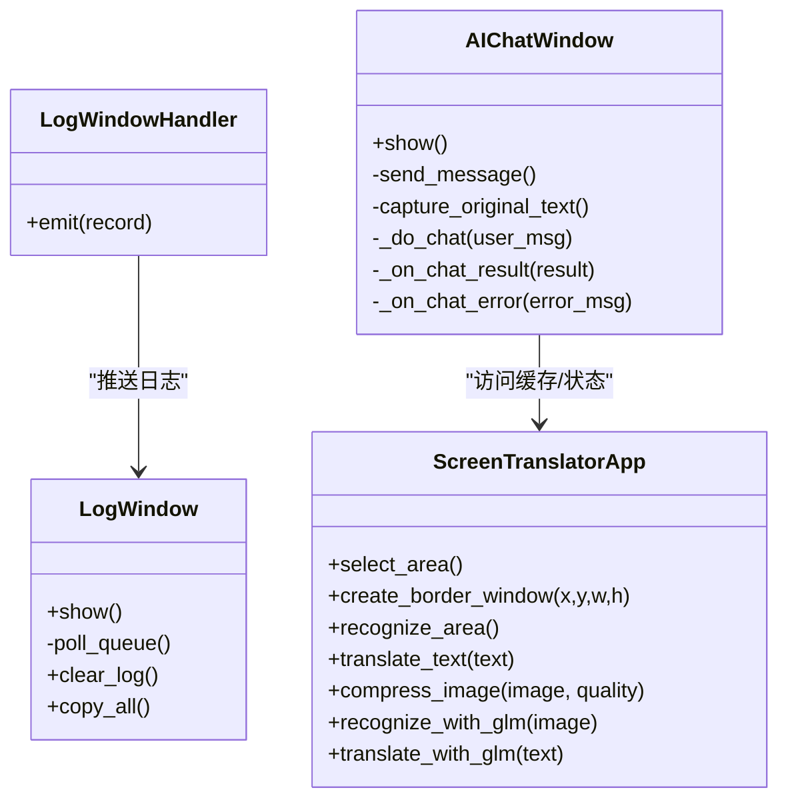
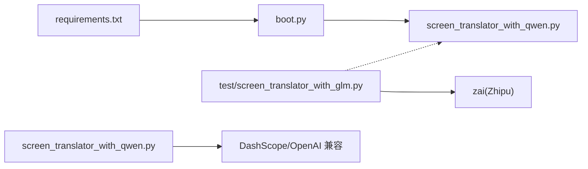
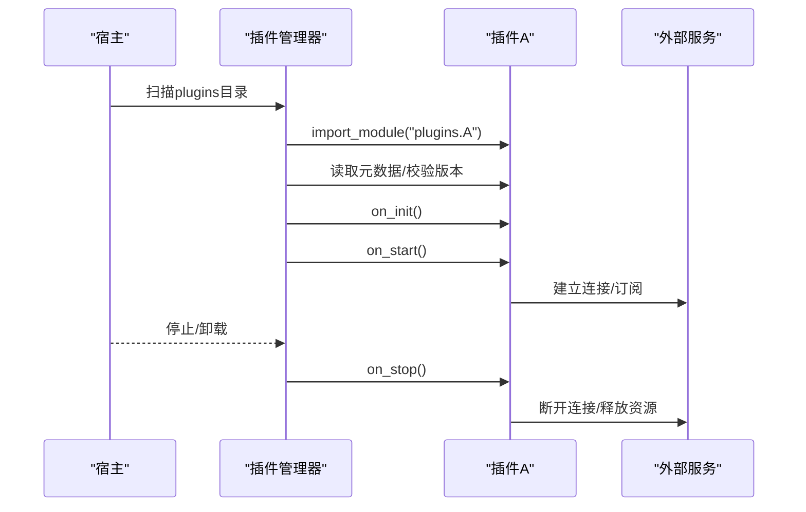

# 插件系统设计

<cite>
**本文引用的文件**   
- [boot.py](file://boot.py)
- [screen_translator_with_qwen.py](file://screen_translator_with_qwen.py)
- [requirements.txt](file://requirements.txt)
- [test/screen_translator_with_glm.py](file://test/screen_translator_with_glm.py)
- [test/screen_translaor_2.0.py](file://test/screen_translaor_2.0.py)
- [test/glm_translate_example.py](file://test/glm_translate_example.py)
</cite>

## 目录
1. [引言](#引言)
2. [项目结构](#项目结构)
3. [核心组件](#核心组件)
4. [架构总览](#架构总览)
5. [详细组件分析](#详细组件分析)
6. [依赖关系分析](#依赖关系分析)
7. [性能与可扩展性考量](#性能与可扩展性考量)
8. [故障排查指南](#故障排查指南)
9. [结论](#结论)
10. [附录：插件开发规范与示例](#附录插件开发规范与示例)

## 引言
本项目是一个屏幕翻译工具，具备截图识别、在线翻译、语音合成、AI对话等能力。当前仓库未提供显式的“插件框架”代码，但通过启动器引导、可选依赖检测、多实现变体（Qwen/智普）以及可插拔的测试用例，体现了“以模块为插件”的轻量扩展思路。本文将基于现有源码，系统化梳理其动态加载、配置管理、版本兼容、模块化架构、生命周期与错误隔离等机制，并给出面向未来的插件化改造建议与完整开发规范。

## 项目结构
- 根目录包含启动器 boot.py、主程序 screen_translator_with_qwen.py、依赖清单 requirements.txt，以及 test 目录下的多种功能演示与变体实现。
- 启动器负责自动发现目标脚本、维护虚拟环境、后台运行主程序；主程序采用 Tkinter GUI，集成 OCR、翻译、TTS、AI 对话等功能；test 目录提供了不同 AI 后端（通义千问、智谱）的实现样例。

图表来源
- [boot.py:256-279](file://boot.py#L256-L279)
- [screen_translator_with_qwen.py:474-500](file://screen_translator_with_qwen.py#L474-L500)
- [requirements.txt:1-31](file://requirements.txt#L1-L31)

章节来源
- [boot.py:1-279](file://boot.py#L1-L279)
- [screen_translator_with_qwen.py:1-800](file://screen_translator_with_qwen.py#L1-L800)
- [requirements.txt:1-31](file://requirements.txt#L1-L31)

## 核心组件
- 启动器（boot.py）
  - 自动扫描同目录下唯一 .py 作为目标程序
  - 虚拟环境校验、增量更新与重建
  - 后台无控制台窗口启动目标程序
- 主程序（screen_translator_with_qwen.py）
  - Tkinter 界面与事件循环
  - 日志子系统（队列+UI窗口）
  - 可选依赖检测（shazamio、soundcard、pyaudiowpatch 等）
  - 通义千问客户端初始化与对话窗口
  - 区域选择、OCR、翻译、语音播放等流程编排
- 依赖管理（requirements.txt）
  - 声明式依赖版本约束，配合启动器进行安装/升级
- 测试变体（test/*）
  - 智谱版示例展示另一套 AI 后端的接入方式
  - 悬浮层、透明标签、全屏覆盖等 UI 能力验证

章节来源
- [boot.py:53-70](file://boot.py#L53-L70)
- [boot.py:209-234](file://boot.py#L209-L234)
- [screen_translator_with_qwen.py:314-336](file://screen_translator_with_qwen.py#L314-L336)
- [screen_translator_with_qwen.py:339-360](file://screen_translator_with_qwen.py#L339-L360)
- [requirements.txt:1-31](file://requirements.txt#L1-L31)
- [test/screen_translator_with_glm.py:1-40](file://test/screen_translator_with_glm.py#L1-L40)

## 架构总览
从系统视角看，当前实现遵循“单进程 + 多模块”的架构，通过启动器统一入口，主程序内部按功能划分类与方法。若引入插件体系，可在以下层面扩展：
- 动态加载：在运行时根据配置或约定路径导入插件模块
- 配置管理：集中化的插件注册表、启动顺序、参数注入
- 版本兼容：插件元数据（名称、版本、最小宿主版本）与兼容性检查
- 依赖注入：将 OCR、翻译、TTS、音频采集等能力抽象为接口，由插件实现并通过容器注入
- 生命周期：统一的 init/start/stop 钩子，支持优雅关闭与资源释放
- 错误隔离：插件异常捕获、降级策略、隔离日志与监控

图表来源
- [boot.py:256-279](file://boot.py#L256-L279)
- [screen_translator_with_qwen.py:474-500](file://screen_translator_with_qwen.py#L474-L500)
- [screen_translator_with_qwen.py:314-336](file://screen_translator_with_qwen.py#L314-L336)

## 详细组件分析

### 启动器（boot.py）
- 目标脚本发现：扫描同级 .py，排除自身，要求唯一
- 虚拟环境管理：
  - 有效性校验：执行子进程检查 sys.prefix
  - 一致性校验：计算 requirements.txt 哈希，比较标记文件
  - 增量更新：pip install --upgrade，失败回退到重建
  - 清理与重试：失败时删除半成品 venv，带指数退避的重试
- 后台启动：Windows 使用 CREATE_NO_WINDOW，Linux/macOS 重定向输出并新建会话

图表来源
- [boot.py:53-70](file://boot.py#L53-L70)
- [boot.py:209-234](file://boot.py#L209-L234)
- [boot.py:256-279](file://boot.py#L256-L279)

章节来源
- [boot.py:1-279](file://boot.py#L1-L279)

### 主程序（screen_translator_with_qwen.py）
- 日志子系统
  - 自定义 Handler 将日志推入队列，LogWindow 轮询消费并渲染
- 可选依赖检测
  - 对 shazamio、soundcard/soundfile/numpy、pyaudiowpatch 使用 try/except 包裹，设置可用标志位，避免缺失导致崩溃
- AI 客户端初始化
  - 读取本地 key.txt，构造 OpenAI 兼容客户端（DashScope），失败则记录错误并保持空引用
- 界面与交互
  - 区域选择、翻译显示窗口、发音按钮、AI 对话窗口、全局快捷键等
- 线程模型
  - 长耗时任务（网络请求、音频处理）放入线程，回调通过 root.after 安全更新 UI

图表来源
- [screen_translator_with_qwen.py:21-33](file://screen_translator_with_qwen.py#L21-L33)
- [screen_translator_with_qwen.py:34-100](file://screen_translator_with_qwen.py#L34-L100)
- [screen_translator_with_qwen.py:101-300](file://screen_translator_with_qwen.py#L101-L300)
- [screen_translator_with_qwen.py:474-800](file://screen_translator_with_qwen.py#L474-L800)

章节来源
- [screen_translator_with_qwen.py:1-800](file://screen_translator_with_qwen.py#L1-L800)

### 测试变体（智谱版）
- 与 Qwen 版类似的结构，但使用 zai.ZhipuAiClient 作为后端
- 展示了同一应用在不同 AI 提供商间的切换方式，可作为“插件后端”的雏形

章节来源
- [test/screen_translator_with_glm.py:1-800](file://test/screen_translator_with_glm.py#L1-L800)
- [test/screen_translaor_2.0.py:1-800](file://test/screen_translaor_2.0.py#L1-L800)
- [test/glm_translate_example.py:1-16](file://test/glm_translate_example.py#L1-L16)

## 依赖关系分析
- 启动器与主程序解耦：通过命令行参数传递，不直接 import
- 主程序与外部服务：通过 SDK 客户端间接调用，存在可选依赖开关
- 测试变体与主程序：共享相似的业务流程，体现“同一接口、不同实现”的扩展点

图表来源
- [boot.py:256-279](file://boot.py#L256-L279)
- [requirements.txt:1-31](file://requirements.txt#L1-L31)
- [screen_translator_with_qwen.py:339-360](file://screen_translator_with_qwen.py#L339-L360)
- [test/screen_translator_with_glm.py:1-40](file://test/screen_translator_with_glm.py#L1-L40)

章节来源
- [boot.py:1-279](file://boot.py#L1-L279)
- [requirements.txt:1-31](file://requirements.txt#L1-L31)
- [screen_translator_with_qwen.py:1-800](file://screen_translator_with_qwen.py#L1-L800)
- [test/screen_translator_with_glm.py:1-800](file://test/screen_translator_with_glm.py#L1-L800)

## 性能与可扩展性考量
- 异步与并发
  - 当前使用多线程处理网络请求与音频播放，UI 更新通过 after 调度，避免阻塞主循环
  - 建议后续引入 asyncio 与 aiohttp 用于高并发 I/O，减少线程上下文切换开销
- 资源管理
  - 音频流、PyAudio 实例需显式关闭；文件临时产物应注册 atexit 清理
  - 图片压缩与灰度转换可减少网络传输体积
- 可扩展性
  - 将 OCR、翻译、TTS、音频采集抽象为接口，通过配置或环境变量选择实现
  - 引入插件注册表与生命周期钩子，支持热插拔与优雅重启

[本节为通用指导，无需具体文件来源]

## 故障排查指南
- 启动器相关
  - 找不到目标脚本：确认同级仅有一个非启动器的 .py
  - 虚拟环境无效/不一致：查看 boot.log，必要时手动删除 venv 重新创建
  - pip 安装失败：检查网络、镜像源、编译工具链；启动器会尝试重试与回退
- 主程序相关
  - 可选依赖缺失：对应功能不可用，查看警告日志；按需安装依赖
  - AI 客户端初始化失败：检查 key.txt 内容与权限；关注 401/429 等错误码
  - 音频播放失败：检查 PyAudio 与系统音频设备；注意独占模式冲突
- 日志定位
  - 使用内置日志窗口与文件日志，结合时间戳与模块名快速定位问题

章节来源
- [boot.py:40-70](file://boot.py#L40-L70)
- [boot.py:209-234](file://boot.py#L209-L234)
- [screen_translator_with_qwen.py:314-336](file://screen_translator_with_qwen.py#L314-L336)
- [screen_translator_with_qwen.py:339-360](file://screen_translator_with_qwen.py#L339-L360)

## 结论
当前仓库实现了“以模块为插件”的轻量扩展模式：通过启动器统一入口、可选依赖检测、多后端实现变体，达到一定程度的可插拔能力。若要构建更完善的插件系统，建议引入明确的插件接口、注册中心、生命周期管理与依赖注入容器，并完善版本兼容与错误隔离机制。

[本节为总结，无需具体文件来源]

## 附录：插件开发规范与示例

### 插件接口标准（建议）
- 元数据
  - name: 插件标识
  - version: 插件版本
  - requires_host_version: 最低宿主版本
- 生命周期
  - on_init(): 初始化资源（如连接池、缓存）
  - on_start(): 启动监听/定时任务
  - on_stop(): 优雅关闭，释放资源
- 能力契约
  - ocr(image) -> text
  - translate(text, target_lang) -> translated_text
  - tts(text, speed=1.0) -> audio_bytes_or_path
  - capture_audio(stop_event=None) -> audio_stream
- 配置项
  - 每个插件暴露 config_schema，宿主在启动前校验并注入

[本节为设计建议，无需具体文件来源]

### 动态加载方案（建议）
- 插件发现
  - 约定目录 plugins/，扫描 *.py 或包，读取 __plugin__.json 元数据
- 动态导入
  - 使用 importlib.import_module 加载模块，按命名空间注册到插件管理器
- 依赖解析与启动顺序
  - 基于 requires_host_version 与插件间依赖图进行拓扑排序
- 错误隔离
  - 插件加载与启动过程置于 try/except，失败不影响宿主与其他插件
  - 独立日志通道与指标上报

图表来源
- [boot.py:256-279](file://boot.py#L256-L279)
- [screen_translator_with_qwen.py:314-336](file://screen_translator_with_qwen.py#L314-L336)

### 配置管理与版本兼容性（建议）
- 配置文件
  - 集中式 YAML/JSON，定义全局与插件级配置
- 版本兼容
  - 宿主与插件均声明版本；启动时比对最小兼容版本
  - 提供迁移脚本与弃用告警
- 依赖注入
  - 使用简单容器将 OCR/翻译/TTS 等能力注入到插件与业务逻辑中

[本节为设计建议，无需具体文件来源]

### 插件开发示例（概念流程）
- 步骤
  - 在 plugins/ 下创建 my_plugin.py，实现上述接口
  - 编写 __plugin__.json 描述元数据与配置
  - 在宿主启动阶段加载并注册
  - 通过配置启用/禁用插件，指定启动顺序
- 参考实现位置（用于对照风格与结构）
  - 可选依赖检测与开关：[screen_translator_with_qwen.py:314-336](file://screen_translator_with_qwen.py#L314-L336)
  - AI 客户端初始化与错误处理：[screen_translator_with_qwen.py:339-360](file://screen_translator_with_qwen.py#L339-L360)
  - 智谱版示例（对比接口差异）：[test/screen_translator_with_glm.py:1-800](file://test/screen_translator_with_glm.py#L1-L800)

章节来源
- [screen_translator_with_qwen.py:314-360](file://screen_translator_with_qwen.py#L314-L360)
- [test/screen_translator_with_glm.py:1-800](file://test/screen_translator_with_glm.py#L1-L800)

### 插件测试与调试方法（建议）
- 单元测试
  - 针对插件接口契约编写断言，模拟外部服务响应
- 集成测试
  - 使用 mock 替换真实 API，验证端到端流程
- 调试技巧
  - 启用 DEBUG 级别日志，结合日志窗口与文件日志
  - 为插件提供独立的日志处理器与追踪 ID
- 回归与兼容性
  - 维护最小宿主版本矩阵，自动化验证插件在不同宿主版本的可用性

[本节为通用指导，无需具体文件来源]