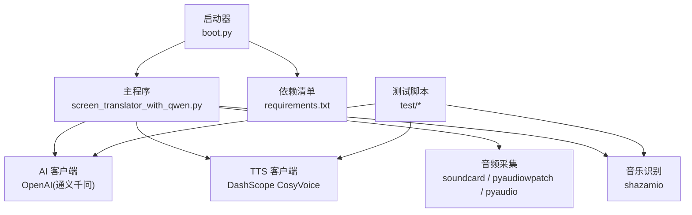
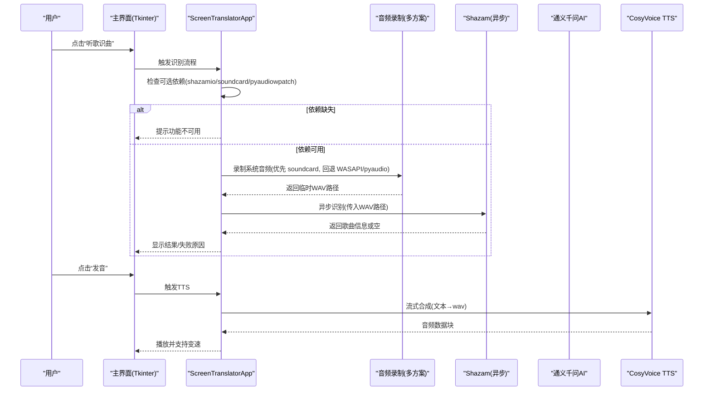
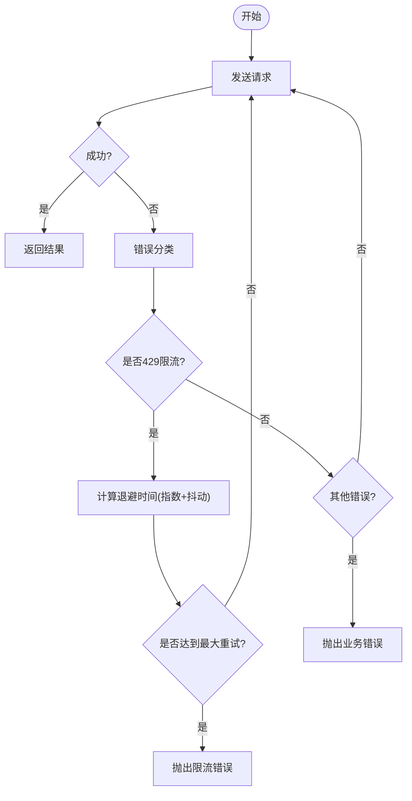
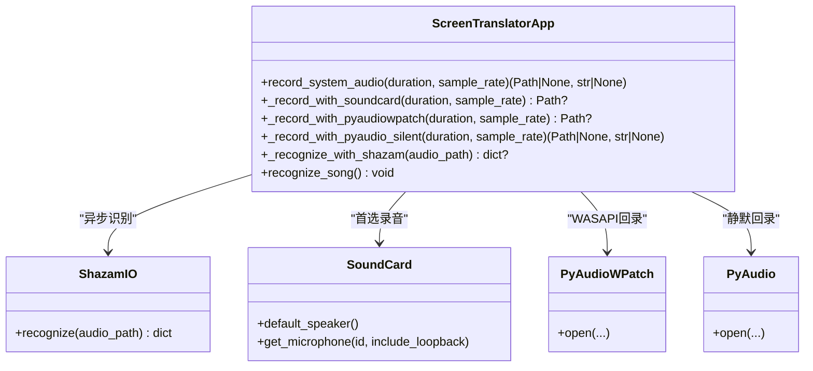
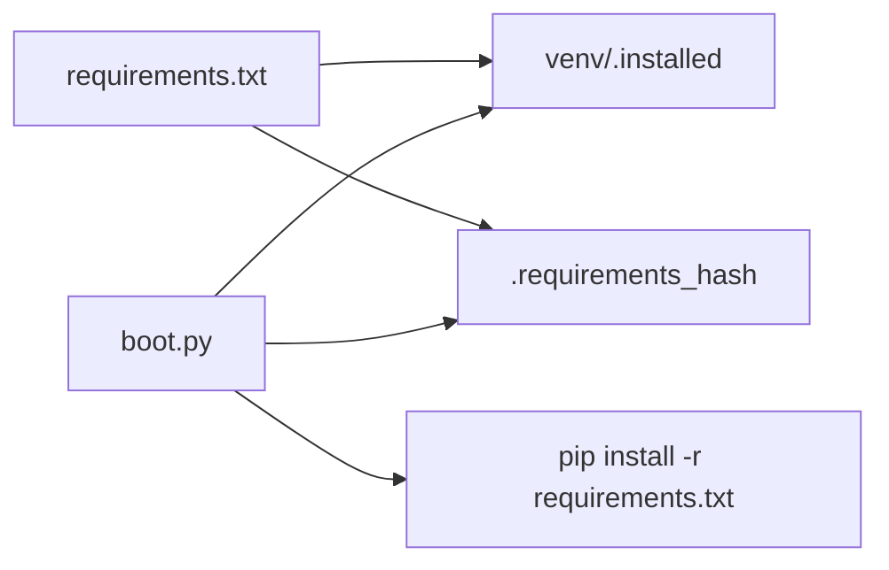

# 第三方服务集成

<cite>
**本文引用的文件**   
- [screen_translator_with_qwen.py](file://screen_translator_with_qwen.py)
- [boot.py](file://boot.py)
- [requirements.txt](file://requirements.txt)
- [test/shazam_test.py](file://test/shazam_test.py)
- [test/screen_translator_with_glm.py](file://test/screen_translator_with_glm.py)
- [test/cosyvoice.py](file://test/cosyvoice.py)
</cite>

## 目录
1. [简介](#简介)
2. [项目结构](#项目结构)
3. [核心组件](#核心组件)
4. [架构总览](#架构总览)
5. [详细组件分析](#详细组件分析)
6. [依赖分析](#依赖分析)
7. [性能考虑](#性能考虑)
8. [故障排查指南](#故障排查指南)
9. [结论](#结论)
10. [附录：新增第三方服务标准流程与示例](#附录新增第三方服务标准流程与示例)

## 简介
本指南面向在本项目中集成第三方服务的开发者，聚焦以下主题：
- 认证管理、请求重试、缓存策略与性能优化
- Shazam 音乐识别服务的架构设计（依赖检查、可选功能加载、错误处理）
- 新增第三方服务的标准流程（依赖管理、配置封装、异常处理）
- 具体集成示例（AI 模型服务、外部 API 客户端）
- 服务发现、版本兼容性与降级策略的实现方法

本项目已集成多个第三方能力：通义千问 AI（OCR/翻译）、阿里云 CosyVoice 语音合成、Shazam 听歌识曲。启动器 boot.py 负责虚拟环境管理与依赖安装；主程序 screen_translator_with_qwen.py 实现 UI 与第三方服务编排；测试脚本提供独立验证用例。

## 项目结构
- 启动器与依赖管理
  - boot.py：自动检测目标脚本、创建/校验/更新虚拟环境、带重试的 pip 安装、后台无控制台启动目标程序
  - requirements.txt：声明所有第三方库及最低版本
- 主应用
  - screen_translator_with_qwen.py：Tkinter GUI + 多路第三方服务集成（AI、TTS、音频录制、Shazam）
- 测试与示例
  - test/shazam_test.py：异步调用 shazamio 进行歌曲识别
  - test/screen_translator_with_glm.py：智普 GLM 视觉模型的 OCR/翻译示例（含重试与缓存）
  - test/cosyvoice.py：阿里云 TTS 流式合成示例

图表来源
- [boot.py:1-279](file://boot.py#L1-L279)
- [requirements.txt:1-31](file://requirements.txt#L1-L31)
- [screen_translator_with_qwen.py:314-360](file://screen_translator_with_qwen.py#L314-L360)
- [test/shazam_test.py:1-66](file://test/shazam_test.py#L1-L66)
- [test/cosyvoice.py:1-40](file://test/cosyvoice.py#L1-L40)

章节来源
- [boot.py:1-279](file://boot.py#L1-L279)
- [requirements.txt:1-31](file://requirements.txt#L1-L31)
- [screen_translator_with_qwen.py:314-360](file://screen_translator_with_qwen.py#L314-L360)

## 核心组件
- 启动器与依赖管理
  - 自动选择唯一 .py 作为目标程序
  - 校验 venv 有效性、增量更新或重建
  - pip install 带指数退避重试
  - Windows 下以无控制台方式启动目标程序
- 主应用与服务编排
  - 可选依赖检测与开关（如 shazamio、soundcard、pyaudiowpatch）
  - 统一日志输出到窗口与进程日志
  - 线程化 UI 与非阻塞 I/O
  - 本地缓存（OCR/翻译结果）
- 第三方服务
  - 通义千问 AI：OCR+翻译（OpenAI 兼容接口）
  - 阿里云 CosyVoice：流式语音合成
  - Shazam：系统音频录制 + 异步识别

章节来源
- [boot.py:105-225](file://boot.py#L105-L225)
- [screen_translator_with_qwen.py:314-360](file://screen_translator_with_qwen.py#L314-L360)
- [screen_translator_with_qwen.py:1442-1556](file://screen_translator_with_qwen.py#L1442-L1556)
- [screen_translator_with_qwen.py:1855-2306](file://screen_translator_with_qwen.py#L1855-L2306)

## 架构总览
下图展示从用户操作到第三方服务调用的端到端流程，包括可选依赖加载、错误处理与降级路径。

图表来源
- [screen_translator_with_qwen.py:314-360](file://screen_translator_with_qwen.py#L314-L360)
- [screen_translator_with_qwen.py:1855-2306](file://screen_translator_with_qwen.py#L1855-L2306)
- [screen_translator_with_qwen.py:1442-1556](file://screen_translator_with_qwen.py#L1442-L1556)
- [test/shazam_test.py:1-66](file://test/shazam_test.py#L1-L66)
- [test/cosyvoice.py:1-40](file://test/cosyvoice.py#L1-L40)

## 详细组件分析

### 认证管理
- API Key 读取与初始化
  - 从 key.txt 读取密钥，若缺失则记录错误并置客户端为 None
  - OpenAI 兼容客户端使用 DashScope base_url 初始化
- 安全建议
  - 避免硬编码密钥，使用环境变量或受保护的配置文件
  - 对敏感文件设置最小权限，并在退出时清理临时文件

章节来源
- [screen_translator_with_qwen.py:338-360](file://screen_translator_with_qwen.py#L338-L360)
- [test/screen_translator_with_glm.py:22-41](file://test/screen_translator_with_glm.py#L22-L41)

### 请求重试与退避
- 指数退避 + 随机抖动
  - 针对 429 Too Many Requests 等限流错误，采用指数退避与抖动
  - 最大重试次数可配置，超过上限抛出明确错误
- 错误分类与提示
  - 401 Unauthorized：提示检查密钥
  - 413 Payload Too Large：提示缩小输入区域
  - 其他错误：透传并记录日志

图表来源
- [screen_translator_with_qwen.py:1146-1247](file://screen_translator_with_qwen.py#L1146-L1247)
- [test/screen_translator_with_glm.py:643-739](file://test/screen_translator_with_glm.py#L643-L739)

章节来源
- [screen_translator_with_qwen.py:1146-1247](file://screen_translator_with_qwen.py#L1146-L1247)
- [test/screen_translator_with_glm.py:643-739](file://test/screen_translator_with_glm.py#L643-L739)

### 缓存策略
- 本地内存缓存
  - 将 OCR 原文与翻译结果按图像前缀键存入字典，避免重复网络请求
  - 在对话窗口中可从缓存回填原文内容
- 适用场景
  - 同一屏幕区域多次识别
  - 相同文本片段反复发音

章节来源
- [screen_translator_with_qwen.py:1207-1213](file://screen_translator_with_qwen.py#L1207-L1213)
- [screen_translator_with_qwen.py:198-222](file://screen_translator_with_qwen.py#L198-L222)
- [test/screen_translator_with_glm.py:699-705](file://test/screen_translator_with_glm.py#L699-L705)

### 性能优化
- 图像预处理与压缩
  - 增强对比度、灰度化、JPEG 压缩，降低上传体积
- 并发与异步
  - 音频录制与识别分离，识别使用异步事件循环
  - UI 线程与后台任务解耦，避免卡顿
- 音频播放优化
  - 支持变速播放，减少重复合成开销

章节来源
- [test/screen_translator_with_glm.py:595-618](file://test/screen_translator_with_glm.py#L595-L618)
- [screen_translator_with_qwen.py:2233-2306](file://screen_translator_with_qwen.py#L2233-L2306)
- [screen_translator_with_qwen.py:1442-1556](file://screen_translator_with_qwen.py#L1442-L1556)

### Shazam 音乐识别服务架构
- 可选依赖检测
  - 运行时 try/except 导入 shazamio、soundcard、pyaudiowpatch，未安装则禁用相关功能并记录警告
- 音频采集多方案
  - 首选 soundcard 环形回录；若检测到蓝牙耳机或失败，回退至 pyaudiowpatch（WASAPI 环回），再回退至 pyaudio 静默模式
  - 各方案均保存为临时 WAV 文件供识别
- 异步识别
  - 使用 asyncio 运行 shazamio.recognize，捕获异常并反馈 UI
- 错误处理与降级
  - 设备访问被拒绝、蓝牙不支持等情况给出明确提示
  - 识别结果为空时提示“未识别到歌曲”

图表来源
- [screen_translator_with_qwen.py:314-360](file://screen_translator_with_qwen.py#L314-L360)
- [screen_translator_with_qwen.py:1855-2306](file://screen_translator_with_qwen.py#L1855-L2306)
- [test/shazam_test.py:1-66](file://test/shazam_test.py#L1-L66)

章节来源
- [screen_translator_with_qwen.py:314-360](file://screen_translator_with_qwen.py#L314-L360)
- [screen_translator_with_qwen.py:1855-2306](file://screen_translator_with_qwen.py#L1855-L2306)
- [test/shazam_test.py:1-66](file://test/shazam_test.py#L1-L66)

### 语音合成（CosyVoice）
- 流式合成
  - 通过 DashScope SDK 流式获取音频块，合并后落盘
- 播放控制
  - 支持停止当前播放、切换速度（正常/0.75x）
- 资源清理
  - 程序启动与关闭时清理旧 wav 文件

章节来源
- [screen_translator_with_qwen.py:1442-1556](file://screen_translator_with_qwen.py#L1442-L1556)
- [test/cosyvoice.py:1-40](file://test/cosyvoice.py#L1-L40)

## 依赖分析
- 依赖清单
  - 截图、图像处理、音频播放、OpenAI/DashScope SDK、键盘监听、Shazam、系统音频录制、Windows WASAPI 补丁
- 启动器依赖管理
  - 校验 venv 有效性、哈希匹配 requirements.txt
  - 增量升级失败则重建 venv
  - pip install 带重试与超时保护

图表来源
- [boot.py:98-166](file://boot.py#L98-L166)
- [requirements.txt:1-31](file://requirements.txt#L1-L31)

章节来源
- [boot.py:98-166](file://boot.py#L98-L166)
- [requirements.txt:1-31](file://requirements.txt#L1-L31)

## 性能考虑
- 网络层
  - 合理设置重试次数与退避策略，避免雪崩
  - 对大图片进行压缩与格式转换，减少带宽占用
- 本地层
  - 使用内存缓存命中高频请求
  - 音频流式合成与分块播放，降低峰值内存
- 系统层
  - 根据设备能力选择最优录音方案，避免频繁失败重试
  - 在 UI 线程外执行耗时任务，保持交互流畅

[本节为通用指导，不直接分析具体文件]

## 故障排查指南
- 常见问题定位
  - 401/Unauthorized：检查 key.txt 中的 API 密钥是否正确且未过期
  - 429/Too Many Requests：等待退避后重试，或降低请求频率
  - 413/Payload Too Large：缩小识别区域或降低图片质量
  - 音频录制失败：确认默认扬声器/回录设备可用，蓝牙耳机可能不支持 ringback
- 日志与调试
  - 查看应用内日志窗口与 boot.log
  - 使用测试脚本单独验证第三方能力（如 test/shazam_test.py、test/cosyvoice.py）

章节来源
- [screen_translator_with_qwen.py:1215-1247](file://screen_translator_with_qwen.py#L1215-L1247)
- [test/screen_translator_with_glm.py:707-739](file://test/screen_translator_with_glm.py#L707-L739)
- [boot.py:27-36](file://boot.py#L27-L36)

## 结论
本项目在第三方服务集成方面形成了较为完善的实践范式：通过启动器统一管理依赖与环境，在主程序中采用可选依赖加载、指数退避重试、本地缓存与多方案降级，实现了高可用的用户体验。后续新增服务可遵循本文档的流程与模式快速落地。

[本节为总结性内容，不直接分析具体文件]

## 附录：新增第三方服务标准流程与示例

### 标准流程
- 依赖管理
  - 在 requirements.txt 添加新依赖与最低版本
  - 启动器会自动检测并安装/更新
- 可选功能加载
  - 使用 try/except 导入模块，设置可用性标志位
  - 在 UI 上根据标志位启用/禁用相关入口
- 配置封装
  - 集中读取密钥与配置项（如 key.txt 或环境变量）
  - 初始化客户端时捕获异常并记录日志
- 请求重试与错误处理
  - 实现指数退避 + 抖动，区分限流、鉴权、负载过大等错误
  - 对用户可见的错误进行友好提示
- 缓存与性能
  - 对稳定结果做本地缓存，减少重复请求
  - 对大对象进行压缩/分块传输
- 服务发现与版本兼容
  - 在运行时探测可用能力（如设备、SDK 版本）
  - 提供降级路径（如不同录音方案、不同模型）
- 测试与回归
  - 编写独立测试脚本验证关键路径
  - 覆盖成功、限流、鉴权失败、设备不可用等分支

### 示例一：新增一个 AI 模型服务（以 Zhipu GLM 为例）
- 依赖与配置
  - 在 requirements.txt 增加 zai 等依赖
  - 从 key.txt 读取密钥并初始化 ZhipuAiClient
- 可选加载
  - 在模块顶部 try/except 导入，设置 ZHIPU_AVAILABLE 标志
- 重试与错误
  - 参考现有 GLM 示例中的重试逻辑与错误分类
- 缓存
  - 复用已有的 ocr_cache/translation_cache 机制
- 测试
  - 使用 test/screen_translator_with_glm.py 验证端到端流程

章节来源
- [test/screen_translator_with_glm.py:22-41](file://test/screen_translator_with_glm.py#L22-L41)
- [test/screen_translator_with_glm.py:595-739](file://test/screen_translator_with_glm.py#L595-L739)

### 示例二：新增外部 API 客户端（以 Shazam 为例）
- 依赖与可选加载
  - 在 requirements.txt 添加 shazamio、audioop-lts
  - 使用 try/except 导入并设置 SHAZAMIO_AVAILABLE
- 音频采集
  - 优先 soundcard，回退 pyaudiowpatch，再回退 pyaudio
- 异步识别
  - 使用 asyncio 运行识别函数，捕获异常并反馈 UI
- 错误处理
  - 区分设备访问失败、蓝牙不支持、未识别到歌曲等情形
- 测试
  - 使用 test/shazam_test.py 进行离线验证

章节来源
- [screen_translator_with_qwen.py:314-360](file://screen_translator_with_qwen.py#L314-L360)
- [screen_translator_with_qwen.py:1855-2306](file://screen_translator_with_qwen.py#L1855-L2306)
- [test/shazam_test.py:1-66](file://test/shazam_test.py#L1-L66)

### 服务发现、版本兼容与降级策略
- 服务发现
  - 运行时探测可用模块与设备（如默认扬声器、WASAPI 环回）
- 版本兼容
  - 在 requirements.txt 指定最低版本，启动器确保一致
  - 在代码中对关键 API 行为做兼容性判断
- 降级策略
  - 录音方案多级回退
  - 当某服务不可用时，UI 提示并禁用对应功能

章节来源
- [screen_translator_with_qwen.py:1855-2306](file://screen_translator_with_qwen.py#L1855-L2306)
- [boot.py:105-225](file://boot.py#L105-L225)