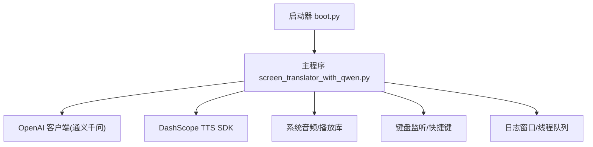
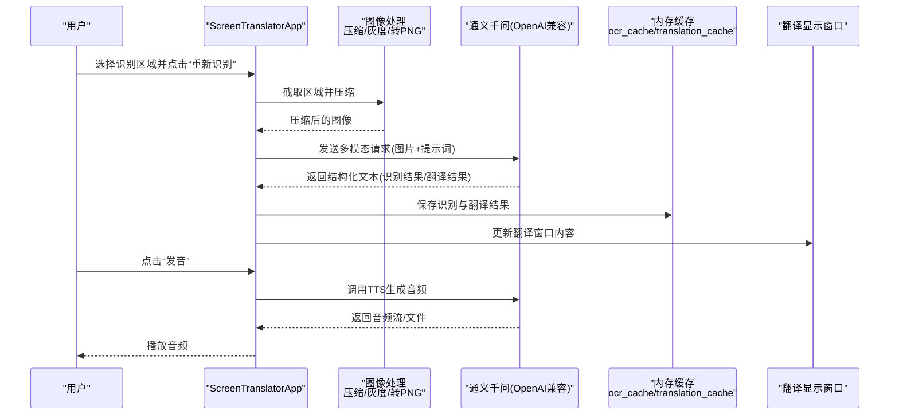
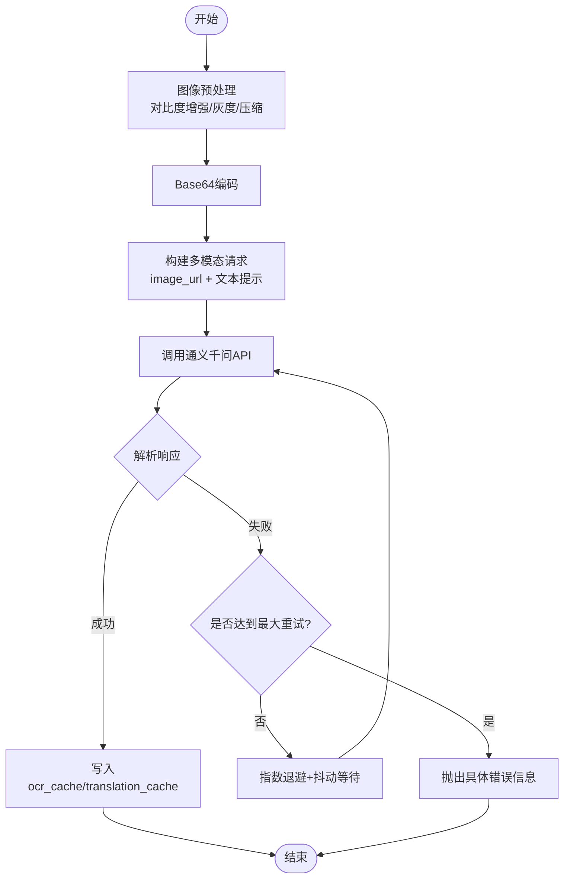
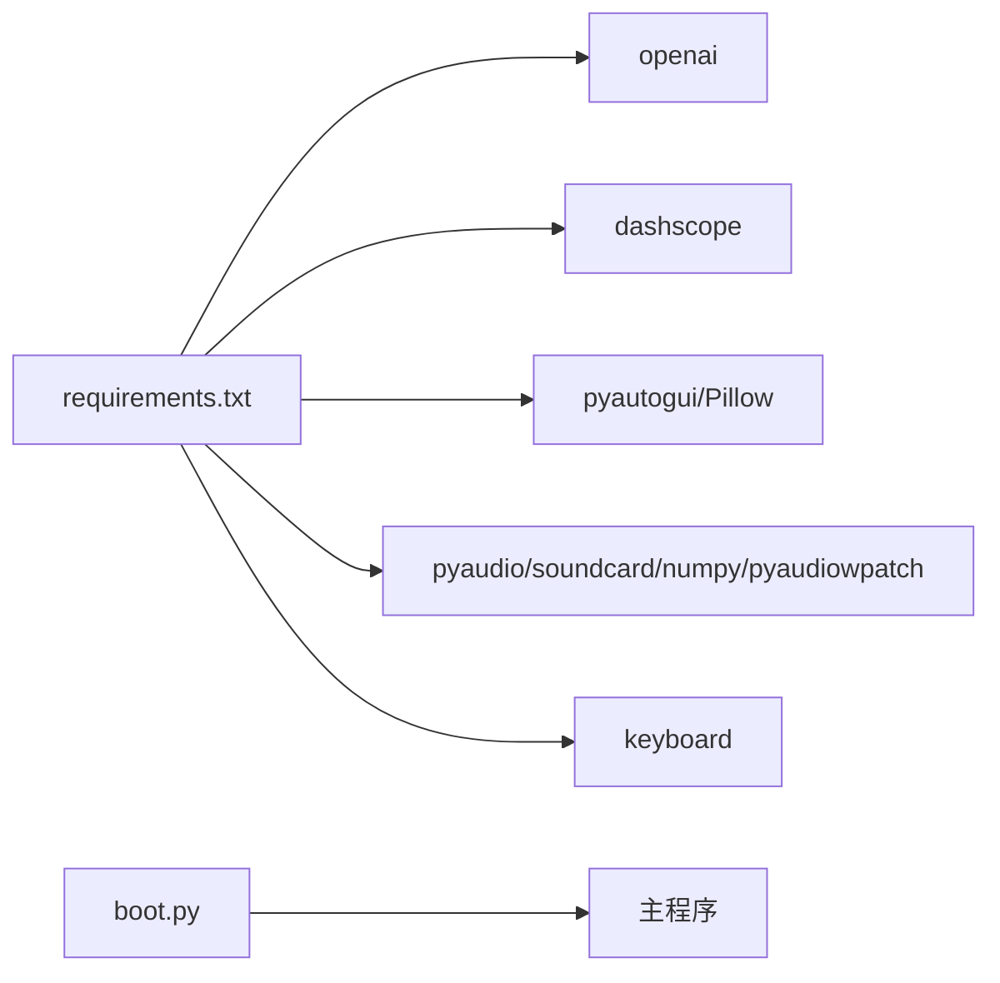
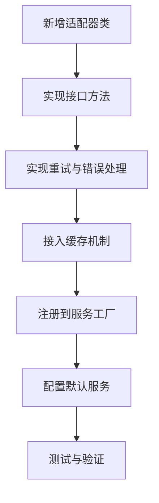

# 翻译服务扩展

<cite>
**本文引用的文件**   
- [screen_translator_with_qwen.py](file://screen_translator_with_qwen.py)
- [boot.py](file://boot.py)
- [requirements.txt](file://requirements.txt)
</cite>

## 目录
1. [简介](#简介)
2. [项目结构](#项目结构)
3. [核心组件](#核心组件)
4. [架构总览](#架构总览)
5. [详细组件分析](#详细组件分析)
6. [依赖关系分析](#依赖关系分析)
7. [性能与可扩展性建议](#性能与可扩展性建议)
8. [故障排查指南](#故障排查指南)
9. [结论](#结论)
10. [附录：添加新翻译服务的步骤与模板](#附录添加新翻译服务的步骤与模板)

## 简介
本指南面向希望在现有屏幕翻译工具基础上扩展“翻译服务”的开发者。文档聚焦于以下目标：
- 解释当前通义千问翻译服务的实现原理（文本预处理、API请求构建、响应解析）
- 说明多语言支持架构、API适配器设计与错误处理机制
- 提供添加新翻译服务的完整步骤，包括认证管理、重试策略与缓存机制
- 给出可复用的代码模板路径，展示如何实现自定义翻译服务类，并统一结果格式与本地化处理

## 项目结构
仓库包含一个主程序与启动器脚本，以及依赖清单：
- 主程序 screen_translator_with_qwen.py：实现截图识别、OCR+翻译、UI交互、语音合成等
- 启动器 boot.py：自动检测目标脚本、维护虚拟环境、后台运行主程序
- requirements.txt：列出第三方库依赖

图表来源
- [boot.py:256-279](file://boot.py#L256-L279)
- [screen_translator_with_qwen.py:338-360](file://screen_translator_with_qwen.py#L338-L360)
- [screen_translator_with_qwen.py:1509-1556](file://screen_translator_with_qwen.py#L1509-L1556)

章节来源
- [boot.py:1-279](file://boot.py#L1-L279)
- [requirements.txt:1-31](file://requirements.txt#L1-L31)

## 核心组件
- 应用主类 ScreenTranslatorApp：封装界面、区域选择、识别流程、翻译流程、语音合成、全局快捷键、听歌识曲等功能
- 通义千问 OCR+翻译：recognize_with_qwen 方法负责图像压缩、Base64编码、构造多模态消息、调用模型、解析结构化输出并写入缓存
- 翻译入口 translate_text：从缓存读取或触发翻译；translate_with_qwen 目前基于缓存返回
- 错误处理与重试：在 recognize_with_qwen 中实现指数退避+抖动重试，区分 401/413/429 等错误码
- 缓存机制：ocr_cache 与 translation_cache 以图像前缀为键保存识别与翻译结果
- 认证管理：从 key.txt 读取 API Key，初始化 OpenAI 兼容客户端与 DashScope TTS

章节来源
- [screen_translator_with_qwen.py:474-634](file://screen_translator_with_qwen.py#L474-L634)
- [screen_translator_with_qwen.py:1123-1248](file://screen_translator_with_qwen.py#L1123-L1248)
- [screen_translator_with_qwen.py:1249-1266](file://screen_translator_with_qwen.py#L1249-L1266)
- [screen_translator_with_qwen.py:338-360](file://screen_translator_with_qwen.py#L338-L360)

## 架构总览
下图展示了从用户操作到翻译结果展示的端到端流程，以及关键的外部集成点。

图表来源
- [screen_translator_with_qwen.py:927-1021](file://screen_translator_with_qwen.py#L927-L1021)
- [screen_translator_with_qwen.py:1123-1248](file://screen_translator_with_qwen.py#L1123-L1248)
- [screen_translator_with_qwen.py:1509-1556](file://screen_translator_with_qwen.py#L1509-L1556)

## 详细组件分析

### 通义千问翻译服务实现原理
- 文本/图像预处理
  - 截图后先增强对比度、转灰度、再按质量压缩，最后保存为 PNG 进行 Base64 编码
  - 参考路径：[compress_image:1098-1122](file://screen_translator_with_qwen.py#L1098-L1122)
- API请求构建
  - 使用 OpenAI 兼容接口，model 指定为 qwen3.6-flash
  - messages 中包含 image_url 与 text 两部分，text 明确指示返回格式为“识别结果：... / 翻译结果：...”
  - 参考路径：[recognize_with_qwen 请求段:1148-1171](file://screen_translator_with_qwen.py#L1148-L1171)
- 响应解析
  - 按行扫描，定位“识别结果：”和“翻译结果：”，提取冒号后内容并拼接多行
  - 将识别与翻译结果分别存入 ocr_cache 与 translation_cache，键为图像前缀
  - 参考路径：[响应解析与缓存:1180-1213](file://screen_translator_with_qwen.py#L1180-L1213)
- 错误处理与重试
  - 最大重试次数与基础延迟定义，针对 429 采用指数退避+随机抖动
  - 对 401/413 等错误直接抛出友好异常
  - 参考路径：[重试与错误分支:1215-1248](file://screen_translator_with_qwen.py#L1215-L1248)
- 翻译入口
  - translate_text 负责线程调度与UI状态更新，translate_with_qwen 当前从缓存读取翻译结果
  - 参考路径：[translate_text:1022-1097](file://screen_translator_with_qwen.py#L1022-L1097)、[translate_with_qwen:1249-1266](file://screen_translator_with_qwen.py#L1249-L1266)

图表来源
- [screen_translator_with_qwen.py:1098-1122](file://screen_translator_with_qwen.py#L1098-L1122)
- [screen_translator_with_qwen.py:1148-1171](file://screen_translator_with_qwen.py#L1148-L1171)
- [screen_translator_with_qwen.py:1180-1213](file://screen_translator_with_qwen.py#L1180-L1213)
- [screen_translator_with_qwen.py:1215-1248](file://screen_translator_with_qwen.py#L1215-L1248)

章节来源
- [screen_translator_with_qwen.py:1098-1122](file://screen_translator_with_qwen.py#L1098-L1122)
- [screen_translator_with_qwen.py:1148-1171](file://screen_translator_with_qwen.py#L1148-L1171)
- [screen_translator_with_qwen.py:1180-1213](file://screen_translator_with_qwen.py#L1180-L1213)
- [screen_translator_with_qwen.py:1215-1248](file://screen_translator_with_qwen.py#L1215-L1248)
- [screen_translator_with_qwen.py:1022-1097](file://screen_translator_with_qwen.py#L1022-L1097)
- [screen_translator_with_qwen.py:1249-1266](file://screen_translator_with_qwen.py#L1249-L1266)

### 认证管理与配置
- 认证来源：从 key.txt 读取 API Key
- 初始化 OpenAI 兼容客户端，base_url 指向阿里云 DashScope 兼容模式
- 同时初始化 DashScope TTS 所需参数（api_key）
- 参考路径：[read_api_key 与客户端初始化:338-360](file://screen_translator_with_qwen.py#L338-L360)、[TTS 调用处:1509-1556](file://screen_translator_with_qwen.py#L1509-L1556)

章节来源
- [screen_translator_with_qwen.py:338-360](file://screen_translator_with_qwen.py#L338-L360)
- [screen_translator_with_qwen.py:1509-1556](file://screen_translator_with_qwen.py#L1509-L1556)

### 缓存机制
- 数据结构：ocr_cache 与 translation_cache 两个字典
- 键策略：使用图像 Base64 的前若干字符作为缓存键
- 生命周期：进程内有效，关闭即释放
- 参考路径：[缓存写入与读取:1207-1213](file://screen_translator_with_qwen.py#L1207-L1213)、[translate_with_qwen 缓存读取:1249-1266](file://screen_translator_with_qwen.py#L1249-L1266)

章节来源
- [screen_translator_with_qwen.py:1207-1213](file://screen_translator_with_qwen.py#L1207-L1213)
- [screen_translator_with_qwen.py:1249-1266](file://screen_translator_with_qwen.py#L1249-L1266)

### 错误处理机制
- 分类处理：
  - 401/Unauthorized：密钥无效或过期
  - 413/Payload Too Large：请求体过大，需缩小识别区域
  - 429/Too Many Requests：频率限制，指数退避+抖动重试
- 中止控制：通过 ai_interaction_active 与 translating 标志位中断长耗时任务
- 参考路径：[错误分支与中止检查:1215-1248](file://screen_translator_with_qwen.py#L1215-L1248)、[中止逻辑:1704-1723](file://screen_translator_with_qwen.py#L1704-L1723)

章节来源
- [screen_translator_with_qwen.py:1215-1248](file://screen_translator_with_qwen.py#L1215-L1248)
- [screen_translator_with_qwen.py:1704-1723](file://screen_translator_with_qwen.py#L1704-L1723)

## 依赖关系分析
- 外部依赖
  - openai：用于通义千问兼容接口
  - dashscope：用于语音合成
  - pyautogui、Pillow：截图与图像处理
  - pyaudio、soundcard、numpy、pyaudiowpatch：音频录制与播放
  - keyboard：全局快捷键
- 启动器 boot.py 负责虚拟环境校验、依赖安装与后台启动

图表来源
- [requirements.txt:1-31](file://requirements.txt#L1-L31)
- [boot.py:256-279](file://boot.py#L256-L279)

章节来源
- [requirements.txt:1-31](file://requirements.txt#L1-L31)
- [boot.py:1-279](file://boot.py#L1-L279)

## 性能与可扩展性建议
- 并发与线程
  - 当前识别与翻译均在新线程执行，避免阻塞UI；建议在新增翻译服务时保持相同模式
- 重试与退避
  - 已实现指数退避+抖动，建议抽象为通用重试装饰器或中间件，便于复用
- 缓存优化
  - 当前为进程内字典缓存，可按需引入 LRU 或磁盘持久化，避免大对象占用过多内存
- 资源清理
  - 注意临时文件与音频文件的及时清理，避免磁盘增长
- 国际化与本地化
  - 建议将用户可见字符串抽离为资源文件，按语言切换

[本节为通用指导，不直接分析具体文件]

## 故障排查指南
- 常见问题
  - 未找到 key.txt 或密钥无效：检查文件路径与权限，确认 base_url 与模型名正确
  - 请求体过大：缩小识别区域或降低图像质量
  - 频率限制：等待一段时间后再试，观察日志中的退避时间
  - 无法录音：根据平台尝试不同方案（WASAPI 环回、立体声混音），参考程序输出的帮助信息
- 定位手段
  - 查看日志窗口与 boot.log，关注错误堆栈与重试计数
  - 检查网络连通性与代理设置

章节来源
- [screen_translator_with_qwen.py:1215-1248](file://screen_translator_with_qwen.py#L1215-L1248)
- [boot.py:1-279](file://boot.py#L1-L279)

## 结论
当前通义千问翻译服务实现了完整的“截图→预处理→请求→解析→缓存→展示→语音”链路，具备较好的健壮性与用户体验。通过抽象出统一的翻译服务接口、标准化结果格式与本地化资源，可以方便地接入更多翻译提供商，并保持整体架构的一致性与可维护性。

[本节为总结，不直接分析具体文件]

## 附录：添加新翻译服务的步骤与模板

### 设计目标
- 多语言支持架构：通过配置驱动的语言映射表，统一输入/输出语言
- API适配器：每个翻译提供商实现同一接口，屏蔽差异
- 错误处理：统一的重试与错误分类
- 缓存机制：复用现有缓存策略，减少重复请求
- 结果标准化：统一返回结构，便于前端展示与本地化

### 步骤概览
1. 定义翻译服务接口
   - 方法签名：translate(text, src_lang, tgt_lang) -> TranslationResult
   - 返回结构：包含 translated_text、source_text、lang_pair、metadata
2. 实现适配器
   - 继承接口，实现请求构建、重试、解析
   - 示例参考路径：
     - [通义千问请求构建与解析:1148-1213](file://screen_translator_with_qwen.py#L1148-L1213)
     - [重试与错误处理:1215-1248](file://screen_translator_with_qwen.py#L1215-L1248)
3. 注册与选择
   - 在配置中声明可用服务列表与默认服务
   - 根据用户选择动态加载对应适配器
4. 认证管理
   - 从配置文件或环境变量读取各提供商密钥
   - 参考路径：[读取key.txt与初始化客户端:338-360](file://screen_translator_with_qwen.py#L338-L360)
5. 重试策略
   - 抽象重试函数，支持指数退避与抖动
   - 参考路径：[429特殊处理与退避:1224-1234](file://screen_translator_with_qwen.py#L1224-L1234)
6. 缓存机制
   - 复用 ocr_cache/translation_cache，或扩展为通用文本缓存
   - 参考路径：[缓存写入与读取:1207-1213](file://screen_translator_with_qwen.py#L1207-L1213)
7. 结果标准化与本地化
   - 统一返回结构，前端按字段渲染
   - 将用户可见文案抽离为资源文件，按语言切换

### 代码模板（路径引用）
- 接口定义位置：建议在独立模块中新增接口文件，例如 adapters/base.py（概念性文件，不在当前仓库中）
- 适配器实现参考：
  - [通义千问适配器实现片段:1123-1248](file://screen_translator_with_qwen.py#L1123-L1248)
- 重试策略参考：
  - [指数退避+抖动实现:1224-1234](file://screen_translator_with_qwen.py#L1224-L1234)
- 缓存读写参考：
  - [缓存写入:1207-1213](file://screen_translator_with_qwen.py#L1207-L1213)
  - [缓存读取:1249-1266](file://screen_translator_with_qwen.py#L1249-L1266)
- 认证管理参考：
  - [读取API密钥与初始化:338-360](file://screen_translator_with_qwen.py#L338-L360)

### 流程图：新增翻译服务

[此图为概念性流程，不直接映射具体源码文件]

### 注意事项
- 线程安全：确保缓存与状态变量在多线程环境下安全访问
- 资源清理：及时释放临时文件与音频数据
- 日志记录：为每次请求与错误记录足够上下文，便于排障
- 兼容性：适配不同提供商的模型名称、参数与返回结构

[本节为通用指导，不直接分析具体文件]