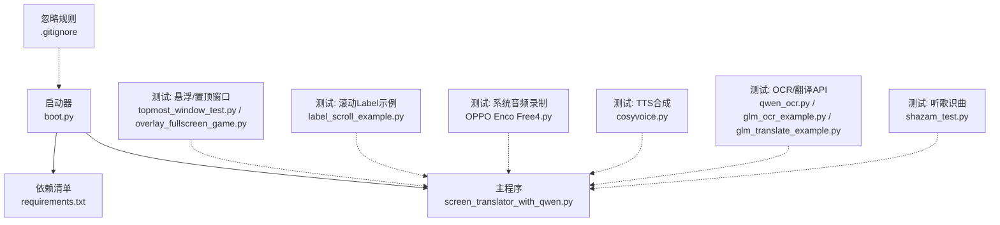
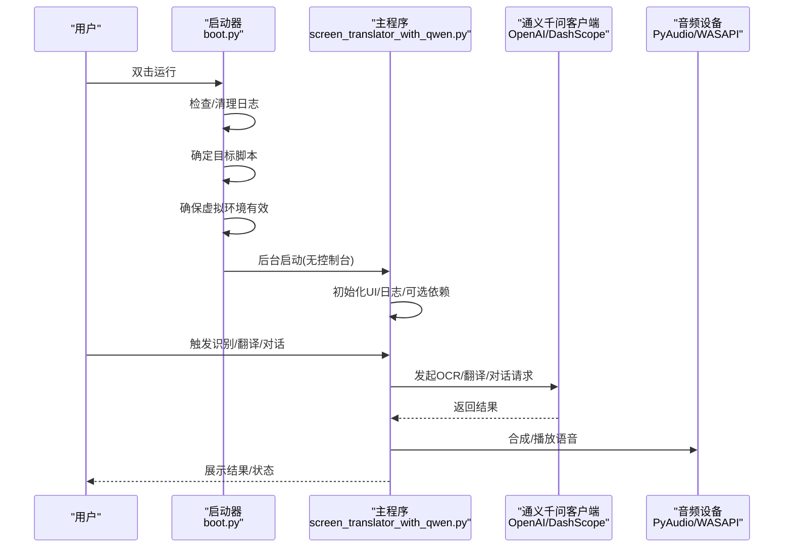

# 测试与调试

<cite>
**本文引用的文件**   
- [boot.py](file://boot.py)
- [screen_translator_with_qwen.py](file://screen_translator_with_qwen.py)
- [requirements.txt](file://requirements.txt)
- [.gitignore](file://.gitignore)
- [test/OPPO Enco Free4.py](file://test/OPPO%20Enco%20Free4.py)
- [test/cosyvoice.py](file://test/cosyvoice.py)
- [test/glm_ocr_example.py](file://test/glm_ocr_example.py)
- [test/glm_translate_example.py](file://test/glm_translate_example.py)
- [test/label_scroll_example.py](file://test/label_scroll_example.py)
- [test/label_transparent.py](file://test/label_transparent.py)
- [test/overlay_fullscreen_game.py](file://test/overlay_fullscreen_game.py)
- [test/qwen_ocr.py](file://test/qwen_ocr.py)
- [test/screen_translator_with_glm.py](file://test/screen_translator_with_glm.py)
- [test/shazam_test.py](file://test/shazam_test.py)
- [test/topmost_window_test.py](file://test/topmost_window_test.py)
</cite>

## 目录
1. [简介](#简介)
2. [项目结构](#项目结构)
3. [核心组件](#核心组件)
4. [架构总览](#架构总览)
5. [详细组件分析](#详细组件分析)
6. [依赖关系分析](#依赖关系分析)
7. [性能考虑](#性能考虑)
8. [故障排查指南](#故障排查指南)
9. [结论](#结论)
10. [附录](#附录)

## 简介
本指南面向屏幕翻译工具的测试与调试，覆盖单元测试、集成测试、性能分析与优化、调试技巧与工具、常见问题排查、自动化脚本与持续集成搭建。文档基于仓库现有代码与测试样例进行系统化梳理，帮助读者快速建立可复现的测试流程与稳定的排障方法。

## 项目结构
仓库采用“主程序 + 启动器 + 测试用例”的组织方式：
- 根目录包含通用启动器 boot.py、主程序 screen_translator_with_qwen.py、依赖清单 requirements.txt 以及忽略规则 .gitignore。
- test 目录下存放大量独立可运行的测试脚本，涵盖 UI 悬浮窗口、音频录制与播放、OCR/翻译 API 调用、听歌识曲等场景。

图表来源
- [boot.py:1-279](file://boot.py#L1-L279)
- [screen_translator_with_qwen.py:1-800](file://screen_translator_with_qwen.py#L1-L800)
- [requirements.txt:1-31](file://requirements.txt#L1-L31)
- [.gitignore:1-44](file://.gitignore#L1-L44)

章节来源
- [boot.py:1-279](file://boot.py#L1-L279)
- [requirements.txt:1-31](file://requirements.txt#L1-L31)
- [.gitignore:1-44](file://.gitignore#L1-L44)

## 核心组件
- 启动器 boot.py
  - 自动检测同目录唯一 .py 作为目标程序；管理虚拟环境（创建/校验/增量更新/重建）；带重试的 pip install；日志轮转（超过阈值清空）；后台启动目标程序并退出自身。
- 主程序 screen_translator_with_qwen.py
  - 提供多窗口交互（日志窗口、AI对话窗口、翻译显示窗口）、截图识别、语音合成与播放、全局快捷键、区域选择与拖拽置顶等能力。
- 测试套件
  - 覆盖 UI 置顶/透明/滚动、系统音频录制与播放、TTS 流式合成、OCR/翻译 API 调用、听歌识曲等。

章节来源
- [boot.py:1-279](file://boot.py#L1-L279)
- [screen_translator_with_qwen.py:1-800](file://screen_translator_with_qwen.py#L1-L800)

## 架构总览
从启动到功能调用的关键路径如下：

图表来源
- [boot.py:256-279](file://boot.py#L256-L279)
- [screen_translator_with_qwen.py:338-360](file://screen_translator_with_qwen.py#L338-L360)
- [screen_translator_with_qwen.py:372-473](file://screen_translator_with_qwen.py#L372-L473)

## 详细组件分析

### 启动器与依赖管理（boot.py）
- 职责
  - 日志大小控制与清理
  - 目标脚本自动发现
  - 虚拟环境有效性校验与哈希一致性检查
  - 依赖安装/更新（含指数退避重试）
  - 后台启动目标程序（Windows 隐藏控制台）
- 建议的测试策略
  - 单元测试
    - 使用 unittest.mock 对 subprocess.run 打桩，验证重试次数、超时处理、失败回滚逻辑。
    - 对 is_venv_valid/is_venv_up_to_date 通过伪造文件系统与子进程输出断言行为。
  - 异常处理测试
    - 模拟 pip 超时/非零退出码，验证是否抛出异常并记录日志。
    - 模拟 venv 损坏，验证重建流程。
  - 异步/并发
    - 该模块为同步流程，无需异步测试。
- 参考实现位置
  - [boot.py:40-70](file://boot.py#L40-L70)
  - [boot.py:72-96](file://boot.py#L72-L96)
  - [boot.py:115-140](file://boot.py#L115-L140)
  - [boot.py:168-208](file://boot.py#L168-L208)
  - [boot.py:209-225](file://boot.py#L209-L225)
  - [boot.py:226-253](file://boot.py#L226-L253)

章节来源
- [boot.py:1-279](file://boot.py#L1-L279)

### 主程序 UI 与多窗口交互（screen_translator_with_qwen.py）
- 职责
  - 多窗口管理：日志窗口、AI对话窗口、翻译显示窗口、按钮浮动窗口
  - 区域选择与置顶显示
  - 语音合成与播放（支持变速）
  - 全局快捷键与状态提示
- 建议的测试策略
  - 单元测试
    - 使用 unittest.mock 替换 pyautogui.screenshot、OpenAI 客户端、pyaudio 等外部依赖，验证数据流转与缓存命中。
    - 针对 LogWindow/AIChatWindow 的队列消费与线程安全，使用 queue.Queue 与 threading 进行压力测试。
  - 异步测试
    - 对网络请求封装处使用 pytest-asyncio 或 asyncio 事件循环，验证超时与重试分支。
  - 异常处理测试
    - 模拟 401/429/413 等错误码，验证 UI 错误消息与按钮状态恢复。
  - 多窗口交互测试
    - 使用 pytest-xvfb（Linux）或 headless 模式，结合 pyautogui 模拟鼠标/键盘操作，验证窗口置顶、拖拽、透明度、滚动等行为。
- 参考实现位置
  - [screen_translator_with_qwen.py:21-100](file://screen_translator_with_qwen.py#L21-L100)
  - [screen_translator_with_qwen.py:101-300](file://screen_translator_with_qwen.py#L101-L300)
  - [screen_translator_with_qwen.py:474-800](file://screen_translator_with_qwen.py#L474-L800)

章节来源
- [screen_translator_with_qwen.py:1-800](file://screen_translator_with_qwen.py#L1-L800)

### 音频子系统（录音/播放/TTS）
- 职责
  - 系统音频录制（WASAPI 环回）
  - WAV 播放与变速重采样
  - 阿里云 TTS 流式合成
- 建议的测试策略
  - 单元测试
    - 使用 unittest.mock 替换 pyaudio.open/wave.open/dashscope SDK，验证参数构造与数据写入。
    - 对 play_cosyvoice_wav 的变速插值逻辑，构造已知样本数组断言输出长度与边界值。
  - 集成测试
    - 在 Windows 下运行 OPPO Enco Free4 脚本，验证 WASAPI 环回设备枚举与录制时长准确性。
    - 运行 cosyvoice.py 流式合成，断言输出 wav 文件大小与分块接收数量。
  - 异常处理测试
    - 模拟设备不可用/权限不足，验证 OSError 捕获与友好提示。
- 参考实现位置
  - [screen_translator_with_qwen.py:372-473](file://screen_translator_with_qwen.py#L372-L473)
  - [test/OPPO Enco Free4.py:1-47](file://test/OPPO%20Enco%20Free4.py#L1-L47)
  - [test/cosyvoice.py:1-40](file://test/cosyvoice.py#L1-L40)

章节来源
- [screen_translator_with_qwen.py:372-473](file://screen_translator_with_qwen.py#L372-L473)
- [test/OPPO Enco Free4.py:1-47](file://test/OPPO%20Enco%20Free4.py#L1-L47)
- [test/cosyvoice.py:1-40](file://test/cosyvoice.py#L1-L40)

### OCR/翻译 API 集成（通义千问/智谱）
- 职责
  - 通义千问聊天/图像理解（base_url 兼容 OpenAI）
  - 智普 AI 图像识别与翻译（glm-4.6v-flash）
- 建议的测试策略
  - 单元测试
    - 使用 unittest.mock 替换 OpenAI/ZhipuAiClient，断言请求体结构与响应解析。
    - 对 429 限流与指数退避进行断言。
  - 集成测试
    - 使用 qwen_ocr.py、glm_ocr_example.py、glm_translate_example.py 作为端到端脚本，准备 key.txt 后执行。
  - 异常处理测试
    - 模拟密钥无效、负载过大、网络超时，验证错误分类与用户提示。
- 参考实现位置
  - [screen_translator_with_qwen.py:338-360](file://screen_translator_with_qwen.py#L338-L360)
  - [test/glm_ocr_example.py:1-33](file://test/glm_ocr_example.py#L1-L33)
  - [test/glm_translate_example.py:1-16](file://test/glm_translate_example.py#L1-L16)
  - [test/qwen_ocr.py:1-30](file://test/qwen_ocr.py#L1-L30)

章节来源
- [screen_translator_with_qwen.py:338-360](file://screen_translator_with_qwen.py#L338-L360)
- [test/glm_ocr_example.py:1-33](file://test/glm_ocr_example.py#L1-L33)
- [test/glm_translate_example.py:1-16](file://test/glm_translate_example.py#L1-L16)
- [test/qwen_ocr.py:1-30](file://test/qwen_ocr.py#L1-L30)

### 听歌识曲（Shazam）
- 职责
  - 异步识别本地音频文件，输出歌曲信息
- 建议的测试策略
  - 单元测试
    - 使用 unittest.mock 替换 Shazam.recognize，断言输入路径与输出字段。
  - 集成测试
    - 准备 test.ogg，运行 shazam_test.py，验证识别结果打印。
- 参考实现位置
  - [test/shazam_test.py:1-66](file://test/shazam_test.py#L1-L66)

章节来源
- [test/shazam_test.py:1-66](file://test/shazam_test.py#L1-L66)

### UI 悬浮与置顶窗口（TopMost/Overlay/Transparent）
- 职责
  - 始终置顶、无边框、透明、拖拽移动、全屏游戏叠加
- 建议的测试策略
  - 单元测试
    - 使用 unittest.mock 替换 ctypes.windll.user32 调用，验证 SetWindowPos/GetWindowLongW 的参数组合。
  - 集成测试
    - 运行 topmost_window_test.py、overlay_fullscreen_game.py、label_transparent.py，验证置顶与拖拽效果。
  - 异常处理测试
    - 模拟 user32 调用失败，验证异常捕获与优雅降级。
- 参考实现位置
  - [test/topmost_window_test.py:1-89](file://test/topmost_window_test.py#L1-L89)
  - [test/overlay_fullscreen_game.py:1-427](file://test/overlay_fullscreen_game.py#L1-L427)
  - [test/label_transparent.py:1-97](file://test/label_transparent.py#L1-L97)

章节来源
- [test/topmost_window_test.py:1-89](file://test/topmost_window_test.py#L1-L89)
- [test/overlay_fullscreen_game.py:1-427](file://test/overlay_fullscreen_game.py#L1-L427)
- [test/label_transparent.py:1-97](file://test/label_transparent.py#L1-L97)

### 滚动 Label 示例（纯展示+全窗口滚轮）
- 职责
  - 演示 Canvas 承载 Label 的全窗口滚轮滚动方案
- 建议的测试策略
  - 单元测试
    - 使用 unittest.mock 替换 tk.Canvas/tk.Label 绑定，断言 yview_scroll 调用序列。
  - 集成测试
    - 运行 label_scroll_example.py，验证滚动方向与跨平台兼容性。
- 参考实现位置
  - [test/label_scroll_example.py:1-61](file://test/label_scroll_example.py#L1-L61)

章节来源
- [test/label_scroll_example.py:1-61](file://test/label_scroll_example.py#L1-L61)

## 依赖关系分析
- 运行时依赖
  - 截图与图像处理：pyautogui、Pillow
  - 音频：pyaudio、soundcard、soundfile、numpy、pyaudiowpatch
  - AI 客户端：openai、dashscope、zai（智普）
  - 其他：keyboard、shazamio、audioop-lts
- 依赖管理与隔离
  - requirements.txt 统一声明版本范围
  - boot.py 负责虚拟环境生命周期与依赖安装/更新
- 忽略规则
  - .gitignore 排除日志、密钥、虚拟环境、构建产物与临时媒体文件

```mermaid
graph LR
R["requirements.txt"] --> P["pyautogui/Pillow"]
R --> A["pyaudio/soundcard/soundfile/numpy/pyaudiowpatch"]
R --> O["openai/dashscope/zai"]
R --> K["keyboard/shazamio/audioop-lts"]
B["boot.py"] --> V["venv/.installed/.requirements_hash"]
B --> PIP["pip install --upgrade/retry"]
```

图表来源
- [requirements.txt:1-31](file://requirements.txt#L1-L31)
- [boot.py:105-166](file://boot.py#L105-L166)
- [boot.py:168-208](file://boot.py#L168-L208)
- [.gitignore:1-44](file://.gitignore#L1-L44)

章节来源
- [requirements.txt:1-31](file://requirements.txt#L1-L31)
- [boot.py:105-166](file://boot.py#L105-L166)
- [boot.py:168-208](file://boot.py#L168-L208)
- [.gitignore:1-44](file://.gitignore#L1-L44)

## 性能考虑
- 内存使用监控
  - 使用 tracemalloc 或 memory_profiler 在主程序关键路径（截图压缩、音频数据加载、TTS 流合并）前后采集快照，定位峰值。
  - 对 play_cosyvoice_wav 的大对象拼接，评估改用流式写入以降低峰值内存。
- CPU 占用分析
  - 使用 cProfile 或 perf 分析 OCR 预处理（对比度增强、灰度转换）与变速重采样热点。
  - 将耗时计算下沉至线程池或进程池，避免阻塞 UI 事件循环。
- 响应时间测量
  - 在网络请求前后埋点，统计端到端延迟与网络层 RTT。
  - 对 429 限流场景，验证指数退避策略对整体吞吐的影响。
- 优化建议
  - 图片压缩质量与尺寸权衡，减少上传体积。
  - 音频播放采用分块读取与缓冲，避免一次性加载大文件。
  - 日志级别按需调整，降低 IO 开销。

[本节为通用指导，不直接分析具体文件]

## 故障排查指南
- 日志分析
  - 启动器日志：boot.log（自动轮转），查看虚拟环境创建/依赖安装/目标程序启动过程。
  - 应用日志：LogWindow 实时滚动输出，便于定位 UI 线程与后台线程问题。
- 断点调试
  - 在 IDE 中设置断点于关键函数入口（如 recognize_area、translate_text、play_cosyvoice_wav）。
  - 对多线程场景，启用线程视图与条件断点，避免误停。
- 远程调试
  - 使用 debugpy 或 pdb 附加到已启动进程，配合日志上下文缩小定位范围。
- 常见问题
  - API 连接问题
    - 检查 key.txt 是否存在且格式正确；确认 base_url 与模型名称匹配；观察 401/429 错误分支。
  - 音频设备冲突
    - 确认 WASAPI 环回设备可用；若被独占，关闭占用程序或切换默认设备。
  - 网络超时处理
    - 增加重试次数与退避间隔；检查代理与防火墙设置。
- 参考实现位置
  - [boot.py:28-36](file://boot.py#L28-L36)
  - [screen_translator_with_qwen.py:302-312](file://screen_translator_with_qwen.py#L302-L312)
  - [screen_translator_with_qwen.py:259-299](file://screen_translator_with_qwen.py#L259-L299)

章节来源
- [boot.py:28-36](file://boot.py#L28-L36)
- [screen_translator_with_qwen.py:302-312](file://screen_translator_with_qwen.py#L302-L312)
- [screen_translator_with_qwen.py:259-299](file://screen_translator_with_qwen.py#L259-L299)

## 结论
通过分层测试（单元/集成/端到端）与完善的调试手段，可有效保障屏幕翻译工具在多窗口、音频与 AI 服务集成的复杂场景下的稳定性与性能。建议将测试脚本纳入 CI，结合覆盖率与性能基线，持续提升交付质量。

[本节为总结性内容，不直接分析具体文件]

## 附录

### 单元测试编写要点
- Mock 对象
  - 使用 unittest.mock.patch 替换外部依赖（subprocess、pyautogui、OpenAI、pyaudio、ctypes.windll.user32）。
  - 对返回值与异常进行精确断言，覆盖正常与异常分支。
- 异步测试
  - 使用 pytest-asyncio 或 asyncio 事件循环驱动异步函数，验证超时与重试。
- 异常处理测试
  - 构造特定错误码与异常类型，验证错误分类与用户提示。

[本节为通用指导，不直接分析具体文件]

### 集成测试策略
- API 调用测试
  - 使用 qwen_ocr.py、glm_ocr_example.py、glm_translate_example.py 作为端到端脚本，准备 key.txt 后执行。
- 音频设备测试
  - 运行 OPPO Enco Free4.py 验证 WASAPI 环回录制；运行 cosyvoice.py 验证 TTS 流式合成。
- 多窗口交互测试
  - 运行 topmost_window_test.py、overlay_fullscreen_game.py、label_transparent.py、label_scroll_example.py，验证置顶、拖拽、透明与滚动。

章节来源
- [test/qwen_ocr.py:1-30](file://test/qwen_ocr.py#L1-L30)
- [test/glm_ocr_example.py:1-33](file://test/glm_ocr_example.py#L1-L33)
- [test/glm_translate_example.py:1-16](file://test/glm_translate_example.py#L1-L16)
- [test/OPPO Enco Free4.py:1-47](file://test/OPPO%20Enco%20Free4.py#L1-L47)
- [test/cosyvoice.py:1-40](file://test/cosyvoice.py#L1-L40)
- [test/topmost_window_test.py:1-89](file://test/topmost_window_test.py#L1-L89)
- [test/overlay_fullscreen_game.py:1-427](file://test/overlay_fullscreen_game.py#L1-L427)
- [test/label_transparent.py:1-97](file://test/label_transparent.py#L1-L97)
- [test/label_scroll_example.py:1-61](file://test/label_scroll_example.py#L1-L61)

### 性能分析与优化方法
- 内存使用监控
  - 使用 tracemalloc/memory_profiler 采集关键路径内存曲线。
- CPU 占用分析
  - 使用 cProfile/perf 定位热点函数，优化算法与数据结构。
- 响应时间测量
  - 在 API 调用前后埋点，统计端到端延迟与网络 RTT。

[本节为通用指导，不直接分析具体文件]

### 调试技巧与工具使用
- 日志分析
  - 关注 boot.log 与应用内 LogWindow 输出，结合时间戳定位问题阶段。
- 断点调试
  - 在关键函数入口设置断点，结合线程视图与条件断点提高调试效率。
- 远程调试
  - 使用 debugpy/pdb 附加到进程，结合日志上下文缩小定位范围。

章节来源
- [boot.py:28-36](file://boot.py#L28-L36)
- [screen_translator_with_qwen.py:302-312](file://screen_translator_with_qwen.py#L302-L312)

### 常见问题排查方法
- API 连接问题
  - 检查 key.txt 与 base_url；观察 401/429 错误分支；必要时更换代理或网络环境。
- 音频设备冲突
  - 确认 WASAPI 环回设备可用；关闭占用程序或切换默认设备。
- 网络超时处理
  - 增加重试与退避；检查防火墙与代理设置。

章节来源
- [screen_translator_with_qwen.py:259-299](file://screen_translator_with_qwen.py#L259-L299)
- [test/OPPO Enco Free4.py:1-47](file://test/OPPO%20Enco%20Free4.py#L1-L47)

### 自动化测试脚本与持续集成
- 自动化脚本
  - 将各测试脚本封装为命令行入口，支持参数化（如 key.txt 路径、音频文件路径）。
  - 使用 pytest 组织用例，结合 pytest-xvfb 在无头环境下运行 UI 相关测试。
- 持续集成
  - 在 CI 中安装依赖（requirements.txt），创建虚拟环境，执行单元测试与集成测试。
  - 收集日志与覆盖率报告，设置失败告警。

[本节为通用指导，不直接分析具体文件]