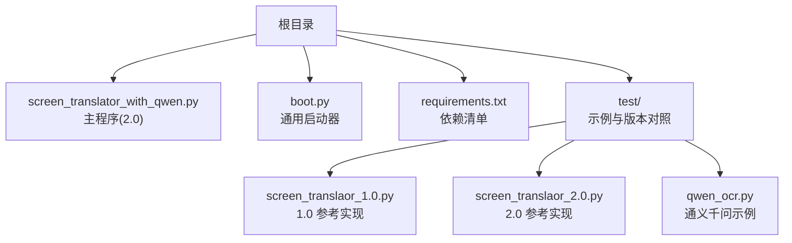
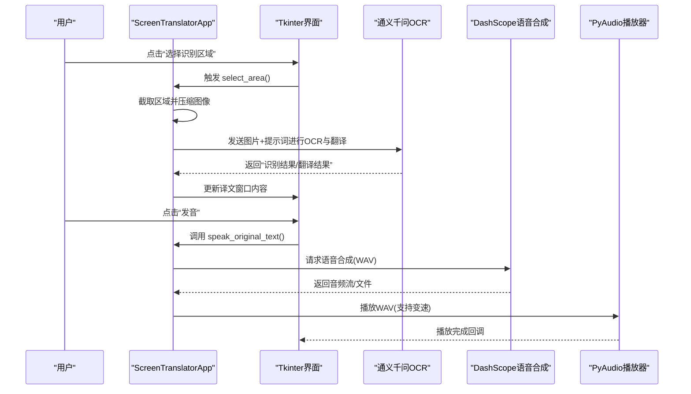
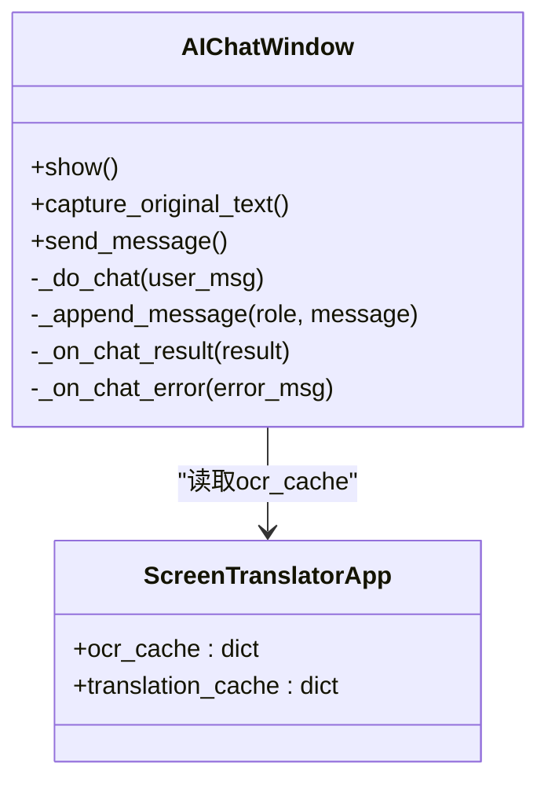
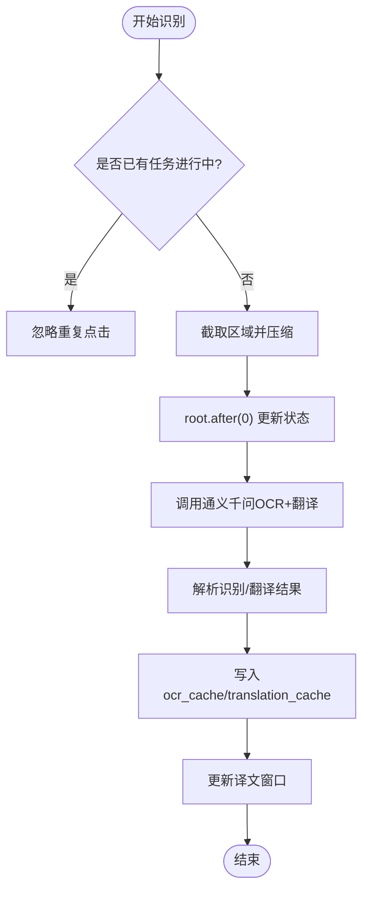
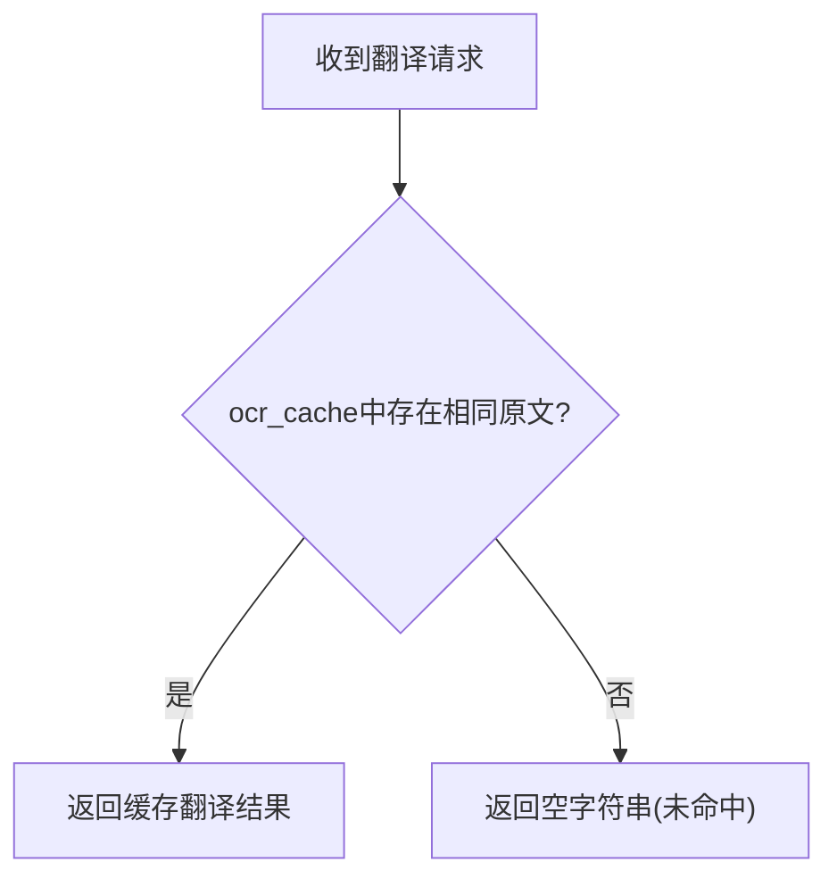
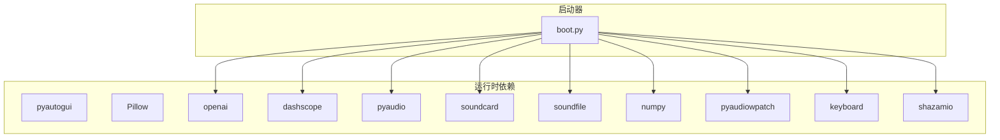

# 版本演进历史

<cite>
**本文引用的文件**   
- [screen_translaor_1.0.py](file://test/screen_translaor_1.0.py)
- [screen_translaor_2.0.py](file://test/screen_translaor_2.0.py)
- [screen_translator_with_qwen.py](file://screen_translator_with_qwen.py)
- [boot.py](file://boot.py)
- [requirements.txt](file://requirements.txt)
- [qwen_ocr.py](file://test/qwen_ocr.py)
</cite>

## 目录
1. [引言](#引言)
2. [项目结构](#项目结构)
3. [核心组件](#核心组件)
4. [架构总览](#架构总览)
5. [详细组件分析](#详细组件分析)
6. [依赖关系分析](#依赖关系分析)
7. [性能考量](#性能考量)
8. [故障排查指南](#故障排查指南)
9. [结论](#结论)
10. [附录：升级与迁移指南](#附录升级与迁移指南)

## 引言
本文件系统性梳理屏幕翻译工具从 1.0 到 2.0 的版本演进，重点对比从“简单脚本”到“面向对象设计”的架构转变，并深入解析新增功能（AI对话窗口、全局快捷键、多线程处理、智能缓存机制）的实现原理与技术选型决策。同时提供向后兼容性考虑、迁移策略与平滑升级路径，以及未来版本的规划与发展路线图。

## 项目结构
仓库采用“主程序 + 启动器 + 测试/示例脚本”的组织方式：
- 根目录包含主程序 screen_translator_with_qwen.py、通用启动器 boot.py 与依赖清单 requirements.txt
- test 目录存放 1.0 与 2.0 的参考实现及若干示例脚本，便于对照演进差异

图表来源
- [screen_translator_with_qwen.py:1-120](file://screen_translator_with_qwen.py#L1-L120)
- [boot.py:1-70](file://boot.py#L1-L70)
- [requirements.txt:1-31](file://requirements.txt#L1-L31)
- [test/screen_translaor_1.0.py:1-60](file://test/screen_translaor_1.0.py#L1-L60)
- [test/screen_translaor_2.0.py:1-60](file://test/screen_translaor_2.0.py#L1-L60)
- [test/qwen_ocr.py:1-30](file://test/qwen_ocr.py#L1-L30)

章节来源
- [screen_translator_with_qwen.py:1-120](file://screen_translator_with_qwen.py#L1-L120)
- [boot.py:1-70](file://boot.py#L1-L70)
- [requirements.txt:1-31](file://requirements.txt#L1-L31)
- [test/screen_translaor_1.0.py:1-60](file://test/screen_translaor_1.0.py#L1-L60)
- [test/screen_translaor_2.0.py:1-60](file://test/screen_translaor_2.0.py#L1-L60)
- [test/qwen_ocr.py:1-30](file://test/qwen_ocr.py#L1-L30)

## 核心组件
- 主应用类 ScreenTranslatorApp：封装区域选择、截图、压缩、OCR、翻译、TTS、播放、日志、快捷键等能力
- AIChatWindow：独立的 AI 对话窗口，支持捕获原文、发送消息、错误提示
- LogWindow/LogWindowHandler：线程安全的日志窗口与处理器
- 启动器 boot.py：自动检测目标脚本、管理虚拟环境、后台运行无控制台窗口
- 依赖 requirements.txt：明确列出截图、图像处理、OpenAI/DashScope、音频、键盘监听等库

章节来源
- [screen_translator_with_qwen.py:474-634](file://screen_translator_with_qwen.py#L474-L634)
- [screen_translator_with_qwen.py:101-300](file://screen_translator_with_qwen.py#L101-L300)
- [screen_translator_with_qwen.py:21-100](file://screen_translator_with_qwen.py#L21-L100)
- [boot.py:256-279](file://boot.py#L256-L279)
- [requirements.txt:1-31](file://requirements.txt#L1-L31)

## 架构总览
2.0 在 1.0 的基础上引入更清晰的面向对象分层、异步化 UI 更新、云端 API 统一接入与多模态能力扩展。整体数据流如下：

图表来源
- [screen_translator_with_qwen.py:927-1021](file://screen_translator_with_qwen.py#L927-L1021)
- [screen_translator_with_qwen.py:1123-1247](file://screen_translator_with_qwen.py#L1123-L1247)
- [screen_translator_with_qwen.py:1442-1556](file://screen_translator_with_qwen.py#L1442-L1556)
- [screen_translator_with_qwen.py:372-473](file://screen_translator_with_qwen.py#L372-L473)

## 详细组件分析

### 从 1.0 到 2.0 的架构改进
- 面向对象重构
  - 1.0 使用 AreaOCRWithAIApp 类，逻辑集中在单一类中，UI 与业务耦合较紧
  - 2.0 将 UI 交互、AI 调用、音频播放、日志等拆分为独立类（如 AIChatWindow、LogWindow），职责清晰、可复用性更强
- 线程与 UI 安全
  - 1.0 使用 threading.Thread 执行识别/翻译，但 UI 更新存在潜在风险
  - 2.0 通过 root.after(0, ...) 在主线程安全更新 UI，避免跨线程直接操作 Tkinter 控件
- 云端 API 统一与增强
  - 1.0 默认对接本地 Ollama，需安装模型且网络/端口配置复杂
  - 2.0 切换为通义千问 OpenAI 兼容接口，简化部署；并提供重试与指数退避、错误码分类处理
- 功能扩展
  - 新增 AI 对话窗口、全局快捷键、听歌识曲、系统音频录制、TTS 与播放控制等
- 可维护性与工程化
  - 引入 boot.py 启动器，自动管理虚拟环境与依赖，提升开箱即用体验

章节来源
- [test/screen_translaor_1.0.py:27-158](file://test/screen_translaor_1.0.py#L27-L158)
- [screen_translator_with_qwen.py:474-634](file://screen_translator_with_qwen.py#L474-L634)
- [screen_translator_with_qwen.py:927-1021](file://screen_translator_with_qwen.py#L927-L1021)
- [screen_translator_with_qwen.py:1123-1247](file://screen_translator_with_qwen.py#L1123-L1247)

### 新增功能实现原理

#### AI 对话窗口
- 展示与交互
  - 独立窗口，顶部输入区，左侧按钮（发送/捕获原文），底部聊天历史
  - 支持 Ctrl+Enter 快捷发送，标签样式区分用户/AI/系统消息
- 消息流程
  - 用户输入 -> 禁用按钮防止重复 -> 新线程调用千问 -> 主线程回调更新显示
- 原文捕获
  - 从 ocr_cache 合并最近识别文本，填充至输入框，便于二次提问

图表来源
- [screen_translator_with_qwen.py:101-300](file://screen_translator_with_qwen.py#L101-L300)
- [screen_translator_with_qwen.py:631-634](file://screen_translator_with_qwen.py#L631-L634)

章节来源
- [screen_translator_with_qwen.py:101-300](file://screen_translator_with_qwen.py#L101-L300)

#### 全局快捷键
- 目标
  - 设置一个全局热键（如 F1），无论窗口是否聚焦均可触发“重新识别”
- 现状与计划
  - 当前代码已预留快捷键相关变量与入口，但未完整实现底层注册逻辑
  - 建议后续集成 keyboard 库或平台级钩子，确保跨进程监听与事件派发

章节来源
- [screen_translator_with_qwen.py:547-573](file://screen_translator_with_qwen.py#L547-L573)

#### 多线程处理
- 识别/翻译任务
  - 使用 daemon 线程执行耗时任务，避免阻塞 UI
- UI 更新
  - 通过 root.after(0, ...) 将 UI 更新调度回主线程，保证线程安全
- 音频播放
  - 单独线程播放 WAV，支持停止事件与速度切换

图表来源
- [screen_translator_with_qwen.py:927-1021](file://screen_translator_with_qwen.py#L927-L1021)
- [screen_translator_with_qwen.py:1123-1247](file://screen_translator_with_qwen.py#L1123-L1247)

章节来源
- [screen_translator_with_qwen.py:927-1021](file://screen_translator_with_qwen.py#L927-L1021)
- [screen_translator_with_qwen.py:1123-1247](file://screen_translator_with_qwen.py#L1123-L1247)

#### 智能缓存机制
- 缓存键
  - 以图像 base64 前缀作为键，降低内存占用
- 缓存项
  - ocr_cache：保存识别原文
  - translation_cache：保存对应翻译结果
- 命中策略
  - 再次翻译时优先从缓存匹配，减少重复请求
- 清理策略
  - 建议在会话结束时或达到阈值后清理，避免无限增长

图表来源
- [screen_translator_with_qwen.py:1249-1266](file://screen_translator_with_qwen.py#L1249-L1266)
- [screen_translator_with_qwen.py:1207-1212](file://screen_translator_with_qwen.py#L1207-L1212)

章节来源
- [screen_translator_with_qwen.py:1207-1212](file://screen_translator_with_qwen.py#L1207-L1212)
- [screen_translator_with_qwen.py:1249-1266](file://screen_translator_with_qwen.py#L1249-L1266)

### 技术选型决策

#### 为什么选择通义千问 API
- 易用性：OpenAI 兼容接口，SDK 成熟，文档完善
- 稳定性：云端服务，无需本地部署模型，降低运维成本
- 多模态：原生支持图文输入，适合 OCR+翻译一体化
- 成本控制：flash 系列模型性价比高，适合高频场景

章节来源
- [screen_translator_with_qwen.py:348-360](file://screen_translator_with_qwen.py#L348-L360)
- [test/qwen_ocr.py:1-30](file://test/qwen_ocr.py#L1-L30)

#### 为什么选择 Tkinter GUI 框架
- 零额外依赖：Python 标准库自带，跨平台一致性好
- 轻量快速：适合桌面小工具，开发效率高
- 可扩展：结合第三方库可实现高级特性（滚动、透明、置顶等）

章节来源
- [screen_translator_with_qwen.py:1-20](file://screen_translator_with_qwen.py#L1-L20)
- [test/screen_translaor_1.0.py:1-20](file://test/screen_translaor_1.0.py#L1-L20)

#### 音频处理库选择
- PyAudio：低延迟播放 WAV，跨平台
- DashScope SDK：官方语音合成，支持流式输出与音色定制
- soundcard/soundfile/numpy：系统音频录制与分析（可选）
- pyaudiowpatch：Windows WASAPI 环形回录，支持蓝牙耳机

章节来源
- [requirements.txt:9-31](file://requirements.txt#L9-L31)
- [screen_translator_with_qwen.py:372-473](file://screen_translator_with_qwen.py#L372-L473)

## 依赖关系分析
- 运行时依赖
  - 截图：pyautogui
  - 图像处理：Pillow
  - 音频：pyaudio、dashscope、soundcard、soundfile、numpy、pyaudiowpatch
  - AI：openai（通义千问兼容模式）
  - 快捷键：keyboard（待启用）
  - 听歌识曲：shazamio、audioop-lts
- 启动器依赖
  - 仅标准库，负责 venv 管理与子进程启动

图表来源
- [requirements.txt:1-31](file://requirements.txt#L1-L31)
- [boot.py:1-70](file://boot.py#L1-L70)

章节来源
- [requirements.txt:1-31](file://requirements.txt#L1-L31)
- [boot.py:1-70](file://boot.py#L1-L70)

## 性能考量
- 图像预处理
  - 灰度化与对比度增强有助于提高 OCR 准确率，但会增加 CPU 开销
- 压缩与传输
  - JPEG 质量参数平衡体积与清晰度；base64 编码增加体积，建议限制区域大小
- 重试与退避
  - 指数退避+随机抖动缓解 429 限流，避免雪崩
- 线程与 UI
  - 非阻塞任务与 root.after 保障 UI 流畅
- 缓存命中率
  - 合理设计缓存键与淘汰策略，减少重复请求

[本节为通用指导，不直接分析具体文件]

## 故障排查指南
- API 密钥无效/过期
  - 检查 key.txt 内容与权限，确认 base_url 正确
- 请求过于频繁
  - 观察 429 错误，等待退避时间后再试
- 请求体过大
  - 缩小识别区域或降低图像质量
- 客户端未初始化
  - 确认 openai/dashscope 依赖安装成功，网络可达
- 音频播放失败
  - 检查 pyaudio 驱动、WAV 文件完整性与采样率

章节来源
- [screen_translator_with_qwen.py:1215-1247](file://screen_translator_with_qwen.py#L1215-L1247)
- [screen_translator_with_qwen.py:1442-1556](file://screen_translator_with_qwen.py#L1442-L1556)

## 结论
从 1.0 到 2.0，项目在架构上实现了从“单类脚本”到“模块化面向对象”的跃迁，显著提升了可维护性与扩展性。通过引入通义千问 API、Tkinter 生态与音频处理链，产品具备了更强的实用性与用户体验。配合启动器与依赖管理，交付体验更加稳定可靠。

[本节为总结性内容，不直接分析具体文件]

## 附录：升级与迁移指南

### 向后兼容性与变更点
- 识别引擎
  - 1.0 默认使用本地 Ollama；2.0 默认使用通义千问 OpenAI 兼容接口
- 配置方式
  - 1.0 需要本地模型与端口配置；2.0 仅需 key.txt 中的 API Key
- 数据结构
  - 2.0 新增 ocr_cache 与 translation_cache，用于智能缓存
- 功能开关
  - 2.0 新增 AI 对话、全局快捷键、TTS 与播放控制等可选能力

### 迁移步骤
- 准备环境
  - 安装 Python 3.x，确保网络可达阿里云百炼服务
- 获取密钥
  - 在根目录创建 key.txt，填入有效的通义千问 API Key
- 依赖安装
  - 使用 boot.py 自动创建/更新虚拟环境并安装依赖
- 运行程序
  - 双击 boot.py，自动后台启动主程序
- 验证功能
  - 选择识别区域，查看译文窗口；尝试“发音”与“AI对话”

### 数据迁移方案
- 旧版本地模型与配置
  - 无需迁移，2.0 不再依赖本地 Ollama
- 旧版缓存
  - 1.0 未持久化缓存，2.0 使用内存字典，重启即清空；如需持久化可在后续版本加入 JSON 存储

### 升级注意事项
- 若出现 401/429/413 错误，按“故障排查指南”逐项检查
- 首次运行可能因依赖编译耗时较长，请保持网络稳定
- 如需启用全局快捷键，需在后续版本集成 keyboard 库并注册热键

章节来源
- [boot.py:209-253](file://boot.py#L209-L253)
- [screen_translator_with_qwen.py:338-360](file://screen_translator_with_qwen.py#L338-L360)
- [screen_translator_with_qwen.py:631-634](file://screen_translator_with_qwen.py#L631-L634)

## 未来版本规划与发展路线图
- 短期
  - 完善全局快捷键实现，支持多键组合与冲突检测
  - 优化缓存策略，支持持久化与容量上限
  - 增加更多 TTS 音色与语速预设
- 中期
  - 引入插件化架构，支持多种 OCR/翻译后端（本地/云端）
  - 增加批量识别与历史记录管理
  - 国际化与主题皮肤
- 长期
  - 构建跨平台安装包与自更新机制
  - 探索端侧大模型与边缘计算，降低云端依赖
  - 开放 API 与开发者生态

[本节为前瞻性规划，不直接分析具体文件]