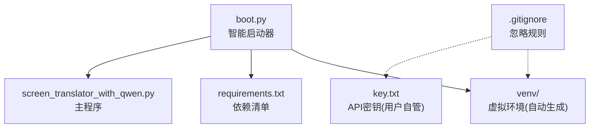
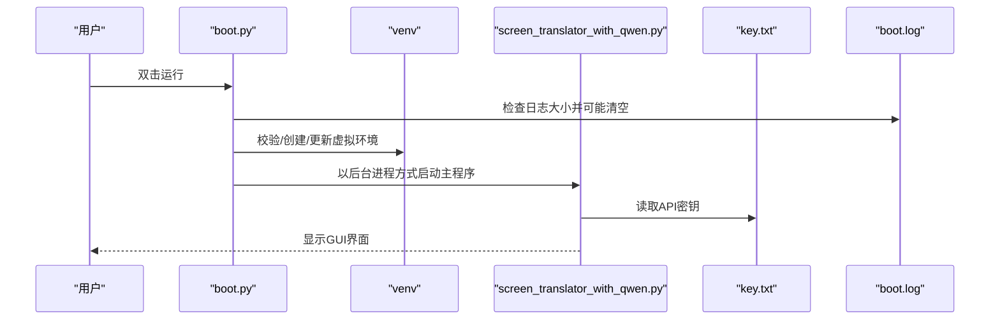
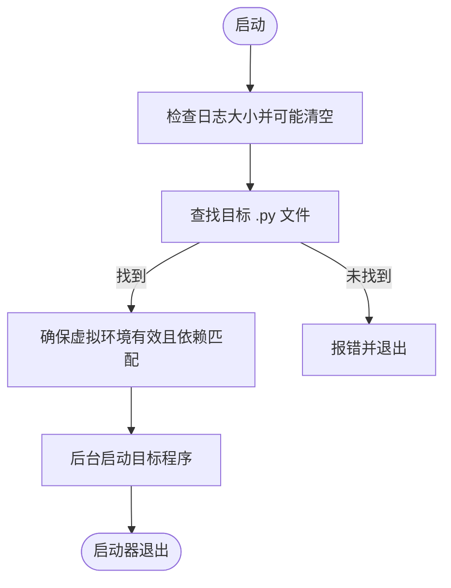
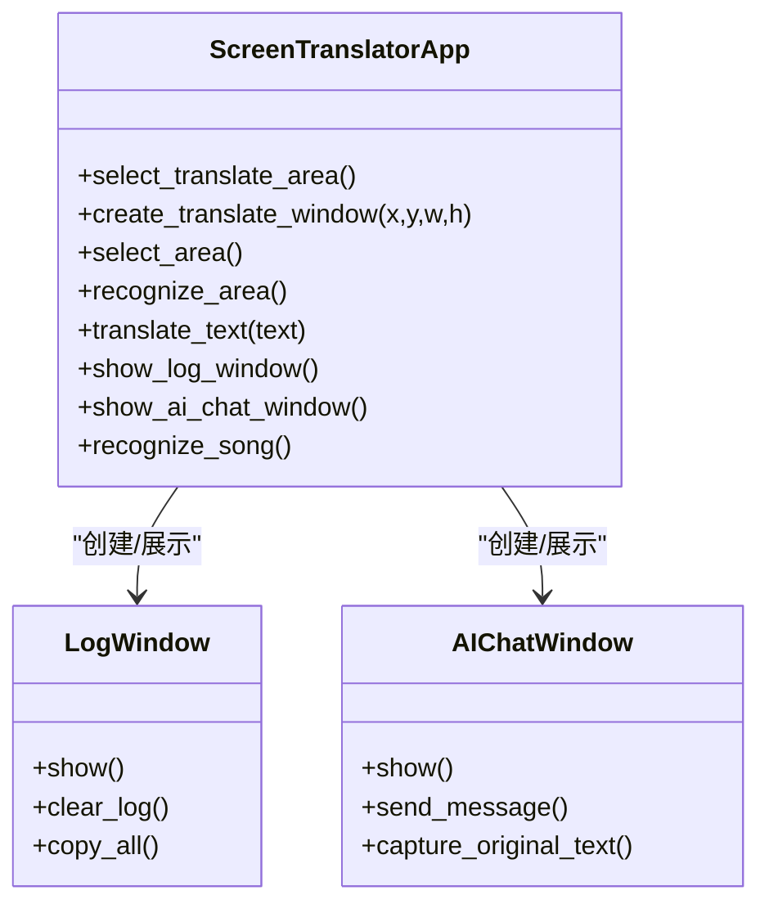
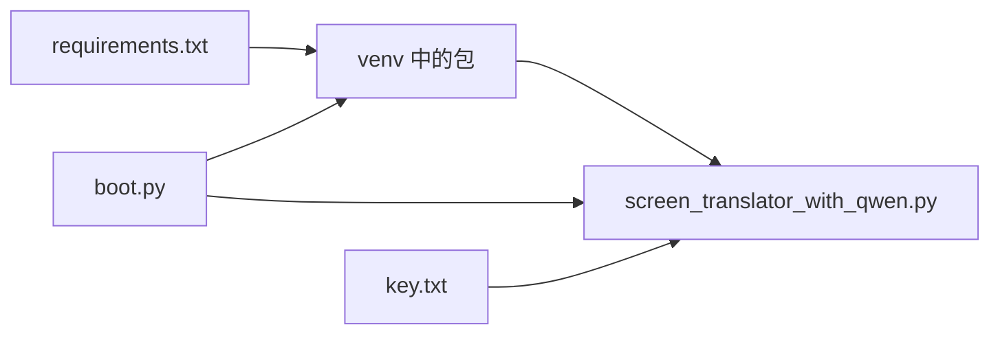

# 快速开始

<cite>
**本文引用的文件**   
- [boot.py](file://boot.py)
- [requirements.txt](file://requirements.txt)
- [screen_translator_with_qwen.py](file://screen_translator_with_qwen.py)
- [.gitignore](file://.gitignore)
- [test/screen_translaor_2.0.py](file://test/screen_translaor_2.0.py)
</cite>

## 目录
1. [简介](#简介)
2. [项目结构](#项目结构)
3. [核心组件](#核心组件)
4. [架构总览](#架构总览)
5. [详细组件分析](#详细组件分析)
6. [依赖关系分析](#依赖关系分析)
7. [性能与稳定性建议](#性能与稳定性建议)
8. [故障排除指南](#故障排除指南)
9. [结论](#结论)
10. [附录：首次运行完整流程](#附录首次运行完整流程)

## 简介
本指南面向初学者，帮助你从零开始安装、配置并启动“屏幕翻译工具2.0”。你将了解：
- Python 环境要求与虚拟环境管理
- 通过 requirements.txt 安装依赖
- 配置 API 密钥（key.txt）
- 使用智能启动器 boot.py 自动创建/修复虚拟环境、日志轮转、后台启动主程序
- 首次运行的完整步骤与常见问题排查

## 项目结构
仓库根目录包含启动器、依赖清单与主程序入口；test 目录提供示例与测试脚本。关键文件说明：
- boot.py：通用启动器，负责虚拟环境校验与重建、依赖增量更新、日志轮转、后台启动目标程序
- requirements.txt：项目所需第三方库版本约束
- screen_translator_with_qwen.py：主程序（Tkinter GUI + OCR/翻译/语音合成等能力）
- .gitignore：忽略日志、密钥、虚拟环境等敏感或临时文件
- test/*：功能示例与旧版参考实现

图表来源
- [boot.py:1-279](file://boot.py#L1-L279)
- [requirements.txt:1-31](file://requirements.txt#L1-L31)
- [.gitignore:1-44](file://.gitignore#L1-L44)

章节来源
- [boot.py:1-279](file://boot.py#L1-L279)
- [requirements.txt:1-31](file://requirements.txt#L1-L31)
- [.gitignore:1-44](file://.gitignore#L1-L44)

## 核心组件
- 智能启动器 boot.py
  - 自动检测同目录下唯一 .py 作为目标程序
  - 自动管理 venv：校验有效性、依赖变更增量更新、失败重试、半成品清理
  - 日志轮转：当 boot.log 超过阈值时自动清空
  - 后台启动目标程序（Windows 无控制台窗口），启动器立即退出
- 主程序 screen_translator_with_qwen.py
  - Tkinter 图形界面，支持选择识别区域与译文显示区域
  - 集成通义千问 AI 客户端（OpenAI 兼容模式）进行对话与语音合成
  - 可选功能：听歌识曲、系统音频录制、WASAPI 环形回录（蓝牙耳机）
  - 内置日志窗口，实时输出运行信息
- 依赖 requirements.txt
  - 截图、图像处理、音频播放、OpenAI/DashScope SDK、键盘监听、Shazam、系统音频等

章节来源
- [boot.py:1-279](file://boot.py#L1-L279)
- [screen_translator_with_qwen.py:1-800](file://screen_translator_with_qwen.py#L1-L800)
- [requirements.txt:1-31](file://requirements.txt#L1-L31)

## 架构总览
下图展示了从双击启动到主程序运行的整体流程，以及关键配置文件的作用。

图表来源
- [boot.py:256-279](file://boot.py#L256-L279)
- [screen_translator_with_qwen.py:338-360](file://screen_translator_with_qwen.py#L338-L360)

## 详细组件分析

### 智能启动器 boot.py
职责与特性：
- 目标程序发现：自动定位除自身外的唯一 .py 文件
- 虚拟环境生命周期管理：
  - 不存在则创建
  - 无效（如移动目录）则重建
  - 依赖变更则尝试增量更新，失败则回退重建
  - 安装失败会清理半成品 venv 并提示原因
- 日志轮转：当 boot.log 超过 500KB 时自动清空
- 后台启动：Windows 下使用无控制台标志启动，Linux/macOS 分离会话避免继承控制台

图表来源
- [boot.py:40-70](file://boot.py#L40-L70)
- [boot.py:209-225](file://boot.py#L209-L225)
- [boot.py:226-253](file://boot.py#L226-L253)

章节来源
- [boot.py:1-279](file://boot.py#L1-L279)

### 主程序 screen_translator_with_qwen.py
主要能力：
- 界面交互：选择识别区域、译文显示区域、快捷键设置、日志窗口、AI对话窗口
- 语音能力：调用 DashScope 语音合成生成 wav，本地 PyAudio 播放，支持变速
- 可选依赖容错：对 shazamio、soundcard/soundfile/numpy、pyaudiowpatch 的导入失败进行降级处理
- API 密钥读取：从 key.txt 读取并初始化 OpenAI 兼容客户端（DashScope 端点）

图表来源
- [screen_translator_with_qwen.py:474-634](file://screen_translator_with_qwen.py#L474-L634)
- [screen_translator_with_qwen.py:34-100](file://screen_translator_with_qwen.py#L34-L100)
- [screen_translator_with_qwen.py:101-300](file://screen_translator_with_qwen.py#L101-L300)

章节来源
- [screen_translator_with_qwen.py:1-800](file://screen_translator_with_qwen.py#L1-L800)

### 依赖 requirements.txt
覆盖范围：
- 屏幕截图与图像处理：pyautogui、Pillow
- 音频播放与录音：pyaudio、soundcard、soundfile、numpy、pyaudiowpatch
- AI 服务：openai（兼容 DashScope）、dashscope
- 其他：keyboard、shazamio、audioop-lts

章节来源
- [requirements.txt:1-31](file://requirements.txt#L1-L31)

## 依赖关系分析
- 启动器与主程序解耦：boot.py 仅负责环境与启动，不耦合业务逻辑
- 主程序对可选依赖采用 try/except 降级策略，保证基础功能可用
- 配置文件 key.txt 由主程序在运行时读取，不在代码中硬编码

图表来源
- [requirements.txt:1-31](file://requirements.txt#L1-L31)
- [boot.py:105-166](file://boot.py#L105-L166)
- [screen_translator_with_qwen.py:338-360](file://screen_translator_with_qwen.py#L338-L360)

章节来源
- [requirements.txt:1-31](file://requirements.txt#L1-L31)
- [boot.py:105-166](file://boot.py#L105-L166)
- [screen_translator_with_qwen.py:338-360](file://screen_translator_with_qwen.py#L338-L360)

## 性能与稳定性建议
- 网络与镜像源：若 pip 安装缓慢或失败，可配置国内镜像源以提升成功率与速度
- 编译型依赖：部分音频相关依赖可能需要系统级编译工具链，请根据错误提示安装对应工具
- 资源占用：OCR/翻译/语音合成为网络密集型任务，建议在稳定网络环境下使用
- 日志体积：启动器已内置日志轮转，无需手动清理；如需更细粒度控制，可在主程序中调整日志级别

[本节为通用建议，不涉及具体文件分析]

## 故障排除指南
- 找不到目标程序
  - 现象：启动器提示目录下有多个或没有 .py 文件
  - 解决：保持根目录简洁，只保留启动器和一个主程序文件
- 虚拟环境无效或损坏
  - 现象：提示虚拟环境无效或重建失败
  - 解决：删除 venv 目录后重新运行启动器，让其自动重建
- 依赖安装失败
  - 现象：pip install 超时或报错
  - 解决：检查网络、更换镜像源、安装系统编译工具；必要时按提示重试
- API 密钥无效或未配置
  - 现象：AI 对话或语音合成报 401/Unauthorized
  - 解决：确认 key.txt 存在且内容正确，路径位于项目根目录
- 日志过大
  - 现象：boot.log 增长较快
  - 解决：启动器会自动清空超阈值的日志；也可定期查看 boot.log 定位问题

章节来源
- [boot.py:53-70](file://boot.py#L53-L70)
- [boot.py:209-225](file://boot.py#L209-L225)
- [boot.py:115-140](file://boot.py#L115-L140)
- [screen_translator_with_qwen.py:338-360](file://screen_translator_with_qwen.py#L338-L360)

## 结论
通过智能启动器与完善的依赖管理，你可以一键完成环境准备与主程序启动。配合 key.txt 配置即可体验屏幕识别、翻译与语音合成等功能。遇到问题时，优先查看 boot.log 与主程序日志窗口，结合本章故障排除建议快速定位。

[本节为总结性内容，不涉及具体文件分析]

## 附录：首次运行完整流程
以下流程适用于 Windows/Linux/macOS，目标是成功启动主程序并完成基本使用。

- 前置条件
  - 操作系统：Windows 10/11 或主流 Linux/macOS
  - Python：建议使用 3.9+（启动器将基于当前 Python 创建 venv）
  - 网络：能访问 PyPI 与阿里云 DashScope 服务
  - 权限：具备在当前目录写入文件的权限

- 步骤一：准备项目目录
  - 打开终端，进入项目根目录
  - 确认存在以下文件：boot.py、requirements.txt、screen_translator_with_qwen.py

- 步骤二：安装依赖（可选）
  - 如果你希望提前验证依赖安装是否顺利，可执行：
    - pip install -r requirements.txt
  - 注意：实际运行推荐使用启动器自动管理 venv，避免全局污染

- 步骤三：配置 API 密钥
  - 在项目根目录创建 key.txt 文件
  - 将你的 DashScope/OpenAI 兼容模式的 API Key 写入该文件（单行文本）
  - 注意：key.txt 已被 .gitignore 忽略，不会被提交到仓库

- 步骤四：启动程序
  - 直接双击运行 boot.py
  - 启动器将：
    - 检查并可能清空过大的 boot.log
    - 自动创建/校验/更新 venv 与依赖
    - 后台启动 screen_translator_with_qwen.py（Windows 无控制台窗口）
  - 启动完成后，主程序界面将出现

- 步骤五：首次使用
  - 点击“选择译文区域”，在全屏半透明遮罩上拖拽框选译文显示位置
  - 点击“选择识别区域”，框选需要识别的屏幕区域
  - 点击“重新识别”或设置快捷键触发识别
  - 识别结果将自动翻译并在译文窗口显示
  - 可通过“日志”按钮查看运行日志
  - 如需语音朗读，点击“发音”按钮（需正确配置 API 密钥）

- 步骤六：关闭程序
  - 在主界面点击“关闭”按钮
  - 或在系统托盘/任务管理器中结束主程序进程

- 常见问题速查
  - 启动后无任何窗口：查看 boot.log 是否有报错；确认主程序未被安全软件拦截
  - 无法识别屏幕：检查 pyautogui 权限（Windows 可能需要管理员权限）
  - 语音合成失败：确认 key.txt 有效且网络可达 DashScope 服务
  - 依赖安装慢/失败：配置 pip 镜像源并重试

章节来源
- [boot.py:256-279](file://boot.py#L256-L279)
- [screen_translator_with_qwen.py:474-634](file://screen_translator_with_qwen.py#L474-L634)
- [.gitignore:1-44](file://.gitignore#L1-L44)