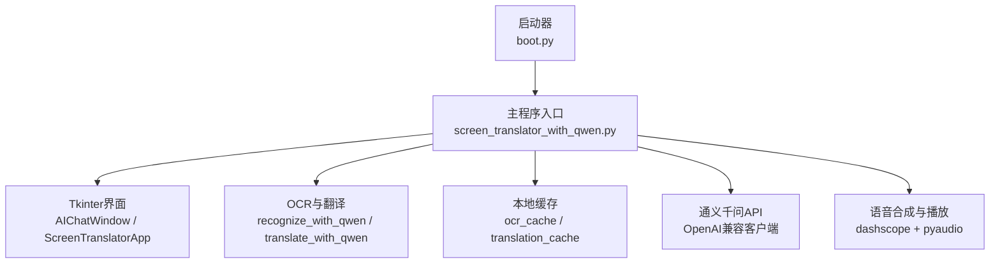
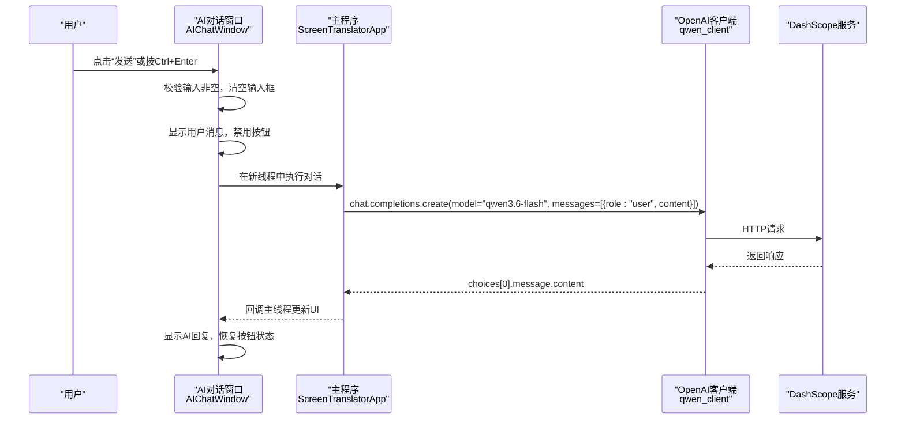
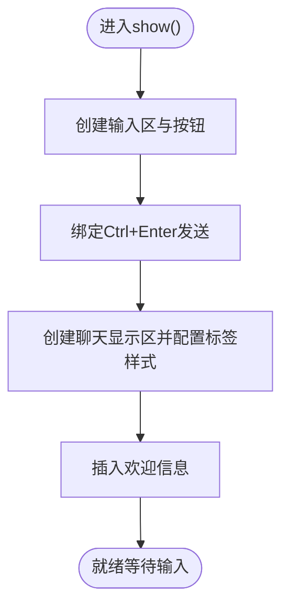
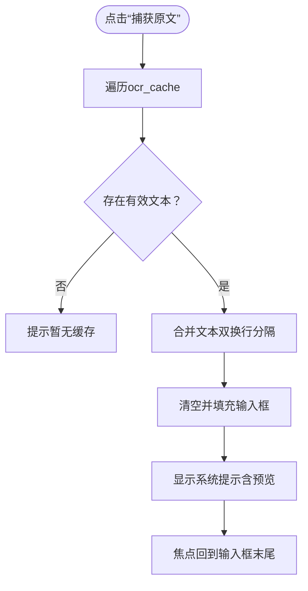
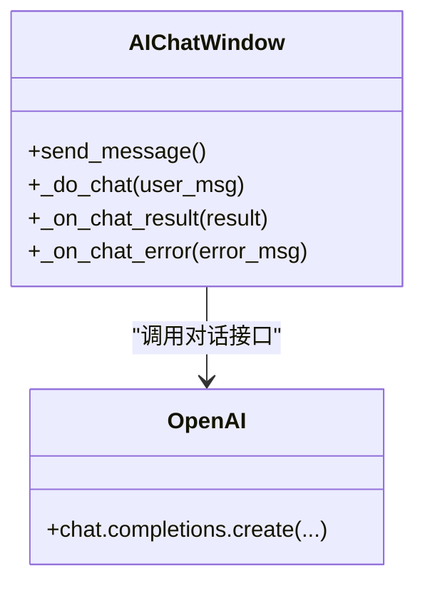
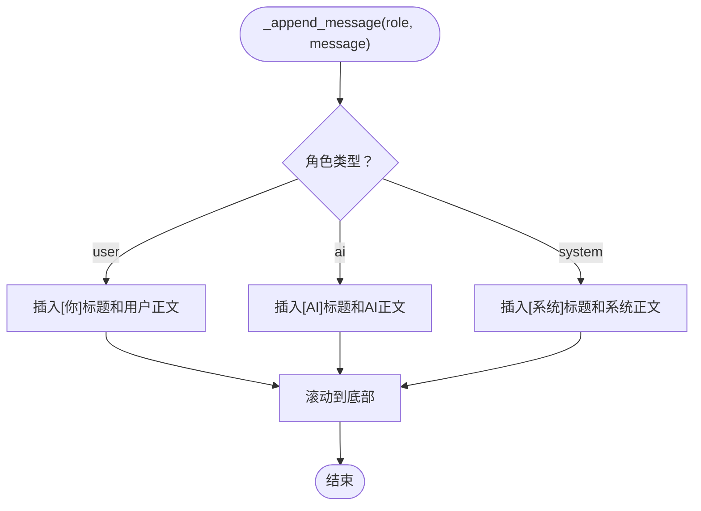
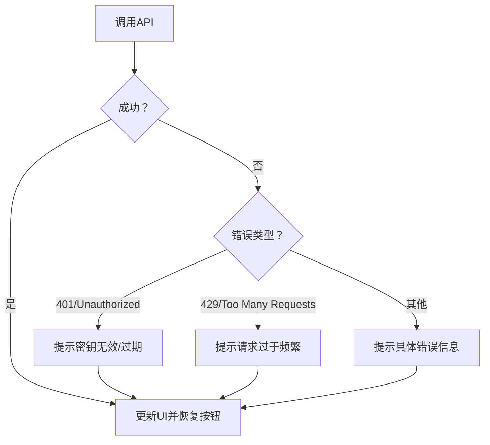
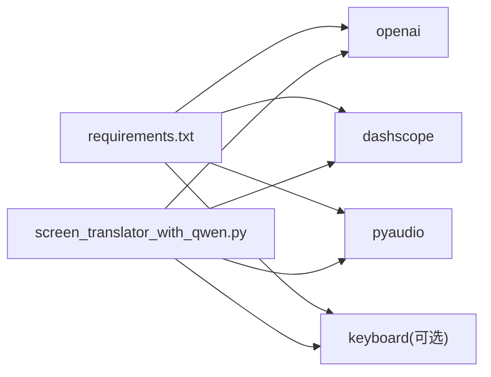

# AI对话助手

<cite>
**本文引用的文件**   
- [screen_translator_with_qwen.py](file://screen_translator_with_qwen.py)
- [boot.py](file://boot.py)
- [requirements.txt](file://requirements.txt)
</cite>

## 目录
1. [简介](#简介)
2. [项目结构](#项目结构)
3. [核心组件](#核心组件)
4. [架构总览](#架构总览)
5. [详细组件分析](#详细组件分析)
6. [依赖关系分析](#依赖关系分析)
7. [性能与体验优化](#性能与体验优化)
8. [故障排查指南](#故障排查指南)
9. [结论](#结论)
10. [附录：使用示例与扩展方法](#附录使用示例与扩展方法)

## 简介
本项目在屏幕翻译工具基础上，新增“AI对话助手”功能。用户可在独立对话框中与通义千问进行多轮对话，支持从OCR缓存中一键捕获历史识别文本、智能提示与富文本显示；同时提供快捷键发送、错误友好提示、异步请求处理等能力。整体采用Tkinter构建桌面界面，通过OpenAI兼容接口调用阿里云DashScope的qwen3.6-flash模型完成对话与图像识别/翻译任务。

## 项目结构
- 启动器 boot.py：自动检测主程序、管理虚拟环境、后台启动目标脚本并退出自身。
- 主程序 screen_translator_with_qwen.py：包含屏幕截图识别、翻译、语音合成、听歌识曲以及AI对话窗口等全部业务逻辑。
- 依赖 requirements.txt：声明第三方库版本范围。

图表来源
- [boot.py:256-279](file://boot.py#L256-L279)
- [screen_translator_with_qwen.py:2413-2417](file://screen_translator_with_qwen.py#L2413-L2417)

章节来源
- [boot.py:1-279](file://boot.py#L1-L279)
- [screen_translator_with_qwen.py:1-120](file://screen_translator_with_qwen.py#L1-L120)
- [requirements.txt:1-31](file://requirements.txt#L1-L31)

## 核心组件
- AI对话窗口（AIChatWindow）
  - 输入区域布局：左侧垂直按钮区（发送、捕获原文），右侧多行文本输入框，绑定Ctrl+Enter发送。
  - 消息显示区域：滚动文本控件，按角色（用户/AI/系统）配置不同标签样式，实现富文本显示。
  - 消息历史记录：以追加方式写入显示区域，维护会话状态（禁用/启用按钮、加载态）。
- 原文捕获机制
  - 从应用级ocr_cache读取历史识别结果，合并为连续文本填入输入框，并提供预览提示。
- 通义千问对话API集成
  - 使用OpenAI兼容客户端，base_url指向DashScope，模型选择qwen3.6-flash。
  - 构建messages数组，发起异步请求（线程），解析choices[0].message.content。
- 错误处理策略
  - 针对401未授权、429限流、网络异常等进行分类提示，并在UI上恢复按钮状态。
- 日志与调试
  - 自定义LogWindowHandler将日志输出到独立日志窗口，便于问题定位。

章节来源
- [screen_translator_with_qwen.py:101-300](file://screen_translator_with_qwen.py#L101-L300)
- [screen_translator_with_qwen.py:338-360](file://screen_translator_with_qwen.py#L338-L360)
- [screen_translator_with_qwen.py:21-100](file://screen_translator_with_qwen.py#L21-L100)

## 架构总览
AI对话助手作为子模块嵌入主程序，通过全局OpenAI客户端访问DashScope服务。界面层负责交互与展示，业务层负责消息组装与API调用，数据层负责OCR/翻译结果缓存。

图表来源
- [screen_translator_with_qwen.py:223-299](file://screen_translator_with_qwen.py#L223-L299)
- [screen_translator_with_qwen.py:338-360](file://screen_translator_with_qwen.py#L338-L360)

## 详细组件分析

### AI对话窗口（AIChatWindow）
- 界面组织
  - 顶部输入区：左侧按钮（发送、捕获原文），右侧Text输入框。
  - 底部聊天区：ScrolledText，按角色标签渲染不同颜色与字体。
- 交互流程
  - 发送消息：校验非空→清空输入→追加用户消息→禁用按钮→线程内调用API→回调更新UI。
  - 捕获原文：遍历ocr_cache→过滤空值→合并文本→填充输入框→显示系统提示。
- 富文本显示
  - 使用tag_configure定义user/ai/system及对应正文样式，插入时分别标注。
- 快捷键
  - 绑定Control-Return触发发送。

图表来源
- [screen_translator_with_qwen.py:110-196](file://screen_translator_with_qwen.py#L110-L196)

章节来源
- [screen_translator_with_qwen.py:101-300](file://screen_translator_with_qwen.py#L101-L300)

### 原文捕获机制
- 数据来源：应用级ocr_cache字典，键为图像片段标识，值为识别出的原文。
- 合并策略：过滤空内容后以双换行拼接，避免丢失段落边界。
- 用户体验：当无缓存时给出系统提示；有缓存时显示前200字符预览与条数统计。

图表来源
- [screen_translator_with_qwen.py:198-222](file://screen_translator_with_qwen.py#L198-L222)

章节来源
- [screen_translator_with_qwen.py:198-222](file://screen_translator_with_qwen.py#L198-L222)

### 通义千问对话API集成
- 客户端初始化
  - 从key.txt读取API密钥，构造OpenAI客户端，base_url指向DashScope兼容端点。
- 模型与消息格式
  - 模型：qwen3.6-flash。
  - 消息：单条user消息，content为用户输入文本。
- 异步处理
  - 使用threading在新线程中发起请求，完成后通过root.after回调主线程更新UI。
- 响应解析
  - 取response.choices[0].message.content作为AI回复。

图表来源
- [screen_translator_with_qwen.py:223-299](file://screen_translator_with_qwen.py#L223-L299)
- [screen_translator_with_qwen.py:338-360](file://screen_translator_with_qwen.py#L338-L360)

章节来源
- [screen_translator_with_qwen.py:223-299](file://screen_translator_with_qwen.py#L223-L299)
- [screen_translator_with_qwen.py:338-360](file://screen_translator_with_qwen.py#L338-L360)

### 消息历史记录管理与富文本显示
- 会话状态维护
  - 发送过程中禁用按钮，防止重复提交；完成后恢复。
- 消息类型标记
  - user/ai/system三类角色，分别设置前景色与加粗标题行。
- 富文本显示
  - 使用ScrolledText的tag机制，插入标题行与正文行，自动滚动到底部。

图表来源
- [screen_translator_with_qwen.py:242-258](file://screen_translator_with_qwen.py#L242-L258)

章节来源
- [screen_translator_with_qwen.py:242-258](file://screen_translator_with_qwen.py#L242-L258)

### 错误处理策略
- API密钥验证
  - 客户端未初始化或401错误时，提示检查key.txt中的API密钥。
- 网络异常与限流
  - 429错误提示请求过于频繁，稍后再试。
- 通用异常
  - 捕获并格式化错误信息，显示给用户，同时恢复按钮状态。

图表来源
- [screen_translator_with_qwen.py:259-299](file://screen_translator_with_qwen.py#L259-L299)

章节来源
- [screen_translator_with_qwen.py:259-299](file://screen_translator_with_qwen.py#L259-L299)

## 依赖关系分析
- 外部依赖
  - openai：用于与DashScope兼容API通信。
  - dashscope：语音合成SDK（TTS）。
  - pyaudio：音频播放。
  - keyboard：全局快捷键（可选）。
  - Pillow/pyautogui：图像处理与截图（在主程序中用于OCR/翻译）。
- 运行时初始化
  - 启动时尝试导入可选依赖，记录警告日志以便诊断。

图表来源
- [requirements.txt:1-31](file://requirements.txt#L1-L31)
- [screen_translator_with_qwen.py:314-336](file://screen_translator_with_qwen.py#L314-L336)

章节来源
- [requirements.txt:1-31](file://requirements.txt#L1-L31)
- [screen_translator_with_qwen.py:314-336](file://screen_translator_with_qwen.py#L314-L336)

## 性能与体验优化
- 界面流畅性
  - 所有耗时操作（API调用、语音合成）均在新线程执行，UI更新通过after回调确保线程安全。
- 资源清理
  - 程序关闭时清理临时语音文件，避免磁盘占用。
- 可访问性与易用性
  - 快捷键发送减少鼠标操作；捕获原文一键回填提升效率；错误提示清晰易懂。
- 可扩展性
  - 模块化设计便于替换模型或接入更多服务；日志窗口便于问题追踪。

[本节为通用建议，不直接分析具体文件]

## 故障排查指南
- 无法连接AI服务
  - 检查key.txt是否存在且包含有效的API密钥。
  - 查看日志窗口是否出现401/429相关错误。
- 语音合成失败
  - 确认已安装dashscope与pyaudio，检查网络连通性。
- 全局快捷键无效
  - 确认已安装keyboard库；若未安装，界面会提示相应警告。
- 依赖缺失
  - 使用启动器boot.py运行，其会自动检测并安装依赖；如失败，请检查网络与PyPI源。

章节来源
- [screen_translator_with_qwen.py:338-360](file://screen_translator_with_qwen.py#L338-L360)
- [screen_translator_with_qwen.py:314-336](file://screen_translator_with_qwen.py#L314-L336)
- [boot.py:256-279](file://boot.py#L256-L279)

## 结论
AI对话助手以轻量级桌面界面为核心，结合通义千问的强大语言模型，实现了便捷的对话交互与原文捕获能力。通过清晰的错误处理、友好的提示与快捷键支持，提升了用户体验。未来可进一步引入多轮上下文记忆、消息持久化与主题定制等功能。

[本节为总结性内容，不直接分析具体文件]

## 附录：使用示例与扩展方法

### 基本使用步骤
- 准备API密钥
  - 在项目根目录创建key.txt，写入DashScope API密钥。
- 启动程序
  - 双击boot.py，自动检测主程序并后台启动。
- 打开AI对话窗口
  - 在主界面点击“AI对话”，弹出对话窗口。
- 发送消息
  - 在输入框输入问题，按Ctrl+Enter或点击“发送”。
- 捕获原文
  - 先进行截图识别，再在对话窗口点击“捕获原文”，自动回填历史识别文本。

章节来源
- [screen_translator_with_qwen.py:2397-2402](file://screen_translator_with_qwen.py#L2397-L2402)
- [screen_translator_with_qwen.py:198-222](file://screen_translator_with_qwen.py#L198-L222)
- [screen_translator_with_qwen.py:223-299](file://screen_translator_with_qwen.py#L223-L299)

### 快捷键绑定
- Ctrl+Enter发送：已在输入框绑定，无需额外配置。
- 全局快捷键（重新识别）：在主界面设置自定义快捷键，适用于窗口失焦场景。

章节来源
- [screen_translator_with_qwen.py:166-170](file://screen_translator_with_qwen.py#L166-L170)
- [screen_translator_with_qwen.py:1734-1788](file://screen_translator_with_qwen.py#L1734-L1788)

### 界面定制与功能扩展
- 样式定制
  - 修改聊天显示区域的tag_configure参数，调整颜色与字体。
- 模型切换
  - 在对话请求处更换model参数，适配不同场景需求。
- 消息持久化
  - 可在_append_message后追加本地存储逻辑，实现历史会话保存与恢复。
- 多模态增强
  - 在消息体中增加图片URL或base64字段，实现图文混合对话。

章节来源
- [screen_translator_with_qwen.py:187-196](file://screen_translator_with_qwen.py#L187-L196)
- [screen_translator_with_qwen.py:267-278](file://screen_translator_with_qwen.py#L267-L278)