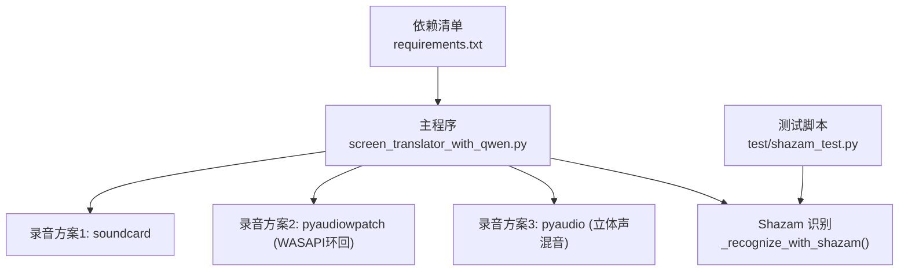
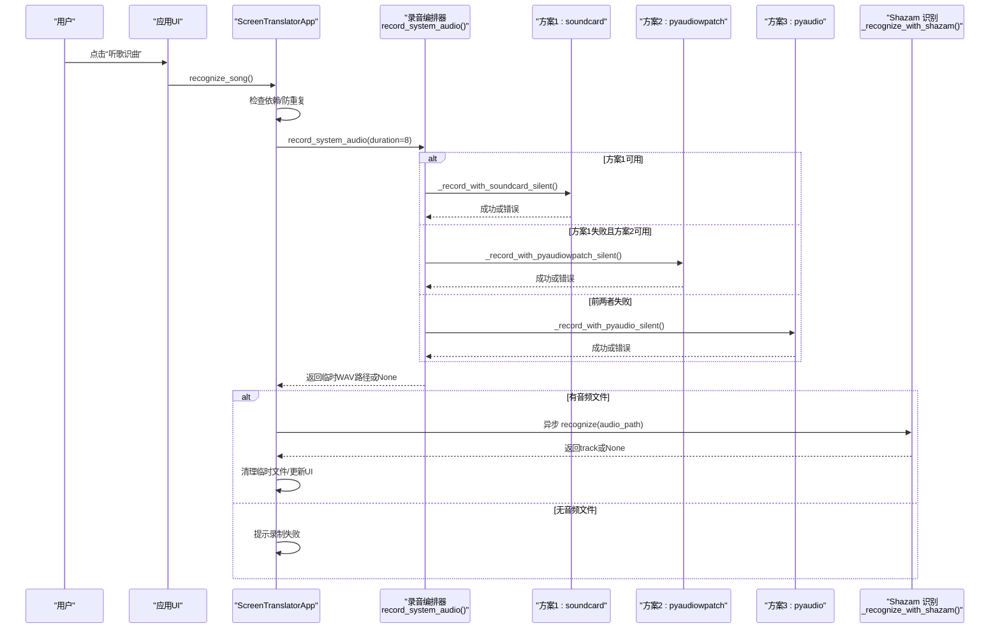
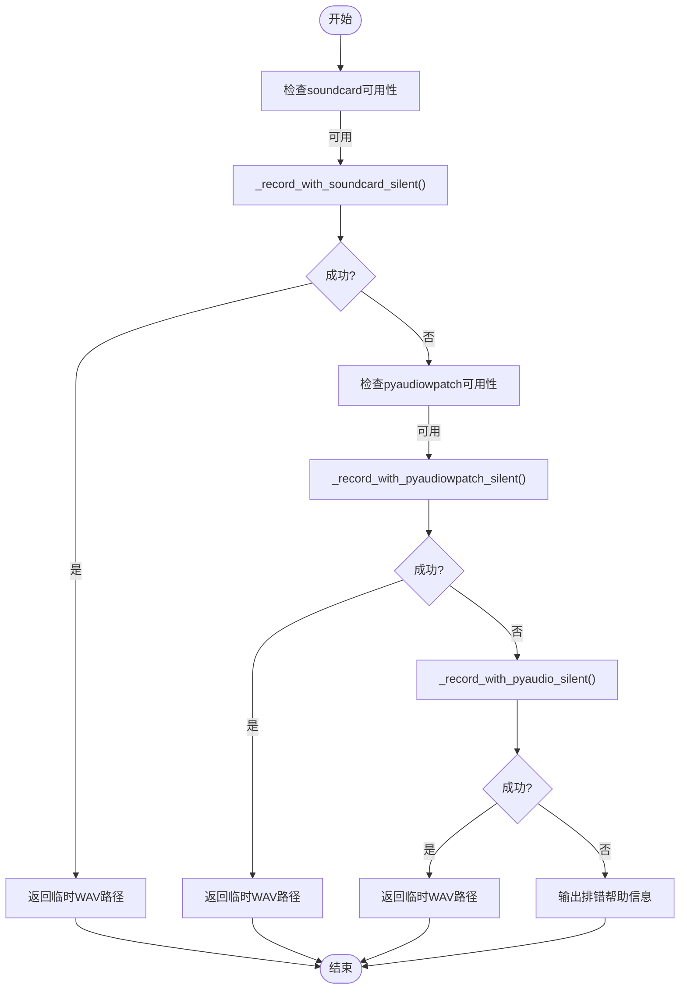
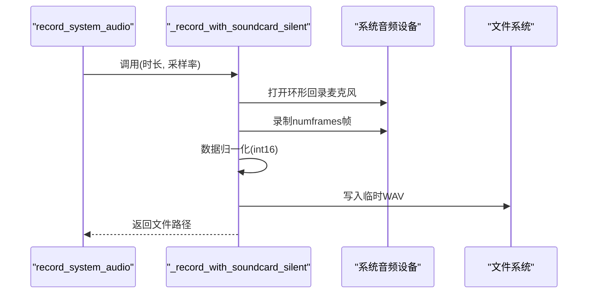
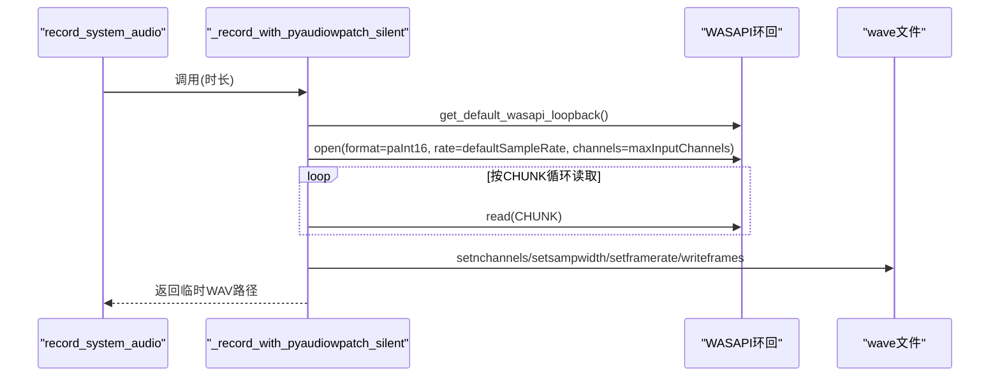
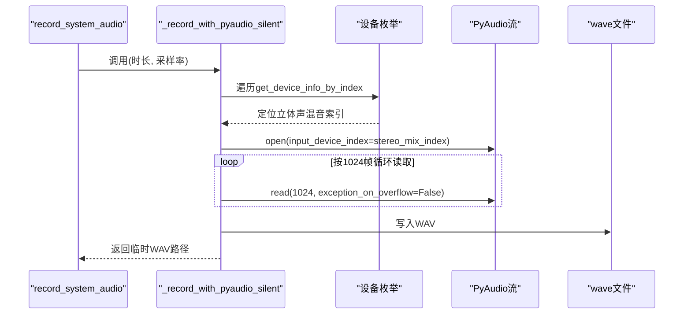
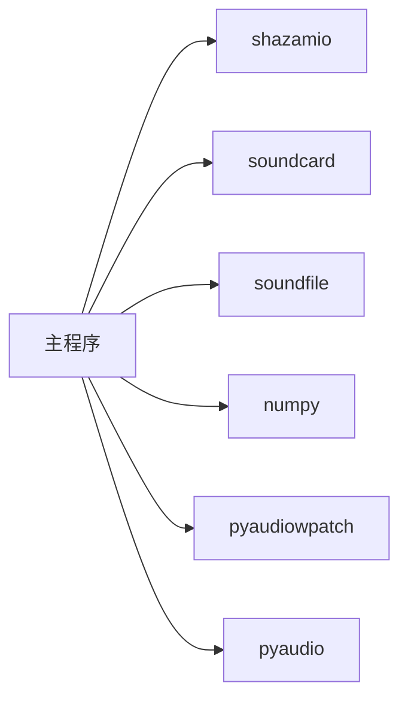

# 听歌识曲功能

<cite>
**本文引用的文件**   
- [screen_translator_with_qwen.py](file://screen_translator_with_qwen.py)
- [shazam_test.py](file://test/shazam_test.py)
- [requirements.txt](file://requirements.txt)
</cite>

## 目录
1. [简介](#简介)
2. [项目结构](#项目结构)
3. [核心组件](#核心组件)
4. [架构总览](#架构总览)
5. [详细组件分析](#详细组件分析)
6. [依赖关系分析](#依赖关系分析)
7. [性能与调优](#性能与调优)
8. [故障排查指南](#故障排查指南)
9. [结论](#结论)
10. [附录：配置与使用示例](#附录配置与使用示例)

## 简介
本技术文档围绕“听歌识曲”功能，系统梳理了三种系统级音频录制方案（soundcard、pyaudiowpatch、pyaudio）的实现差异与适用场景，深入解析从设备枚举、采样率配置、缓冲区管理到实时数据落盘的完整流程；并阐述基于 Shazam API 的识别链路（特征提取、指纹生成、云端匹配、结果解析）。同时提供音频格式标准化（WAV）、错误处理与异常恢复策略、跨平台兼容性建议及常见问题诊断方法。

## 项目结构
本项目将听歌识曲能力集成在桌面应用中，主要实现位于主程序文件中，测试脚本用于独立验证 Shazam 识别流程。关键文件如下：
- 主程序：包含 UI、音频录制多方案、Shazam 异步识别、线程调度与日志输出等
- 测试脚本：独立演示 shazamio 的异步识别调用与结果解析
- 依赖清单：列出 pyaudio、soundcard、pyaudiowpatch、shazamio 等库版本要求



图表来源
- [screen_translator_with_qwen.py:1800-2372](file://screen_translator_with_qwen.py#L1800-L2372)
- [shazam_test.py:1-66](file://test/shazam_test.py#L1-L66)
- [requirements.txt:1-31](file://requirements.txt#L1-L31)

章节来源
- [screen_translator_with_qwen.py:1-200](file://screen_translator_with_qwen.py#L1-L200)
- [requirements.txt:1-31](file://requirements.txt#L1-L31)

## 核心组件
- 可选依赖检测与初始化
  - 通过 try/except 动态检测 shazamio、soundcard/soundfile/numpy、pyaudiowpatch 是否可用，设置标志位控制后续流程分支
- 系统音频录制编排器
  - 按优先级依次尝试三种方案，任一成功即返回临时 WAV 文件路径；全部失败则输出详细排错信息
- 三种录音方案
  - 方案1：soundcard 环形回录（跨平台，但蓝牙耳机可能受限）
  - 方案2：pyaudiowpatch WASAPI 环回（Windows 专属，支持蓝牙耳机）
  - 方案3：pyaudio 立体声混音（通用，需系统启用“立体声混音”）
- Shazam 异步识别
  - 使用 shazamio 的异步 recognize 接口进行云端匹配，解析 track 字段并返回歌曲信息
- 线程与事件循环协调
  - 在主线程中启动后台线程执行识别，内部创建新事件循环运行异步识别，完成后清理临时文件并更新 UI

章节来源
- [screen_translator_with_qwen.py:314-336](file://screen_translator_with_qwen.py#L314-L336)
- [screen_translator_with_qwen.py:1800-1851](file://screen_translator_with_qwen.py#L1800-L1851)
- [screen_translator_with_qwen.py:2233-2372](file://screen_translator_with_qwen.py#L2233-L2372)

## 架构总览
下图展示了从用户触发到最终展示结果的端到端流程，包括三种录音方案的并行降级策略与 Shazam 识别链路。



图表来源
- [screen_translator_with_qwen.py:1800-1851](file://screen_translator_with_qwen.py#L1800-L1851)
- [screen_translator_with_qwen.py:2233-2372](file://screen_translator_with_qwen.py#L2233-L2372)

## 详细组件分析

### 组件A：系统音频录制编排器
- 职责
  - 统一入口 record_system_audio(duration)，按顺序尝试三种方案，收集错误信息并在全部失败时给出可操作的排错指引
- 关键参数
  - duration：默认约8秒，满足短时片段识别需求
  - sample_rate：由具体方案决定（WASAPI 方案动态获取设备默认采样率；soundcard/pyaudio 使用传入值）
- 返回值
  - 成功：临时 WAV 文件路径（保存在系统临时目录，文件名含进程ID避免冲突）
  - 失败：None，并记录详细错误原因



图表来源
- [screen_translator_with_qwen.py:1800-1851](file://screen_translator_with_qwen.py#L1800-L1851)

章节来源
- [screen_translator_with_qwen.py:1800-1851](file://screen_translator_with_qwen.py#L1800-L1851)

### 组件B：方案1——soundcard 环形回录
- 特点
  - 跨平台，直接对默认扬声器进行环形回录
  - 对蓝牙耳机兼容性有限，可能在某些设备上被拒绝访问
- 流程要点
  - 获取默认扬声器名称
  - 以 include_loopback=True 方式获取环形回录麦克风
  - 指定采样率与双声道录制
  - 将浮点数组归一化至 int16 范围后写入 WAV
- 典型错误
  - 访问被拒绝（常见于蓝牙耳机）
  - 音频格式不支持



图表来源
- [screen_translator_with_qwen.py:1853-1892](file://screen_translator_with_qwen.py#L1853-L1892)

章节来源
- [screen_translator_with_qwen.py:1853-1892](file://screen_translator_with_qwen.py#L1853-L1892)
- [screen_translator_with_qwen.py:1894-1941](file://screen_translator_with_qwen.py#L1894-L1941)

### 组件C：方案2——pyaudiowpatch WASAPI 环回（Windows）
- 特点
  - Windows 专用，底层走 WASAPI 环回，支持蓝牙耳机
  - 动态读取设备默认采样率与最大输入声道数
- 流程要点
  - 获取默认 WASAPI 环回设备
  - 以 paInt16 格式、CHUNK=1024 分块读取
  - 计算总读取次数 = 采样率 / CHUNK * 时长，确保时长准确
  - 使用 wave 模块写入标准 WAV 头与 PCM 数据
- 典型错误
  - 未找到 WASAPI 环回设备（非 Windows 或未安装驱动）



图表来源
- [screen_translator_with_qwen.py:1943-1998](file://screen_translator_with_qwen.py#L1943-L1998)
- [screen_translator_with_qwen.py:2000-2068](file://screen_translator_with_qwen.py#L2000-L2068)

章节来源
- [screen_translator_with_qwen.py:1943-1998](file://screen_translator_with_qwen.py#L1943-L1998)
- [screen_translator_with_qwen.py:2000-2068](file://screen_translator_with_qwen.py#L2000-L2068)

### 组件D：方案3——pyaudio 立体声混音
- 特点
  - 通用实现，依赖系统“立体声混音”设备
  - 需要用户在系统中启用该设备
- 流程要点
  - 枚举所有输入设备，匹配名称包含“立体声混音/Stereo Mix/stereo mix”的设备
  - 以 paInt16 格式、固定 frames_per_buffer=1024 读取
  - 写入标准 WAV 文件
- 典型错误
  - 未找到立体声混音设备（系统未启用）



图表来源
- [screen_translator_with_qwen.py:2070-2145](file://screen_translator_with_qwen.py#L2070-L2145)
- [screen_translator_with_qwen.py:2147-2231](file://screen_translator_with_qwen.py#L2147-L2231)

章节来源
- [screen_translator_with_qwen.py:2070-2145](file://screen_translator_with_qwen.py#L2070-L2145)
- [screen_translator_with_qwen.py:2147-2231](file://screen_translator_with_qwen.py#L2147-L2231)

### 组件E：Shazam 识别与结果解析
- 职责
  - 校验依赖与文件存在性
  - 异步调用 shazamio.recognize 完成云端匹配
  - 解析 track 字段，提取标题、艺术家、封面、分享链接等信息
- 错误处理
  - 未安装依赖、文件不存在、网络异常、空响应等情况均会记录日志并返回 None
- 线程与事件循环
  - 在主线程中创建新事件循环，运行异步识别，结束后关闭事件循环

```mermaid
sequenceDiagram
participant App as "ScreenTranslatorApp"
participant Loop as "asyncio事件循环"
participant SZ as "shazamio.Shazam"
App->>Loop : run_until_complete(_recognize_with_shazam(file))
Loop->>SZ : recognize(file_path)
SZ-->>Loop : 返回out(可能为空)
Loop->>App : 解析track并返回
App->>App : 删除临时文件/更新UI状态
```

图表来源
- [screen_translator_with_qwen.py:2233-2372](file://screen_translator_with_qwen.py#L2233-L2372)
- [shazam_test.py:16-65](file://test/shazam_test.py#L16-L65)

章节来源
- [screen_translator_with_qwen.py:2233-2372](file://screen_translator_with_qwen.py#L2233-L2372)
- [shazam_test.py:1-66](file://test/shazam_test.py#L1-L66)

### 组件F：音频格式转换与标准化
- 目标
  - 将不同方案采集到的原始数据统一为 WAV 标准格式，便于 Shazam 识别
- 关键点
  - 采样率：WASAPI 方案动态获取设备默认采样率；其他方案使用传入值
  - 声道数：根据设备能力选择单/双声道
  - 量化精度：统一为 16-bit PCM（paInt16/PCM_16）
  - 归一化：soundcard 方案将浮点数据缩放至 [-1,1] 后映射到 int16 范围
- 写入
  - 使用 wave 或 soundfile 写入标准 WAV 头与 PCM 数据

章节来源
- [screen_translator_with_qwen.py:1879-1884](file://screen_translator_with_qwen.py#L1879-L1884)
- [screen_translator_with_qwen.py:1986-1990](file://screen_translator_with_qwen.py#L1986-L1990)
- [screen_translator_with_qwen.py:2128-2133](file://screen_translator_with_qwen.py#L2128-L2133)

## 依赖关系分析
- 运行时依赖
  - shazamio：异步识别客户端
  - soundcard + soundfile + numpy：方案1所需
  - pyaudiowpatch：方案2所需（Windows）
  - pyaudio：方案3所需
- 版本约束
  - requirements.txt 明确各库最低版本，保证兼容性与稳定性



图表来源
- [requirements.txt:1-31](file://requirements.txt#L1-L31)
- [screen_translator_with_qwen.py:314-336](file://screen_translator_with_qwen.py#L314-L336)

章节来源
- [requirements.txt:1-31](file://requirements.txt#L1-L31)
- [screen_translator_with_qwen.py:314-336](file://screen_translator_with_qwen.py#L314-L336)

## 性能与调优
- 录制时长
  - 默认约8秒，足以覆盖短片段识别；可根据实际场景调整
- 缓冲区大小
  - pyaudiowpatch/pyaudio 使用 1024 字节分块，兼顾延迟与吞吐；若出现爆音或卡顿可适当增大
- 采样率与声道
  - WASAPI 方案自动适配设备默认采样率与最大声道数，减少人工配置成本
- 资源释放
  - 每次录制结束后及时关闭流与 PyAudio 实例，避免资源泄漏
- 临时文件
  - 使用进程ID命名避免并发冲突；识别完成后立即删除

[本节为通用指导，不直接分析具体文件]

## 故障排查指南
- 无法录制系统音频
  - 现象：三种方案均失败，输出详细排错信息
  - 排查步骤：
    - 确认已安装对应依赖（见依赖清单）
    - Windows 下优先安装 pyaudiowpatch，支持蓝牙耳机环回
    - 若仅用 pyaudio，需在系统中启用“立体声混音”
    - 蓝牙耳机在某些平台上不支持环回，建议切换内置扬声器或有线耳机
- 访问被拒绝/格式不支持
  - 现象：soundcard 抛出特定错误码
  - 处理：更换输出设备或改用 pyaudiowpatch
- 未找到 WASAPI 环回设备
  - 现象：pyaudiowpatch 报 OSError
  - 处理：确认在 Windows 上运行，且系统音频驱动正常
- 未找到立体声混音设备
  - 现象：pyaudio 枚举不到 Stereo Mix
  - 处理：在声音控制面板中启用“立体声混音”，重启程序重试
- Shazam 识别失败
  - 现象：返回空结果或异常
  - 处理：检查网络连接、音频质量、依赖是否安装；查看日志中的完整响应

章节来源
- [screen_translator_with_qwen.py:1828-1851](file://screen_translator_with_qwen.py#L1828-L1851)
- [screen_translator_with_qwen.py:1932-1941](file://screen_translator_with_qwen.py#L1932-L1941)
- [screen_translator_with_qwen.py:2017-2020](file://screen_translator_with_qwen.py#L2017-L2020)
- [screen_translator_with_qwen.py:2093-2096](file://screen_translator_with_qwen.py#L2093-L2096)
- [screen_translator_with_qwen.py:2242-2270](file://screen_translator_with_qwen.py#L2242-L2270)

## 结论
本实现通过多方案降级策略，最大化在不同操作系统与音频设备组合下的可用性；结合 Shazam 异步识别，形成完整的“录制—识别—解析”闭环。建议在 Windows 环境优先采用 pyaudiowpatch 以获得最佳兼容性；在非 Windows 或无环回设备环境下，可通过启用立体声混音或使用 soundcard 作为备选。完善的错误处理与日志输出有助于快速定位问题。

[本节为总结性内容，不直接分析具体文件]

## 附录：配置与使用示例
- 依赖安装
  - 参考 requirements.txt 安装必要库，确保 shazamio、soundcard、pyaudiowpatch、pyaudio 均已就绪
- 基本用法
  - 在主程序中点击“听歌识曲”按钮，系统将自动录制约8秒系统音频并进行识别
  - 识别成功后，界面显示歌曲名、艺术家、封面与分享链接
- 独立测试
  - 运行 test/shazam_test.py，传入本地音频文件路径，验证 Shazam 识别流程
- 兼容性建议
  - Windows：推荐安装 pyaudiowpatch，支持蓝牙耳机环回
  - 非 Windows：优先使用 soundcard；如不可用，考虑启用系统级立体声混音（若平台支持）

章节来源
- [requirements.txt:1-31](file://requirements.txt#L1-L31)
- [screen_translator_with_qwen.py:2373-2395](file://screen_translator_with_qwen.py#L2373-L2395)
- [shazam_test.py:1-66](file://test/shazam_test.py#L1-L66)