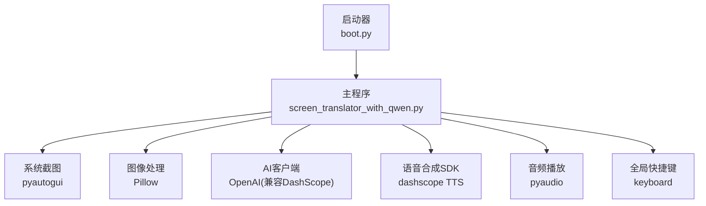
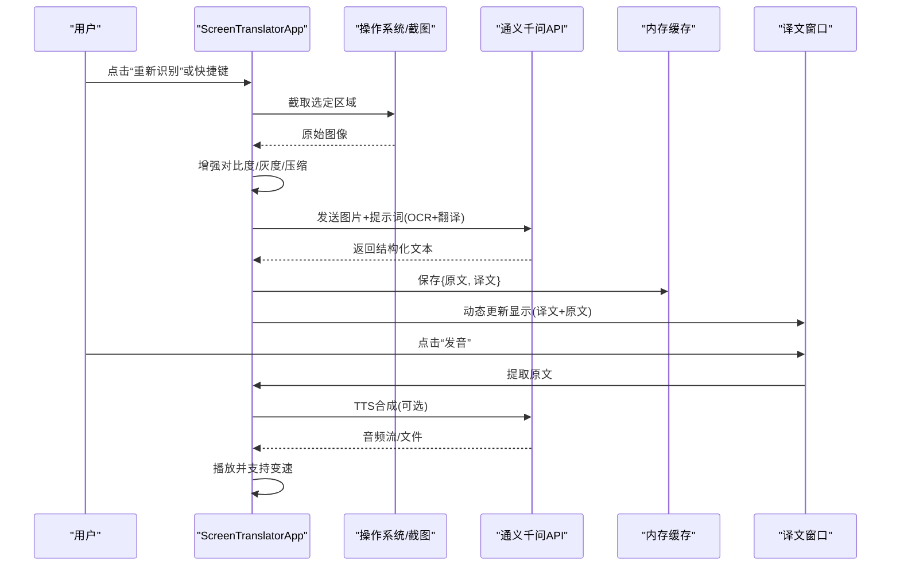
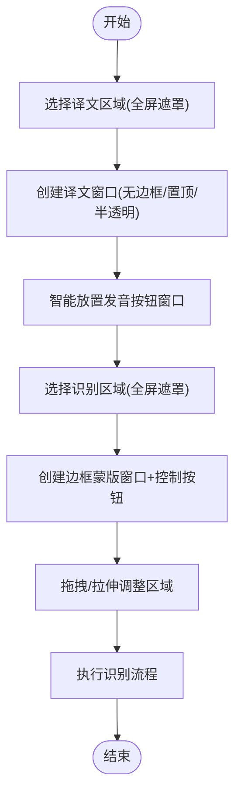
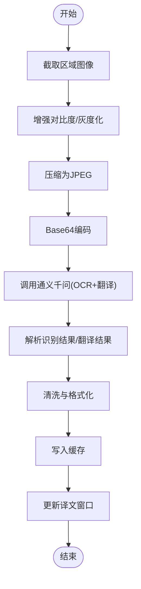
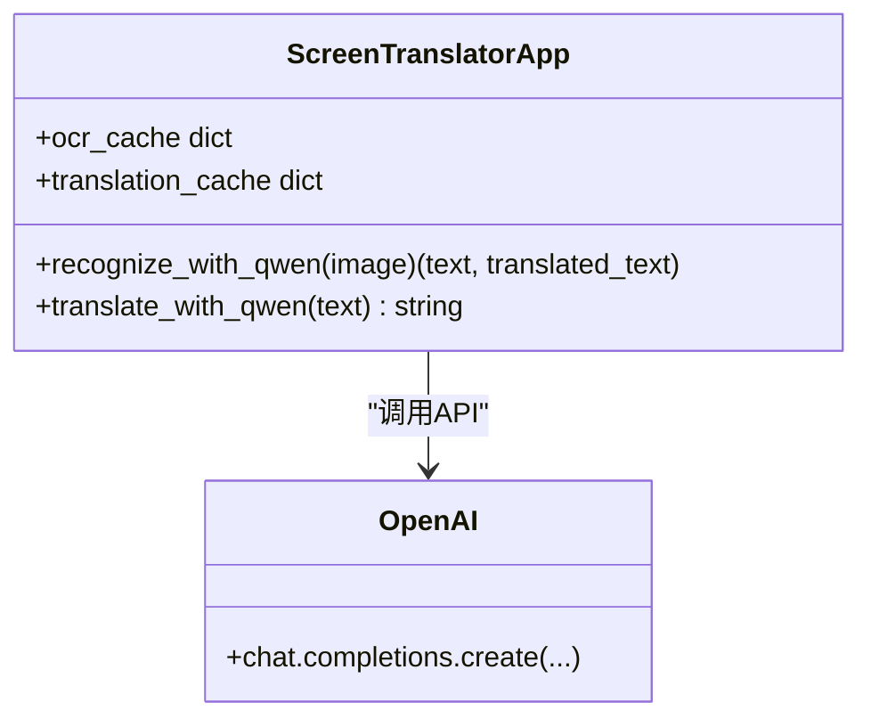
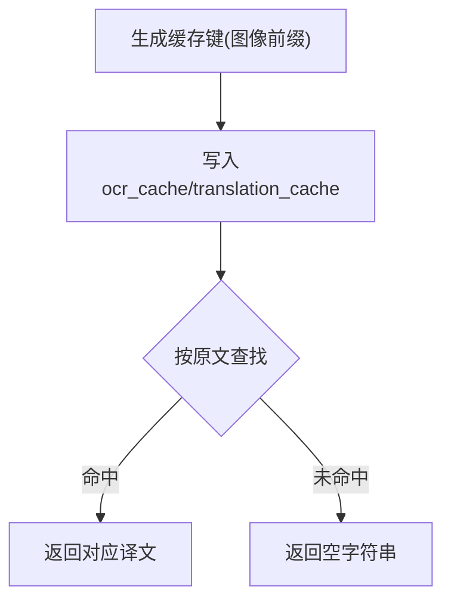
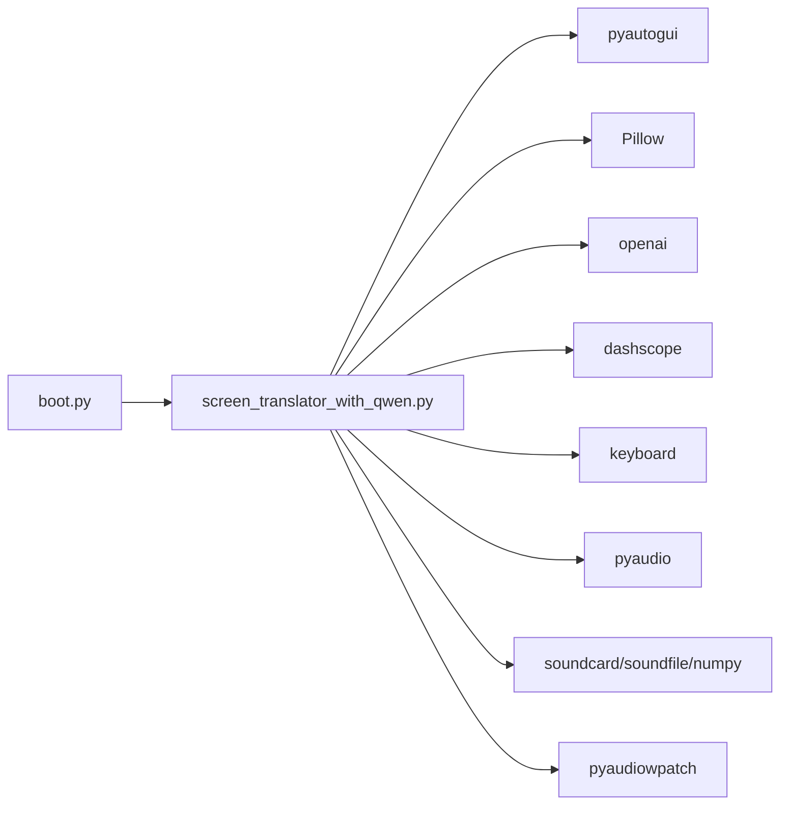

# 实时翻译功能

<cite>
**本文引用的文件**   
- [screen_translator_with_qwen.py](file://screen_translator_with_qwen.py)
- [boot.py](file://boot.py)
- [requirements.txt](file://requirements.txt)
</cite>

## 目录
1. [简介](#简介)
2. [项目结构](#项目结构)
3. [核心组件](#核心组件)
4. [架构总览](#架构总览)
5. [详细组件分析](#详细组件分析)
6. [依赖关系分析](#依赖关系分析)
7. [性能考量](#性能考量)
8. [故障排除指南](#故障排除指南)
9. [结论](#结论)
10. [附录：使用示例与配置选项](#附录使用示例与配置选项)

## 简介
本文件面向“屏幕翻译工具”的实时翻译能力，围绕以下目标展开：
- 翻译区域的创建与管理机制（透明窗口、置顶、无边框、用户交互）
- 文本提取与处理流程（OCR缓存获取原文、清洗与格式化）
- 通义千问翻译API集成（请求参数、多语言支持、批量处理、响应解析）
- 翻译结果展示（动态更新、字体样式、自动换行）
- 翻译缓存策略（缓存键生成、存储结构、清理机制）
- 使用示例与配置项（语言对设置、质量调优、错误重试）
- 性能优化建议与故障排除

## 项目结构
本项目采用单应用主程序 + 启动器的组织方式：
- 启动器 boot.py：负责虚拟环境校验/重建、依赖安装、后台启动主程序
- 主程序 screen_translator_with_qwen.py：实现截图识别、OCR+翻译、UI窗口管理、语音合成与播放、听歌识曲等
- requirements.txt：声明第三方库依赖

图表来源
- [boot.py:256-279](file://boot.py#L256-L279)
- [screen_translator_with_qwen.py:1-20](file://screen_translator_with_qwen.py#L1-L20)

章节来源
- [boot.py:1-279](file://boot.py#L1-L279)
- [requirements.txt:1-31](file://requirements.txt#L1-L31)

## 核心组件
- 界面与应用控制
  - ScreenTranslatorApp：主应用类，负责区域选择、窗口创建、识别与翻译流程、快捷键、音频录制与播放、日志窗口等
  - AIChatWindow：独立的AI对话窗口，可从OCR缓存中读取原文并发起对话
  - LogWindow：独立日志窗口，基于队列异步刷新
- OCR与翻译
  - recognize_area：触发识别流程（截图→压缩→调用通义千问→解析→缓存→更新UI）
  - recognize_with_qwen：封装图像转base64、构造多模态消息、带指数退避的重试、结果解析与缓存写入
  - translate_text / translate_with_qwen：从缓存中按原文匹配返回对应译文
- 窗口与交互
  - create_border_window / create_translate_window：创建无边框、置顶、半透明覆盖层与译文显示窗口
  - 鼠标拖拽/拉伸：translate_window_mouse_* / border_window_mouse_* 系列方法
  - 全局快捷键：register_global_shortcut / on_shortcut_pressed
- 语音与音频
  - speak_original_text：调用TTS合成并播放，支持变速
  - record_system_audio：多方案系统音频录制（soundcard/pyaudiowpatch/pyaudio）
  - play_cosyvoice_wav：本地WAV播放与变速重采样

章节来源
- [screen_translator_with_qwen.py:474-634](file://screen_translator_with_qwen.py#L474-L634)
- [screen_translator_with_qwen.py:713-780](file://screen_translator_with_qwen.py#L713-L780)
- [screen_translator_with_qwen.py:859-926](file://screen_translator_with_qwen.py#L859-L926)
- [screen_translator_with_qwen.py:926-1021](file://screen_translator_with_qwen.py#L926-L1021)
- [screen_translator_with_qwen.py:1021-1097](file://screen_translator_with_qwen.py#L1021-L1097)
- [screen_translator_with_qwen.py:1122-1248](file://screen_translator_with_qwen.py#L1122-L1248)
- [screen_translator_with_qwen.py:1248-1267](file://screen_translator_with_qwen.py#L1248-L1267)
- [screen_translator_with_qwen.py:1442-1557](file://screen_translator_with_qwen.py#L1442-L1557)
- [screen_translator_with_qwen.py:1780-1788](file://screen_translator_with_qwen.py#L1780-L1788)

## 架构总览
整体数据流：用户选择区域 → 截图与预处理 → 调用通义千问进行OCR+翻译 → 解析结果并缓存 → 在透明译文窗口中展示。同时提供发音按钮，将原文部分通过TTS合成并播放。

图表来源
- [screen_translator_with_qwen.py:926-1021](file://screen_translator_with_qwen.py#L926-L1021)
- [screen_translator_with_qwen.py:1122-1248](file://screen_translator_with_qwen.py#L1122-L1248)
- [screen_translator_with_qwen.py:1442-1557](file://screen_translator_with_qwen.py#L1442-L1557)

## 详细组件分析

### 1) 翻译区域创建与管理机制
- 选择译文区域
  - 全屏半透明遮罩用于选择，记录矩形坐标后关闭遮罩
  - 根据坐标创建无边框、置顶、半透明的译文显示窗口，包含状态标签与可自动换行的文本标签
  - 在译文窗口上方/下方智能放置“发音”按钮窗口，避免越界
- 选择识别区域
  - 类似的全屏选择流程，随后创建红色边框的透明蒙版窗口，并在右上角外侧放置“重新识别”按钮窗口
  - 支持拖拽移动与四边/四角拉伸，实时更新当前区域坐标
- 用户交互
  - 鼠标事件：按下、拖动、释放、离开；边缘检测决定光标形状与是否进入拉伸模式
  - ESC取消选择；全局快捷键触发重新识别

图表来源
- [screen_translator_with_qwen.py:634-713](file://screen_translator_with_qwen.py#L634-L713)
- [screen_translator_with_qwen.py:713-780](file://screen_translator_with_qwen.py#L713-L780)
- [screen_translator_with_qwen.py:859-926](file://screen_translator_with_qwen.py#L859-L926)
- [screen_translator_with_qwen.py:1569-1703](file://screen_translator_with_qwen.py#L1569-L1703)

章节来源
- [screen_translator_with_qwen.py:634-713](file://screen_translator_with_qwen.py#L634-L713)
- [screen_translator_with_qwen.py:713-780](file://screen_translator_with_qwen.py#L713-L780)
- [screen_translator_with_qwen.py:859-926](file://screen_translator_with_qwen.py#L859-L926)
- [screen_translator_with_qwen.py:1569-1703](file://screen_translator_with_qwen.py#L1569-L1703)

### 2) 文本提取与处理流程
- 截图与预处理
  - 使用系统截图接口截取指定区域
  - 增强对比度、转换为灰度图、JPEG压缩，减少传输体积
- OCR与翻译一体化
  - 将图像转为base64，构造多模态消息（图片URL+文本提示），要求模型输出“识别结果”和“翻译结果”两部分
  - 解析返回文本，按段落标记拆分并拼接为完整原文与译文
- 文本清洗与格式化
  - 去除空行、合并连续行，保留原始顺序
  - 统一中文冒号分隔符，确保稳定解析
- 线程与UI安全
  - 识别与翻译均在新线程执行，通过主线程回调更新UI状态与内容

图表来源
- [screen_translator_with_qwen.py:926-1021](file://screen_translator_with_qwen.py#L926-L1021)
- [screen_translator_with_qwen.py:1098-1122](file://screen_translator_with_qwen.py#L1098-L1122)
- [screen_translator_with_qwen.py:1122-1248](file://screen_translator_with_qwen.py#L1122-L1248)

章节来源
- [screen_translator_with_qwen.py:926-1021](file://screen_translator_with_qwen.py#L926-L1021)
- [screen_translator_with_qwen.py:1098-1122](file://screen_translator_with_qwen.py#L1098-L1122)
- [screen_translator_with_qwen.py:1122-1248](file://screen_translator_with_qwen.py#L1122-L1248)

### 3) 通义千问翻译API集成
- 客户端初始化
  - 从本地key.txt读取密钥，使用OpenAI兼容模式连接DashScope端点
- 请求参数与多语言支持
  - 模型：qwen3.6-flash
  - 消息体：image_url（base64 data URL）+ text（提示词要求输出“识别结果”和“翻译结果”）
  - 多语言：由提示词驱动，默认翻译为中文；可通过修改提示词扩展其他目标语言
- 批量翻译处理
  - 当前实现为单次OCR+翻译；批量场景可在上层循环调用recognize_with_qwen，结合缓存避免重复计算
- 响应解析
  - 按“识别结果：”“翻译结果：”分段解析，后续非空行追加到对应段落
- 错误处理与重试
  - 最大重试次数与基础延迟；429限流采用指数退避+随机抖动；401/413等错误直接抛出明确异常

图表来源
- [screen_translator_with_qwen.py:338-360](file://screen_translator_with_qwen.py#L338-L360)
- [screen_translator_with_qwen.py:1122-1248](file://screen_translator_with_qwen.py#L1122-L1248)
- [screen_translator_with_qwen.py:1248-1267](file://screen_translator_with_qwen.py#L1248-L1267)

章节来源
- [screen_translator_with_qwen.py:338-360](file://screen_translator_with_qwen.py#L338-L360)
- [screen_translator_with_qwen.py:1122-1248](file://screen_translator_with_qwen.py#L1122-L1248)
- [screen_translator_with_qwen.py:1248-1267](file://screen_translator_with_qwen.py#L1248-L1267)

### 4) 翻译结果展示机制
- 动态文本更新
  - 识别完成后，译文窗口文本设置为“译文\n\n原文: 原文”，状态标签同步更新
- 字体样式与自动换行
  - 使用固定字体、前景/背景色；wraplength随窗口宽度自适应，保证长文本自动换行
- 窗口布局与交互
  - 无边框、置顶、半透明；支持拖拽与拉伸；按钮窗口跟随主窗口位置变化

章节来源
- [screen_translator_with_qwen.py:713-780](file://screen_translator_with_qwen.py#L713-L780)
- [screen_translator_with_qwen.py:994-1001](file://screen_translator_with_qwen.py#L994-L1001)
- [screen_translator_with_qwen.py:1688-1703](file://screen_translator_with_qwen.py#L1688-L1703)

### 5) 翻译缓存策略
- 缓存键生成
  - 使用图像base64前缀作为键，兼顾唯一性与长度限制
- 存储结构
  - ocr_cache：键→原文
  - translation_cache：键→译文
- 查询与命中
  - translate_with_qwen遍历ocr_cache，按原文精确匹配，命中则返回对应译文
- 清理机制
  - 当前未实现定时清理；建议在进程退出时或达到阈值时清理，避免内存增长

图表来源
- [screen_translator_with_qwen.py:1207-1213](file://screen_translator_with_qwen.py#L1207-L1213)
- [screen_translator_with_qwen.py:1248-1267](file://screen_translator_with_qwen.py#L1248-L1267)

章节来源
- [screen_translator_with_qwen.py:1207-1213](file://screen_translator_with_qwen.py#L1207-L1213)
- [screen_translator_with_qwen.py:1248-1267](file://screen_translator_with_qwen.py#L1248-L1267)

### 6) 语音合成与播放（辅助能力）
- 语音合成
  - 调用DashScope TTS，流式接收音频块，落盘为WAV
- 播放与变速
  - 使用pyaudio播放，支持线性插值变速；新音频重置速度模式，每次点击切换正常/0.75倍速
- 停止与恢复
  - 通过Event控制停止；播放结束后恢复状态标签

章节来源
- [screen_translator_with_qwen.py:1442-1557](file://screen_translator_with_qwen.py#L1442-L1557)
- [screen_translator_with_qwen.py:372-473](file://screen_translator_with_qwen.py#L372-L473)

## 依赖关系分析
- 启动器与主程序
  - boot.py负责虚拟环境管理与无控制台启动主程序
- 主程序外部依赖
  - pyautogui：截图
  - Pillow：图像处理
  - openai：通义千问兼容API
  - dashscope：语音合成
  - keyboard：全局快捷键
  - pyaudio：音频播放
  - soundcard/soundfile/numpy：系统音频录制
  - pyaudiowpatch：Windows WASAPI环回（蓝牙耳机支持）

图表来源
- [boot.py:256-279](file://boot.py#L256-L279)
- [requirements.txt:1-31](file://requirements.txt#L1-L31)

章节来源
- [boot.py:1-279](file://boot.py#L1-L279)
- [requirements.txt:1-31](file://requirements.txt#L1-L31)

## 性能考量
- 图像压缩与格式转换
  - 先增强对比度再灰度化，最后以较低质量JPEG压缩，显著降低网络传输开销
- 请求重试与退避
  - 指数退避+随机抖动应对429限流，提高稳定性
- 线程与UI分离
  - 识别/翻译/TTS均在后台线程执行，避免阻塞主线程
- 缓存命中
  - 相同原文直接返回译文，避免重复调用API
- 窗口渲染
  - 无边框+半透明可减少绘制负担；wraplength自适应避免频繁重排

[本节为通用指导，不直接分析具体文件]

## 故障排除指南
- API密钥无效或过期
  - 现象：401/Unauthorized
  - 处理：检查key.txt内容与权限，确保路径正确
- 请求过于频繁
  - 现象：429 Too Many Requests
  - 处理：等待指数退避后的重试；必要时降低频率
- 请求体过大
  - 现象：413 Payload Too Large
  - 处理：缩小识别区域或降低图像质量
- 无法录制系统音频
  - 现象：所有录音方案失败
  - 处理：优先安装pyaudiowpatch；若使用蓝牙耳机，切换到内置扬声器或有线耳机；或在Windows中启用立体声混音
- 全局快捷键不可用
  - 现象：注册失败或无响应
  - 处理：确认已安装keyboard库；检查是否有冲突快捷键

章节来源
- [screen_translator_with_qwen.py:1242-1247](file://screen_translator_with_qwen.py#L1242-L1247)
- [screen_translator_with_qwen.py:1780-1788](file://screen_translator_with_qwen.py#L1780-L1788)
- [screen_translator_with_qwen.py:1798-1851](file://screen_translator_with_qwen.py#L1798-L1851)

## 结论
该实时翻译功能通过“截图→OCR+翻译→缓存→透明窗口展示”的闭环，实现了低侵入、高可用的屏幕文本翻译体验。其关键优势在于：
- 稳定的API集成与重试机制
- 灵活的窗口管理与用户交互
- 高效的缓存与多线程架构
- 可扩展的语音与音频能力

未来可考虑引入更细粒度的缓存清理策略、更多目标语言配置以及更丰富的提示词模板，以提升翻译质量与用户体验。

[本节为总结性内容，不直接分析具体文件]

## 附录：使用示例与配置选项

### 基本使用步骤
- 启动程序
  - 双击运行启动器，自动完成虚拟环境与依赖检查，后台启动主程序
- 选择译文区域
  - 点击“选择译文区域”，在全屏遮罩上拖拽确定矩形，自动生成透明译文窗口
- 选择识别区域
  - 点击“选择识别区域”，在全屏遮罩上拖拽确定矩形，自动生成边框蒙版与控制按钮
- 执行识别与翻译
  - 点击“重新识别”或按下全局快捷键，系统将截图、调用API并更新译文窗口
- 发音
  - 点击译文窗口上方的“发音”按钮，将原文部分合成语音并播放，支持切换速度

章节来源
- [boot.py:256-279](file://boot.py#L256-L279)
- [screen_translator_with_qwen.py:634-713](file://screen_translator_with_qwen.py#L634-L713)
- [screen_translator_with_qwen.py:859-926](file://screen_translator_with_qwen.py#L859-L926)
- [screen_translator_with_qwen.py:926-1021](file://screen_translator_with_qwen.py#L926-L1021)
- [screen_translator_with_qwen.py:1442-1557](file://screen_translator_with_qwen.py#L1442-L1557)

### 配置选项
- API密钥
  - 在根目录创建key.txt，写入DashScope兼容模式的访问密钥
- 快捷键
  - 在主界面输入框设置自定义快捷键，点击“设置”后生效
- 翻译语言对
  - 当前默认翻译为中文；如需其他语言，可在提示词中指定目标语言（需修改相应逻辑）
- 质量调优
  - 调节图像压缩质量与对比度增强系数，平衡识别准确率与传输耗时
- 错误重试
  - 调整最大重试次数与基础延迟，适配不同网络条件

章节来源
- [screen_translator_with_qwen.py:338-360](file://screen_translator_with_qwen.py#L338-L360)
- [screen_translator_with_qwen.py:1145-1147](file://screen_translator_with_qwen.py#L1145-L1147)
- [screen_translator_with_qwen.py:1734-1768](file://screen_translator_with_qwen.py#L1734-L1768)