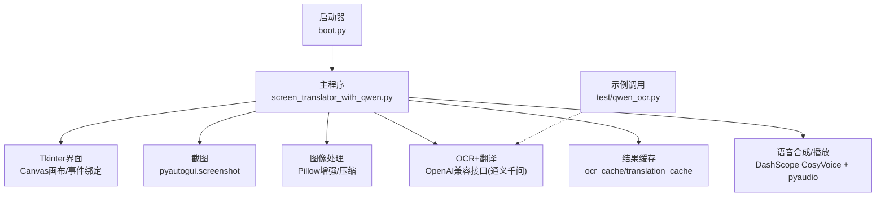
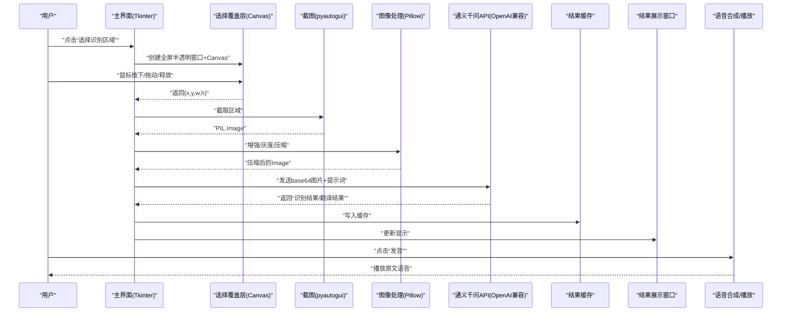
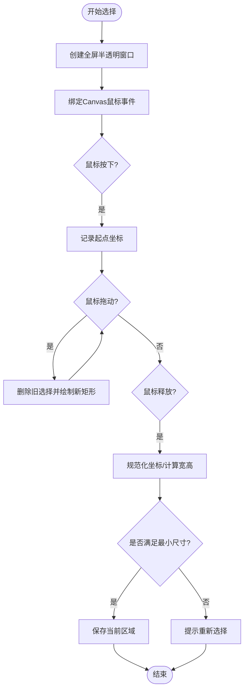
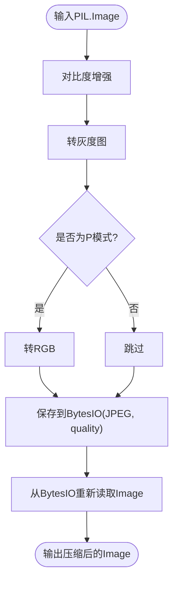
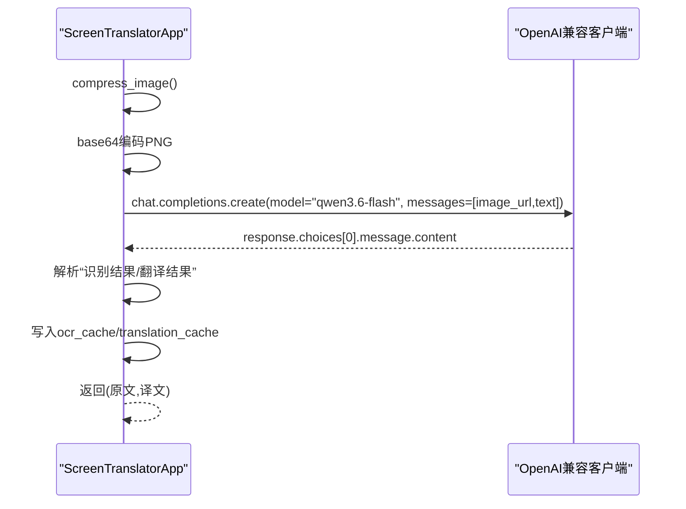
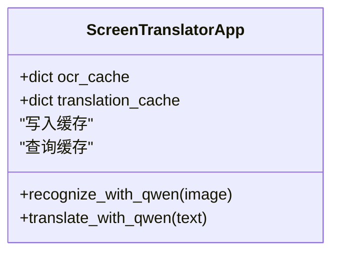
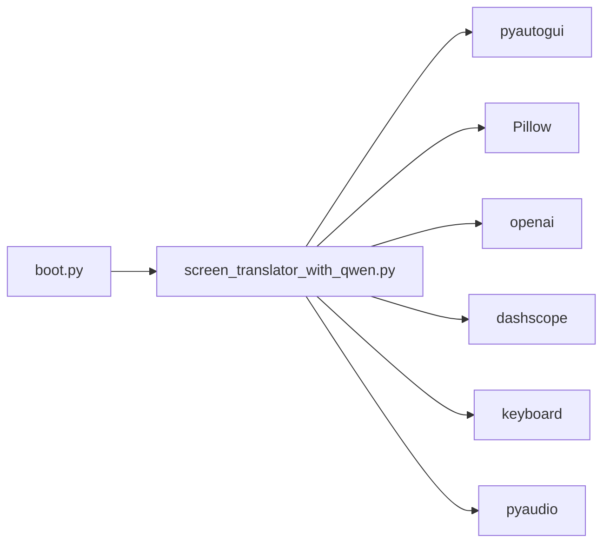

# 屏幕区域选择与OCR识别

<cite>
**本文引用的文件**   
- [screen_translator_with_qwen.py](file://screen_translator_with_qwen.py)
- [boot.py](file://boot.py)
- [requirements.txt](file://requirements.txt)
- [qwen_ocr.py](file://test/qwen_ocr.py)
</cite>

## 目录
1. [简介](#简介)
2. [项目结构](#项目结构)
3. [核心组件](#核心组件)
4. [架构总览](#架构总览)
5. [详细组件分析](#详细组件分析)
6. [依赖关系分析](#依赖关系分析)
7. [性能考虑](#性能考虑)
8. [故障排查指南](#故障排查指南)
9. [结论](#结论)
10. [附录](#附录)

## 简介
本项目实现了一个“屏幕区域选择 + OCR识别 + 翻译 + 语音合成”的桌面工具。用户通过全屏半透明覆盖窗口框选屏幕区域，程序截取该区域图像，进行预处理后调用通义千问AI进行OCR识别与翻译，并在独立的无边框窗口中展示结果，同时支持原文发音、快捷键重识别、日志查看等辅助功能。

## 项目结构
- 启动器 boot.py：自动检测主程序、管理虚拟环境、后台运行目标脚本（Windows无控制台）。
- 主程序 screen_translator_with_qwen.py：包含完整的UI交互、区域选择、截图、图像处理、OCR/翻译API调用、缓存、音频播放与TTS等功能。
- 测试示例 test/qwen_ocr.py：演示如何以OpenAI兼容接口调用通义千问模型进行图文理解。
- 依赖 requirements.txt：列出pyautogui、Pillow、openai、dashscope、keyboard、pyaudio等关键库。

图表来源
- [boot.py:256-279](file://boot.py#L256-L279)
- [screen_translator_with_qwen.py:474-634](file://screen_translator_with_qwen.py#L474-L634)
- [screen_translator_with_qwen.py:927-1021](file://screen_translator_with_qwen.py#L927-L1021)
- [screen_translator_with_qwen.py:1098-1122](file://screen_translator_with_qwen.py#L1098-L1122)
- [screen_translator_with_qwen.py:1123-1248](file://screen_translator_with_qwen.py#L1123-L1248)
- [screen_translator_with_qwen.py:1442-1556](file://screen_translator_with_qwen.py#L1442-L1556)
- [qwen_ocr.py:1-30](file://test/qwen_ocr.py#L1-L30)

章节来源
- [boot.py:256-279](file://boot.py#L256-L279)
- [requirements.txt:1-31](file://requirements.txt#L1-L31)

## 核心组件
- 全屏选择与实时绘制：基于Tkinter Canvas的全屏半透明覆盖层，处理鼠标按下、拖动、释放事件，实时绘制选择矩形并计算坐标。
- 截图与预处理：使用pyautogui截取选定区域；Pillow进行对比度增强、灰度化、格式转换与JPEG压缩，降低传输体积。
- OCR与翻译：通过OpenAI兼容客户端调用通义千问多模态模型，将PNG图片base64编码为data URL发送，解析返回文本中的“识别结果/翻译结果”。
- 结果缓存：以图像前缀作为键，保存原文与译文，避免重复请求。
- 输出与交互：无边框显示窗口展示翻译结果与原文，支持拖拽/缩放、滚动、发音按钮；提供全局快捷键重识别。
- 语音合成与播放：调用CosyVoice生成WAV，本地循环播放并支持变速切换。

章节来源
- [screen_translator_with_qwen.py:635-713](file://screen_translator_with_qwen.py#L635-L713)
- [screen_translator_with_qwen.py:781-858](file://screen_translator_with_qwen.py#L781-L858)
- [screen_translator_with_qwen.py:1098-1122](file://screen_translator_with_qwen.py#L1098-L1122)
- [screen_translator_with_qwen.py:1123-1248](file://screen_translator_with_qwen.py#L1123-L1248)
- [screen_translator_with_qwen.py:1207-1213](file://screen_translator_with_qwen.py#L1207-L1213)
- [screen_translator_with_qwen.py:1442-1556](file://screen_translator_with_qwen.py#L1442-L1556)

## 架构总览
系统由“UI交互层、图像处理层、OCR/翻译服务层、缓存层、音频层”组成。UI负责区域选择与结果展示；图像处理负责增强与压缩；OCR/翻译通过OpenAI兼容接口访问通义千问；缓存用于去重；音频层负责TTS与播放。

图表来源
- [screen_translator_with_qwen.py:781-858](file://screen_translator_with_qwen.py#L781-L858)
- [screen_translator_with_qwen.py:927-1021](file://screen_translator_with_qwen.py#L927-L1021)
- [screen_translator_with_qwen.py:1098-1122](file://screen_translator_with_qwen.py#L1098-L1122)
- [screen_translator_with_qwen.py:1123-1248](file://screen_translator_with_qwen.py#L1123-L1248)
- [screen_translator_with_qwen.py:1442-1556](file://screen_translator_with_qwen.py#L1442-L1556)

## 详细组件分析

### 全屏半透明选择机制（Canvas + 鼠标事件）
- 选择流程
  - 创建全屏TopLevel窗口，设置透明度与置顶属性，背景黑色。
  - 在窗口内放置Canvas，绑定鼠标左键按下、拖动、释放事件，以及ESC退出。
  - 按下记录起点；拖动时删除旧选择标记并重绘白色矩形；释放时计算最终坐标并校验最小尺寸。
- 关键点
  - 使用tags='selection'统一清理与重绘，避免闪烁。
  - 坐标规范化确保x1<=x2, y1<=y2。
  - ESC取消选择，防止卡死。

图表来源
- [screen_translator_with_qwen.py:781-858](file://screen_translator_with_qwen.py#L781-L858)
- [screen_translator_with_qwen.py:810-858](file://screen_translator_with_qwen.py#L810-L858)

章节来源
- [screen_translator_with_qwen.py:781-858](file://screen_translator_with_qwen.py#L781-L858)

### 图像预处理流程（Pillow增强与压缩）
- 步骤
  - 对比度增强：使用ImageEnhance.Contrast提升对比度，提高文字清晰度。
  - 灰度化：转换为灰度图，减少颜色干扰。
  - 模式转换：若为P模式需转为RGB，以便JPEG保存。
  - 内存压缩：保存到BytesIO，以JPEG质量参数压缩，再读回为Image对象。
- 复杂度与影响
  - 时间复杂度近似O(W×H)，空间复杂度O(W×H)。
  - 显著降低网络传输大小，但过度压缩可能影响识别精度，建议根据场景调整quality。

图表来源
- [screen_translator_with_qwen.py:1098-1122](file://screen_translator_with_qwen.py#L1098-L1122)

章节来源
- [screen_translator_with_qwen.py:1098-1122](file://screen_translator_with_qwen.py#L1098-L1122)

### 通义千问OCR识别完整流程（API调用、编码、解析、错误处理）
- 初始化
  - 从key.txt读取API密钥，构造OpenAI兼容客户端，base_url指向阿里云百炼兼容端点。
- 请求构建
  - 将压缩后的PNG图像保存为BytesIO，base64编码，拼接为data:image/png;base64,...的URL。
  - 构造messages数组，包含image_url与text提示词，要求返回“识别结果/翻译结果”两段文本。
- 响应解析
  - 按行扫描，定位“识别结果：”和“翻译结果：”，提取冒号后内容，合并后续非空行为对应段落。
- 重试与错误处理
  - 指数退避+随机抖动应对429限流；对401/413等错误给出明确提示；超过最大重试次数抛出异常。
- 线程安全
  - 所有UI更新通过root.after在主线程执行；中间检查ai_interaction_active标志以支持中止。

图表来源
- [screen_translator_with_qwen.py:339-360](file://screen_translator_with_qwen.py#L339-L360)
- [screen_translator_with_qwen.py:1123-1248](file://screen_translator_with_qwen.py#L1123-L1248)
- [qwen_ocr.py:1-30](file://test/qwen_ocr.py#L1-L30)

章节来源
- [screen_translator_with_qwen.py:339-360](file://screen_translator_with_qwen.py#L339-L360)
- [screen_translator_with_qwen.py:1123-1248](file://screen_translator_with_qwen.py#L1123-L1248)
- [qwen_ocr.py:1-30](file://test/qwen_ocr.py#L1-L30)

### OCR结果缓存机制（数据结构、过期策略、内存管理）
- 数据结构
  - ocr_cache: dict[str, str]，键为图像base64前缀，值为识别原文。
  - translation_cache: dict[str, str]，键同上，值为翻译结果。
- 命中逻辑
  - translate_with_qwen遍历ocr_cache匹配原文，命中则直接返回对应译文。
- 过期策略
  - 当前未实现显式过期或LRU淘汰，仅按图像前缀去重。
- 内存管理
  - 建议增加容量上限与定期清理策略，避免长期运行导致内存增长。

图表来源
- [screen_translator_with_qwen.py:1207-1213](file://screen_translator_with_qwen.py#L1207-L1213)
- [screen_translator_with_qwen.py:1249-1266](file://screen_translator_with_qwen.py#L1249-L1266)

章节来源
- [screen_translator_with_qwen.py:1207-1213](file://screen_translator_with_qwen.py#L1207-L1213)
- [screen_translator_with_qwen.py:1249-1266](file://screen_translator_with_qwen.py#L1249-L1266)

### 自定义选择区域样式、识别精度优化与性能调优
- 自定义选择区域样式
  - 修改选择框outline颜色与width，例如将白色改为高对比色，便于不同背景可见性。
  - 参考路径：[screen_translator_with_qwen.py:816-824](file://screen_translator_with_qwen.py#L816-L824)
- 调整识别精度
  - 调整compress_image的quality参数，平衡体积与清晰度；可尝试保留彩色模式或适度降低对比度增强倍数。
  - 参考路径：[screen_translator_with_qwen.py:1098-1122](file://screen_translator_with_qwen.py#L1098-L1122)
- 性能优化技巧
  - 合理设置最小选择区域阈值，避免过小区域频繁触发。
  - 控制并发：同一时刻仅允许一次识别任务，避免重复请求。
  - 使用root.after更新UI，避免跨线程调用阻塞。
  - 参考路径：[screen_translator_with_qwen.py:927-1021](file://screen_translator_with_qwen.py#L927-L1021)

章节来源
- [screen_translator_with_qwen.py:816-824](file://screen_translator_with_qwen.py#L816-L824)
- [screen_translator_with_qwen.py:1098-1122](file://screen_translator_with_qwen.py#L1098-L1122)
- [screen_translator_with_qwen.py:927-1021](file://screen_translator_with_qwen.py#L927-L1021)

### 常见问题解决方案（多显示器、高DPI、性能）
- 多显示器支持
  - 当前选择基于全屏窗口与相对坐标，建议在多显示器环境下确认坐标系一致性；必要时结合屏幕分辨率信息校正起始坐标。
- 高DPI适配
  - Tkinter在高DPI下可能出现缩放问题，可在应用启动时启用DPI感知或调整字体与控件尺寸。
- 性能优化
  - 降低图像quality、限制最大识别区域尺寸、减少不必要的UI刷新频率。
  - 使用异步或队列方式批量处理日志与状态更新，避免卡顿。

[本节为通用指导，不直接分析具体文件]

## 依赖关系分析
- 启动器与主程序
  - boot.py自动检测同目录下唯一.py作为目标程序，创建/更新虚拟环境，并以无控制台方式启动主程序。
- 主程序依赖
  - pyautogui：屏幕截图
  - Pillow：图像处理
  - openai：通义千问兼容接口
  - dashscope：语音合成SDK
  - keyboard：全局快捷键
  - pyaudio：音频播放
- 外部服务
  - 通义千问（DashScope兼容端点）
  - CosyVoice语音合成

图表来源
- [boot.py:256-279](file://boot.py#L256-L279)
- [requirements.txt:1-31](file://requirements.txt#L1-L31)

章节来源
- [boot.py:256-279](file://boot.py#L256-L279)
- [requirements.txt:1-31](file://requirements.txt#L1-L31)

## 性能考虑
- 图像预处理
  - 对比度增强与灰度化有助于提升OCR准确率，但会增加CPU开销；建议根据场景权衡。
- 网络请求
  - 指数退避与随机抖动有效缓解限流；建议在上层做请求节流与失败快速失败策略。
- UI渲染
  - 大量频繁的after回调可能导致卡顿，应合并状态更新与减少重绘次数。
- 内存占用
  - 缓存未设上限，长时间运行可能累积；建议引入LRU或定时清理。

[本节为通用指导，不直接分析具体文件]

## 故障排查指南
- API密钥无效或过期
  - 现象：401 Unauthorized
  - 处理：检查key.txt内容与权限，确保base_url正确。
  - 参考路径：[screen_translator_with_qwen.py:1242-1247](file://screen_translator_with_qwen.py#L1242-L1247)
- 请求体过大
  - 现象：413 Payload Too Large
  - 处理：减小识别区域或降低图像quality。
  - 参考路径：[screen_translator_with_qwen.py:1244-1247](file://screen_translator_with_qwen.py#L1244-L1247)
- 请求过于频繁
  - 现象：429 Too Many Requests
  - 处理：等待指数退避时间后重试；降低调用频率。
  - 参考路径：[screen_translator_with_qwen.py:1224-1234](file://screen_translator_with_qwen.py#L1224-L1234)
- 语音合成失败
  - 现象：无法生成或播放cosyvoice.wav
  - 处理：检查网络与API Key；确认文件存在且未被占用；清理旧文件。
  - 参考路径：[screen_translator_with_qwen.py:363-371](file://screen_translator_with_qwen.py#L363-L371), [screen_translator_with_qwen.py:1510-1556](file://screen_translator_with_qwen.py#L1510-L1556)

章节来源
- [screen_translator_with_qwen.py:1224-1247](file://screen_translator_with_qwen.py#L1224-L1247)
- [screen_translator_with_qwen.py:363-371](file://screen_translator_with_qwen.py#L363-L371)
- [screen_translator_with_qwen.py:1510-1556](file://screen_translator_with_qwen.py#L1510-L1556)

## 结论
本方案通过全屏半透明Canvas选择、Pillow预处理与通义千问OCR/翻译能力，实现了高效的屏幕文字识别与翻译工作流。其优势在于易用性与可扩展性，同时具备完善的错误处理与用户体验细节。未来可进一步优化缓存策略、多显示器/DPI适配与性能瓶颈，以提升稳定性与吞吐。

[本节为总结，不直接分析具体文件]

## 附录
- 代码片段路径（不含代码内容）
  - 全屏选择与绘制：[screen_translator_with_qwen.py:781-858](file://screen_translator_with_qwen.py#L781-L858)
  - 鼠标事件处理：[screen_translator_with_qwen.py:810-858](file://screen_translator_with_qwen.py#L810-L858)
  - 图像预处理：[screen_translator_with_qwen.py:1098-1122](file://screen_translator_with_qwen.py#L1098-L1122)
  - OCR/翻译API调用与解析：[screen_translator_with_qwen.py:1123-1248](file://screen_translator_with_qwen.py#L1123-L1248)
  - 结果缓存写入与读取：[screen_translator_with_qwen.py:1207-1213](file://screen_translator_with_qwen.py#L1207-L1213), [screen_translator_with_qwen.py:1249-1266](file://screen_translator_with_qwen.py#L1249-L1266)
  - 语音合成与播放：[screen_translator_with_qwen.py:1510-1556](file://screen_translator_with_qwen.py#L1510-L1556)
  - 启动器与依赖管理：[boot.py:256-279](file://boot.py#L256-L279), [requirements.txt:1-31](file://requirements.txt#L1-L31)
  - 通义千问示例调用：[qwen_ocr.py:1-30](file://test/qwen_ocr.py#L1-L30)