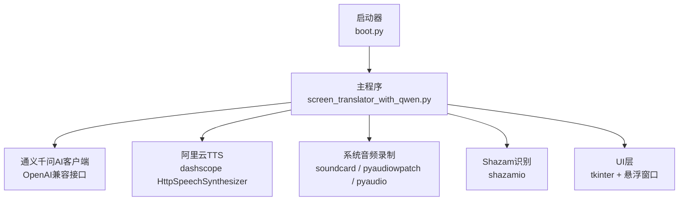
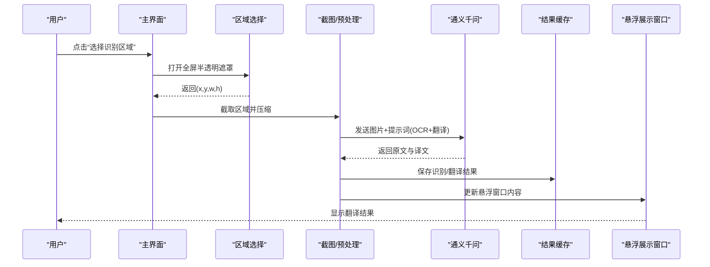
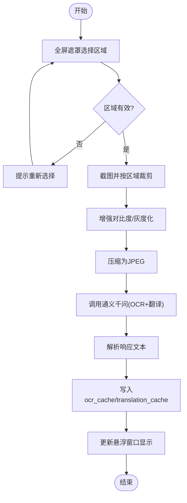
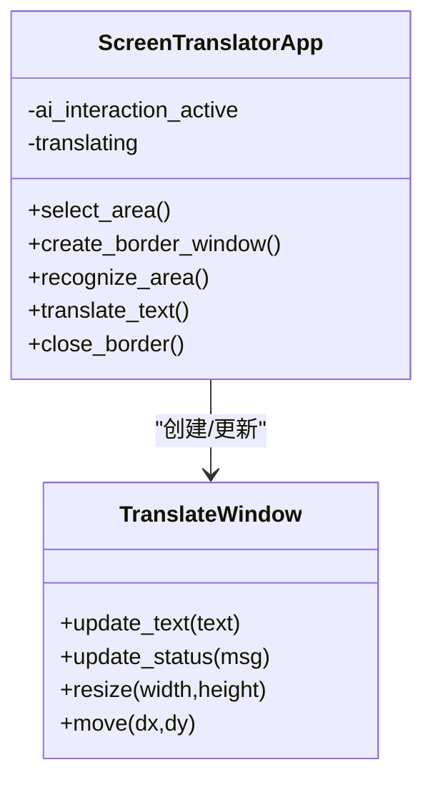
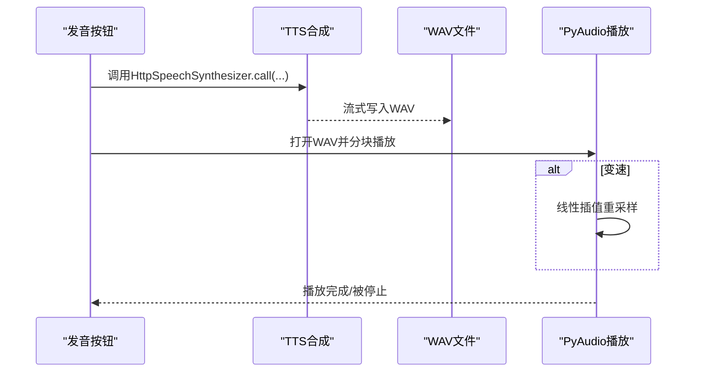
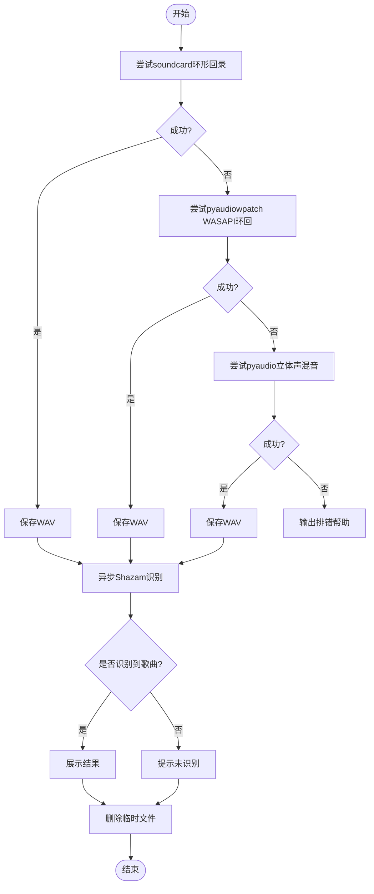
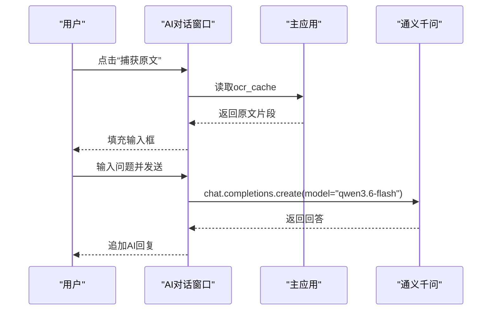
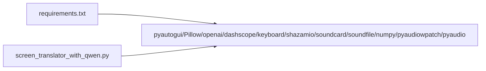

# 核心功能

<cite>
**本文引用的文件**   
- [screen_translator_with_qwen.py](file://screen_translator_with_qwen.py)
- [boot.py](file://boot.py)
- [requirements.txt](file://requirements.txt)
- [qwen_ocr.py](file://test/qwen_ocr.py)
- [shazam_test.py](file://test/shazam_test.py)
- [cosyvoice.py](file://test/cosyvoice.py)
- [label_scroll_example.py](file://test/label_scroll_example.py)
- [overlay_fullscreen_game.py](file://test/overlay_fullscreen_game.py)
</cite>

## 目录
1. [简介](#简介)
2. [项目结构](#项目结构)
3. [核心组件](#核心组件)
4. [架构总览](#架构总览)
5. [详细组件分析](#详细组件分析)
6. [依赖关系分析](#依赖关系分析)
7. [性能与优化建议](#性能与优化建议)
8. [故障排查指南](#故障排查指南)
9. [结论](#结论)
10. [附录：使用示例与配置](#附录使用示例与配置)

## 简介
本项目是一个桌面端屏幕翻译工具，提供以下核心能力：
- 屏幕区域选择与OCR识别：全屏半透明遮罩选择、图像预处理、通义千问AI识别与翻译、结果缓存。
- 实时翻译展示：在悬浮窗口中显示原文与译文，支持拖拽、缩放、置顶。
- 语音合成与播放：阿里云CosyVoice TTS流式合成WAV，本地PyAudio播放，支持变速。
- 听歌识曲：系统音频录制（soundcard/pyaudiowpatch/pyaudio三种方案），Shazam API识别。
- AI对话助手：聊天界面、原文捕获、消息历史、错误处理。

## 项目结构
- 启动器 boot.py：自动检测主程序、管理虚拟环境、后台无控制台启动目标脚本。
- 主程序 screen_translator_with_qwen.py：实现所有核心功能。
- requirements.txt：声明第三方依赖。
- test 目录：包含若干独立示例与测试脚本，用于验证各子系统。

图表来源
- [boot.py:256-279](file://boot.py#L256-L279)
- [screen_translator_with_qwen.py:338-360](file://screen_translator_with_qwen.py#L338-L360)
- [screen_translator_with_qwen.py:1509-1556](file://screen_translator_with_qwen.py#L1509-L1556)
- [screen_translator_with_qwen.py:1789-1851](file://screen_translator_with_qwen.py#L1789-L1851)
- [screen_translator_with_qwen.py:2233-2270](file://screen_translator_with_qwen.py#L2233-L2270)

章节来源
- [boot.py:1-279](file://boot.py#L1-L279)
- [requirements.txt:1-31](file://requirements.txt#L1-L31)

## 核心组件
- 区域选择与识别流程：全屏半透明遮罩选择区域 -> 截图 -> 图像增强与压缩 -> 调用通义千问进行OCR+翻译 -> 结果写入缓存并展示。
- 悬浮展示与交互：无边框置顶窗口、可拖拽/缩放、按钮浮动定位、状态提示。
- 语音合成与播放：流式TTS生成WAV -> PyAudio分块播放 -> 线性插值变速。
- 听歌识曲：多方案系统音频录制 -> 异步Shazam识别 -> 结果展示。
- AI对话助手：独立聊天窗口、Ctrl+Enter发送、原文捕获、线程安全UI更新、错误分类提示。

章节来源
- [screen_translator_with_qwen.py:635-713](file://screen_translator_with_qwen.py#L635-L713)
- [screen_translator_with_qwen.py:781-857](file://screen_translator_with_qwen.py#L781-L857)
- [screen_translator_with_qwen.py:927-1021](file://screen_translator_with_qwen.py#L927-L1021)
- [screen_translator_with_qwen.py:1098-1122](file://screen_translator_with_qwen.py#L1098-L1122)
- [screen_translator_with_qwen.py:1123-1248](file://screen_translator_with_qwen.py#L1123-L1248)
- [screen_translator_with_qwen.py:1442-1556](file://screen_translator_with_qwen.py#L1442-L1556)
- [screen_translator_with_qwen.py:1789-1851](file://screen_translator_with_qwen.py#L1789-L1851)
- [screen_translator_with_qwen.py:2233-2270](file://screen_translator_with_qwen.py#L2233-L2270)
- [screen_translator_with_qwen.py:101-300](file://screen_translator_with_qwen.py#L101-L300)

## 架构总览
整体采用“UI驱动 + 多线程 + 外部API”的架构：
- UI层：tkinter构建主界面与多个悬浮子窗口，负责用户交互与状态展示。
- 业务逻辑层：封装区域选择、截图、图像处理、OCR/翻译、TTS、录音、识别等流程。
- 外部服务：通义千问（OCR/翻译/对话）、阿里云TTS、Shazam。
- 并发控制：通过标志位与线程避免重复操作，使用事件循环运行异步识别。

图表来源
- [screen_translator_with_qwen.py:781-857](file://screen_translator_with_qwen.py#L781-L857)
- [screen_translator_with_qwen.py:927-1021](file://screen_translator_with_qwen.py#L927-L1021)
- [screen_translator_with_qwen.py:1123-1248](file://screen_translator_with_qwen.py#L1123-L1248)
- [screen_translator_with_qwen.py:714-780](file://screen_translator_with_qwen.py#L714-L780)

## 详细组件分析

### 屏幕区域选择与OCR识别
- 全屏半透明遮罩：创建全屏Topmost窗口，透明度较低，便于观察背景；Canvas绘制矩形选区。
- 坐标归一化与最小尺寸校验：确保x1<=x2, y1<=y2，且宽高大于阈值。
- 截图与预处理：pyautogui.screenshot按区域截图；Pillow增加对比度、灰度化、JPEG压缩，降低请求体积。
- OCR与翻译：将图片转为base64，调用通义千问模型，解析结构化输出（识别结果/翻译结果）。
- 结果缓存：以图片前缀作为键，分别保存原文与译文，后续翻译直接命中缓存。
- 异常与重试：对429限流指数退避+随机抖动；对401/413等错误给出明确提示。

图表来源
- [screen_translator_with_qwen.py:781-857](file://screen_translator_with_qwen.py#L781-L857)
- [screen_translator_with_qwen.py:1098-1122](file://screen_translator_with_qwen.py#L1098-L1122)
- [screen_translator_with_qwen.py:1123-1248](file://screen_translator_with_qwen.py#L1123-L1248)

章节来源
- [screen_translator_with_qwen.py:781-857](file://screen_translator_with_qwen.py#L781-L857)
- [screen_translator_with_qwen.py:927-1021](file://screen_translator_with_qwen.py#L927-L1021)
- [screen_translator_with_qwen.py:1098-1122](file://screen_translator_with_qwen.py#L1098-L1122)
- [screen_translator_with_qwen.py:1123-1248](file://screen_translator_with_qwen.py#L1123-L1248)

### 实时翻译与悬浮展示
- 悬浮窗口：无边框、置顶、半透明，支持鼠标拖拽与边缘缩放；按钮窗口智能定位（上/下/内）避免越界。
- 文本布局：Label自适应换行，wraplength随窗口宽度动态调整。
- 状态反馈：识别/翻译进行中、完成、失败均有状态标签更新。
- 中止机制：全局标志位控制中断当前任务，防止重复触发。

图表来源
- [screen_translator_with_qwen.py:714-780](file://screen_translator_with_qwen.py#L714-L780)
- [screen_translator_with_qwen.py:1570-1703](file://screen_translator_with_qwen.py#L1570-L1703)
- [screen_translator_with_qwen.py:1410-1441](file://screen_translator_with_qwen.py#L1410-L1441)

章节来源
- [screen_translator_with_qwen.py:714-780](file://screen_translator_with_qwen.py#L714-L780)
- [screen_translator_with_qwen.py:1570-1703](file://screen_translator_with_qwen.py#L1570-L1703)
- [screen_translator_with_qwen.py:1410-1441](file://screen_translator_with_qwen.py#L1410-L1441)

### 语音合成功能（阿里云TTS + WAV播放 + 变速）
- 合成流程：HttpSpeechSynthesizer流式调用，逐段接收音频数据，合并后落盘为WAV。
- 播放流程：PyAudio打开输出流，读取WAV分块写入；若需要变速，先将样本解码为数组，线性插值重采样，再编码回字节流播放。
- 控制策略：支持停止事件中断播放；每次新合成重置速度模式；UI状态同步。

图表来源
- [screen_translator_with_qwen.py:1442-1556](file://screen_translator_with_qwen.py#L1442-L1556)
- [screen_translator_with_qwen.py:372-473](file://screen_translator_with_qwen.py#L372-L473)

章节来源
- [screen_translator_with_qwen.py:1442-1556](file://screen_translator_with_qwen.py#L1442-L1556)
- [screen_translator_with_qwen.py:372-473](file://screen_translator_with_qwen.py#L372-L473)

### 听歌识曲（系统音频录制 + Shazam）
- 录制方案优先级：
  1) soundcard环形回录（默认扬声器设备）
  2) pyaudiowpatch WASAPI环回（支持蓝牙耳机）
  3) pyaudio立体声混音（需系统启用Stereo Mix）
- 识别流程：录制约8秒音频到临时WAV -> 异步调用Shazam识别 -> 解析歌曲信息 -> 清理临时文件 -> 更新UI。
- 错误处理：记录每种方案的失败原因，并提供用户级排错指引。

图表来源
- [screen_translator_with_qwen.py:1789-1851](file://screen_translator_with_qwen.py#L1789-L1851)
- [screen_translator_with_qwen.py:2233-2270](file://screen_translator_with_qwen.py#L2233-L2270)

章节来源
- [screen_translator_with_qwen.py:1789-1851](file://screen_translator_with_qwen.py#L1789-L1851)
- [screen_translator_with_qwen.py:2233-2270](file://screen_translator_with_qwen.py#L2233-L2270)

### AI对话助手
- 界面设计：输入区在上、聊天记录在下；支持Ctrl+Enter发送；消息按角色着色。
- 原文捕获：从ocr_cache聚合最近识别的原文，填充至输入框。
- 消息历史：滚动显示，自动滚动到底部。
- 错误处理：区分401/429等错误码，友好提示；线程安全更新UI。

图表来源
- [screen_translator_with_qwen.py:101-300](file://screen_translator_with_qwen.py#L101-L300)
- [screen_translator_with_qwen.py:338-360](file://screen_translator_with_qwen.py#L338-L360)

章节来源
- [screen_translator_with_qwen.py:101-300](file://screen_translator_with_qwen.py#L101-L300)
- [screen_translator_with_qwen.py:338-360](file://screen_translator_with_qwen.py#L338-L360)

## 依赖关系分析
- 关键依赖：
  - 屏幕截图：pyautogui
  - 图像处理：Pillow
  - 音频播放：pyaudio
  - OpenAI兼容客户端：openai（用于通义千问）
  - 阿里云TTS：dashscope
  - 键盘监听：keyboard（全局快捷键）
  - 听歌识曲：shazamio、audioop-lts
  - 系统音频录制：soundcard、soundfile、numpy、pyaudiowpatch
- 可选依赖：当对应库缺失时，相关功能会降级或不可用，并在日志中提示。

图表来源
- [requirements.txt:1-31](file://requirements.txt#L1-L31)
- [screen_translator_with_qwen.py:314-336](file://screen_translator_with_qwen.py#L314-L336)

章节来源
- [requirements.txt:1-31](file://requirements.txt#L1-L31)
- [screen_translator_with_qwen.py:314-336](file://screen_translator_with_qwen.py#L314-L336)

## 性能与优化建议
- 图像预处理：已做对比度增强与灰度化，有助于提升OCR准确率；压缩质量可调，建议在保证识别率的前提下尽量减小体积以降低网络开销。
- 请求重试：对429限流采用指数退避+随机抖动，避免雪崩；可根据实际配额调优最大重试次数与基础延迟。
- 缓存策略：基于图片前缀的缓存键简单高效，但存在碰撞风险；可考虑SHA哈希或更稳定的指纹（如缩略图哈希）提升命中率与唯一性。
- 音频播放：线性插值变速计算量较大，可在长音频场景考虑分段播放或GPU加速；必要时限制最大长度。
- 悬浮窗口：频繁更新UI建议使用root.after调度，避免阻塞主循环；缩放灵敏度已降低，可减少抖动。

[本节为通用指导，不直接分析具体文件]

## 故障排查指南
- 无法识别系统音频：
  - 优先安装pyaudiowpatch以获得WASAPI环回支持（含蓝牙耳机）。
  - 若仅内置扬声器/有线耳机可用，可尝试soundcard环形回录。
  - 最后尝试pyaudio立体声混音，需在Windows声音设置中启用“立体声混音”。
- 语音合成失败：
  - 检查key.txt中的API密钥是否正确，以及网络连通性。
  - 确认dashscope版本满足要求。
- OCR/翻译失败：
  - 401：检查API密钥。
  - 413：识别区域过大，请缩小区域。
  - 429：等待一段时间后再试。
- 悬浮窗口置顶失效：
  - 某些全屏游戏可能覆盖顶层窗口，可参考测试脚本中的WinAPI强制置顶策略。

章节来源
- [screen_translator_with_qwen.py:1789-1851](file://screen_translator_with_qwen.py#L1789-L1851)
- [screen_translator_with_qwen.py:1215-1248](file://screen_translator_with_qwen.py#L1215-L1248)
- [overlay_fullscreen_game.py:110-133](file://test/overlay_fullscreen_game.py#L110-L133)

## 结论
本工具围绕“屏幕区域选择+OCR+翻译+语音+听歌识曲+AI对话”形成完整闭环，具备较强的实用性与扩展性。通过合理的并发控制、错误处理与用户体验优化，能够在多种环境下稳定工作。未来可进一步引入更稳健的缓存键策略、更高效的变速算法与更丰富的语言/音色支持。

[本节为总结，不直接分析具体文件]

## 附录：使用示例与配置

- 启动方式
  - 双击运行boot.py，它将自动检测同目录下唯一的主程序并后台启动。
  - 首次运行会自动创建虚拟环境并安装依赖；若requirements变更，将增量更新或重建。

- 配置项
  - API密钥：在项目根目录创建key.txt，写入通义千问API Key。
  - 快捷键：在主界面输入框设置全局快捷键，用于快速重新识别。
  - 语音音色与模型：默认使用cosyvoice-v3-flash与longanhuan音色，可按需修改。

- 使用示例路径
  - 通义千问OCR示例：[qwen_ocr.py](file://test/qwen_ocr.py)
  - 听歌识曲示例：[shazam_test.py](file://test/shazam_test.py)
  - 语音合成示例：[cosyvoice.py](file://test/cosyvoice.py)
  - 可滚动Label示例：[label_scroll_example.py](file://test/label_scroll_example.py)
  - 全屏悬浮窗口示例：[overlay_fullscreen_game.py](file://test/overlay_fullscreen_game.py)

章节来源
- [boot.py:256-279](file://boot.py#L256-L279)
- [screen_translator_with_qwen.py:338-360](file://screen_translator_with_qwen.py#L338-L360)
- [screen_translator_with_qwen.py:1734-1788](file://screen_translator_with_qwen.py#L1734-L1788)
- [test/qwen_ocr.py:1-30](file://test/qwen_ocr.py#L1-L30)
- [test/shazam_test.py:1-66](file://test/shazam_test.py#L1-L66)
- [test/cosyvoice.py:1-40](file://test/cosyvoice.py#L1-L40)
- [test/label_scroll_example.py:1-61](file://test/label_scroll_example.py#L1-L61)
- [test/overlay_fullscreen_game.py:1-427](file://test/overlay_fullscreen_game.py#L1-L427)