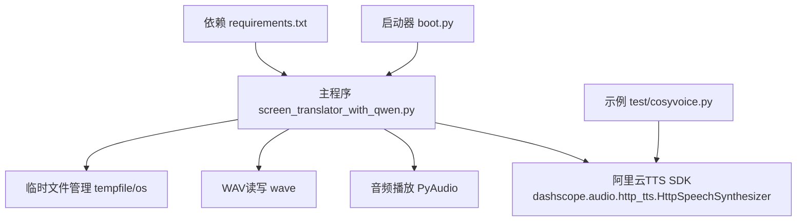
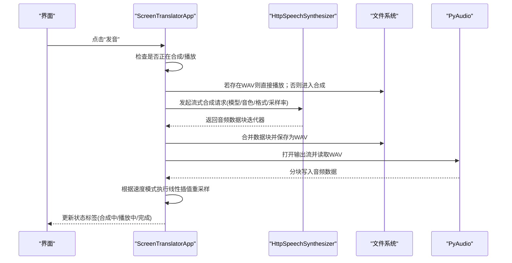
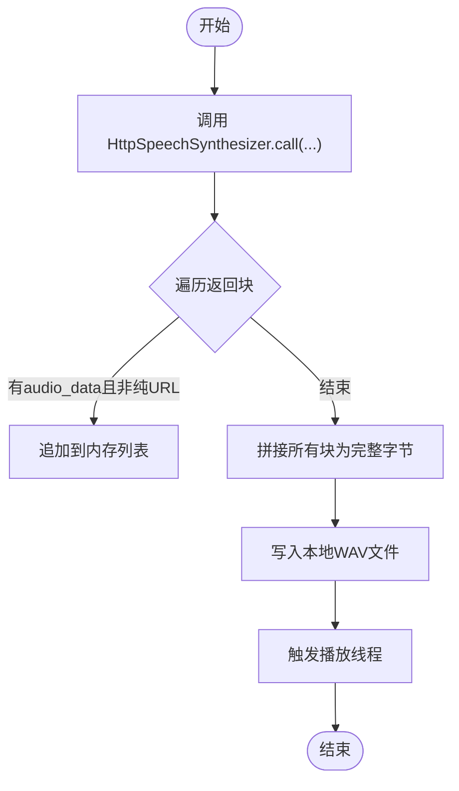
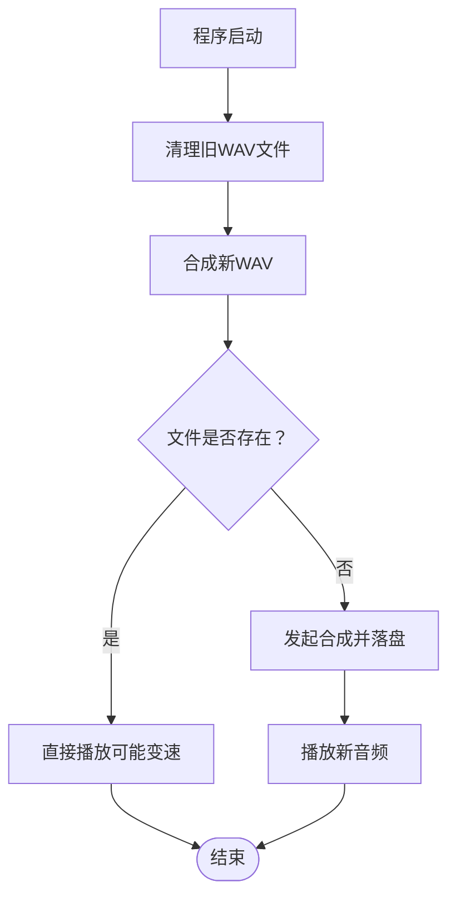
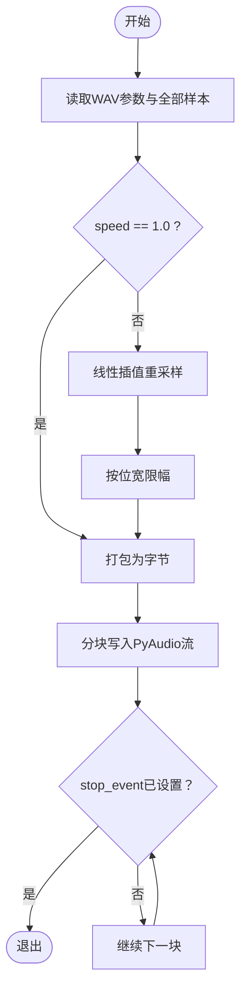
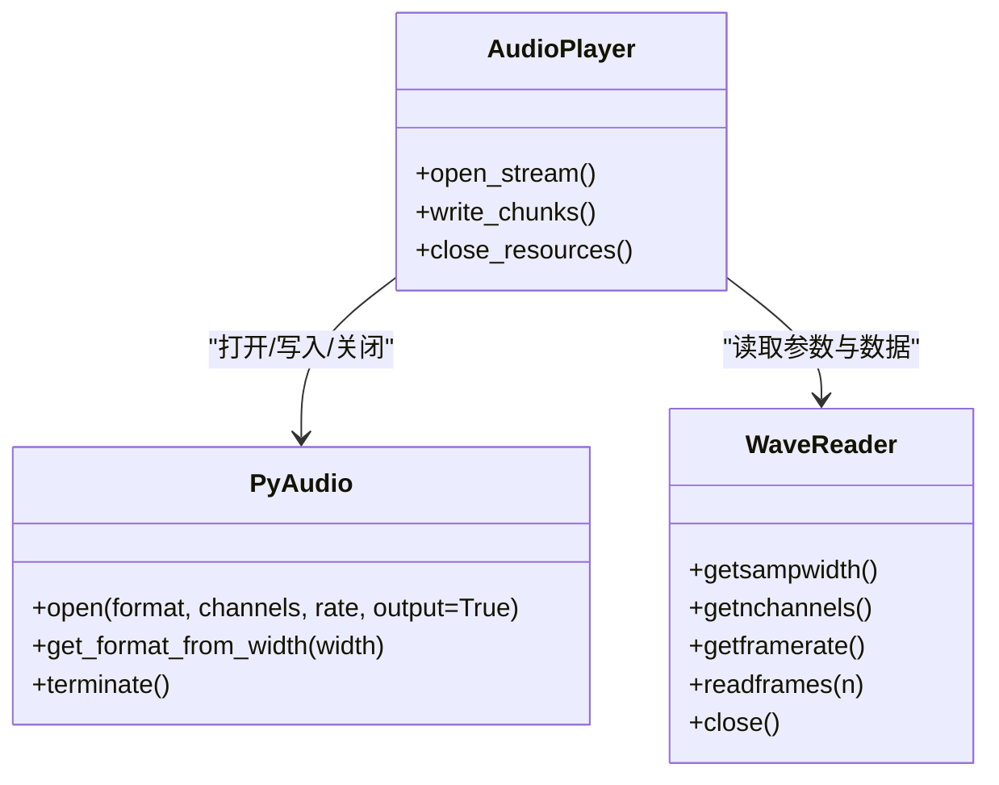
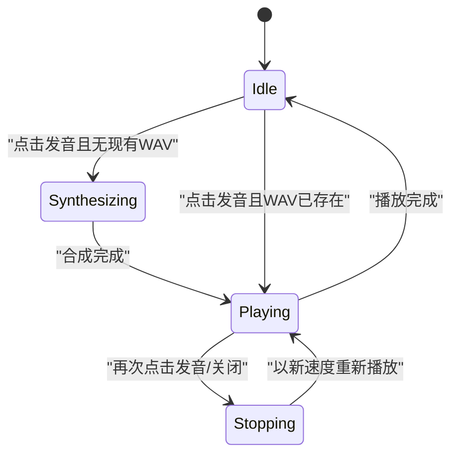
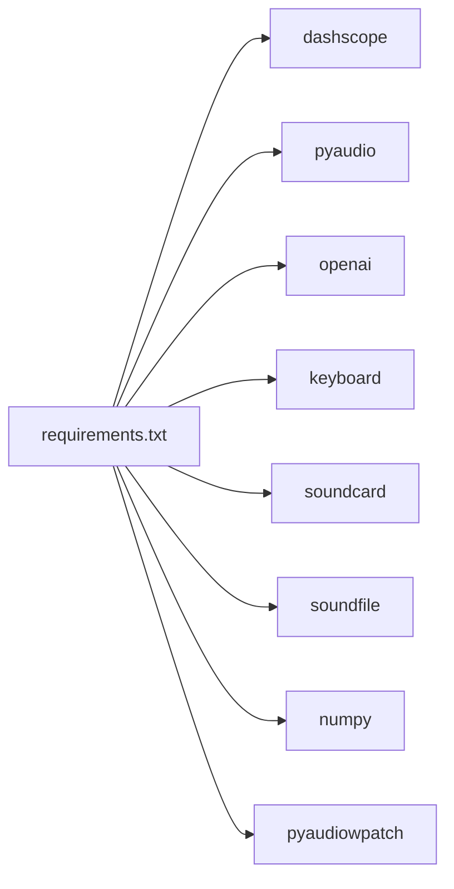

# 语音合成功能

<cite>
**本文引用的文件**   
- [screen_translator_with_qwen.py](file://screen_translator_with_qwen.py)
- [boot.py](file://boot.py)
- [requirements.txt](file://requirements.txt)
- [cosyvoice.py](file://test/cosyvoice.py)
</cite>

## 目录
1. [简介](#简介)
2. [项目结构](#项目结构)
3. [核心组件](#核心组件)
4. [架构总览](#架构总览)
5. [详细组件分析](#详细组件分析)
6. [依赖关系分析](#依赖关系分析)
7. [性能与优化](#性能与优化)
8. [故障排查指南](#故障排查指南)
9. [结论](#结论)
10. [附录：使用示例与最佳实践](#附录使用示例与最佳实践)

## 简介
本技术文档聚焦于“语音合成功能”，围绕阿里云TTS（DashScope CosyVoice）的集成实现、WAV文件生成与管理、变速播放算法、PyAudio音频流处理、播放状态管理与多线程控制，以及跨平台兼容性与性能优化进行系统化说明。读者可据此理解从文本到语音的合成流程、本地播放与变速策略，以及如何扩展自定义参数与效果。

## 项目结构
本项目为桌面端屏幕翻译工具，语音合成作为其中一项能力被集成在主程序中。关键入口与启动器如下：
- 主程序：包含界面、OCR/翻译、语音合成与播放等逻辑
- 启动器：负责虚拟环境检测与依赖安装，并后台运行目标程序
- 依赖清单：声明了语音合成与音频播放所需库
- 测试示例：提供独立的TTS调用示例脚本

图表来源
- [boot.py:256-279](file://boot.py#L256-L279)
- [screen_translator_with_qwen.py:1-20](file://screen_translator_with_qwen.py#L1-L20)
- [requirements.txt:1-31](file://requirements.txt#L1-L31)
- [cosyvoice.py:1-40](file://test/cosyvoice.py#L1-L40)

章节来源
- [boot.py:256-279](file://boot.py#L256-L279)
- [requirements.txt:1-31](file://requirements.txt#L1-L31)
- [screen_translator_with_qwen.py:1-20](file://screen_translator_with_qwen.py#L1-L20)
- [cosyvoice.py:1-40](file://test/cosyvoice.py#L1-L40)

## 核心组件
- 阿里云TTS集成：通过HttpSpeechSynthesizer.call发起流式合成请求，按块接收音频数据并落盘为WAV
- WAV文件管理：固定文件名、启动时清理旧文件、合成完成后写入、播放结束后保留以便重复播放
- 变速播放：基于线性插值的重采样算法，支持正常速度与0.75倍速切换
- PyAudio播放：打开输出流、分块写入、停止事件控制与资源释放
- 播放状态管理：线程化合成与播放、Event停止信号、UI线程安全更新

章节来源
- [screen_translator_with_qwen.py:361-473](file://screen_translator_with_qwen.py#L361-L473)
- [screen_translator_with_qwen.py:1442-1569](file://screen_translator_with_qwen.py#L1442-L1569)
- [requirements.txt:9-16](file://requirements.txt#L9-L16)

## 架构总览
下图展示了从用户点击“发音”到最终播放完成的端到端流程，包括合成、落盘、播放与状态同步。

图表来源
- [screen_translator_with_qwen.py:1442-1569](file://screen_translator_with_qwen.py#L1442-L1569)
- [screen_translator_with_qwen.py:372-473](file://screen_translator_with_qwen.py#L372-L473)

## 详细组件分析

### 阿里云TTS API集成（HttpSpeechSynthesizer）
- 调用方式：使用流式接口，逐段获取音频数据块，过滤最后一个仅含URL的chunk，避免重复写入
- 关键参数：
  - model：指定CosyVoice模型版本
  - text：待合成文本（应用层做了长度限制）
  - voice：音色名称
  - format：输出格式（wav）
  - sample_rate：采样率（24kHz）
  - stream：启用流式返回
  - api_key：鉴权密钥
- 错误处理：异常捕获后回写UI状态，记录日志

图表来源
- [screen_translator_with_qwen.py:1509-1556](file://screen_translator_with_qwen.py#L1509-L1556)
- [cosyvoice.py:9-40](file://test/cosyvoice.py#L9-L40)

章节来源
- [screen_translator_with_qwen.py:1509-1556](file://screen_translator_with_qwen.py#L1509-L1556)
- [cosyvoice.py:9-40](file://test/cosyvoice.py#L9-L40)

### WAV文件生成与管理机制
- 文件路径：固定工作目录下名为“cosyvoice.wav”的文件
- 生命周期：
  - 程序启动时清理旧文件，避免历史残留
  - 合成成功后覆盖写入
  - 播放过程中不删除，便于重复播放与变速切换
- 清理策略：注册退出钩子，在进程结束时再次尝试清理

图表来源
- [screen_translator_with_qwen.py:361-371](file://screen_translator_with_qwen.py#L361-L371)
- [screen_translator_with_qwen.py:1469-1495](file://screen_translator_with_qwen.py#L1469-L1495)

章节来源
- [screen_translator_with_qwen.py:361-371](file://screen_translator_with_qwen.py#L361-L371)
- [screen_translator_with_qwen.py:1469-1495](file://screen_translator_with_qwen.py#L1469-L1495)

### 变速播放控制算法（重采样与线性插值）
- 输入：WAV文件的原始样本数组（多声道交错）
- 算法要点：
  - 计算新样本数 = 原样本数 / speed
  - 对每个新样本位置，映射到原样本浮点索引
  - 取相邻两个样本做线性插值，得到新样本值
  - 按位宽限制范围（16bit或8bit）
- 复杂度：O(N/speed)，N为原样本数
- 音质保持：线性插值简单高效，适合实时；如需更高保真可考虑Sinc插值或频域方法

图表来源
- [screen_translator_with_qwen.py:372-473](file://screen_translator_with_qwen.py#L372-L473)

章节来源
- [screen_translator_with_qwen.py:372-473](file://screen_translator_with_qwen.py#L372-L473)

### PyAudio音频流处理
- 设备初始化：创建PyAudio实例，根据WAV头信息配置输出流（格式、声道、采样率）
- 流式播放：以固定块大小循环写入，支持中断
- 资源释放：播放完成后关闭流、终止PyAudio、关闭WAV句柄

图表来源
- [screen_translator_with_qwen.py:372-473](file://screen_translator_with_qwen.py#L372-L473)

章节来源
- [screen_translator_with_qwen.py:372-473](file://screen_translator_with_qwen.py#L372-L473)

### 播放状态管理与并发安全
- 状态变量：
  - synthesizing：标记合成进行中
  - playing：标记播放进行中
  - play_stop_event：用于停止播放的事件对象
  - play_thread：播放线程引用
  - speed_mode：速度模式（0=1.0x，1=0.75x），每次点击切换
  - is_new_audio：标记是否为刚合成的新音频，用于重置速度模式
- 并发控制：
  - 合成与播放均在新线程执行，避免阻塞UI
  - 播放前若已有播放任务，先设置停止事件并等待短暂时间
  - UI更新统一通过主线程调度，保证线程安全

图表来源
- [screen_translator_with_qwen.py:1442-1569](file://screen_translator_with_qwen.py#L1442-L1569)

章节来源
- [screen_translator_with_qwen.py:1442-1569](file://screen_translator_with_qwen.py#L1442-L1569)

## 依赖关系分析
- 运行时依赖：
  - dashscope：阿里云TTS SDK
  - pyaudio：音频I/O
  - openai：通义千问客户端（与本功能间接相关）
  - keyboard：全局快捷键（与本功能间接相关）
- 可选依赖：
  - soundcard/soundfile/numpy：系统音频录制（听歌识曲）
  - pyaudiowpatch：Windows WASAPI环回增强

图表来源
- [requirements.txt:1-31](file://requirements.txt#L1-L31)

章节来源
- [requirements.txt:1-31](file://requirements.txt#L1-L31)

## 性能与优化
- 合成阶段
  - 流式接收：减少峰值内存占用，提升首包延迟
  - 文本长度限制：降低网络传输与合成耗时
- 播放阶段
  - 内存一次性加载：适合短语音；长语音建议改为流式解码与边读边播
  - 线性插值：CPU开销低，适合实时；如需更高质量可引入带通滤波或Sinc插值
  - 块大小：当前采用固定块，可根据系统缓冲特性调整以降低卡顿
- 资源管理
  - 及时关闭流与文件句柄，避免资源泄漏
  - 退出时清理临时WAV，避免磁盘堆积

[本节为通用指导，无需具体文件来源]

## 故障排查指南
- 无法合成
  - 检查API密钥是否正确加载
  - 确认网络连通与DashScope服务可用性
  - 查看日志中的错误码（如401、429）
- 无法播放
  - 检查默认输出设备是否可用
  - 确认PyAudio后端驱动安装正确
  - 观察是否有其他进程独占音频设备
- 变速异常
  - 确认speed参数不为0
  - 检查样本位宽与通道数是否与WAV一致
- 文件未清理
  - 检查退出钩子是否执行
  - 手动删除工作目录下的WAV文件

章节来源
- [screen_translator_with_qwen.py:339-360](file://screen_translator_with_qwen.py#L339-L360)
- [screen_translator_with_qwen.py:361-371](file://screen_translator_with_qwen.py#L361-L371)
- [screen_translator_with_qwen.py:1548-1556](file://screen_translator_with_qwen.py#L1548-L1556)

## 结论
该语音合成功能将阿里云TTS与本地播放链路打通，具备基础的变速播放与状态管理能力。整体实现简洁可靠，适合短文本即时播报场景。后续可在长文本流式播放、插值质量与跨平台兼容性方面进一步优化。

[本节为总结性内容，无需具体文件来源]

## 附录：使用示例与最佳实践

### 自定义语音参数
- 修改模型与音色：在合成调用处更换model与voice参数
- 调整采样率与格式：更改sample_rate与format，确保播放器匹配
- 限制文本长度：在传入前截断，避免超长导致超时或失败

章节来源
- [screen_translator_with_qwen.py:1509-1518](file://screen_translator_with_qwen.py#L1509-L1518)
- [cosyvoice.py:9-17](file://test/cosyvoice.py#L9-L17)

### 调整播放速度
- 切换速度模式：每次点击发音按钮在1.0x与0.75x之间循环切换
- 新增速度档位：可扩展为多档（如0.5x、1.25x、1.5x），并在UI显示当前速度

章节来源
- [screen_translator_with_qwen.py:1476-1494](file://screen_translator_with_qwen.py#L1476-L1494)

### 实现音频效果
- 基础限幅与去噪：在插值后加入限幅与简单噪声抑制
- 均衡器：对特定频段增益/衰减，需引入FFT/IFFT或滤波器库
- 混响/压缩：需要额外DSP库支持

[本节为概念性指导，无需具体文件来源]

### 音频格式兼容性与跨平台支持
- 格式：WAV PCM，广泛兼容
- 平台：PyAudio在不同平台后端不同，Windows建议使用pyaudiowpatch以获得更好的环回与蓝牙支持
- 采样率：24kHz适合语音，兼顾清晰度与体积

章节来源
- [requirements.txt:9-16](file://requirements.txt#L9-L16)
- [requirements.txt:25-31](file://requirements.txt#L25-L31)

### 性能优化最佳实践
- 合成：流式接收、文本截断、重试退避
- 播放：大文件流式解码、合理块大小、必要时预缓冲
- 资源：严格关闭流与文件句柄，退出时清理临时文件

章节来源
- [screen_translator_with_qwen.py:1509-1556](file://screen_translator_with_qwen.py#L1509-L1556)
- [screen_translator_with_qwen.py:361-371](file://screen_translator_with_qwen.py#L361-L371)