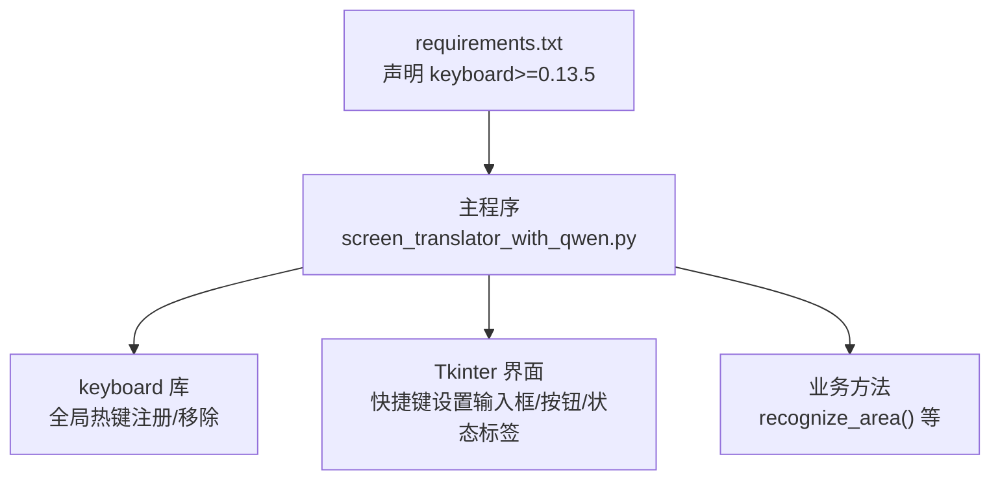
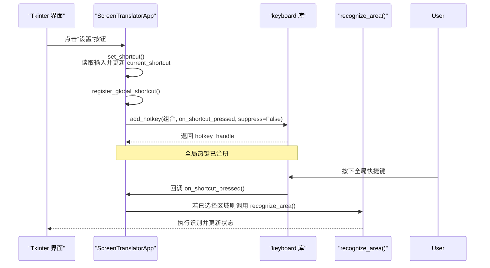
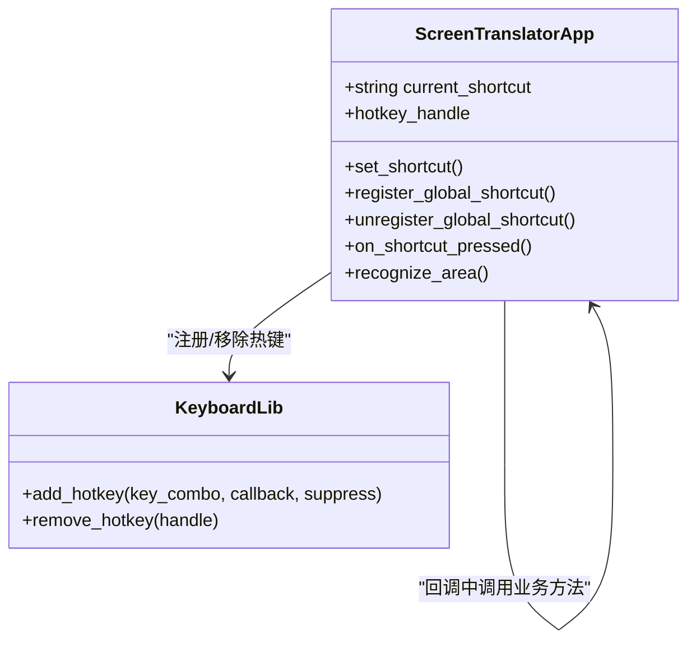
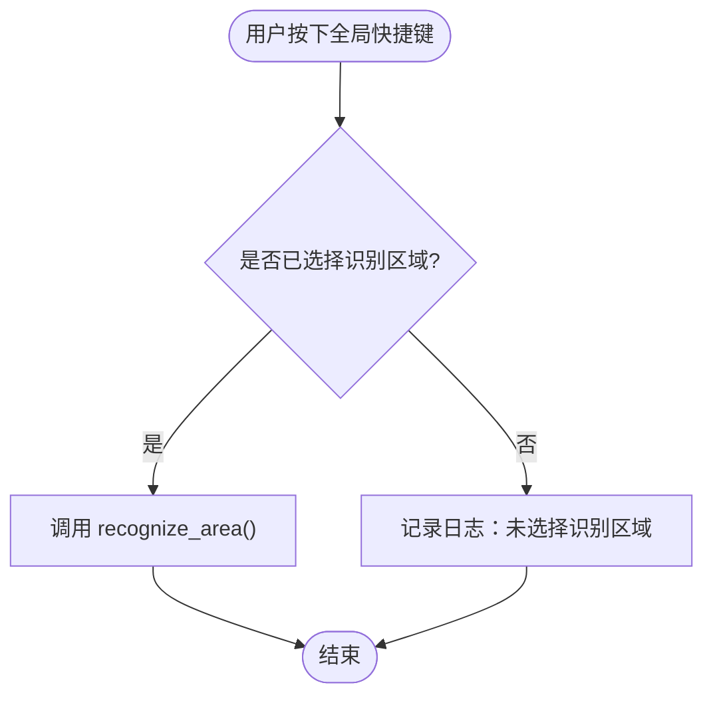
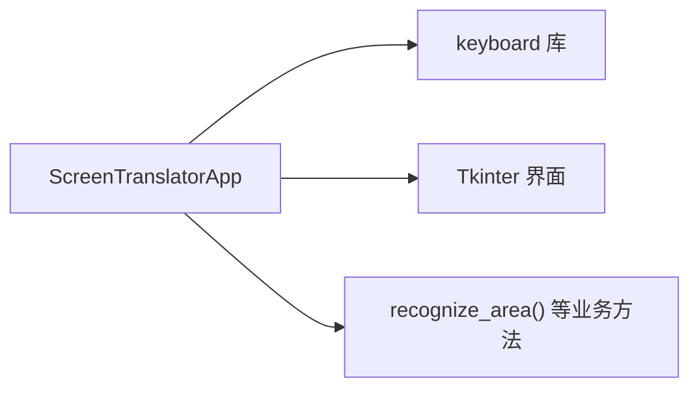

# 全局快捷键

<cite>
**本文引用的文件**   
- [screen_translator_with_qwen.py](file://screen_translator_with_qwen.py)
- [requirements.txt](file://requirements.txt)
</cite>

## 目录
1. [简介](#简介)
2. [项目结构](#项目结构)
3. [核心组件](#核心组件)
4. [架构总览](#架构总览)
5. [详细组件分析](#详细组件分析)
6. [依赖分析](#依赖分析)
7. [性能考虑](#性能考虑)
8. [故障排除指南](#故障排除指南)
9. [结论](#结论)

## 简介
本文件聚焦于“全局快捷键”功能，围绕 keyboard 库的使用与事件监听机制展开，详细说明快捷键注册、事件捕获、跨平台兼容性处理，以及 register_global_shortcut 方法的实现原理（包括绑定、回调处理和冲突检测）。同时给出快捷键配置界面的设计要点（输入框验证、实时预览和用户反馈）、最佳实践（常用组合推荐、系统冲突避免、用户体验优化），并提供常见问题的排查方法。

## 项目结构
本项目为单文件应用，全局快捷键逻辑集中在主程序文件中，依赖通过 requirements.txt 声明。

图表来源
- [screen_translator_with_qwen.py:547-573](file://screen_translator_with_qwen.py#L547-L573)
- [screen_translator_with_qwen.py:1734-1788](file://screen_translator_with_qwen.py#L1734-L1788)
- [requirements.txt:18-19](file://requirements.txt#L18-L19)

章节来源
- [screen_translator_with_qwen.py:547-573](file://screen_translator_with_qwen.py#L547-L573)
- [requirements.txt:18-19](file://requirements.txt#L18-L19)

## 核心组件
- 快捷键设置界面
  - 输入框：用于输入新的快捷键组合（如 F1、Ctrl+Alt+R）
  - 设置按钮：触发 set_shortcut 流程
  - 状态标签：显示当前状态或错误提示
- 快捷键管理
  - register_global_shortcut：注册全局热键，保存句柄
  - unregister_global_shortcut：取消已注册的热键
  - on_shortcut_pressed：快捷键触发的回调，调用识别区域逻辑
- 业务联动
  - recognize_area：被快捷键触发的核心业务方法

章节来源
- [screen_translator_with_qwen.py:547-573](file://screen_translator_with_qwen.py#L547-L573)
- [screen_translator_with_qwen.py:1734-1788](file://screen_translator_with_qwen.py#L1734-L1788)
- [screen_translator_with_qwen.py:927-953](file://screen_translator_with_qwen.py#L927-L953)

## 架构总览
下图展示了从用户操作到全局快捷键生效的完整链路。

图表来源
- [screen_translator_with_qwen.py:1734-1788](file://screen_translator_with_qwen.py#L1734-L1788)
- [screen_translator_with_qwen.py:927-953](file://screen_translator_with_qwen.py#L927-L953)

## 详细组件分析

### 快捷键注册与生命周期
- 初始化阶段
  - 默认快捷键为 F1，界面提供输入框和设置按钮
  - 启动时自动尝试注册全局快捷键
- 动态切换
  - 用户修改快捷键后，先取消旧注册，再按新组合重新注册
- 资源清理
  - 每次注册前都会尝试取消之前的注册，避免重复绑定导致异常或冲突

章节来源
- [screen_translator_with_qwen.py:547-573](file://screen_translator_with_qwen.py#L547-L573)
- [screen_translator_with_qwen.py:1734-1788](file://screen_translator_with_qwen.py#L1734-L1788)

#### 类与方法关系图

图表来源
- [screen_translator_with_qwen.py:1734-1788](file://screen_translator_with_qwen.py#L1734-L1788)
- [screen_translator_with_qwen.py:927-953](file://screen_translator_with_qwen.py#L927-L953)

### register_global_shortcut 实现原理
- 快捷键绑定
  - 使用 keyboard.add_hotkey 将字符串形式的组合键与回调函数绑定
  - 返回句柄保存在实例变量中，便于后续移除
- 回调函数处理
  - on_shortcut_pressed 在检测到按键时触发，检查是否已选择识别区域，若存在则调用 recognize_area
- 冲突检测与容错
  - 注册前先调用 unregister_global_shortcut 确保无残留句柄
  - 捕获 ImportError（未安装 keyboard）与通用异常，记录日志并更新状态标签，避免崩溃
  - suppress=False 表示不屏蔽系统对该按键的处理，降低与其他应用的冲突概率

章节来源
- [screen_translator_with_qwen.py:1753-1788](file://screen_translator_with_qwen.py#L1753-L1788)

### 快捷键配置界面设计
- 输入框验证
  - 读取输入并进行非空校验；为空时提示用户输入
- 实时预览与反馈
  - 设置成功后立即更新状态标签，显示当前快捷键
  - 失败时显示具体错误信息，便于定位问题
- 交互流程
  - 点击“设置”→ 读取输入 → 取消旧注册 → 更新 current_shortcut → 注册新快捷键 → 更新状态

章节来源
- [screen_translator_with_qwen.py:547-573](file://screen_translator_with_qwen.py#L547-L573)
- [screen_translator_with_qwen.py:1734-1788](file://screen_translator_with_qwen.py#L1734-L1788)

### 事件捕获与跨平台兼容性
- 事件捕获
  - keyboard 库在底层维护全局钩子，add_hotkey 会注册系统级监听器
  - 回调运行在主线程上下文之外，但本实现仅调用轻量业务方法，避免阻塞
- 跨平台兼容
  - keyboard 库支持 Windows、macOS、Linux，但不同平台的权限与驱动差异可能导致行为不一致
  - 某些平台可能需要管理员/Root 权限才能注入全局钩子
  - 建议以最小权限原则运行，仅在必要时提升权限

章节来源
- [requirements.txt:18-19](file://requirements.txt#L18-L19)
- [screen_translator_with_qwen.py:1753-1788](file://screen_translator_with_qwen.py#L1753-L1788)

### 快捷键触发流程图

图表来源
- [screen_translator_with_qwen.py:1780-1788](file://screen_translator_with_qwen.py#L1780-L1788)
- [screen_translator_with_qwen.py:927-953](file://screen_translator_with_qwen.py#L927-L953)

## 依赖分析
- 外部依赖
  - keyboard>=0.13.5：提供全局热键注册与事件监听能力
- 内部耦合
  - 主程序对 keyboard 的调用集中在注册/移除热键与回调入口
  - 界面层与业务层通过回调解耦，职责清晰

图表来源
- [screen_translator_with_qwen.py:1734-1788](file://screen_translator_with_qwen.py#L1734-L1788)
- [requirements.txt:18-19](file://requirements.txt#L18-L19)

章节来源
- [requirements.txt:18-19](file://requirements.txt#L18-L19)
- [screen_translator_with_qwen.py:1734-1788](file://screen_translator_with_qwen.py#L1734-L1788)

## 性能考虑
- 注册/移除开销
  - 频繁切换快捷键时应避免不必要的重复注册；当前实现在每次设置前主动取消旧注册，减少内存占用与潜在冲突
- 回调执行时间
  - on_shortcut_pressed 仅做条件判断与一次业务调用，保持轻量，避免阻塞键盘事件循环
- 并发安全
  - 若未来扩展多快捷键或多回调，需关注线程安全与锁机制，防止竞态条件

[本节为通用指导，无需特定文件引用]

## 故障排除指南
- 未安装 keyboard 库
  - 现象：状态标签提示需要安装 keyboard 库
  - 解决：安装依赖（见 requirements.txt）
- 快捷键无效
  - 可能原因：未选择识别区域；快捷键组合被其他应用占用；权限不足
  - 排查步骤：
    - 确认已选择识别区域
    - 更换组合键（如 Ctrl+Alt+R）
    - 以管理员/Root 权限运行程序（视平台要求）
- 注册失败或报错
  - 现象：状态标签显示“快捷键注册失败”
  - 排查：查看日志输出，确认组合键格式正确；检查是否有重复注册导致的句柄异常
- 跨平台差异
  - macOS/Linux 可能需要额外权限或驱动支持；Windows 下部分游戏或全屏应用可能拦截全局钩子
  - 建议：在非独占模式下测试；必要时调整 suppress 参数或改用其他方案

章节来源
- [screen_translator_with_qwen.py:1753-1788](file://screen_translator_with_qwen.py#L1753-L1788)
- [requirements.txt:18-19](file://requirements.txt#L18-L19)

## 结论
本项目的全局快捷键功能基于 keyboard 库实现，采用“注册—回调—业务调用”的清晰链路，具备较好的可维护性与可扩展性。通过合理的输入验证、状态反馈与异常处理，提升了用户体验与稳定性。建议在后续迭代中完善快捷键冲突检测与更丰富的组合键校验，并根据目标平台进行权限与兼容性优化。