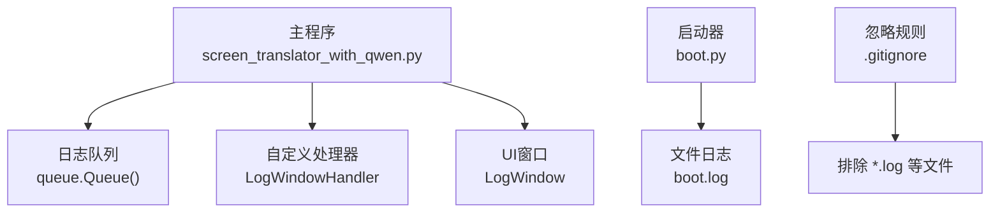
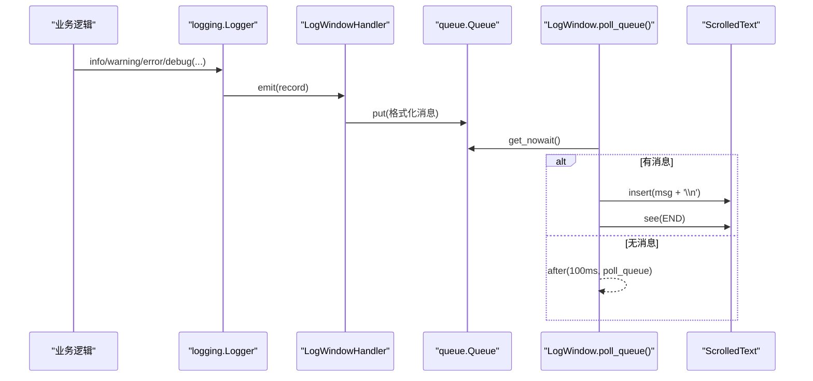
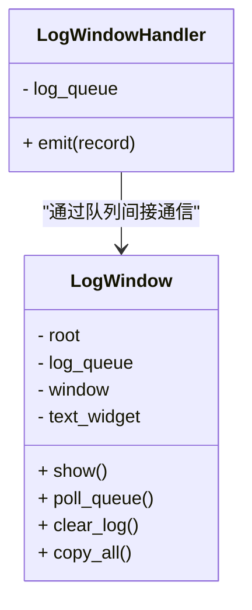
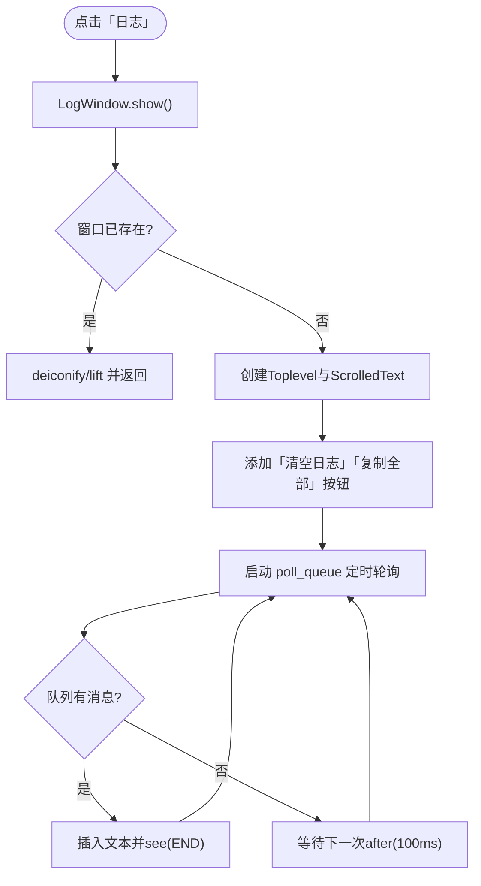
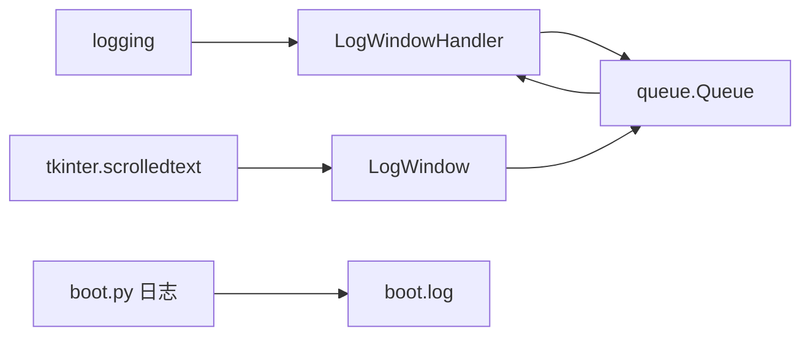

# 日志记录系统

<cite>
**本文引用的文件**   
- [screen_translator_with_qwen.py](file://screen_translator_with_qwen.py)
- [boot.py](file://boot.py)
- [.gitignore](file://.gitignore)
</cite>

## 目录
1. [简介](#简介)
2. [项目结构](#项目结构)
3. [核心组件](#核心组件)
4. [架构总览](#架构总览)
5. [详细组件分析](#详细组件分析)
6. [依赖关系分析](#依赖关系分析)
7. [性能与线程安全](#性能与线程安全)
8. [配置与管理最佳实践](#配置与管理最佳实践)
9. [故障排查指南](#故障排查指南)
10. [结论](#结论)

## 简介
本文件面向屏幕翻译应用的日志子系统，聚焦以下目标：
- 深入解析 LogWindow 类的架构设计：异步日志队列处理、线程安全机制与 UI 更新策略。
- 详细说明 LogWindowHandler 的实现原理：自定义日志处理器、消息格式化与队列管理机制。
- 解释日志级别控制体系：INFO、WARNING、ERROR 的分类处理与界面展示方式。
- 描述用户交互能力：实时滚动显示、清空操作、复制功能（当前未实现搜索过滤）。
- 提供日志配置与管理最佳实践：日志轮转、存储策略与调试技巧。
- 给出日志分析与常见问题解决方案。

## 项目结构
本项目将日志子系统嵌入主程序模块中，核心代码集中在单一脚本内，并通过标准库 logging 进行统一接入。启动器 boot.py 负责应用启动与环境准备，并自带独立的日志输出到文件。

图表来源
- [screen_translator_with_qwen.py:21-100](file://screen_translator_with_qwen.py#L21-L100)
- [screen_translator_with_qwen.py:301-312](file://screen_translator_with_qwen.py#L301-L312)
- [boot.py:28-36](file://boot.py#L28-L36)
- [.gitignore:1-5](file://.gitignore#L1-L5)

章节来源
- [screen_translator_with_qwen.py:21-100](file://screen_translator_with_qwen.py#L21-L100)
- [screen_translator_with_qwen.py:301-312](file://screen_translator_with_qwen.py#L301-L312)
- [boot.py:28-36](file://boot.py#L28-L36)
- [.gitignore:1-5](file://.gitignore#L1-L5)

## 核心组件
- LogWindowHandler：继承自 logging.Handler，负责将日志记录转换为字符串并放入共享队列。
- LogWindow：Tkinter 子窗口，负责从队列消费日志并在 UI 上实时追加显示，提供清空与复制功能。
- 全局日志队列 log_queue：使用 queue.Queue 作为线程安全的消息通道。
- 日志配置：通过 logging.basicConfig 注册 StreamHandler 与 LogWindowHandler，设置基础格式与级别。

章节来源
- [screen_translator_with_qwen.py:21-32](file://screen_translator_with_qwen.py#L21-L32)
- [screen_translator_with_qwen.py:34-100](file://screen_translator_with_qwen.py#L34-L100)
- [screen_translator_with_qwen.py:301-312](file://screen_translator_with_qwen.py#L301-L312)

## 架构总览
整体采用“生产者-消费者”模型：
- 生产者：业务逻辑通过 logger.info/warning/error/debug 产生日志。
- 传输层：LogWindowHandler 将格式化后的消息入队。
- 消费者：LogWindow 在 Tk 事件循环中以固定间隔轮询队列，非阻塞地取出消息并追加到文本控件。

图表来源
- [screen_translator_with_qwen.py:21-32](file://screen_translator_with_qwen.py#L21-L32)
- [screen_translator_with_qwen.py:34-100](file://screen_translator_with_qwen.py#L34-L100)
- [screen_translator_with_qwen.py:301-312](file://screen_translator_with_qwen.py#L301-L312)

## 详细组件分析

### LogWindowHandler：自定义日志处理器
职责
- 初始化时设置 Formatter，定义日志行格式（包含时间、名称、级别、消息）。
- emit 方法将 record 格式化后写入共享队列；异常被吞掉以避免中断日志流。

关键点
- 线程安全：queue.Queue 保证多线程并发入队安全。
- 低耦合：仅依赖队列接口，不直接访问 UI。
- 容错：emit 内部 try/except 防止格式化或入队异常影响上层。

章节来源
- [screen_translator_with_qwen.py:21-32](file://screen_translator_with_qwen.py#L21-L32)

### LogWindow：日志 UI 窗口
职责
- 创建独立 Toplevel 窗口，内含可滚动的文本控件与工具按钮（清空、复制）。
- 通过 after 定时器周期性轮询队列，非阻塞消费消息并追加显示。
- 提供清空与复制全部功能。

线程安全与 UI 更新策略
- 所有 UI 修改均在 Tk 主线程执行（after 回调），避免跨线程直接操作控件。
- 文本控件在插入前临时设为 NORMAL，插入后再恢复 DISABLED，减少重绘开销。
- 使用 see(END) 自动滚动到底部，保持最新日志可见。

交互功能
- 清空日志：删除文本控件全部内容。
- 复制全部：获取文本控件内容并写入系统剪贴板。
- 搜索过滤：当前未实现（可在后续扩展）。

图表来源
- [screen_translator_with_qwen.py:21-32](file://screen_translator_with_qwen.py#L21-L32)
- [screen_translator_with_qwen.py:34-100](file://screen_translator_with_qwen.py#L34-L100)

章节来源
- [screen_translator_with_qwen.py:34-100](file://screen_translator_with_qwen.py#L34-L100)

### 日志级别控制与展示
- 级别设置：basicConfig(level=logging.INFO)，默认捕获 INFO 及以上级别。
- 级别分类：
  - INFO：常规流程信息（如客户端初始化成功、任务开始/完成）。
  - WARNING：潜在问题或降级提示（如可选依赖缺失、缓存未命中）。
  - ERROR：错误与失败路径（如读取密钥失败、AI 请求失败、音频播放失败）。
  - DEBUG：开发调试信息（如区域选择坐标、压缩参数等）。
- 界面展示：当前 UI 不做级别区分渲染，所有级别以相同样式追加显示。可通过扩展 formatter 或在 UI 层按级别着色增强可读性。

章节来源
- [screen_translator_with_qwen.py:301-312](file://screen_translator_with_qwen.py#L301-L312)
- [screen_translator_with_qwen.py:319-335](file://screen_translator_with_qwen.py#L319-L335)
- [screen_translator_with_qwen.py:344-360](file://screen_translator_with_qwen.py#L344-L360)
- [screen_translator_with_qwen.py:367-371](file://screen_translator_with_qwen.py#L367-L371)
- [screen_translator_with_qwen.py:469-472](file://screen_translator_with_qwen.py#L469-L472)
- [screen_translator_with_qwen.py:628-630](file://screen_translator_with_qwen.py#L628-L630)
- [screen_translator_with_qwen.py:1265-1266](file://screen_translator_with_qwen.py#L1265-L1266)

### 用户交互流程
- 打开日志窗口：主界面点击“日志”按钮，调用 show_log_window，进而触发 LogWindow.show。
- 实时滚动：poll_queue 每 100ms 检查一次队列，有新消息则追加并滚动到底部。
- 清空与复制：分别对应 clear_log 与 copy_all。

图表来源
- [screen_translator_with_qwen.py:41-87](file://screen_translator_with_qwen.py#L41-L87)
- [screen_translator_with_qwen.py:2403-2405](file://screen_translator_with_qwen.py#L2403-L2405)

章节来源
- [screen_translator_with_qwen.py:41-87](file://screen_translator_with_qwen.py#L41-L87)
- [screen_translator_with_qwen.py:2403-2405](file://screen_translator_with_qwen.py#L2403-L2405)

## 依赖关系分析
- 标准库
  - logging：日志框架与 Handler 基类。
  - queue：线程安全队列。
  - tkinter/scrolledtext：UI 组件。
- 外部库
  - openai、dashscope：用于 AI 对话与语音合成（与日志无关，但会产出大量日志）。
- 启动器 boot.py
  - 独立日志配置，输出到 boot.log 与 stdout，便于诊断启动阶段问题。
- 版本控制
  - .gitignore 排除 *.log 等生成文件，避免提交敏感或大体积日志。

图表来源
- [screen_translator_with_qwen.py:21-32](file://screen_translator_with_qwen.py#L21-L32)
- [screen_translator_with_qwen.py:34-100](file://screen_translator_with_qwen.py#L34-L100)
- [boot.py:28-36](file://boot.py#L28-L36)
- [.gitignore:1-5](file://.gitignore#L1-L5)

章节来源
- [screen_translator_with_qwen.py:21-32](file://screen_translator_with_qwen.py#L21-L32)
- [screen_translator_with_qwen.py:34-100](file://screen_translator_with_qwen.py#L34-L100)
- [boot.py:28-36](file://boot.py#L28-L36)
- [.gitignore:1-5](file://.gitignore#L1-L5)

## 性能与线程安全
- 线程安全
  - 使用 queue.Queue 保证多线程并发入队安全。
  - UI 更新严格在主线程执行（after 回调），避免 Tkinter 跨线程访问风险。
- 性能特性
  - 轮询间隔 100ms，兼顾实时性与 CPU 占用。
  - 文本控件频繁插入时，先置为 NORMAL 再恢复 DISABLED，降低重绘成本。
  - 建议在高吞吐场景下考虑批量合并写入或节流策略，以减少 UI 抖动。
- 可扩展点
  - 可按级别分流：将不同级别写入不同队列或标签，以便 UI 差异化展示。
  - 可引入环形缓冲区限制最大行数，避免内存增长。

[本节为通用指导，无需源码引用]

## 配置与管理最佳实践
- 日志级别
  - 开发环境：DEBUG 级别，便于定位问题。
  - 测试/预发：INFO 级别，关注关键流程与警告。
  - 生产：INFO 或 WARNING，减少噪音。
- 输出策略
  - 控制台输出：StreamHandler 便于终端调试。
  - 文件输出：建议使用 RotatingFileHandler 或 TimedRotatingFileHandler 实现日志轮转，避免单文件过大。
  - 多端输出：同时保留控制台与文件，便于线上排查。
- 存储与清理
  - 结合 .gitignore 排除 *.log，避免误提交。
  - 对关键日志（如启动器 boot.log）实施大小阈值清理或归档策略。
- 调试技巧
  - 在关键路径增加结构化日志字段（如请求ID、区域坐标、重试次数）。
  - 对耗时操作前后打点，配合级别分级，便于性能分析。
  - 利用 after 轮询的间隔调整来平衡实时性与性能。

章节来源
- [boot.py:28-36](file://boot.py#L28-L36)
- [.gitignore:1-5](file://.gitignore#L1-L5)

## 故障排查指南
- 日志未出现在 UI
  - 确认 basicConfig 是否注册了 LogWindowHandler。
  - 检查 log_queue 是否为同一实例，且未被重复初始化覆盖。
  - 查看是否有异常被 emit 吞掉（当前实现会忽略异常）。
- UI 卡顿或延迟
  - 适当增大 poll_queue 轮询间隔（例如 200ms）。
  - 限制日志总量（如最多保留 N 行），避免 ScrolledText 过大。
- 级别过滤无效
  - 确认 basicConfig 的 level 设置是否符合预期。
  - 如需更细粒度控制，可为不同 Handler 设置不同的 level。
- 启动期问题
  - 参考 boot.py 的日志输出至 boot.log，快速定位依赖安装、虚拟环境等问题。

章节来源
- [screen_translator_with_qwen.py:301-312](file://screen_translator_with_qwen.py#L301-L312)
- [screen_translator_with_qwen.py:21-32](file://screen_translator_with_qwen.py#L21-L32)
- [boot.py:28-36](file://boot.py#L28-L36)

## 结论
该日志子系统以轻量、解耦的方式实现了跨线程的日志采集与可视化展示。通过自定义处理器与队列机制，既保证了线程安全，又避免了 UI 线程阻塞。当前版本提供了实时滚动、清空与复制等实用功能，尚未实现搜索过滤与级别着色。建议在后续迭代中引入日志轮转、级别分流与 UI 增强，以提升可观测性与用户体验。